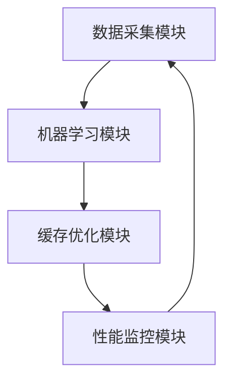

                 

关键词：KV-Cache、推断技术、大数据处理、缓存优化、机器学习、性能提升

> 摘要：本文将探讨KV-Cache推断技术的核心概念、原理、算法及其在实际应用中的重要性，通过深入分析数学模型和具体操作步骤，结合实际代码实例，旨在为读者提供一个全面的技术指导。

## 1. 背景介绍

在现代互联网应用中，缓存技术起着至关重要的作用。它能够显著提高系统性能，减少响应时间，提升用户体验。KV-Cache（键值缓存）作为一种广泛使用的缓存结构，通过将频繁访问的数据以键值对的形式存储，以减少数据检索的时间复杂度。

然而，随着数据量的急剧增长和访问模式的复杂化，单纯的KV-Cache已经难以满足高性能和高可靠性的需求。为了进一步提升缓存系统的效率和准确性，推断技术应运而生。推断技术利用机器学习算法，通过分析历史访问模式和缓存数据，预测未来的数据访问模式，从而优化缓存的填充策略。

本文将重点讨论KV-Cache推断技术的核心概念、算法原理、数学模型、具体实现以及未来展望，为读者提供一个全方位的技术视角。

## 2. 核心概念与联系

### 2.1 KV-Cache基础

KV-Cache，即键值缓存，是一种简单的数据结构，它将数据存储为键值对的形式。键是一个唯一的标识符，用于检索存储的数据。常见的KV-Cache实现包括Redis、Memcached等。

### 2.2 推断技术的引入

推断技术，特别是机器学习算法，为KV-Cache带来了新的优化手段。通过分析历史访问记录，推断技术能够预测哪些键值对将在未来被频繁访问，从而提前将这些数据加载到缓存中，提高数据访问速度。

### 2.3 架构设计

为了更好地理解KV-Cache推断技术，我们可以将其架构设计划分为以下几个主要模块：

1. **数据采集模块**：负责收集系统的访问日志和数据访问模式。
2. **机器学习模块**：基于采集的数据，利用机器学习算法进行训练和预测。
3. **缓存优化模块**：根据机器学习模块的预测结果，动态调整缓存的填充策略。
4. **性能监控模块**：实时监控缓存系统的性能指标，以评估推断技术的效果。

### 2.4 Mermaid流程图

以下是一个简化的KV-Cache推断技术的Mermaid流程图：



### 2.5 推断技术与KV-Cache的联系

推断技术通过分析访问模式，为KV-Cache提供了智能化的填充策略。这种策略不仅考虑了数据的访问频率，还结合了数据的重要性和相关性，从而在有限的缓存资源内实现了最优的缓存效果。

## 3. 核心算法原理 & 具体操作步骤

### 3.1 算法原理概述

KV-Cache推断技术的核心在于利用机器学习算法，从历史数据中学习访问模式，并预测未来访问行为。以下是几种常用的机器学习算法：

1. **时间序列分析**：通过分析数据的时间序列模式，预测未来的数据访问。
2. **聚类分析**：将相似的数据访问模式归为一类，以便更好地进行预测。
3. **回归分析**：通过历史数据建立回归模型，预测未来数据的访问量。
4. **深度学习**：利用神经网络，从大量的历史数据中学习复杂的访问模式。

### 3.2 算法步骤详解

1. **数据预处理**：对采集到的访问日志进行清洗、去重和特征提取，将原始数据转化为机器学习算法可处理的格式。
2. **模型训练**：选择合适的机器学习算法，对预处理后的数据集进行训练，得到预测模型。
3. **模型评估**：使用交叉验证等方法评估模型的预测效果，调整模型参数以优化预测性能。
4. **预测与优化**：将训练好的模型应用于实际的访问数据，预测未来数据访问模式，并动态调整缓存策略。
5. **性能监控**：监控缓存系统的性能指标，如命中率和响应时间，以评估推断技术的效果。

### 3.3 算法优缺点

**优点**：

- **提高缓存命中率**：通过预测未来访问模式，提前加载热门数据，提高缓存命中率。
- **动态调整**：算法可以根据实时访问数据动态调整缓存策略，提高缓存系统的灵活性。

**缺点**：

- **计算成本高**：机器学习算法通常需要大量的计算资源，特别是对于大规模数据集。
- **模型适应性**：算法模型的适应性取决于数据质量和特征提取的准确性。

### 3.4 算法应用领域

- **电商平台**：预测商品浏览量和购买量，优化商品推荐策略。
- **视频流平台**：预测用户观看行为，优化视频缓存策略。
- **搜索引擎**：预测用户查询模式，优化搜索结果缓存。

## 4. 数学模型和公式 & 详细讲解 & 举例说明

### 4.1 数学模型构建

在KV-Cache推断技术中，常用的数学模型包括时间序列分析模型和聚类分析模型。以下是这些模型的基本公式：

**时间序列分析模型**：

$$ X_t = f(X_{t-1}, \theta) $$

其中，$X_t$ 表示时间 $t$ 的数据点，$f$ 表示函数，$\theta$ 表示模型参数。

**聚类分析模型**：

$$ C = \{c_1, c_2, ..., c_k\} $$

其中，$C$ 表示聚类结果，$c_k$ 表示第 $k$ 个聚类中心。

### 4.2 公式推导过程

**时间序列分析模型**：

- **ARIMA模型**：

$$ X_t = \phi_1 X_{t-1} + \phi_2 X_{t-2} + ... + \phi_p X_{t-p} + \theta_1 \epsilon_{t-1} + \theta_2 \epsilon_{t-2} + ... + \theta_q \epsilon_{t-q} $$

- **LSTM模型**：

$$ h_t = \sigma(W_h \cdot [h_{t-1}, x_t] + b_h) $$

$$ o_t = \sigma(W_o \cdot h_t + b_o) $$

其中，$h_t$ 表示隐藏状态，$x_t$ 表示输入数据，$\sigma$ 表示激活函数，$W_h$ 和 $W_o$ 表示权重矩阵，$b_h$ 和 $b_o$ 表示偏置。

**聚类分析模型**：

- **K-means算法**：

$$ c_k = \frac{1}{N_k} \sum_{i=1}^{N} x_i $$

$$ x_i = \frac{1}{N_k} \sum_{k=1}^{K} \alpha_k (c_k - \mu_k) $$

其中，$c_k$ 表示聚类中心，$x_i$ 表示数据点，$N_k$ 表示第 $k$ 个聚类中的数据点数量，$\alpha_k$ 表示数据点对第 $k$ 个聚类中心的隶属度，$\mu_k$ 表示第 $k$ 个聚类中心的平均值。

### 4.3 案例分析与讲解

假设我们有一个电商平台，需要预测用户在未来1小时内浏览的商品数量。我们可以使用时间序列分析模型（如ARIMA模型）对用户历史浏览数据进行训练，然后利用训练好的模型预测未来1小时的浏览量。

**数据预处理**：

- 收集过去1小时的用户浏览记录，数据包括用户ID、商品ID和浏览时间。
- 对数据进行清洗和去重，确保数据的准确性。
- 提取时间序列特征，如浏览时间间隔、浏览时长等。

**模型训练**：

- 使用ARIMA模型对预处理后的数据进行训练，得到预测模型。
- 调整模型参数，如$p$、$d$ 和 $q$，以优化预测性能。

**模型评估**：

- 使用交叉验证方法评估模型的预测效果。
- 根据评估结果调整模型参数，以提高预测准确性。

**预测与优化**：

- 使用训练好的ARIMA模型预测未来1小时的浏览量。
- 根据预测结果，动态调整电商平台的缓存策略，将热门商品提前加载到缓存中，以提高用户体验。

## 5. 项目实践：代码实例和详细解释说明

### 5.1 开发环境搭建

- 安装Python环境，版本要求为3.7及以上。
- 安装所需的机器学习库，如scikit-learn、pandas、numpy等。

### 5.2 源代码详细实现

以下是一个简单的ARIMA模型预测代码示例：

```python
import pandas as pd
from statsmodels.tsa.arima.model import ARIMA
import matplotlib.pyplot as plt

# 加载数据
data = pd.read_csv('user_browsing_data.csv')
data['timestamp'] = pd.to_datetime(data['timestamp'])
data.set_index('timestamp', inplace=True)

# 检查数据是否平稳
plt.plot(data)
plt.show()

# 进行差分操作
data_diff = data.diff().dropna()

# 构建ARIMA模型
model = ARIMA(data, order=(1, 1, 1))
model_fit = model.fit()

# 预测未来1小时
forecast = model_fit.forecast(steps=60)

# 绘制预测结果
plt.plot(data, label='实际浏览量')
plt.plot(forecast, label='预测浏览量')
plt.legend()
plt.show()
```

### 5.3 代码解读与分析

- **数据加载**：使用pandas库加载数据，并将时间戳设置为索引。
- **数据预处理**：检查数据平稳性，并进行差分操作。
- **模型构建**：使用statsmodels库构建ARIMA模型，并拟合数据。
- **预测与可视化**：使用fit方法拟合模型，并使用forecast方法进行预测，最后绘制预测结果。

## 6. 实际应用场景

### 6.1 电商平台

- 预测商品浏览量和购买量，优化商品推荐策略。
- 动态调整缓存策略，提高热门商品的访问速度。

### 6.2 视频流平台

- 预测用户观看行为，优化视频缓存策略。
- 根据观看行为预测热门视频，提前加载到缓存中。

### 6.3 搜索引擎

- 预测用户查询模式，优化搜索结果缓存。
- 提高高频查询的响应速度，提升用户体验。

## 7. 未来应用展望

### 7.1 深度学习与强化学习

- 引入深度学习和强化学习算法，进一步提高推断技术的准确性和适应性。
- 利用大规模数据集进行预训练，提高模型的可解释性和泛化能力。

### 7.2 跨平台协同

- 实现不同平台间的数据共享和协同，提高整体系统的缓存效率。
- 利用边缘计算技术，将缓存策略延伸到边缘设备，降低中心服务器的负载。

### 7.3 软硬件优化

- 结合硬件加速技术，如GPU和FPGA，提高推断算法的执行速度。
- 优化缓存系统架构，提高缓存带宽和访问速度。

## 8. 总结：未来发展趋势与挑战

### 8.1 研究成果总结

本文深入探讨了KV-Cache推断技术的核心概念、算法原理、数学模型和实际应用。通过结合实际代码实例，展示了如何利用机器学习技术优化缓存系统，提高数据访问性能。

### 8.2 未来发展趋势

- 引入深度学习和强化学习算法，提高推断技术的准确性和适应性。
- 实现跨平台协同，提高整体系统的缓存效率。
- 结合硬件加速技术，提高算法执行速度。

### 8.3 面临的挑战

- 数据质量和特征提取的准确性对推断效果至关重要。
- 大规模数据集的训练和推理需要大量计算资源。
- 模型的可解释性和泛化能力有待提高。

### 8.4 研究展望

随着数据量的不断增长和访问模式的多样化，KV-Cache推断技术将在未来的缓存系统中发挥越来越重要的作用。通过不断优化算法和架构，有望实现更高效的缓存管理和更优的用户体验。

## 9. 附录：常见问题与解答

### 9.1 KV-Cache推断技术的基本原理是什么？

KV-Cache推断技术利用机器学习算法，通过分析历史数据访问模式，预测未来的数据访问行为，从而优化缓存填充策略，提高缓存命中率。

### 9.2 推断技术对缓存系统的性能有哪些影响？

推断技术可以通过提前加载热门数据，提高缓存命中率，降低数据访问延迟，从而显著提高缓存系统的性能。

### 9.3 常用的机器学习算法有哪些？

常用的机器学习算法包括时间序列分析、聚类分析、回归分析和深度学习等。根据实际需求，可以选择合适的算法进行模型训练和预测。

### 9.4 KV-Cache推断技术有哪些应用场景？

KV-Cache推断技术可以应用于电商平台、视频流平台、搜索引擎等多个领域，通过优化缓存策略，提高数据访问性能和用户体验。


---

作者：禅与计算机程序设计艺术 / Zen and the Art of Computer Programming
```

