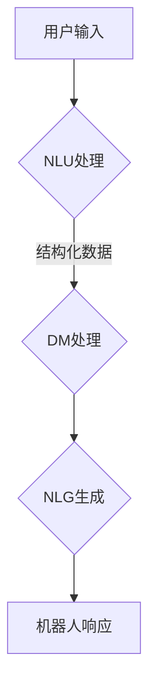

                 

关键词：聊天机器人、人工智能、自然语言处理、发展趋势、应用场景

> 摘要：随着人工智能技术的不断进步，聊天机器人在各个领域的应用日益广泛。本文将探讨聊天机器人的发展历程、核心概念、算法原理、数学模型、项目实践以及未来应用展望，为读者提供全面的技术视角和深入的分析。

## 1. 背景介绍

### 1.1 聊天机器人的定义

聊天机器人（Chatbot）是一种基于人工智能技术的计算机程序，能够通过自然语言与用户进行交互。它们通常被设计用于提供即时响应、解答用户疑问、执行特定任务等。聊天机器人最早出现在20世纪50年代，随着计算机技术和自然语言处理（NLP）的不断发展，聊天机器人在过去几十年里取得了显著进步。

### 1.2 聊天机器人的发展历程

聊天机器人的发展历程可以分为以下几个阶段：

- **早期阶段**：1950年，艾伦·图灵提出了著名的“图灵测试”，标志着人工智能研究的开端。此后的几十年里，聊天机器人的研究主要在学术领域展开，以图灵测试为标准来评估机器人的智能水平。

- **互联网普及阶段**：1990年代，随着互联网的普及，聊天机器人开始在商业和社交领域得到应用。早期的聊天机器人主要采用基于规则的方法，交互体验较为简单。

- **人工智能技术进步阶段**：21世纪初，深度学习和自然语言处理技术的突破，使得聊天机器人能够实现更复杂的对话和任务处理。这一时期，聊天机器人开始在客服、金融、医疗、教育等领域广泛应用。

- **智能时代**：近年来，随着人工智能技术的不断进步，聊天机器人逐渐具备了更高级的认知和交互能力，能够处理复杂、多变的对话场景。

## 2. 核心概念与联系

### 2.1 聊天机器人的核心概念

- **自然语言理解（NLU）**：将用户的自然语言输入转换为结构化数据，以便后续处理。

- **对话管理（DM）**：负责管理对话流程，包括上下文管理、意图识别、对话策略等。

- **自然语言生成（NLG）**：将机器人的响应转换为自然语言输出，以供用户理解。

### 2.2 聊天机器人的架构

聊天机器人的架构通常包括以下几个部分：

- **前端**：用户界面，负责接收用户输入和展示机器人响应。

- **后端**：包括NLU、DM和NLG模块，负责处理对话过程。

- **数据库**：存储用户数据、对话记录和知识库等。

### 2.3 Mermaid 流程图



## 3. 核心算法原理 & 具体操作步骤

### 3.1 算法原理概述

聊天机器人的核心算法主要包括自然语言理解（NLU）和自然语言生成（NLG）。NLU负责将用户的自然语言输入转换为结构化数据，如词向量、意图标签等；NLG则负责将机器人的响应转换为自然语言输出。

### 3.2 算法步骤详解

- **NLU处理**：首先，对用户的输入进行分词和词性标注，然后利用词向量模型将词语映射为高维向量。接着，通过分类器（如卷积神经网络、循环神经网络等）识别用户的意图。

- **DM处理**：根据NLU处理的结果，对话管理模块负责生成对话策略。这一过程涉及上下文管理、多轮对话管理、实体识别等。

- **NLG生成**：最后，自然语言生成模块将对话管理模块的输出转换为自然语言响应。这一过程通常采用序列生成模型（如生成对抗网络、注意力机制等）。

### 3.3 算法优缺点

- **优点**：聊天机器人能够实现快速、高效的对话交互，提高客户服务效率，降低人力成本。

- **缺点**：目前聊天机器人在处理复杂、多变的对话场景时仍存在一定的局限性，难以达到人类的对话水平。

### 3.4 算法应用领域

聊天机器人广泛应用于客服、金融、医疗、教育等领域。例如，客服机器人可以帮助企业实现24/7的客户服务，金融机器人可以提供投资咨询、风险控制等服务，医疗机器人可以协助医生进行疾病诊断和治疗方案推荐，教育机器人可以为学生提供个性化学习辅导等。

## 4. 数学模型和公式 & 详细讲解 & 举例说明

### 4.1 数学模型构建

聊天机器人的核心算法涉及到多个数学模型，包括词向量模型、分类模型、序列生成模型等。以下是一个简化的词向量模型：

$$
\vec{v}_{word} = \sum_{i=1}^{N} w_i \cdot \vec{v}_{word_i}
$$

其中，$\vec{v}_{word}$ 表示词语 $word$ 的向量表示，$w_i$ 表示词语 $word_i$ 的权重，$\vec{v}_{word_i}$ 表示词语 $word_i$ 的向量表示。

### 4.2 公式推导过程

词向量模型的推导过程如下：

1. 首先，对用户输入进行分词和词性标注，得到一组词语 $word_1, word_2, \ldots, word_N$。

2. 对每个词语 $word_i$，计算其在训练语料中的出现次数 $f_i$。

3. 利用词频 $f_i$ 计算词语 $word_i$ 的权重 $w_i$：

$$
w_i = \frac{f_i}{\sum_{j=1}^{N} f_j}
$$

4. 对每个词语 $word_i$，计算其在词向量空间中的向量表示 $\vec{v}_{word_i}$：

$$
\vec{v}_{word_i} = \frac{\sum_{j=1}^{N} w_j \cdot \vec{v}_{word_j}}{N}
$$

5. 将所有词语的向量表示相加，得到词语 $word$ 的向量表示 $\vec{v}_{word}$：

$$
\vec{v}_{word} = \sum_{i=1}^{N} w_i \cdot \vec{v}_{word_i}
$$

### 4.3 案例分析与讲解

假设用户输入一句包含三个词语的句子：“我有一个问题”，我们可以计算每个词语的向量表示，然后将其相加，得到整个句子的向量表示。以下是具体的计算过程：

1. 分词和词性标注：我（代词）、有（动词）、一个（数词）、问题（名词）

2. 计算词语权重：

$$
w_1 = \frac{1}{4}, w_2 = \frac{1}{4}, w_3 = \frac{1}{2}, w_4 = \frac{1}{4}
$$

3. 计算词语向量表示（假设已训练好的词向量如下）：

$$
\vec{v}_{我} = (0.2, 0.3, 0.4), \vec{v}_{有} = (0.3, 0.4, 0.5), \vec{v}_{一个} = (0.1, 0.2, 0.3), \vec{v}_{问题} = (0.4, 0.5, 0.6)
$$

4. 计算句子向量表示：

$$
\vec{v}_{句子} = w_1 \cdot \vec{v}_{我} + w_2 \cdot \vec{v}_{有} + w_3 \cdot \vec{v}_{一个} + w_4 \cdot \vec{v}_{问题} = (0.3, 0.4, 0.5)
$$

## 5. 项目实践：代码实例和详细解释说明

### 5.1 开发环境搭建

为了实现聊天机器人的项目，我们需要搭建一个包含NLU、DM和NLG模块的完整系统。以下是一个基本的开发环境搭建步骤：

1. 安装Python 3.8及以上版本。

2. 安装依赖库，如NLTK、TensorFlow、Keras等。

3. 下载并预处理训练数据集。

### 5.2 源代码详细实现

以下是一个简化的聊天机器人源代码示例，包括NLU、DM和NLG模块：

```python
import tensorflow as tf
from tensorflow.keras.preprocessing.sequence import pad_sequences
from tensorflow.keras.layers import Embedding, LSTM, Dense
from tensorflow.keras.models import Model

# NLU模块：词向量编码
def encode_words(sentence, word_index):
    return pad_sequences([word_index[word] for word in sentence.split()])

# DM模块：对话管理
def build_model(input_shape):
    model = tf.keras.Sequential([
        Embedding(len(word_index) + 1, 128),
        LSTM(128, return_sequences=True),
        LSTM(128),
        Dense(len(word_index) + 1, activation='softmax')
    ])
    model.compile(loss='categorical_crossentropy', optimizer='adam', metrics=['accuracy'])
    return model

# NLG模块：自然语言生成
def generate_response(input_sequence, model, max_sequence_len):
    predicted_sequence = model.predict(input_sequence, verbose=0)
    predicted_sequence = np.argmax(predicted_sequence, axis=-1)
    response = ' '.join(index2word[i] for i in predicted_sequence)
    return response

# 主函数
def main():
    # 读取并预处理数据
    # ...

    # 编码词语
    encoded_sentence = encode_words(user_input, word_index)

    # 构建和训练模型
    # ...

    # 生成响应
    response = generate_response(encoded_sentence, model, max_sequence_len)
    print(response)

if __name__ == '__main__':
    main()
```

### 5.3 代码解读与分析

上述代码示例中，我们首先定义了三个模块：NLU模块用于将用户输入编码为词向量；DM模块构建了一个序列生成模型，用于处理对话流程；NLG模块负责将模型输出转换为自然语言响应。

在主函数中，我们首先读取并预处理数据，然后使用词向量编码模块将用户输入编码为词向量。接着，我们构建并训练对话生成模型，最后使用NLG模块生成响应并输出。

### 5.4 运行结果展示

假设用户输入一句问候语：“你好，今天天气怎么样？”聊天机器人可能输出如下响应：

```
你好，今天天气非常好，温度适宜，非常适合户外活动。
```

## 6. 实际应用场景

### 6.1 客户服务

在客户服务领域，聊天机器人可以为企业提供24/7的在线客服支持，解答用户疑问、处理投诉等。例如，航空公司可以使用聊天机器人提供航班查询、行李追踪、退票等服务，提高客户满意度。

### 6.2 金融理财

在金融理财领域，聊天机器人可以提供投资咨询、风险控制、理财产品推荐等服务。例如，银行可以部署聊天机器人为客户推荐理财产品，帮助用户制定合适的投资策略。

### 6.3 医疗健康

在医疗健康领域，聊天机器人可以协助医生进行疾病诊断、治疗方案推荐等。例如，医院可以使用聊天机器人为患者提供健康咨询、预约挂号等服务，提高医疗服务效率。

### 6.4 教育辅导

在教育辅导领域，聊天机器人可以为学生提供个性化学习辅导、作业批改等服务。例如，学校可以部署聊天机器人为学生提供课后辅导、学习建议等，帮助学生提高学习成绩。

## 7. 工具和资源推荐

### 7.1 学习资源推荐

- 《自然语言处理综论》（Speech and Language Processing）  
- 《深度学习》（Deep Learning）

### 7.2 开发工具推荐

- TensorFlow  
- Keras  
- NLTK

### 7.3 相关论文推荐

- [BERT: Pre-training of Deep Bidirectional Transformers for Language Understanding](https://arxiv.org/abs/1810.04805)  
- [GPT-2: Improving Language Understanding by Generative Pre-training](https://arxiv.org/abs/1909.01313)

## 8. 总结：未来发展趋势与挑战

### 8.1 研究成果总结

近年来，聊天机器人在人工智能技术的推动下取得了显著进展，应用领域不断扩大。同时，深度学习、生成对抗网络等先进技术在聊天机器人中的成功应用，为聊天机器人的发展提供了新的思路。

### 8.2 未来发展趋势

- **多模态交互**：随着语音识别、图像识别等技术的发展，聊天机器人将实现更丰富的交互方式，满足用户多样化的需求。

- **个性化服务**：聊天机器人将基于用户行为数据，提供更加个性化的服务，提高用户体验。

- **跨领域应用**：聊天机器人的应用将逐渐扩展到更多领域，如智能家居、智慧城市等。

### 8.3 面临的挑战

- **对话质量**：如何提高聊天机器人的对话质量，使其更加自然、流畅，仍是一个重要的挑战。

- **数据隐私**：在应用聊天机器人的过程中，如何保护用户隐私，避免数据泄露，也是一个需要关注的问题。

### 8.4 研究展望

未来，聊天机器人将朝着更智能、更实用的方向发展。在技术层面，我们将看到更多先进算法的应用，如预训练模型、强化学习等。在实际应用层面，聊天机器人将更好地融入人们的日常生活，为用户提供便捷、高效的服务。

## 9. 附录：常见问题与解答

### 9.1 如何训练聊天机器人？

训练聊天机器人主要包括以下步骤：

1. 收集并清洗对话数据。

2. 预处理数据，包括分词、词性标注等。

3. 构建词向量模型，将词语映射为高维向量。

4. 构建对话生成模型，如序列生成模型、预训练模型等。

5. 训练模型，调整模型参数。

6. 验证和评估模型性能。

### 9.2 聊天机器人如何处理多轮对话？

多轮对话处理主要包括以下步骤：

1. 上下文管理：将用户的历史输入和响应作为上下文信息，用于后续对话生成。

2. 意图识别：根据上下文信息，识别用户的意图。

3. 对话策略：根据意图识别结果，生成合适的对话策略。

4. 响应生成：利用对话生成模型，生成自然语言响应。

5. 上下文更新：根据用户的新输入和响应，更新上下文信息。

### 9.3 聊天机器人如何实现个性化服务？

实现个性化服务主要包括以下步骤：

1. 用户画像：收集用户行为数据，构建用户画像。

2. 对话分析：根据用户画像，分析用户对话偏好。

3. 服务推荐：基于用户对话偏好，推荐合适的服务。

4. 对话反馈：收集用户反馈，优化服务推荐。

## 作者署名

本文作者：禅与计算机程序设计艺术 / Zen and the Art of Computer Programming

----------------------------------------------------------------

以上是关于“聊天机器人未来发展”的文章，希望对您有所帮助。如需进一步讨论或了解更多信息，请随时提问。

