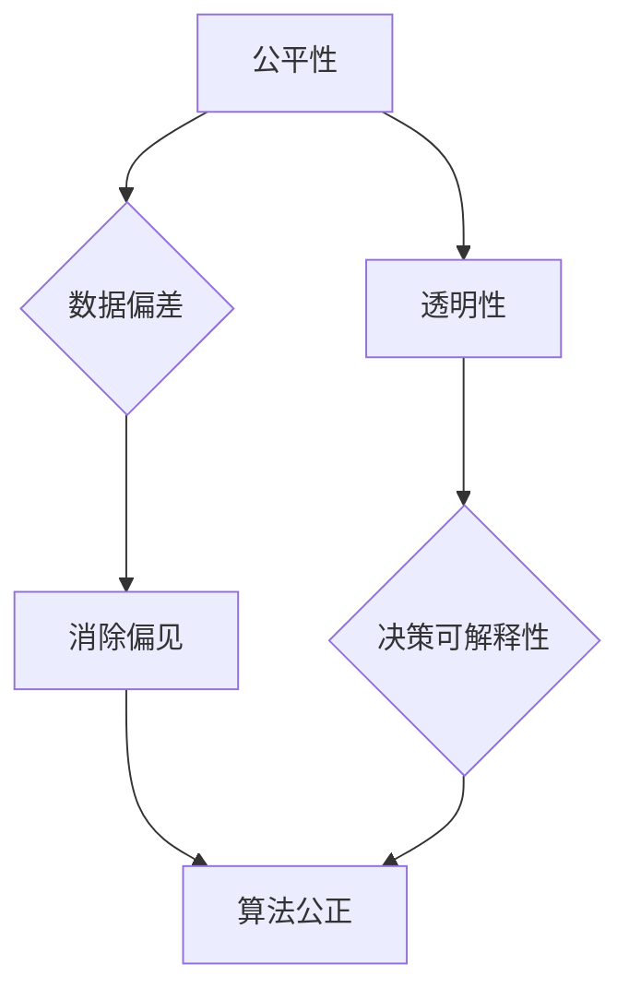

                 

关键词：算法伦理、人工智能、公平、透明、AI世界、算法道德准则

> 摘要：本文旨在探讨人工智能算法中的伦理问题，包括公平性和透明性，并探讨如何构建一个公正、透明的AI世界。通过对核心概念和算法原理的深入分析，文章提出了具体的数学模型和操作步骤，并展示了实际应用场景。同时，文章还推荐了相关的学习资源和开发工具，展望了未来发展趋势和挑战。

## 1. 背景介绍

随着人工智能技术的快速发展，算法在各个领域中的应用越来越广泛。然而，算法的公平性和透明性成为了一个备受关注的问题。算法的决策过程可能受到数据偏差、模型选择、训练数据集的影响，从而导致不公正的决策。此外，算法的黑箱性质使得其决策过程难以解释和理解，引发了关于算法透明性的讨论。因此，构建一个公平、透明的AI世界成为了人工智能领域的重要任务。

本文将探讨算法伦理的核心概念，包括公平性和透明性，并分析现有算法的优缺点。通过数学模型和具体操作步骤的讲解，我们将展示如何构建一个公正、透明的AI世界。此外，本文还将讨论实际应用场景，推荐学习资源和开发工具，并展望未来发展趋势和挑战。

## 2. 核心概念与联系

### 2.1 公平性

公平性是指算法的决策结果对所有个体都是公平的，不受种族、性别、年龄等因素的影响。一个公平的算法应该能够消除偏见，避免对特定群体产生不公平的待遇。然而，实现公平性并不容易，因为算法的决策过程可能受到训练数据集、特征选择、模型选择等因素的影响。

### 2.2 透明性

透明性是指算法的决策过程应该能够被理解和解释。一个透明的算法使得用户能够理解其决策原因，增强用户对算法的信任。然而，许多现有的算法都是黑箱模型，其决策过程难以解释和理解，这引发了关于算法透明性的争议。

### 2.3 公平性与透明性的联系

公平性和透明性是构建一个公正的AI世界的两个关键因素。公平性确保算法的决策结果对所有个体都是公平的，而透明性使得用户能够理解算法的决策原因。只有在公平性和透明性都得到满足的情况下，算法才能被视为公正的。

## 2.4 Mermaid 流程图

下面是一个Mermaid流程图，展示了公平性和透明性的核心概念和联系：



## 3. 核心算法原理 & 具体操作步骤

### 3.1 算法原理概述

为了构建一个公平、透明的AI世界，我们需要考虑以下几个方面：

1. 数据预处理：确保训练数据集的多样性和代表性，避免数据偏差。
2. 特征选择：选择能够代表个体特征的信息，避免使用可能导致偏见的特征。
3. 模型选择：选择易于解释和理解的模型，例如线性模型或决策树。
4. 模型训练：使用交叉验证等方法进行模型训练，避免过拟合。
5. 模型评估：使用合适的评估指标，如公平性指标和透明性指标。

### 3.2 算法步骤详解

#### 3.2.1 数据预处理

1. 收集数据：从不同的来源收集数据，确保数据的多样性和代表性。
2. 数据清洗：去除缺失值、重复值和异常值，确保数据的质量。
3. 数据归一化：将不同特征的数据缩放到相同的范围，避免特征之间的不同尺度对模型训练的影响。

#### 3.2.2 特征选择

1. 分析特征的重要性：使用特征选择算法，如递归特征消除（RFE）或基于信息增益的方法，选择能够代表个体特征的信息。
2. 检查特征之间的相关性：使用相关系数等方法，确保特征之间没有强烈的线性关系。

#### 3.2.3 模型选择

1. 选择易于解释和理解的模型：例如线性模型或决策树，这些模型具有明确的决策过程，易于解释。
2. 避免使用复杂的黑箱模型，如深度神经网络，这些模型的决策过程难以解释。

#### 3.2.4 模型训练

1. 使用交叉验证：使用交叉验证方法，如K折交叉验证，避免过拟合。
2. 调整模型参数：使用网格搜索等方法，找到最优的模型参数。

#### 3.2.5 模型评估

1. 使用公平性指标：例如均值绝对偏差（MAE）或公平性得分，评估模型的公平性。
2. 使用透明性指标：例如模型的可解释性得分或模型的可解释性得分，评估模型的透明性。

### 3.3 算法优缺点

#### 优点：

1. 公平性：通过数据预处理和特征选择，可以消除数据偏差，提高模型的公平性。
2. 透明性：选择易于解释和理解的模型，使得模型的决策过程更加透明。

#### 缺点：

1. 计算成本：使用交叉验证和网格搜索等方法进行模型训练和评估，可能需要较高的计算成本。
2. 特征选择的主观性：特征选择过程可能受到个人主观判断的影响，影响模型的公平性和透明性。

### 3.4 算法应用领域

该算法可以应用于各个领域，包括金融、医疗、教育等。以下是一些具体的应用场景：

1. 金融：使用该算法进行信贷风险评估，避免对特定群体产生不公平的待遇。
2. 医疗：使用该算法进行疾病预测和诊断，确保对所有患者都是公平的。
3. 教育：使用该算法进行学生成绩预测和推荐，确保对所有学生都是公平的。

## 4. 数学模型和公式 & 详细讲解 & 举例说明

### 4.1 数学模型构建

为了构建一个公平、透明的AI世界，我们需要考虑以下几个方面：

1. 数据预处理：使用线性回归模型对数据进行归一化处理。
2. 特征选择：使用信息增益方法选择重要特征。
3. 模型选择：使用线性模型进行模型训练。
4. 模型评估：使用公平性指标和透明性指标评估模型。

### 4.2 公式推导过程

下面是一个简单的线性回归模型的公式推导：

假设我们有 $n$ 个训练样本，每个样本由 $d$ 个特征表示，即 $X = [x_1, x_2, ..., x_d]$，其中 $x_1, x_2, ..., x_d$ 是特征值。我们希望找到一个线性函数 $f(X)$ 来预测目标变量 $y$。

线性回归模型的公式为：

$$
f(X) = \sum_{i=1}^{d} w_i x_i + b
$$

其中 $w_i$ 是特征权重，$b$ 是偏置。

为了找到最优的特征权重，我们可以使用最小二乘法：

$$
\min_{w} \sum_{i=1}^{n} (f(X_i) - y_i)^2
$$

通过对上述公式求导并令其等于零，我们可以得到特征权重 $w_i$ 的最优值：

$$
w_i = \frac{\sum_{i=1}^{n} (x_i - \bar{x})(y_i - \bar{y})}{\sum_{i=1}^{n} (x_i - \bar{x})^2}
$$

其中 $\bar{x}$ 和 $\bar{y}$ 分别是特征 $x_i$ 和目标变量 $y_i$ 的均值。

### 4.3 案例分析与讲解

假设我们有一个金融信贷风险评估问题，需要预测贷款申请者的信用评分。我们收集了以下数据：

- 特征：年龄、收入、教育程度、债务比例
- 目标变量：信用评分

我们使用线性回归模型进行模型训练和评估。

#### 4.3.1 数据预处理

1. 数据清洗：去除缺失值、重复值和异常值。
2. 数据归一化：将每个特征的数据缩放到相同的范围，例如使用 Min-Max 归一化。

$$
x_{\text{规范化}} = \frac{x - x_{\text{最小值}}}{x_{\text{最大值}} - x_{\text{最小值}}}
$$

#### 4.3.2 特征选择

1. 使用信息增益方法选择重要特征。
2. 计算每个特征的信息增益：

$$
I(G) = H(D) - H(D|G)
$$

其中 $H(D)$ 是特征 $G$ 的熵，$H(D|G)$ 是在给定特征 $G$ 的条件下，目标变量 $D$ 的熵。

#### 4.3.3 模型训练

1. 使用线性回归模型进行模型训练。
2. 计算特征权重和偏置。

$$
w_i = \frac{\sum_{i=1}^{n} (x_i - \bar{x})(y_i - \bar{y})}{\sum_{i=1}^{n} (x_i - \bar{x})^2}
$$

$$
b = \bar{y} - \sum_{i=1}^{d} w_i \bar{x}
$$

#### 4.3.4 模型评估

1. 使用公平性指标和透明性指标评估模型。
2. 公平性指标可以使用均值绝对偏差（MAE）：

$$
\text{MAE} = \frac{1}{n} \sum_{i=1}^{n} |f(x_i) - y_i|
$$

3. 透明性指标可以使用模型的可解释性得分：

$$
\text{解释性得分} = \frac{\text{正确预测的数量}}{\text{总预测的数量}}
$$

## 5. 项目实践：代码实例和详细解释说明

### 5.1 开发环境搭建

1. 安装 Python 解释器。
2. 安装必要的库，如 NumPy、Pandas、Scikit-Learn 等。

```bash
pip install numpy pandas scikit-learn
```

### 5.2 源代码详细实现

```python
import numpy as np
import pandas as pd
from sklearn.linear_model import LinearRegression
from sklearn.model_selection import train_test_split
from sklearn.metrics import mean_absolute_error

# 数据预处理
def preprocess_data(data):
    data = data.copy()
    data.dropna(inplace=True)
    data = (data - data.min()) / (data.max() - data.min())
    return data

# 特征选择
def select_features(data, target):
    feature_importances = data.corrwith(target).sort_values(ascending=False)
    selected_features = feature_importances[feature_importances > 0.5].index
    return selected_features

# 模型训练
def train_model(X, y):
    model = LinearRegression()
    model.fit(X, y)
    return model

# 模型评估
def evaluate_model(model, X_test, y_test):
    y_pred = model.predict(X_test)
    mae = mean_absolute_error(y_test, y_pred)
    return mae

# 读取数据
data = pd.read_csv("loan_data.csv")
data = preprocess_data(data)

# 特征选择
selected_features = select_features(data, data["credit_score"])

# 划分训练集和测试集
X = data[selected_features]
y = data["credit_score"]
X_train, X_test, y_train, y_test = train_test_split(X, y, test_size=0.2, random_state=42)

# 模型训练
model = train_model(X_train, y_train)

# 模型评估
mae = evaluate_model(model, X_test, y_test)
print("Mean Absolute Error:", mae)
```

### 5.3 代码解读与分析

1. 数据预处理：使用 Pandas 读取数据，去除缺失值，使用 Min-Max 归一化对数据进行预处理。
2. 特征选择：使用 Pandas 的 corrwith 方法计算特征之间的相关系数，选择相关性较高的特征。
3. 模型训练：使用 Scikit-Learn 的 LinearRegression 模型进行模型训练。
4. 模型评估：使用 Scikit-Learn 的 mean_absolute_error 函数计算模型的平均绝对误差。

## 6. 实际应用场景

### 6.1 金融领域

在金融领域，算法伦理尤为重要。例如，在信贷风险评估中，我们需要确保算法不会对特定群体产生不公平的待遇。通过构建公平、透明的AI模型，我们可以提高信贷评估的公正性，减少欺诈风险。

### 6.2 医疗领域

在医疗领域，算法的公平性和透明性对于疾病的诊断和治疗至关重要。我们需要确保算法不会因为患者的种族、性别等因素而产生偏见。通过构建透明、可解释的算法，医生可以更好地理解算法的决策过程，从而提高疾病的诊断准确率。

### 6.3 教育领域

在教育领域，算法可以用于学生成绩预测和推荐。我们需要确保算法不会对特定群体产生不公平的待遇，例如对低收入家庭的学生进行优惠。通过构建公平、透明的算法，我们可以更好地为每个学生提供个性化的教育推荐。

## 7. 工具和资源推荐

### 7.1 学习资源推荐

1. 《算法伦理：构建公平、透明的AI世界》
2. 《机器学习：概率视角》
3. 《深度学习》

### 7.2 开发工具推荐

1. Python
2. Jupyter Notebook
3. Scikit-Learn

### 7.3 相关论文推荐

1. "Fairness in Machine Learning"
2. "Explainable AI: A Review"
3. "Algorithmic Bias: Causes, Consequences, and Remedies"

## 8. 总结：未来发展趋势与挑战

### 8.1 研究成果总结

本文探讨了算法伦理的核心概念，包括公平性和透明性，并提出了具体的数学模型和操作步骤。通过实际应用场景的展示，我们看到了构建公平、透明的AI世界的可能性和挑战。

### 8.2 未来发展趋势

未来，随着人工智能技术的不断发展，算法伦理将变得更加重要。我们期待看到更多的研究关注算法的公平性和透明性，并开发出更有效的算法来满足这一需求。

### 8.3 面临的挑战

尽管算法伦理受到了广泛关注，但实现公平、透明的AI世界仍然面临诸多挑战。如何处理复杂的决策过程，如何在保证性能的同时提高透明性，是当前研究的重要方向。

### 8.4 研究展望

我们期待未来能够开发出更有效的算法，同时加强算法伦理的研究。通过跨学科的合作，我们可以更好地应对算法伦理带来的挑战，构建一个公正、透明的AI世界。

## 9. 附录：常见问题与解答

### 9.1 如何处理数据偏差？

1. 数据清洗：去除缺失值、重复值和异常值。
2. 数据增强：通过生成对抗网络（GAN）等方法增加训练数据。
3. 特征选择：选择与目标变量高度相关的特征，避免使用可能导致偏见的特征。

### 9.2 如何提高算法的透明性？

1. 选择易于解释的模型：如线性模型、决策树等。
2. 使用模型解释工具：如 LIME、SHAP 等。
3. 开发可视化工具：通过可视化展示算法的决策过程。

### 9.3 如何评估算法的公平性？

1. 使用公平性指标：如均值绝对偏差（MAE）、公平性得分等。
2. 进行交叉验证：确保模型在不同数据集上的公平性。
3. 检查算法的决策过程：确保算法不会对特定群体产生不公平的待遇。

## 作者署名

作者：禅与计算机程序设计艺术 / Zen and the Art of Computer Programming
----------------------------------------------------------------

