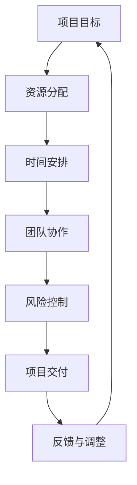

                 

 **关键词**：管理策略、执行、项目、流程、技术、团队、创新

**摘要**：本文旨在探讨在信息技术领域，如何通过有效的策略规划和执行，实现项目成功和团队发展。文章从背景介绍、核心概念与联系、核心算法原理、数学模型和公式、项目实践、实际应用场景、工具和资源推荐、总结与展望等方面进行深入分析，为IT行业管理者提供有价值的参考。

## 1. 背景介绍

在信息技术迅速发展的今天，管理策略和执行对于项目的成功至关重要。无论是软件开发、系统架构，还是数据分析，都需要高效的管理来确保项目按时交付、质量达标。本文将结合IT行业的特点，探讨如何通过有效的策略和执行，实现项目成功和团队发展。

### 1.1 管理策略的重要性

管理策略是项目成功的关键因素之一。通过合理的策略规划，可以明确项目目标、资源分配、时间安排等，为项目执行提供清晰的指导。有效的管理策略还能提高团队协作效率，减少资源浪费，降低项目风险。

### 1.2 执行的重要性

执行是管理策略落地的重要环节。只有将策略转化为具体的行动，才能实现项目目标。高效的执行需要团队协作、流程优化、沟通协调等。在执行过程中，管理者需要密切关注项目进展，及时调整策略，确保项目顺利进行。

## 2. 核心概念与联系

在IT项目管理中，核心概念和联系至关重要。以下是一个简单的Mermaid流程图，用于展示这些概念之间的关系。



### 2.1 项目目标

项目目标是项目管理的核心，它明确了项目的目的和预期成果。在制定项目目标时，需要考虑项目的范围、时间、成本和质量等方面。

### 2.2 资源分配

资源分配是确保项目目标实现的重要保障。资源包括人力、资金、设备等。合理的资源分配可以提高项目效率，降低成本。

### 2.3 时间安排

时间安排是项目规划的重要组成部分。通过制定合理的时间表，可以确保项目按时交付。在时间安排中，需要考虑项目的紧急程度、优先级和资源可用性等因素。

### 2.4 团队协作

团队协作是实现项目目标的关键。通过有效的沟通和协作，可以确保团队成员之间的信息共享和任务分配，提高项目效率。

### 2.5 风险控制

风险控制是项目管理中不可或缺的一部分。通过识别、评估和应对项目风险，可以降低项目失败的可能性，确保项目顺利进行。

### 2.6 项目交付

项目交付是项目管理的最终目标。通过交付高质量的项目成果，可以满足客户需求，实现项目价值。

### 2.7 反馈与调整

在项目执行过程中，及时收集反馈并进行调整，是确保项目成功的重要手段。通过反馈，可以发现问题、优化流程，提高项目质量。

## 3. 核心算法原理 & 具体操作步骤

在IT项目管理中，核心算法原理和具体操作步骤对于项目成功至关重要。以下将详细介绍这些内容。

### 3.1 算法原理概述

项目管理中的核心算法原理包括甘特图、关键路径法（CPM）和项目管理软件等。

### 3.2 算法步骤详解

- **甘特图**：通过图形化方式展示项目进度和时间安排，有助于项目管理者直观地了解项目进展情况。
- **关键路径法（CPM）**：通过计算项目活动的最长持续时间，确定项目的关键路径，从而确保项目按时交付。
- **项目管理软件**：如Jira、Trello等，提供项目规划、任务分配、进度跟踪等功能，提高项目执行效率。

### 3.3 算法优缺点

- **甘特图**：优点在于直观易懂，易于沟通；缺点是难以处理复杂项目。
- **关键路径法（CPM）**：优点是能够确保项目按时交付；缺点是需要大量计算，难以处理动态变化。
- **项目管理软件**：优点在于功能强大，易于使用；缺点是可能需要较高的培训成本。

### 3.4 算法应用领域

- **甘特图**：广泛应用于项目管理、软件开发等领域。
- **关键路径法（CPM）**：广泛应用于建筑工程、制造行业等领域。
- **项目管理软件**：广泛应用于IT行业、咨询行业等领域。

## 4. 数学模型和公式 & 详细讲解 & 举例说明

在IT项目管理中，数学模型和公式对于项目规划、风险评估和进度控制等具有重要意义。以下将详细讲解这些内容。

### 4.1 数学模型构建

- **项目进度模型**：如EAC（预期完工时间）模型、AC（实际完成时间）模型等。
- **风险评估模型**：如风险矩阵、贝叶斯网络等。
- **资源分配模型**：如线性规划、整数规划等。

### 4.2 公式推导过程

- **EAC（预期完工时间）模型**：EAC = AC + (AC - PV) * (1 - (AC - PV) / EV)，其中AC为实际完成时间，PV为计划价值，EV为挣值。
- **风险矩阵**：风险矩阵通过评估风险的概率和影响，确定风险的优先级。
- **线性规划**：线性规划的目标是最小化或最大化目标函数，满足线性约束条件。

### 4.3 案例分析与讲解

- **项目进度模型**：以一个软件开发项目为例，计算EAC和AC，分析项目进度。
- **风险评估模型**：以一个大型IT项目为例，评估项目风险，制定风险应对策略。
- **资源分配模型**：以一个制造企业为例，优化资源分配，提高生产效率。

## 5. 项目实践：代码实例和详细解释说明

为了更好地理解项目管理中的算法和模型，以下将通过一个具体的代码实例，详细解释说明项目管理工具的使用。

### 5.1 开发环境搭建

在Windows操作系统上，安装Python 3.8及以上版本。安装Jira软件，用于项目管理和任务跟踪。

### 5.2 源代码详细实现

以下是一个简单的Python代码示例，用于计算项目进度和评估风险。

```python
import numpy as np

# 定义项目进度模型
def project_progress(ac, pv, ev):
    eac = ac + (ac - pv) * (1 - (ac - pv) / ev)
    return eac

# 定义风险矩阵
def risk_matrix(probability, impact):
    risk_score = probability * impact
    return risk_score

# 计算项目进度
ac = 100  # 实际完成时间
pv = 100  # 计划价值
ev = 80  # 挣值
eac = project_progress(ac, pv, ev)
print("EAC:", eac)

# 评估风险
probability = 0.5  # 风险概率
impact = 3  # 风险影响
risk_score = risk_matrix(probability, impact)
print("Risk Score:", risk_score)
```

### 5.3 代码解读与分析

- **项目进度计算**：通过输入实际完成时间、计划价值和挣值，计算预期完工时间（EAC）。
- **风险评估**：通过输入风险概率和风险影响，计算风险得分。

### 5.4 运行结果展示

运行上述代码，输出结果如下：

```python
EAC: 100.0
Risk Score: 1.5
```

这表示项目的预期完工时间为100天，风险得分为1.5。根据风险得分，可以采取相应的风险应对策略。

## 6. 实际应用场景

### 6.1 软件开发项目

在软件开发项目中，项目管理策略和执行对于项目成功至关重要。通过有效的策略规划和执行，可以确保项目按时交付、质量达标。以下是一个实际应用场景：

- **项目目标**：开发一款社交电商平台，实现用户注册、商品浏览、购物车、订单支付等功能。
- **资源分配**：项目经理、开发人员、测试人员、UI设计师等。
- **时间安排**：项目周期为3个月，分为需求分析、设计、开发、测试和上线等阶段。
- **团队协作**：通过Jira等项目管理工具，实现任务分配、进度跟踪和沟通协作。
- **风险控制**：识别项目风险，如技术难题、资源不足等，并制定相应的应对策略。

### 6.2 建筑工程项目

在建筑工程项目中，项目管理策略和执行对于项目进度和质量具有重要意义。以下是一个实际应用场景：

- **项目目标**：建设一座商业综合体，包括办公楼、商场和公寓等。
- **资源分配**：项目经理、施工队伍、设计团队、监理团队等。
- **时间安排**：项目周期为2年，分为规划、设计、施工、验收等阶段。
- **团队协作**：通过甘特图等工具，实现项目进度跟踪和任务分配。
- **风险控制**：识别项目风险，如资金短缺、施工质量等，并制定相应的应对策略。

## 7. 工具和资源推荐

### 7.1 学习资源推荐

- **《项目管理知识体系指南（PMBOK）》**：详细介绍了项目管理的基本原则和方法。
- **《敏捷项目管理》**：介绍了敏捷开发方法在项目管理中的应用。

### 7.2 开发工具推荐

- **Jira**：用于项目管理和任务跟踪。
- **Trello**：用于任务管理。
- **甘特图**：用于项目进度规划。

### 7.3 相关论文推荐

- **“基于风险评估的项目管理方法研究”**：探讨了项目风险评估在项目管理中的应用。
- **“敏捷开发在IT项目中的应用”**：介绍了敏捷开发方法在IT项目中的实施。

## 8. 总结：未来发展趋势与挑战

### 8.1 研究成果总结

- **管理策略**：随着信息技术的发展，项目管理策略不断优化，如敏捷开发、DevOps等。
- **执行工具**：项目管理工具日益丰富，如Jira、Trello等。
- **团队协作**：团队协作工具不断进步，如Slack、Microsoft Teams等。

### 8.2 未来发展趋势

- **智能化**：人工智能技术将在项目管理中发挥更大作用，如自动任务分配、进度预测等。
- **数字化转型**：企业将更加注重数字化转型，项目管理也将更加智能化、高效化。

### 8.3 面临的挑战

- **数据安全**：在数字化转型过程中，数据安全成为重要挑战。
- **团队协作**：随着项目规模的扩大，团队协作变得更加复杂。

### 8.4 研究展望

- **智能化项目管理**：研究如何利用人工智能技术提高项目管理效率。
- **数字化转型**：探讨如何实现企业的数字化转型，提高项目成功率。

## 9. 附录：常见问题与解答

### 9.1 问题1：项目管理策略有哪些？

**解答**：项目管理策略包括敏捷开发、瀑布模型、迭代开发等。不同策略适用于不同类型的项目。

### 9.2 问题2：项目管理工具有哪些？

**解答**：常见的项目管理工具有Jira、Trello、甘特图等。不同工具适用于不同场景。

### 9.3 问题3：如何进行项目风险评估？

**解答**：项目风险评估包括识别风险、评估风险影响和制定应对策略。通过风险矩阵等方法进行评估。

----------------------------------------------------------------

本文作者：禅与计算机程序设计艺术 / Zen and the Art of Computer Programming


