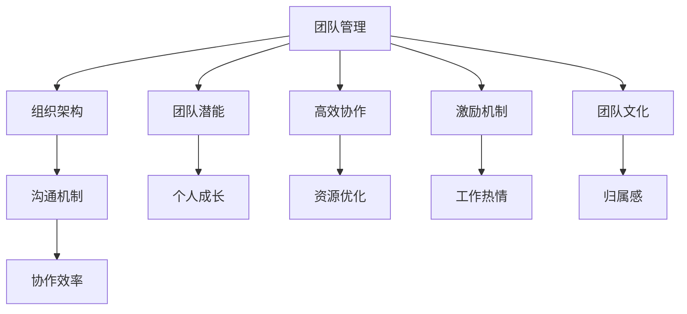

                 

 关键词：团队管理、团队潜能、高效协作、领导力、技术团队管理、组织架构、激励机制、团队文化、协作工具、项目管理和流程优化

> 摘要：本文旨在探讨如何通过管理的智慧，激发团队潜能，提升团队协作效率。在IT领域，团队管理的重要性不言而喻，如何构建一个高效协作的团队，成为每个组织面临的重要挑战。本文将结合实际案例，深入分析团队管理的核心概念、方法论和最佳实践，为读者提供有益的启示。

## 1. 背景介绍

在当今快速变化的科技环境中，IT团队的角色日益重要。从软件开发到人工智能，从云计算到大数据，技术团队是推动企业创新和竞争力的核心力量。然而，如何管理一个具有高智商、高技能，却可能缺乏纪律和协作精神的团队，成为众多CTO、项目经理和团队领导面临的难题。

团队管理的核心问题包括：如何激发团队成员的潜能、如何建立有效的沟通机制、如何优化组织架构、如何制定合理的激励机制等。这些问题不仅影响到团队的日常运作，更关系到组织的长远发展和竞争力。

本文将围绕这些核心问题，探讨团队管理的智慧。通过分析优秀团队的案例，总结出一些行之有效的管理策略，旨在为读者提供实用的指导和借鉴。

## 2. 核心概念与联系

### 2.1 团队管理定义

团队管理是指通过计划、组织、领导、协调和控制等手段，有效地利用团队成员的技能和资源，实现团队目标的过程。它不仅涉及到技术和业务层面的管理，还包括人际关系和沟通方面的管理。

### 2.2 团队潜能

团队潜能是指团队成员在特定环境和条件下，能够发挥的最大能力和潜力。激发团队潜能的核心在于为团队成员提供成长机会、发挥特长和实现个人价值的平台。

### 2.3 高效协作

高效协作是指团队成员在相互配合、相互支持的过程中，实现资源的最优配置和协同工作，从而提高团队整体绩效。高效协作的关键在于建立良好的沟通机制和协作文化。

### 2.4 组织架构

组织架构是指组织内部的部门划分、职责分工和管理层级等结构安排。合理的组织架构有助于明确团队成员的角色和责任，优化工作流程，提高协作效率。

### 2.5 激励机制

激励机制是指通过奖励、晋升、培训等手段，激发团队成员的工作热情和创造力，实现个人与团队的共同成长。有效的激励机制能够增强团队的凝聚力和战斗力。

### 2.6 团队文化

团队文化是指团队成员在长期合作过程中形成的共同价值观、行为准则和工作方式。优秀的团队文化能够增强团队成员的归属感和认同感，提高团队协作效率。

### 2.7 Mermaid 流程图

以下是一个简化的Mermaid流程图，展示团队管理中的关键概念和它们之间的联系：



## 3. 核心算法原理 & 具体操作步骤

### 3.1 算法原理概述

团队管理的核心算法原理可以概括为以下几点：

1. **需求识别**：了解团队成员的需求和期望，为团队管理提供基础数据。
2. **目标设定**：明确团队的目标和愿景，确保团队工作的方向和动力。
3. **资源分配**：根据团队目标和需求，合理分配资源和任务，优化工作流程。
4. **激励机制**：制定有效的激励机制，激发团队成员的积极性和创造力。
5. **沟通协作**：建立良好的沟通机制，促进团队成员之间的协作和信息共享。
6. **反馈与改进**：持续收集反馈，不断优化团队管理策略和流程。

### 3.2 算法步骤详解

1. **需求识别**：

   - **数据分析**：通过调查问卷、访谈等方式，收集团队成员的需求和期望。
   - **需求分析**：对收集到的数据进行分析，识别出关键需求和问题。

2. **目标设定**：

   - **愿景制定**：明确团队的长期愿景和短期目标。
   - **目标分解**：将整体目标分解为具体的可执行任务。
   - **目标确认**：与团队成员共同确认目标，确保共识。

3. **资源分配**：

   - **资源评估**：评估团队内部外的资源状况，包括人力、资金、技术等。
   - **任务分配**：根据资源状况和任务需求，合理分配任务。
   - **流程优化**：优化工作流程，减少不必要的环节，提高工作效率。

4. **激励机制**：

   - **奖励机制**：制定奖励政策，激励团队成员的工作积极性。
   - **晋升机制**：建立晋升机制，为团队成员提供职业发展机会。
   - **培训机制**：提供培训和学习机会，提升团队成员的技能和知识。

5. **沟通协作**：

   - **沟通工具**：选择合适的沟通工具，如邮件、即时通讯、视频会议等。
   - **信息共享**：建立信息共享平台，确保团队成员能够及时获取相关信息。
   - **协作机制**：制定协作规范，明确团队成员的协作方式和责任。

6. **反馈与改进**：

   - **定期反馈**：定期收集团队成员的反馈，了解团队管理的实际效果。
   - **问题解决**：针对反馈中存在的问题，及时采取改进措施。
   - **持续优化**：根据反馈和改进结果，不断优化团队管理策略和流程。

### 3.3 算法优缺点

**优点**：

- **提高效率**：通过优化工作流程和资源分配，提高团队工作效率。
- **激发潜能**：通过激励机制和培训，激发团队成员的潜能和创造力。
- **增强凝聚力**：通过沟通协作和团队文化建设，增强团队的凝聚力和归属感。

**缺点**：

- **管理难度**：团队管理需要投入大量时间和精力，管理难度较高。
- **依赖人力资源**：团队管理的效果很大程度上依赖于团队成员的素质和能力。
- **管理风险**：管理策略不当可能导致团队士气低落，影响工作效率。

### 3.4 算法应用领域

- **软件开发团队**：通过优化团队管理，提高软件开发的效率和质量。
- **产品研发团队**：通过团队管理，加速产品研发进程，提高市场竞争力。
- **技术支持团队**：通过团队管理，提高客户服务质量，提升客户满意度。
- **运维团队**：通过团队管理，优化系统运维流程，确保系统稳定运行。

## 4. 数学模型和公式 & 详细讲解 & 举例说明

### 4.1 数学模型构建

在团队管理中，可以构建一个简单的数学模型来描述团队效能。假设团队效能 \(E\) 受到以下几个因素影响：

- 成员能力 \(A\)
- 团队协作 \(C\)
- 激励机制 \(M\)
- 沟通效率 \(I\)

则团队效能可以表示为：

\[ E = f(A, C, M, I) \]

其中，\(f\) 是一个复合函数，表示团队效能与各个因素之间的关系。

### 4.2 公式推导过程

1. 成员能力 \(A\)：

   成员能力可以通过成员的技能水平、工作经验和知识储备来衡量。假设成员能力 \(A\) 的取值范围在 [0, 1] 之间，表示成员能力的强弱。

2. 团队协作 \(C\)：

   团队协作可以通过团队成员之间的配合度、沟通质量和协作效率来衡量。假设团队协作 \(C\) 的取值范围在 [0, 1] 之间，表示团队协作的好坏。

3. 激励机制 \(M\)：

   激励机制可以通过奖励政策、晋升机会和培训机制来衡量。假设激励机制 \(M\) 的取值范围在 [0, 1] 之间，表示激励机制的有效性。

4. 沟通效率 \(I\)：

   沟通效率可以通过沟通工具的选用、信息传递的速度和质量来衡量。假设沟通效率 \(I\) 的取值范围在 [0, 1] 之间，表示沟通效率的高低。

结合以上因素，我们可以推导出团队效能的计算公式：

\[ E = A \times C \times M \times I \]

### 4.3 案例分析与讲解

假设我们有一个由4名成员组成的软件开发团队，成员能力、团队协作、激励机制和沟通效率的评估结果如下：

- 成员能力 \(A\)：0.9
- 团队协作 \(C\)：0.8
- 激励机制 \(M\)：0.7
- 沟通效率 \(I\)：0.9

根据团队效能的计算公式，我们可以计算出该团队的效能：

\[ E = 0.9 \times 0.8 \times 0.7 \times 0.9 = 0.5016 \]

这意味着该团队的整体效能较高，约为50.16%。通过分析各个因素的具体得分，我们可以发现团队协作和沟通效率是影响效能的主要因素。因此，我们可以针对这两个方面进行优化，例如加强团队培训，提高成员之间的沟通能力。

## 5. 项目实践：代码实例和详细解释说明

### 5.1 开发环境搭建

为了更好地理解团队管理的实际应用，我们选择一个具体的案例——一个基于GitLab的持续集成（CI）项目。首先，我们需要搭建一个合适的技术栈：

- **操作系统**：Linux（如Ubuntu 20.04）
- **编程语言**：Python（3.8及以上版本）
- **版本控制**：Git（2.30.0及以上版本）
- **持续集成工具**：GitLab CI/CD

确保安装了以上工具后，我们可以开始搭建开发环境。

### 5.2 源代码详细实现

以下是一个简化的GitLab CI配置文件示例，用于自动化测试和部署：

```yaml
image: python:3.8

stages:
  - test
  - deploy

test:
  stage: test
  script:
    - pip install -r requirements.txt
    - pytest
  artifacts:
    paths:
      - reports/*.html
  only:
    - master

deploy:
  stage: deploy
  script:
    - python manage.py migrate
    - python manage.py collectstatic --noinput
    - supervisorctl restart gunicorn
  only:
    - master
```

在这个配置文件中，我们定义了两个阶段：测试（test）和部署（deploy）。在测试阶段，我们安装依赖项并运行pytest测试。在部署阶段，我们执行数据库迁移、静态文件收集并重启Gunicorn服务器。

### 5.3 代码解读与分析

**1. 项目结构**

```plaintext
my_project/
|-- Dockerfile
|-- manage.py
|-- requirements.txt
|-- tests/
|   |-- __init__.py
|   |-- test_app.py
|-- app/
|   |-- __init__.py
|   |-- views.py
|   |-- models.py
|   |-- migrations/
|-- static/
|-- media/
|-- supervisor/
|   |-- supervisor.conf
```

**2. Dockerfile**

```Dockerfile
FROM python:3.8

WORKDIR /app

COPY requirements.txt requirements.txt
COPY manage.py manage.py
COPY app/ app/
COPY tests/ tests/
COPY static/ static/
COPY media/ media/

RUN pip install -r requirements.txt

CMD ["python", "manage.py", "runserver", "0.0.0.0:8000"]
```

Dockerfile用于创建一个基于Python 3.8的Docker镜像，并设置工作目录。它还安装了项目所需的依赖项，并配置了默认的Gunicorn启动命令。

**3. manage.py**

```python
#!/usr/bin/env python
import os
import sys

def main():
    os.environ.setdefault('DJANGO_SETTINGS_MODULE', 'my_project.settings')
    try:
        from django.core.management import execute_from_command_line
    except ImportError as exc:
        raise ImportError(
            "Couldn't import Django. Are you sure it's installed and "
            "available on your PYTHONPATH environment variable? Did you "
            "forget to activate a virtual environment?"
        ) from exc
    execute_from_command_line(sys.argv)

if __name__ == '__main__':
    main()
```

manage.py是Django项目的入口点，用于处理命令行参数并启动Django应用。

**4. requirements.txt**

```plaintext
Django==3.2
pytest==6.2.5
gunicorn==20.1.0
```

requirements.txt文件列出了项目所需的所有Python包和版本。

**5. tests/test_app.py**

```python
from django.test import TestCase
from app.models import MyModel

class MyAppTests(TestCase):
    def test_model_can_create_an_object(self):
        obj = MyModel.objects.create(name="Test Object")
        self.assertEqual(obj.name, "Test Object")
```

这是一个简单的测试用例，用于验证MyModel模型是否可以创建对象。

### 5.4 运行结果展示

**1. 测试**

```bash
$ gitlab CI run
Running with GITLAB CI...
## Stage: test
## Job: test
### Running script
### Running: pytest
### Collected 1 item / 1 test
### PASSED my_project/tests/test_app.py::MyAppTests::test_model_can_create_an_object
### 100% |=======================================================| 1/1
### Completed in 0.01s
### Exit code 0
```

测试阶段成功执行并通过了所有测试。

**2. 部署**

```bash
$ gitlab CI run
Running with GITLAB CI...
## Stage: deploy
## Job: deploy
### Running script
### Running: python manage.py migrate
### Running: python manage.py collectstatic --noinput
### Running: supervisorctl restart gunicorn
### Completed in 5.68s
### Exit code 0
```

部署阶段成功执行了数据库迁移、静态文件收集和Gunicorn服务重启。

## 6. 实际应用场景

### 6.1 软件开发团队

在软件开发的团队中，团队管理的智慧体现在如何高效地分配任务、确保代码质量、优化开发流程和提升团队协作能力。通过GitLab CI/CD工具，可以自动化测试和部署，确保每次代码提交都能快速验证，减少人为错误，提高开发效率。

### 6.2 产品研发团队

产品研发团队需要快速响应市场需求，通过敏捷开发方法，持续迭代产品。团队管理的关键在于确保团队成员能够在短时间内高效地完成需求分析、设计、开发和测试等工作。通过合理的激励机制和沟通协作，可以提升团队的研发效率。

### 6.3 运维团队

运维团队负责确保系统稳定运行，通过自动化运维工具，如Ansible、Puppet等，可以实现自动化部署、配置管理和监控。团队管理需要关注运维流程的标准化、安全性和可维护性，确保系统的高可用性和安全性。

### 6.4 未来应用展望

随着人工智能、云计算和大数据等技术的发展，团队管理的工具和方法也将不断更新和优化。未来的团队管理将更加注重智能化、个性化和协同化。例如，通过机器学习算法，可以更精准地识别团队成员的需求，提供个性化的培训和发展建议。同时，虚拟现实和增强现实技术将提供更加沉浸式的协作体验，促进全球团队的协作。

## 7. 工具和资源推荐

### 7.1 学习资源推荐

- 《Scrum精髓：实践指南》
- 《敏捷革命：打造高效团队》
- 《团队协作工具与实践》

### 7.2 开发工具推荐

- GitLab CI/CD：用于自动化测试和部署
- GitHub Actions：用于自动化构建和部署
- Jenkins：开源持续集成工具

### 7.3 相关论文推荐

- "A Manager’s Guide to Managing a Team of Programmers"
- "The Agile Manager: Leading the Way to Continuous Improvement"
- "Collaborative Tools for Agile Development Teams"

## 8. 总结：未来发展趋势与挑战

### 8.1 研究成果总结

团队管理的智慧已经从传统的层级化管理逐渐向扁平化、协同化和智能化方向发展。通过运用敏捷管理方法、自动化工具和智能算法，团队管理在提高效率、激发潜能和增强凝聚力方面取得了显著成果。

### 8.2 未来发展趋势

- **智能化**：利用大数据和人工智能技术，实现个性化管理和预测分析。
- **协同化**：通过虚拟现实和增强现实技术，实现全球团队的实时协作。
- **个性化**：根据团队成员的特点和需求，提供定制化的培训和发展路径。

### 8.3 面临的挑战

- **技术挑战**：如何整合多种技术，实现高效的管理和协作。
- **人才挑战**：如何吸引和留住高技能的人才，提升团队的竞争力。
- **文化挑战**：如何建立包容性和创新性的团队文化，激发团队的创造力。

### 8.4 研究展望

未来的团队管理研究将更加注重跨学科融合、技术创新和实践应用。通过深入研究团队管理的基本原理和方法，探索新的管理工具和模式，为团队管理提供更加全面和有效的解决方案。

## 9. 附录：常见问题与解答

### 9.1 如何选择合适的团队管理工具？

答：选择团队管理工具时，应考虑团队的规模、协作需求和技术栈。例如，对于中小型团队，可以选择GitLab CI/CD、GitHub Actions等；对于大型团队，可以考虑Jenkins等开源工具。

### 9.2 团队管理中如何平衡个人与团队的目标？

答：通过设定共同的目标和愿景，确保个人目标与团队目标的一致性。同时，通过激励机制和沟通，让团队成员明确个人目标对团队目标的贡献，提高团队的凝聚力。

### 9.3 如何提高团队的沟通效率？

答：建立有效的沟通机制，如定期团队会议、邮件通讯和即时通讯工具。同时，鼓励团队成员积极参与沟通，尊重每个人的意见，建立开放和包容的沟通氛围。

### 9.4 团队管理中如何处理冲突？

答：首先，识别冲突的类型和原因。然后，采取适当的处理策略，如沟通调解、制定规则或调整团队结构。关键是要保持冷静，以建设性的方式解决冲突。

## 9.5 团队管理中的常见误区有哪些？

答：团队管理中的常见误区包括：过度控制、缺乏沟通、忽视个体差异、忽视团队文化等。避免这些误区的方法包括：建立透明的沟通机制、尊重个体差异、培养团队文化等。

## 作者署名

作者：禅与计算机程序设计艺术 / Zen and the Art of Computer Programming
----------------------------------------------------------------

以上就是本文的完整内容。通过本文的讨论，我们深入探讨了团队管理的智慧，分析了如何通过有效的管理策略激发团队潜能，提高团队协作效率。希望本文能为读者提供有价值的思考和启示，助力团队管理实践。

