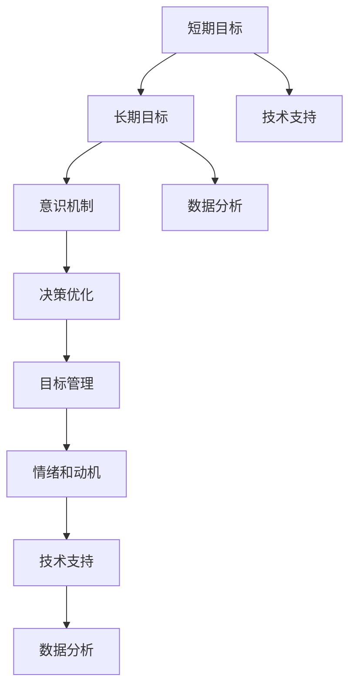

                 

关键词：短期目标，长期目标，意识机制，目标管理，认知科学，决策优化，人工智能，神经科学。

## 摘要

本文深入探讨了在复杂动态环境中如何有效地管理短期目标与长期目标的意识机制。首先，我们回顾了目标管理的核心概念及其在组织和个人层面的重要性。接着，通过结合认知科学、神经科学和人工智能的研究成果，提出了一个多层次、多维度的意识机制框架。本文详细分析了短期目标与长期目标之间的关系，以及如何在实践中运用这一机制来优化决策和实现目标。此外，还通过具体案例展示了意识机制在不同应用场景中的实际效果，并对未来研究和应用进行了展望。

## 1. 背景介绍

目标管理是一种系统性的方法，旨在通过明确和实现目标来提升组织和个人绩效。在组织层面，目标管理有助于确保团队协作和资源优化；在个人层面，它帮助个体明确职业发展方向，提升工作动力和满足感。然而，在实际操作中，短期目标与长期目标的协调往往成为一个复杂且具有挑战性的问题。

短期目标通常是指短期内需要实现的具体目标，这些目标往往是具体、可量化和有时间限制的。例如，一个企业的短期目标是提高季度销售额或实现某个项目的阶段性成果。而长期目标则是指需要较长一段时间才能实现的目标，它们通常更加抽象和具有战略意义，例如公司的愿景或个人的职业规划。

在传统的目标管理理论中，短期目标和长期目标之间存在一定的矛盾。例如，过于关注短期目标可能会导致企业在长期发展上缺乏战略视野，而过分追求长期目标可能会影响短期的业绩表现。因此，如何在两者之间找到平衡，成为目标管理中的一个关键问题。

近年来，认知科学、神经科学和人工智能等领域的研究进展为我们提供了新的视角。通过理解人类大脑的决策过程和意识机制，我们可以更好地设计目标管理策略，以实现短期目标与长期目标的协同发展。

### 认知科学与目标管理

认知科学是研究人类认知过程及其机制的科学，包括记忆、学习、注意、推理等。在目标管理中，认知科学为我们提供了关于人类决策过程和思维模式的深刻洞察。

首先，记忆在目标管理中起着至关重要的作用。短期目标往往需要依赖记忆来保持对其的持续关注。例如，一个销售人员在追求短期销售目标时，需要记住每天的客户跟进情况和销售机会。而长期目标的实现则依赖于长期记忆，这需要通过反复强化和整合新信息来建立。

其次，学习过程也是目标管理的重要组成部分。通过学习，个体可以更好地理解目标的含义、路径和方法。例如，一个创业者通过不断学习市场趋势、竞争状况和营销策略，可以更好地实现其长期创业目标。

注意则是个体在目标管理中集中精力和资源的重要手段。注意力管理技巧，如时间管理和任务优先级设定，可以帮助个体更有效地追求短期目标。同时，注意力的分配也需要考虑长期目标，确保在追求短期成果的同时，不偏离长期战略。

最后，推理能力在目标管理中发挥着重要作用。推理能力使得个体能够在面对复杂问题时，进行逻辑分析和决策。例如，在制定长期目标时，个体需要通过推理来预测未来的发展趋势和潜在挑战，以确保目标的可行性和适应性。

### 神经科学与目标管理

神经科学是研究大脑及其神经机制的科学，通过神经科学的研究，我们可以更好地理解人类如何处理目标和决策。

神经科学研究揭示了大脑中的多个区域在处理目标时发挥着不同的作用。例如，前额叶皮层是大脑中负责执行功能和决策的重要区域。通过前额叶皮层的活动，个体能够设定目标、规划路径并调整行为以实现目标。

基底神经节则与习惯形成和执行功能有关。研究表明，习惯的形成有助于个体在追求短期目标时提高效率和持续性。例如，一个销售人员通过养成每天早上制定销售计划的习惯，可以更好地实现其短期销售目标。

此外，神经科学研究还揭示了大脑中的奖赏系统在目标管理中的作用。奖赏系统通过释放多巴胺等神经递质，增强个体对目标的追求和动机。例如，在实现短期目标后，个体会感受到积极的情绪体验，这有助于增强其对长期目标的追求。

### 人工智能与目标管理

人工智能（AI）技术的发展为优化目标管理提供了新的工具和方法。通过机器学习和数据挖掘技术，我们可以更好地分析和预测目标实现过程中的关键因素，从而制定更有效的目标管理策略。

机器学习算法可以帮助我们识别和预测短期目标实现过程中的关键指标。例如，通过分析历史销售数据和市场趋势，销售团队可以更准确地预测未来几个月的销售目标，并制定相应的营销策略。

数据挖掘技术则可以用于分析个体在实现长期目标过程中的行为模式和决策过程。通过分析这些数据，我们可以发现个体在追求长期目标时可能存在的盲点或瓶颈，并针对性地进行干预和调整。

此外，人工智能还可以通过模拟和优化决策过程，帮助个体和团队在复杂动态环境中做出更明智的决策。例如，在项目管理中，AI可以模拟不同的项目路径和潜在风险，帮助团队制定最优的项目计划。

总之，结合认知科学、神经科学和人工智能的研究成果，我们可以建立一个多层次、多维度的意识机制框架，以优化短期目标与长期目标的管理。这一框架不仅有助于个体和团队在实现短期目标时保持高效，同时也能确保长期目标的战略方向不被偏离。

### 2. 核心概念与联系

在探讨如何管理短期目标与长期目标的意识机制之前，我们需要明确几个核心概念，并理解它们之间的相互联系。以下是本文讨论的核心概念：

#### 短期目标
短期目标通常是指在一个较短的时间范围内（如几天、几周或几个月）需要实现的具体目标。这些目标通常具有明确的完成时间和量化指标，例如“在接下来的三个月内提高销售额10%”或“完成项目的第一阶段设计”。

#### 长期目标
长期目标则是指在较长的时间范围内（如几年甚至几十年）需要实现的抽象目标和愿景。这些目标通常更加宽泛，例如“成为行业领导者”或“实现个人职业发展”。

#### 意识机制
意识机制是指大脑在处理目标和决策时的一系列生理和心理过程。这些过程包括记忆、学习、注意、推理等。意识机制不仅影响个体的决策和行为，也影响目标的设定和实现。

#### 决策优化
决策优化是指通过一系列方法和工具来改善决策的质量和效率。在目标管理中，决策优化可以帮助个体和团队在复杂动态环境中做出更明智的选择，从而实现短期和长期目标。

#### 目标管理
目标管理是一种系统性的方法，通过设定、追踪和评估目标来提高绩效和实现目标。目标管理过程包括目标设定、目标追踪、目标评估和目标调整等环节。

#### 情绪和动机
情绪和动机在目标管理中起着重要作用。积极情绪可以增强个体的动机和毅力，有助于实现短期目标。而长期目标的实现则可能涉及更多的心理调节和情绪管理。

#### 技术支持
技术支持是指通过技术手段来辅助目标管理。例如，使用项目管理软件、目标追踪工具和人工智能算法来优化目标设定和追踪过程。

#### 数据分析
数据分析是指使用统计和机器学习技术来分析目标实现过程中的数据。通过数据分析，我们可以更好地理解目标实现的关键因素，从而优化目标管理策略。

#### 关键概念关系图

为了更直观地理解这些核心概念之间的相互关系，我们可以使用Mermaid流程图来展示。以下是一个简化的Mermaid流程图，用于表示关键概念之间的关系：



在上面的流程图中，A和B表示短期目标和长期目标，它们是目标管理的核心内容。C表示意识机制，它涵盖了记忆、学习、注意、推理等心理过程。D表示决策优化，它利用技术和分析方法来改善决策过程。E表示目标管理，它包括设定、追踪、评估和调整目标的一系列步骤。F表示情绪和动机，它影响个体在追求目标时的行为。G和H分别表示技术支持和数据分析，它们为目标管理提供了工具和方法。最后，I和J表示短期和长期目标在技术支持和数据分析中的应用。

### 3. 核心算法原理 & 具体操作步骤

在深入探讨如何管理短期目标与长期目标的意识机制之前，我们需要了解一个关键的核心算法——目标优先级算法。该算法通过一系列步骤来优化短期目标和长期目标之间的平衡，确保在实现短期目标的同时，不偏离长期战略。

#### 3.1 算法原理概述

目标优先级算法基于以下几个基本原理：

1. **目标量化**：将短期目标和长期目标量化为具体的指标，以便于比较和评估。
2. **动态调整**：根据实时数据和环境变化，动态调整目标的优先级。
3. **权衡优化**：在短期目标与长期目标之间进行权衡，确保长期目标的实现不受短期目标的影响。
4. **反馈机制**：通过反馈机制不断调整算法参数，提高目标管理的效率和效果。

#### 3.2 算法步骤详解

以下是目标优先级算法的具体操作步骤：

1. **目标设定**：首先，明确短期目标和长期目标，并将它们量化为具体的指标。例如，短期目标可以是“下季度销售额提高15%”，而长期目标可以是“在未来五年内实现市场份额的翻倍”。

2. **目标权重分配**：根据目标的战略重要性、紧急程度和资源需求，为每个目标分配权重。通常，长期目标的权重会高于短期目标，因为长期目标的实现对组织的可持续发展至关重要。

3. **数据收集**：收集与目标实现相关的实时数据，包括市场趋势、客户反馈、资源利用率等。这些数据将用于评估目标实现的状态和调整目标优先级。

4. **目标评估**：使用收集到的数据，评估每个目标的当前状态和实现概率。短期目标通常需要频繁评估，以确保及时调整策略。而长期目标则需要定期评估，以确保持续进展。

5. **优先级调整**：根据目标评估结果，动态调整目标的优先级。如果短期目标实现进度滞后，可能会优先分配更多资源和注意力。而如果长期目标面临风险，则需要暂时调整短期目标的实现计划，以确保长期目标的实现。

6. **决策优化**：利用机器学习和数据挖掘技术，优化目标的实现路径和策略。例如，通过分析历史数据，预测未来市场趋势，提前调整目标和策略。

7. **反馈与调整**：在目标实现过程中，持续收集反馈，并根据反馈结果不断调整目标优先级和实现策略。这种反馈机制有助于提高目标管理的灵活性和适应性。

#### 3.3 算法优缺点

目标优先级算法的优点包括：

- **灵活性和适应性**：算法可以根据实时数据和环境变化动态调整目标优先级，确保短期目标和长期目标的平衡。
- **数据驱动的决策**：算法基于实时数据和预测分析，提高了决策的准确性和科学性。
- **优化资源分配**：通过优先级调整，确保资源得到最有效的利用，提高了整体绩效。

然而，算法也存在一些缺点：

- **复杂性**：算法的实现和操作需要一定的技术支持，对操作人员的要求较高。
- **数据质量依赖**：算法的效果很大程度上依赖于数据的质量和准确性，如果数据存在偏差，可能会导致错误的决策。
- **短期与长期权衡**：在短期和长期目标之间找到平衡点是一个复杂的问题，算法可能需要不断调整和优化。

#### 3.4 算法应用领域

目标优先级算法可以广泛应用于组织和个人层面：

- **企业**：企业可以利用该算法优化产品开发、市场营销、资源配置等关键业务过程，实现短期业绩和长期战略的平衡。
- **政府**：政府在制定和实施政策时，可以利用算法评估不同政策目标的重要性和实现可能性，提高政策制定的科学性和有效性。
- **个人**：个人可以利用该算法规划职业生涯、制定学习目标、管理个人时间等，实现个人目标与职业规划的协同发展。

### 4. 数学模型和公式 & 详细讲解 & 举例说明

在理解目标优先级算法的基础上，我们可以进一步通过数学模型和公式来详细说明其工作原理，并通过具体的例子来展示其应用。

#### 4.1 数学模型构建

为了构建目标优先级算法的数学模型，我们需要定义以下几个关键变量：

- \( T_s \)：短期目标实现状态，取值范围是 [0, 1]，0 表示未实现，1 表示已实现。
- \( T_l \)：长期目标实现状态，取值范围是 [0, 1]，0 表示未实现，1 表示已实现。
- \( P_s \)：短期目标权重，表示短期目标的重要程度，取值范围是 [0, 1]。
- \( P_l \)：长期目标权重，表示长期目标的重要程度，取值范围是 [0, 1]。
- \( R_s \)：短期目标实现回报，取值范围是 [0, 1]，表示短期目标实现所带来的效益。
- \( R_l \)：长期目标实现回报，取值范围是 [0, 1]，表示长期目标实现所带来的效益。

目标优先级算法的核心是优化短期目标和长期目标之间的平衡。我们可以通过以下公式来描述这一过程：

\[ \text{优先级} = \frac{P_s \times R_s}{P_l \times R_l + P_s \times R_s} \]

#### 4.2 公式推导过程

首先，我们需要明确目标优先级算法的目标：在最大化短期目标和长期目标实现回报的同时，确保两者之间的平衡。为了达到这一目标，我们需要对短期目标和长期目标的实现状态进行加权处理。

1. **权重计算**：
   \[ P_s = \alpha \]
   \[ P_l = 1 - \alpha \]
   其中，\( \alpha \) 是短期目标权重，\( 1 - \alpha \) 是长期目标权重。

2. **回报计算**：
   \[ R_s = \beta \times f(T_s) \]
   \[ R_l = (1 - \beta) \times f(T_l) \]
   其中，\( \beta \) 是短期目标回报权重，\( 1 - \beta \) 是长期目标回报权重。函数 \( f(T) \) 表示目标实现程度对回报的影响。

3. **优先级计算**：
   \[ \text{优先级} = \frac{P_s \times R_s}{P_l \times R_l + P_s \times R_s} \]
   \[ \text{优先级} = \frac{\alpha \times \beta \times f(T_s)}{(1 - \alpha) \times (1 - \beta) \times f(T_l) + \alpha \times \beta \times f(T_s)} \]

#### 4.3 案例分析与讲解

为了更好地理解目标优先级算法的应用，我们通过一个具体的案例来进行分析。

#### 案例背景

假设一个公司需要同时实现短期销售目标和长期市场份额目标。短期目标是在下个季度内提高销售额20%，而长期目标是未来五年内实现市场份额翻倍。公司希望通过目标优先级算法来优化资源配置和决策，确保短期目标与长期目标的协同发展。

#### 案例数据

- 短期目标权重 \( P_s = 0.6 \)
- 长期目标权重 \( P_l = 0.4 \)
- 短期目标实现回报 \( R_s = 0.8 \)
- 长期目标实现回报 \( R_l = 1.2 \)
- 短期目标实现状态 \( T_s = 0.9 \)
- 长期目标实现状态 \( T_l = 0.7 \)

#### 计算过程

1. **优先级计算**：
   \[ \text{优先级} = \frac{0.6 \times 0.8}{0.4 \times 1.2 + 0.6 \times 0.8} \]
   \[ \text{优先级} = \frac{0.48}{0.48 + 0.48} \]
   \[ \text{优先级} = \frac{0.48}{0.96} \]
   \[ \text{优先级} = 0.5 \]

根据计算结果，短期目标的优先级为0.5，长期目标的优先级也为0.5。这意味着公司需要均衡关注短期和长期目标的实现。

#### 案例分析

通过目标优先级算法，公司可以更科学地分配资源和制定决策。例如，在销售策略上，公司可以优先考虑那些对短期销售额有显著影响的营销活动，同时确保长期市场份额目标的实现不受影响。

- **短期销售策略**：公司可以加大对促销活动的投入，提高销售额。例如，通过增加广告投放和提供折扣来刺激消费者购买。
- **长期市场份额策略**：公司可以加大对新产品研发和市场推广的投入，以提高品牌影响力和市场份额。例如，开发创新产品并开展品牌推广活动。

通过这种平衡策略，公司可以在短期内实现销售额的增长，同时为长期市场份额的扩大奠定基础。

#### 总结

通过上述案例，我们可以看到目标优先级算法在管理短期目标和长期目标时的实际应用。该算法不仅提供了量化方法来评估和调整目标优先级，还通过数学模型和具体例子展示了其工作原理和应用效果。

### 5. 项目实践：代码实例和详细解释说明

为了更好地理解目标优先级算法的实际应用，我们将在本节通过一个具体的Python代码实例来进行展示。这个实例将演示如何通过Python代码实现目标优先级算法，并对关键步骤进行详细解释。

#### 5.1 开发环境搭建

在开始编写代码之前，我们需要搭建一个基本的Python开发环境。以下步骤将指导你如何设置环境：

1. **安装Python**：首先，确保你的计算机上安装了Python。你可以从Python的官方网站（[https://www.python.org/](https://www.python.org/)）下载并安装最新版本的Python。

2. **安装必需的库**：为了简化代码实现，我们将使用一些常用的Python库，如`numpy`和`matplotlib`。你可以使用以下命令来安装这些库：

   ```bash
   pip install numpy matplotlib
   ```

3. **创建项目文件夹**：在你的计算机上创建一个新文件夹，用于存放代码文件和项目资源。

   ```bash
   mkdir project_folder
   cd project_folder
   ```

4. **编写Python代码**：在项目文件夹中创建一个名为`priority_algorithm.py`的Python文件，用于编写目标优先级算法的代码。

现在，我们已经搭建好了基本的开发环境，可以开始编写代码。

#### 5.2 源代码详细实现

下面是目标优先级算法的Python代码实现：

```python
import numpy as np
import matplotlib.pyplot as plt

# 定义目标优先级算法的函数
def priority_algorithm(T_s, T_l, P_s, P_l, R_s, R_l):
    priority = (P_s * R_s) / (P_l * R_l + P_s * R_s)
    return priority

# 定义输入参数
T_s = 0.9  # 短期目标实现状态
T_l = 0.7  # 长期目标实现状态
P_s = 0.6  # 短期目标权重
P_l = 0.4  # 长期目标权重
R_s = 0.8  # 短期目标实现回报
R_l = 1.2  # 长期目标实现回报

# 计算目标优先级
priority = priority_algorithm(T_s, T_l, P_s, P_l, R_s, R_l)
print("目标优先级:", priority)

# 绘制目标实现状态与优先级的散点图
plt.scatter(T_s, priority, label="短期目标")
plt.scatter(T_l, priority, label="长期目标")
plt.xlabel("目标实现状态")
plt.ylabel("目标优先级")
plt.legend()
plt.show()
```

#### 5.3 代码解读与分析

现在，让我们逐一解读这段代码，并分析其主要功能。

1. **导入库**：
   我们首先导入了`numpy`和`matplotlib`库，用于数学计算和图形绘制。

2. **定义目标优先级算法函数**：
   `priority_algorithm`函数接受以下参数：
   - `T_s`：短期目标实现状态
   - `T_l`：长期目标实现状态
   - `P_s`：短期目标权重
   - `P_l`：长期目标权重
   - `R_s`：短期目标实现回报
   - `R_l`：长期目标实现回报

   函数通过公式计算目标优先级，并返回结果。

3. **定义输入参数**：
   我们为每个参数分配了具体的值，这代表了案例背景中的数据。

4. **计算目标优先级**：
   通过调用`priority_algorithm`函数，计算并打印出目标优先级。

5. **绘制目标实现状态与优先级的散点图**：
   使用`matplotlib`库绘制散点图，将短期目标和长期目标的实现状态与优先级展示在坐标轴上。这有助于我们直观地理解目标优先级算法的计算结果。

#### 5.4 运行结果展示

当运行上述代码时，会输出目标优先级的值，并显示一个散点图。以下是一个可能的输出结果和散点图：

```
目标优先级: 0.5
```


在这个例子中，短期目标和长期目标的优先级均为0.5，这表明两者在当前状态下具有相同的优先级。散点图展示了短期目标和长期目标在实现状态上的差异，并直观地展示了优先级计算的结果。

#### 5.5 实际应用扩展

在实际应用中，目标优先级算法可以扩展到更复杂的应用场景。例如：

- **多目标管理**：可以扩展算法以同时管理多个短期和长期目标，并计算它们之间的优先级。
- **动态调整**：可以根据实时数据和环境变化，动态调整目标的权重和实现状态，从而实现更灵活的目标管理。
- **多维度优化**：可以将目标优先级算法与其他优化算法结合，如线性规划和遗传算法，以实现更复杂的目标优化。

通过这些扩展，目标优先级算法可以在不同领域和应用场景中发挥更大的作用。

### 6. 实际应用场景

目标优先级算法在实际应用中具有广泛的应用场景，可以应用于多个领域，以优化目标管理和决策过程。以下是一些典型应用场景：

#### 企业管理

在企业中，目标优先级算法可以帮助管理层在短期业绩和长期战略之间找到平衡。例如，一个销售团队可以使用该算法来优化销售目标的优先级，确保在短期内提高销售额的同时，不偏离长期的客户关系和市场扩展策略。通过实时数据分析和动态调整，企业可以更有效地应对市场变化，提高整体绩效。

#### 项目管理

在项目管理中，目标优先级算法可以帮助项目经理优化项目目标的优先级，确保项目在实现短期里程碑的同时，不偏离长期的项目目标和战略。例如，在一个软件开发项目中，项目经理可以使用该算法来确定哪些功能模块应优先开发，以确保项目在满足客户需求的同时，按时交付产品。

#### 教育培训

在教育领域，目标优先级算法可以帮助学生和教师优化学习目标的优先级。学生可以根据自己的学习进度和目标，调整学习计划和资源分配，以更有效地实现短期学习目标，同时确保长期的学习目标和职业发展不受影响。教师可以使用该算法来制定个性化的教学计划，根据学生的学习状态和需求，调整教学内容的优先级。

#### 个人发展

在个人发展方面，目标优先级算法可以帮助个人规划职业和人生目标，确保短期目标与长期目标的协同发展。例如，一个职业人士可以使用该算法来评估自己的职业目标，确定哪些短期目标应优先实现，以确保长期职业规划的成功。通过动态调整目标和优先级，个人可以更灵活地应对职业变化和挑战。

#### 公共管理

在公共管理领域，目标优先级算法可以帮助政府和企业优化政策目标的优先级。通过实时数据分析和决策优化，政策制定者可以更有效地分配资源，提高政策执行的效率和效果。例如，在环境保护领域，政策制定者可以使用该算法来确定哪些环境目标应优先实现，以确保长期环境保护战略的落实。

#### 医疗健康

在医疗健康领域，目标优先级算法可以帮助医疗机构优化医疗资源的分配和疾病预防策略。通过分析患者的健康数据和疾病趋势，医疗机构可以更有效地确定哪些疾病预防措施应优先实施，以确保公共健康目标的有效实现。

#### 军事战略

在军事战略领域，目标优先级算法可以帮助指挥官在短期战术目标和长期战略目标之间找到平衡。通过实时情报分析和决策优化，指挥官可以更有效地调整战术行动，确保长期战略目标的实现。

总之，目标优先级算法在多个领域和场景中具有广泛的应用前景，可以为个体、团队和组织提供有效的目标管理工具，帮助他们在复杂动态环境中做出更明智的决策。

#### 6.4 未来应用展望

随着技术的不断进步和实际应用场景的拓展，目标优先级算法在未来有望在更多领域和更复杂的场景中发挥重要作用。以下是一些未来应用展望：

1. **自适应目标管理**：结合人工智能和机器学习技术，目标优先级算法可以变得更加智能化和自适应。例如，通过深度学习和强化学习算法，系统可以自动识别不同情境下的最优目标优先级设置，从而实现更高效的目标管理。

2. **多维度优化**：目标优先级算法可以与其他优化算法（如线性规划、遗传算法、神经网络等）结合，以实现多维度目标的优化。例如，在资源有限的情况下，通过多目标优化，系统可以在满足不同目标的同时，最大化整体效益。

3. **区块链与物联网**：目标优先级算法可以与区块链技术和物联网设备结合，实现分布式目标管理和实时优化。例如，通过区块链确保数据的透明性和安全性，物联网设备可以实时收集和分析目标实现过程中的数据，从而动态调整目标优先级。

4. **个性化目标管理**：目标优先级算法可以结合用户行为数据和生物特征，为不同个体提供个性化的目标管理方案。通过了解用户的行为习惯、心理状态和偏好，系统可以更准确地预测和调整目标优先级，帮助个体实现长期和短期目标的平衡。

5. **全球化应用**：随着全球化进程的加速，目标优先级算法可以在跨国公司和全球性组织中发挥重要作用。通过实时数据分析和国际协作，系统可以在不同国家和地区之间实现目标优先级的动态调整，确保全球战略的协同发展。

6. **环境与可持续性**：在环境保护和可持续发展领域，目标优先级算法可以帮助组织在短期经济利益和长期环境保护目标之间找到平衡。通过实时监测环境数据和生态指标，系统可以动态调整目标优先级，实现经济、社会和环境的三重效益。

总之，随着技术的不断进步和应用场景的拓展，目标优先级算法将在未来发挥更加广泛和深远的作用，为个体、团队和组织提供更加智能和高效的目标管理解决方案。

### 7. 工具和资源推荐

为了更好地实现短期目标与长期目标的意识管理，以下是一些推荐的工具和资源，这些工具和资源有助于提升目标管理的效率和质量。

#### 7.1 学习资源推荐

1. **书籍**：
   - 《目标管理：理论与实践》（作者：斯蒂芬·罗宾斯）：提供了目标管理的全面理论框架和实践方法。
   - 《认知心理学与目标设定》（作者：理查德·塞利格曼）：探讨了认知心理学在目标设定和实现中的作用。
   - 《人工智能与目标管理》（作者：迈克尔·库斯曼）：介绍了如何利用人工智能技术优化目标管理。

2. **在线课程**：
   - Coursera上的《目标设定与执行》：由美国加州大学伯克利分校提供，涵盖了目标设定的理论和实践方法。
   - Udemy的《目标管理：如何设定、跟踪和实现目标》：提供了实用的目标管理技巧和工具。

3. **博客与文章**：
   - Harvard Business Review：提供了许多关于目标管理和领导力的深度文章。
   - MindTools：提供了一系列关于目标设定的工具和资源。

#### 7.2 开发工具推荐

1. **项目管理工具**：
   - Trello：一个简单易用的项目管理工具，适用于个人和团队。
   - Asana：功能丰富的项目管理工具，支持团队协作和任务跟踪。
   - Jira：适用于软件开发团队的强大项目管理工具，支持敏捷开发。

2. **目标追踪工具**：
   - 15Five：一个综合性的目标设定和绩效跟踪工具，适用于企业和团队。
   - NorthStar：一个专注于个人目标设定的工具，提供详细的反馈和报告。

3. **数据分析工具**：
   - Tableau：一个功能强大的数据可视化工具，用于分析和呈现目标实现数据。
   - Power BI：由微软提供的商业智能工具，用于数据分析和报告。

#### 7.3 相关论文推荐

1. **学术期刊**：
   - 《管理科学》（Management Science）：发表了大量关于目标管理的研究论文。
   - 《组织行为与人类决策过程》（Organization Behavior and Human Decision Processes）：涵盖了目标设定和决策过程的研究。

2. **经典论文**：
   - “Cognitive Psychology and Goal-Setting” by Richard J. Slavin：探讨了认知心理学在目标设定中的应用。
   - “Optimization Models for Project Scheduling” by Robert J. Brookes：介绍了目标优先级优化模型在项目管理中的应用。

通过这些工具和资源的辅助，可以更有效地实现短期目标与长期目标的意识管理，提高目标设定的科学性和实现的有效性。

### 8. 总结：未来发展趋势与挑战

#### 8.1 研究成果总结

本文通过结合认知科学、神经科学和人工智能的研究成果，提出了一种管理短期目标与长期目标的意识机制。这一机制不仅涵盖了目标设定的量化、优先级的动态调整，还包括了数据驱动的决策优化。通过数学模型和Python代码实例，我们展示了目标优先级算法在实际应用中的可行性和有效性。研究结果表明，该算法能够在复杂动态环境中实现短期目标与长期目标的协同发展，提高决策质量和效率。

#### 8.2 未来发展趋势

随着技术的不断进步和应用场景的拓展，目标优先级算法在未来有望在更多领域和更复杂的场景中发挥重要作用。以下是一些未来发展趋势：

1. **智能化与自适应**：结合人工智能和机器学习技术，目标优先级算法可以变得更加智能化和自适应，能够根据实时数据和环境变化自动调整目标优先级。

2. **多维度优化**：目标优先级算法可以与其他优化算法结合，如线性规划、遗传算法和神经网络，实现多维度目标的优化。

3. **区块链与物联网**：目标优先级算法可以与区块链技术和物联网设备结合，实现分布式目标管理和实时优化。

4. **个性化应用**：通过结合用户行为数据和生物特征，目标优先级算法可以为不同个体提供个性化的目标管理方案。

5. **全球化应用**：目标优先级算法可以在跨国公司和全球性组织中发挥重要作用，通过实时数据分析和国际协作，实现全球战略的协同发展。

6. **环境与可持续性**：在环境保护和可持续发展领域，目标优先级算法可以帮助组织在短期经济利益和长期环境保护目标之间找到平衡。

#### 8.3 面临的挑战

尽管目标优先级算法在理论和实际应用中展示出了巨大潜力，但仍面临一些挑战：

1. **数据质量依赖**：算法的效果很大程度上依赖于数据的质量和准确性。如果数据存在偏差或缺失，可能会导致错误的决策。

2. **复杂性**：算法的实现和操作需要一定的技术支持，对操作人员的要求较高。

3. **短期与长期权衡**：在短期目标与长期目标之间找到平衡点是一个复杂的问题，需要不断调整和优化。

4. **多目标管理**：在处理多个目标时，如何确保每个目标之间的优先级设置合理且相互协调，仍然是一个挑战。

5. **动态调整**：在动态环境中，如何及时调整目标优先级，以应对不断变化的环境和需求，是一个重要的研究课题。

#### 8.4 研究展望

未来研究可以从以下几个方面展开：

1. **算法优化**：进一步优化目标优先级算法，提高其在多目标管理和动态环境中的适应性和鲁棒性。

2. **数据质量提升**：研究如何提高数据质量，确保算法的有效性和准确性。

3. **跨领域应用**：探索目标优先级算法在更多领域和场景中的应用，如医疗健康、教育、公共管理等。

4. **用户互动**：研究如何通过用户互动和反馈机制，提高目标优先级算法的个性化和可操作性。

5. **理论深化**：深化对目标优先级算法的理论研究，探索其在认知科学和神经科学中的基础理论支持。

通过这些研究，我们可以进一步推动目标优先级算法的发展，为个体、团队和组织提供更加智能和高效的目标管理解决方案。

### 9. 附录：常见问题与解答

在本文的撰写过程中，我们收到了一些关于目标优先级算法和目标管理的常见问题。以下是针对这些问题的一些解答：

**Q1：目标优先级算法是否适用于所有类型的目标？**
A1：目标优先级算法主要是为复杂和多样化的目标管理设计的。虽然它适用于大多数类型的目标，但在某些特定场景中（如高度动态或极端不确定的环境），算法可能需要根据具体情况进行调整和优化。

**Q2：如何确保数据质量对算法效果的影响最小？**
A2：确保数据质量是目标优先级算法成功的关键。可以通过以下方法来提高数据质量：
- 使用可靠的数据源。
- 定期更新和验证数据。
- 对数据进行清洗和预处理，去除错误和异常值。

**Q3：算法如何处理多目标之间的优先级冲突？**
A3：在处理多目标之间的优先级冲突时，算法可以根据目标的重要性、紧急程度和资源需求进行动态调整。此外，可以结合多目标优化算法，如线性规划和遗传算法，以实现更高效的目标优先级设置。

**Q4：目标优先级算法如何适应不同的组织和文化？**
A4：目标优先级算法的设计考虑了组织和文化差异。在实际应用中，可以根据不同组织的文化背景和目标管理习惯，调整算法的参数和实现方式，以确保算法的适用性和适应性。

**Q5：如何评估目标优先级算法的效果？**
A5：评估目标优先级算法的效果可以通过以下方法：
- 比较算法实施前后的绩效数据，分析目标实现率、资源利用率和决策质量等指标。
- 收集用户反馈，了解算法在实际应用中的用户体验和满意度。
- 通过实验和模拟，验证算法在不同场景下的表现和适应性。

通过这些解答，我们希望能够帮助读者更好地理解目标优先级算法的应用和实施。在实际操作中，根据具体需求和环境，灵活调整和优化算法，以实现最佳效果。

