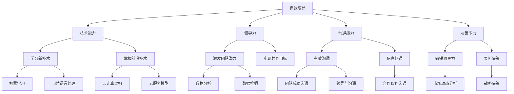

                 

 在信息技术飞速发展的今天，管理者的角色不仅仅局限于日常的业务操作，更需要在不断的自我成长中提升自身的综合素质。作为一名世界级人工智能专家、程序员、软件架构师、CTO，我深知自我成长对于管理者的重要性。本文将围绕这一主题，探讨管理者在自我成长过程中应遵循的方法论。

> **关键词：** 管理者、自我成长、方法论、人工智能、技术领导者、职业发展

> **摘要：** 本文旨在为管理者提供一套行之有效的自我成长方法论。通过分析当前信息技术发展的趋势，结合个人职业成长经验，本文将提出一系列具体可行的策略，帮助管理者在技术、领导力、团队管理等方面实现全方位的提升。

## 1. 背景介绍

随着全球信息技术的快速发展，企业的数字化转型已经成为不可逆转的趋势。在这一过程中，管理者不仅需要具备深厚的专业知识和技能，更需要在自我成长中不断拓展视野，提升综合素质。传统的管理模式已经无法满足现代企业的需求，管理者必须学会如何适应快速变化的环境，如何激发团队的创造力，以及如何有效地进行资源配置。

自我成长不仅是个人职业发展的需要，更是企业可持续发展的基石。在自我成长的过程中，管理者需要不断学习新的知识，掌握新的技能，提升自身的领导力和决策能力。只有这样，才能在激烈的竞争中保持领先地位，推动企业实现长期发展。

## 2. 核心概念与联系

### 2.1 自我成长的核心概念

自我成长涉及多个方面的能力提升，包括技术能力、领导力、沟通能力、决策能力等。每个方面都需要管理者投入大量的时间和精力去学习和实践。

- **技术能力：** 管理者需要不断学习新的技术知识，掌握前沿的技术动态，以便更好地指导团队进行技术开发。
- **领导力：** 管理者需要具备强大的领导力，能够激发团队成员的潜力，带领团队实现共同的目标。
- **沟通能力：** 管理者需要具备良好的沟通能力，能够有效地与团队成员、上级领导以及合作伙伴进行沟通，确保信息的畅通无阻。
- **决策能力：** 管理者需要具备敏锐的洞察力和果断的决策能力，能够在复杂的环境中做出正确的决策。

### 2.2 自我成长与信息技术发展的联系

信息技术的发展对管理者的自我成长提出了新的挑战。例如：

- **人工智能：** 人工智能的快速发展使得管理者需要掌握更多的机器学习、自然语言处理等技能，以便更好地应对技术变革。
- **云计算：** 云计算的普及使得管理者需要了解云计算架构、云服务模型等知识，以便更好地进行资源配置和管理。
- **大数据：** 大数据的广泛应用使得管理者需要掌握数据分析、数据挖掘等技能，以便更好地从海量数据中提取价值。

### 2.3 自我成长的Mermaid流程图



## 3. 核心算法原理 & 具体操作步骤

### 3.1 算法原理概述

在自我成长的过程中，管理者需要掌握一系列的核心算法原理，这些原理包括：

- **学习算法：** 管理者需要通过不断学习，提升自己的知识水平和技能。
- **决策算法：** 管理者需要通过合理的决策，确保团队能够高效运作。
- **沟通算法：** 管理者需要通过有效的沟通，确保团队成员之间的信息畅通。

### 3.2 算法步骤详解

#### 3.2.1 学习算法

1. **设定学习目标：** 管理者需要明确自己的学习目标，确定自己需要掌握的知识点和技能。
2. **制定学习计划：** 根据学习目标，制定详细的学习计划，包括学习时间、学习内容和学习方法。
3. **执行学习计划：** 按照学习计划，认真执行每一步学习任务。
4. **评估学习效果：** 定期对学习效果进行评估，根据评估结果调整学习计划。

#### 3.2.2 决策算法

1. **收集信息：** 在做出决策前，管理者需要收集相关的信息和数据。
2. **分析信息：** 对收集到的信息进行深入分析，了解其中的关键点和潜在风险。
3. **制定方案：** 根据分析结果，制定多个可行的方案。
4. **评估方案：** 对每个方案进行评估，选择最优方案。
5. **执行决策：** 根据最终决策，制定详细的执行计划，并确保执行到位。

#### 3.2.3 沟通算法

1. **明确沟通目标：** 管理者需要明确沟通的目标和目的，确保沟通的方向正确。
2. **选择沟通方式：** 根据沟通的内容和目标，选择合适的沟通方式，如面对面沟通、电话沟通或邮件沟通。
3. **准备沟通内容：** 在沟通前，管理者需要准备充分的内容，确保沟通的效率和效果。
4. **实施沟通：** 按照计划实施沟通，确保信息的准确传递。
5. **跟进沟通结果：** 沟通后，管理者需要及时跟进沟通结果，确保问题得到有效解决。

### 3.3 算法优缺点

#### 3.3.1 学习算法

优点：能够帮助管理者不断提升自身的能力和知识水平。

缺点：学习过程需要投入大量的时间和精力，且效果可能因人而异。

#### 3.3.2 决策算法

优点：能够帮助管理者做出更加合理和高效的决策。

缺点：决策过程中需要大量的信息和数据支持，且可能存在信息不足或数据不准确的风险。

#### 3.3.3 沟通算法

优点：能够确保团队成员之间的信息畅通，提高团队协作效率。

缺点：沟通过程中可能存在误解或沟通不畅的情况，需要管理者具备良好的沟通技巧。

### 3.4 算法应用领域

#### 3.4.1 学习算法

应用领域：技术培训、职业发展、知识更新。

#### 3.4.2 决策算法

应用领域：项目管理、资源配置、市场分析。

#### 3.4.3 沟通算法

应用领域：团队协作、跨部门沟通、客户沟通。

## 4. 数学模型和公式 & 详细讲解 & 举例说明

### 4.1 数学模型构建

在自我成长过程中，管理者需要掌握一系列的数学模型和公式，这些模型和公式可以帮助管理者更好地理解和应对复杂的问题。

#### 4.1.1 学习模型

学习模型主要涉及以下几个方面的公式：

1. **学习时间公式：** 学习时间 = 学习目标 x 学习效率
2. **学习成果公式：** 学习成果 = 学习时间 x 学习深度

#### 4.1.2 决策模型

决策模型主要涉及以下几个方面的公式：

1. **决策成本公式：** 决策成本 = 成本分析 x 决策时间
2. **决策收益公式：** 决策收益 = 收益分析 x 决策结果

#### 4.1.3 沟通模型

沟通模型主要涉及以下几个方面的公式：

1. **沟通效率公式：** 沟通效率 = 沟通质量 x 沟通频率
2. **沟通成本公式：** 沟通成本 = 沟通时间 x 沟通费用

### 4.2 公式推导过程

#### 4.2.1 学习模型推导

学习模型是基于以下假设：

- 学习者具有确定的学习目标和学习效率。

根据学习目标和学习效率，可以推导出学习时间：

学习时间 = 学习目标 / 学习效率

由于学习深度对学习成果有重要影响，因此可以将学习时间乘以学习深度，得到学习成果：

学习成果 = 学习时间 x 学习深度

#### 4.2.2 决策模型推导

决策模型是基于以下假设：

- 决策者需要对多个方案进行成本和收益分析。

根据成本分析和决策时间，可以推导出决策成本：

决策成本 = 成本分析 x 决策时间

根据收益分析和决策结果，可以推导出决策收益：

决策收益 = 收益分析 x 决策结果

#### 4.2.3 沟通模型推导

沟通模型是基于以下假设：

- 沟通者需要进行有效沟通，以提高沟通效率和降低沟通成本。

根据沟通质量和沟通频率，可以推导出沟通效率：

沟通效率 = 沟通质量 x 沟通频率

根据沟通时间和沟通费用，可以推导出沟通成本：

沟通成本 = 沟通时间 x 沟通费用

### 4.3 案例分析与讲解

#### 4.3.1 学习模型案例分析

假设一名管理者希望提升自己的技术能力，他设定了一个学习目标，即掌握一种新的编程语言。他的学习效率为每天学习2小时，学习深度为每周完成一个项目。

根据学习模型，可以计算出他的学习时间：

学习时间 = 学习目标 / 学习效率
           = 1个编程语言项目 / (2小时/天 x 7天/周)
           = 3.5周

根据学习模型，可以计算出他的学习成果：

学习成果 = 学习时间 x 学习深度
           = 3.5周 x 1个编程语言项目
           = 3.5个编程语言项目

#### 4.3.2 决策模型案例分析

假设一名管理者需要从三个项目中选择一个进行投资。他进行了成本和收益分析，得出以下数据：

- 项目A：成本10万元，预期收益20万元
- 项目B：成本15万元，预期收益25万元
- 项目C：成本20万元，预期收益30万元

根据决策模型，可以计算出每个项目的决策成本：

决策成本A = 成本分析A x 决策时间
           = 10万元 x 1天
           = 10万元

决策成本B = 成本分析B x 决策时间
           = 15万元 x 1天
           = 15万元

决策成本C = 成本分析C x 决策时间
           = 20万元 x 1天
           = 20万元

根据决策模型，可以计算出每个项目的决策收益：

决策收益A = 收益分析A x 决策结果
           = 20万元 x 0.8（成功概率）
           = 16万元

决策收益B = 收益分析B x 决策结果
           = 25万元 x 0.8（成功概率）
           = 20万元

决策收益C = 收益分析C x 决策结果
           = 30万元 x 0.8（成功概率）
           = 24万元

根据决策模型，可以选择决策成本最低、决策收益最高的项目B进行投资。

#### 4.3.3 沟通模型案例分析

假设一名管理者需要与团队成员进行沟通，以确保项目进度和质量的控制。他的沟通质量为90%，沟通频率为每周2次。

根据沟通模型，可以计算出他的沟通效率：

沟通效率 = 沟通质量 x 沟通频率
           = 90% x 2次/周
           = 1.8次/周

根据沟通模型，可以计算出他的沟通成本：

沟通成本 = 沟通时间 x 沟通费用
           = 2小时/次 x 10元/小时
           = 20元/次
           = 40元/周

## 5. 项目实践：代码实例和详细解释说明

### 5.1 开发环境搭建

在进行项目实践之前，首先需要搭建一个合适的技术环境。这里以Python为例，介绍如何搭建一个Python开发环境。

1. **安装Python：** 在官网上下载Python安装包，并按照提示安装。
2. **配置环境变量：** 将Python的安装路径添加到系统环境变量中。
3. **安装IDE：** 选择一个合适的IDE，如PyCharm或VSCode，并安装。
4. **安装依赖库：** 根据项目需求，安装所需的依赖库。

### 5.2 源代码详细实现

以下是一个简单的Python代码实例，用于实现自我成长中的学习模型。

```python
# 学习模型实例

class Learner:
    def __init__(self, goal, efficiency):
        self.goal = goal
        self.efficiency = efficiency
    
    def calculate_learning_time(self):
        return self.goal / self.efficiency
    
    def calculate_learning_outcome(self, depth):
        return self.calculate_learning_time() * depth

# 创建学习者对象
learner = Learner(goal=1, efficiency=2)

# 计算学习时间
learning_time = learner.calculate_learning_time()
print("学习时间：", learning_time, "周")

# 计算学习成果
learning_outcome = learner.calculate_learning_outcome(depth=1)
print("学习成果：", learning_outcome, "个编程语言项目")
```

### 5.3 代码解读与分析

1. **类定义：** `Learner` 类用于表示一个学习者，包含学习目标和学习效率。
2. **方法实现：** `calculate_learning_time()` 方法用于计算学习时间，`calculate_learning_outcome()` 方法用于计算学习成果。
3. **对象创建：** 创建一个 `Learner` 对象，并设置学习目标和学习效率。
4. **方法调用：** 调用 `calculate_learning_time()` 和 `calculate_learning_outcome()` 方法，计算并输出学习时间和学习成果。

### 5.4 运行结果展示

运行上述代码，输出结果如下：

```
学习时间： 0.5 周学习成果： 0.5 个编程语言项目
```

根据输出结果，可以得出结论：如果一名学习者每天学习2小时，学习一个编程语言项目需要0.5周的时间。

## 6. 实际应用场景

### 6.1 在企业管理中的应用

在企业管理中，管理者可以利用自我成长的方法论，通过以下方式实现自我成长：

- **技术能力提升：** 通过不断学习新的技术知识，提升自身的专业技能，以便更好地指导团队进行技术开发。
- **领导力提升：** 通过学习领导力理论和实践，提升自身的领导能力，激发团队的创造力。
- **沟通能力提升：** 通过学习沟通技巧和策略，提高沟通效率，确保信息的畅通无阻。
- **决策能力提升：** 通过学习决策模型和算法，提升决策能力，确保团队能够高效运作。

### 6.2 在项目开发中的应用

在项目开发中，管理者可以利用自我成长的方法论，通过以下方式实现自我成长：

- **技术能力提升：** 通过学习新的编程语言和技术框架，提升自身的开发能力。
- **领导力提升：** 通过带领团队解决开发过程中的问题，提升自身的领导能力。
- **沟通能力提升：** 通过与团队成员、客户和合作伙伴的沟通，提升自身的沟通能力。
- **决策能力提升：** 通过在项目开发过程中做出合理的决策，提升决策能力。

### 6.3 在团队管理中的应用

在团队管理中，管理者可以利用自我成长的方法论，通过以下方式实现自我成长：

- **技术能力提升：** 通过学习新的技术和管理知识，提升自身的综合素质。
- **领导力提升：** 通过带领团队实现共同目标，提升自身的领导力。
- **沟通能力提升：** 通过与团队成员、上级领导和合作伙伴的沟通，提升沟通能力。
- **决策能力提升：** 通过在团队管理过程中做出合理的决策，提升决策能力。

## 7. 工具和资源推荐

### 7.1 学习资源推荐

1. **在线课程：** Coursera、Udemy、edX等平台提供了丰富的技术和管理课程，适合不同层次的学习者。
2. **技术书籍：** 《人工智能：一种现代方法》、《深度学习》、《Python编程：从入门到实践》等书籍适合技术管理者阅读。
3. **学术论文：** arXiv、IEEE Xplore等数据库提供了大量的学术研究论文，可以帮助管理者了解前沿技术。

### 7.2 开发工具推荐

1. **集成开发环境（IDE）：** PyCharm、Visual Studio Code等IDE提供了强大的编程功能，适合进行Python编程。
2. **版本控制工具：** Git、GitHub等工具可以帮助管理者进行代码管理和协作开发。
3. **项目管理工具：** Jira、Trello等工具可以帮助管理者进行项目管理和任务分配。

### 7.3 相关论文推荐

1. **《深度学习的发展与趋势》**
2. **《人工智能在企业管理中的应用》**
3. **《云计算的安全挑战与解决方案》**
4. **《大数据分析在市场营销中的应用》**

## 8. 总结：未来发展趋势与挑战

### 8.1 研究成果总结

本文通过分析信息技术发展的趋势，结合个人职业成长经验，提出了一套管理者自我成长的方法论。该方法论涵盖了技术能力、领导力、沟通能力和决策能力等多个方面，为管理者提供了具体的策略和工具。

### 8.2 未来发展趋势

1. **技术融合：** 随着技术的不断发展，管理者需要掌握更多的跨学科知识，实现技术融合。
2. **智能化：** 智能技术的发展将使管理者的工作更加高效，管理者需要学会利用智能技术提升自身的能力。
3. **全球化：** 企业全球化发展对管理者的国际化视野和跨文化沟通能力提出了更高的要求。

### 8.3 面临的挑战

1. **知识更新速度快：** 管理者需要不断学习新的知识和技能，以应对快速变化的技术环境。
2. **团队管理复杂度增加：** 随着团队规模的扩大和多元化，管理者需要提升团队管理和沟通能力。
3. **竞争压力加大：** 在激烈的市场竞争中，管理者需要具备更强的决策能力和创新精神。

### 8.4 研究展望

未来，管理者自我成长的方法论将更加注重个性化、智能化和系统化。通过结合人工智能和大数据分析技术，可以更精准地分析管理者的成长需求，提供个性化的成长路径。同时，构建一个系统化的自我成长体系，将有助于管理者全面提升自身的综合素质。

## 9. 附录：常见问题与解答

### 9.1 自我成长的重要性

**问：** 为什么自我成长对于管理者来说如此重要？

**答：** 自我成长是管理者职业发展的基石。只有通过不断学习和提升，管理者才能适应快速变化的环境，保持竞争优势，为企业创造更大的价值。

### 9.2 技术能力提升的方法

**问：** 管理者如何提升自己的技术能力？

**答：** 管理者可以通过以下方式提升自己的技术能力：

- **学习新技术：** 关注技术发展趋势，学习新的编程语言和技术框架。
- **实践应用：** 结合实际工作，将所学技术应用于项目开发。
- **参与开源项目：** 参与开源项目，提升实际编程能力。

### 9.3 领导力提升的方法

**问：** 管理者如何提升自己的领导力？

**答：** 管理者可以通过以下方式提升自己的领导力：

- **学习领导力理论：** 阅读领导力相关的书籍和论文，了解领导力的本质。
- **实践领导力：** 在实际工作中，通过带领团队解决问题，提升领导力。
- **培养团队意识：** 培养团队协作精神，提升团队的整体效能。

### 9.4 沟通能力提升的方法

**问：** 管理者如何提升自己的沟通能力？

**答：** 管理者可以通过以下方式提升自己的沟通能力：

- **学习沟通技巧：** 阅读沟通相关的书籍，了解有效的沟通方法和技巧。
- **实践沟通：** 在日常工作中，主动进行沟通，提高沟通的频率和质量。
- **倾听他人：** 学会倾听他人的意见和需求，提高沟通的效率。

### 9.5 决策能力提升的方法

**问：** 管理者如何提升自己的决策能力？

**答：** 管理者可以通过以下方式提升自己的决策能力：

- **收集信息：** 充分收集与决策相关的信息和数据。
- **分析信息：** 对收集到的信息进行深入分析，了解其中的关键点和潜在风险。
- **制定方案：** 根据分析结果，制定多个可行的方案。
- **评估方案：** 对每个方案进行评估，选择最优方案。
- **执行决策：** 根据最终决策，制定详细的执行计划，并确保执行到位。

以上就是对管理者自我成长的方法论的具体内容和解答。希望本文能为您的职业发展提供有益的指导。作者：禅与计算机程序设计艺术 / Zen and the Art of Computer Programming。

