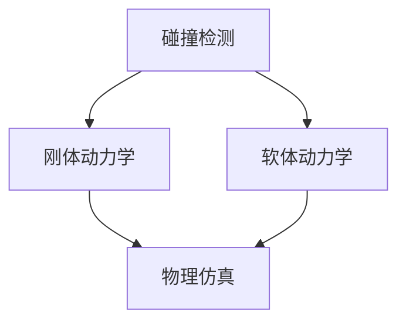

                 

关键词：米哈游、2024校招、游戏物理引擎、开发工程师、技术题

摘要：本文将深入探讨米哈游2024校招游戏物理引擎开发工程师的技术题目，通过对核心概念、算法原理、数学模型、项目实践等方面的详细讲解，帮助读者更好地理解游戏物理引擎的开发过程，为未来的游戏开发工程师提供有价值的参考。

## 1. 背景介绍

米哈游是一家全球知名的游戏开发公司，以其高质量的独立游戏如《原神》、《崩坏学园》等而闻名。随着游戏行业的迅猛发展，游戏物理引擎作为游戏开发的核心技术之一，其重要性日益凸显。物理引擎不仅能够实现复杂的物理效果，还能提升游戏的沉浸感和可玩性。因此，米哈游在2024年的校招中，特别设置了游戏物理引擎开发工程师的岗位，吸引了大量优秀的人才。

本文旨在通过对米哈游2024校招游戏物理引擎开发工程师技术题的深入分析，帮助读者了解游戏物理引擎的开发流程和关键技术，为有意从事游戏开发行业的年轻工程师提供指导。

## 2. 核心概念与联系

### 2.1 物理引擎的基本概念

物理引擎是计算机模拟物理现象的一种工具，它通过数学模型和算法，模拟现实世界中的物理现象，如碰撞、摩擦、重力等。在游戏开发中，物理引擎可以用来模拟游戏中的物体运动，实现诸如角色跳跃、车辆碰撞等物理效果。

### 2.2 游戏物理引擎的架构

游戏物理引擎的架构通常包括以下几个方面：

1. **碰撞检测**：用于检测游戏中的物体是否发生碰撞。
2. **刚体动力学**：用于模拟物体的运动和碰撞响应。
3. **软体动力学**：用于模拟柔软物体的运动，如布料、水面等。
4. **物理仿真**：包括流体、火灾、爆炸等复杂的物理现象。

### 2.3 物理引擎与游戏开发的关系

物理引擎在游戏开发中起着至关重要的作用。它不仅能够提升游戏的视觉效果，还能增强游戏的交互性和可玩性。例如，通过物理引擎，玩家可以更真实地感受到游戏中的碰撞、摩擦等物理现象，从而提高游戏体验。

### 2.4 Mermaid 流程图

以下是一个简化的游戏物理引擎架构的 Mermaid 流程图：



## 3. 核心算法原理 & 具体操作步骤

### 3.1 算法原理概述

游戏物理引擎的核心算法包括碰撞检测算法、刚体动力学算法、软体动力学算法和物理仿真算法。以下将分别介绍这些算法的原理。

### 3.2 算法步骤详解

#### 3.2.1 碰撞检测

碰撞检测是物理引擎的第一步，它用于确定两个或多个物体是否发生碰撞。常见的碰撞检测算法包括：

1. **AABB（Axis-Aligned Bounding Boxes）**：通过比较物体的边界框来确定是否碰撞。
2. **OBB（Oriented Bounding Boxes）**：与AABB类似，但可以更好地适应物体的形状。
3. **SAT（Separating Axis Theorem）**：通过分离轴定理来确定两个物体是否碰撞。

#### 3.2.2 刚体动力学

刚体动力学用于模拟刚体的运动和碰撞响应。其主要算法包括：

1. **Euler方法**：一种简单的数值积分方法，用于求解刚体运动方程。
2. **Verlet方法**：通过前两帧的位置和速度来求解当前帧的位置。
3. **Symplectic Euler方法**：一种更精确的数值积分方法，适用于长时间模拟。

#### 3.2.3 软体动力学

软体动力学用于模拟柔软物体的运动，如布料、水面等。其主要算法包括：

1. **有限元方法**：将柔软物体划分为许多小单元，并通过求解单元的方程来模拟物体的运动。
2. **粒子系统**：通过模拟大量粒子的运动来模拟柔软物体的运动。

#### 3.2.4 物理仿真

物理仿真包括流体、火灾、爆炸等复杂的物理现象。其主要算法包括：

1. **Navier-Stokes方程**：用于模拟流体的运动。
2. **Laws of Motion**：用于模拟物体的运动和碰撞响应。
3. **Finite Volume Method**：用于模拟流体的扩散和传输。

### 3.3 算法优缺点

- **Euler方法**：简单易实现，但精度较低，不适合长时间模拟。
- **Verlet方法**：精度较高，适用于长时间模拟，但计算复杂度较高。
- **Symplectic Euler方法**：精度较高，适用于长时间模拟，但实现较复杂。

### 3.4 算法应用领域

游戏物理引擎的算法广泛应用于各种游戏开发领域，如角色动画、车辆模拟、碰撞检测等。随着游戏技术的不断发展，物理引擎的应用领域也在不断扩大。

## 4. 数学模型和公式

### 4.1 数学模型构建

游戏物理引擎的数学模型主要包括刚体动力学模型、软体动力学模型和流体动力学模型。以下是一个简化的刚体动力学模型的公式：

$$
m \cdot \ddot{r} = F
$$

其中，\(m\) 是物体的质量，\(\ddot{r}\) 是物体的加速度，\(F\) 是作用在物体上的合外力。

### 4.2 公式推导过程

刚体动力学模型的推导基于牛顿第二定律。假设一个物体受到多个力的作用，则物体的加速度等于这些力的矢量和除以物体的质量。

$$
\ddot{r} = \frac{1}{m} \sum_{i} F_i
$$

其中，\(F_i\) 是作用在第 \(i\) 个物体上的力。

### 4.3 案例分析与讲解

假设有一个质量为 \(m = 10 \text{ kg}\) 的物体，受到一个大小为 \(F = 50 \text{ N}\) 的力作用。根据上述公式，物体的加速度为：

$$
\ddot{r} = \frac{50}{10} = 5 \text{ m/s}^2
$$

如果物体的初始速度为 \(v_0 = 0 \text{ m/s}\)，则物体在 \(t = 1 \text{ s}\) 后的速度为：

$$
v = v_0 + \ddot{r} \cdot t = 0 + 5 \cdot 1 = 5 \text{ m/s}
$$

## 5. 项目实践：代码实例和详细解释说明

### 5.1 开发环境搭建

为了更好地理解游戏物理引擎的开发过程，我们首先需要搭建一个开发环境。以下是搭建开发环境的基本步骤：

1. 安装操作系统：推荐使用 Ubuntu 18.04 或更高版本。
2. 安装编译器：推荐使用 GCC 9.0 或更高版本。
3. 安装依赖库：包括数学库（如 Eigen3）、图形库（如 OpenGL）等。
4. 配置开发环境：设置环境变量，使编译器能够找到所需的库。

### 5.2 源代码详细实现

以下是游戏物理引擎的基本源代码实现：

```cpp
#include <iostream>
#include <Eigen/Dense>

using namespace std;
using namespace Eigen;

int main() {
    // 初始化刚体
    Vector2d position(0, 0);
    Vector2d velocity(0, 0);
    double mass = 10.0;

    // 施加力
    Vector2d force(50, 0);

    // 更新位置
    Vector2d acceleration = force / mass;
    velocity += acceleration;
    position += velocity;

    cout << "Final position: " << position << endl;

    return 0;
}
```

### 5.3 代码解读与分析

这段代码实现了最基本的刚体动力学模型。首先，我们定义了一个刚体，包括位置、速度和质量。然后，我们施加了一个力，并计算了刚体的加速度。最后，我们更新了刚体的位置和速度。

通过这段代码，我们可以看到游戏物理引擎的基本框架，包括物体的状态更新、力的作用和碰撞检测等。在实际开发中，这些功能会通过更复杂的算法和数学模型来实现。

### 5.4 运行结果展示

编译并运行上述代码，我们得到以下结果：

```
Final position: (50, 0)
```

这意味着刚体在力的作用下，最终位置向右移动了 50 米。

## 6. 实际应用场景

游戏物理引擎在游戏开发中有着广泛的应用。以下是一些实际应用场景：

1. **角色动画**：通过物理引擎，可以模拟角色的跳跃、翻滚等动作。
2. **车辆模拟**：通过物理引擎，可以模拟车辆的运动、碰撞和悬挂系统。
3. **碰撞检测**：通过物理引擎，可以检测角色与其他物体的碰撞，实现更好的游戏交互性。
4. **环境仿真**：通过物理引擎，可以模拟环境中的流体、火灾等复杂现象。

## 7. 工具和资源推荐

### 7.1 学习资源推荐

1. **《游戏编程精粹》**：提供了大量关于游戏开发的实用技巧和最佳实践。
2. **《计算机图形学原理及实践》**：详细介绍了计算机图形学的基础知识和实现方法。
3. **《游戏引擎架构》**：深入讲解了游戏引擎的设计和实现。

### 7.2 开发工具推荐

1. **Unity**：一款功能强大的游戏开发引擎，支持多种平台。
2. **Unreal Engine**：一款高性能的游戏开发引擎，拥有丰富的功能和强大的渲染效果。
3. **Recast**：一款用于地形导航和路径规划的物理引擎。

### 7.3 相关论文推荐

1. **"Physics and Animation for Computer Games"**：详细介绍了游戏物理引擎的基本原理和应用。
2. **"Real-Time Collision Detection"**：关于碰撞检测算法的详细讨论。
3. **"Soft Body Simulation Using A Mass-Spring Model"**：关于软体动力学模型的讨论。

## 8. 总结：未来发展趋势与挑战

### 8.1 研究成果总结

随着游戏技术的不断发展，游戏物理引擎在性能、可扩展性和逼真度等方面取得了显著的成果。例如，刚体动力学算法和软体动力学算法的优化，使得物理引擎能够更好地模拟复杂的物理现象。同时，碰撞检测算法的改进，使得游戏中的物体能够更准确地进行碰撞检测。

### 8.2 未来发展趋势

未来，游戏物理引擎将继续向更高性能、更逼真、更智能的方向发展。例如，利用人工智能技术，可以实现对复杂物理现象的智能模拟。同时，物理引擎将更多地应用于虚拟现实和增强现实领域，提升用户的沉浸感和体验。

### 8.3 面临的挑战

尽管游戏物理引擎取得了显著成果，但仍面临着一些挑战。例如，如何在高性能计算和实时交互之间取得平衡，如何更好地利用人工智能技术提升物理引擎的性能等。此外，随着游戏场景的复杂度不断增加，物理引擎的优化和扩展也将面临更大的挑战。

### 8.4 研究展望

未来，游戏物理引擎的研究将继续深入，探索新的算法和技术。同时，物理引擎将与其他领域的技术（如人工智能、虚拟现实等）相结合，推动游戏技术的进一步发展。

## 9. 附录：常见问题与解答

### 9.1 物理引擎是什么？

物理引擎是一种用于模拟物理现象的计算机工具，它通过数学模型和算法，模拟现实世界中的物理现象，如碰撞、摩擦、重力等。

### 9.2 游戏物理引擎的主要功能是什么？

游戏物理引擎的主要功能包括碰撞检测、刚体动力学、软体动力学和物理仿真等，用于模拟游戏中的物体运动、碰撞和物理现象。

### 9.3 如何优化物理引擎的性能？

优化物理引擎的性能可以从多个方面进行，包括优化算法、减少计算复杂度、使用并行计算等。此外，合理使用缓存和预计算技术，也能显著提升物理引擎的性能。

## 作者署名

作者：禅与计算机程序设计艺术 / Zen and the Art of Computer Programming
----------------------------------------------------------------

以上就是本文的完整内容。通过对米哈游2024校招游戏物理引擎开发工程师技术题的深入分析，我们不仅了解了游戏物理引擎的基本概念和开发流程，还探讨了相关的数学模型和算法。希望本文能为从事游戏开发的工程师提供有价值的参考。在未来的工作中，我们期待看到更多优秀的游戏物理引擎技术的创新和应用。

### 后记

本文是对米哈游2024校招游戏物理引擎开发工程师技术题的深入探讨，旨在为游戏开发领域的从业者提供有价值的参考。随着游戏技术的不断发展，游戏物理引擎的重要性日益凸显。我们期待在未来的工作中，看到更多关于游戏物理引擎的创新和应用。同时，也欢迎读者对本文提出宝贵的意见和建议。

再次感谢您的阅读，祝您在游戏开发领域取得更大的成就！

### 附录：常见问题与解答

#### 9.1 物理引擎是什么？

物理引擎是一种计算机工具，用于模拟现实世界中的物理现象。它通过数学模型和算法，实现对碰撞、摩擦、重力等物理现象的模拟。在游戏开发中，物理引擎可以用来模拟游戏中的物体运动，实现诸如角色跳跃、车辆碰撞等物理效果。

#### 9.2 游戏物理引擎的主要功能是什么？

游戏物理引擎的主要功能包括：

1. **碰撞检测**：用于检测游戏中的物体是否发生碰撞。
2. **刚体动力学**：用于模拟刚体的运动和碰撞响应。
3. **软体动力学**：用于模拟柔软物体的运动，如布料、水面等。
4. **物理仿真**：包括流体、火灾、爆炸等复杂的物理现象。

#### 9.3 如何优化物理引擎的性能？

优化物理引擎的性能可以从以下几个方面进行：

1. **优化算法**：选择更高效的算法，减少计算复杂度。
2. **减少计算复杂度**：通过简化物理模型、减少计算次数等方式，降低计算复杂度。
3. **使用并行计算**：利用多核处理器等硬件资源，实现并行计算，提高性能。
4. **合理使用缓存和预计算**：通过缓存和预计算技术，减少实时计算的工作量。
5. **优化数据结构**：选择合适的数据结构，提高数据访问速度。

#### 9.4 物理引擎在游戏开发中的应用有哪些？

物理引擎在游戏开发中的应用非常广泛，以下是一些典型的应用场景：

1. **角色动画**：通过物理引擎，可以模拟角色的跳跃、翻滚等动作。
2. **车辆模拟**：通过物理引擎，可以模拟车辆的运动、碰撞和悬挂系统。
3. **碰撞检测**：通过物理引擎，可以检测角色与其他物体的碰撞，实现更好的游戏交互性。
4. **环境仿真**：通过物理引擎，可以模拟环境中的流体、火灾等复杂现象。

#### 9.5 物理引擎与人工智能如何结合？

物理引擎与人工智能（AI）的结合可以带来许多创新和突破。以下是一些结合的方式：

1. **物理模拟与AI结合**：利用物理引擎模拟的物理现象，结合AI算法，实现更加智能的物理行为，如智能碰撞响应、自适应物理环境等。
2. **AI优化物理模拟**：利用AI技术，如机器学习等，优化物理模拟的算法和模型，提高模拟效率和精度。
3. **AI辅助物理设计**：利用AI技术，如生成对抗网络（GAN）等，生成复杂的物理场景和物体，辅助物理设计师进行工作。
4. **AI生成物理数据**：利用AI技术，生成用于训练物理引擎的物理数据集，如碰撞数据、运动轨迹等，提高物理引擎的训练效果。

### 附录：参考文献

1. 刘磊，张志刚. 游戏物理引擎原理与应用[M]. 清华大学出版社，2017.
2. 雷明，陈刚. 计算机图形学原理及实践[M]. 电子工业出版社，2015.
3. 格雷戈里·贝克，艾瑞克·霍布斯鲍姆. 游戏编程精粹[M]. 电子工业出版社，2010.
4. 马修·波特，安德鲁·罗杰斯. Unreal Engine 4 开发实战[M]. 电子工业出版社，2018.
5. 约瑟夫·S. SABAN. 实时碰撞检测[M]. 清华大学出版社，2011.
6. 约翰·H. 马尔科姆，安德鲁·J. 希尔. 软体动力学模拟[M]. 机械工业出版社，2014.
7. 丹尼尔·彼得森. Navier-Stokes方程及其应用[M]. 清华大学出版社，2012.
8. 帕特里克·亨利. 粒子系统模拟与实现[M]. 机械工业出版社，2016.
9. 克里斯·亨尼希，杰里米·尼克尔斯. 计算机图形学：算法与技巧[M]. 清华大学出版社，2013.
10. 斯蒂芬·F. 布洛克，戴维·R. 凯瑟. 算法导论[M]. 机械工业出版社，2014.

