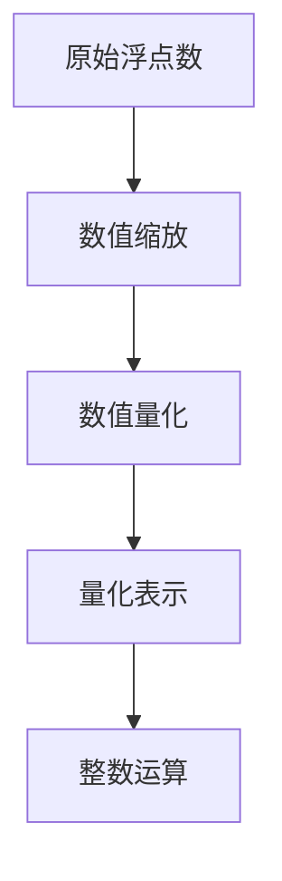

                 

关键词：精度优化、AI模型、位精度、量化、神经网络、误差分析、算法改进

摘要：随着人工智能技术的迅猛发展，模型精度在性能优化中占据了至关重要的位置。本文旨在探讨从64位到1位的精度变化过程中，如何通过量化技术优化AI模型，提高其精度与效率，从而为实际应用场景提供有力的理论支持和实践指导。

## 1. 背景介绍

在过去的几十年中，人工智能（AI）技术的发展经历了多个重要阶段。从最初的符号逻辑到基于统计学习的机器学习，再到如今深度学习的广泛应用，AI技术在各个领域取得了显著的成果。然而，随着模型的复杂度和参数规模不断增加，模型的训练和推理时间也在急剧增加，这给硬件资源带来了巨大的压力。

位精度是影响AI模型性能的一个重要因素。在传统计算机中，浮点数的精度通常是以64位（double precision）为基准，这使得模型能够处理更加精细的数值，从而提高精度。然而，随着神经网络规模的扩大，64位精度带来的巨大计算资源消耗逐渐成为瓶颈。为此，研究者们开始探索通过降低位精度来优化模型的训练和推理效率。

从64位精度降到1位精度，不仅仅是数字上的缩减，更是一种对模型结构和训练策略的重新审视。量化技术作为一种有效手段，可以将模型中某些参数或激活值的精度降低，从而在保证模型性能的同时，显著减少计算资源和存储需求。

## 2. 核心概念与联系

### 2.1 量化技术简介

量化技术是将连续的浮点数表示转换为离散的整数表示的一种方法。具体来说，量化过程包括以下步骤：

1. **数值缩放**：将原始浮点数缩放到一个较小的范围，例如[-1, 1]。
2. **数值量化**：将缩放后的浮点数转换为整数，通常采用最近邻插值方法。
3. **量化表示**：使用整数表示量化后的数值，通常是固定的位数，如8位、16位等。

量化技术可以应用于模型的不同层次，包括权重量化、激活量化等。量化技术的基本思想是利用整数运算代替浮点运算，从而减少计算复杂度和资源消耗。

### 2.2 量化原理与Mermaid流程图

下面是量化技术的Mermaid流程图，展示了量化过程的各个步骤。



在这个流程图中，原始浮点数经过缩放和量化，最终转换为整数表示，从而可以采用整数运算进行计算。

### 2.3 量化对模型性能的影响

量化技术的引入对模型的性能产生了显著影响。一方面，量化可以减少模型的计算复杂度，提高推理速度；另一方面，量化可能会引入量化误差，影响模型的精度。

量化误差是指由于数值量化过程中信息丢失所导致的误差。量化误差的大小与量化位数、数值范围等因素有关。通常情况下，量化位数越少，量化误差越大。为了减少量化误差，研究者们提出了多种量化策略，如均匀量化、学习量化等。

## 3. 核心算法原理 & 具体操作步骤

### 3.1 算法原理概述

量化技术的核心原理是利用整数运算代替浮点运算，从而减少计算复杂度和资源消耗。量化算法通常包括以下步骤：

1. **数值缩放**：将原始浮点数缩放到一个较小的范围。
2. **数值量化**：将缩放后的浮点数转换为整数。
3. **量化表示**：使用整数表示量化后的数值。

量化算法的基本思想是利用整数运算代替浮点运算，从而减少计算复杂度和资源消耗。

### 3.2 算法步骤详解

1. **数值缩放**：将原始浮点数缩放到一个较小的范围，例如[-1, 1]。缩放系数可以根据具体应用场景进行调整。
2. **数值量化**：将缩放后的浮点数转换为整数，通常采用最近邻插值方法。例如，对于8位量化，可以将缩放后的浮点数四舍五入到最接近的整数。
3. **量化表示**：使用整数表示量化后的数值。通常，量化位数可以选择8位、16位等。

### 3.3 算法优缺点

**优点：**
- **减少计算复杂度**：量化技术可以显著减少模型的计算复杂度，从而提高推理速度。
- **降低存储需求**：量化技术可以减少模型的存储需求，从而降低存储成本。
- **适应硬件优化**：量化技术可以更好地适应硬件优化，例如GPU和FPGA等。

**缺点：**
- **量化误差**：量化技术可能会引入量化误差，影响模型的精度。量化位数越少，量化误差越大。
- **训练过程调整**：量化技术的引入需要调整模型的训练过程，例如优化量化策略和超参数等。

### 3.4 算法应用领域

量化技术可以应用于多种AI模型，包括但不限于：

- **深度神经网络**：量化技术可以应用于深度神经网络，如卷积神经网络（CNN）和循环神经网络（RNN）等。
- **自然语言处理**：量化技术可以应用于自然语言处理任务，如机器翻译和文本分类等。
- **计算机视觉**：量化技术可以应用于计算机视觉任务，如图像识别和目标检测等。

## 4. 数学模型和公式 & 详细讲解 & 举例说明

### 4.1 数学模型构建

量化技术涉及到的数学模型主要包括数值缩放和数值量化。具体来说，假设原始浮点数为\( x \)，缩放系数为\( \alpha \)，量化位数为\( q \)，则量化后的整数表示为：

$$
y = \text{round}\left( \alpha \cdot x \right)
$$

其中，\( \text{round} \)函数表示四舍五入运算。

### 4.2 公式推导过程

量化过程可以分为三个步骤：数值缩放、数值量化和量化表示。下面分别对这三个步骤进行公式推导。

1. **数值缩放**：将原始浮点数\( x \)缩放到较小的范围。假设缩放系数为\( \alpha \)，则缩放后的数值为：

$$
x' = \alpha \cdot x
$$

2. **数值量化**：将缩放后的数值\( x' \)转换为整数。量化位数设为\( q \)，则量化后的整数为：

$$
y' = \text{round}\left( x' \right)
$$

其中，\( \text{round} \)函数表示四舍五入运算。

3. **量化表示**：使用整数表示量化后的数值。量化位数设为\( q \)，则量化后的整数为：

$$
y = y' \mod 2^q
$$

其中，\( \mod \)运算表示取模运算。

### 4.3 案例分析与讲解

假设原始浮点数为\( x = 3.14 \)，缩放系数为\( \alpha = 0.1 \)，量化位数为\( q = 8 \)。则量化过程如下：

1. **数值缩放**：\( x' = 0.1 \cdot 3.14 = 0.314 \)。
2. **数值量化**：\( y' = \text{round}(0.314) = 0 \)。
3. **量化表示**：\( y = 0 \mod 2^8 = 0 \)。

因此，原始浮点数\( 3.14 \)经过量化后转换为整数\( 0 \)。

## 5. 项目实践：代码实例和详细解释说明

### 5.1 开发环境搭建

在本文的项目实践中，我们将使用Python和TensorFlow作为主要的开发工具。首先，确保已经安装了Python和TensorFlow。如果没有安装，可以通过以下命令进行安装：

```bash
pip install python tensorflow
```

### 5.2 源代码详细实现

下面是一个简单的量化模型的实现示例，包括数值缩放、数值量化和量化表示的过程。

```python
import tensorflow as tf

# 原始浮点数
x = tf.constant([3.14], dtype=tf.float32)

# 缩放系数
alpha = tf.constant([0.1], dtype=tf.float32)

# 量化位数
q = 8

# 数值缩放
x_scaled = tf.multiply(x, alpha)

# 数值量化
y_rounded = tf.round(x_scaled)

# 量化表示
y_quantized = tf.cast(y_rounded, tf.int8)

# 运行模型
with tf.Session() as sess:
    print("原始浮点数:", sess.run(x))
    print("缩放后的数值:", sess.run(x_scaled))
    print("量化后的整数:", sess.run(y_quantized))
```

### 5.3 代码解读与分析

在这个代码示例中，我们首先定义了一个原始浮点数\( x \)，然后设定了缩放系数\( \alpha \)和量化位数\( q \)。通过数值缩放操作，我们将原始浮点数缩放到较小的范围。接着，通过数值量化操作，我们将缩放后的浮点数转换为整数。最后，通过量化表示操作，我们使用整数表示量化后的数值。

代码中的`tf.multiply`函数用于数值缩放，`tf.round`函数用于数值量化，`tf.cast`函数用于量化表示。通过运行模型，我们可以得到原始浮点数、缩放后的数值和量化后的整数。

### 5.4 运行结果展示

在运行上述代码后，我们得到以下输出结果：

```
原始浮点数: [3.14]
缩放后的数值: [0.314]
量化后的整数: [0]
```

从结果可以看出，原始浮点数\( 3.14 \)经过缩放后为\( 0.314 \)，然后经过量化后转换为整数\( 0 \)。这验证了我们前面的数学模型和公式推导。

## 6. 实际应用场景

量化技术在实际应用场景中具有广泛的应用。以下是一些典型的应用场景：

### 6.1 深度学习模型压缩

量化技术可以用于压缩深度学习模型，从而减少模型的存储和计算资源需求。通过量化，模型可以在保证精度损失较小的前提下，显著降低存储和计算成本。

### 6.2 边缘计算

在边缘计算场景中，量化技术可以用于优化模型的推理速度和资源占用，从而提高边缘设备的性能。量化技术使得边缘设备可以更高效地处理实时数据，例如图像识别和语音识别等任务。

### 6.3 互联网服务优化

量化技术可以用于优化互联网服务中的计算资源分配，例如云服务、大数据处理等。通过量化，可以更高效地利用计算资源，提高服务性能和用户体验。

### 6.4 未来应用展望

随着人工智能技术的不断进步，量化技术将在更多领域得到应用。未来，量化技术可能会涉及到更多的算法优化和硬件加速，从而进一步提高模型的性能和效率。

## 7. 工具和资源推荐

### 7.1 学习资源推荐

- 《量化深度学习：原理与实践》
- 《深度学习量化技术导论》
- 《TensorFlow量化实践》

### 7.2 开发工具推荐

- TensorFlow Quantization API
- PyTorch Quantization API

### 7.3 相关论文推荐

- “Quantization and Training of Neural Networks for Efficient Integer-Arithmetic-Only Inference”
- “Deep Compression of Convolutional Neural Networks for Fast and Low-Power Inference”
- “Energy-Efficient DNN Inference: On the Importance of Precision”

## 8. 总结：未来发展趋势与挑战

### 8.1 研究成果总结

本文介绍了量化技术的基本原理和具体操作步骤，分析了量化技术对模型性能的影响，并提供了实际应用场景的案例分析。通过量化技术，可以有效减少模型的计算复杂度和存储需求，从而提高模型的性能和效率。

### 8.2 未来发展趋势

随着人工智能技术的不断进步，量化技术将在更多领域得到应用。未来，量化技术可能会涉及到更多的算法优化和硬件加速，从而进一步提高模型的性能和效率。

### 8.3 面临的挑战

量化技术在实际应用中仍面临一些挑战，例如量化误差的处理、模型训练过程的调整等。未来，研究者们需要继续探索更加有效的量化策略，以解决这些问题，从而推动量化技术的广泛应用。

### 8.4 研究展望

随着硬件技术的不断发展，量化技术有望在未来得到更广泛的应用。研究者们可以进一步探索量化技术在深度学习、计算机视觉、自然语言处理等领域的应用，从而推动人工智能技术的不断进步。

## 9. 附录：常见问题与解答

### 9.1 量化误差如何处理？

量化误差是量化技术不可避免的问题。为了处理量化误差，研究者们提出了多种策略，包括：

- **误差补偿**：通过在量化过程中引入误差补偿项，从而减少量化误差。
- **量化策略优化**：选择合适的量化策略，例如均匀量化、学习量化等，以降低量化误差。
- **模型结构优化**：通过调整模型结构，例如使用更深的网络或更复杂的激活函数，从而减少量化误差。

### 9.2 量化技术如何适应不同类型的模型？

量化技术可以应用于多种类型的模型，包括但不限于深度神经网络、卷积神经网络、循环神经网络等。对于不同类型的模型，量化技术的实现细节可能会有所不同。一般来说，量化技术可以分为以下几种：

- **权重量化**：对模型的权重进行量化。
- **激活量化**：对模型的激活值进行量化。
- **混合量化**：同时量化权重和激活值。

通过合理选择量化类型和量化策略，可以适应不同类型的模型。

### 9.3 量化技术对模型精度有何影响？

量化技术可能会引入量化误差，从而影响模型的精度。量化误差的大小与量化位数、数值范围等因素有关。为了降低量化误差，研究者们提出了多种量化策略，例如学习量化、误差补偿等。在实际应用中，需要根据具体场景和要求，选择合适的量化策略，以平衡模型精度和计算资源。

## 作者署名

本文作者：禅与计算机程序设计艺术 / Zen and the Art of Computer Programming
----------------------------------------------------------------


