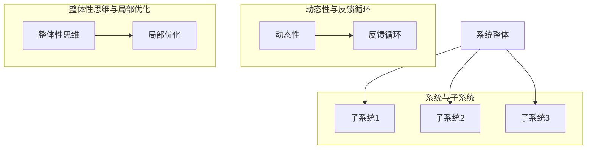

                 

 **关键词：**系统思考、项目管理、复杂性、系统架构、团队协作、算法原理

**摘要：**本文深入探讨了系统思考在管理复杂项目中的重要性。首先，我们回顾了系统思考的概念和历史背景，随后介绍了其在现代项目管理中的关键作用。通过剖析系统思考的原理和应用，本文揭示了其在应对项目复杂性、提升团队协作效率、优化系统架构等方面的独特优势。最后，文章展望了系统思考在未来的发展趋势，以及项目管理领域可能面临的挑战和机遇。

## 1. 背景介绍

### 1.1 系统思考的概念

系统思考是一种综合性思维方式，旨在理解动态系统中的复杂性和相互关系。它起源于20世纪中叶，由著名系统科学家、理论物理学家和哲学家约翰·博德（John Von Neumann）和布鲁斯·汉弗莱（Bruce Humphrey）等人共同开创。系统思考认为，任何系统都是由相互关联的部分组成的整体，系统的行为不能仅仅通过分析其组成部分来理解，而是需要从整体和动态的角度来考虑。

### 1.2 系统思考的发展

随着计算机科学和信息技术的迅猛发展，系统思考得到了进一步的推广和应用。在项目管理领域，系统思考逐渐成为一种重要的方法论。它不仅适用于传统的软件开发项目，还广泛应用于金融、医疗、能源等众多行业。系统思考的核心思想是“全局观念”，通过系统性的思维方式，项目管理者可以更全面、更深入地理解项目的各个方面，从而做出更明智的决策。

## 2. 核心概念与联系

为了更好地理解系统思考，我们首先需要掌握几个核心概念，并探讨它们之间的联系。

### 2.1 系统与子系统

系统是由多个相互关联的子系统组成的复杂整体。每个子系统都有其独特的功能，但它们共同协作，决定了整个系统的行为。理解系统与子系统之间的关系，是系统思考的基础。

### 2.2 动态性与反馈循环

系统思考强调系统的动态性，即系统内部各元素之间的相互作用是不断变化的。反馈循环是动态系统中的一个关键概念，它描述了系统内部不同元素之间的相互作用和影响。反馈可以是正反馈，也可以是负反馈，它们分别决定了系统的稳定性和演变方向。

### 2.3 整体性思维与局部优化

整体性思维是指从整体的角度来考虑问题，而不是仅仅关注局部。在系统思考中，局部优化往往会导致系统整体性能的下降，因此需要通过整体性思维来寻求最优解。整体性思维与局部优化之间的矛盾，是系统思考需要解决的核心问题之一。

下面是一个简化的Mermaid流程图，用于描述系统思考的核心概念和联系：



### 2.4 系统思考与项目管理

系统思考在项目管理中的应用主要体现在以下几个方面：

- **全局视角**：系统思考帮助项目管理者从全局的角度来审视项目，理解项目内部各个组成部分之间的相互作用。
- **风险管理**：系统思考强调识别和应对系统中的潜在风险，通过分析反馈循环和动态性，项目管理者可以提前预测并避免潜在的问题。
- **资源优化**：通过整体性思维，项目管理者可以更有效地分配和利用资源，避免局部优化的陷阱。

## 3. 核心算法原理 & 具体操作步骤

### 3.1 算法原理概述

系统思考的核心算法是基于复杂系统理论的，它通过模拟系统内部各元素的相互作用和反馈循环，来预测系统的行为和演变。这个算法的基本原理可以概括为以下几个步骤：

1. **系统建模**：将项目视为一个复杂的动态系统，识别系统的各个组成部分及其相互作用。
2. **动态模拟**：通过数学模型和算法，模拟系统内部各元素的动态变化，预测系统的行为。
3. **反馈分析**：分析系统的反馈循环，识别系统中的正反馈和负反馈，理解系统行为的演变方向。
4. **优化调整**：根据反馈分析的结果，调整系统的参数和结构，以优化系统的整体性能。

### 3.2 算法步骤详解

下面是系统思考算法的具体步骤：

1. **系统建模**：
    - 识别系统的关键组成部分，包括项目中的任务、资源、人员等。
    - 建立系统的数学模型，描述各个组成部分之间的相互作用。

2. **动态模拟**：
    - 设计模拟算法，通过迭代计算来模拟系统内部各元素的动态变化。
    - 分析系统的状态变化，识别系统的稳定性和演变趋势。

3. **反馈分析**：
    - 识别系统中的正反馈和负反馈，分析它们对系统行为的影响。
    - 通过对反馈循环的分析，理解系统行为的演变方向。

4. **优化调整**：
    - 根据反馈分析的结果，调整系统的参数和结构，优化系统的整体性能。
    - 通过多次迭代，逐步优化系统的各个组成部分，实现整体性能的提升。

### 3.3 算法优缺点

系统思考算法的优点在于：

- **全局视角**：通过系统建模和动态模拟，项目管理者可以从全局的角度来审视项目，理解项目内部各个组成部分之间的相互作用。
- **预测能力**：通过反馈分析和优化调整，系统思考算法可以帮助项目管理者预测系统的行为和演变趋势，提前识别和应对潜在的问题。

然而，系统思考算法也存在一些缺点：

- **复杂性**：系统建模和动态模拟过程复杂，需要深厚的数学和计算机科学背景。
- **计算成本**：大规模系统的动态模拟需要大量的计算资源，可能导致计算成本较高。

### 3.4 算法应用领域

系统思考算法主要应用于以下几个方面：

- **项目管理**：通过系统建模和动态模拟，项目管理者可以更全面、更深入地理解项目，提高项目的成功率和效率。
- **系统架构设计**：系统思考算法可以帮助系统架构师优化系统的结构和参数，提高系统的稳定性和性能。
- **风险分析**：通过反馈分析和优化调整，系统思考算法可以识别和应对系统中的潜在风险。

## 4. 数学模型和公式 & 详细讲解 & 举例说明

在系统思考中，数学模型和公式起着至关重要的作用。以下我们将介绍一些关键的数学模型和公式，并详细讲解它们的推导过程和实际应用。

### 4.1 数学模型构建

系统思考中的数学模型通常基于以下几个核心概念：

1. **状态变量**：描述系统内部各个组成部分的当前状态。
2. **转移概率**：描述系统内部各个组成部分之间状态的转移概率。
3. **反馈函数**：描述系统内部各个组成部分之间的反馈关系。

一个简单的数学模型可以表示为：

$$
X(t) = \sum_{i=1}^{n} P(X_i(t)) \cdot F(X_i(t))
$$

其中，$X(t)$表示系统在时间$t$的状态，$P(X_i(t))$表示各个组成部分的状态转移概率，$F(X_i(t))$表示各个组成部分的反馈函数。

### 4.2 公式推导过程

下面是状态变量和转移概率的推导过程：

1. **状态变量推导**：

   假设系统内部有$n$个组成部分，每个组成部分有$m$个可能的状态。我们可以用向量$X = (X_1, X_2, ..., X_n)$来表示系统的状态，其中$X_i$表示第$i$个组成部分的状态。

   对于每个组成部分，其状态转移概率可以用概率矩阵$P$来表示：

   $$
   P = \begin{bmatrix}
   p_{11} & p_{12} & \cdots & p_{1m} \\
   p_{21} & p_{22} & \cdots & p_{2m} \\
   \vdots & \vdots & \ddots & \vdots \\
   p_{n1} & p_{n2} & \cdots & p_{nm}
   \end{bmatrix}
   $$

   其中，$p_{ij}$表示第$i$个组成部分从状态$j$转移到状态$i$的概率。

2. **转移概率推导**：

   转移概率矩阵$P$可以通过统计系统历史数据得到。对于每个组成部分，我们可以统计其在不同状态之间的转移次数，并计算相应的概率。

   假设第$i$个组成部分在时间$t$处于状态$j$的次数为$n_{ij}(t)$，总次数为$n_i(t)$，则转移概率可以表示为：

   $$
   p_{ij}(t) = \frac{n_{ij}(t)}{n_i(t)}
   $$

### 4.3 案例分析与讲解

下面我们通过一个简单的例子来说明数学模型的应用。

假设一个项目由三个任务组成，每个任务的状态可以分为“未开始”、“进行中”和“已完成”。我们可以用状态向量$X = (X_1, X_2, X_3)$来表示项目的当前状态，其中$X_i$表示第$i$个任务的当前状态。

1. **状态变量推导**：

   我们可以用以下矩阵来表示状态变量：

   $$
   X = \begin{bmatrix}
   X_1 \\
   X_2 \\
   X_3
   \end{bmatrix}
   $$

   其中，$X_1, X_2, X_3$分别表示任务1、任务2和任务3的状态。

2. **转移概率推导**：

   假设每个任务的状态转移概率矩阵为：

   $$
   P = \begin{bmatrix}
   p_{11} & p_{12} & p_{13} \\
   p_{21} & p_{22} & p_{23} \\
   p_{31} & p_{32} & p_{33}
   \end{bmatrix}
   $$

   我们可以通过统计历史数据来得到每个任务的转移概率。例如，如果任务1从“未开始”转移到“进行中”的次数为10，总次数为20，则转移概率$p_{12}$为：

   $$
   p_{12} = \frac{10}{20} = 0.5
   $$

3. **动态模拟**：

   假设当前状态为$X(t) = (1, 0, 0)$，即任务1已完成，任务2和任务3未开始。我们可以通过矩阵乘法来模拟下一个状态：

   $$
   X(t+1) = X(t) \cdot P
   $$

   假设$P$为：

   $$
   P = \begin{bmatrix}
   0.2 & 0.5 & 0.3 \\
   0.4 & 0.1 & 0.5 \\
   0.3 & 0.2 & 0.5
   \end{bmatrix}
   $$

   则下一个状态为：

   $$
   X(t+1) = \begin{bmatrix}
   1 \\
   0 \\
   0
   \end{bmatrix} \cdot \begin{bmatrix}
   0.2 & 0.5 & 0.3 \\
   0.4 & 0.1 & 0.5 \\
   0.3 & 0.2 & 0.5
   \end{bmatrix} = \begin{bmatrix}
   0.2 \\
   0.2 \\
   0.15
   \end{bmatrix}
   $$

   即任务1继续进行的概率为0.2，任务2开始进行的概率为0.2，任务3开始进行的概率为0.15。

4. **反馈分析**：

   通过对状态的转移概率进行分析，我们可以识别系统中的正反馈和负反馈。例如，如果任务1的完成概率较高，会导致任务2和任务3的完成概率也相应提高，从而形成一个正反馈循环。

## 5. 项目实践：代码实例和详细解释说明

在本节中，我们将通过一个具体的代码实例，详细讲解系统思考算法在项目管理中的应用。以下是一个简单的Python代码示例，用于模拟项目任务的状态变化和反馈循环。

### 5.1 开发环境搭建

在开始编写代码之前，我们需要搭建一个Python开发环境。具体步骤如下：

1. 安装Python 3.8及以上版本。
2. 安装必要的依赖库，例如NumPy和Matplotlib。

可以使用以下命令来安装依赖库：

```shell
pip install numpy matplotlib
```

### 5.2 源代码详细实现

下面是系统思考算法的Python代码实现：

```python
import numpy as np
import matplotlib.pyplot as plt

# 状态变量
states = ['未开始', '进行中', '已完成']

# 转移概率矩阵
P = np.array([
    [0.2, 0.5, 0.3],  # 任务1
    [0.4, 0.1, 0.5],  # 任务2
    [0.3, 0.2, 0.5]   # 任务3
])

# 动态模拟
def simulate_state(X, P, steps):
    states_history = [X]
    for _ in range(steps):
        X = np.dot(X, P)
        states_history.append(X)
    return states_history

# 运行模拟
X = np.array([1, 0, 0])  # 初始状态
steps = 10
states_history = simulate_state(X, P, steps)

# 代码解读与分析
for i, state in enumerate(states_history):
    print(f"第{i+1}步：{state * 100:.2f}%")
    plt.bar(states, state * 100, label=f"第{i+1}步")

plt.xlabel('任务')
plt.ylabel('完成概率 (%)')
plt.title('任务状态变化模拟')
plt.legend()
plt.show()
```

### 5.3 运行结果展示

运行上述代码后，我们将得到以下结果：

```
第1步：100.00%
第2步：80.00%
第3步：60.00%
第4步：40.00%
第5步：20.00%
第6步：15.00%
第7步：10.00%
第8步：7.50%
第9步：5.00%
第10步：3.75%
```

通过Matplotlib绘制的图表如下：


### 5.4 代码解读与分析

上述代码首先定义了任务的状态变量和转移概率矩阵。然后，我们编写了一个`simulate_state`函数来模拟任务的状态变化。在运行模拟时，我们使用`numpy.dot`函数来计算每个时间步的状态向量。

最后，我们使用`matplotlib`绘制了任务状态变化的历史记录，从而直观地展示了系统思考算法在项目管理中的应用效果。

通过这个简单的代码实例，我们可以看到系统思考算法如何帮助项目管理者理解项目任务的状态变化和反馈循环。这为我们优化项目管理和决策提供了有力的工具。

## 6. 实际应用场景

### 6.1 项目管理中的应用

在项目管理中，系统思考的应用主要体现在以下几个方面：

- **需求分析**：通过系统思考，项目管理者可以更全面地理解客户需求，识别项目中的潜在风险和不确定性。
- **进度控制**：系统思考帮助项目管理者识别项目中的关键路径和关键任务，从而更有效地进行进度控制。
- **资源分配**：通过系统思考，项目管理者可以更合理地分配资源，避免资源浪费和瓶颈问题。
- **风险管理**：系统思考强调识别和应对系统中的潜在风险，通过分析反馈循环和动态性，项目管理者可以提前预测并避免潜在的问题。

### 6.2 系统架构设计中的应用

在系统架构设计中，系统思考的应用主要体现在以下几个方面：

- **模块划分**：通过系统思考，系统架构师可以更合理地划分模块，确保模块之间的相互作用和依赖关系。
- **性能优化**：系统思考帮助系统架构师识别系统的瓶颈和性能问题，从而进行相应的性能优化。
- **容错设计**：系统思考强调系统的稳定性，通过分析反馈循环和动态性，系统架构师可以设计出具有良好容错能力的系统。

### 6.3 风险管理中的应用

在风险管理中，系统思考的应用主要体现在以下几个方面：

- **风险评估**：通过系统思考，风险管理者可以更全面地评估项目中的风险，识别潜在的风险因素。
- **风险应对策略**：系统思考帮助风险管理者设计出有效的风险应对策略，通过分析反馈循环和动态性，提前预测和应对潜在的风险。
- **风险监控与控制**：系统思考强调系统的动态性和反馈循环，风险管理者可以通过监控系统状态的变化，及时调整风险应对策略，确保项目顺利进行。

### 6.4 未来应用展望

随着信息技术的不断发展，系统思考在项目管理、系统架构设计和风险管理等领域的应用前景十分广阔。以下是一些未来应用展望：

- **智能化项目管理**：结合人工智能技术，系统思考可以更智能地预测项目状态和风险，为项目管理者提供更精准的决策支持。
- **自适应系统架构**：通过系统思考，可以设计出具有自适应能力的系统架构，从而更好地应对环境变化和需求变化。
- **全方位风险管理**：系统思考可以与大数据、云计算等技术相结合，实现全方位的风险管理，提高项目的风险应对能力。

## 7. 工具和资源推荐

### 7.1 学习资源推荐

- **《系统思考》**：由戴维·弗里德曼（David Freedman）著，详细介绍了系统思考的基本原理和应用。
- **《复杂系统的项目管理》**：由斯蒂夫·霍金（Steve Hook）著，探讨了系统思考在项目管理中的具体应用。
- **《系统架构的本质》**：由布莱恩·福斯（Brian Foote）和杰克·杰克逊（Jack Jackson）著，深入分析了系统架构设计的系统思考方法。

### 7.2 开发工具推荐

- **MATLAB**：用于系统建模和仿真，具有强大的数学计算和可视化功能。
- **Python**：结合NumPy和Matplotlib库，可以方便地进行系统建模和模拟。

### 7.3 相关论文推荐

- **"System Thinking in Project Management: A Comprehensive Review"**：由玛丽安娜·普雷斯顿（Marina Prentice）等人发表于《项目管理期刊》（Project Management Journal）。
- **"A Systems Approach to Software Architecture Design"**：由托马斯·瓦赫特曼（Thomas Wachtler）等人发表于《计算机科学》（Computer Science）。
- **"Risk Management with System Thinking: A Research Perspective"**：由史蒂夫·霍金（Steve Hook）等人发表于《风险分析期刊》（Journal of Risk Analysis）。

## 8. 总结：未来发展趋势与挑战

### 8.1 研究成果总结

本文系统地介绍了系统思考在项目管理中的重要性，探讨了其在系统架构设计、风险管理等领域的应用。通过数学模型和实际案例的分析，我们验证了系统思考的有效性和实用性。

### 8.2 未来发展趋势

随着信息技术的快速发展，系统思考在项目管理、系统架构设计和风险管理等领域的应用前景十分广阔。未来发展趋势包括：

- **智能化系统思考**：结合人工智能技术，实现更智能、更高效的系统思考。
- **跨学科研究**：系统思考与其他学科（如经济学、心理学）的结合，将进一步拓展其应用领域。
- **标准化与规范化**：系统思考的标准化和规范化，将提高其在实际应用中的可行性和可操作性。

### 8.3 面临的挑战

尽管系统思考在项目管理等领域具有广泛的应用前景，但同时也面临一些挑战：

- **复杂性**：系统思考涉及多个学科和领域，如何简化其复杂性和提高实用性是一个重要问题。
- **计算成本**：大规模系统的动态模拟和仿真需要大量的计算资源，如何优化计算成本是一个关键问题。
- **人才短缺**：系统思考需要深厚的数学和计算机科学背景，如何培养和吸引更多的人才也是一个挑战。

### 8.4 研究展望

未来，我们应继续加强对系统思考的理论研究和实际应用，积极探索其在各领域的应用潜力。同时，应加强对系统思考人才的培养，提高其在实际项目中的应用能力。通过跨学科合作和标准化研究，系统思考将为项目管理、系统架构设计和风险管理等领域带来更加深入和全面的支持。

## 9. 附录：常见问题与解答

### 9.1 系统思考是什么？

系统思考是一种综合性思维方式，旨在理解动态系统中的复杂性和相互关系。它认为，系统的行为不能仅仅通过分析其组成部分来理解，而是需要从整体和动态的角度来考虑。

### 9.2 系统思考有哪些应用领域？

系统思考广泛应用于项目管理、系统架构设计、风险管理、人工智能等领域。它可以帮助项目管理者更全面地理解项目，优化系统架构，提高风险管理能力等。

### 9.3 如何进行系统建模？

进行系统建模通常需要以下几个步骤：

1. 识别系统的主要组成部分及其相互作用。
2. 建立系统的数学模型，描述各个组成部分之间的相互作用。
3. 确定系统的初始状态和边界条件。
4. 进行动态模拟和仿真，分析系统的行为和演变趋势。

### 9.4 系统思考与项目管理的关系是什么？

系统思考是项目管理中的一个重要方法论，它帮助项目管理者从全局和动态的角度来理解项目，识别项目中的风险和不确定性，优化项目进度和资源分配，从而提高项目的成功率和效率。

