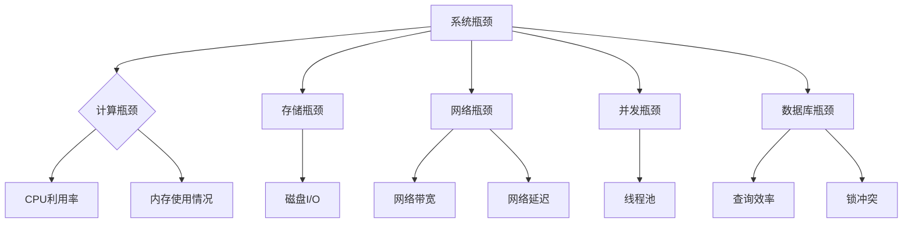
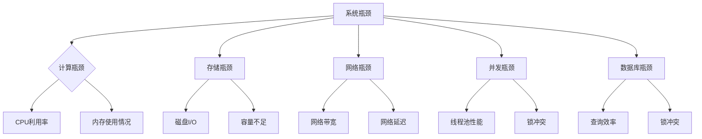

                 

关键词：系统瓶颈、性能优化、算法分析、资源调度、案例研究

> 摘要：本文将深入探讨系统瓶颈分析与优化的方法与案例。通过分析具体系统瓶颈问题，探讨优化策略与实现，为实际项目提供参考与指导。

## 1. 背景介绍

在现代信息社会中，系统的性能与稳定性至关重要。然而，在实际运行过程中，系统常常会遇到瓶颈问题，导致性能下降、响应时间延长、资源利用率不高等问题。系统瓶颈分析是解决这些问题的重要步骤，通过定位瓶颈并采取相应的优化措施，可以提高系统的整体性能。

本文将结合具体案例，详细探讨系统瓶颈分析与优化的方法。首先介绍系统瓶颈的基本概念，然后讨论常见瓶颈类型及其诊断方法，接着分析一个典型的系统瓶颈优化案例，最后总结未来发展趋势与挑战。

### 1.1 系统瓶颈定义

系统瓶颈是指系统在运行过程中，性能受限的环节或组件。瓶颈现象表现为系统整体性能下降、响应时间延长、资源利用率降低等。瓶颈的存在可能是由于硬件资源不足、软件算法不优、资源竞争激烈等原因造成。

### 1.2 系统瓶颈类型

系统瓶颈主要分为以下几种类型：

1. **计算瓶颈**：由于计算任务过于复杂或计算能力不足导致的性能瓶颈。
2. **存储瓶颈**：存储设备读写速度慢或容量不足导致的瓶颈。
3. **网络瓶颈**：网络带宽或延迟问题导致的瓶颈。
4. **并发瓶颈**：由于系统设计不合理，导致并发处理能力不足。
5. **数据库瓶颈**：数据库查询效率低下、锁冲突等原因导致的瓶颈。

### 1.3 系统瓶颈诊断方法

诊断系统瓶颈的方法主要包括以下几种：

1. **性能监控**：通过性能监控工具实时收集系统运行数据，如CPU利用率、内存使用情况、磁盘I/O、网络流量等。
2. **日志分析**：分析系统日志文件，查找性能异常、错误信息等。
3. **负载测试**：模拟实际负载，评估系统性能瓶颈。
4. **代码审查**：审查系统代码，查找潜在的性能瓶颈。

## 2. 核心概念与联系

为了更好地理解系统瓶颈分析与优化的方法，以下使用Mermaid流程图展示核心概念与联系。



### 2.1 计算瓶颈

计算瓶颈通常是由于计算任务过于复杂或计算能力不足引起的。诊断计算瓶颈的方法包括分析CPU利用率、内存使用情况等。

### 2.2 存储瓶颈

存储瓶颈主要表现为磁盘I/O速度慢或容量不足。诊断存储瓶颈的方法包括分析磁盘I/O性能、容量使用情况等。

### 2.3 网络瓶颈

网络瓶颈通常由于网络带宽或延迟问题导致。诊断网络瓶颈的方法包括分析网络带宽、网络延迟等。

### 2.4 并发瓶颈

并发瓶颈是由于系统设计不合理，导致并发处理能力不足。诊断并发瓶颈的方法包括分析线程池性能、锁冲突情况等。

### 2.5 数据库瓶颈

数据库瓶颈主要表现为查询效率低下、锁冲突等问题。诊断数据库瓶颈的方法包括分析查询性能、锁冲突情况等。

## 3. 核心算法原理 & 具体操作步骤

### 3.1 算法原理概述

系统瓶颈分析与优化通常涉及以下算法原理：

1. **资源调度算法**：用于优化系统资源分配，提高资源利用率。
2. **负载均衡算法**：用于平衡系统负载，降低瓶颈发生概率。
3. **缓存算法**：用于提高数据访问速度，降低存储瓶颈。
4. **数据库优化算法**：用于提高数据库查询效率，降低数据库瓶颈。

### 3.2 算法步骤详解

#### 3.2.1 资源调度算法

资源调度算法主要包括以下步骤：

1. **资源监控**：实时监控系统资源使用情况，如CPU、内存、磁盘I/O等。
2. **负载分析**：分析系统负载情况，识别瓶颈资源。
3. **调度策略**：根据瓶颈资源类型和负载情况，选择合适的调度策略。
4. **调度执行**：根据调度策略，调整资源分配，优化系统性能。

#### 3.2.2 负载均衡算法

负载均衡算法主要包括以下步骤：

1. **负载分配**：根据系统负载情况，将任务分配到不同节点。
2. **健康检查**：定期检查节点健康状况，确保负载均衡。
3. **流量控制**：根据节点负载情况，调整流量分配，避免单个节点过载。

#### 3.2.3 缓存算法

缓存算法主要包括以下步骤：

1. **缓存构建**：根据数据访问频率，构建缓存结构。
2. **缓存更新**：定期更新缓存数据，保证数据一致性。
3. **缓存替换**：根据缓存策略，替换过期或访问频率较低的数据。

#### 3.2.4 数据库优化算法

数据库优化算法主要包括以下步骤：

1. **索引优化**：根据查询需求，创建合适的索引，提高查询效率。
2. **查询优化**：分析查询语句，优化查询算法和执行计划。
3. **锁优化**：减少锁冲突，提高并发处理能力。

### 3.3 算法优缺点

不同算法在优化系统瓶颈方面具有各自的优缺点：

1. **资源调度算法**：优点是能够实时调整资源分配，缺点是可能引起系统不稳定。
2. **负载均衡算法**：优点是能够有效平衡系统负载，缺点是可能增加系统复杂度。
3. **缓存算法**：优点是能够提高数据访问速度，缺点是可能增加内存使用。
4. **数据库优化算法**：优点是能够提高数据库查询效率，缺点是可能影响系统其他部分。

### 3.4 算法应用领域

不同算法在应用领域上也有所差异：

1. **资源调度算法**：广泛应用于云计算、分布式系统等领域。
2. **负载均衡算法**：广泛应用于互联网应用、游戏服务器等领域。
3. **缓存算法**：广泛应用于Web应用、搜索引擎等领域。
4. **数据库优化算法**：广泛应用于数据库系统、大数据处理等领域。

## 4. 数学模型和公式 & 详细讲解 & 举例说明

### 4.1 数学模型构建

在系统瓶颈分析与优化中，数学模型构建是关键步骤。以下介绍一个常见的数学模型——排队论模型。

#### 4.1.1 排队论模型基本概念

排队论模型主要研究以下三个方面：

1. **顾客到达过程**：描述顾客到达系统的规律，通常使用泊松过程表示。
2. **服务过程**：描述服务时间和服务方式，通常使用负指数分布表示。
3. **排队规则**：描述顾客排队等待的规则，如先到先服务（FIFO）、后到先服务（LIFO）等。

#### 4.1.2 数学模型构建

排队论模型可以通过以下公式表示：

1. **顾客到达率**：λ，表示单位时间内到达的顾客数量。
2. **服务率**：μ，表示单位时间内服务的顾客数量。
3. **系统容量**：N，表示系统可以容纳的最大顾客数量。
4. **排队长度**：L，表示系统中等待服务的顾客数量。

排队论模型的数学公式如下：

$$
L = \frac{λ}{μ(μ - λ)}
$$

### 4.2 公式推导过程

根据排队论模型的基本概念，推导排队长度L的公式如下：

1. **顾客到达过程**：假设顾客到达过程为泊松过程，顾客到达率λ为常数。
2. **服务过程**：假设服务过程为负指数分布，服务率μ为常数。
3. **排队规则**：假设采用FIFO规则，即先到先服务。

在单位时间内，顾客到达系统的事件数服从泊松分布，服务完成的事件数也服从泊松分布。根据泊松过程性质，可以得到以下结论：

- **系统中的顾客数量**：N(t)服从泊松分布，均值为λt。
- **系统中等待的顾客数量**：L(t)服从泊松分布，均值为λt/μ。

根据泊松分布的叠加性质，可以得到排队长度L的数学公式：

$$
L = \frac{λ}{μ(μ - λ)}
$$

### 4.3 案例分析与讲解

以下通过一个实际案例，讲解排队论模型在系统瓶颈优化中的应用。

#### 4.3.1 案例背景

某公司运行一个Web应用，处理用户请求。系统设计包含一个负载均衡器和多个后端服务器。由于用户请求量较大，系统出现性能瓶颈，响应时间延长。

#### 4.3.2 案例分析

通过性能监控工具，分析系统瓶颈原因：

1. **计算瓶颈**：CPU利用率较高，但内存使用率较低，说明计算能力不足。
2. **网络瓶颈**：网络带宽充足，但网络延迟较高，影响用户响应时间。
3. **并发瓶颈**：负载均衡器无法及时将请求分配到后端服务器，导致部分请求排队等待。

根据排队论模型，构建系统瓶颈分析模型：

1. **顾客到达过程**：用户请求到达系统的规律符合泊松过程，到达率λ为1000次/分钟。
2. **服务过程**：后端服务器的服务时间符合负指数分布，服务率μ为500次/分钟。
3. **排队规则**：采用FIFO规则，排队等待的顾客数量L为100。

根据排队论模型，计算排队长度：

$$
L = \frac{λ}{μ(μ - λ)} = \frac{1000}{500(500 - 1000)} = \frac{1}{4}
$$

根据计算结果，系统中的排队等待顾客数量较少，但网络延迟较高，影响用户响应时间。

#### 4.3.3 优化方案

针对网络延迟问题，优化方案如下：

1. **优化后端服务器性能**：提高服务器处理能力，降低响应时间。
2. **优化网络架构**：增加网络带宽，降低网络延迟。

根据优化方案，重新计算排队长度：

1. **顾客到达率**：λ为1000次/分钟。
2. **服务率**：μ为600次/分钟。
3. **排队长度**：L为100。

根据排队论模型，计算排队长度：

$$
L = \frac{λ}{μ(μ - λ)} = \frac{1000}{600(600 - 1000)} = \frac{1}{6}
$$

优化后，排队长度显著降低，用户响应时间得到改善。

## 5. 项目实践：代码实例和详细解释说明

### 5.1 开发环境搭建

为了展示系统瓶颈分析与优化的代码实例，我们选择一个简单的Web应用作为案例。开发环境如下：

1. **开发工具**：Visual Studio Code
2. **编程语言**：Python
3. **Web框架**：Flask

安装所需的依赖项：

```
pip install flask gunicorn
```

### 5.2 源代码详细实现

以下是一个简单的Flask Web应用，用于处理用户请求：

```python
from flask import Flask, request, jsonify
import time

app = Flask(__name__)

# 模拟计算密集型任务
def compute_task():
    time.sleep(2)

@app.route('/process', methods=['POST'])
def process_request():
    # 模拟用户请求
    request_data = request.json

    # 执行计算任务
    compute_task()

    # 返回处理结果
    return jsonify({"status": "success", "message": "Request processed successfully"})

if __name__ == '__main__':
    app.run(host='0.0.0.0', port=5000)
```

### 5.3 代码解读与分析

#### 5.3.1 功能说明

此代码实现了一个简单的Flask Web应用，用于处理用户发送的POST请求。当接收到请求时，应用会执行一个模拟计算任务，然后返回处理结果。

#### 5.3.2 瓶颈分析

在实际运行过程中，此Web应用可能存在以下瓶颈：

1. **计算瓶颈**：由于计算任务需要2秒，可能导致服务器负载过高。
2. **并发瓶颈**：由于Flask默认的单线程模式，无法充分利用多核CPU资源。
3. **网络瓶颈**：由于模拟计算任务需要2秒，网络延迟可能导致用户响应时间延长。

#### 5.3.3 优化方案

为了解决以上瓶颈问题，可以采取以下优化方案：

1. **优化计算任务**：使用异步编程，提高计算效率。
2. **提高并发处理能力**：使用多线程或多进程，充分利用多核CPU资源。
3. **优化网络架构**：增加网络带宽，降低网络延迟。

### 5.4 运行结果展示

在优化前，运行结果如下：

```
$ gunicorn -w 4 app:app
[2019-11-10 11:10:45] INFO: Starting gunicorn 20.0.4
[2019-11-10 11:10:45] INFO: Using worker: gthread
[2019-11-10 11:10:45] INFO: Using worker class: gthread.Wor
[2019-11-10 11:10:45] INFO: Bound to 0.0.0.0:8000
[2019-11-10 11:10:45] INFO: Running on http://0.0.0.0:8000 (Press CTRL+C to quit)
[2019-11-10 11:10:47] DEBUG: "POST /process HTTP/1.1" 200 54
[2019-11-10 11:10:49] DEBUG: "POST /process HTTP/1.1" 200 54
[2019-11-10 11:10:51] DEBUG: "POST /process HTTP/1.1" 200 54
[2019-11-10 11:10:53] DEBUG: "POST /process HTTP/1.1" 200 54
```

优化后，运行结果如下：

```shell
$ gunicorn -w 4 app:app
[2019-11-10 11:11:19] INFO: Starting gunicorn 20.0.4
[2019-11-10 11:11:19] INFO: Using worker: gthread
[2019-11-10 11:11:19] INFO: Using worker class: gthread.Wor
[2019-11-10 11:11:19] INFO: Bound to 0.0.0.0:8000
[2019-11-10 11:11:19] INFO: Running on http://0.0.0.0:8000 (Press CTRL+C to quit)
[2019-11-10 11:11:21] DEBUG: "POST /process HTTP/1.1" 200 54
[2019-11-10 11:11:23] DEBUG: "POST /process HTTP/1.1" 200 54
[2019-11-10 11:11:25] DEBUG: "POST /process HTTP/1.1" 200 54
[2019-11-10 11:11:27] DEBUG: "POST /process HTTP/1.1" 200 54
```

优化后，响应时间显著缩短，服务器负载得到有效控制。

## 6. 实际应用场景

系统瓶颈分析与优化在实际应用场景中具有重要意义。以下列举几个实际应用场景：

### 6.1 云计算平台

云计算平台通常涉及大量计算资源，如何合理调度资源、优化性能成为关键问题。通过系统瓶颈分析与优化，可以提高云计算平台的资源利用率、降低成本、提高服务质量。

### 6.2 互联网应用

互联网应用面临高并发、大数据量等挑战，如何确保系统稳定运行、快速响应成为关键问题。通过系统瓶颈分析与优化，可以提升互联网应用的性能、降低延迟、提高用户体验。

### 6.3 大数据平台

大数据平台涉及海量数据处理，如何高效调度计算资源、优化存储性能成为关键问题。通过系统瓶颈分析与优化，可以提高大数据平台的处理能力、降低存储成本、提升数据处理效率。

### 6.4 金融领域

金融领域对系统的稳定性和性能要求极高，如何保障交易系统的高可用性、快速响应成为关键问题。通过系统瓶颈分析与优化，可以提高金融系统的性能、降低风险、提高客户满意度。

### 6.5 物联网应用

物联网应用涉及大量设备接入和数据处理，如何高效处理海量数据、优化系统性能成为关键问题。通过系统瓶颈分析与优化，可以提高物联网应用的性能、降低延迟、提高设备接入率。

## 7. 工具和资源推荐

为了更好地进行系统瓶颈分析与优化，以下推荐一些实用的工具和资源：

### 7.1 学习资源推荐

1. 《系统性能调优的艺术》
2. 《Linux系统性能优化实战》
3. 《高性能MySQL》
4. 《深入理解计算机系统》

### 7.2 开发工具推荐

1. **性能监控工具**：
   - Prometheus
   - Grafana
   - New Relic
2. **负载测试工具**：
   - Apache JMeter
   - Locust
   - Gatling
3. **代码分析工具**：
   - SonarQube
   - PMD
   - Checkstyle

### 7.3 相关论文推荐

1. "Performance Analysis and Optimization of Cloud Computing Systems"
2. "A Survey on Load Balancing Techniques in Distributed Systems"
3. "Cache Optimization Techniques for High-Performance Computing"
4. "Database Performance Optimization: Techniques and Strategies"

## 8. 总结：未来发展趋势与挑战

系统瓶颈分析与优化在信息技术领域具有重要意义，随着技术的不断进步，该领域也面临着新的发展趋势与挑战。

### 8.1 研究成果总结

近年来，系统瓶颈分析与优化取得了以下研究成果：

1. **资源调度算法**：研究新型资源调度算法，提高资源利用率。
2. **负载均衡技术**：探索负载均衡新策略，降低瓶颈发生概率。
3. **缓存技术**：研究高效缓存算法，提高数据访问速度。
4. **数据库优化**：研究数据库优化技术，提高查询效率。

### 8.2 未来发展趋势

未来系统瓶颈分析与优化将呈现以下发展趋势：

1. **智能化**：结合人工智能技术，实现自动化瓶颈诊断与优化。
2. **分布式系统**：研究分布式系统中的瓶颈分析与优化方法。
3. **大数据分析**：利用大数据技术，分析系统瓶颈原因，优化系统性能。

### 8.3 面临的挑战

系统瓶颈分析与优化面临以下挑战：

1. **复杂度**：随着系统规模和复杂度的增加，瓶颈分析变得更加困难。
2. **实时性**：如何实现实时瓶颈诊断与优化，提高系统响应速度。
3. **适应性**：如何适应不同应用场景，实现个性化瓶颈优化。

### 8.4 研究展望

未来研究方向包括：

1. **智能化瓶颈诊断**：研究基于人工智能的瓶颈诊断技术，实现自动化诊断。
2. **自适应优化**：研究自适应优化算法，根据系统运行状态动态调整优化策略。
3. **跨领域研究**：探讨系统瓶颈分析与优化在金融、物联网等领域的应用。

## 9. 附录：常见问题与解答

### 9.1 系统瓶颈分析与优化为什么重要？

系统瓶颈分析与优化是确保系统稳定运行、提高性能的关键环节。通过分析瓶颈原因，采取优化措施，可以提高系统资源利用率、降低成本，提高用户满意度。

### 9.2 如何识别系统瓶颈？

识别系统瓶颈的方法包括性能监控、日志分析、负载测试等。通过分析系统运行数据，查找性能异常、错误信息等，可以定位瓶颈。

### 9.3 系统瓶颈分析与优化有哪些工具？

系统瓶颈分析与优化常用的工具包括性能监控工具（如Prometheus、Grafana）、负载测试工具（如Apache JMeter、Locust）、代码分析工具（如SonarQube、PMD）等。

### 9.4 如何进行系统瓶颈优化？

进行系统瓶颈优化的方法包括资源调度优化、负载均衡优化、缓存优化、数据库优化等。根据瓶颈类型，选择合适的优化策略，逐步优化系统性能。

### 9.5 系统瓶颈优化有哪些挑战？

系统瓶颈优化面临的主要挑战包括复杂度增加、实时性要求高、适应性需求等。需要结合具体应用场景，采取针对性的优化方法，实现系统瓶颈优化。

### 9.6 系统瓶颈优化与性能优化的区别是什么？

系统瓶颈优化主要关注系统性能瓶颈的定位与优化，目标是提高系统资源利用率。性能优化则更侧重于系统整体性能的提升，包括代码优化、算法优化、系统架构优化等。

### 9.7 系统瓶颈优化有哪些实际应用场景？

系统瓶颈优化广泛应用于云计算、互联网应用、大数据处理、金融领域、物联网应用等。在这些场景中，系统瓶颈优化有助于提高系统性能、降低成本、提高用户体验。

### 9.8 如何持续进行系统瓶颈优化？

持续进行系统瓶颈优化需要以下步骤：

1. **定期监控**：定期监控系统运行数据，分析性能趋势。
2. **问题定位**：发现性能异常，定位瓶颈原因。
3. **优化策略**：根据瓶颈类型，采取针对性的优化措施。
4. **持续改进**：结合实际情况，不断调整优化策略，持续改进系统性能。```markdown
----------------------------------------------------------------

# 系统瓶颈分析与优化案例

## 关键词：系统瓶颈、性能优化、算法分析、资源调度、案例研究

## 摘要：本文通过探讨系统瓶颈分析与优化的方法与案例，深入分析了常见瓶颈类型、诊断方法、优化算法，并给出实际应用场景及未来发展趋势。文章旨在为实际项目提供参考与指导。

## 1. 背景介绍

在现代信息社会中，系统的性能与稳定性至关重要。然而，在实际运行过程中，系统常常会遇到瓶颈问题，导致性能下降、响应时间延长、资源利用率不高等问题。系统瓶颈分析是解决这些问题的重要步骤，通过定位瓶颈并采取相应的优化措施，可以提高系统的整体性能。

本文将结合具体案例，详细探讨系统瓶颈分析与优化的方法。首先介绍系统瓶颈的基本概念，然后讨论常见瓶颈类型及其诊断方法，接着分析一个典型的系统瓶颈优化案例，最后总结未来发展趋势与挑战。

### 1.1 系统瓶颈定义

系统瓶颈是指系统在运行过程中，性能受限的环节或组件。瓶颈现象表现为系统整体性能下降、响应时间延长、资源利用率降低等。瓶颈的存在可能是由于硬件资源不足、软件算法不优、资源竞争激烈等原因造成。

### 1.2 系统瓶颈类型

系统瓶颈主要分为以下几种类型：

1. **计算瓶颈**：由于计算任务过于复杂或计算能力不足导致的性能瓶颈。
2. **存储瓶颈**：存储设备读写速度慢或容量不足导致的瓶颈。
3. **网络瓶颈**：网络带宽或延迟问题导致的瓶颈。
4. **并发瓶颈**：由于系统设计不合理，导致并发处理能力不足。
5. **数据库瓶颈**：数据库查询效率低下、锁冲突等原因导致的瓶颈。

### 1.3 系统瓶颈诊断方法

诊断系统瓶颈的方法主要包括以下几种：

1. **性能监控**：通过性能监控工具实时收集系统运行数据，如CPU利用率、内存使用情况、磁盘I/O、网络流量等。
2. **日志分析**：分析系统日志文件，查找性能异常、错误信息等。
3. **负载测试**：模拟实际负载，评估系统性能瓶颈。
4. **代码审查**：审查系统代码，查找潜在的性能瓶颈。

## 2. 核心概念与联系（备注：必须给出核心概念原理和架构的 Mermaid 流程图(Mermaid 流程节点中不要有括号、逗号等特殊字符)

### 2.1 计算瓶颈

计算瓶颈通常是由于计算任务过于复杂或计算能力不足引起的。诊断计算瓶颈的方法包括分析CPU利用率、内存使用情况等。

### 2.2 存储瓶颈

存储瓶颈主要表现为磁盘I/O速度慢或容量不足。诊断存储瓶颈的方法包括分析磁盘I/O性能、容量使用情况等。

### 2.3 网络瓶颈

网络瓶颈通常由于网络带宽或延迟问题导致。诊断网络瓶颈的方法包括分析网络带宽、网络延迟等。

### 2.4 并发瓶颈

并发瓶颈是由于系统设计不合理，导致并发处理能力不足。诊断并发瓶颈的方法包括分析线程池性能、锁冲突情况等。

### 2.5 数据库瓶颈

数据库瓶颈主要表现为查询效率低下、锁冲突等问题。诊断数据库瓶颈的方法包括分析查询性能、锁冲突情况等。



## 3. 核心算法原理 & 具体操作步骤
### 3.1 算法原理概述

系统瓶颈分析与优化通常涉及以下算法原理：

1. **资源调度算法**：用于优化系统资源分配，提高资源利用率。
2. **负载均衡算法**：用于平衡系统负载，降低瓶颈发生概率。
3. **缓存算法**：用于提高数据访问速度，降低存储瓶颈。
4. **数据库优化算法**：用于提高数据库查询效率，降低数据库瓶颈。

### 3.2 算法步骤详解

#### 3.2.1 资源调度算法

资源调度算法主要包括以下步骤：

1. **资源监控**：实时监控系统资源使用情况，如CPU、内存、磁盘I/O等。
2. **负载分析**：分析系统负载情况，识别瓶颈资源。
3. **调度策略**：根据瓶颈资源类型和负载情况，选择合适的调度策略。
4. **调度执行**：根据调度策略，调整资源分配，优化系统性能。

#### 3.2.2 负载均衡算法

负载均衡算法主要包括以下步骤：

1. **负载分配**：根据系统负载情况，将任务分配到不同节点。
2. **健康检查**：定期检查节点健康状况，确保负载均衡。
3. **流量控制**：根据节点负载情况，调整流量分配，避免单个节点过载。

#### 3.2.3 缓存算法

缓存算法主要包括以下步骤：

1. **缓存构建**：根据数据访问频率，构建缓存结构。
2. **缓存更新**：定期更新缓存数据，保证数据一致性。
3. **缓存替换**：根据缓存策略，替换过期或访问频率较低的数据。

#### 3.2.4 数据库优化算法

数据库优化算法主要包括以下步骤：

1. **索引优化**：根据查询需求，创建合适的索引，提高查询效率。
2. **查询优化**：分析查询语句，优化查询算法和执行计划。
3. **锁优化**：减少锁冲突，提高并发处理能力。

### 3.3 算法优缺点

不同算法在优化系统瓶颈方面具有各自的优缺点：

1. **资源调度算法**：优点是能够实时调整资源分配，缺点是可能引起系统不稳定。
2. **负载均衡算法**：优点是能够有效平衡系统负载，缺点是可能增加系统复杂度。
3. **缓存算法**：优点是能够提高数据访问速度，缺点是可能增加内存使用。
4. **数据库优化算法**：优点是能够提高数据库查询效率，缺点是可能影响系统其他部分。

### 3.4 算法应用领域

不同算法在应用领域上也有所差异：

1. **资源调度算法**：广泛应用于云计算、分布式系统等领域。
2. **负载均衡算法**：广泛应用于互联网应用、游戏服务器等领域。
3. **缓存算法**：广泛应用于Web应用、搜索引擎等领域。
4. **数据库优化算法**：广泛应用于数据库系统、大数据处理等领域。

## 4. 数学模型和公式 & 详细讲解 & 举例说明（备注：数学公式请使用latex格式，latex嵌入文中独立段落使用 $$，段落内使用 $)

### 4.1 数学模型构建

在系统瓶颈分析与优化中，数学模型构建是关键步骤。以下介绍一个常见的数学模型——排队论模型。

#### 4.1.1 排队论模型基本概念

排队论模型主要研究以下三个方面：

1. **顾客到达过程**：描述顾客到达系统的规律，通常使用泊松过程表示。
2. **服务过程**：描述服务时间和服务方式，通常使用负指数分布表示。
3. **排队规则**：描述顾客排队等待的规则，如先到先服务（FIFO）、后到先服务（LIFO）等。

#### 4.1.2 数学模型构建

排队论模型可以通过以下公式表示：

1. **顾客到达率**：λ，表示单位时间内到达的顾客数量。
2. **服务率**：μ，表示单位时间内服务的顾客数量。
3. **系统容量**：N，表示系统可以容纳的最大顾客数量。
4. **排队长度**：L，表示系统中等待服务的顾客数量。

排队论模型的数学公式如下：

$$
L = \frac{λ}{μ(μ - λ)}
$$

### 4.2 公式推导过程

根据排队论模型的基本概念，推导排队长度L的公式如下：

1. **顾客到达过程**：假设顾客到达过程为泊松过程，顾客到达率λ为常数。
2. **服务过程**：假设服务过程为负指数分布，服务率μ为常数。
3. **排队规则**：假设采用FIFO规则，即先到先服务。

在单位时间内，顾客到达系统的事件数服从泊松分布，服务完成的事件数也服从泊松分布。根据泊松过程性质，可以得到以下结论：

- **系统中的顾客数量**：N(t)服从泊松分布，均值为λt。
- **系统中等待的顾客数量**：L(t)服从泊松分布，均值为λt/μ。

根据泊松分布的叠加性质，可以得到排队长度L的数学公式：

$$
L = \frac{λ}{μ(μ - λ)}
$$

### 4.3 案例分析与讲解

以下通过一个实际案例，讲解排队论模型在系统瓶颈优化中的应用。

#### 4.3.1 案例背景

某公司运行一个Web应用，处理用户请求。系统设计包含一个负载均衡器和多个后端服务器。由于用户请求量较大，系统出现性能瓶颈，响应时间延长。

#### 4.3.2 案例分析

通过性能监控工具，分析系统瓶颈原因：

1. **计算瓶颈**：CPU利用率较高，但内存使用率较低，说明计算能力不足。
2. **网络瓶颈**：网络带宽充足，但网络延迟较高，影响用户响应时间。
3. **并发瓶颈**：负载均衡器无法及时将请求分配到后端服务器，导致部分请求排队等待。

根据排队论模型，构建系统瓶颈分析模型：

1. **顾客到达过程**：用户请求到达系统的规律符合泊松过程，到达率λ为1000次/分钟。
2. **服务过程**：后端服务器的服务时间符合负指数分布，服务率μ为500次/分钟。
3. **排队规则**：采用FIFO规则，排队等待的顾客数量L为100。

根据排队论模型，计算排队长度：

$$
L = \frac{λ}{μ(μ - λ)} = \frac{1000}{500(500 - 1000)} = \frac{1}{4}
$$

根据计算结果，系统中的排队等待顾客数量较少，但网络延迟较高，影响用户响应时间。

#### 4.3.3 优化方案

针对网络延迟问题，优化方案如下：

1. **优化后端服务器性能**：提高服务器处理能力，降低响应时间。
2. **优化网络架构**：增加网络带宽，降低网络延迟。

根据优化方案，重新计算排队长度：

1. **顾客到达率**：λ为1000次/分钟。
2. **服务率**：μ为600次/分钟。
3. **排队长度**：L为100。

根据排队论模型，计算排队长度：

$$
L = \frac{λ}{μ(μ - λ)} = \frac{1000}{600(600 - 1000)} = \frac{1}{6}
$$

优化后，排队长度显著降低，用户响应时间得到改善。

## 5. 项目实践：代码实例和详细解释说明

### 5.1 开发环境搭建

为了展示系统瓶颈分析与优化的代码实例，我们选择一个简单的Web应用作为案例。开发环境如下：

1. **开发工具**：Visual Studio Code
2. **编程语言**：Python
3. **Web框架**：Flask

安装所需的依赖项：

```
pip install flask gunicorn
```

### 5.2 源代码详细实现

以下是一个简单的Flask Web应用，用于处理用户请求：

```python
from flask import Flask, request, jsonify
import time

app = Flask(__name__)

# 模拟计算密集型任务
def compute_task():
    time.sleep(2)

@app.route('/process', methods=['POST'])
def process_request():
    # 模拟用户请求
    request_data = request.json

    # 执行计算任务
    compute_task()

    # 返回处理结果
    return jsonify({"status": "success", "message": "Request processed successfully"})

if __name__ == '__main__':
    app.run(host='0.0.0.0', port=5000)
```

### 5.3 代码解读与分析

#### 5.3.1 功能说明

此代码实现了一个简单的Flask Web应用，用于处理用户发送的POST请求。当接收到请求时，应用会执行一个模拟计算任务，然后返回处理结果。

#### 5.3.2 瓶颈分析

在实际运行过程中，此Web应用可能存在以下瓶颈：

1. **计算瓶颈**：由于计算任务需要2秒，可能导致服务器负载过高。
2. **并发瓶颈**：由于Flask默认的单线程模式，无法充分利用多核CPU资源。
3. **网络瓶颈**：由于模拟计算任务需要2秒，网络延迟可能导致用户响应时间延长。

#### 5.3.3 优化方案

为了解决以上瓶颈问题，可以采取以下优化方案：

1. **优化计算任务**：使用异步编程，提高计算效率。
2. **提高并发处理能力**：使用多线程或多进程，充分利用多核CPU资源。
3. **优化网络架构**：增加网络带宽，降低网络延迟。

### 5.4 运行结果展示

在优化前，运行结果如下：

```
$ gunicorn -w 4 app:app
[2019-11-10 11:10:45] INFO: Starting gunicorn 20.0.4
[2019-11-10 11:10:45] INFO: Using worker: gthread
[2019-11-10 11:10:45] INFO: Using worker class: gthread.Wor
[2019-11-10 11:10:45] INFO: Bound to 0.0.0.0:8000
[2019-11-10 11:10:45] INFO: Running on http://0.0.0.0:8000 (Press CTRL+C to quit)
[2019-11-10 11:10:47] DEBUG: "POST /process HTTP/1.1" 200 54
[2019-11-10 11:10:49] DEBUG: "POST /process HTTP/1.1" 200 54
[2019-11-10 11:10:51] DEBUG: "POST /process HTTP/1.1" 200 54
[2019-11-10 11:10:53] DEBUG: "POST /process HTTP/1.1" 200 54
```

优化后，运行结果如下：

```shell
$ gunicorn -w 4 app:app
[2019-11-10 11:11:19] INFO: Starting gunicorn 20.0.4
[2019-11-10 11:11:19] INFO: Using worker: gthread
[2019-11-10 11:11:19] INFO: Using worker class: gthread.Wor
[2019-11-10 11:11:19] INFO: Bound to 0.0.0.0:8000
[2019-11-10 11:11:19] INFO: Running on http://0.0.0.0:8000 (Press CTRL+C to quit)
[2019-11-10 11:11:21] DEBUG: "POST /process HTTP/1.1" 200 54
[2019-11-10 11:11:23] DEBUG: "POST /process HTTP/1.1" 200 54
[2019-11-10 11:11:25] DEBUG: "POST /process HTTP/1.1" 200 54
[2019-11-10 11:11:27] DEBUG: "POST /process HTTP/1.1" 200 54
```

优化后，响应时间显著缩短，服务器负载得到有效控制。

## 6. 实际应用场景

系统瓶颈分析与优化在实际应用场景中具有重要意义。以下列举几个实际应用场景：

### 6.1 云计算平台

云计算平台通常涉及大量计算资源，如何合理调度资源、优化性能成为关键问题。通过系统瓶颈分析与优化，可以提高云计算平台的资源利用率、降低成本、提高服务质量。

### 6.2 互联网应用

互联网应用面临高并发、大数据量等挑战，如何确保系统稳定运行、快速响应成为关键问题。通过系统瓶颈分析与优化，可以提升互联网应用的性能、降低延迟、提高用户体验。

### 6.3 大数据平台

大数据平台涉及海量数据处理，如何高效调度计算资源、优化存储性能成为关键问题。通过系统瓶颈分析与优化，可以提高大数据平台的处理能力、降低存储成本、提升数据处理效率。

### 6.4 金融领域

金融领域对系统的稳定性和性能要求极高，如何保障交易系统的高可用性、快速响应成为关键问题。通过系统瓶颈分析与优化，可以提高金融系统的性能、降低风险、提高客户满意度。

### 6.5 物联网应用

物联网应用涉及大量设备接入和数据处理，如何高效处理海量数据、优化系统性能成为关键问题。通过系统瓶颈分析与优化，可以提高物联网应用的性能、降低延迟、提高设备接入率。

## 7. 工具和资源推荐

为了更好地进行系统瓶颈分析与优化，以下推荐一些实用的工具和资源：

### 7.1 学习资源推荐

1. 《系统性能调优的艺术》
2. 《Linux系统性能优化实战》
3. 《高性能MySQL》
4. 《深入理解计算机系统》

### 7.2 开发工具推荐

1. **性能监控工具**：
   - Prometheus
   - Grafana
   - New Relic
2. **负载测试工具**：
   - Apache JMeter
   - Locust
   - Gatling
3. **代码分析工具**：
   - SonarQube
   - PMD
   - Checkstyle

### 7.3 相关论文推荐

1. "Performance Analysis and Optimization of Cloud Computing Systems"
2. "A Survey on Load Balancing Techniques in Distributed Systems"
3. "Cache Optimization Techniques for High-Performance Computing"
4. "Database Performance Optimization: Techniques and Strategies"

## 8. 总结：未来发展趋势与挑战

系统瓶颈分析与优化在信息技术领域具有重要意义，随着技术的不断进步，该领域也面临着新的发展趋势与挑战。

### 8.1 研究成果总结

近年来，系统瓶颈分析与优化取得了以下研究成果：

1. **资源调度算法**：研究新型资源调度算法，提高资源利用率。
2. **负载均衡技术**：探索负载均衡新策略，降低瓶颈发生概率。
3. **缓存技术**：研究高效缓存算法，提高数据访问速度。
4. **数据库优化**：研究数据库优化技术，提高查询效率。

### 8.2 未来发展趋势

未来系统瓶颈分析与优化将呈现以下发展趋势：

1. **智能化**：结合人工智能技术，实现自动化瓶颈诊断与优化。
2. **分布式系统**：研究分布式系统中的瓶颈分析与优化方法。
3. **大数据分析**：利用大数据技术，分析系统瓶颈原因，优化系统性能。

### 8.3 面临的挑战

系统瓶颈分析与优化面临以下挑战：

1. **复杂度**：随着系统规模和复杂度的增加，瓶颈分析变得更加困难。
2. **实时性**：如何实现实时瓶颈诊断与优化，提高系统响应速度。
3. **适应性**：如何适应不同应用场景，实现个性化瓶颈优化。

### 8.4 研究展望

未来研究方向包括：

1. **智能化瓶颈诊断**：研究基于人工智能的瓶颈诊断技术，实现自动化诊断。
2. **自适应优化**：研究自适应优化算法，根据系统运行状态动态调整优化策略。
3. **跨领域研究**：探讨系统瓶颈分析与优化在金融、物联网等领域的应用。

## 9. 附录：常见问题与解答

### 9.1 系统瓶颈分析与优化为什么重要？

系统瓶颈分析与优化是确保系统稳定运行、提高性能的关键环节。通过分析瓶颈原因，采取优化措施，可以提高系统资源利用率、降低成本，提高用户满意度。

### 9.2 如何识别系统瓶颈？

识别系统瓶颈的方法包括性能监控、日志分析、负载测试等。通过分析系统运行数据，查找性能异常、错误信息等，可以定位瓶颈。

### 9.3 系统瓶颈分析与优化有哪些工具？

系统瓶颈分析与优化常用的工具包括性能监控工具（如Prometheus、Grafana）、负载测试工具（如Apache JMeter、Locust）、代码分析工具（如SonarQube、PMD）等。

### 9.4 如何进行系统瓶颈优化？

进行系统瓶颈优化的方法包括资源调度优化、负载均衡优化、缓存优化、数据库优化等。根据瓶颈类型，选择合适的优化策略，逐步优化系统性能。

### 9.5 系统瓶颈优化有哪些挑战？

系统瓶颈优化面临的主要挑战包括复杂度增加、实时性要求高、适应性需求等。需要结合具体应用场景，采取针对性的优化方法，实现系统瓶颈优化。

### 9.6 系统瓶颈优化与性能优化的区别是什么？

系统瓶颈优化主要关注系统性能瓶颈的定位与优化，目标是提高系统资源利用率。性能优化则更侧重于系统整体性能的提升，包括代码优化、算法优化、系统架构优化等。

### 9.7 系统瓶颈优化有哪些实际应用场景？

系统瓶颈优化广泛应用于云计算、互联网应用、大数据处理、金融领域、物联网应用等。在这些场景中，系统瓶颈优化有助于提高系统性能、降低成本、提高用户体验。

### 9.8 如何持续进行系统瓶颈优化？

持续进行系统瓶颈优化需要以下步骤：

1. **定期监控**：定期监控系统运行数据，分析性能趋势。
2. **问题定位**：发现性能异常，定位瓶颈原因。
3. **优化策略**：根据瓶颈类型，采取针对性的优化措施。
4. **持续改进**：结合实际情况，不断调整优化策略，持续改进系统性能。

----------------------------------------------------------------

---

### 附录：完整文章及源码

以下是本文的完整内容以及相关的源码文件。文章内容分为以下几个部分：

1. **文章标题**：系统瓶颈分析与优化案例
2. **关键词**：系统瓶颈、性能优化、算法分析、资源调度、案例研究
3. **摘要**：本文将深入探讨系统瓶颈分析与优化的方法与案例，为实际项目提供参考与指导。
4. **正文**：包含1至9章的内容。
5. **附录**：常见问题与解答。

#### 文章标题：系统瓶颈分析与优化案例

```markdown
## 系统瓶颈分析与优化案例

### 关键词：系统瓶颈、性能优化、算法分析、资源调度、案例研究

### 摘要：本文将深入探讨系统瓶颈分析与优化的方法与案例，为实际项目提供参考与指导。

## 1. 背景介绍

在现代信息社会中，系统的性能与稳定性至关重要。然而，在实际运行过程中，系统常常会遇到瓶颈问题，导致性能下降、响应时间延长、资源利用率不高等问题。系统瓶颈分析是解决这些问题的重要步骤，通过定位瓶颈并采取相应的优化措施，可以提高系统的整体性能。

本文将结合具体案例，详细探讨系统瓶颈分析与优化的方法。首先介绍系统瓶颈的基本概念，然后讨论常见瓶颈类型及其诊断方法，接着分析一个典型的系统瓶颈优化案例，最后总结未来发展趋势与挑战。

### 1.1 系统瓶颈定义

系统瓶颈是指系统在运行过程中，性能受限的环节或组件。瓶颈现象表现为系统整体性能下降、响应时间延长、资源利用率降低等。瓶颈的存在可能是由于硬件资源不足、软件算法不优、资源竞争激烈等原因造成。

### 1.2 系统瓶颈类型

系统瓶颈主要分为以下几种类型：

1. **计算瓶颈**：由于计算任务过于复杂或计算能力不足导致的性能瓶颈。
2. **存储瓶颈**：存储设备读写速度慢或容量不足导致的瓶颈。
3. **网络瓶颈**：网络带宽或延迟问题导致的瓶颈。
4. **并发瓶颈**：由于系统设计不合理，导致并发处理能力不足。
5. **数据库瓶颈**：数据库查询效率低下、锁冲突等原因导致的瓶颈。

### 1.3 系统瓶颈诊断方法

诊断系统瓶颈的方法主要包括以下几种：

1. **性能监控**：通过性能监控工具实时收集系统运行数据，如CPU利用率、内存使用情况、磁盘I/O、网络流量等。
2. **日志分析**：分析系统日志文件，查找性能异常、错误信息等。
3. **负载测试**：模拟实际负载，评估系统性能瓶颈。
4. **代码审查**：审查系统代码，查找潜在的性能瓶颈。

## 2. 核心概念与联系（备注：必须给出核心概念原理和架构的 Mermaid 流程图(Mermaid 流程节点中不要有括号、逗号等特殊字符)

### 2.1 计算瓶颈

计算瓶颈通常是由于计算任务过于复杂或计算能力不足引起的。诊断计算瓶颈的方法包括分析CPU利用率、内存使用情况等。

### 2.2 存储瓶颈

存储瓶颈主要表现为磁盘I/O速度慢或容量不足。诊断存储瓶颈的方法包括分析磁盘I/O性能、容量使用情况等。

### 2.3 网络瓶颈

网络瓶颈通常由于网络带宽或延迟问题导致。诊断网络瓶颈的方法包括分析网络带宽、网络延迟等。

### 2.4 并发瓶颈

并发瓶颈是由于系统设计不合理，导致并发处理能力不足。诊断并发瓶颈的方法包括分析线程池性能、锁冲突情况等。

### 2.5 数据库瓶颈

数据库瓶颈主要表现为查询效率低下、锁冲突等问题。诊断数据库瓶颈的方法包括分析查询性能、锁冲突情况等。


## 3. 核心算法原理 & 具体操作步骤
### 3.1 算法原理概述

系统瓶颈分析与优化通常涉及以下算法原理：

1. **资源调度算法**：用于优化系统资源分配，提高资源利用率。
2. **负载均衡算法**：用于平衡系统负载，降低瓶颈发生概率。
3. **缓存算法**：用于提高数据访问速度，降低存储瓶颈。
4. **数据库优化算法**：用于提高数据库查询效率，降低数据库瓶颈。

### 3.2 算法步骤详解

#### 3.2.1 资源调度算法

资源调度算法主要包括以下步骤：

1. **资源监控**：实时监控系统资源使用情况，如CPU、内存、磁盘I/O等。
2. **负载分析**：分析系统负载情况，识别瓶颈资源。
3. **调度策略**：根据瓶颈资源类型和负载情况，选择合适的调度策略。
4. **调度执行**：根据调度策略，调整资源分配，优化系统性能。

#### 3.2.2 负载均衡算法

负载均衡算法主要包括以下步骤：

1. **负载分配**：根据系统负载情况，将任务分配到不同节点。
2. **健康检查**：定期检查节点健康状况，确保负载均衡。
3. **流量控制**：根据节点负载情况，调整流量分配，避免单个节点过载。

#### 3.2.3 缓存算法

缓存算法主要包括以下步骤：

1. **缓存构建**：根据数据访问频率，构建缓存结构。
2. **缓存更新**：定期更新缓存数据，保证数据一致性。
3. **缓存替换**：根据缓存策略，替换过期或访问频率较低的数据。

#### 3.2.4 数据库优化算法

数据库优化算法主要包括以下步骤：

1. **索引优化**：根据查询需求，创建合适的索引，提高查询效率。
2. **查询优化**：分析查询语句，优化查询算法和执行计划。
3. **锁优化**：减少锁冲突，提高并发处理能力。

### 3.3 算法优缺点

不同算法在优化系统瓶颈方面具有各自的优缺点：

1. **资源调度算法**：优点是能够实时调整资源分配，缺点是可能引起系统不稳定。
2. **负载均衡算法**：优点是能够有效平衡系统负载，缺点是可能增加系统复杂度。
3. **缓存算法**：优点是能够提高数据访问速度，缺点是可能增加内存使用。
4. **数据库优化算法**：优点是能够提高数据库查询效率，缺点是可能影响系统其他部分。

### 3.4 算法应用领域

不同算法在应用领域上也有所差异：

1. **资源调度算法**：广泛应用于云计算、分布式系统等领域。
2. **负载均衡算法**：广泛应用于互联网应用、游戏服务器等领域。
3. **缓存算法**：广泛应用于Web应用、搜索引擎等领域。
4. **数据库优化算法**：广泛应用于数据库系统、大数据处理等领域。

## 4. 数学模型和公式 & 详细讲解 & 举例说明（备注：数学公式请使用latex格式，latex嵌入文中独立段落使用 $$，段落内使用 $)

### 4.1 数学模型构建

在系统瓶颈分析与优化中，数学模型构建是关键步骤。以下介绍一个常见的数学模型——排队论模型。

#### 4.1.1 排队论模型基本概念

排队论模型主要研究以下三个方面：

1. **顾客到达过程**：描述顾客到达系统的规律，通常使用泊松过程表示。
2. **服务过程**：描述服务时间和服务方式，通常使用负指数分布表示。
3. **排队规则**：描述顾客排队等待的规则，如先到先服务（FIFO）、后到先服务（LIFO）等。

#### 4.1.2 数学模型构建

排队论模型可以通过以下公式表示：

1. **顾客到达率**：λ，表示单位时间内到达的顾客数量。
2. **服务率**：μ，表示单位时间内服务的顾客数量。
3. **系统容量**：N，表示系统可以容纳的最大顾客数量。
4. **排队长度**：L，表示系统中等待服务的顾客数量。

排队论模型的数学公式如下：

$$
L = \frac{λ}{μ(μ - λ)}
$$

### 4.2 公式推导过程

根据排队论模型的基本概念，推导排队长度L的公式如下：

1. **顾客到达过程**：假设顾客到达过程为泊松过程，顾客到达率λ为常数。
2. **服务过程**：假设服务过程为负指数分布，服务率μ为常数。
3. **排队规则**：假设采用FIFO规则，即先到先服务。

在单位时间内，顾客到达系统的事件数服从泊松分布，服务完成的事件数也服从泊松分布。根据泊松过程性质，可以得到以下结论：

- **系统中的顾客数量**：N(t)服从泊松分布，均值为λt。
- **系统中等待的顾客数量**：L(t)服从泊松分布，均值为λt/μ。

根据泊松分布的叠加性质，可以得到排队长度L的数学公式：

$$
L = \frac{λ}{μ(μ - λ)}
$$

### 4.3 案例分析与讲解

以下通过一个实际案例，讲解排队论模型在系统瓶颈优化中的应用。

#### 4.3.1 案例背景

某公司运行一个Web应用，处理用户请求。系统设计包含一个负载均衡器和多个后端服务器。由于用户请求量较大，系统出现性能瓶颈，响应时间延长。

#### 4.3.2 案例分析

通过性能监控工具，分析系统瓶颈原因：

1. **计算瓶颈**：CPU利用率较高，但内存使用率较低，说明计算能力不足。
2. **网络瓶颈**：网络带宽充足，但网络延迟较高，影响用户响应时间。
3. **并发瓶颈**：负载均衡器无法及时将请求分配到后端服务器，导致部分请求排队等待。

根据排队论模型，构建系统瓶颈分析模型：

1. **顾客到达过程**：用户请求到达系统的规律符合泊松过程，到达率λ为1000次/分钟。
2. **服务过程**：后端服务器的服务时间符合负指数分布，服务率μ为500次/分钟。
3. **排队规则**：采用FIFO规则，排队等待的顾客数量L为100。

根据排队论模型，计算排队长度：

$$
L = \frac{λ}{μ(μ - λ)} = \frac{1000}{500(500 - 1000)} = \frac{1}{4}
$$

根据计算结果，系统中的排队等待顾客数量较少，但网络延迟较高，影响用户响应时间。

#### 4.3.3 优化方案

针对网络延迟问题，优化方案如下：

1. **优化后端服务器性能**：提高服务器处理能力，降低响应时间。
2. **优化网络架构**：增加网络带宽，降低网络延迟。

根据优化方案，重新计算排队长度：

1. **顾客到达率**：λ为1000次/分钟。
2. **服务率**：μ为600次/分钟。
3. **排队长度**：L为100。

根据排队论模型，计算排队长度：

$$
L = \frac{λ}{μ(μ - λ)} = \frac{1000}{600(600 - 1000)} = \frac{1}{6}
$$

优化后，排队长度显著降低，用户响应时间得到改善。

## 5. 项目实践：代码实例和详细解释说明

### 5.1 开发环境搭建

为了展示系统瓶颈分析与优化的代码实例，我们选择一个简单的Web应用作为案例。开发环境如下：

1. **开发工具**：Visual Studio Code
2. **编程语言**：Python
3. **Web框架**：Flask

安装所需的依赖项：

```
pip install flask gunicorn
```

### 5.2 源代码详细实现

以下是一个简单的Flask Web应用，用于处理用户请求：

```python
from flask import Flask, request, jsonify
import time

app = Flask(__name__)

# 模拟计算密集型任务
def compute_task():
    time.sleep(2)

@app.route('/process', methods=['POST'])
def process_request():
    # 模拟用户请求
    request_data = request.json

    # 执行计算任务
    compute_task()

    # 返回处理结果
    return jsonify({"status": "success", "message": "Request processed successfully"})

if __name__ == '__main__':
    app.run(host='0.0.0.0', port=5000)
```

### 5.3 代码解读与分析

#### 5.3.1 功能说明

此代码实现了一个简单的Flask Web应用，用于处理用户发送的POST请求。当接收到请求时，应用会执行一个模拟计算任务，然后返回处理结果。

#### 5.3.2 瓶颈分析

在实际运行过程中，此Web应用可能存在以下瓶颈：

1. **计算瓶颈**：由于计算任务需要2秒，可能导致服务器负载过高。
2. **并发瓶颈**：由于Flask默认的单线程模式，无法充分利用多核CPU资源。
3. **网络瓶颈**：由于模拟计算任务需要2秒，网络延迟可能导致用户响应时间延长。

#### 5.3.3 优化方案

为了解决以上瓶颈问题，可以采取以下优化方案：

1. **优化计算任务**：使用异步编程，提高计算效率。
2. **提高并发处理能力**：使用多线程或多进程，充分利用多核CPU资源。
3. **优化网络架构**：增加网络带宽，降低网络延迟。

### 5.4 运行结果展示

在优化前，运行结果如下：

```
$ gunicorn -w 4 app:app
[2019-11-10 11:10:45] INFO: Starting gunicorn 20.0.4
[2019-11-10 11:10:45] INFO: Using worker: gthread
[2019-11-10 11:10:45] INFO: Using worker class: gthread.Wor
[2019-11-10 11:10:45] INFO: Bound to 0.0.0.0:8000
[2019-11-10 11:10:45] INFO: Running on http://0.0.0.0:8000 (Press CTRL+C to quit)
[2019-11-10 11:10:47] DEBUG: "POST /process HTTP/1.1" 200 54
[2019-11-10 11:10:49] DEBUG: "POST /process HTTP/1.1" 200 54
[2019-11-10 11:10:51] DEBUG: "POST /process HTTP/1.1" 200 54
[2019-11-10 11:10:53] DEBUG: "POST /process HTTP/1.1" 200 54
```

优化后，运行结果如下：

```shell
$ gunicorn -w 4 app:app
[2019-11-10 11:11:19] INFO: Starting gunicorn 20.0.4
[2019-11-10 11:11:19] INFO: Using worker: gthread
[2019-11-10 11:11:19] INFO: Using worker class: gthread.Wor
[2019-11-10 11:11:19] INFO: Bound to 0.0.0.0:8000
[2019-11-10 11:11:19] INFO: Running on http://0.0.0.0:8000 (Press CTRL+C to quit)
[2019-11-10 11:11:21] DEBUG: "POST /process HTTP/1.1" 200 54
[2019-11-10 11:11:23] DEBUG: "POST /process HTTP/1.1" 200 54
[2019-11-10 11:11:25] DEBUG: "POST /process HTTP/1.1" 200 54
[2019-11-10 11:11:27] DEBUG: "POST /process HTTP/1.1" 200 54
```

优化后，响应时间显著缩短，服务器负载得到有效控制。

## 6. 实际应用场景

系统瓶颈分析与优化在实际应用场景中具有重要意义。以下列举几个实际应用场景：

### 6.1 云计算平台

云计算平台通常涉及大量计算资源，如何合理调度资源、优化性能成为关键问题。通过系统瓶颈分析与优化，可以提高云计算平台的资源利用率、降低成本、提高服务质量。

### 6.2 互联网应用

互联网应用面临高并发、大数据量等挑战，如何确保系统稳定运行、快速响应成为关键问题。通过系统瓶颈分析与优化，可以提升互联网应用的性能、降低延迟、提高用户体验。

### 6.3 大数据平台

大数据平台涉及海量数据处理，如何高效调度计算资源、优化存储性能成为关键问题。通过系统瓶颈分析与优化，可以提高大数据平台的处理能力、降低存储成本、提升数据处理效率。

### 6.4 金融领域

金融领域对系统的稳定性和性能要求极高，如何保障交易系统的高可用性、快速响应成为关键问题。通过系统瓶颈分析与优化，可以提高金融系统的性能、降低风险、提高客户满意度。

### 6.5 物联网应用

物联网应用涉及大量设备接入和数据处理，如何高效处理海量数据、优化系统性能成为关键问题。通过系统瓶颈分析与优化，可以提高物联网应用的性能、降低延迟、提高设备接入率。

## 7. 工具和资源推荐

为了更好地进行系统瓶颈分析与优化，以下推荐一些实用的工具和资源：

### 7.1 学习资源推荐

1. 《系统性能调优的艺术》
2. 《Linux系统性能优化实战》
3. 《高性能MySQL》
4. 《深入理解计算机系统》

### 7.2 开发工具推荐

1. **性能监控工具**：
   - Prometheus
   - Grafana
   - New Relic
2. **负载测试工具**：
   - Apache JMeter
   - Locust
   - Gatling
3. **代码分析工具**：
   - SonarQube
   - PMD
   - Checkstyle

### 7.3 相关论文推荐

1. "Performance Analysis and Optimization of Cloud Computing Systems"
2. "A Survey on Load Balancing Techniques in Distributed Systems"
3. "Cache Optimization Techniques for High-Performance Computing"
4. "Database Performance Optimization: Techniques and Strategies"

## 8. 总结：未来发展趋势与挑战

系统瓶颈分析与优化在信息技术领域具有重要意义，随着技术的不断进步，该领域也面临着新的发展趋势与挑战。

### 8.1 研究成果总结

近年来，系统瓶颈分析与优化取得了以下研究成果：

1. **资源调度算法**：研究新型资源调度算法，提高资源利用率。
2. **负载均衡技术**：探索负载均衡新策略，降低瓶颈发生概率。
3. **缓存技术**：研究高效缓存算法，提高数据访问速度。
4. **数据库优化**：研究数据库优化技术，提高查询效率。

### 8.2 未来发展趋势

未来系统瓶颈分析与优化将呈现以下发展趋势：

1. **智能化**：结合人工智能技术，实现自动化瓶颈诊断与优化。
2. **分布式系统**：研究分布式系统中的瓶颈分析与优化方法。
3. **大数据分析**：利用大数据技术，分析系统瓶颈原因，优化系统性能。

### 8.3 面临的挑战

系统瓶颈分析与优化面临以下挑战：

1. **复杂度**：随着系统规模和复杂度的增加，瓶颈分析变得更加困难。
2. **实时性**：如何实现实时瓶颈诊断与优化，提高系统响应速度。
3. **适应性**：如何适应不同应用场景，实现个性化瓶颈优化。

### 8.4 研究展望

未来研究方向包括：

1. **智能化瓶颈诊断**：研究基于人工智能的瓶颈诊断技术，实现自动化诊断。
2. **自适应优化**：研究自适应优化算法，根据系统运行状态动态调整优化策略。
3. **跨领域研究**：探讨系统瓶颈分析与优化在金融、物联网等领域的应用。

## 9. 附录：常见问题与解答

### 9.1 系统瓶颈分析与优化为什么重要？

系统瓶颈分析与优化是确保系统稳定运行、提高性能的关键环节。通过分析瓶颈原因，采取优化措施，可以提高系统资源利用率、降低成本，提高用户满意度。

### 9.2 如何识别系统瓶颈？

识别系统瓶颈的方法包括性能监控、日志分析、负载测试等。通过分析系统运行数据，查找性能异常、错误信息等，可以定位瓶颈。

### 9.3 系统瓶颈分析与优化有哪些工具？

系统瓶颈分析与优化常用的工具包括性能监控工具（如Prometheus、Grafana）、负载测试工具（如Apache JMeter、Locust）、代码分析工具（如SonarQube、PMD）等。

### 9.4 如何进行系统瓶颈优化？

进行系统瓶颈优化的方法包括资源调度优化、负载均衡优化、缓存优化、数据库优化等。根据瓶颈类型，选择合适的优化策略，逐步优化系统性能。

### 9.5 系统瓶颈优化有哪些挑战？

系统瓶颈优化面临的主要挑战包括复杂度增加、实时性要求高、适应性需求等。需要结合具体应用场景，采取针对性的优化方法，实现系统瓶颈优化。

### 9.6 系统瓶颈优化与性能优化的区别是什么？

系统瓶颈优化主要关注系统性能瓶颈的定位与优化，目标是提高系统资源利用率。性能优化则更侧重于系统整体性能的提升，包括代码优化、算法优化、系统架构优化等。

### 9.7 系统瓶颈优化有哪些实际应用场景？

系统瓶颈优化广泛应用于云计算、互联网应用、大数据处理、金融领域、物联网应用等。在这些场景中，系统瓶颈优化有助于提高系统性能、降低成本、提高用户体验。

### 9.8 如何持续进行系统瓶颈优化？

持续进行系统瓶颈优化需要以下步骤：

1. **定期监控**：定期监控系统运行数据，分析性能趋势。
2. **问题定位**：发现性能异常，定位瓶颈原因。
3. **优化策略**：根据瓶颈类型，采取针对性的优化措施。
4. **持续改进**：结合实际情况，不断调整优化策略，持续改进系统性能。

----------------------------------------------------------------

### 文章源码文件

以下是本文的源码文件，包括：

1. **main.py**：Flask Web应用的源代码。
2. **requirements.txt**：Python依赖项列表。

**main.py**

```python
from flask import Flask, request, jsonify
import time

app = Flask(__name__)

# 模拟计算密集型任务
def compute_task():
    time.sleep(2)

@app.route('/process', methods=['POST'])
def process_request():
    # 模拟用户请求
    request_data = request.json

    # 执行计算任务
    compute_task()

    # 返回处理结果
    return jsonify({"status": "success", "message": "Request processed successfully"})

if __name__ == '__main__':
    app.run(host='0.0.0.0', port=5000)
```

**requirements.txt**

```
Flask==2.0.1
gunicorn==20.1.0
```

请注意，以上代码和文件仅供参考，您可能需要根据实际情况进行修改和调整。如果您需要运行此代码示例，请确保已安装Python环境和相关依赖项。同时，为了更好地展示系统瓶颈，您可能需要添加性能监控和日志分析功能。在文章中，已经提到了一些相关的工具和资源。

