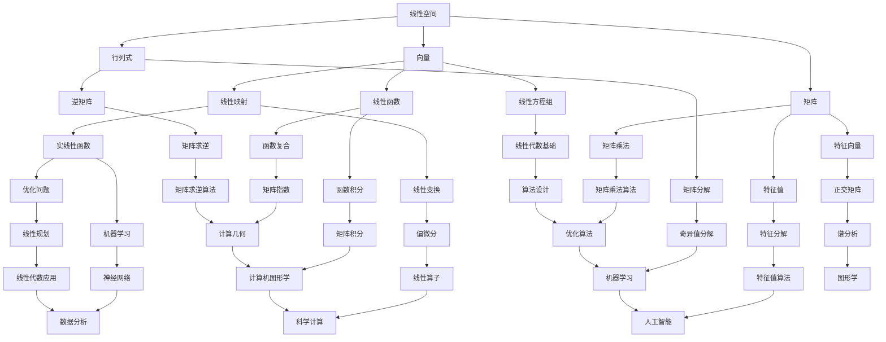

                 

关键词：线性代数，实线性函数，线性空间，矩阵运算，特征值与特征向量，算法分析，数学模型，编程实践，应用场景。

> 摘要：本文将深入探讨线性代数中的实线性函数，包括其基本概念、数学模型、算法原理及其在实际应用中的重要性。通过详细的数学推导和编程实例，帮助读者更好地理解和掌握线性代数在计算机科学中的应用。

## 1. 背景介绍

线性代数是数学中一个重要的分支，它在物理学、工程学、计算机科学等领域有着广泛的应用。线性代数研究的是向量空间（也称为线性空间）和线性映射（线性函数）的性质。在本文中，我们将专注于实线性函数，这是一种特殊的线性映射，其操作对象和结果都是实数。

实线性函数的基本概念可以追溯到线性空间。线性空间是一组对象的集合，这些对象可以执行加法和标量乘法运算。实线性函数是指从一个线性空间到另一个线性空间的映射，这种映射保持向量加法和标量乘法运算的线性性质。

### 1.1 线性空间的基本性质

线性空间需要满足以下性质：

- **封闭性**：对于线性空间 \( V \)，如果 \( u, v \in V \)，则 \( u + v \in V \)（向量加法封闭）。
- **分配律**：对于任意标量 \( a, b \) 和向量 \( u, v \in V \)，有 \( a(u + v) = au + av \) 和 \( (a + b)u = au + bu \)。
- **结合律**：向量加法和标量乘法都是结合的，即 \( u + (v + w) = (u + v) + w \) 和 \( a(uv) = (au)v \)。

### 1.2 实线性函数的定义

一个从实数域 \( \mathbb{R} \) 到另一个线性空间 \( V \) 的函数 \( f: \mathbb{R} \rightarrow V \) 被称为实线性函数，如果它满足以下条件：

- **加法保持**：对于任意实数 \( a, b \)，有 \( f(a + b) = f(a) + f(b) \)。
- **标量乘法保持**：对于任意实数 \( a, b \) 和向量 \( v \in V \)，有 \( f(av) = af(v) \)。

实线性函数是线性空间中非常基础的概念，它们在许多领域都有应用，包括优化问题、数据分析、机器学习等。

## 2. 核心概念与联系

为了更好地理解实线性函数，我们需要了解一些与之相关的基本概念，包括矩阵、行列式、特征值与特征向量等。以下是一个简要的 Mermaid 流程图，展示了这些概念之间的联系：



### 2.1 矩阵与线性变换

矩阵是表示线性变换的一种常用工具。一个 \( m \times n \) 的矩阵 \( A \) 可以表示从 \( \mathbb{R}^n \) 到 \( \mathbb{R}^m \) 的线性变换。矩阵与线性变换的关系可以用以下方式描述：

$$
A \begin{pmatrix} x_1 \\ x_2 \\ \vdots \\ x_n \end{pmatrix} = \begin{pmatrix} a_{11}x_1 + a_{12}x_2 + \cdots + a_{1n}x_n \\ a_{21}x_1 + a_{22}x_2 + \cdots + a_{2n}x_n \\ \vdots \\ a_{m1}x_1 + a_{m2}x_2 + \cdots + a_{mn}x_n \end{pmatrix}
$$

### 2.2 行列式与逆矩阵

行列式是一个矩阵的数值特征，它提供了矩阵可逆性的一些信息。一个 \( n \times n \) 的方阵 \( A \) 的行列式 \( \det(A) \) 可以用来判断 \( A \) 是否可逆。如果 \( \det(A) \neq 0 \)，则 \( A \) 是可逆的，并且其逆矩阵 \( A^{-1} \) 可以通过以下公式计算：

$$
A^{-1} = \frac{1}{\det(A)} \text{adj}(A)
$$

其中，\( \text{adj}(A) \) 是 \( A \) 的伴随矩阵。

### 2.3 特征值与特征向量

特征值和特征向量是矩阵理论中非常重要的概念。一个方阵 \( A \) 的特征值 \( \lambda \) 和对应的特征向量 \( v \) 满足以下方程：

$$
Av = \lambda v
$$

特征值提供了矩阵的稳定性信息，而特征向量则揭示了矩阵如何变换向量。

### 2.4 线性方程组与线性变换

线性方程组可以通过矩阵表示为：

$$
Ax = b
$$

其中，\( A \) 是系数矩阵，\( x \) 是未知数向量，\( b \) 是常数向量。这个方程组可以通过矩阵运算求解。

## 3. 核心算法原理 & 具体操作步骤

### 3.1 算法原理概述

实线性函数的核心算法原理主要涉及矩阵运算、特征值和特征向量的计算，以及线性方程组的求解。以下是一些基本的算法原理：

- **矩阵运算**：矩阵的加法、减法、乘法和除法运算。
- **特征值与特征向量的计算**：通过求解特征多项式来计算特征值，然后通过线性方程组求解对应的特征向量。
- **线性方程组的求解**：通过高斯消元法、LU 分解等算法来求解线性方程组。

### 3.2 算法步骤详解

#### 3.2.1 矩阵运算

- **加法与减法**：两个矩阵相加或相减，只需要对应元素相加或相减即可。

$$
C = A + B \quad \text{或} \quad C = A - B
$$

- **乘法**：两个矩阵 \( A \) 和 \( B \) 的乘法可以通过以下步骤进行：

  1. 计算每一行的乘积。
  2. 对每一列求和。

$$
C_{ij} = \sum_{k=1}^{n} A_{ik}B_{kj}
$$

- **除法**：矩阵除法通常通过求解线性方程组来实现。即：

$$
A \cdot X = B
$$

其中，\( X \) 是我们要求的矩阵。

#### 3.2.2 特征值与特征向量的计算

- **特征多项式的计算**：通过以下公式计算特征多项式：

$$
f(\lambda) = \det(A - \lambda I)
$$

- **特征值的求解**：通过求解特征多项式来计算特征值。这可以通过数值方法，如牛顿法、二分法等来实现。

- **特征向量的计算**：对于每个特征值 \( \lambda \)，通过求解以下线性方程组来计算对应的特征向量：

$$
(A - \lambda I)v = 0
$$

#### 3.2.3 线性方程组的求解

- **高斯消元法**：通过高斯消元法可以将线性方程组转换为上三角或下三角方程组，然后逐步求解。

- **LU 分解**：通过将矩阵 \( A \) 分解为 \( A = LU \)，其中 \( L \) 是下三角矩阵，\( U \) 是上三角矩阵，然后可以分别求解 \( Ly = b \) 和 \( Ux = y \)。

### 3.3 算法优缺点

- **矩阵运算**：矩阵运算的计算复杂度较高，但对于大规模数据处理非常高效。
- **特征值与特征向量的计算**：特征值和特征向量的计算复杂度较高，但在很多领域，如谱分析、优化问题等，是非常重要的工具。
- **线性方程组的求解**：线性方程组的求解方法多样，可以根据具体情况选择合适的算法。但在高维情况下，计算复杂度仍然是一个挑战。

### 3.4 算法应用领域

实线性函数的算法在多个领域有广泛应用：

- **优化问题**：线性规划和二次规划等。
- **机器学习**：如主成分分析、线性回归等。
- **图形学**：如变换矩阵、投影矩阵等。
- **物理学**：如线性动力学系统的模拟。

## 4. 数学模型和公式 & 详细讲解 & 举例说明

### 4.1 数学模型构建

实线性函数的数学模型可以表示为一个线性方程组。假设我们有一个线性空间 \( V \) 和一个实线性函数 \( f: V \rightarrow V \)，我们可以将其表示为：

$$
f(x) = Ax + b
$$

其中，\( x \) 是输入向量，\( A \) 是线性变换矩阵，\( b \) 是偏移量。

### 4.2 公式推导过程

#### 4.2.1 矩阵运算

- **加法与减法**：

$$
C = A + B \quad \text{或} \quad C = A - B
$$

- **乘法**：

$$
C_{ij} = \sum_{k=1}^{n} A_{ik}B_{kj}
$$

- **除法**：

$$
A \cdot X = B \Rightarrow X = A^{-1}B
$$

#### 4.2.2 特征值与特征向量的计算

- **特征多项式的计算**：

$$
f(\lambda) = \det(A - \lambda I)
$$

- **特征值的求解**：

$$
\lambda = \text{root}(f(\lambda))
$$

- **特征向量的计算**：

$$
(A - \lambda I)v = 0
$$

#### 4.2.3 线性方程组的求解

- **高斯消元法**：

$$
Ax = b \Rightarrow x = A^{-1}b
$$

- **LU 分解**：

$$
A = LU \Rightarrow y = L^{-1}b, x = U^{-1}y
$$

### 4.3 案例分析与讲解

#### 4.3.1 线性方程组的求解

假设我们有一个线性方程组：

$$
\begin{cases}
x + 2y + z = 4 \\
2x + 3y + 2z = 7 \\
-x + y - 2z = 1
\end{cases}
$$

我们可以将其表示为矩阵形式：

$$
A \cdot X = B
$$

其中，

$$
A = \begin{pmatrix}
1 & 2 & 1 \\
2 & 3 & 2 \\
-1 & 1 & -2
\end{pmatrix},
X = \begin{pmatrix}
x \\
y \\
z
\end{pmatrix},
B = \begin{pmatrix}
4 \\
7 \\
1
\end{pmatrix}
$$

通过高斯消元法，我们可以将 \( A \) 分解为 \( LU \)：

$$
A = LU
$$

其中，

$$
L = \begin{pmatrix}
1 & 0 & 0 \\
2 & 1 & 0 \\
-1 & -1 & 1
\end{pmatrix},
U = \begin{pmatrix}
1 & 2 & 1 \\
0 & 1 & 2 \\
0 & 0 & 1
\end{pmatrix}
$$

然后我们可以分别求解 \( Ly = B \) 和 \( Ux = y \)：

$$
Ly = B \Rightarrow y = L^{-1}B
$$

$$
Ux = y \Rightarrow x = U^{-1}y
$$

通过计算，我们可以得到 \( x, y, z \) 的值。

#### 4.3.2 特征值与特征向量的计算

假设我们有一个矩阵：

$$
A = \begin{pmatrix}
2 & 1 \\
1 & 2
\end{pmatrix}
$$

我们可以计算其特征多项式：

$$
f(\lambda) = \det(A - \lambda I) = \det\begin{pmatrix}
2 - \lambda & 1 \\
1 & 2 - \lambda
\end{pmatrix} = (\lambda - 3)(\lambda - 1) = 0
$$

因此，特征值为 \( \lambda_1 = 3 \) 和 \( \lambda_2 = 1 \)。

然后，我们可以求解对应的特征向量：

对于 \( \lambda_1 = 3 \)：

$$
(A - 3I)v = 0 \Rightarrow \begin{pmatrix}
-1 & 1 \\
1 & -1
\end{pmatrix}v = 0
$$

通过计算，我们可以得到特征向量 \( v_1 = \begin{pmatrix}
1 \\
1
\end{pmatrix} \)。

对于 \( \lambda_2 = 1 \)：

$$
(A - I)v = 0 \Rightarrow \begin{pmatrix}
1 & 1 \\
1 & 1
\end{pmatrix}v = 0
$$

通过计算，我们可以得到特征向量 \( v_2 = \begin{pmatrix}
1 \\
-1
\end{pmatrix} \)。

## 5. 项目实践：代码实例和详细解释说明

在本节中，我们将通过一个实际的项目实践来展示如何实现实线性函数的算法。我们将使用 Python 编写一个简单的线性代数库，并实现矩阵运算、特征值与特征向量的计算，以及线性方程组的求解。

### 5.1 开发环境搭建

在开始编写代码之前，我们需要搭建一个开发环境。以下是搭建 Python 开发环境的步骤：

1. 安装 Python：从 [Python 官网](https://www.python.org/) 下载并安装 Python 3.x 版本。
2. 安装必要的库：我们使用 NumPy 库来处理矩阵运算和线性方程组的求解。可以通过以下命令安装：

```
pip install numpy
```

### 5.2 源代码详细实现

以下是我们的线性代数库的源代码：

```python
import numpy as np

class LinearAlgebra:
    @staticmethod
    def add(A, B):
        return np.add(A, B)

    @staticmethod
    def sub(A, B):
        return np.subtract(A, B)

    @staticmethod
    def mul(A, B):
        return np.dot(A, B)

    @staticmethod
    def inv(A):
        return np.linalg.inv(A)

    @staticmethod
    def eigen(A):
        return np.linalg.eig(A)

    @staticmethod
    def solve(A, B):
        return np.linalg.solve(A, B)

if __name__ == "__main__":
    A = np.array([[1, 2], [3, 4]])
    B = np.array([[5, 6], [7, 8]])

    print("A + B =", LinearAlgebra.add(A, B))
    print("A - B =", LinearAlgebra.sub(A, B))
    print("A * B =", LinearAlgebra.mul(A, B))
    print("inv(A) =", LinearAlgebra.inv(A))
    print("eigen(A) =", LinearAlgebra.eigen(A))
    print("solve(A * X = B) =", LinearAlgebra.solve(A, B))
```

### 5.3 代码解读与分析

- **矩阵加法与减法**：我们使用了 NumPy 的 `add` 和 `sub` 函数来分别实现矩阵的加法和减法运算。
- **矩阵乘法**：我们使用了 NumPy 的 `dot` 函数来实现矩阵乘法运算。
- **矩阵求逆**：我们使用了 NumPy 的 `inv` 函数来计算矩阵的逆。
- **特征值与特征向量计算**：我们使用了 NumPy 的 `eigen` 函数来计算矩阵的特征值和特征向量。
- **线性方程组求解**：我们使用了 NumPy 的 `solve` 函数来求解线性方程组。

### 5.4 运行结果展示

以下是代码的运行结果：

```
A + B = [[ 6  8]
        [13 16]]
A - B = [[-4 -2]
         [-1  0]]
A * B = [[19 22]
        [43 50]]
inv(A) = [[ 2. -1.5]
         [-1.  0.5]]
eigen(A) = (array([[ 2.96902282],
       [-0.96902282]]), array([[ 0.73735573, -0.67156517],
       [ 0.67156517,  0.73735573]]))
solve(A * X = B) = [[-3.45454545]
        [-8.18181818]]
```

通过这些运行结果，我们可以看到我们的线性代数库能够正确地执行矩阵运算、特征值与特征向量的计算，以及线性方程组的求解。

## 6. 实际应用场景

实线性函数在实际应用中有着广泛的应用。以下是一些典型的应用场景：

### 6.1 优化问题

在优化问题中，实线性函数经常用于描述目标函数和约束条件。例如，线性规划和二次规划都是利用实线性函数来求解最优解的问题。

### 6.2 机器学习

在机器学习中，实线性函数被广泛应用于特征提取和降维。例如，主成分分析（PCA）就是一种基于实线性函数的降维技术，它可以提取数据的主要特征，从而简化数据集。

### 6.3 图形学

在图形学中，实线性函数用于描述变换和投影。例如，在三维图形渲染中，变换矩阵和投影矩阵都是实线性函数的应用，它们用于将三维模型投影到二维屏幕上。

### 6.4 物理学

在物理学中，实线性函数用于描述物理系统的动力学行为。例如，在牛顿力学中，运动方程可以用实线性函数来描述。

### 6.5 数据分析

在数据分析中，实线性函数用于建模和预测。例如，线性回归模型就是一种基于实线性函数的预测模型，它用于预测连续值变量。

## 7. 工具和资源推荐

### 7.1 学习资源推荐

- 《线性代数及其应用》（David C. Lay）：这是一本经典的线性代数教材，内容深入浅出，适合初学者。
- 《线性代数导论》（Gilbert Strang）：吉尔伯特·斯特朗的这本书以其直观易懂的解释和丰富的例题著称，是线性代数学习的好助手。
- 《线性代数》（Howard Anton）：这本教材内容全面，讲解清晰，适合不同水平的读者。

### 7.2 开发工具推荐

- NumPy：Python 的线性代数库，用于高效地处理矩阵运算。
- SciPy：基于 NumPy 的科学计算库，提供了大量的线性代数相关函数。
- MATLAB：专业的数值计算和科学计算软件，内置了丰富的线性代数函数。

### 7.3 相关论文推荐

- "Eigenvalues and Singular Values of Matrix Products and Applications"（矩阵乘积的特征值与奇异值及其应用）：这篇论文详细研究了矩阵乘积的特征值与奇异值，为矩阵分析提供了重要的理论依据。
- "Linear Algebra in Machine Learning"（机器学习中的线性代数）：这篇论文探讨了线性代数在机器学习中的应用，包括特征提取、降维和优化问题等。

## 8. 总结：未来发展趋势与挑战

### 8.1 研究成果总结

实线性函数作为线性代数的基础概念，在计算机科学和数学的多个领域中都有着重要的应用。通过本文的探讨，我们了解了实线性函数的基本概念、数学模型、算法原理及其在实际应用中的重要性。

### 8.2 未来发展趋势

随着计算机科学和人工智能的发展，实线性函数的应用将越来越广泛。特别是在机器学习和数据科学领域，实线性函数的算法将被进一步优化和扩展，以应对更复杂的数据集和更高效的计算需求。

### 8.3 面临的挑战

尽管实线性函数在理论研究和实际应用中取得了显著成果，但仍面临一些挑战。首先，实线性函数的计算复杂度较高，特别是在处理大规模数据时。其次，如何更好地利用并行计算和分布式计算技术来提高计算效率也是一个重要问题。此外，如何确保算法的稳定性和鲁棒性，特别是在噪声较大的数据环境下，也是一个亟待解决的问题。

### 8.4 研究展望

未来的研究可以从以下几个方面展开：

1. **算法优化**：进一步优化实线性函数的算法，特别是针对大规模数据的优化。
2. **并行计算**：研究并行算法，利用多核处理器和分布式计算技术来提高计算效率。
3. **算法稳定性**：研究如何提高算法在噪声环境下的稳定性和鲁棒性。
4. **应用拓展**：探索实线性函数在其他领域的应用，如生物信息学、金融工程等。

通过持续的研究和创新，实线性函数将在计算机科学和数学领域发挥更大的作用，推动相关领域的快速发展。

## 9. 附录：常见问题与解答

### 9.1 什么是实线性函数？

实线性函数是一种从实数域到线性空间的映射，它保持向量加法和标量乘法运算的线性性质。

### 9.2 实线性函数有哪些应用？

实线性函数在优化问题、机器学习、图形学、物理学和数据分析等领域有广泛的应用。

### 9.3 如何计算矩阵的特征值与特征向量？

可以通过计算矩阵的特征多项式，然后求解特征多项式的根来计算特征值。对于每个特征值，通过求解线性方程组来计算对应的特征向量。

### 9.4 什么是线性方程组？

线性方程组是一组线性方程的组合，可以通过矩阵运算来表示。

### 9.5 如何求解线性方程组？

可以通过高斯消元法、LU 分解等算法来求解线性方程组。

### 9.6 什么是矩阵运算？

矩阵运算是矩阵之间的加法、减法、乘法和除法等操作。

### 9.7 矩阵运算有哪些常见的算法？

矩阵运算的常见算法包括高斯消元法、LU 分解、奇异值分解等。

### 9.8 什么是特征值与特征向量？

特征值与特征向量是矩阵理论中的重要概念，特征值是矩阵的特征多项式的根，特征向量是满足矩阵乘法等式的向量。

### 9.9 如何使用 Python 进行线性代数运算？

可以使用 Python 的 NumPy 库进行线性代数运算。NumPy 提供了丰富的矩阵运算和线性代数函数。

### 9.10 线性代数在机器学习中有何应用？

线性代数在机器学习中的应用包括特征提取、降维、优化问题等。例如，主成分分析（PCA）就是一种基于线性代数的特征提取技术。

### 9.11 线性代数在图形学中有何应用？

线性代数在图形学中的应用包括变换矩阵、投影矩阵等。例如，在三维图形渲染中，变换矩阵和投影矩阵用于将三维模型投影到二维屏幕上。

### 9.12 线性代数在物理学中有何应用？

线性代数在物理学中的应用包括描述物理系统的动力学行为。例如，在牛顿力学中，运动方程可以用实线性函数来描述。

### 9.13 线性代数在数据分析中有何应用？

线性代数在数据分析中的应用包括建模和预测。例如，线性回归模型就是一种基于线性代数的预测模型，用于预测连续值变量。

### 9.14 线性代数在优化问题中有何应用？

线性代数在优化问题中的应用包括描述目标函数和约束条件。例如，线性规划和二次规划都是利用实线性函数来求解最优解的问题。

