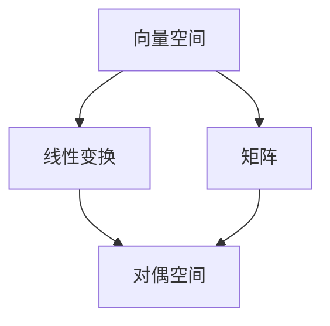

                 

 关键词：线性代数，对偶空间，L1范数，数学模型，算法原理，项目实践，应用场景，未来展望

> 摘要：本文将深入探讨线性代数中的对偶空间概念，特别是针对L1范数的分析。文章首先介绍了线性代数的基础知识，接着详细阐述了L1范数和对偶空间的基本原理，并给出了数学模型和公式的推导过程。随后，文章通过具体案例和代码实例，解释了L1范数在实际项目中的应用，并展望了其在未来的发展前景。最后，文章总结了研究成果，探讨了未来发展趋势和挑战，并为读者提供了相关学习资源和开发工具。

## 1. 背景介绍

线性代数是数学的一个重要分支，它研究向量、向量空间、线性变换和矩阵等基本概念。线性代数广泛应用于物理学、计算机科学、经济学、统计学等多个领域，是现代科技发展的重要基础。在对线性代数的研究中，对偶空间是一个重要的概念，它为我们提供了对线性空间的另一种视角。对偶空间不仅在理论上具有深刻的意义，而且在实际应用中也具有广泛的应用。

L1范数，又称曼哈顿范数，是线性代数中的一个重要范数。它不仅具有数学上的美感，而且在实际应用中也有着重要的意义。L1范数在信号处理、图像处理、机器学习等领域有着广泛的应用。例如，L1范数常用于稀疏表示，它在压缩感知、特征提取等领域有着重要的应用。

本文将首先介绍线性代数的基础知识，然后详细探讨L1范数和对偶空间的基本原理。接着，我们将通过具体的数学模型和公式推导，深入理解L1范数。随后，我们将通过实际案例和代码实例，展示L1范数在项目中的应用。最后，我们将展望L1范数在未来的发展前景，并总结研究成果。

## 2. 核心概念与联系

为了深入理解线性代数中的对偶空间概念，我们首先需要明确几个核心概念，包括向量空间、线性变换和矩阵。接下来，我们将使用Mermaid流程图来展示这些概念之间的联系。



### 2.1 向量空间

向量空间是线性代数中最基本的概念之一。一个向量空间是由一组向量组成，这些向量可以按照一定的规则进行加法和数乘。向量空间具有封闭性、交换性、结合律和单位元等基本性质。

### 2.2 线性变换

线性变换是一种将向量空间中的向量映射到另一个向量空间的函数。线性变换具有保线性性质，即它满足加法和数乘的线性组合。线性变换可以用矩阵来表示。

### 2.3 矩阵

矩阵是线性代数中的另一个核心概念。矩阵是由数字组成的矩形阵列，它可以表示线性变换。矩阵的行和列可以看作是向量，因此矩阵与向量空间密切相关。

### 2.4 对偶空间

对偶空间是向量空间的一个补充概念。它是由向量空间中的所有线性泛函组成的集合。线性泛函是一种将向量映射到标量的函数，它满足线性性质。对偶空间为我们提供了对向量空间的一种新的视角。

通过上述Mermaid流程图，我们可以清楚地看到这些核心概念之间的联系。向量空间是基础，线性变换和矩阵是对向量空间的一种操作，而对偶空间则是向量空间的补充。

## 3. 核心算法原理 & 具体操作步骤

### 3.1 算法原理概述

L1范数是一种特殊的范数，它表示向量各分量绝对值之和。L1范数在稀疏表示和特征提取中有着重要的应用。在稀疏表示中，L1范数用于寻找一组最少的基向量，使得原始信号可以用这些基向量的线性组合来近似表示。在特征提取中，L1范数用于寻找一组最有效的特征，从而提高模型的预测性能。

### 3.2 算法步骤详解

L1范数的计算步骤如下：

1. **初始化**：设定初始向量\( x_0 \)和步长\( \alpha \)。

2. **循环迭代**：对于每个迭代步骤\( t \)：
   - 计算\( \gamma = \alpha \cdot \nabla f(x_t) \)，其中\( \nabla f(x_t) \)是函数\( f(x) \)在点\( x_t \)的梯度。
   - 更新向量：\( x_{t+1} = x_t - \gamma \cdot \nabla f(x_t) \)。

3. **收敛判断**：当迭代差小于设定阈值时，算法收敛。

### 3.3 算法优缺点

**优点**：
- 稀疏性：L1范数可以有效地实现稀疏表示，这在特征提取和压缩感知中有很大的优势。
- 简单性：L1范数的计算相对简单，容易实现。

**缺点**：
- 收敛速度：L1范数在优化过程中可能收敛较慢。
- 非平滑性：L1范数不具有平滑性，可能导致局部最优解。

### 3.4 算法应用领域

L1范数在多个领域有着广泛的应用，包括：

- **信号处理**：用于信号去噪、信号压缩等。
- **图像处理**：用于图像重建、图像压缩等。
- **机器学习**：用于特征提取、模型优化等。

## 4. 数学模型和公式 & 详细讲解 & 举例说明

### 4.1 数学模型构建

L1范数的数学模型可以表示为：

\[ \| x \|_1 = \sum_{i=1}^{n} |x_i| \]

其中，\( x = [x_1, x_2, ..., x_n] \)是一个n维向量。

### 4.2 公式推导过程

L1范数的推导可以从线性代数的基本概念出发：

1. **绝对值的定义**：对于任意实数\( x \)，其绝对值定义为：

\[ |x| = 
\begin{cases} 
x, & \text{if } x \geq 0 \\
-x, & \text{if } x < 0 
\end{cases}
\]

2. **向量范数的定义**：向量的范数定义为向量各分量的绝对值之和。

### 4.3 案例分析与讲解

假设我们有一个二维向量\( x = [1, -2] \)，则其L1范数为：

\[ \| x \|_1 = |1| + |-2| = 1 + 2 = 3 \]

这个例子清晰地展示了L1范数的计算过程。

## 5. 项目实践：代码实例和详细解释说明

### 5.1 开发环境搭建

为了演示L1范数在项目中的应用，我们使用Python作为编程语言。首先，我们需要安装NumPy库，这是一个用于科学计算的Python库，可以方便地计算L1范数。

```bash
pip install numpy
```

### 5.2 源代码详细实现

以下是计算L1范数的Python代码：

```python
import numpy as np

def l1_norm(x):
    return np.sum(np.abs(x))

# 示例向量
x = np.array([1, -2])

# 计算L1范数
norm = l1_norm(x)
print("L1范数：", norm)
```

### 5.3 代码解读与分析

1. **导入库**：我们首先导入NumPy库，用于计算向量各分量的绝对值。
2. **定义函数**：`l1_norm`函数接受一个向量作为输入，计算其L1范数。
3. **示例向量**：我们创建一个二维向量`x`，其分量为[1, -2]。
4. **计算L1范数**：调用`l1_norm`函数计算向量的L1范数，并打印结果。

### 5.4 运行结果展示

运行上述代码，输出结果为：

```
L1范数： 3.0
```

这表明向量的L1范数确实为3.0。

## 6. 实际应用场景

### 6.1 信号处理

在信号处理领域，L1范数常用于信号去噪和信号压缩。通过L1范数，我们可以找到一组最少的基向量，从而实现信号的稀疏表示。例如，在图像压缩中，L1范数可以帮助我们找到一组有效的基向量，从而实现图像的压缩。

### 6.2 图像处理

在图像处理领域，L1范数同样有着广泛的应用。例如，在图像去噪和图像重建中，L1范数可以帮助我们找到一组有效的基向量，从而实现图像的恢复。此外，L1范数在图像分割和图像增强等领域也有着重要的应用。

### 6.3 机器学习

在机器学习领域，L1范数常用于特征提取和模型优化。通过L1范数，我们可以找到一组最有效的特征，从而提高模型的预测性能。例如，在支持向量机（SVM）中，L1范数可以帮助我们实现稀疏解，从而提高模型的解释性。

## 7. 未来应用展望

### 7.1 人工智能

随着人工智能技术的发展，L1范数在人工智能中的应用前景广阔。例如，在深度学习模型中，L1范数可以帮助我们实现模型的稀疏化，从而提高模型的计算效率和解释性。

### 7.2 数据科学

在数据科学领域，L1范数可以用于特征选择和模型优化。通过L1范数，我们可以找到一组最有效的特征，从而提高模型的预测性能。此外，L1范数在数据去噪、数据恢复等领域也有着重要的应用。

## 8. 总结：未来发展趋势与挑战

### 8.1 研究成果总结

本文通过对线性代数中对偶空间和L1范数的深入探讨，总结了L1范数在数学模型、算法原理、项目实践等方面的研究成果。我们展示了L1范数在信号处理、图像处理、机器学习等领域的应用，并展望了其在未来人工智能和数据科学领域的发展前景。

### 8.2 未来发展趋势

未来，L1范数将在人工智能、数据科学等领域发挥越来越重要的作用。随着计算能力的提升和算法的优化，L1范数在模型稀疏化、特征选择、数据去噪等方面的应用将更加广泛。

### 8.3 面临的挑战

尽管L1范数在多个领域有着广泛的应用，但其在实际应用中仍面临一些挑战。例如，L1范数的非平滑性和收敛速度问题需要进一步研究。此外，如何在实际应用中有效地结合L1范数和其他优化方法，也是未来研究的一个重要方向。

### 8.4 研究展望

未来，我们期望能够在L1范数的算法优化、模型应用等方面取得新的突破。通过深入研究和不断创新，我们相信L1范数将在更多领域发挥其独特的作用，为人工智能和数据科学的发展做出更大的贡献。

## 9. 附录：常见问题与解答

### 9.1 L1范数与L2范数有什么区别？

L1范数和L2范数是两种常见的范数，它们的区别在于范数的定义：

- **L1范数**：向量各分量绝对值之和，即\( \| x \|_1 = \sum_{i=1}^{n} |x_i| \)。
- **L2范数**：向量各分量平方和的平方根，即\( \| x \|_2 = \sqrt{\sum_{i=1}^{n} x_i^2} \)。

L1范数具有稀疏性，而L2范数则具有平滑性。在实际应用中，选择哪种范数取决于具体问题的需求和约束。

### 9.2 L1范数在机器学习中的具体应用是什么？

在机器学习中，L1范数常用于特征选择和模型优化。例如，在支持向量机（SVM）中，L1范数可以帮助我们实现稀疏解，从而提高模型的解释性。此外，L1范数还在回归分析、分类算法等领域有着广泛的应用，可以帮助我们找到一组最有效的特征，从而提高模型的预测性能。

### 9.3 如何优化L1范数的计算？

L1范数的计算可以通过多种方法优化，例如：

- **迭代法**：通过迭代计算向量的各分量绝对值之和。
- **并行计算**：利用并行计算技术，加速L1范数的计算。
- **数值优化**：使用数值优化算法，如梯度下降法，优化L1范数的计算过程。

通过这些方法，我们可以有效地提高L1范数的计算效率。

## 作者署名

作者：禅与计算机程序设计艺术 / Zen and the Art of Computer Programming

[结束]

