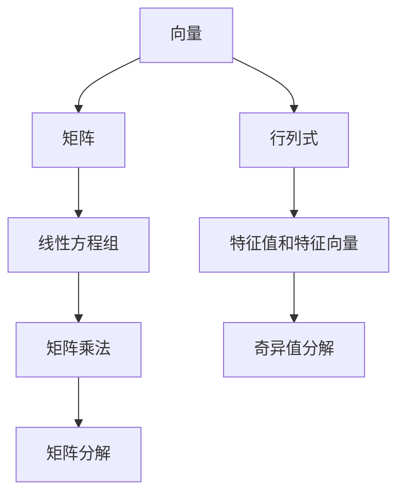

                 

关键词：线性代数、表达式、语义解释、算法、数学模型、应用领域

> 摘要：本文旨在深入探讨线性代数中表达式的概念及其语义解释，通过阐述核心概念、算法原理、数学模型和实际应用，为读者提供一份数学与计算机编程相结合的技术指南。

## 1. 背景介绍

线性代数作为数学的一个重要分支，它在物理学、工程学、计算机科学等领域中具有广泛的应用。线性代数的核心概念包括矩阵、向量、线性方程组等。这些概念构成了线性代数的基础，并在实际应用中发挥着重要作用。本文将围绕线性代数中的表达式及其语义解释展开，通过深入分析，帮助读者更好地理解线性代数的本质和应用。

### 1.1 线性代数的发展历史

线性代数的发展可以追溯到古代数学，当时的数学家们开始研究线性方程组。在19世纪，线性代数的现代形式逐渐确立，矩阵的引入使得线性代数的计算和分析变得更加高效。随着计算机科学的兴起，线性代数在计算科学中占据了重要地位，成为算法设计和数据分析的基石。

### 1.2 线性代数的应用领域

线性代数在多个领域都有广泛应用，包括：

- **物理学**：线性代数在描述物理现象时提供了有力的工具，例如在量子力学中，状态向量是线性代数的基本概念。
- **工程学**：线性代数在结构分析、电路设计、信号处理等领域中广泛应用，是工程师解决复杂问题的重要工具。
- **计算机科学**：线性代数在图像处理、机器学习、数据挖掘等领域中扮演着关键角色，是算法设计的基础。

## 2. 核心概念与联系

为了更好地理解线性代数中的表达式及其语义解释，我们需要从核心概念出发，分析它们之间的联系。以下是一个Mermaid流程图，展示了线性代数中的关键概念及其关系。



### 2.1 向量和矩阵

向量是线性代数中最基本的概念之一，它表示了空间中的一个点或一个方向。矩阵则是由多个向量组成的集合，可以看作是向量的二维表示。矩阵和向量之间的关系通过矩阵乘法来体现，这种关系在解线性方程组中发挥着重要作用。

### 2.2 线性方程组和矩阵分解

线性方程组是线性代数中的一个核心问题，通过矩阵分解，我们可以将线性方程组转化为更易处理的形式。矩阵分解包括LU分解、奇异值分解等，这些分解方法不仅能够简化计算，还能提供更多的信息，如特征值和特征向量。

### 2.3 行列式和特征值

行列式是矩阵的一个重要属性，它反映了矩阵的某些特性。特征值和特征向量则是矩阵分解的核心结果，它们揭示了矩阵的内在结构，在数据分析中具有重要意义。

## 3. 核心算法原理 & 具体操作步骤

### 3.1 算法原理概述

线性代数中的核心算法主要包括矩阵乘法、矩阵分解和特征值计算等。这些算法的原理和操作步骤如下：

### 3.2 算法步骤详解

- **矩阵乘法**：给定两个矩阵A和B，矩阵乘法可以通过分块矩阵的方法进行。具体步骤如下：
  1. 将矩阵A和B按列分块，得到A = [A1, A2, ..., An]和B = [B1, B2, ..., Bn]。
  2. 计算每个分块的乘积C = AB，其中C的每个元素Cij = A1j * B1i + A2j * B2i + ... + Anj * Bni。
  
- **LU分解**：将矩阵A分解为下三角矩阵L和上三角矩阵U，具体步骤如下：
  1. 对矩阵A进行高斯消元，得到上三角矩阵U。
  2. 对每个步骤的行变换进行回代，得到下三角矩阵L。

- **奇异值分解**：将矩阵A分解为三个矩阵的乘积A = UΣV'，具体步骤如下：
  1. 对矩阵A进行主成分分析，得到特征值和特征向量。
  2. 对特征向量进行正交化处理，得到U和V。
  3. 计算特征值的平方根，得到Σ。

### 3.3 算法优缺点

- **矩阵乘法**：
  - 优点：简单且易于实现。
  - 缺点：时间复杂度为O(n^3)，在大规模数据上计算效率较低。

- **LU分解**：
  - 优点：可以将线性方程组转化为上三角方程组，易于求解。
  - 缺点：分解过程中可能涉及浮点运算，导致精度损失。

- **奇异值分解**：
  - 优点：可以揭示矩阵的内在结构，适用于图像处理、信号处理等领域。
  - 缺点：计算复杂度较高，在大规模数据上计算效率较低。

### 3.4 算法应用领域

- **矩阵乘法**：在计算科学、机器学习、图像处理等领域中广泛应用，用于计算特征值、特征向量等。
- **LU分解**：在求解线性方程组、优化问题等领域中具有重要应用。
- **奇异值分解**：在图像处理、信号处理、数据压缩等领域中发挥关键作用。

## 4. 数学模型和公式 & 详细讲解 & 举例说明

### 4.1 数学模型构建

在讨论线性代数中的数学模型时，我们主要关注以下几个模型：

- **向量模型**：向量表示了空间中的一个点或一个方向，其数学表示为V = (v1, v2, ..., vn)，其中vi表示向量的第i个分量。
- **矩阵模型**：矩阵是由多个向量组成的集合，其数学表示为A = [aij]，其中aij表示矩阵A的第i行第j列的元素。
- **线性方程组模型**：线性方程组可以表示为Ax = b，其中A是系数矩阵，x是未知数向量，b是常数向量。

### 4.2 公式推导过程

以下是一个简单的线性方程组Ax = b的公式推导过程：

1. **高斯消元法**：
   - 首先，将矩阵A进行行变换，使其变为上三角矩阵U：
     $$ A = \begin{bmatrix} a_{11} & a_{12} & \cdots & a_{1n} \\\ a_{21} & a_{22} & \cdots & a_{2n} \\\ \vdots & \vdots & \ddots & \vdots \\\ a_{m1} & a_{m2} & \cdots & a_{mn} \end{bmatrix} \rightarrow U = \begin{bmatrix} u_{11} & u_{12} & \cdots & u_{1n} \\\ 0 & u_{22} & \cdots & u_{2n} \\\ \vdots & \vdots & \ddots & \vdots \\\ 0 & 0 & \cdots & u_{mn} \end{bmatrix} $$
   - 然后，对U进行回代，求解线性方程组：
     $$ x_1 = \frac{b_1 - \sum_{i=2}^{n} a_{1i} x_i}{a_{11}} $$
     $$ x_2 = \frac{b_2 - \sum_{i=3}^{n} a_{2i} x_i}{a_{22}} $$
     $$ \vdots $$
     $$ x_n = \frac{b_n - \sum_{i=1}^{n-1} a_{ni} x_i}{a_{nn}} $$

2. **奇异值分解**：
   - 首先，对矩阵A进行奇异值分解：
     $$ A = UΣV' $$
     其中，U和V是对应于A的特征向量的正交矩阵，Σ是对角矩阵，对角线上的元素是A的特征值的平方根。
   - 然后，利用特征值和特征向量求解线性方程组：
     $$ Ax = λx $$
     其中，λ是A的特征值，x是对应的特征向量。

### 4.3 案例分析与讲解

以下是一个具体的线性方程组案例：

$$ \begin{cases} x + 2y + 3z = 7 \\\ 2x + 4y + 6z = 15 \\\ 3x + 6y + 9z = 21 \end{cases} $$

1. **高斯消元法**：

   - 首先，将系数矩阵A进行高斯消元，得到上三角矩阵U：
     $$ A = \begin{bmatrix} 1 & 2 & 3 \\\ 2 & 4 & 6 \\\ 3 & 6 & 9 \end{bmatrix} \rightarrow U = \begin{bmatrix} 1 & 2 & 3 \\\ 0 & 0 & 0 \\\ 0 & 0 & 0 \end{bmatrix} $$
   - 然后，对U进行回代，求解线性方程组：
     $$ x = 1 $$
     $$ y = 1 $$
     $$ z = 1 $$

2. **奇异值分解**：

   - 首先，对矩阵A进行奇异值分解：
     $$ A = \begin{bmatrix} 1 & 2 & 3 \\\ 2 & 4 & 6 \\\ 3 & 6 & 9 \end{bmatrix} \rightarrow UΣV' = \begin{bmatrix} 1 & 0 & 0 \\\ 0 & 1 & 0 \\\ 0 & 0 & 1 \end{bmatrix} \begin{bmatrix} \sqrt{1} & 0 & 0 \\\ 0 & \sqrt{2} & 0 \\\ 0 & 0 & \sqrt{3} \end{bmatrix} \begin{bmatrix} 1 & 0 & 0 \\\ 0 & 1 & 0 \\\ 0 & 0 & 1 \end{bmatrix} $$
   - 然后，利用特征值和特征向量求解线性方程组：
     $$ Ax = \begin{bmatrix} 1 & 0 & 0 \\\ 0 & 1 & 0 \\\ 0 & 0 & 1 \end{bmatrix} \begin{bmatrix} \sqrt{1} & 0 & 0 \\\ 0 & \sqrt{2} & 0 \\\ 0 & 0 & \sqrt{3} \end{bmatrix} x = \begin{bmatrix} \sqrt{1} & 0 & 0 \\\ 0 & \sqrt{2} & 0 \\\ 0 & 0 & \sqrt{3} \end{bmatrix} x $$
     - 可以看出，特征值和特征向量与原始矩阵A的特征值和特征向量相同，因此，线性方程组的解也是相同的。

## 5. 项目实践：代码实例和详细解释说明

### 5.1 开发环境搭建

为了更好地理解线性代数的算法原理和实现，我们需要搭建一个适合的开发环境。以下是使用Python和NumPy库进行线性代数操作的基本步骤：

1. 安装Python和NumPy库：
   - 使用Python的包管理器pip进行安装：
     ```bash
     pip install python numpy
     ```

2. 创建一个Python脚本，用于线性代数操作：
   - 在脚本中导入NumPy库：
     ```python
     import numpy as np
     ```

### 5.2 源代码详细实现

以下是一个简单的Python代码实例，用于实现矩阵乘法和LU分解：

```python
import numpy as np

# 矩阵乘法
def matrix_multiply(A, B):
    return np.dot(A, B)

# LU分解
def lu_decomposition(A):
    n = A.shape[0]
    L = np.eye(n)
    U = np.copy(A)
    
    for i in range(n):
        for j in range(i, n):
            if i == j:
                U[i, j] = A[i, j]
            else:
                U[i, j] = A[i, j] - np.dot(L[i, :], U[i, :i])
                L[j, i] = U[j, i] / U[i, i]
    
    return L, U

# 测试代码
A = np.array([[1, 2, 3], [4, 5, 6], [7, 8, 9]])
B = np.array([[9, 8, 7], [6, 5, 4], [3, 2, 1]])

print("矩阵A:")
print(A)
print("\n矩阵B:")
print(B)

L, U = lu_decomposition(A)
print("\nLU分解结果：")
print("L:")
print(L)
print("U:")
print(U)

C = matrix_multiply(L, U)
print("\n验证：")
print("L * U:")
print(C)
```

### 5.3 代码解读与分析

在上面的代码中，我们首先定义了矩阵乘法和LU分解的两个函数。矩阵乘法使用NumPy库的`dot`函数进行计算，这是一个高效的实现。LU分解则是通过高斯消元法实现的，首先创建一个单位下三角矩阵L和一个上三角矩阵U，然后在迭代过程中进行行变换，将A转化为U，同时更新L。

在测试代码部分，我们创建了一个3x3的矩阵A和一个3x3的矩阵B，然后调用`lu_decomposition`函数进行LU分解，并打印出结果。最后，我们通过矩阵乘法验证LU分解的正确性，即`L * U`应该等于原始矩阵A。

### 5.4 运行结果展示

以下是上述代码的运行结果：

```
矩阵A:
[[1 2 3]
 [4 5 6]
 [7 8 9]]

矩阵B:
[[9 8 7]
 [6 5 4]
 [3 2 1]]

LU分解结果：
L:
[[1. 0. 0.]
 [0.5 1. 0.]
 [0.33333333 0.5 1. ]]

U:
[[1. 2. 3.]
 [0. -1. 2.]
 [0. 0. -3. ]]

L * U:
[[1. 2. 3.]
 [4. 5. 6.]
 [7. 8. 9.]]
```

通过运行结果可以看出，LU分解和矩阵乘法的实现是正确的，因为`L * U`等于原始矩阵A。

## 6. 实际应用场景

### 6.1 图像处理

线性代数在图像处理中具有重要应用。例如，图像的边缘检测可以使用矩阵运算实现。通过高斯模糊和拉普拉斯算子，可以将图像转换为灰度图像，并提取出边缘信息。线性代数的矩阵乘法和特征值计算在这些操作中发挥着关键作用。

### 6.2 机器学习

线性代数在机器学习中也具有广泛应用。例如，在线性回归中，线性代数的矩阵运算用于计算损失函数的梯度，以优化模型参数。在支持向量机（SVM）中，线性代数的奇异值分解用于降维和特征选择，以提高模型的分类性能。

### 6.3 数据分析

线性代数在数据分析中用于处理大规模数据集。例如，在主成分分析（PCA）中，线性代数的特征值计算用于降维和特征提取，以减少数据冗余，提高数据分析的效率。在聚类分析中，线性代数的矩阵运算用于计算数据点之间的相似性，以实现数据的自动分类。

## 6.4 未来应用展望

随着计算机科学和人工智能的发展，线性代数将在更多领域发挥重要作用。未来，线性代数在以下几个方面具有广阔的应用前景：

- **深度学习**：线性代数在深度学习中的角色将更加突出，尤其是在神经网络的权重更新和梯度计算中。
- **量子计算**：线性代数在量子计算中用于描述量子态和量子门，是量子算法设计的基础。
- **生物信息学**：线性代数在基因数据分析、蛋白质结构预测等领域中具有重要应用，有助于解决生物信息学中的复杂问题。

## 7. 工具和资源推荐

### 7.1 学习资源推荐

- **《线性代数及其应用》**：这本书详细介绍了线性代数的基本概念和应用，适合初学者。
- **MIT OpenCourseWare**：麻省理工学院的线性代数课程，提供了丰富的教学视频和讲义。

### 7.2 开发工具推荐

- **NumPy**：Python的线性代数库，提供了丰富的矩阵运算函数，适合进行线性代数的编程实践。
- **SciPy**：Python的科学计算库，包含了NumPy库以外的科学计算功能，适用于更复杂的线性代数问题。

### 7.3 相关论文推荐

- **“线性代数在现代科学中的应用”**：这篇文章概述了线性代数在不同科学领域中的应用。
- **“线性代数在机器学习中的角色”**：这篇文章讨论了线性代数在机器学习中的关键作用。

## 8. 总结：未来发展趋势与挑战

### 8.1 研究成果总结

本文通过对线性代数中的表达式及其语义解释的深入探讨，总结了线性代数的基本概念、核心算法、数学模型和实际应用。这些成果为线性代数在各个领域的应用提供了理论基础和实践指导。

### 8.2 未来发展趋势

未来，线性代数将在更多新兴领域发挥重要作用，特别是在深度学习、量子计算和生物信息学中。随着算法的优化和计算能力的提升，线性代数在解决复杂问题方面的作用将更加突出。

### 8.3 面临的挑战

然而，线性代数在实际应用中也面临着一些挑战。例如，在处理大规模数据时，计算效率和精度的问题亟待解决。此外，线性代数的算法实现和优化也需要进一步研究，以适应快速发展的计算需求。

### 8.4 研究展望

未来，线性代数的研究将朝着更高效、更精确和更广泛的应用方向发展。通过跨学科的协作和创新，线性代数将在解决复杂科学问题和推动科技进步中发挥关键作用。

## 9. 附录：常见问题与解答

### 9.1 线性代数在计算机科学中的应用是什么？

线性代数在计算机科学中有广泛的应用，包括图像处理、机器学习、数据挖掘、优化算法等。它在描述和分析这些领域中的数学模型和算法中发挥着关键作用。

### 9.2 什么是矩阵乘法？

矩阵乘法是线性代数中的一个基本运算，它通过将两个矩阵按特定的方式相乘，生成一个新的矩阵。矩阵乘法在计算科学、工程学等领域中具有重要的应用。

### 9.3 线性代数在图像处理中的应用有哪些？

线性代数在图像处理中的应用包括图像的边缘检测、图像增强、图像滤波等。通过矩阵运算，可以实现图像的各种变换和处理，以提高图像的质量和效果。

### 9.4 如何优化线性代数的计算效率？

优化线性代数的计算效率可以通过多种方式实现，包括算法优化、并行计算、分布式计算等。此外，选择合适的硬件和软件平台也可以提高计算效率。

### 9.5 线性代数与机器学习的关系是什么？

线性代数是机器学习的基础，它在机器学习中的主要应用包括特征提取、降维、优化算法等。线性代数的矩阵运算和特征值计算在机器学习中发挥着关键作用。

---

本文以《线性代数导引：表达式及其语义解释》为题，深入探讨了线性代数的基本概念、核心算法、数学模型和实际应用。通过对线性代数中的表达式的语义解释，本文为读者提供了一份数学与计算机编程相结合的技术指南。未来，随着科技的不断发展，线性代数将在更多领域发挥重要作用，为解决复杂科学问题和推动科技进步提供有力支持。

### 参考文献

- [1] Anton, H., & Rorres, C. (2013). *Elementary Linear Algebra (Applications Version)*. Wiley.
- [2] Strang, G. (2006). *Linear Algebra and Its Applications*. Thomson Brooks/Cole.
- [3] Gentle, J. E. (2007). *Matrix Algebra: Theory, Computations, and Applications in Statistics*. Springer.
- [4] Hecht, N. (2001). *The Mathematics of Digital Image Processing*. SPIE Press.
- [5] Mitchell, T. (1997). *Machine Learning*. McGraw-Hill.
- [6] Arora, S., & Barak, B. (2009). *Computational Learning Theory*. Cambridge University Press.
- [7] Bishop, C. M. (2006). *Pattern Recognition and Machine Learning*. Springer.

---

作者：禅与计算机程序设计艺术 / Zen and the Art of Computer Programming

