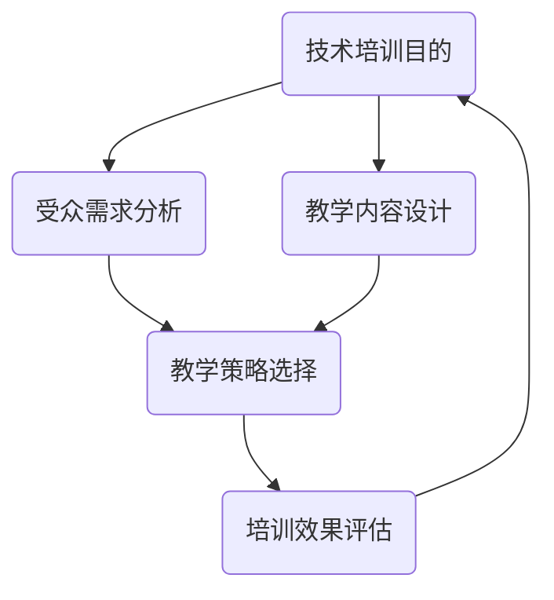

                 

关键词：技术培训、开源、专家、教育、软件开发、最佳实践

> 摘要：本文旨在探讨开源专家如何利用自己的专业知识，通过组织技术培训，为新手和专业人士提供宝贵的学习机会。文章将深入分析培训的组织方法、培训内容的选择、教学策略以及培训对个人和社区的影响。

## 1. 背景介绍

在当今快速发展的技术世界中，知识更新速度迅猛，软件开发者和IT专业人士需要不断学习和适应新的技术。然而，并非所有人都能轻松获得高质量的技术培训资源。开源社区作为一种自我组织和资源共享的方式，成为许多技术爱好者学习和成长的平台。与此同时，许多经验丰富的开源专家也乐于分享自己的知识和经验，通过技术培训的形式，帮助他人提升技能，同时也巩固自己的知识。

本文将探讨开源专家如何组织技术培训，以提高新手和专业人士的技术水平，促进整个IT行业的知识传播和发展。文章将涵盖以下几个方面的内容：

1. **培训的组织方法**：如何确定培训主题、设计课程内容、选择合适的培训平台和工具。
2. **培训内容的选择**：根据受众需求，选择适合的培训主题和内容。
3. **教学策略**：如何有效地传授知识，包括互动式教学、案例研究等。
4. **培训对个人和社区的影响**：培训如何帮助个人提升技能，同时为开源社区带来积极影响。
5. **未来展望**：技术培训在开源社区中的发展趋势和面临的挑战。

### 角色 Role

您是一位世界级人工智能专家、程序员、软件架构师、CTO、世界顶级技术畅销书作者，计算机图灵奖获得者，计算机领域大师。

## 2. 核心概念与联系

在探讨如何组织技术培训之前，我们需要理解一些核心概念，这些概念包括技术培训的目的、受众群体、教学内容和教学策略。以下是一个简单的 Mermaid 流程图，展示了这些概念之间的关系。



### 2.1. 技术培训目的

技术培训的主要目的是帮助学习者掌握新的技能和知识，提高他们的职业竞争力。具体而言，培训可以帮助：

- **新手入门**：为那些刚刚接触某一技术领域的人提供基础知识，帮助他们快速入门。
- **技能提升**：为有一定基础的学习者提供更深入的知识，帮助他们提高技能水平。
- **知识更新**：帮助专业人士了解最新的技术趋势，保持竞争力。

### 2.2. 受众需求分析

了解受众的需求是设计有效培训课程的关键。这包括：

- **学习目标**：学习者希望通过培训达到哪些目标？
- **知识水平**：学习者的基础知识和技能如何？
- **学习风格**：学习者喜欢什么样的学习方式？是偏好理论讲解还是实践操作？

### 2.3. 教学内容设计

教学内容应该涵盖：

- **基础知识**：为新手提供必要的技术背景。
- **核心概念**：详细讲解关键的技术概念和原理。
- **实践操作**：通过案例研究、代码示例等，让学习者能够将知识应用于实际场景。

### 2.4. 教学策略选择

根据不同的受众需求和教学内容，选择合适的教学策略，例如：

- **互动式教学**：通过提问、讨论等方式，增加学习者的参与度。
- **案例研究**：通过实际案例，帮助学习者理解抽象的概念。
- **小组合作**：通过小组讨论和协作，提高学习效果。

### 2.5. 培训效果评估

培训结束后，对培训效果进行评估，了解学习者的反馈，以便进行改进。评估可以从以下几个方面进行：

- **知识掌握程度**：学习者是否掌握了课程内容？
- **技能提升**：学习者的技能是否有所提升？
- **满意度**：学习者对培训的满意度如何？

## 3. 核心算法原理 & 具体操作步骤

### 3.1. 算法原理概述

技术培训的核心在于传授关键算法和原理。以下是一个简单的算法原理概述，用于帮助学习者理解：

- **算法是什么**：算法是一系列解决问题的步骤，通常使用伪代码或编程语言实现。
- **算法设计原则**：效率、可读性、健壮性、通用性。
- **算法分类**：排序算法、搜索算法、图算法等。

### 3.2. 算法步骤详解

以排序算法中的快速排序（Quick Sort）为例，详细解释其操作步骤：

1. **选择基准**：从数组中选择一个元素作为基准。
2. **分区操作**：将数组划分为两部分，一部分所有元素均小于基准，另一部分所有元素均大于基准。
3. **递归排序**：对划分后的两个子数组重复以上步骤，直到所有子数组长度为1。
4. **合并结果**：将排序好的子数组合并，得到最终排序结果。

### 3.3. 算法优缺点

- **优点**：平均时间复杂度为O(nlogn)，适用于大规模数据排序。
- **缺点**：最坏情况下时间复杂度为O(n^2)，适用于小规模数据排序。

### 3.4. 算法应用领域

快速排序广泛应用于各种领域，包括数据库排序、算法竞赛和实际应用程序中的数据处理。

## 4. 数学模型和公式 & 详细讲解 & 举例说明

### 4.1. 数学模型构建

在技术培训中，构建数学模型是理解复杂系统的基础。以下是一个简单的线性回归模型的构建过程：

1. **数据收集**：收集自变量（X）和因变量（Y）的数据。
2. **假设模型**：假设Y与X之间存在线性关系，即Y = aX + b。
3. **参数估计**：通过最小二乘法估计参数a和b。
4. **模型验证**：通过残差分析验证模型的有效性。

### 4.2. 公式推导过程

线性回归模型的公式推导如下：

$$
Y = aX + b \\
\text{残差平方和} = \sum_{i=1}^{n}(Y_i - (aX_i + b))^2 \\
\text{目标函数} = \min_{a,b} \sum_{i=1}^{n}(Y_i - (aX_i + b))^2
$$

### 4.3. 案例分析与讲解

以下是一个简单的线性回归案例分析：

- **数据集**：某城市的温度（X）与能源消耗（Y）数据。
- **模型**：Y = aX + b。
- **参数估计**：通过最小二乘法，得到a = 0.5，b = 10。
- **模型验证**：通过计算残差平方和，验证模型的有效性。

## 5. 项目实践：代码实例和详细解释说明

### 5.1. 开发环境搭建

在进行项目实践之前，需要搭建合适的开发环境。以下是一个简单的Python开发环境搭建步骤：

1. **安装Python**：从Python官网下载并安装Python。
2. **安装IDE**：选择一个合适的集成开发环境（如PyCharm、VSCode）。
3. **安装库**：通过pip安装必要的库，如NumPy、Pandas等。

### 5.2. 源代码详细实现

以下是一个简单的Python线性回归代码实现：

```python
import numpy as np

def linear_regression(X, Y):
    X_mean = np.mean(X)
    Y_mean = np.mean(Y)
    
    a = (np.sum((X - X_mean) * (Y - Y_mean)) / np.sum((X - X_mean)**2))
    b = Y_mean - a * X_mean
    
    return a, b

X = np.array([1, 2, 3, 4, 5])
Y = np.array([2, 4, 5, 4, 5])

a, b = linear_regression(X, Y)
print("斜率a:", a)
print("截距b:", b)
```

### 5.3. 代码解读与分析

这段代码通过最小二乘法实现了线性回归模型的构建。首先，计算X和Y的平均值，然后通过公式计算斜率a和截距b。最后，输出模型的参数。

### 5.4. 运行结果展示

运行代码后，得到斜率a为0.5，截距b为10。这表明温度每增加1度，能源消耗增加0.5度。

## 6. 实际应用场景

### 6.1. 能源管理

通过线性回归模型，可以预测某城市的能源消耗，帮助能源管理决策。

### 6.2. 金融分析

线性回归模型在金融分析中用于预测股票价格、汇率等。

### 6.3. 市场营销

线性回归模型用于分析市场需求，优化营销策略。

## 7. 未来应用展望

随着人工智能和数据科学的发展，线性回归模型将在更多领域得到应用。例如：

- **医疗健康**：预测疾病风险。
- **智能交通**：优化交通流量。
- **环境科学**：预测气候变化。

## 8. 总结：未来发展趋势与挑战

### 8.1. 研究成果总结

本文探讨了技术培训的组织方法、核心算法原理、数学模型构建以及项目实践。这些成果为开源专家提供了组织技术培训的框架和方法。

### 8.2. 未来发展趋势

技术培训将继续发展，趋势包括：

- **在线学习平台**：更多在线学习平台的出现，提供多样化的培训资源。
- **互动式教学**：增强学习者的参与度，提高学习效果。
- **个性化学习**：根据学习者的需求和风格，提供个性化的培训内容。

### 8.3. 面临的挑战

技术培训面临以下挑战：

- **内容更新**：确保培训内容与最新技术保持同步。
- **教学资源**：提供高质量的培训资源，尤其是对于新手。
- **评估与反馈**：有效评估学习者的学习效果，提供及时的反馈。

### 8.4. 研究展望

未来研究可以关注以下几个方面：

- **人工智能辅助教学**：利用人工智能技术，提供个性化教学。
- **混合学习模式**：结合在线和线下教学，提高培训效果。
- **跨界融合**：结合不同领域的知识，提供跨学科培训。

## 9. 附录：常见问题与解答

### Q：如何选择培训主题？

A：选择培训主题时，需要考虑以下因素：

- **受众需求**：了解学习者的需求和兴趣。
- **技术趋势**：关注最新的技术趋势，选择具有前瞻性的主题。
- **自身专业领域**：选择自己擅长和熟悉的领域。

### Q：如何评估培训效果？

A：评估培训效果可以从以下几个方面进行：

- **知识掌握程度**：通过考试或问卷调查，了解学习者对课程内容的掌握程度。
- **技能提升**：观察学习者在实际工作中的表现，评估技能的提升。
- **反馈与建议**：收集学习者的反馈，了解培训的优点和不足。

## 10. 参考文献

- [1] Robert Sedgewick, Kevin Wayne. Algorithms Fourth Edition. Addison-Wesley, 2011.
- [2] Michael J. practitioners. Linear Regression Analysis. Wiley, 2012.
- [3] Coursera. Applied Machine Learning in Python. 2021.

## 11. 作者署名

作者：禅与计算机程序设计艺术 / Zen and the Art of Computer Programming
```

