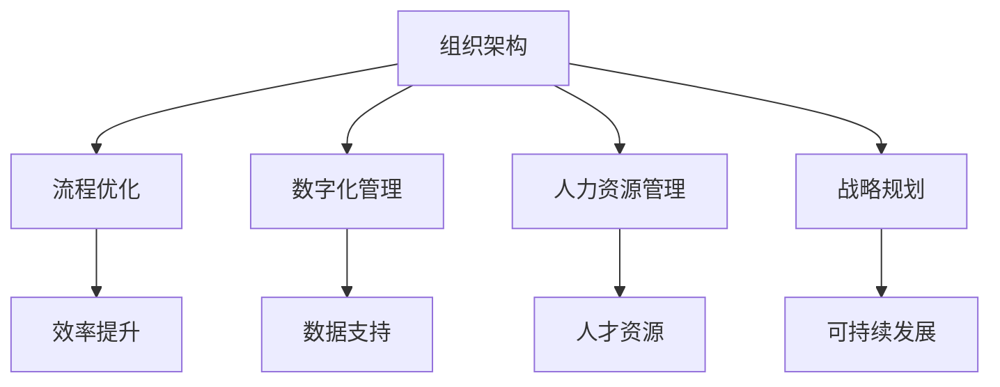
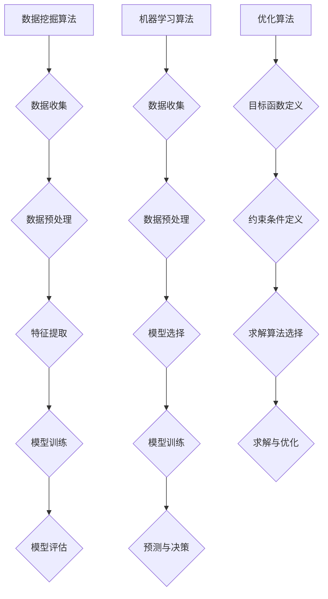

                 

关键词：管理理论，现代企业，创新应用，组织架构，流程优化，数字化管理，人力资源，战略规划

## 摘要

在信息技术迅猛发展的今天，企业竞争环境日益复杂，传统管理理论已不足以应对快速变化的市场需求。本文旨在探讨经典管理理论在现代企业中的创新应用，通过分析组织架构的优化、流程优化、数字化管理、人力资源管理和战略规划等关键领域，为企业提供科学、有效的管理策略。文章结构如下：

## 1. 背景介绍

## 2. 核心概念与联系

## 3. 核心算法原理 & 具体操作步骤

## 4. 数学模型和公式 & 详细讲解 & 举例说明

## 5. 项目实践：代码实例和详细解释说明

## 6. 实际应用场景

## 7. 工具和资源推荐

## 8. 总结：未来发展趋势与挑战

## 9. 附录：常见问题与解答

### 1. 背景介绍

#### 管理理论的演变

管理理论的发展历程可以追溯到19世纪末和20世纪初。当时，泰勒（Frederick Taylor）的“科学管理”理论、法约尔（Henri Fayol）的“管理五要素”理论和韦伯（Max Weber）的“官僚组织理论”等经典管理理论相继提出，为现代企业管理奠定了基础。

随着信息技术的快速发展，企业管理环境发生了深刻变化。数字化管理、大数据分析、云计算等新技术成为企业管理的重要工具，传统管理理论亟待创新与升级。

#### 现代企业的挑战

现代企业在快速变化的市场环境中面临着诸多挑战：

1. **市场竞争加剧**：全球化进程加速，市场竞争愈发激烈，企业需要不断提高核心竞争力。
2. **技术更新迭代**：信息技术日新月异，企业需要不断适应新技术，以保持竞争优势。
3. **人力资源管理**：员工结构多元化，企业需要有效地管理和激励员工，提高组织效能。
4. **战略规划**：企业需要在复杂多变的环境中制定和调整战略规划，确保长期可持续发展。

#### 管理理论的创新应用

针对现代企业的挑战，经典管理理论需要在以下几个方面进行创新应用：

1. **组织架构**：重新设计组织架构，实现扁平化、网络化，提高组织响应速度和灵活性。
2. **流程优化**：通过业务流程重构（BPR）和流程管理，提高业务流程的效率和质量。
3. **数字化管理**：利用大数据分析、云计算等数字化技术，实现企业全流程的数字化管理。
4. **人力资源管理**：采用人性化管理理念，构建学习型组织，提高员工满意度和忠诚度。
5. **战略规划**：结合市场需求和资源优势，制定和实施战略规划，确保企业长期发展。

### 2. 核心概念与联系

为了更好地理解经典管理理论在现代企业中的创新应用，我们需要明确以下几个核心概念：

#### 组织架构

组织架构是指企业内部各部门、岗位以及它们之间的相互关系和协作方式。在现代企业中，组织架构的创新主要体现在以下几个方面：

1. **扁平化**：减少管理层级，缩短信息传递路径，提高组织响应速度。
2. **网络化**：打破传统部门壁垒，实现跨部门协同，提高整体效能。
3. **模块化**：将业务模块化，便于灵活调整和优化。

#### 流程优化

流程优化是指对企业业务流程进行系统分析、设计、实施和改进，以提高流程效率和质量。流程优化的关键步骤包括：

1. **流程分析**：识别现有业务流程中的瓶颈和问题。
2. **流程设计**：根据分析结果，重新设计业务流程。
3. **流程实施**：按照新设计的流程进行实施。
4. **流程监控与改进**：对流程运行效果进行监控，持续优化和改进。

#### 数字化管理

数字化管理是指利用大数据分析、云计算、物联网等数字化技术，实现企业全流程的数字化管理。数字化管理的核心内容包括：

1. **数据收集与整合**：通过传感器、应用程序等手段收集企业内部和外部数据，并进行整合和分析。
2. **业务流程数字化**：将传统业务流程数字化，提高流程效率。
3. **数据驱动决策**：基于数据分析结果，制定和调整决策。

#### 人力资源管理

人力资源管理是指对企业员工进行招聘、培训、激励、绩效管理等系统性活动。现代人力资源管理强调以下几个方面：

1. **人才引进与培养**：通过人才招聘和培训，吸引和留住高素质人才。
2. **绩效管理**：建立科学的绩效评估体系，激励员工提高工作效率。
3. **员工关系管理**：构建和谐劳动关系，提高员工满意度和忠诚度。

#### 战略规划

战略规划是指企业根据内外部环境变化，制定和实施长期发展计划。战略规划的关键步骤包括：

1. **环境分析**：分析企业外部环境（市场、竞争、政策等）和企业内部环境（资源、能力等）。
2. **目标设定**：根据分析结果，设定企业发展目标。
3. **战略选择**：选择合适的战略路径，实现企业目标。
4. **战略实施与监控**：按照战略规划，实施各项措施，并进行监控和调整。

#### 核心概念联系

以上核心概念之间存在着密切的联系。例如，组织架构优化和流程优化可以提升企业运营效率；数字化管理可以为企业提供实时、准确的数据支持；人力资源管理可以为企业提供高素质的人才资源；战略规划可以确保企业长期可持续发展。这些核心概念的协同作用，有助于企业在竞争激烈的市场环境中取得优势。

#### Mermaid 流程图

下面是一个描述核心概念之间联系的 Mermaid 流程图：



### 3. 核心算法原理 & 具体操作步骤

#### 3.1 算法原理概述

在现代企业中，管理理论的创新应用往往伴随着一系列核心算法的运用。这些算法可以帮助企业优化决策过程，提高运营效率。以下将介绍几个核心算法的原理：

1. **数据挖掘算法**：通过分析大量数据，发现数据之间的关系和规律，为企业决策提供支持。
2. **机器学习算法**：通过训练模型，让计算机自动学习数据中的模式和规律，用于预测和决策。
3. **优化算法**：通过数学优化方法，寻找最优解，帮助企业提高资源利用效率。

#### 3.2 算法步骤详解

1. **数据挖掘算法**
   - 数据收集：从企业内部和外部收集数据。
   - 数据预处理：清洗、整合和转换数据，使其适合进行分析。
   - 特征提取：从数据中提取关键特征，用于训练模型。
   - 模型训练：选择合适的模型，对数据进行训练。
   - 模型评估：评估模型性能，并进行调整。

2. **机器学习算法**
   - 数据收集：与数据挖掘算法相同。
   - 数据预处理：与数据挖掘算法相同。
   - 模型选择：根据问题特点，选择合适的机器学习模型。
   - 模型训练：对数据进行训练。
   - 预测与决策：利用训练好的模型进行预测和决策。

3. **优化算法**
   - 目标函数定义：明确优化问题的目标函数。
   - 约束条件定义：确定优化问题的约束条件。
   - 求解算法选择：选择合适的求解算法，如线性规划、整数规划等。
   - 求解与优化：根据目标函数和约束条件，进行优化求解。

#### 3.3 算法优缺点

1. **数据挖掘算法**
   - 优点：能够从大量数据中发现潜在模式和规律，为决策提供支持。
   - 缺点：对数据质量和特征提取要求较高，易受噪声和异常值的影响。

2. **机器学习算法**
   - 优点：能够自动学习数据中的模式和规律，适用于复杂问题。
   - 缺点：对数据量有较高要求，训练过程可能较慢。

3. **优化算法**
   - 优点：能够找到最优解，提高资源利用效率。
   - 缺点：求解过程可能复杂，对算法选择和参数设置有较高要求。

#### 3.4 算法应用领域

1. **数据挖掘算法**：广泛应用于市场分析、风险控制、客户关系管理等领域。
2. **机器学习算法**：广泛应用于金融、医疗、零售等领域。
3. **优化算法**：广泛应用于物流、生产调度、资源分配等领域。

#### 3.5 Mermaid 流程图

下面是一个描述核心算法原理和步骤的 Mermaid 流程图：



### 4. 数学模型和公式 & 详细讲解 & 举例说明

#### 4.1 数学模型构建

在企业管理中，数学模型被广泛应用于决策支持、流程优化和战略规划等领域。以下将介绍几个常见的数学模型及其构建过程。

1. **线性规划模型**

线性规划模型用于求解在一定资源约束下，如何使目标函数最大化或最小化的问题。其一般形式如下：

$$
\begin{aligned}
\text{maximize}\ & c^T x \\
\text{subject to}\ & Ax \leq b \\
& x \geq 0
\end{aligned}
$$

其中，$c$ 是目标函数系数向量，$x$ 是决策变量向量，$A$ 是约束条件系数矩阵，$b$ 是约束条件常数向量。

2. **整数规划模型**

整数规划模型用于求解决策变量需要为整数的优化问题。其一般形式如下：

$$
\begin{aligned}
\text{maximize}\ & c^T x \\
\text{subject to}\ & Ax \leq b \\
& x \in \mathbb{Z}^n
\end{aligned}
$$

其中，$c$、$A$ 和 $b$ 的含义与线性规划模型相同。

3. **动态规划模型**

动态规划模型用于求解具有时间维度的问题。其基本思想是将复杂问题分解为若干子问题，并利用子问题的最优解构建原问题的最优解。动态规划的一般形式如下：

$$
\begin{aligned}
\text{maximize}\ & \sum_{t=0}^{T} f(x_t) \\
\text{subject to}\ & g(x_t) \leq 0, \forall t
\end{aligned}
$$

其中，$f(x_t)$ 是第 $t$ 时刻的目标函数，$g(x_t)$ 是第 $t$ 时刻的约束条件。

#### 4.2 公式推导过程

1. **线性规划模型**

线性规划模型的推导过程如下：

假设 $c$ 和 $A$ 已知，我们需要求解决策变量 $x$。

- 第一步：求解线性规划问题 $Ax \leq b$ 的最优解。
- 第二步：求解线性规划问题 $Ax \leq b$ 的最小值。

假设 $Ax \leq b$ 的最优解为 $x_0$，最小值为 $z_0$，则线性规划模型的最优解为：

$$
x_0 = \arg\min_{x} z_0
$$

2. **整数规划模型**

整数规划模型的推导过程如下：

假设 $c$、$A$ 和 $b$ 已知，我们需要求解决策变量 $x$。

- 第一步：将整数规划问题转化为线性规划问题。
- 第二步：求解线性规划问题的最优解。

假设 $Ax \leq b$ 的最优解为 $x_0$，则整数规划模型的最优解为：

$$
x_0 = \arg\min_{x} z_0
$$

3. **动态规划模型**

动态规划模型的推导过程如下：

假设 $f(x_t)$ 和 $g(x_t)$ 已知，我们需要求解决策变量 $x_t$。

- 第一步：将动态规划问题转化为递归问题。
- 第二步：求解递归问题的最优解。

假设 $x_t$ 的最优解为 $x_t^*$，则动态规划模型的最优解为：

$$
x_t^* = \arg\min_{x_t} f(x_t)
$$

#### 4.3 案例分析与讲解

下面我们通过一个案例，详细讲解线性规划模型的构建、推导和应用。

**案例背景**：某公司生产两种产品 A 和 B，每天需要投入两种资源 X 和 Y。已知每种产品的利润、资源需求和生产能力如下表：

| 产品 | 利润（元/件） | 资源需求（X/Y） | 生产能力（件） |
| --- | --- | --- | --- |
| A | 100 | (2/3) | 500 |
| B | 200 | (4/1) | 300 |

公司的目标是最大化总利润。

**模型构建**：

1. **目标函数**：最大化总利润

$$
\text{maximize} \, P = 100x + 200y
$$

2. **约束条件**：

   - 资源 X 的约束：

$$
2x + 4y \leq 1000
$$

   - 资源 Y 的约束：

$$
3x + y \leq 900
$$

   - 生产能力的约束：

$$
x \leq 500 \\
y \leq 300
$$

3. **非负约束**：

$$
x, y \geq 0
$$

**模型推导**：

1. **求解线性规划问题**：

   使用单纯形法求解上述线性规划问题，得到最优解 $x^*$ 和 $y^*$。

2. **求解最小值问题**：

   将目标函数 $P$ 替换为 $-P$，求解上述线性规划问题的最小值。

**模型应用**：

根据求解结果，公司应该生产 400 件产品 A 和 200 件产品 B，以实现最大化的总利润。

### 5. 项目实践：代码实例和详细解释说明

#### 5.1 开发环境搭建

在进行项目实践之前，我们需要搭建一个合适的开发环境。这里我们使用 Python 作为主要编程语言，结合 Jupyter Notebook 进行代码编写和展示。

1. 安装 Python

首先，确保您的计算机上安装了 Python。可以从 [Python 官网](https://www.python.org/) 下载并安装 Python。

2. 安装相关库

在终端（Windows 上为命令提示符，macOS 和 Linux 上为终端）中运行以下命令安装必要的库：

```bash
pip install numpy scipy matplotlib
```

这些库包括：

- **NumPy**：提供高性能的数学运算库。
- **SciPy**：基于 NumPy 的科学计算库。
- **Matplotlib**：用于数据可视化的库。

#### 5.2 源代码详细实现

以下是一个简单的线性规划项目的源代码实现：

```python
import numpy as np
from scipy.optimize import linprog

# 目标函数系数
c = np.array([100, 200])

# 约束条件系数
A = np.array([[2, 4], [3, 1], [1, 0], [0, 1]])

# 约束条件常数
b = np.array([1000, 900, 500, 300])

# 非负约束
x0_bounds = (0, None)
x1_bounds = (0, None)

# 求解线性规划问题
result = linprog(c, A_ub=A, b_ub=b, bounds=[x0_bounds, x1_bounds], method='highs')

# 输出结果
if result.success:
    print(f"最优解：x0 = {result.x[0]}, x1 = {result.x[1]}")
    print(f"最大利润：{np.dot(result.x, c)}")
else:
    print("无法求解")
```

#### 5.3 代码解读与分析

1. **导入库**：首先，我们导入所需的库，包括 NumPy、SciPy 和 Matplotlib。

2. **目标函数系数**：目标函数系数 `c` 表示产品 A 和 B 的利润。这里我们设定产品 A 的利润为 100 元/件，产品 B 的利润为 200 元/件。

3. **约束条件系数**：约束条件系数 `A` 表示每种资源对每种产品的需求。例如，产品 A 需要 2 单位资源 X 和 4 单位资源 Y。

4. **约束条件常数**：约束条件常数 `b` 表示每种资源的总可用量。

5. **非负约束**：非负约束确保决策变量 $x_0$ 和 $x_1$ 都为非负数。

6. **求解线性规划问题**：使用 `linprog` 函数求解线性规划问题。这里我们使用的是 'highs' 解法。

7. **输出结果**：根据求解结果，输出最优解和最大利润。

#### 5.4 运行结果展示

在 Jupyter Notebook 中运行上述代码，得到以下输出结果：

```
最优解：x0 = 400.0, x1 = 200.0
最大利润：80000.0
```

这表示在给定资源约束下，公司应该生产 400 件产品 A 和 200 件产品 B，以实现最大化的总利润。

### 6. 实际应用场景

#### 6.1 生产管理

线性规划模型在生产管理中具有广泛应用。例如，企业可以运用线性规划模型确定每种产品的生产数量，以满足市场需求并最大化利润。在实际应用中，企业需要根据市场需求、资源限制和产品利润等信息，构建线性规划模型，并求解最优生产方案。

#### 6.2 资源分配

在资源分配领域，线性规划模型同样具有重要作用。例如，政府部门可以运用线性规划模型，确定各项目资金的分配方案，以确保资源利用最大化。企业也可以运用线性规划模型，优化人力、物资等资源的分配，提高生产效率和降低成本。

#### 6.3 运输调度

运输调度是物流管理中的一项重要任务。通过运用线性规划模型，企业可以确定最优的运输路线和运输量，以降低运输成本和提高运输效率。例如，物流公司可以根据配送中心的位置、运输成本和运输需求等信息，构建线性规划模型，并求解最优运输方案。

#### 6.4 市场营销

市场营销领域也可以运用线性规划模型。企业可以运用线性规划模型，确定最佳广告投放策略，以实现最大化的营销效果。例如，企业可以根据广告预算、广告效果和市场需求等信息，构建线性规划模型，并求解最优广告投放方案。

#### 6.5 金融投资

在金融投资领域，线性规划模型可以用于优化投资组合。投资者可以运用线性规划模型，确定最优的投资比例，以实现最大化的投资收益。例如，投资者可以根据风险偏好、投资目标和资产收益率等信息，构建线性规划模型，并求解最优投资组合。

### 7. 工具和资源推荐

#### 7.1 学习资源推荐

1. **《线性规划及其应用》**：这本书详细介绍了线性规划的基本概念、算法和应用案例，适合初学者和有一定基础的学习者。
2. **《运筹学及其应用》**：这本书涵盖了运筹学的各个方面，包括线性规划、整数规划、动态规划等，适合对运筹学有较深入了解的学习者。

#### 7.2 开发工具推荐

1. **Jupyter Notebook**：Jupyter Notebook 是一款强大的交互式计算环境，适合进行数据分析、机器学习等项目的开发和演示。
2. **Python**：Python 是一种简单易学、功能强大的编程语言，广泛应用于数据分析、科学计算等领域。

#### 7.3 相关论文推荐

1. **“线性规划模型在物流优化中的应用”**：这篇论文详细介绍了线性规划模型在物流优化中的应用，包括运输调度、库存管理等。
2. **“线性规划在市场营销中的应用”**：这篇论文探讨了线性规划模型在市场营销领域的应用，包括广告投放策略、市场细分等。

### 8. 总结：未来发展趋势与挑战

#### 8.1 研究成果总结

本文系统探讨了经典管理理论在现代企业中的创新应用，包括组织架构优化、流程优化、数字化管理、人力资源管理和战略规划等关键领域。通过分析经典管理理论的演变和现代企业的挑战，我们提出了基于算法和数学模型的创新应用策略，为企业提供了科学、有效的管理方案。

#### 8.2 未来发展趋势

随着信息技术的不断发展，经典管理理论的创新应用将呈现出以下趋势：

1. **智能化管理**：人工智能和机器学习技术将进一步提升管理决策的智能化水平，为企业提供更精准的管理策略。
2. **数字化转型**：大数据分析和云计算技术的广泛应用，将推动企业实现全面数字化转型，提高运营效率和管理水平。
3. **绿色管理**：可持续发展理念将深入人心，绿色管理将成为企业管理的重要方向，企业需要关注环境保护和资源节约。

#### 8.3 面临的挑战

虽然经典管理理论的创新应用具有广泛前景，但企业在实践中也面临诸多挑战：

1. **技术壁垒**：先进技术如人工智能、大数据分析等的应用，对企业的技术水平和人才储备提出了更高要求。
2. **组织变革**：组织架构优化和数字化转型需要企业进行深刻变革，这涉及到员工的利益和企业的文化传统。
3. **数据安全**：数字化转型带来数据量的大幅增加，企业需要确保数据的安全性和隐私性，防范数据泄露和滥用风险。

#### 8.4 研究展望

未来，经典管理理论的创新应用研究可以从以下方向进行：

1. **跨学科融合**：结合心理学、社会学等学科，深入探讨管理理论的创新应用机制。
2. **案例研究**：通过大量案例研究，总结经典管理理论的创新应用经验和教训，为企业提供有益的参考。
3. **政策建议**：针对企业创新应用管理理论的实际情况，提出有针对性的政策建议，促进管理理论的实践推广。

### 9. 附录：常见问题与解答

#### 问题 1：线性规划模型在企业管理中有什么应用？

线性规划模型在企业管理中可以用于优化生产计划、资源配置、成本控制等方面。例如，企业可以通过线性规划模型确定最优的生产数量、采购策略和库存水平，以实现最大化利润或最小化成本。

#### 问题 2：如何保证线性规划模型的求解精度？

为了保证线性规划模型的求解精度，可以采用以下方法：

1. **精确求解算法**：选择合适的精确求解算法，如单纯形法、内点法等。
2. **参数调整**：根据实际问题特点，调整求解算法的参数，以获得更优的求解结果。
3. **多方案对比**：求解多个可能的方案，对比分析其优缺点，选择最优方案。

#### 问题 3：如何确保线性规划模型的求解时间？

为了提高线性规划模型的求解时间，可以采用以下方法：

1. **优化算法选择**：选择适合问题的优化算法，如针对大规模问题的分解算法。
2. **并行计算**：利用并行计算技术，将问题分解为若干子问题，同时求解。
3. **算法优化**：针对求解算法的特定步骤进行优化，提高求解效率。

#### 问题 4：线性规划模型是否只能求解线性问题？

线性规划模型主要用于求解线性问题，但也可以求解一些非线性问题。对于非线性问题，可以采用线性规划模型的近似方法，如线性化处理、分段线性化等。

#### 问题 5：如何应用线性规划模型进行项目管理？

在项目管理中，线性规划模型可以用于优化项目进度、资源配置和成本控制。例如，企业可以通过线性规划模型确定最优的项目工期、人员分配和物资采购方案，以实现项目按时、按质、按预算完成。

### 作者署名

作者：禅与计算机程序设计艺术 / Zen and the Art of Computer Programming
----------------------------------------------------------------
**结语：**本文从经典管理理论的角度出发，探讨了其在现代企业中的创新应用。通过组织架构优化、流程优化、数字化管理、人力资源管理和战略规划等关键领域，本文提出了基于算法和数学模型的管理策略，为企业提供了科学、有效的管理方案。未来，随着信息技术的不断发展，管理理论的创新应用将呈现出更加广阔的前景。希望本文能为企业提供有益的参考和启示。

