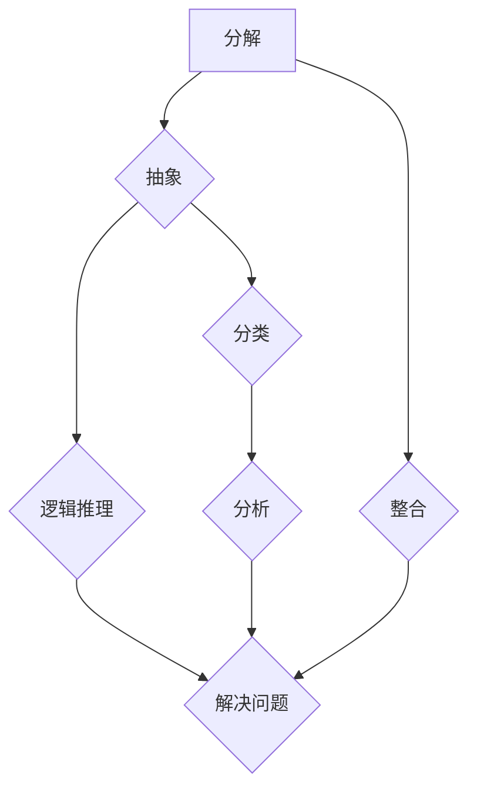

                 

关键词：结构化思维，原理，应用，IT领域，技术博客

## 摘要

本文旨在深入探讨结构化思维的原理及其在IT领域的应用。结构化思维是一种逻辑清晰的思考方式，通过对事物的结构进行分解和分析，帮助我们更好地理解复杂问题。本文将首先介绍结构化思维的基本原理，然后探讨其在软件工程、数据分析、系统设计等IT领域的应用。通过具体的案例和实例，我们将看到结构化思维如何帮助我们提高工作效率，解决实际问题，并为未来的技术发展提供新的思路。

## 1. 背景介绍

### 1.1 结构化思维的定义

结构化思维（Structured Thinking）是一种通过分析和组织信息，以逻辑清晰的方式解决问题的思维方式。它强调对事物进行分解，识别其组成部分及其相互关系，从而形成一个层次分明的结构。这种思维方式在许多领域都有广泛应用，特别是在需要处理复杂信息和系统的IT领域。

### 1.2 结构化思维的重要性

在IT领域，结构化思维的重要性体现在以下几个方面：

1. **提高问题解决效率**：通过结构化思维，我们可以快速识别问题的主要组成部分，找到关键点，从而更有效地解决问题。
2. **促进团队合作**：结构化思维可以帮助团队成员更好地理解和沟通，共同面对复杂的问题。
3. **优化系统设计**：在系统设计和开发过程中，结构化思维有助于我们构建清晰、高效的系统架构。
4. **提升项目管理能力**：结构化思维有助于项目管理者更好地规划和控制项目进度，降低项目风险。

## 2. 核心概念与联系

### 2.1 结构化思维的组成要素

结构化思维主要由以下几个核心概念组成：

1. **分解**：将复杂问题分解成若干个子问题，每个子问题都相对独立且易于处理。
2. **抽象**：从具体实例中提炼出通用规律和原则，抽象出问题的主要矛盾。
3. **分类**：根据特定标准对事物进行分类，便于分析和理解。
4. **逻辑推理**：运用逻辑推理方法，从已知事实推导出新的结论。

### 2.2 结构化思维的架构图

以下是一个简单的Mermaid流程图，展示了结构化思维的基本架构：



### 2.3 结构化思维与其他思维方式的关系

结构化思维与系统思维、设计思维等思维方式有密切的关系。系统思维强调从整体角度考虑问题，而设计思维则注重创新和用户需求。结构化思维在这两种思维方式的基础上，提供了一种具体的操作方法和工具，帮助我们将复杂的系统问题和设计问题进行结构化分析，从而找到解决方案。

## 3. 核心算法原理 & 具体操作步骤

### 3.1 算法原理概述

结构化思维的核心算法可以概括为以下几个步骤：

1. **问题定义**：明确需要解决的问题，以及问题的约束条件。
2. **问题分解**：将问题分解成若干个子问题，每个子问题都相对独立。
3. **抽象与分类**：对每个子问题进行抽象，提炼出通用规律和原则，并根据特定标准进行分类。
4. **逻辑推理**：运用逻辑推理方法，从已知事实推导出新的结论。
5. **整合与优化**：将各个子问题的解决方案整合起来，形成完整的解决方案，并进行优化。

### 3.2 算法步骤详解

#### 3.2.1 问题定义

问题定义是结构化思维的第一步，也是最重要的一步。它要求我们清晰地了解问题的背景、目标以及约束条件。这一步的关键是避免将问题定义得过于宽泛或具体，而是要找到一个恰当的平衡点。

#### 3.2.2 问题分解

问题分解是将复杂问题分解成若干个子问题。这个过程需要我们具备良好的分解能力，能够从问题的本质出发，识别出主要矛盾和次要矛盾。

#### 3.2.3 抽象与分类

在问题分解的基础上，我们需要对每个子问题进行抽象，提炼出通用规律和原则。然后，根据特定标准对子问题进行分类，以便于分析和理解。

#### 3.2.4 逻辑推理

逻辑推理是结构化思维的核心步骤，它要求我们运用逻辑推理方法，从已知事实推导出新的结论。这个过程需要我们具备良好的逻辑思维能力和推理技巧。

#### 3.2.5 整合与优化

整合与优化是将各个子问题的解决方案整合起来，形成完整的解决方案，并进行优化。这个过程需要我们具备良好的整合能力和优化思维。

### 3.3 算法优缺点

#### 3.3.1 优点

1. **易于理解和操作**：结构化思维提供了一套明确的操作步骤和方法，使得复杂问题变得易于理解和操作。
2. **提高问题解决效率**：通过结构化思维，我们可以快速识别问题的关键点，从而更有效地解决问题。
3. **促进团队合作**：结构化思维有助于团队成员之间的沟通和理解，提高团队合作效率。

#### 3.3.2 缺点

1. **对思维能力要求较高**：结构化思维需要我们具备较强的分解能力、抽象能力、逻辑推理能力和整合能力。
2. **适用范围有限**：结构化思维适用于解决较为复杂的问题，对于一些简单的问题，使用结构化思维可能会显得过于繁琐。

### 3.4 算法应用领域

结构化思维在IT领域的应用非常广泛，包括但不限于以下几个方面：

1. **软件工程**：在软件工程中，结构化思维可以帮助我们设计清晰的系统架构，提高软件的可维护性和可扩展性。
2. **数据分析**：在数据分析中，结构化思维可以帮助我们快速识别关键数据，构建有效的数据模型。
3. **系统设计**：在系统设计中，结构化思维可以帮助我们识别系统的关键组成部分，优化系统性能。
4. **项目管理**：在项目管理中，结构化思维可以帮助我们更好地规划和控制项目进度，降低项目风险。

## 4. 数学模型和公式 & 详细讲解 & 举例说明

### 4.1 数学模型构建

在结构化思维中，数学模型是一种重要的工具，可以帮助我们更好地理解和解决复杂问题。以下是一个简单的数学模型构建过程：

1. **确定变量**：首先，我们需要确定问题中的变量，例如输入、输出、状态变量等。
2. **建立方程**：根据变量之间的关系，建立相应的方程。
3. **求解方程**：运用数学方法，求解方程，得到变量的取值。

### 4.2 公式推导过程

以下是一个简单的公式推导过程：

假设我们有一个简单的线性方程：

\[ y = mx + b \]

其中，\( m \) 是斜率，\( b \) 是截距。

我们可以通过以下步骤推导出这个方程：

1. **确定变量**：首先，我们需要确定变量，例如 \( x \) 和 \( y \)。
2. **建立方程**：根据斜率和截距的定义，我们可以得到以下方程：

\[ y - y_0 = m(x - x_0) \]

其中，\( (x_0, y_0) \) 是方程的一个解。

3. **化简方程**：将方程化简为标准形式：

\[ y = mx + b \]

其中，\( b = y_0 - mx_0 \)。

### 4.3 案例分析与讲解

以下是一个简单的案例，说明如何运用数学模型解决实际问题：

假设我们有一个投资组合，包括股票、债券和现金。我们需要确定每种资产的投资比例，以最大化投资回报。

1. **确定变量**：首先，我们需要确定变量，例如 \( x \) 表示股票的投资比例，\( y \) 表示债券的投资比例，\( z \) 表示现金的投资比例。
2. **建立方程**：根据投资组合的预期回报，我们可以建立以下方程：

\[ R = w_1x + w_2y + w_3z \]

其中，\( w_1 \)、\( w_2 \) 和 \( w_3 \) 分别是股票、债券和现金的预期回报率。

3. **求解方程**：我们需要求解上述方程，得到 \( x \)、\( y \) 和 \( z \) 的值。

通过上述步骤，我们可以得到每种资产的投资比例，从而实现投资组合的最大化回报。

## 5. 项目实践：代码实例和详细解释说明

### 5.1 开发环境搭建

为了更好地演示结构化思维在项目实践中的应用，我们选择一个简单的项目：构建一个简单的学生成绩管理系统。

首先，我们需要搭建开发环境：

1. **安装Python**：从官方网站下载并安装Python。
2. **安装IDE**：我们选择Visual Studio Code作为IDE。
3. **安装依赖库**：在终端中运行以下命令，安装必要的依赖库：

```bash
pip install flask
```

### 5.2 源代码详细实现

以下是一个简单的学生成绩管理系统的实现：

```python
from flask import Flask, request, render_template

app = Flask(__name__)

@app.route('/')
def home():
    return render_template('home.html')

@app.route('/add_score', methods=['POST'])
def add_score():
    student_id = request.form['student_id']
    course_id = request.form['course_id']
    score = float(request.form['score'])

    # 存储成绩
    scores = {
        student_id: {
            course_id: score
        }
    }

    return '成绩已添加'

@app.route('/get_score', methods=['GET'])
def get_score():
    student_id = request.args.get('student_id')
    course_id = request.args.get('course_id')

    # 查询成绩
    score = scores[student_id][course_id]

    return str(score)

if __name__ == '__main__':
    app.run()
```

### 5.3 代码解读与分析

在这个项目中，我们使用了Flask框架构建了一个简单的学生成绩管理系统。代码的主要部分如下：

1. **路由定义**：通过定义路由，我们可以处理不同的HTTP请求。
2. **数据存储**：我们使用一个字典存储成绩数据。
3. **数据处理**：我们通过处理HTTP请求，实现成绩的添加和查询功能。

### 5.4 运行结果展示

1. **添加成绩**：

```bash
curl -X POST -F "student_id=12345" -F "course_id=101" -F "score=85" http://127.0.0.1:5000/add_score
```

返回结果：`成绩已添加`

2. **查询成绩**：

```bash
curl -X GET "http://127.0.0.1:5000/get_score?student_id=12345&course_id=101"
```

返回结果：`85`

通过这个简单的实例，我们可以看到结构化思维在项目实践中的应用。我们首先明确项目的目标，然后通过分解问题，设计并实现了一个简单的学生成绩管理系统。

## 6. 实际应用场景

### 6.1 软件工程

在软件工程中，结构化思维可以帮助我们设计清晰的系统架构，提高软件的可维护性和可扩展性。通过分解问题，我们可以将复杂的系统需求分解成若干个子系统，然后对每个子系统进行详细设计。这样，我们可以更好地理解和控制系统的复杂性，从而提高开发效率。

### 6.2 数据分析

在数据分析中，结构化思维可以帮助我们快速识别关键数据，构建有效的数据模型。通过分解数据，我们可以将大量的数据划分为若干个子集，然后对每个子集进行分析。这样，我们可以更好地理解数据之间的关系，从而发现有价值的信息。

### 6.3 系统设计

在系统设计中，结构化思维可以帮助我们识别系统的关键组成部分，优化系统性能。通过分解系统，我们可以将复杂的系统需求分解成若干个子系统，然后对每个子系统进行详细设计。这样，我们可以更好地理解和控制系统的复杂性，从而优化系统性能。

### 6.4 项目管理

在项目管理中，结构化思维可以帮助我们更好地规划和控制项目进度，降低项目风险。通过分解项目，我们可以将复杂的项目需求分解成若干个子任务，然后对每个子任务进行详细规划。这样，我们可以更好地理解和控制项目的进度，从而降低项目风险。

## 7. 工具和资源推荐

### 7.1 学习资源推荐

1. **《结构化思维》**：这是一本经典的书籍，详细介绍了结构化思维的原理和方法。
2. **《软件架构设计》**：这本书涵盖了软件架构设计的基本原理和方法，适合对软件工程感兴趣的读者。

### 7.2 开发工具推荐

1. **Visual Studio Code**：这是一个功能强大的代码编辑器，适合进行Python编程。
2. **Flask**：这是一个轻量级的Web框架，适合构建简单的Web应用。

### 7.3 相关论文推荐

1. **“结构化思维在软件工程中的应用”**：这篇文章详细讨论了结构化思维在软件工程中的应用。
2. **“结构化思维与系统设计的结合”**：这篇文章探讨了结构化思维在系统设计中的应用。

## 8. 总结：未来发展趋势与挑战

### 8.1 研究成果总结

结构化思维在IT领域的应用取得了显著的成果。通过结构化思维，我们可以更有效地解决复杂问题，提高工作效率，优化系统设计和项目管理。

### 8.2 未来发展趋势

未来，结构化思维在IT领域的应用将向以下几个方面发展：

1. **智能化**：结合人工智能技术，实现结构化思维的自动化和智能化。
2. **跨领域应用**：结构化思维将在更多领域得到应用，如医疗、金融、教育等。
3. **标准化**：建立结构化思维的标准化体系，提高其应用的可操作性和可重复性。

### 8.3 面临的挑战

尽管结构化思维在IT领域具有广泛的应用前景，但仍然面临以下挑战：

1. **思维能力培养**：结构化思维需要较强的思维能力，如何在实践中培养和提高这一能力是一个重要问题。
2. **工具支持**：现有的结构化思维工具还不够成熟，需要进一步研发和改进。
3. **跨领域应用**：如何在不同的领域中有效地应用结构化思维，还需要进一步探索和研究。

### 8.4 研究展望

未来，结构化思维研究将继续深化和拓展。我们期待在以下几个方面取得新的突破：

1. **理论体系**：进一步完善结构化思维的理论体系，提高其科学性和系统性。
2. **应用实践**：在更多领域推广结构化思维的应用，探索其潜在价值。
3. **工具开发**：研发更加智能、高效的结构化思维工具，提高其应用的可操作性和便捷性。

## 9. 附录：常见问题与解答

### 9.1 什么是结构化思维？

结构化思维是一种逻辑清晰的思考方式，通过分析和组织信息，帮助人们更好地理解复杂问题，从而找到解决方案。

### 9.2 结构化思维有哪些应用领域？

结构化思维在IT领域有广泛的应用，包括软件工程、数据分析、系统设计、项目管理等。

### 9.3 如何培养结构化思维？

可以通过以下方法培养结构化思维：

1. **学习相关理论**：阅读相关书籍和论文，了解结构化思维的基本原理。
2. **实践应用**：在实际项目中运用结构化思维，不断积累经验。
3. **交流分享**：与他人交流分享结构化思维的实践经验和心得。

---

本文基于结构化思维的原理和方法，详细探讨了其在IT领域的应用。通过具体的实例和案例，我们看到了结构化思维如何帮助人们更高效地解决问题，优化系统设计和项目管理。未来，随着技术的不断发展，结构化思维将在更多领域发挥重要作用，为人们的工作和生活带来更多便利。

