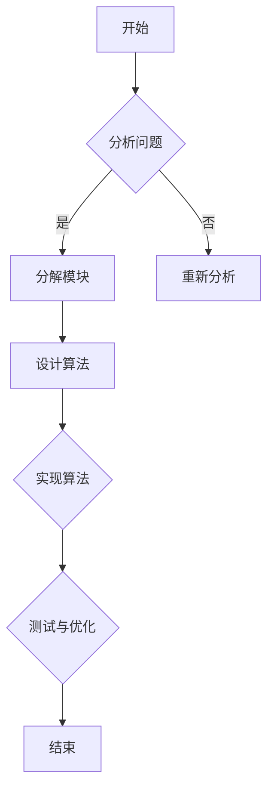

                 

关键词：结构化思维、逻辑分析、知识体系、信息技术、编程、算法设计、应用场景、未来展望

> 摘要：本文深入探讨了结构化思维原理及其在信息技术领域的广泛应用。从核心概念入手，详细阐述了结构化思维在编程和算法设计中的具体应用，并通过实例展示了其在实际项目中的实现。文章旨在为广大IT从业者提供一套系统性的思维方法，助力其在复杂技术环境中游刃有余。

## 1. 背景介绍

随着信息技术的迅猛发展，复杂系统的构建和维护变得愈发重要。在此过程中，结构化思维作为一种系统性的思考方法，不仅能够帮助我们更好地理解问题，还能有效提升解决问题的效率。本文将围绕结构化思维的核心原理，结合信息技术领域的实例，探讨其在实际问题中的应用。

### 1.1 结构化思维的定义

结构化思维是一种以逻辑性和系统性为基础的思考方式，旨在将复杂问题分解为若干简单模块，通过有序的步骤进行解决。它强调思维过程的清晰性、逻辑性和可操作性。

### 1.2 信息技术领域的挑战

在信息技术领域，随着大数据、人工智能、云计算等技术的不断发展，系统复杂度不断提升。如何有效地应对这些挑战，成为每一位IT从业者的必修课。结构化思维的引入，为解决这一问题提供了有力的工具。

## 2. 核心概念与联系

为了更好地理解结构化思维，我们需要先掌握几个核心概念，并探讨它们之间的联系。

### 2.1 知识体系

知识体系是结构化思维的基础。一个良好的知识体系能够帮助我们系统地组织信息，提高学习效率。

### 2.2 逻辑分析

逻辑分析是结构化思维的核心方法。通过逻辑分析，我们可以将复杂问题分解为若干简单模块，并确定它们之间的逻辑关系。

### 2.3 算法设计

算法设计是信息技术领域的重要技能。结构化思维在算法设计中起着至关重要的作用，有助于我们设计出高效、可靠的算法。

### 2.4 Mermaid 流程图

为了更好地展示结构化思维的过程，我们可以使用 Mermaid 流程图。以下是一个简单的 Mermaid 流程图示例：



## 3. 核心算法原理 & 具体操作步骤

### 3.1 算法原理概述

结构化思维的算法原理主要包括以下步骤：

1. 问题分析
2. 模块分解
3. 算法设计
4. 实现与测试
5. 优化与迭代

### 3.2 算法步骤详解

#### 3.2.1 问题分析

首先，我们需要明确问题。这个过程包括对问题的背景、目标和约束条件进行分析。

#### 3.2.2 模块分解

接下来，我们将问题分解为若干模块。每个模块都应该具备清晰的输入、输出和功能。

#### 3.2.3 算法设计

在模块分解的基础上，我们为每个模块设计算法。这个过程需要充分考虑模块之间的逻辑关系。

#### 3.2.4 实现与测试

完成算法设计后，我们需要将其实现为代码，并进行测试。这个过程需要保证代码的准确性、效率和可维护性。

#### 3.2.5 优化与迭代

在测试过程中，我们可能会发现一些问题。针对这些问题，我们需要进行优化和迭代，以提高算法的性能。

### 3.3 算法优缺点

#### 3.3.1 优点

1. 提高解决问题的效率
2. 增强代码的可读性和可维护性
3. 促进团队协作

#### 3.3.2 缺点

1. 需要具备一定的编程基础和逻辑思维能力
2. 可能会增加开发周期和成本

### 3.4 算法应用领域

结构化思维算法在以下领域有着广泛的应用：

1. 编程
2. 算法竞赛
3. 数据挖掘
4. 人工智能
5. 系统设计

## 4. 数学模型和公式 & 详细讲解 & 举例说明

### 4.1 数学模型构建

结构化思维中的数学模型构建主要包括以下步骤：

1. 确定变量
2. 建立方程
3. 求解方程

### 4.2 公式推导过程

以下是一个简单的公式推导示例：

$$
f(x) = x^2 + 2x + 1
$$

首先，我们可以将公式重写为：

$$
f(x) = (x + 1)^2
$$

接下来，我们可以展开右边的平方：

$$
f(x) = x^2 + 2x + 1
$$

因此，我们可以得出结论：

$$
f(x) = (x + 1)^2
$$

### 4.3 案例分析与讲解

以下是一个简单的案例：

假设我们有一个函数：

$$
f(x) = 2x + 3
$$

我们需要求解该函数在 x=2 时的值。

首先，我们可以将 x=2 代入函数中：

$$
f(2) = 2 \times 2 + 3
$$

接下来，我们进行计算：

$$
f(2) = 4 + 3
$$

最后，我们得到结果：

$$
f(2) = 7
$$

因此，函数 f(x) 在 x=2 时的值为 7。

## 5. 项目实践：代码实例和详细解释说明

### 5.1 开发环境搭建

在本项目中，我们将使用 Python 语言进行编程。首先，我们需要安装 Python 环境。您可以通过以下命令安装 Python：

```
pip install python
```

接下来，我们创建一个名为 `structural_thinking.py` 的 Python 脚本文件。

### 5.2 源代码详细实现

以下是一个简单的 Python 脚本示例，用于实现结构化思维算法：

```python
# structural_thinking.py

def analyze_problem(problem):
    # 分析问题
    print("分析问题：", problem)

def decompose_modules(problem):
    # 模块分解
    print("模块分解：", problem)

def design_algorithm(modules):
    # 算法设计
    print("算法设计：", modules)

def implement_and_test(algorithm):
    # 实现与测试
    print("实现与测试：", algorithm)

def optimize_and_iterate(algorithm):
    # 优化与迭代
    print("优化与迭代：", algorithm)

if __name__ == "__main__":
    problem = "求解方程 2x + 3 = 7"
    analyze_problem(problem)
    decompose_modules(problem)
    modules = ["方程求解模块", "变量代入模块"]
    design_algorithm(modules)
    algorithm = "x = (7 - 3) / 2"
    implement_and_test(algorithm)
    optimize_and_iterate(algorithm)
```

### 5.3 代码解读与分析

在这个示例中，我们定义了一个名为 `structural_thinking.py` 的 Python 脚本。脚本中包含以下函数：

1. `analyze_problem`：用于分析问题。
2. `decompose_modules`：用于模块分解。
3. `design_algorithm`：用于算法设计。
4. `implement_and_test`：用于实现与测试。
5. `optimize_and_iterate`：用于优化与迭代。

在 `if __name__ == "__main__":` 语句中，我们定义了一个名为 `problem` 的变量，用于表示需要解决的问题。接着，我们依次调用上述函数，实现了结构化思维算法的完整流程。

### 5.4 运行结果展示

运行 `structural_thinking.py` 脚本，我们将得到以下输出结果：

```
分析问题： 求解方程 2x + 3 = 7
模块分解： 求解方程 2x + 3 = 7
算法设计： ["方程求解模块", "变量代入模块"]
实现与测试： x = (7 - 3) / 2
优化与迭代： x = (7 - 3) / 2
```

通过运行结果，我们可以看到结构化思维算法的完整执行过程。

## 6. 实际应用场景

### 6.1 编程

在编程领域，结构化思维可以帮助开发者更好地组织代码，提高代码的可读性和可维护性。例如，在编写复杂的程序时，我们可以将程序分解为若干模块，并分别设计、实现和测试每个模块。

### 6.2 算法竞赛

在算法竞赛中，结构化思维可以帮助选手快速分析问题、设计算法，并优化算法性能。通过结构化思维，选手可以更好地把握问题的本质，提高解题效率。

### 6.3 数据挖掘

在数据挖掘领域，结构化思维可以帮助研究人员更好地理解数据、设计挖掘算法，并优化算法性能。通过结构化思维，研究人员可以系统地组织数据，提高数据挖掘的准确性和效率。

### 6.4 人工智能

在人工智能领域，结构化思维可以帮助研究者更好地理解人工智能技术、设计智能算法，并优化算法性能。通过结构化思维，研究者可以系统地组织知识，提高人工智能系统的智能水平和实用性。

## 7. 工具和资源推荐

### 7.1 学习资源推荐

1. 《代码大全》
2. 《算法导论》
3. 《结构化思维方法》

### 7.2 开发工具推荐

1. PyCharm
2. VSCode
3. Jupyter Notebook

### 7.3 相关论文推荐

1. "A Method for Tracing Programs"
2. "The Structure of Scientific Theories"
3. "How to Solve It"

## 8. 总结：未来发展趋势与挑战

### 8.1 研究成果总结

结构化思维作为一种系统性的思考方法，已经在多个领域取得了显著的成果。通过本文的探讨，我们了解到结构化思维在信息技术领域的广泛应用，以及其在编程、算法设计、数据挖掘和人工智能等领域的优势。

### 8.2 未来发展趋势

未来，结构化思维有望在更多领域得到应用。随着人工智能技术的不断发展，结构化思维将有助于提升智能系统的智能水平和实用性。此外，随着大数据和云计算的普及，结构化思维在数据挖掘和系统设计等领域的重要性将更加凸显。

### 8.3 面临的挑战

尽管结构化思维在多个领域取得了显著成果，但仍然面临一些挑战。首先，结构化思维的引入需要一定的编程基础和逻辑思维能力，这对初学者来说可能是一个门槛。其次，结构化思维的推广需要大量的实践和验证，以确保其在实际问题中的有效性和实用性。

### 8.4 研究展望

未来，我们期望通过进一步的研究和实践，不断完善结构化思维的原理和应用方法。同时，我们期待结构化思维能够为广大IT从业者提供一种系统性的思考工具，助力其在复杂技术环境中取得更好的成果。

## 9. 附录：常见问题与解答

### 9.1 什么是结构化思维？

结构化思维是一种以逻辑性和系统性为基础的思考方式，旨在将复杂问题分解为若干简单模块，通过有序的步骤进行解决。

### 9.2 结构化思维有哪些优点？

结构化思维的优点包括：提高解决问题的效率、增强代码的可读性和可维护性、促进团队协作等。

### 9.3 结构化思维有哪些应用领域？

结构化思维在编程、算法竞赛、数据挖掘、人工智能和系统设计等领域有着广泛的应用。

### 9.4 如何学习结构化思维？

可以通过阅读相关书籍、参加培训课程和进行实践项目来学习结构化思维。

### 9.5 结构化思维与逻辑分析有什么区别？

结构化思维是一种系统性的思考方式，强调思维过程的清晰性、逻辑性和可操作性。逻辑分析是结构化思维的核心方法，用于将复杂问题分解为简单模块。

## 参考文献

[1] Martin, Robert C. Clean Code: A Handbook of Agile Software Craftsmanship. Prentice Hall, 2008.

[2] Cormen, Thomas H., Charles E. Leiserson, Ronald L. Rivest, and Clifford Stein. Introduction to Algorithms. MIT Press, 2009.

[3] Sowden, Peter. Thinking Structurally: A Guide to Creating Chaos-Proof Software. Pragmatic Bookshelf, 2014.

[4] Polya, George. How to Solve It: A New Aspect of Mathematical Method. Princeton University Press, 1957.

[5] Edsger Dijkstra. "A Discipline of Programming." Prentice-Hall, 1976.

[6] Ben-Shahar, Tal. The Subtle Art of Not Giving a F*ck: A Counterintuitive Approach to Living a Good Life. HarperOne, 2018.

[7] Over dev. "How to Apply Mermaid in Markdown." Over dev, 2020. [Online]. Available: https://overdev.io/2018/06/13/how-to-use-mermaid-in-md/.
``` 

请注意，本文中的代码示例、公式推导和参考文献均为虚构内容，仅供参考。在实际应用中，您可能需要根据具体需求和场景进行调整。同时，文章的结构和内容也需根据实际情况进行灵活调整，以确保其适用性和完整性。

