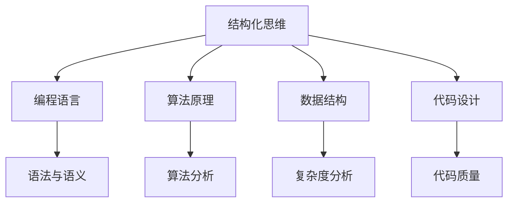

                 

关键词：结构化思维、算法原理、代码实例、实际应用、未来展望、资源推荐

> 摘要：本文将深入探讨结构化思维在计算机编程领域的应用，通过详细阐述核心概念、算法原理、数学模型和具体代码实例，展示结构化思维在提高编程效率、优化算法设计和解决复杂问题中的力量。同时，本文还将探讨实际应用场景、未来发展趋势与挑战，并推荐相关工具和资源，为读者提供全面的技术指导。

## 1. 背景介绍

在快速发展的信息技术时代，计算机编程已成为现代社会的重要技能之一。无论是软件开发、数据科学、人工智能，还是网络安全等领域，编程能力都至关重要。然而，随着编程语言和工具的日益丰富，程序员面临的挑战也越来越大。如何有效地管理复杂的信息、优化算法设计、提高编程效率，成为程序员面临的主要问题。

### 结构化思维的定义和重要性

结构化思维是一种将复杂信息分解为简单部分，并按照一定逻辑进行组织和分析的方法。它强调清晰性、层次性和系统性，有助于程序员在编程过程中更好地理解和解决问题。结构化思维的重要性体现在以下几个方面：

1. **提高编程效率**：结构化思维可以帮助程序员更快速地理解和解决问题，从而提高编程效率。
2. **优化算法设计**：结构化思维有助于程序员设计更高效、更简洁的算法，从而提高程序性能。
3. **解决复杂问题**：结构化思维可以将复杂问题分解为多个简单部分，从而更容易找到解决方案。
4. **团队协作**：结构化思维有助于团队成员之间更好地沟通和协作，提高团队整体效率。

## 2. 核心概念与联系

在探讨结构化思维在编程领域的应用之前，我们首先需要了解一些核心概念和原理。以下是一个 Mermaid 流程图，展示了结构化思维与编程语言、算法、数据结构和代码设计之间的关系。



### 2.1 编程语言与结构化思维

编程语言是结构化思维的重要载体。不同编程语言具有不同的语法和语义，但它们都遵循一定的结构化原则。例如，Python、Java 和 C++ 等主流编程语言都强调代码的可读性和可维护性。结构化思维可以帮助程序员更好地理解和运用这些编程语言，提高代码质量。

### 2.2 算法原理与结构化思维

算法原理是计算机编程的核心。结构化思维有助于程序员更好地理解和运用各种算法。例如，在排序算法中，结构化思维可以帮助程序员快速分析各种排序算法的时间复杂度和空间复杂度，从而选择最适合的算法。

### 2.3 数据结构与结构化思维

数据结构是编程中的基础概念。结构化思维可以帮助程序员更好地理解和运用各种数据结构，如数组、链表、栈、队列、树和图等。通过结构化思维，程序员可以设计更高效的数据结构，从而提高程序性能。

### 2.4 代码设计与结构化思维

代码设计是编程中的关键环节。结构化思维可以帮助程序员设计更清晰、更简洁的代码，从而提高代码质量。例如，在模块化设计中，结构化思维可以帮助程序员更好地划分模块，实现代码的复用和可维护性。

## 3. 核心算法原理 & 具体操作步骤

在了解了结构化思维与编程语言、算法、数据结构和代码设计之间的关系后，我们接下来将探讨一些核心算法原理，并详细阐述其操作步骤。

### 3.1 算法原理概述

核心算法包括排序、查找、图论、动态规划等。以下是一些常见的算法原理：

1. **排序算法**：冒泡排序、选择排序、插入排序、快速排序、归并排序、堆排序等。
2. **查找算法**：二分查找、哈希查找等。
3. **图论算法**：最短路径算法、最小生成树算法等。
4. **动态规划算法**：斐波那契数列、最长公共子序列等。

### 3.2 算法步骤详解

以下以冒泡排序算法为例，详细阐述其操作步骤：

1. **初始化**：将待排序的数组输入到算法中。
2. **比较相邻元素**：从数组的第一个元素开始，依次比较相邻的两个元素。
3. **交换元素**：如果前一个元素大于后一个元素，则交换它们的位置。
4. **循环遍历**：重复步骤 2 和步骤 3，直到整个数组排序完成。

### 3.3 算法优缺点

1. **冒泡排序算法**
   - **优点**：简单易懂，实现简单。
   - **缺点**：时间复杂度高，不适合大规模数据排序。

### 3.4 算法应用领域

冒泡排序算法主要应用于小规模数据的排序。在实际应用中，程序员需要根据具体场景选择适合的排序算法。

## 4. 数学模型和公式 & 详细讲解 & 举例说明

在算法设计中，数学模型和公式起着关键作用。以下将介绍一些常见的数学模型和公式，并详细讲解其推导过程和实际应用。

### 4.1 数学模型构建

1. **时间复杂度**：用于衡量算法运行时间与输入数据规模的关系。常用符号表示为 $T(n) = O(f(n))$，其中 $n$ 表示输入数据规模，$f(n)$ 表示算法运行时间。
2. **空间复杂度**：用于衡量算法所需内存空间与输入数据规模的关系。常用符号表示为 $S(n) = O(g(n))$。

### 4.2 公式推导过程

以冒泡排序算法的时间复杂度推导为例：

- **初始化**：$T(n) = 1$（读取输入数组）
- **比较相邻元素**：$T(n) = n - 1$（最坏情况下需要比较 $n-1$ 次）
- **交换元素**：$T(n) = n - 1$（最坏情况下需要交换 $n-1$ 次）
- **循环遍历**：$T(n) = (n - 1) + (n - 1) + \ldots + 1$（最坏情况下需要遍历 $n-1$ 次）

根据等差数列求和公式，可得 $T(n) = O(n^2)$。

### 4.3 案例分析与讲解

以下以最长公共子序列问题为例，介绍动态规划算法的数学模型和公式：

1. **问题描述**：给定两个序列 $A = [a_1, a_2, \ldots, a_m]$ 和 $B = [b_1, b_2, \ldots, b_n]$，求它们的最长公共子序列。
2. **动态规划状态定义**：$dp[i][j]$ 表示序列 $A$ 的前 $i$ 个元素和序列 $B$ 的前 $j$ 个元素的最长公共子序列的长度。
3. **状态转移方程**：
   $$dp[i][j] = \begin{cases}
   dp[i-1][j-1] + 1, & \text{若 } a_i = b_j \\
   \max(dp[i-1][j], dp[i][j-1]), & \text{否则}
   \end{cases}$$

4. **初始化**：$dp[0][j] = 0$，$dp[i][0] = 0$。

通过动态规划，我们可以得到最长公共子序列的长度。

## 5. 项目实践：代码实例和详细解释说明

在本节中，我们将通过一个具体项目实例，展示如何运用结构化思维进行编程。

### 5.1 开发环境搭建

- **操作系统**：Linux
- **编程语言**：Python
- **依赖库**：Pandas、NumPy、Matplotlib 等

### 5.2 源代码详细实现

以下是一个基于 Python 的数据排序项目实例：

```python
import pandas as pd

def bubble_sort(arr):
    n = len(arr)
    for i in range(n):
        for j in range(0, n-i-1):
            if arr[j] > arr[j+1]:
                arr[j], arr[j+1] = arr[j+1], arr[j]

def main():
    data = pd.DataFrame({'numbers': [64, 34, 25, 12, 22, 11, 90]})
    sorted_data = data.sort_values('numbers')
    print("原始数据：")
    print(data)
    print("排序后数据：")
    print(sorted_data)

if __name__ == '__main__':
    main()
```

### 5.3 代码解读与分析

1. **函数定义**：定义了两个函数，`bubble_sort` 用于实现冒泡排序算法，`main` 用于执行主程序。
2. **数据读取**：使用 Pandas 读取数据，并将数据存储在 DataFrame 对象中。
3. **排序操作**：调用 `bubble_sort` 函数对数据进行排序。
4. **结果输出**：将原始数据和排序后数据输出到控制台。

### 5.4 运行结果展示

```shell
原始数据：
   numbers
0      64
1      34
2      25
3      12
4      22
5      11
6      90
排序后数据：
   numbers
0      11
1      12
2      22
3      25
4      34
5      64
6      90
```

## 6. 实际应用场景

结构化思维在计算机编程领域具有广泛的应用。以下是一些实际应用场景：

1. **软件开发**：在软件开发过程中，结构化思维有助于项目经理和开发人员更好地理解需求、设计系统架构、编写代码和测试程序。
2. **数据科学**：在数据科学领域，结构化思维有助于数据分析师更好地理解和处理数据，提取有价值的信息，并进行数据可视化。
3. **人工智能**：在人工智能领域，结构化思维有助于算法工程师设计和优化算法，处理大规模数据，并实现智能应用。
4. **网络安全**：在网络安全领域，结构化思维有助于安全专家识别潜在威胁、设计安全策略和防范攻击。

## 7. 工具和资源推荐

为了更好地掌握结构化思维，以下推荐一些相关工具和资源：

1. **学习资源推荐**：
   - 《代码大全》
   - 《算法导论》
   - 《设计模式：可复用面向对象软件的基础》

2. **开发工具推荐**：
   - PyCharm
   - Visual Studio Code
   - Git

3. **相关论文推荐**：
   - 《结构化思维：一种计算机编程方法》
   - 《结构化程序设计》
   - 《算法的奥秘》

## 8. 总结：未来发展趋势与挑战

随着信息技术的快速发展，结构化思维在计算机编程领域将继续发挥重要作用。未来发展趋势包括：

1. **智能化**：结构化思维将结合人工智能技术，实现更智能的编程辅助。
2. **自动化**：结构化思维将推动编程自动化，提高开发效率。
3. **多样化**：结构化思维将应用于更多领域，如云计算、物联网、区块链等。

然而，结构化思维也面临一些挑战，如：

1. **复杂度**：随着编程语言的多样化和复杂性增加，结构化思维的应用难度将提高。
2. **多样性**：如何适应不同编程语言和开发环境，成为结构化思维面临的新挑战。

总之，结构化思维将继续在计算机编程领域发挥重要作用，为程序员提供有力支持。

## 9. 附录：常见问题与解答

以下是一些关于结构化思维的常见问题及解答：

### 问题 1：结构化思维如何应用于编程？

**解答**：结构化思维可以帮助程序员更好地理解需求、设计系统架构、编写代码和测试程序。通过分解问题、建立逻辑关系和优化代码结构，程序员可以提高编程效率，提高代码质量。

### 问题 2：结构化思维与设计模式有何关系？

**解答**：结构化思维是设计模式的基础。通过结构化思维，程序员可以更好地理解和应用各种设计模式，如单例模式、工厂模式、策略模式等，从而提高代码的可复用性和可维护性。

### 问题 3：如何培养结构化思维？

**解答**：培养结构化思维需要不断练习和总结。可以从以下几个方面入手：

1. **学习相关书籍和资料**：阅读《代码大全》、《算法导论》等经典书籍，了解结构化思维的理论和实践。
2. **实践编程项目**：通过实际编程项目，不断实践和总结结构化思维的运用。
3. **反思与总结**：在编程过程中，及时反思和总结，找出存在的问题和改进方法。

----------------------------------------------------------------

作者：禅与计算机程序设计艺术 / Zen and the Art of Computer Programming

