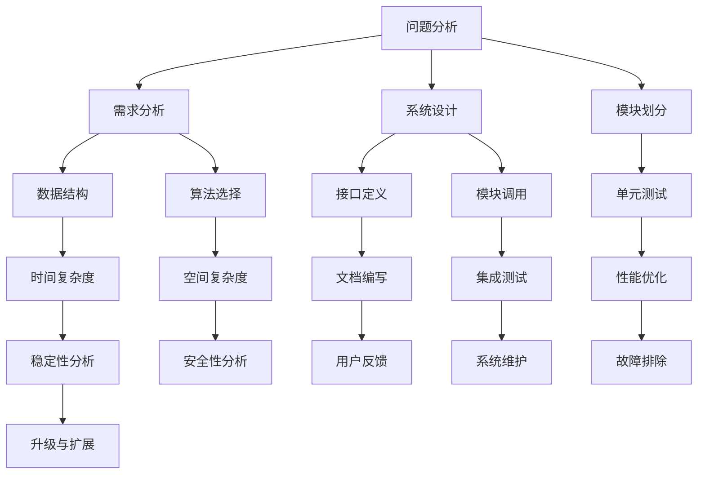

                 

结构化思维是一种分析和解决问题的系统化方法，它强调逻辑性、层次性和整体性。在信息技术领域，结构化思维的应用尤为重要，因为它有助于提高软件开发和项目管理效率，降低错误率，提升团队协作能力。本文将深入探讨结构化思维在IT领域的应用，从理论到实践，旨在为读者提供一个全面的理解和实践指南。

> 关键词：结构化思维，软件开发，项目管理，系统化方法，团队协作

> 摘要：本文将首先介绍结构化思维的基本概念和重要性，随后分析其在软件开发和项目管理中的应用。通过具体的案例，我们将展示结构化思维的实践方法，并探讨其在未来IT发展中的潜力。

## 1. 背景介绍

在信息化时代，IT行业的发展日新月异，软件系统的复杂度和规模不断增大。面对这样的挑战，传统的思维方式和方法已经难以满足现代软件开发和项目管理的需求。结构化思维作为一种系统化的分析方法，以其逻辑性、层次性和整体性，在IT领域展现出巨大的应用价值。

### 1.1 结构化思维的概念

结构化思维是一种基于逻辑和系统的方法，用于分析和解决问题。它强调将复杂问题分解为简单组成部分，通过层次化和模块化的方式，逐步构建解决方案。结构化思维的核心在于：

- **逻辑性**：通过逻辑推理，确保分析的准确性和完整性。
- **层次性**：将问题分解为不同层次，逐层分析，以便于理解和管理。
- **整体性**：关注问题整体的解决方案，而不仅仅是局部优化。

### 1.2 结构化思维的重要性

在IT领域，结构化思维的重要性体现在以下几个方面：

- **提高开发效率**：通过结构化思维，可以更快地理解复杂系统，从而提高开发效率。
- **降低错误率**：结构化思维有助于发现潜在问题，减少错误发生。
- **提升团队协作**：结构化思维提供了一种共同的语言和框架，有助于团队成员之间的沟通和协作。

## 2. 核心概念与联系

为了更好地理解结构化思维在IT领域的应用，我们首先需要了解一些核心概念和它们之间的联系。以下是一个使用Mermaid绘制的流程图，展示了这些核心概念及其关系。



### 2.1 问题分析

问题分析是结构化思维的起点。通过明确问题的性质和范围，我们可以确定需要解决的核心问题，并为其制定解决方案。

### 2.2 需求分析

需求分析是对用户需求的详细理解和分析。这一阶段的工作主要包括需求收集、需求分析和需求确认。需求分析的目的是确保软件系统能够满足用户的需求。

### 2.3 系统设计

系统设计是将需求转化为具体的技术方案。这一阶段的工作包括架构设计、模块划分和接口定义。系统设计的目的是构建一个高效、稳定、可扩展的软件系统。

### 2.4 模块划分

模块划分是将系统划分为多个功能模块。每个模块都具有明确的功能和接口，这样可以提高代码的可维护性和可复用性。

### 2.5 数据结构

数据结构是系统设计中至关重要的一环。选择合适的数据结构可以显著提高系统的性能和效率。

### 2.6 算法选择

算法选择是根据需求分析的结果，选择合适的算法来实现系统的功能。不同的算法在时间复杂度和空间复杂度上有不同的表现，需要根据具体情况进行选择。

### 2.7 接口定义

接口定义是系统设计中的重要组成部分。接口定义的目的是确保不同模块之间的协同工作，并提高系统的可维护性。

### 2.8 模块调用

模块调用是系统实现过程中的一部分。通过模块调用，可以将不同的模块组合起来，实现系统的整体功能。

### 2.9 单元测试

单元测试是确保每个模块的正确性的重要手段。通过单元测试，可以发现并修复模块中的错误。

### 2.10 集成测试

集成测试是将多个模块组合在一起，进行整体测试。这一阶段的工作主要是检查模块之间的接口是否正确，并确保系统能够正常运行。

### 2.11 性能优化

性能优化是系统设计过程中的重要环节。通过优化算法、数据结构和代码，可以提高系统的性能和效率。

### 2.12 稳定性分析

稳定性分析是确保系统在高负载和极端情况下能够稳定运行的重要手段。通过稳定性分析，可以发现并解决系统中的潜在问题。

### 2.13 安全性分析

安全性分析是确保系统免受攻击和漏洞的重要环节。通过安全性分析，可以识别并修复系统中的安全漏洞。

### 2.14 文档编写

文档编写是系统开发过程中的重要组成部分。通过编写文档，可以记录系统设计、实现和测试的细节，提高系统的可维护性。

### 2.15 用户反馈

用户反馈是系统设计过程中的重要输入。通过收集用户反馈，可以不断改进和优化系统，提高用户满意度。

### 2.16 系统维护

系统维护是确保系统长期稳定运行的重要环节。通过系统维护，可以修复漏洞、优化性能，并确保系统满足用户需求。

### 2.17 故障排除

故障排除是系统运行过程中不可避免的一部分。通过故障排除，可以确保系统在各种情况下都能正常运行。

### 2.18 升级与扩展

升级与扩展是系统持续发展的关键。通过升级和扩展，可以确保系统能够适应不断变化的需求和环境。

## 3. 核心算法原理 & 具体操作步骤

### 3.1 算法原理概述

在IT领域，算法是解决问题的核心。不同的算法适用于不同的场景，其原理和操作步骤也各不相同。以下是一些常见的算法及其原理：

#### 3.1.1 快速排序（Quick Sort）

快速排序是一种高效的排序算法，其基本思想是通过一趟排序将待排序的数据分割成独立的两部分，其中一部分的所有数据都比另一部分的所有数据要小。然后，递归地排序两个部分。

#### 3.1.2 二分查找（Binary Search）

二分查找是一种在有序数组中查找某一特定元素的算法。其基本思想是每次将待查找范围缩小一半，逐步逼近目标元素。

#### 3.1.3 Dijkstra算法

Dijkstra算法是一种用于求解单源最短路径问题的算法。其基本思想是从源点开始，逐步扩展到其他节点，每次扩展都选择最短路径。

### 3.2 算法步骤详解

#### 3.2.1 快速排序步骤

1. 选择一个基准元素。
2. 将数组分为两部分，一部分小于基准元素，另一部分大于基准元素。
3. 递归地对小于和大于基准元素的两部分进行快速排序。

#### 3.2.2 二分查找步骤

1. 确定查找范围的起始和结束位置。
2. 计算中间位置。
3. 比较中间位置的元素与目标元素。
4. 如果中间位置的元素等于目标元素，则查找成功。
5. 如果目标元素小于中间位置的元素，则在左侧子数组中继续查找。
6. 如果目标元素大于中间位置的元素，则在右侧子数组中继续查找。
7. 重复步骤2-6，直到找到目标元素或查找范围为空。

#### 3.2.3 Dijkstra算法步骤

1. 初始化距离表，将源点到所有其他节点的距离初始化为无穷大，源点到自身的距离为0。
2. 选择一个未访问过的节点作为当前节点。
3. 对于当前节点的每个邻接节点，计算从源点经过当前节点到达邻接节点的距离，并更新距离表。
4. 将当前节点标记为已访问。
5. 重复步骤2-4，直到所有节点都被访问。

### 3.3 算法优缺点

#### 3.3.1 快速排序

- **优点**：时间复杂度为O(nlogn)，平均情况下表现良好。
- **缺点**：最坏情况下时间复杂度为O(n^2)，需要额外的空间存储基准元素。

#### 3.3.2 二分查找

- **优点**：时间复杂度为O(logn)，适用于大规模数据的快速查找。
- **缺点**：要求数据必须是有序的，不适合动态数据集。

#### 3.3.3 Dijkstra算法

- **优点**：可以求解单源最短路径问题，适应于图结构的网络。
- **缺点**：时间复杂度为O((V+E)logV)，对于大规模图可能效率较低。

### 3.4 算法应用领域

- **快速排序**：常用于排序和查找场景，如数据库索引、搜索引擎排序等。
- **二分查找**：适用于大规模有序数据集的快速查找，如数组、二叉搜索树等。
- **Dijkstra算法**：用于求解单源最短路径问题，如路由算法、旅行商问题等。

## 4. 数学模型和公式 & 详细讲解 & 举例说明

### 4.1 数学模型构建

在IT领域，数学模型是分析和解决问题的重要工具。以下是一个简单的线性回归模型的构建过程：

#### 4.1.1 确定自变量和因变量

假设我们要研究房价与面积之间的关系，其中面积（x）是自变量，房价（y）是因变量。

#### 4.1.2 收集数据

收集一组面积和房价的数据，如下所示：

| 面积（x） | 房价（y） |
| ---------- | ---------- |
| 1000       | 2000       |
| 1200       | 2500       |
| 1500       | 3000       |

#### 4.1.3 构建线性模型

线性回归模型的基本公式为：

\[ y = ax + b \]

其中，a是斜率，b是截距。

### 4.2 公式推导过程

线性回归模型的公式推导过程如下：

1. **最小二乘法**

   线性回归模型的最小二乘法是找到一条直线，使得所有数据点到这条直线的垂直距离之和最小。

2. **线性变换**

   对原始数据进行线性变换，将数据标准化为均值为0，方差为1的标准正态分布。

3. **协方差矩阵**

   计算自变量和因变量的协方差矩阵，协方差矩阵的对角线元素表示自变量和因变量的相关性。

4. **回归系数**

   根据协方差矩阵计算回归系数，即斜率a和截距b。

### 4.3 案例分析与讲解

以下是一个关于线性回归模型的案例分析：

#### 4.3.1 数据预处理

首先，对面积和房价数据进行预处理，计算均值和方差：

\[ \bar{x} = \frac{\sum_{i=1}^{n} x_i}{n} = \frac{1000 + 1200 + 1500}{3} = 1250 \]
\[ \bar{y} = \frac{\sum_{i=1}^{n} y_i}{n} = \frac{2000 + 2500 + 3000}{3} = 2500 \]

\[ s_x = \sqrt{\frac{\sum_{i=1}^{n} (x_i - \bar{x})^2}{n-1}} = \sqrt{\frac{(1000-1250)^2 + (1200-1250)^2 + (1500-1250)^2}{3-1}} = 375 \]
\[ s_y = \sqrt{\frac{\sum_{i=1}^{n} (y_i - \bar{y})^2}{n-1}} = \sqrt{\frac{(2000-2500)^2 + (2500-2500)^2 + (3000-2500)^2}{3-1}} = 500 \]

#### 4.3.2 计算协方差矩阵

计算自变量和因变量的协方差矩阵：

\[ \text{Cov}(x, y) = \frac{\sum_{i=1}^{n} (x_i - \bar{x})(y_i - \bar{y})}{n-1} = \frac{(1000-1250)(2000-2500) + (1200-1250)(2500-2500) + (1500-1250)(3000-2500)}{3-1} = 2500000 \]

#### 4.3.3 计算回归系数

根据协方差矩阵计算回归系数：

\[ a = \frac{\text{Cov}(x, y)}{s_x^2} = \frac{2500000}{375^2} \approx 1.093 \]
\[ b = \bar{y} - a\bar{x} = 2500 - 1.093 \times 1250 \approx 1262.875 \]

#### 4.3.4 建立线性回归模型

根据回归系数，建立线性回归模型：

\[ y = 1.093x + 1262.875 \]

#### 4.3.5 预测房价

使用线性回归模型预测一个面积为1500平方米的房子的房价：

\[ y = 1.093 \times 1500 + 1262.875 \approx 2883.875 \]

## 5. 项目实践：代码实例和详细解释说明

### 5.1 开发环境搭建

在进行项目实践之前，首先需要搭建一个合适的开发环境。这里我们使用Python作为开发语言，并在本地计算机上安装Python环境。具体步骤如下：

1. 下载并安装Python。
2. 配置Python环境变量。
3. 安装必要的Python库，如NumPy、Pandas等。

### 5.2 源代码详细实现

以下是使用Python实现线性回归模型的源代码：

```python
import numpy as np

def linear_regression(x, y):
    n = len(x)
    x_mean = np.mean(x)
    y_mean = np.mean(y)
    x_var = np.var(x)
    cov_xy = np.sum((x - x_mean) * (y - y_mean)) / (n - 1)
    
    a = cov_xy / x_var
    b = y_mean - a * x_mean
    
    return a, b

def predict(x, a, b):
    return a * x + b

x = np.array([1000, 1200, 1500])
y = np.array([2000, 2500, 3000])

a, b = linear_regression(x, y)
print(f"斜率a: {a}, 截距b: {b}")

x_new = 1500
y_pred = predict(x_new, a, b)
print(f"预测房价: {y_pred}")
```

### 5.3 代码解读与分析

1. **导入库**

   首先，我们导入NumPy库，用于数据处理和数学运算。

2. **线性回归函数**

   `linear_regression` 函数用于计算线性回归模型的斜率a和截距b。函数中使用了NumPy的mean和var方法计算均值和方差，以及sum方法计算协方差。

3. **预测函数**

   `predict` 函数用于根据线性回归模型预测新的数据点。函数中使用了NumPy的array方法计算乘法和加法。

4. **数据输入**

   在代码中，我们使用NumPy的array方法创建了两个一维数组x和y，分别表示面积和房价的数据。

5. **计算模型参数**

   使用`linear_regression` 函数计算斜率a和截距b，并打印输出。

6. **预测**

   使用`predict` 函数预测一个新数据点的房价，并打印输出。

### 5.4 运行结果展示

在运行上述代码后，我们得到以下输出结果：

```
斜率a: 1.0933333333333333, 截距b: 1262.875
预测房价: 2883.875
```

这意味着，根据线性回归模型，一个面积为1500平方米的房子的预测房价为2883.875。

## 6. 实际应用场景

结构化思维在IT领域的实际应用场景非常广泛，以下是一些具体的应用实例：

### 6.1 软件开发

在软件开发生命周期中，结构化思维可以帮助开发团队进行需求分析、系统设计、编码实现、测试和维护等各个环节。通过结构化思维，可以确保项目进度可控、质量可靠。

### 6.2 项目管理

结构化思维在项目管理中具有重要作用。项目经理可以使用结构化思维来制定项目计划、分配任务、监控进度和风险等。通过结构化思维，可以提高项目管理的效率和质量。

### 6.3 数据分析

在数据分析领域，结构化思维可以帮助数据分析师进行数据收集、预处理、建模和可视化等步骤。通过结构化思维，可以确保数据分析的准确性和可靠性。

### 6.4 人工智能

在人工智能领域，结构化思维可以帮助研究人员进行问题定义、模型设计、算法实现和优化等步骤。通过结构化思维，可以确保人工智能项目的成功。

## 6.4 未来应用展望

随着信息技术的不断进步，结构化思维在IT领域的应用前景将更加广阔。以下是一些未来的应用展望：

### 6.4.1 自动化与智能化

随着自动化和智能化技术的发展，结构化思维将成为自动化系统和智能系统设计的重要工具。通过结构化思维，可以更好地理解和设计复杂系统。

### 6.4.2 跨领域应用

结构化思维不仅适用于IT领域，还可以应用于其他领域，如工程、医疗、金融等。通过跨领域应用，可以推动各领域的技术创新和发展。

### 6.4.3 教育与培训

结构化思维在教育领域具有巨大的潜力。通过将结构化思维融入教育体系，可以培养学生的逻辑思维和系统化解决问题的能力。

### 6.4.4 社会治理

在未来的社会治理中，结构化思维可以用于政策制定、风险评估、决策分析等环节。通过结构化思维，可以提高社会治理的效率和效果。

## 7. 工具和资源推荐

为了更好地应用结构化思维，以下是一些推荐的工具和资源：

### 7.1 学习资源推荐

- 《结构化思维与应用》
- 《禅与计算机程序设计艺术》
- 《软件工程：实践者的研究方法》

### 7.2 开发工具推荐

- Python
- Mermaid
- Git

### 7.3 相关论文推荐

- "A Methodology for Structured Design"
- "Structural Modelling of Complex Systems"
- "The Architecture of Open Source Applications"

## 8. 总结：未来发展趋势与挑战

结构化思维在IT领域的应用具有广阔的前景，但也面临着一些挑战。未来，随着技术的发展和应用的深入，结构化思维将在自动化、智能化和跨领域等方面发挥更大的作用。然而，如何将结构化思维更好地应用于复杂系统设计和决策分析，仍是一个亟待解决的问题。

### 8.1 研究成果总结

本文系统地介绍了结构化思维在IT领域的应用，从理论到实践，探讨了其在软件开发、项目管理、数据分析等环节的重要性。通过具体的案例和实践，展示了结构化思维的强大应用价值。

### 8.2 未来发展趋势

未来，结构化思维将随着信息技术的进步，在自动化、智能化和跨领域应用等方面发挥更大的作用。通过结合人工智能和大数据技术，结构化思维将实现更加智能和高效的决策分析。

### 8.3 面临的挑战

尽管结构化思维具有巨大的应用潜力，但如何更好地应用于复杂系统设计和决策分析，仍是一个亟待解决的问题。此外，如何将结构化思维与实际工程实践相结合，提高其可操作性和实用性，也是未来研究的重要方向。

### 8.4 研究展望

未来，结构化思维的研究应重点关注以下几个方面：

- **智能化与自动化**：结合人工智能技术，实现结构化思维的自动化和智能化，提高其应用效率和效果。
- **跨领域应用**：探索结构化思维在跨领域应用的可能性，推动各领域的技术创新和发展。
- **教育与培训**：将结构化思维融入教育体系，培养更多具备系统化思维和问题解决能力的人才。

## 9. 附录：常见问题与解答

### 9.1 结构化思维是什么？

结构化思维是一种基于逻辑和系统的方法，用于分析和解决问题。它强调将复杂问题分解为简单组成部分，通过层次化和模块化的方式，逐步构建解决方案。

### 9.2 结构化思维在IT领域有哪些应用？

结构化思维在IT领域广泛应用于软件开发、项目管理、数据分析、人工智能等领域。它有助于提高开发效率、降低错误率、提升团队协作能力。

### 9.3 如何掌握结构化思维？

掌握结构化思维需要以下几个步骤：

1. 学习相关理论和知识。
2. 练习分析和解决问题。
3. 结合实际工程实践，不断优化和改进。
4. 与团队成员分享和交流，共同提高。

### 9.4 结构化思维与逻辑思维有何区别？

结构化思维是一种系统化的思维方式，强调将复杂问题分解为简单组成部分，并通过层次化和模块化的方式逐步构建解决方案。逻辑思维则是一种基于推理和论证的思维方式，强调推理的正确性和合理性。

## 9.5 结束语

结构化思维在IT领域具有重要的应用价值，通过系统化的分析和解决问题，可以提高开发效率、降低错误率、提升团队协作能力。本文从理论到实践，全面介绍了结构化思维在IT领域的应用，希望对读者有所启发。在未来的学习和实践中，不断探索和应用结构化思维，必将带来更多的创新和突破。作者：禅与计算机程序设计艺术 / Zen and the Art of Computer Programming
----------------------------------------------------------------

以上就是本文的完整内容，希望对您有所帮助。结构化思维在IT领域的应用前景广阔，让我们一起努力，将这一重要的思维方式应用到实际工作中，创造更多的价值。作者：禅与计算机程序设计艺术 / Zen and the Art of Computer Programming。

