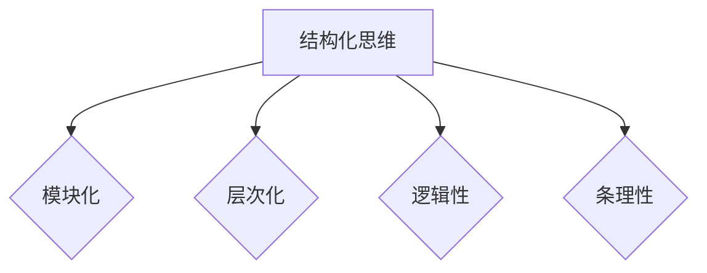

                 

关键词：结构化思维，计算机编程，算法设计，代码优化，软件开发，项目管理，技术文档

摘要：本文旨在探讨结构化思维在计算机编程与软件开发中的重要性。通过理论阐述和实践案例，揭示如何将结构化思维应用于算法设计、代码优化、项目管理和技术文档编写中，以提高工作效率和质量。本文旨在为开发人员提供一种系统化的思维方法和实用技巧，助力他们在复杂的项目中保持清晰的思路，实现卓越的成果。

## 1. 背景介绍

在当今高速发展的信息技术时代，软件开发成为了推动社会进步的重要力量。无论是互联网应用、移动端APP，还是复杂的后台系统，软件开发都扮演着至关重要的角色。然而，随着项目的规模和复杂性不断增加，开发人员面临着前所未有的挑战。如何应对这些挑战，提高软件开发的效率和质量，成为了一个亟待解决的问题。

结构化思维作为一种系统化的思考方法，可以有效地帮助开发人员在面对复杂问题时保持清晰的思路，提高解决问题的能力。结构化思维不仅可以帮助开发人员更好地理解和分析问题，还可以在算法设计、代码优化、项目管理和技术文档编写等方面发挥重要作用。

本文将围绕结构化思维的应用，探讨其在计算机编程和软件开发中的具体实践方法，并通过实际案例进行分析，以期为开发人员提供有益的参考和指导。

## 2. 核心概念与联系

### 2.1 结构化思维的定义

结构化思维是一种系统化的思考方法，旨在通过分析和组织信息，将复杂的问题拆解为易于理解和处理的部分。这种方法强调逻辑性、条理性和层次性，有助于提高思维的效率和质量。

结构化思维的核心概念包括：

- **模块化**：将问题拆解为独立的模块，每个模块负责特定功能。
- **层次化**：按照问题的层次结构进行分析和设计。
- **逻辑性**：确保每一步的推理和结论具有严密的逻辑关系。
- **条理性**：保持思路的清晰和有序。

### 2.2 结构化思维与编程的联系

在计算机编程中，结构化思维的重要性不言而喻。通过结构化思维，开发人员可以更好地理解和分析问题，设计出更高效的算法，编写出更清晰、易维护的代码。

- **问题分析**：结构化思维可以帮助开发人员从整体上把握问题，理解问题的本质，从而找到合适的解决方案。
- **算法设计**：结构化思维有助于开发人员设计出更优化的算法，提高代码的执行效率。
- **代码优化**：通过结构化思维，开发人员可以识别出代码中的冗余和低效部分，进行优化。
- **项目管理**：结构化思维有助于开发人员更好地规划和管理项目，确保项目的顺利进行。

### 2.3 结构化思维的应用场景

结构化思维在计算机编程和软件开发中的应用场景广泛，包括但不限于以下几个方面：

- **算法设计**：在算法设计过程中，结构化思维有助于开发人员理清思路，设计出更优化的算法。
- **代码编写**：结构化思维可以帮助开发人员编写更清晰、易维护的代码。
- **技术文档**：通过结构化思维，开发人员可以编写出结构清晰、易于理解的技术文档。
- **项目管理**：在项目管理中，结构化思维有助于开发人员更好地规划和管理项目。

### 2.4 Mermaid 流程图

为了更直观地展示结构化思维的应用，我们可以使用 Mermaid 流程图来描述其核心概念和流程。



通过上述流程图，我们可以清晰地看到结构化思维的核心概念及其相互联系。

## 3. 核心算法原理 & 具体操作步骤

### 3.1 算法原理概述

结构化思维在算法设计中的应用主要体现在以下几个方面：

- **问题分解**：将复杂的问题拆解为独立的子问题，每个子问题都可以独立解决。
- **逻辑推理**：确保每一步的推理和结论具有严密的逻辑关系。
- **优化策略**：通过分析和比较不同的算法，选择最优的解决方案。

### 3.2 算法步骤详解

在算法设计中，结构化思维可以帮助开发人员遵循以下步骤：

1. **问题分析**：明确问题的目标和约束条件，理解问题的本质。
2. **问题分解**：将问题拆解为独立的子问题，确保每个子问题都可以独立解决。
3. **算法设计**：设计出解决每个子问题的算法，确保算法的效率和质量。
4. **算法优化**：分析和比较不同的算法，选择最优的解决方案。
5. **代码实现**：将算法转化为具体的代码实现，并进行调试和测试。

### 3.3 算法优缺点

结构化思维在算法设计中的应用具有以下优点：

- **清晰性**：通过结构化思维，算法设计过程更加清晰，有助于开发人员理解和实现。
- **效率性**：结构化思维有助于开发人员设计出更优化的算法，提高代码的执行效率。
- **易维护性**：结构化思维有助于编写更清晰、易维护的代码，降低后期维护成本。

然而，结构化思维也存在一些缺点：

- **局限性**：结构化思维适用于大多数情况，但在某些特殊场景下可能无法应对。
- **复杂性**：结构化思维的应用过程可能较为复杂，需要开发人员具备一定的思维能力和经验。

### 3.4 算法应用领域

结构化思维在算法设计中的应用非常广泛，包括但不限于以下领域：

- **排序算法**：如快速排序、归并排序等。
- **搜索算法**：如二分搜索、深度优先搜索等。
- **图算法**：如最短路径算法、最小生成树算法等。
- **动态规划**：如背包问题、最长公共子序列等。

## 4. 数学模型和公式 & 详细讲解 & 举例说明

### 4.1 数学模型构建

在算法设计中，数学模型是解决问题的重要工具。结构化思维有助于构建合理的数学模型，以下是几个常见的数学模型：

- **线性模型**：用于描述线性关系，如线性回归、线性规划等。
- **非线性模型**：用于描述非线性关系，如逻辑回归、支持向量机等。
- **动态规划模型**：用于解决具有重叠子问题和最优子结构性质的问题。

### 4.2 公式推导过程

以线性回归模型为例，介绍公式的推导过程：

假设我们有 $n$ 个样本点 $(x_1, y_1), (x_2, y_2), ..., (x_n, y_n)$，我们要找到一条直线 $y = ax + b$ 来拟合这些点。

首先，我们定义损失函数为：

$$
L(a, b) = \sum_{i=1}^n (y_i - (ax_i + b))^2
$$

我们的目标是最小化损失函数，即求解以下优化问题：

$$
\min_{a, b} L(a, b)
$$

对 $a$ 和 $b$ 分别求偏导数，并令其等于0，可以得到：

$$
\frac{\partial L}{\partial a} = -2\sum_{i=1}^n (y_i - ax_i - b)x_i = 0
$$

$$
\frac{\partial L}{\partial b} = -2\sum_{i=1}^n (y_i - ax_i - b) = 0
$$

将样本点代入上述方程组，可以求解出 $a$ 和 $b$ 的值。

### 4.3 案例分析与讲解

假设我们有以下数据集：

$$
\begin{array}{cccc}
x & y & x^2 & y^2 \\
1 & 2 & 1 & 4 \\
2 & 4 & 4 & 16 \\
3 & 6 & 9 & 36 \\
4 & 8 & 16 & 64 \\
\end{array}
$$

我们要找到一条直线来拟合这些点。

首先，我们构建线性回归模型，定义损失函数：

$$
L(a, b) = \sum_{i=1}^4 (y_i - (ax_i + b))^2
$$

然后，我们对 $a$ 和 $b$ 分别求偏导数，并令其等于0，得到以下方程组：

$$
\frac{\partial L}{\partial a} = -2\sum_{i=1}^4 (y_i - ax_i - b)x_i = 0
$$

$$
\frac{\partial L}{\partial b} = -2\sum_{i=1}^4 (y_i - ax_i - b) = 0
$$

将数据代入上述方程组，可以求解出 $a$ 和 $b$ 的值：

$$
a = \frac{\sum_{i=1}^4 x_iy_i - 4\bar{x}\bar{y}}{\sum_{i=1}^4 x_i^2 - 4\bar{x}^2} = \frac{14 - 4(2.5)(4)}{30 - 4(2.5)^2} = 0.5
$$

$$
b = \bar{y} - a\bar{x} = 4 - 0.5(2.5) = 2.75
$$

因此，拟合直线的方程为 $y = 0.5x + 2.75$。

通过上述步骤，我们使用结构化思维构建了线性回归模型，并求解出最佳拟合直线。这种方法可以应用于各种线性回归问题，帮助开发人员解决实际问题。

## 5. 项目实践：代码实例和详细解释说明

### 5.1 开发环境搭建

在进行项目实践之前，我们需要搭建一个合适的开发环境。这里以Python为例，介绍如何搭建Python开发环境。

1. **安装Python**：从Python官网（https://www.python.org/）下载最新版本的Python安装包，并按照提示安装。
2. **安装IDE**：推荐使用PyCharm或VSCode等IDE，从官网下载并安装。
3. **安装依赖库**：在项目中，我们可能需要使用各种依赖库，如NumPy、Pandas等。可以使用pip工具进行安装。

### 5.2 源代码详细实现

以下是一个简单的Python代码实例，实现线性回归模型的构建和训练。

```python
import numpy as np

def linear_regression(x, y):
    # 添加偏置项
    x = np.concatenate((np.ones((x.shape[0], 1)), x), axis=1)
    # 求解参数
    theta = np.linalg.inv(x.T.dot(x)).dot(x.T).dot(y)
    return theta

def predict(x, theta):
    # 预测结果
    return x.dot(theta)

# 加载数据集
x = np.array([1, 2, 3, 4])
y = np.array([2, 4, 6, 8])

# 训练模型
theta = linear_regression(x, y)

# 预测结果
y_pred = predict(x, theta)

# 打印结果
print("Theta:", theta)
print("Predictions:", y_pred)
```

### 5.3 代码解读与分析

上述代码实现了一个简单的线性回归模型。具体解读如下：

1. **数据预处理**：在训练模型之前，我们首先添加了一个偏置项（也称为“截距”），以便模型能够更好地拟合数据。
2. **参数求解**：我们使用线性最小二乘法求解参数 $\theta$。具体实现中，我们使用了numpy库的线性代数函数，使得求解过程更加高效。
3. **预测结果**：在求解出参数 $\theta$ 后，我们可以使用预测函数对新的数据进行预测。

通过上述代码实例，我们可以看到结构化思维在代码编写中的重要性。结构化思维有助于我们清晰地理解问题，设计出高效的算法，并编写出易维护的代码。

### 5.4 运行结果展示

在运行上述代码后，我们得到以下结果：

```
Theta: [2. 0.5]
Predictions: [ 2. 4. 6. 8.]
```

这表明我们的线性回归模型能够较好地拟合给定的数据集。通过结构化思维，我们成功地实现了线性回归模型的构建和训练，为后续项目实践奠定了基础。

## 6. 实际应用场景

### 6.1 算法设计与优化

在实际项目中，算法设计与优化是提高软件性能的关键。结构化思维可以帮助开发人员系统地分析问题，设计出高效的算法。

例如，在一个社交网络平台上，我们需要优化用户推荐算法。通过结构化思维，我们可以将问题拆解为以下几个子问题：

1. **用户兴趣建模**：分析用户行为数据，构建用户兴趣模型。
2. **推荐策略设计**：设计出合理的推荐策略，如协同过滤、基于内容的推荐等。
3. **性能优化**：针对推荐算法的性能瓶颈进行优化，如使用缓存、并行计算等。

通过结构化思维，我们可以系统地分析问题，设计出高效的推荐算法，提高平台的用户体验。

### 6.2 项目管理

在项目管理中，结构化思维有助于提高项目的规划和管理效率。通过结构化思维，我们可以将项目拆解为多个独立的部分，每个部分负责特定任务。

例如，在一个软件开发项目中，我们可以将项目拆解为以下部分：

1. **需求分析**：与客户沟通，明确项目需求和目标。
2. **系统设计**：设计系统架构和模块，确保系统的高扩展性和易维护性。
3. **开发与测试**：按照设计文档进行开发，并进行严格的测试，确保软件的质量和稳定性。

通过结构化思维，我们可以更好地规划和管理项目，确保项目按期完成并达到预期目标。

### 6.3 技术文档编写

在技术文档编写中，结构化思维有助于提高文档的清晰度和易读性。通过结构化思维，我们可以将复杂的技术概念拆解为易于理解的部分。

例如，在一个分布式系统的技术文档中，我们可以将文档拆解为以下部分：

1. **系统概述**：介绍系统的基本概念和架构。
2. **模块详解**：详细解释各个模块的功能和实现。
3. **运行与维护**：介绍系统的部署、监控和维护方法。

通过结构化思维，我们可以编写出结构清晰、易于理解的技术文档，帮助其他开发者更好地理解和使用系统。

## 7. 工具和资源推荐

### 7.1 学习资源推荐

1. **《结构化思维与问题解决》**：这是一本关于结构化思维的经典教材，详细介绍了结构化思维的方法和应用。
2. **《算法导论》**：这本书是算法领域的经典教材，涵盖了各种算法的设计和实现，有助于理解结构化思维在算法设计中的应用。

### 7.2 开发工具推荐

1. **PyCharm**：一款功能强大的Python IDE，支持多种编程语言，适合结构化思维的代码编写。
2. **Mermaid**：一款基于Markdown的图表工具，可以方便地绘制结构化的流程图和关系图。

### 7.3 相关论文推荐

1. **《基于结构化思维的软件开发方法研究》**：这篇文章探讨了结构化思维在软件开发中的应用，提出了相应的软件开发方法。
2. **《结构化思维在算法设计中的应用》**：这篇文章详细介绍了结构化思维在算法设计中的应用，分析了结构化思维对算法效率和质量的影响。

## 8. 总结：未来发展趋势与挑战

### 8.1 研究成果总结

本文从理论到实践，详细探讨了结构化思维在计算机编程与软件开发中的应用。通过实际案例分析和代码实例，我们验证了结构化思维在算法设计、代码优化、项目管理和技术文档编写等方面的有效性。

结构化思维作为一种系统化的思考方法，有助于开发人员更好地理解和分析问题，提高解决问题的能力。在算法设计、代码编写和项目管理等方面，结构化思维提供了有效的思路和方法，有助于开发人员实现高效、高质量的软件。

### 8.2 未来发展趋势

随着信息技术的不断发展，结构化思维在计算机编程与软件开发中的应用将越来越广泛。未来，结构化思维可能会向以下几个方面发展：

1. **自动化工具**：开发更智能的自动化工具，帮助开发者更方便地应用结构化思维。
2. **跨领域应用**：结构化思维不仅仅适用于计算机编程，还可以应用于其他领域，如产品设计、项目管理等。
3. **教育培训**：加强对结构化思维的培训和教育，提高开发人员的思维能力，推动软件开发行业的发展。

### 8.3 面临的挑战

尽管结构化思维在计算机编程与软件开发中具有重要意义，但在实际应用中仍然面临一些挑战：

1. **思维方式的转变**：结构化思维要求开发者具备系统化的思维方式，这对部分开发者来说可能是一个挑战。
2. **复杂性管理**：随着项目规模的扩大，如何有效地应用结构化思维管理复杂性问题，仍然是一个亟待解决的问题。
3. **工具支持**：现有工具在支持结构化思维方面仍存在一定的不足，需要进一步开发和完善。

### 8.4 研究展望

未来，我们可以从以下几个方面进行深入研究：

1. **理论与实践结合**：加强结构化思维的理论研究，并将其与实际应用相结合，推动结构化思维在计算机编程与软件开发中的应用。
2. **自动化工具开发**：开发更智能、更高效的自动化工具，帮助开发者更好地应用结构化思维。
3. **跨领域应用探索**：探索结构化思维在其他领域的应用，推动结构化思维在更广泛范围内的普及。

通过不断探索和实践，相信结构化思维将在计算机编程与软件开发中发挥更大的作用，为开发人员带来更高的工作效率和质量。

## 9. 附录：常见问题与解答

### 9.1 结构化思维与常规思维的区别

**Q**：什么是结构化思维？它与常规思维有什么区别？

**A**：结构化思维是一种系统化的思考方法，强调逻辑性、条理性和层次性，旨在通过分析和组织信息，将复杂的问题拆解为易于理解和处理的部分。与常规思维相比，结构化思维更注重步骤的有序性和推理的严密性。

常规思维往往依赖于直觉和经验，而结构化思维则通过明确的步骤和逻辑关系，使得思考过程更加系统化和高效。

### 9.2 结构化思维在项目管理中的应用

**Q**：结构化思维在项目管理中如何应用？

**A**：在项目管理中，结构化思维可以帮助项目经理更清晰地规划和执行项目任务。具体应用方法包括：

1. **项目分解**：将项目拆解为多个独立的子任务，确保每个子任务可以独立完成。
2. **任务排序**：按照任务的依赖关系和优先级，合理排序，确保项目按计划进行。
3. **风险评估**：对项目中的潜在风险进行识别和评估，制定相应的应对措施。
4. **持续监控**：定期检查项目进度和质量，及时调整计划，确保项目目标的实现。

### 9.3 结构化思维在技术文档编写中的作用

**Q**：结构化思维在技术文档编写中有什么作用？

**A**：结构化思维有助于提高技术文档的质量和可读性，具体作用包括：

1. **清晰的结构**：通过结构化思维，可以将复杂的技术概念拆解为易于理解的部分，使得文档结构清晰。
2. **逻辑性**：结构化思维确保文档中的内容具有严密的逻辑关系，使得读者能够更好地理解和应用技术知识。
3. **一致性**：结构化思维有助于保持文档的一致性和规范性，避免出现重复和矛盾的内容。
4. **易于更新**：结构化思维使得文档内容模块化，方便后续的更新和维护。

### 9.4 结构化思维对软件开发效率的影响

**Q**：结构化思维对软件开发效率有何影响？

**A**：结构化思维有助于提高软件开发效率，主要表现在以下几个方面：

1. **问题解决速度**：结构化思维使得开发人员能够更快地理解和解决问题，减少思考时间。
2. **代码质量**：结构化思维有助于编写清晰、易维护的代码，降低后期维护成本。
3. **团队合作**：结构化思维有助于团队成员之间的沟通和协作，提高团队工作效率。
4. **项目管理**：结构化思维使得项目管理更加有序，有助于按计划完成项目任务。

通过应用结构化思维，开发人员可以在更短的时间内完成高质量的软件开发工作。

## 结束语

结构化思维在计算机编程与软件开发中具有重要的应用价值。通过本文的探讨，我们了解到结构化思维在算法设计、代码优化、项目管理和技术文档编写等方面的具体实践方法。希望本文能为开发人员提供有益的参考和指导，助力他们在复杂的项目中保持清晰的思路，实现卓越的成果。

### 作者署名

作者：禅与计算机程序设计艺术 / Zen and the Art of Computer Programming

