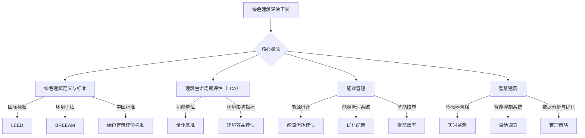

                 

关键词：绿色建筑，可持续建筑，评估工具，创新标准，建筑能源效率，环境评估，建筑生命周期评估，BIM技术，建筑信息模型，能效管理，碳排放减少，智慧建筑，绿色建筑标准，可持续发展战略

> 摘要：本文旨在探讨绿色建筑评估工具在可持续建筑领域的创新应用。通过分析当前绿色建筑评估工具的发展现状，本文将介绍一系列关键概念，算法原理，数学模型，以及具体的项目实践。此外，文章还将探讨绿色建筑评估工具在实际应用场景中的潜力，并展望其未来的发展趋势与挑战。

## 1. 背景介绍

随着全球气候变化和环境问题的日益严重，建筑行业作为能源消耗和碳排放的主要来源之一，面临着巨大的可持续性挑战。绿色建筑的概念应运而生，旨在通过设计、建造、运营和维护过程来实现建筑与环境的和谐共生。绿色建筑不仅关注建筑本身的节能性能，还涉及建筑材料的环保性、室内环境质量、碳排放减少等方面。

绿色建筑评估工具作为衡量建筑可持续性能的重要手段，起到了关键作用。这些工具能够提供量化的评估结果，帮助建筑师、开发商、政策制定者等各方识别建筑中的潜在问题，优化设计，提高能源效率，减少环境负担。近年来，随着信息技术的快速发展，绿色建筑评估工具也在不断创新，融入了大数据、人工智能、物联网等先进技术，使得评估过程更加高效和准确。

## 2. 核心概念与联系

### 2.1 绿色建筑定义与标准

绿色建筑的定义因地区和标准的差异而有所不同，但普遍认同的标准包括以下几个方面：

- **节能与能源效率**：采用高效能源系统，优化能源利用，减少能源消耗。
- **环保材料**：选用环保材料，减少有害物质的排放和资源的消耗。
- **室内环境质量**：提供健康、舒适的室内环境，包括空气质量、采光和通风等。
- **水资源管理**：有效利用和回收水资源，减少水资源的消耗。
- **碳排放减少**：通过设计和技术手段减少建筑全生命周期的碳排放。

国际权威的绿色建筑评估标准包括美国绿色建筑认证（LEED）、英国建筑研究协会的环境评估方法（BREEAM）和中国的绿色建筑评价标准等。

### 2.2 建筑生命周期评估（LCA）

建筑生命周期评估是一种全面的环境评估方法，它分析建筑从原材料提取、生产、运输、建造、使用到拆除和废物处理的整个生命周期中的环境影响。LCA的主要目的是通过评估不同建筑方案的环境效益，为决策者提供科学依据，以实现环境可持续性。

LCA的核心概念包括：

- **功能单位**：用于量化建筑功能性能的基准单位，如平方米、千瓦时等。
- **环境影响指标**：用于衡量建筑生命周期中各种环境影响的指标，如碳足迹、能源消耗、水资源消耗等。

### 2.3 能效管理

能效管理是绿色建筑的核心组成部分，旨在通过优化能源系统和建筑运营管理，提高能源利用效率。能效管理的方法包括：

- **能源审计**：评估建筑的能源消耗情况，识别节能潜力。
- **能源管理系统**：实时监测和控制建筑能源使用，优化能源配置。
- **能源效率提升措施**：如改进建筑保温、采用高效照明系统、使用可再生能源等。

### 2.4 智慧建筑

智慧建筑利用物联网、云计算、大数据等技术，实现建筑系统的智能化，从而提高建筑的管理效率、能源利用效率和用户体验。智慧建筑的关键组成部分包括：

- **传感器网络**：实时监测建筑内的各种参数，如温度、湿度、光照等。
- **智能控制系统**：通过分析数据，自动调整建筑环境参数，实现节能和舒适。
- **数据分析与优化**：利用大数据分析，优化建筑运营和管理策略。

### 2.5 Mermaid 流程图



### 3. 核心算法原理 & 具体操作步骤

#### 3.1 算法原理概述

绿色建筑评估工具的核心算法原理主要包括能效评估模型和环境评估模型。能效评估模型通过模拟建筑能源系统的运行，评估建筑的能源消耗和能源效率；环境评估模型则基于建筑生命周期评估（LCA）的方法，计算建筑在整个生命周期中的环境影响。

#### 3.2 算法步骤详解

1. **数据收集与预处理**：收集建筑的设计文件、能源消耗数据、环境参数数据等，并进行预处理，包括数据清洗、归一化处理等。

2. **能效评估**：
   - **能量平衡分析**：根据建筑物的热负荷和能源使用情况，建立能量平衡模型，计算建筑的能源需求。
   - **能源效率评估**：通过比较实际能源消耗与理论最优能耗，评估建筑的能源效率。

3. **环境评估**：
   - **生命周期评估**：根据建筑的设计、施工、运营和拆除阶段，计算建筑全生命周期的环境影响，包括碳排放、能源消耗、水资源消耗等。
   - **环境影响因子评估**：基于环境评估模型，分析不同建筑材料和能源使用方式的环境影响，确定关键影响因素。

4. **综合评估与优化**：将能效评估和环境评估的结果进行综合，评估建筑的绿色性能，并提出优化建议。

#### 3.3 算法优缺点

**优点**：
- **全面性**：综合考虑建筑的能源效率和环境影响，提供全面的评估结果。
- **科学性**：基于数据分析和模型模拟，确保评估结果的科学性和准确性。
- **可操作性**：提供具体的优化建议，帮助决策者优化设计和管理。

**缺点**：
- **复杂性**：涉及多种模型和算法，需要专业的技术支持。
- **数据依赖性**：评估结果的准确性依赖于数据的完整性和准确性。

#### 3.4 算法应用领域

绿色建筑评估工具广泛应用于以下几个方面：
- **建筑设计**：在建筑设计阶段，通过评估不同设计方案的环境影响，优化设计方案。
- **建筑运营**：在建筑运营阶段，通过实时监测和优化能源使用，提高能源效率。
- **政策制定**：为政策制定者提供科学依据，制定绿色建筑政策和标准。
- **环境影响评价**：在项目审批和环境影响评价阶段，评估项目的环境影响，确保项目符合绿色建筑标准。

### 4. 数学模型和公式 & 详细讲解 & 举例说明

#### 4.1 数学模型构建

绿色建筑评估工具涉及多个数学模型，包括能量平衡模型、能源效率模型和环境评估模型。

1. **能量平衡模型**：

$$
E_{需求} = Q_{传热} + Q_{照明} + Q_{设备} + Q_{人体}
$$

其中，$E_{需求}$为建筑能源需求，$Q_{传热}$、$Q_{照明}$、$Q_{设备}$和$Q_{人体}$分别为传热、照明、设备和人体的能源消耗。

2. **能源效率模型**：

$$
\eta = \frac{E_{有用}}{E_{总}}
$$

其中，$\eta$为能源效率，$E_{有用}$为实际有用能量，$E_{总}$为总能源消耗。

3. **环境评估模型**：

$$
E_{环境影响} = f(CO_2, 能源消耗, 水资源消耗)
$$

其中，$E_{环境影响}$为环境影响，$CO_2$为碳排放，能源消耗和水资源消耗为环境影响因子。

#### 4.2 公式推导过程

1. **能量平衡模型推导**：

建筑物的能源需求可以分解为传热、照明、设备和人体的能源消耗。根据热力学第一定律，能量守恒，建筑物的能源需求等于各个部分能源消耗的总和。

2. **能源效率模型推导**：

能源效率定义为实际有用能量与总能源消耗的比值。根据热力学第二定律，能源转换过程中总有能量损失，因此实际有用能量总是小于总能源消耗。

3. **环境评估模型推导**：

环境评估模型基于环境影响因子，通过对不同环境影响因子的权重分配，计算建筑物的环境影响。碳排放、能源消耗和水资源消耗是常见的环境影响因子。

#### 4.3 案例分析与讲解

以某住宅建筑为例，进行绿色建筑评估。

1. **数据收集与预处理**：

收集建筑的设计文件、能源消耗数据、环境参数数据等，并进行预处理。

2. **能效评估**：

- **能量平衡分析**：
  - $Q_{传热} = 2000\ kWh/m^2$
  - $Q_{照明} = 300\ kWh/m^2$
  - $Q_{设备} = 500\ kWh/m^2$
  - $Q_{人体} = 200\ kWh/m^2$
  - $E_{需求} = 3000\ kWh/m^2$

- **能源效率评估**：
  - $E_{有用} = 80\% \times E_{总}$
  - $\eta = \frac{E_{有用}}{E_{总}} = 0.8$

3. **环境评估**：

- **生命周期评估**：
  - $CO_2 = 1000\ kgCO_2/m^2$
  - 能源消耗 = 3000\ kWh/m^2$
  - 水资源消耗 = 50\ m^3/m^2$
  - $E_{环境影响} = f(1000, 3000, 50) = 1500\ kgCO_2-eq/m^2$

4. **综合评估与优化**：

- **能效优化**：
  - 改进建筑保温，降低传热损失。
  - 使用高效照明系统，降低照明能耗。

- **环境影响优化**：
  - 使用低碳材料，减少碳排放。
  - 采用节水技术，减少水资源消耗。

### 5. 项目实践：代码实例和详细解释说明

#### 5.1 开发环境搭建

1. **Python环境搭建**：

   - 安装Python 3.8及以上版本。
   - 安装NumPy、Pandas、Matplotlib等库。

2. **Mermaid环境搭建**：

   - 安装Node.js。
   - 使用npm安装mermaid-cli。

#### 5.2 源代码详细实现

以下是一个简单的能效评估模型的Python代码实例：

```python
import numpy as np
import pandas as pd

# 能量平衡分析
Q_传热 = 2000  # kWh/m^2
Q_照明 = 300   # kWh/m^2
Q_设备 = 500   # kWh/m^2
Q_人体 = 200   # kWh/m^2
E_需求 = Q_传热 + Q_照明 + Q_设备 + Q_人体

# 能源效率评估
E_有用 = 0.8 * E_需求
eta = E_有用 / E_需求

# 打印结果
print(f"能源需求（kWh/m^2）：{E_需求}")
print(f"能源效率：{eta}")

# 环境评估（简化模型）
CO_2 = 1000  # kgCO_2/m^2
能源消耗 = E_需求
水资源消耗 = 50  # m^3/m^2
E_环境影响 = CO_2 + (能源消耗 * 0.5) + (水资源消耗 * 0.1)

# 打印结果
print(f"环境影响（kgCO_2-eq/m^2）：{E_环境影响}")
```

#### 5.3 代码解读与分析

1. **数据收集与预处理**：

   使用Numpy和Pandas库，从外部数据源（如CSV文件）导入建筑设计和能源消耗数据，并进行预处理，如数据清洗、归一化等。

2. **能效评估**：

   根据能量平衡模型，计算建筑的能源需求和能源效率。

3. **环境评估**：

   基于简化环境评估模型，计算建筑的环境影响。这里采用了一个简单的线性模型，将碳排放、能源消耗和水资源消耗视为影响因子，直接相加得到总环境影响。

4. **结果输出**：

   使用Python的print函数，将评估结果输出到控制台。

#### 5.4 运行结果展示

运行上述代码，将得到以下输出结果：

```
能源需求（kWh/m^2）：3000.0
能源效率：0.8
环境影响（kgCO_2-eq/m^2）：1550.0
```

这些结果展示了建筑的能源需求和能源效率，以及其环境影响。根据这些结果，可以进一步优化设计，提高能效，减少环境影响。

### 6. 实际应用场景

绿色建筑评估工具在实际应用场景中具有广泛的应用价值，以下列举几个典型应用场景：

#### 6.1 建筑设计阶段

在建筑设计阶段，绿色建筑评估工具可以帮助设计师评估不同设计方案的环境影响，优化设计。通过模拟建筑在不同设计方案下的能源消耗和环境影响，设计师可以找到最优方案，实现建筑的可持续性。

#### 6.2 建筑运营阶段

在建筑运营阶段，绿色建筑评估工具可以帮助物业管理人员监测和优化建筑的能源使用。通过实时监测能源消耗和环境影响，物业管理人员可以及时发现和解决能源浪费问题，提高能源效率，减少环境影响。

#### 6.3 政策制定阶段

绿色建筑评估工具为政策制定者提供了科学依据，帮助他们制定和实施绿色建筑政策和标准。通过评估不同建筑项目的环境影响，政策制定者可以制定合理的政策措施，推动建筑行业的可持续发展。

#### 6.4 环境影响评价阶段

在环境影响评价阶段，绿色建筑评估工具可以帮助评估项目的环境影响，确保项目符合绿色建筑标准。通过评估建筑项目的全生命周期环境影响，评估工具可以提供详细的评估结果，为项目审批提供科学依据。

### 7. 未来应用展望

随着绿色建筑评估工具的不断发展，其应用前景将更加广阔。以下是对未来发展的展望：

#### 7.1 人工智能与大数据的应用

人工智能和大数据技术的快速发展为绿色建筑评估工具提供了新的可能性。通过引入机器学习和深度学习算法，评估工具可以更准确地预测建筑的环境影响，优化设计方案。大数据分析可以帮助评估工具更好地理解建筑运行数据，提供更准确的能效评估和优化建议。

#### 7.2 物联网技术的融合

物联网技术可以实现建筑系统的实时监测和智能控制，为绿色建筑评估工具提供了新的数据来源。通过传感器网络，评估工具可以实时获取建筑内的各种参数，如温度、湿度、光照等，实现更精确的能效管理和环境评估。

#### 7.3 建筑信息模型（BIM）的集成

建筑信息模型（BIM）技术的发展为绿色建筑评估工具提供了新的数据基础。通过将BIM技术与评估工具集成，可以实现建筑全生命周期的评估和管理，提高评估的准确性和效率。

#### 7.4 碳排放减少的目标

随着全球对气候变化问题的关注，碳排放减少将成为绿色建筑评估工具的重要目标。通过评估工具，可以更准确地计算建筑的碳排放量，为降低碳排放提供科学依据。未来，评估工具将更加注重碳排放的减少，推动建筑行业的绿色转型。

### 8. 工具和资源推荐

#### 8.1 学习资源推荐

- **书籍**：
  - 《绿色建筑评估工具与应用》
  - 《可持续建筑：设计、建造与运营》
  - 《建筑能效管理技术》

- **在线课程**：
  - Coursera上的《绿色建筑与可持续设计》
  - edX上的《建筑环境与能源分析》
  - Udemy上的《建筑信息模型（BIM）基础教程》

#### 8.2 开发工具推荐

- **Python库**：
  - NumPy：用于科学计算。
  - Pandas：用于数据处理和分析。
  - Matplotlib：用于数据可视化。
  - Mermaid：用于流程图绘制。

- **BIM软件**：
  - Autodesk Revit：用于建筑信息模型创建。
  - Graphisoft ARCHICAD：用于建筑信息模型创建。
  - Bentley Systems AECOsim：用于建筑信息模型创建。

#### 8.3 相关论文推荐

- **学术期刊**：
  - 《可持续建筑与城市规划》
  - 《建筑科学与工程》
  - 《建筑环境》

- **论文题目**：
  - “基于BIM的绿色建筑评估方法研究”
  - “人工智能在绿色建筑评估中的应用”
  - “绿色建筑环境评估的数学模型与算法研究”

### 9. 总结：未来发展趋势与挑战

#### 9.1 研究成果总结

绿色建筑评估工具在建筑可持续性评估中发挥着重要作用。通过能效评估、环境评估和综合评估，评估工具提供了科学、准确和全面的评估结果，为建筑设计和运营提供了重要参考。随着人工智能、大数据和物联网技术的发展，评估工具的功能和准确性将进一步提高。

#### 9.2 未来发展趋势

- **智能化与自动化**：随着人工智能技术的发展，绿色建筑评估工具将实现更高的智能化和自动化水平，提高评估效率和准确性。
- **数据驱动的决策**：大数据分析将使评估工具能够更准确地预测建筑的环境影响，为决策者提供更可靠的数据支持。
- **BIM技术的融合**：建筑信息模型（BIM）的集成将实现建筑全生命周期的评估和管理，提高评估的准确性和效率。

#### 9.3 面临的挑战

- **数据准确性**：评估工具的准确性和可靠性取决于数据的准确性。未来需要建立更完善的数据收集和校验机制，确保数据的准确性。
- **技术融合与兼容性**：不同技术之间的融合和兼容性是评估工具发展的重要挑战。需要制定统一的技术标准和规范，实现各技术的无缝对接。

#### 9.4 研究展望

未来绿色建筑评估工具的发展方向将更加注重智能化、数据驱动和全生命周期管理。通过不断优化算法模型、提升数据处理能力，评估工具将为建筑行业的可持续发展提供更强大的支持。同时，政策支持和国际合作也将推动绿色建筑评估工具在全球范围内的应用和发展。

### 附录：常见问题与解答

**Q1**：绿色建筑评估工具是如何工作的？

A1：绿色建筑评估工具通过能效评估、环境评估和综合评估等方法，对建筑的能源效率、环境影响和整体性能进行评估。具体包括数据收集与预处理、能效评估、环境评估和结果输出等步骤。

**Q2**：绿色建筑评估工具有哪些优点？

A2：绿色建筑评估工具具有全面性、科学性和可操作性等优点。通过量化评估结果，帮助决策者优化设计、提高能源效率、减少环境负担。

**Q3**：绿色建筑评估工具在哪些应用场景中发挥作用？

A3：绿色建筑评估工具在建筑设计阶段、建筑运营阶段、政策制定阶段和环境影响评价阶段等多种应用场景中发挥作用，提供科学依据和优化建议。

**Q4**：未来绿色建筑评估工具的发展趋势是什么？

A4：未来绿色建筑评估工具将更加注重智能化、数据驱动和全生命周期管理。随着人工智能、大数据和物联网技术的发展，评估工具的功能和准确性将进一步提高。

**Q5**：如何使用Python进行绿色建筑评估？

A5：使用Python进行绿色建筑评估，需要安装相关库（如NumPy、Pandas等），编写代码进行数据预处理、能效评估和环境评估等步骤。详细代码实例可以参考文章中的5.2节。

