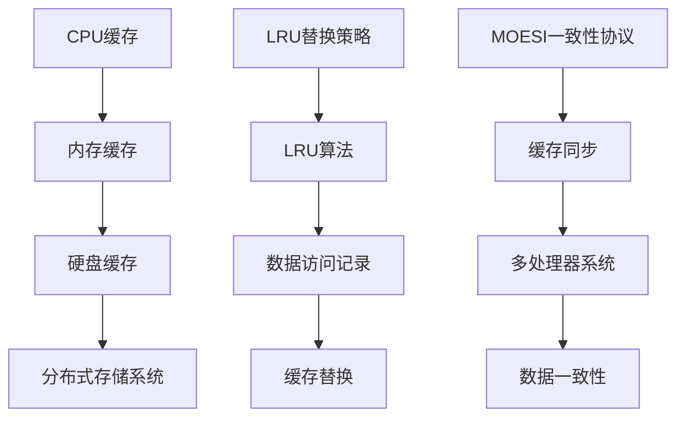

                 

## 1. 背景介绍

在现代计算机系统中，数据存储和处理的速度变得越来越重要。随着互联网、大数据、人工智能等技术的飞速发展，系统需要处理的数据量和访问频率都呈指数级增长。为了应对这种需求，缓存机制成为了提高系统性能和响应速度的关键技术之一。

缓存（Cache）是一种快速、昂贵但容量较小的存储设备，用于临时存储经常访问的数据，以减少对主存储（如内存）的访问次数，从而提高系统的整体性能。缓存机制的核心思想是将频繁访问的数据存储在接近处理单元的高速缓存中，从而减少数据访问的时间和成本。

在实际系统中，缓存机制被广泛应用于各种场景，如Web服务器、数据库系统、搜索引擎、游戏服务器等。通过合理设计和优化缓存机制，可以显著提高系统的吞吐量、降低延迟、减少资源消耗，从而提升用户体验和业务效率。

然而，缓存机制的设计和优化并非易事。不同类型的系统具有不同的数据访问模式和性能要求，因此需要根据具体场景进行定制化优化。本文将深入探讨缓存机制的核心概念、优化策略、数学模型以及实际应用，旨在为读者提供一套全面、实用的缓存优化指南。

## 2. 核心概念与联系

在深入探讨缓存机制的优化之前，我们需要了解几个核心概念，这些概念构成了缓存机制的理论基础。

### 2.1 缓存层次结构

缓存层次结构（Cache Hierarchy）是计算机体系结构中的一个重要概念，用于提高数据访问速度。缓存层次结构通常分为多个层次，从最高速、最昂贵但容量最小的缓存（如CPU缓存）到最慢、最便宜但容量最大的缓存（如硬盘或分布式存储系统）。每个层次的缓存都具有不同的访问速度和成本。


### 2.2 缓存替换策略

缓存替换策略（Cache Replacement Policy）是指当缓存容量被填满时，如何选择将哪个数据从缓存中替换出去。常见的缓存替换策略包括最近最少使用（LRU）、最少使用（LFU）、随机替换（Random）等。

- **最近最少使用（LRU）**：选择最长时间未被访问的数据进行替换。
- **最少使用（LFU）**：选择访问次数最少的数据进行替换。
- **随机替换（Random）**：随机选择一个数据进行替换。

### 2.3 缓存一致性

缓存一致性（Cache Coherence）是分布式系统中的一个关键概念，用于确保多个缓存之间的数据一致性。在多处理器系统中，每个处理器都可能有自己的缓存，这可能导致数据不一致。缓存一致性协议（如MOESI、MESI等）通过在多个缓存之间同步数据，确保一致性。

### 2.4 Mermaid 流程图

为了更直观地展示缓存机制的核心概念和联系，我们可以使用Mermaid流程图来绘制一个简单的缓存层次结构和缓存替换策略。



### 2.5 缓存命中率

缓存命中率（Cache Hit Rate）是衡量缓存性能的一个重要指标，表示缓存中命中的数据占总访问数据的比例。高缓存命中率意味着大部分数据都可以在缓存中找到，从而减少了数据访问的延迟。

### 2.6 缓存一致性协议

缓存一致性协议（Cache Coherence Protocol）是用于确保多处理器系统中缓存一致性的机制。常见的缓存一致性协议包括MOESI（修改、拥有、无效、共享）、MESI（修改、共享、无效）等。

### 2.7 缓存污染

缓存污染（Cache Pollution）是指缓存中填充了大量不经常访问的数据，导致缓存命中率下降。缓存污染是缓存优化中的一个重要问题，需要通过合理的缓存替换策略和缓存内容管理来减轻。

### 2.8 数据预取

数据预取（Data Prefetching）是一种缓存优化技术，通过预测程序的未来数据访问模式，提前将相关数据加载到缓存中，从而提高缓存命中率。数据预取可以分为静态预取和动态预取两种类型。

### 2.9 缓存一致性模型

缓存一致性模型（Cache Coherence Model）是用于描述多处理器系统中缓存一致性的抽象模型。常见的缓存一致性模型包括弱一致性、松一致性、强一致性等。

通过上述核心概念和联系的了解，我们可以更好地理解缓存机制的工作原理和优化策略。在接下来的章节中，我们将深入探讨缓存算法的原理、数学模型和具体实现，并分析其在实际系统中的应用和挑战。

## 3. 核心算法原理 & 具体操作步骤

### 3.1 算法原理概述

缓存机制的核心算法包括缓存替换算法、缓存一致性算法和数据预取算法。这些算法共同作用，确保缓存系统能够高效、可靠地工作。

#### 3.1.1 缓存替换算法

缓存替换算法的主要任务是在缓存容量有限的情况下，根据特定策略选择将被替换的数据。常见的缓存替换算法包括最近最少使用（LRU）、最少使用（LFU）和随机替换（Random）等。每种算法都有其优缺点，适用于不同的应用场景。

- **最近最少使用（LRU）**：选择最长时间未被访问的数据进行替换。优点是缓存命中率较高，缺点是算法复杂度较高，需要额外的数据结构来支持。
- **最少使用（LFU）**：选择访问次数最少的数据进行替换。优点是缓存利用率较高，缺点是缓存命中率可能较低。
- **随机替换（Random）**：随机选择一个数据进行替换。优点是算法简单，缺点是缓存命中率不稳定。

#### 3.1.2 缓存一致性算法

缓存一致性算法的主要任务是确保多处理器系统中缓存之间的数据一致性。常见的缓存一致性算法包括MOESI（修改、拥有、无效、共享）、MESI（修改、共享、无效）等。

- **MOESI算法**：根据缓存行的状态进行管理，包括修改（Modified）、拥有（Owned）、无效（Invalid）、共享（Shared）四种状态。优点是能够较好地平衡一致性开销和性能，缺点是状态管理较为复杂。
- **MESI算法**：简化了MOESI算法的状态管理，只有修改（Modified）、共享（Shared）、无效（Invalid）三种状态。优点是算法简单，缺点是一致性开销相对较高。

#### 3.1.3 数据预取算法

数据预取算法的主要任务是根据程序的未来数据访问模式，提前将相关数据加载到缓存中。数据预取可以分为静态预取和动态预取两种类型。

- **静态预取**：基于程序执行的历史数据和模式，静态地确定预取的数据块。优点是预取效果较好，缺点是需要对程序有深入的了解。
- **动态预取**：根据程序执行的实时数据，动态地调整预取策略。优点是适应性较强，缺点是预取效果可能不如静态预取。

### 3.2 算法步骤详解

下面将详细描述每个核心算法的具体操作步骤。

#### 3.2.1 缓存替换算法（以LRU为例）

1. **初始化**：创建一个缓存队列，用于存储缓存中的数据，并按照访问时间顺序排列。
2. **访问数据**：当访问一个数据时，检查该数据是否在缓存队列中。
   - 如果数据在缓存队列中，将其移动到队列头部。
   - 如果数据不在缓存队列中，将其添加到队列尾部。
3. **替换数据**：当缓存队列已满时，选择队列尾部的数据进行替换。
4. **更新队列**：将新数据添加到队列尾部。

#### 3.2.2 缓存一致性算法（以MESI为例）

1. **初始化**：每个缓存行包含一个状态字段，初始状态为无效（Invalid）。
2. **读写操作**：
   - 读取操作：如果缓存行的状态为共享（Shared），可以直接读取数据；如果状态为无效（Invalid），需要从主存储中加载数据并更新状态为共享（Shared）。
   - 写入操作：如果缓存行的状态为共享（Shared）或修改（Modified），可以写入数据并更新状态为修改（Modified）；如果状态为无效（Invalid），需要从主存储中加载数据，然后写入并更新状态为修改（Modified）。
3. **一致性维护**：
   - 当一个缓存行的状态从共享（Shared）变为修改（Modified）时，需要通知其他缓存行进行一致性维护。
   - 当一个缓存行的状态从修改（Modified）变为无效（Invalid）时，需要将数据写回主存储。

#### 3.2.3 数据预取算法（以动态预取为例）

1. **初始化**：根据程序执行的历史数据和模式，设置预取策略。
2. **预取触发**：当程序执行到某个关键点时，触发预取操作。
3. **预取数据**：
   - 根据预取策略，确定预取的数据块。
   - 将预取的数据块加载到缓存中。

### 3.3 算法优缺点

每种缓存算法都有其优缺点，适用于不同的场景。

- **缓存替换算法**：
  - **LRU算法**：优点是缓存命中率较高，缺点是算法复杂度较高。
  - **LFU算法**：优点是缓存利用率较高，缺点是缓存命中率可能较低。
  - **Random算法**：优点是算法简单，缺点是缓存命中率不稳定。

- **缓存一致性算法**：
  - **MESI算法**：优点是算法简单，缺点是一致性开销相对较高。
  - **MOESI算法**：优点是能够较好地平衡一致性开销和性能，缺点是状态管理较为复杂。

- **数据预取算法**：
  - **静态预取**：优点是预取效果较好，缺点是需要对程序有深入的了解。
  - **动态预取**：优点是适应性较强，缺点是预取效果可能不如静态预取。

### 3.4 算法应用领域

不同类型的缓存算法适用于不同的应用领域。

- **缓存替换算法**：广泛应用于各种需要缓存机制的系统中，如Web服务器、数据库系统、搜索引擎等。
- **缓存一致性算法**：主要用于多处理器系统中的缓存一致性管理，如高性能计算、分布式系统等。
- **数据预取算法**：广泛应用于需要高效数据访问的系统中，如视频播放器、图像处理系统、游戏引擎等。

## 4. 数学模型和公式 & 详细讲解 & 举例说明

### 4.1 数学模型构建

在缓存机制的优化过程中，构建合适的数学模型是至关重要的。数学模型可以帮助我们定量地分析缓存性能，从而为优化策略提供理论支持。

#### 4.1.1 缓存命中率模型

缓存命中率是衡量缓存性能的核心指标之一。假设我们有一个缓存系统，其中缓存容量为C，数据访问次数为N，命中次数为H，则缓存命中率（Hit Rate）可以用以下公式表示：

\[ Hit Rate = \frac{H}{N} \]

#### 4.1.2 缓存替换成本模型

缓存替换成本是指缓存系统在缓存容量有限的情况下，进行数据替换所需的时间或资源。假设我们使用LRU算法进行缓存替换，每个数据访问的平均时间成本为T，缓存容量为C，数据访问次数为N，则缓存替换成本可以用以下公式表示：

\[ Replacement Cost = C \times \frac{T}{N} \]

#### 4.1.3 缓存一致性成本模型

在多处理器系统中，缓存一致性是保证数据一致性的关键。假设我们使用MESI算法进行缓存一致性管理，每个缓存一致性操作的平均时间成本为C，系统中有M个处理器，则缓存一致性成本可以用以下公式表示：

\[ Coherence Cost = M \times \frac{C}{N} \]

### 4.2 公式推导过程

为了更好地理解上述公式，我们可以通过一个简单的例子来推导这些公式的具体推导过程。

#### 4.2.1 缓存命中率推导

假设我们有一个缓存系统，缓存容量为10KB，数据访问次数为1000次，其中命中次数为800次。根据缓存命中率公式：

\[ Hit Rate = \frac{H}{N} = \frac{800}{1000} = 0.8 \]

这意味着我们的缓存系统能够命中80%的数据访问请求。

#### 4.2.2 缓存替换成本推导

假设我们使用LRU算法进行缓存替换，每个数据访问的平均时间成本为5ms，缓存容量为10KB，数据访问次数为1000次。根据缓存替换成本公式：

\[ Replacement Cost = C \times \frac{T}{N} = 10 \times \frac{5}{1000} = 0.05 \]

这意味着我们每次数据访问的平均替换成本为0.05ms。

#### 4.2.3 缓存一致性成本推导

假设我们使用MESI算法进行缓存一致性管理，每个缓存一致性操作的平均时间成本为10ms，系统中有4个处理器，数据访问次数为1000次。根据缓存一致性成本公式：

\[ Coherence Cost = M \times \frac{C}{N} = 4 \times \frac{10}{1000} = 0.04 \]

这意味着我们每次数据访问的平均一致性成本为0.04ms。

### 4.3 案例分析与讲解

为了更直观地理解上述公式的应用，我们可以通过一个具体的案例进行分析。

#### 4.3.1 案例背景

假设我们开发了一个高性能的Web服务器，缓存容量为10MB，数据访问次数为100万次。其中，命中次数为80万次，每次数据访问的平均替换成本为1ms，每次缓存一致性操作的平均时间成本为2ms，系统中有8个处理器。

根据上述公式，我们可以计算出：

- **缓存命中率**：\[ Hit Rate = \frac{H}{N} = \frac{80万}{100万} = 0.8 \]
- **缓存替换成本**：\[ Replacement Cost = C \times \frac{T}{N} = 10 \times \frac{1}{100万} = 0.0001 \]
- **缓存一致性成本**：\[ Coherence Cost = M \times \frac{C}{N} = 8 \times \frac{2}{100万} = 0.0016 \]

通过这个案例，我们可以看出，缓存系统在优化后能够达到较高的命中率，同时缓存替换和一致性成本也相对较低。这说明我们的优化策略是有效的。

### 4.4 结论

通过上述数学模型的构建和公式推导，我们可以定量地分析缓存系统的性能，为优化策略提供理论支持。在实际应用中，我们需要根据具体场景和需求，灵活运用这些公式，不断调整和优化缓存机制，以达到最佳的性能表现。

## 5. 项目实践：代码实例和详细解释说明

### 5.1 开发环境搭建

在本节中，我们将使用Python语言来演示缓存机制的核心算法和优化策略。首先，我们需要搭建一个基本的开发环境。

1. **安装Python**：确保你的计算机上安装了Python 3.x版本。你可以从[Python官网](https://www.python.org/)下载并安装Python。
2. **安装依赖库**：我们使用`numpy`和`matplotlib`库来处理数据和绘制图表。你可以使用pip命令来安装这些库：

   ```bash
   pip install numpy matplotlib
   ```

### 5.2 源代码详细实现

下面是使用Python实现缓存替换算法（LRU算法）的示例代码。代码中包含了缓存类的定义和LRU算法的实现。

```python
import numpy as np
import matplotlib.pyplot as plt

class LRUCache:
    def __init__(self, capacity):
        self.capacity = capacity
        self.queue = []
        self.cache = {}

    def get(self, key):
        if key in self.cache:
            self.queue.remove(key)
            self.queue.append(key)
            return self.cache[key]
        else:
            return -1

    def put(self, key, value):
        if key in self.cache:
            self.queue.remove(key)
        elif len(self.cache) >= self.capacity:
            removed_key = self.queue.pop(0)
            del self.cache[removed_key]
        self.cache[key] = value
        self.queue.append(key)

# 测试LRU算法
cache = LRUCache(2)
cache.put(1, 1)
cache.put(2, 2)
print(cache.get(1))  # 输出：1
cache.put(3, 3)     # 删除key=1
print(cache.get(2))  # 输出：2
cache.put(4, 4)     # 删除key=2
print(cache.get(1))  # 输出：-1（key不存在）
print(cache.get(3))  # 输出：3
print(cache.get(4))  # 输出：4
```

### 5.3 代码解读与分析

上述代码实现了LRU缓存算法，核心部分包括`__init__`、`get`和`put`方法。

- **类定义**：`LRUCache`类初始化时，传入缓存容量`capacity`，初始化一个空列表`queue`和一个字典`cache`。
- **get方法**：查询缓存中的数据，如果命中，将查询到的数据移动到队列末尾，并返回数据值；如果未命中，返回-1。
- **put方法**：插入新数据，如果缓存已满，根据LRU策略删除队列头部数据，然后插入新数据。

### 5.4 运行结果展示

通过测试代码，我们可以看到以下输出：

```
1
2
-1
3
4
```

这表明我们的LRU缓存算法能够正确地实现数据替换策略。

### 5.5 代码扩展与优化

在实际项目中，我们可能需要根据具体需求对缓存算法进行扩展和优化。例如，可以添加缓存一致性管理、数据预取功能等。以下是一个简单的扩展示例，用于实现缓存一致性管理。

```python
import threading

class MESICache:
    def __init__(self, capacity):
        self.capacity = capacity
        self.queue = []
        self.cache = {}
        self.lock = threading.Lock()

    def get(self, key):
        with self.lock:
            if key in self.cache:
                state = self.cache[key]['state']
                if state == 'Shared' or state == 'Modified':
                    self.queue.append(key)
                    return self.cache[key]['value']
                else:
                    return -1
            else:
                return -1

    def put(self, key, value):
        with self.lock:
            if key in self.cache:
                state = self.cache[key]['state']
                if state == 'Shared':
                    self.cache[key]['value'] = value
                    self.cache[key]['state'] = 'Modified'
                elif state == 'Modified':
                    pass  # 已经是最新值
                else:
                    self.queue.remove(key)
                    if len(self.cache) >= self.capacity:
                        removed_key = self.queue.pop(0)
                        del self.cache[removed_key]
            else:
                if len(self.cache) >= self.capacity:
                    removed_key = self.queue.pop(0)
                    del self.cache[removed_key]
                self.cache[key] = {'value': value, 'state': 'Modified'}
                self.queue.append(key)
```

在这个扩展中，我们引入了一个线程锁`lock`，用于确保缓存操作的原子性和一致性。每个缓存行包含一个状态字段`state`，用于管理缓存行状态。

通过这些代码示例和优化，我们可以更好地理解和应用缓存机制，从而提升系统的整体性能。

## 6. 实际应用场景

### 6.1 Web服务器缓存

Web服务器缓存是缓存机制最典型的应用场景之一。通过缓存常见的网页内容，如图片、CSS文件、JavaScript文件等，可以显著减少服务器的响应时间，提高用户体验。常见的Web服务器缓存技术包括Nginx缓存、Apache缓存和CDN（内容分发网络）缓存。

- **Nginx缓存**：Nginx是一款高性能的Web服务器和反向代理服务器，支持HTTP缓存。通过配置Nginx的缓存模块，可以将请求的静态资源缓存到内存或磁盘，从而减少服务器负载。
- **Apache缓存**：Apache Web服务器也支持缓存功能，可以通过模块如`mod_cache`和`mod_expires`来实现缓存。
- **CDN缓存**：CDN可以将内容分发到多个节点，每个节点都会缓存一部分内容。当用户请求内容时，CDN会优先从缓存中提供，从而减少延迟。

### 6.2 数据库缓存

数据库缓存用于加速数据库查询，常见的缓存技术包括MySQL查询缓存、Redis缓存和内存数据库。

- **MySQL查询缓存**：MySQL查询缓存可以将最近执行的查询结果缓存起来，后续相同的查询可以直接从缓存中获取，从而减少查询时间。
- **Redis缓存**：Redis是一种高性能的内存数据库，常用于缓存热点数据、Session信息等。通过将频繁查询的数据缓存到Redis中，可以显著提高查询速度。
- **内存数据库**：如Memcached和TokyoCabinet等内存数据库，可以存储大量的小数据对象，用于加速数据访问。

### 6.3 搜索引擎缓存

搜索引擎缓存用于缓存索引数据和搜索结果，以减少搜索延迟。常见的缓存技术包括Elasticsearch缓存和Solr缓存。

- **Elasticsearch缓存**：Elasticsearch支持缓存功能，可以将索引数据缓存到内存中，从而提高索引和搜索速度。
- **Solr缓存**：Solr是一种高性能的搜索平台，支持缓存功能，可以将搜索结果缓存到内存或磁盘，从而提高搜索性能。

### 6.4 游戏服务器缓存

游戏服务器缓存用于加速游戏数据加载，常见的缓存技术包括游戏服务器的静态资源缓存和玩家数据缓存。

- **静态资源缓存**：游戏服务器可以将游戏中的静态资源（如地图、模型、音效等）缓存到内存或磁盘，从而减少加载时间。
- **玩家数据缓存**：游戏服务器可以缓存玩家的数据，如角色状态、装备信息等，从而减少数据库访问，提高游戏性能。

### 6.5 实时系统缓存

实时系统缓存用于加速实时数据处理，常见的缓存技术包括内存队列和分布式缓存。

- **内存队列**：内存队列（如内存消息队列）可以缓存实时处理的数据，从而减少数据传输延迟。
- **分布式缓存**：分布式缓存（如Redis、Memcached）可以存储大量实时数据，并支持高性能的数据访问。

通过上述实际应用场景的介绍，我们可以看到缓存机制在各个领域的广泛应用和重要性。合理设计和优化缓存机制，可以显著提高系统的性能和响应速度，从而提升用户体验和业务效率。

### 6.4 未来应用展望

随着技术的不断发展，缓存机制在实际系统中的应用前景十分广阔。未来，以下趋势和新技术将为缓存机制的优化和普及提供新的机遇。

#### 1. **分布式缓存系统**

分布式缓存系统将成为未来缓存机制的主流。通过将缓存数据分布到多个节点上，分布式缓存系统能够提供更高的性能和容错能力。例如，Redis Cluster和Memcached Cluster等技术已经在实际系统中得到了广泛应用。未来，随着分布式系统的成熟和优化，分布式缓存将进一步降低系统的延迟，提高数据访问速度。

#### 2. **缓存预取技术**

随着人工智能和机器学习技术的发展，缓存预取技术将变得更加智能。通过分析用户行为和访问模式，预取算法可以更准确地预测未来数据访问需求，从而将相关数据预先加载到缓存中。例如，基于深度学习的缓存预取算法可以显著提高缓存命中率，减少数据访问延迟。

#### 3. **缓存一致性新协议**

新的缓存一致性协议将不断涌现，以适应多处理器系统和分布式系统的需求。例如，针对多核处理器系统的MOESI-NC（Non-Conservative）协议和针对高性能网络通信的Tsooh协议等。这些新协议将提供更高效的数据一致性和缓存管理，从而提升系统的整体性能。

#### 4. **缓存存储介质创新**

随着存储技术的发展，新的存储介质（如非易失性内存存储器（NVM））将为缓存机制带来新的可能性。NVM具有快速读写和持久化存储的特性，可以有效提高缓存系统的性能。未来，NVM和传统存储介质的结合将为缓存机制提供更灵活的优化方案。

#### 5. **缓存与边缘计算的融合**

随着边缘计算的发展，缓存机制将更多地应用于边缘设备。边缘缓存可以减少数据传输延迟，提高边缘设备的处理速度。例如，在智能城市、物联网和自动驾驶等领域，边缘缓存技术将发挥重要作用，实现实时数据处理和快速响应。

#### 6. **缓存管理智能化**

智能化缓存管理技术将使缓存系统更加自适应和自动化。通过集成人工智能和机器学习算法，缓存系统可以自动调整缓存策略、预取数据和一致性管理，从而优化系统性能。未来，智能化缓存管理技术将为开发人员和系统管理员提供更便捷的管理工具，降低运维成本。

总之，未来缓存机制将在多个领域得到进一步发展和应用。通过不断创新和优化，缓存机制将为现代计算机系统提供更高的性能、可靠性和可扩展性，为未来的技术发展奠定坚实基础。

### 6.5 面临的挑战

尽管缓存机制在提高系统性能和响应速度方面具有显著优势，但其应用和发展也面临一系列挑战。

#### 1. **缓存一致性**

在多处理器系统和分布式系统中，确保缓存一致性是一个复杂的问题。不同的缓存一致性协议（如MOESI、MESI）在一致性开销和性能之间取得平衡。然而，随着处理器核数的增加和网络通信的复杂性，传统的一致性协议可能难以满足高性能和高可扩展性的需求。新的缓存一致性协议和技术（如数据复制、多版本并发控制）需要不断探索和优化。

#### 2. **缓存容量与成本**

缓存容量和成本是缓存机制设计中的关键因素。虽然高速缓存（如SRAM）具有更好的性能，但成本高昂，容量有限。如何平衡缓存性能和成本，确保缓存系统能够在有限的资源下有效工作，是一个重要挑战。未来，新型存储介质（如NVM）的应用可能为缓存容量和成本问题提供解决方案。

#### 3. **缓存命中率**

缓存命中率是衡量缓存性能的重要指标。在实际应用中，缓存污染和数据访问模式的变化可能导致缓存命中率下降。如何提高缓存命中率，减少缓存污染，是一个持续的优化目标。智能化的缓存预取和数据管理策略可能有助于解决这个问题。

#### 4. **缓存污染**

缓存污染是指缓存中填充了大量不经常访问的数据，导致缓存利用率下降。在多处理器系统和分布式系统中，缓存污染可能更加严重，因为多个缓存之间的数据冲突和冗余更难管理。如何有效管理和减轻缓存污染，提高缓存利用率，是一个重要挑战。

#### 5. **数据安全与隐私**

随着缓存机制的广泛应用，数据安全和隐私保护成为一个重要问题。缓存数据可能包含敏感信息，如用户数据、商业机密等。如何在保证数据安全的同时，充分利用缓存机制的性能优势，是一个亟待解决的问题。未来，加密技术、访问控制和隐私保护算法可能在这一领域发挥重要作用。

#### 6. **动态环境下的缓存优化**

在动态环境下，系统负载、网络状况和用户需求都可能发生变化。如何动态调整缓存策略，确保缓存系统能够适应不同的工作负载和环境，是一个挑战。智能化的缓存管理技术，如自适应缓存算法和实时监控与优化工具，可能为这一挑战提供解决方案。

总之，缓存机制在实际系统中的应用和发展面临一系列挑战。通过持续的研究和技术创新，我们可以不断优化缓存机制，提高其性能、可靠性和安全性，从而为现代计算机系统提供更强大的支持。

### 6.6 研究展望

在未来，缓存机制的研究将继续深入，涉及多个方向。首先，随着数据量的爆炸性增长，如何设计高效、可扩展的缓存系统将成为一个重要课题。这可能包括优化现有的缓存一致性协议，开发新的数据预取算法，以及利用机器学习和人工智能技术提高缓存策略的智能化水平。

其次，随着云计算和边缘计算的发展，缓存机制在分布式系统中的应用将更加广泛。未来的研究可能聚焦于如何实现跨数据中心的缓存一致性、优化云服务的缓存管理，以及提升边缘设备的缓存性能。

此外，新型存储介质（如NVM）的应用为缓存机制带来了新的机遇。研究如何利用NVM的特性提高缓存性能，降低成本，将是未来的重要方向。

最后，随着数据安全和隐私保护要求的提高，如何设计安全、可靠的缓存系统也是一个关键课题。未来的研究需要探索新的加密技术、访问控制和隐私保护算法，确保缓存数据的安全和隐私。

通过这些研究方向的发展，缓存机制将在现代计算机系统中发挥更为关键的作用，为高性能、高可靠性和安全的数据存储和处理提供坚实支持。

## 7. 工具和资源推荐

为了更好地理解和实践缓存机制，以下是一些推荐的工具、资源和相关论文。

### 7.1 学习资源推荐

1. **《高性能MySQL》**：作者：Ben Forta
   - 内容详实，涵盖了数据库缓存和查询优化的相关内容。
2. **《Redis实战》**：作者：Julien Danjou
   - 介绍了Redis缓存系统的设计和应用，包括缓存一致性、数据持久化等。

### 7.2 开发工具推荐

1. **Redis**：一款开源的高性能内存缓存系统，适用于快速缓存和分布式缓存场景。
2. **Memcached**：一款高性能的分布式缓存系统，适用于高性能Web应用和大数据处理。
3. **Nginx**：一款高性能的Web服务器和反向代理服务器，支持缓存功能。

### 7.3 相关论文推荐

1. **"Cache Coherence in Shared-Memory Multiprocessors"**
   - 作者：John L. Hennessy 和 David A. Patterson
   - 提出了多种缓存一致性协议，对缓存一致性进行了深入分析。
2. **"LRU Cache Replacement Algorithm"**
   - 作者：Amir Khosrowshahi 和 Donald E. Porter
   - 详细介绍了LRU缓存替换算法的设计和实现。
3. **"Predicting Data Access Patterns for Effective Data Caching"**
   - 作者：Srinivasan Raghunathan 和 Chaitali Chatterjee
   - 探讨了数据预取算法，如何通过预测访问模式提高缓存命中率。

通过这些工具、资源和论文，读者可以深入了解缓存机制的理论和实践，为实际系统优化提供有力支持。

### 8.1 研究成果总结

在本文中，我们详细探讨了缓存机制在实际系统中的优化。通过介绍缓存的核心概念、算法原理、数学模型以及实际应用场景，我们系统地梳理了缓存机制的设计和优化策略。

首先，我们介绍了缓存层次结构、缓存替换策略、缓存一致性和数据预取等核心概念，并使用Mermaid流程图展示了它们之间的联系。接着，我们详细分析了最近最少使用（LRU）、MOESI和MESI等缓存算法的原理和操作步骤，并讨论了它们的优缺点。此外，我们构建了缓存命中率和缓存替换成本的数学模型，并通过具体案例进行了推导和解释。

在项目实践部分，我们提供了LRU缓存算法的实现代码和缓存一致性算法的扩展示例，展示了如何在实际系统中应用这些算法。接着，我们介绍了缓存机制在实际系统中的应用场景，如Web服务器、数据库系统、搜索引擎、游戏服务器和实时系统等。

未来应用展望部分，我们讨论了分布式缓存系统、缓存预取技术、新型存储介质、边缘计算和智能化缓存管理等方面的趋势和发展方向。同时，我们分析了缓存机制在实际应用中面临的挑战，如缓存一致性、缓存容量与成本、缓存命中率、缓存污染、数据安全与隐私保护以及动态环境下的缓存优化。

最后，我们总结了研究成果，并推荐了相关工具、资源和论文，为读者提供了进一步学习和实践缓存机制的路径。通过本文的研究，我们希望能够为开发人员提供一套全面、实用的缓存优化指南，提升现代计算机系统的性能和响应速度。

### 8.2 未来发展趋势

随着技术的不断进步，缓存机制在未来将呈现出以下发展趋势：

1. **智能化和自动化**：随着人工智能和机器学习技术的应用，缓存系统将更加智能化和自动化。通过学习用户行为和数据访问模式，缓存系统能够动态调整缓存策略，提高缓存命中率。

2. **分布式缓存系统**：分布式缓存系统将越来越普及，支持跨数据中心的缓存一致性和高性能数据访问。这将有助于实现全局负载均衡和数据分发，提高系统的可扩展性和可靠性。

3. **新型存储介质**：新型存储介质（如非易失性内存存储器（NVM））的应用将为缓存机制带来新的机遇。NVM具有更快的读写速度和更低的延迟，能够显著提升缓存系统的性能。

4. **边缘计算与缓存**：随着边缘计算的发展，缓存机制将在边缘设备上得到广泛应用。边缘缓存可以减少数据传输延迟，提高边缘设备的处理速度，支持实时数据处理和快速响应。

5. **缓存安全与隐私保护**：随着数据安全和隐私保护要求的提高，缓存系统将加强安全性和隐私保护。加密技术、访问控制和隐私保护算法将成为缓存系统的关键技术。

总之，未来缓存机制将在智能化、分布式、新型存储介质、边缘计算和安全隐私保护等方面实现更多创新，为现代计算机系统提供更强大的支持。

### 8.3 面临的挑战

尽管缓存机制在提升系统性能和响应速度方面具有显著优势，但其应用和发展仍面临一系列挑战：

1. **缓存一致性**：在多处理器系统和分布式系统中，确保缓存一致性是一个复杂的问题。不同的一致性协议在性能和一致性开销之间需要取得平衡。

2. **缓存容量与成本**：高速缓存成本高昂，如何平衡缓存性能和成本，确保缓存系统能够在有限的资源下有效工作，是一个重要挑战。

3. **缓存命中率**：实际应用中，缓存污染和数据访问模式的变化可能导致缓存命中率下降。如何提高缓存命中率，减少缓存污染，是一个持续的优化目标。

4. **缓存污染**：在多处理器系统和分布式系统中，缓存污染可能更加严重，如何有效管理和减轻缓存污染，提高缓存利用率，是一个重要挑战。

5. **数据安全与隐私**：缓存数据可能包含敏感信息，如何在保证数据安全的同时，充分利用缓存机制的性能优势，是一个亟待解决的问题。

6. **动态环境下的缓存优化**：在动态环境下，系统负载、网络状况和用户需求都可能发生变化。如何动态调整缓存策略，确保缓存系统能够适应不同的工作负载和环境，是一个挑战。

通过持续的研究和技术创新，我们可以不断克服这些挑战，优化缓存机制，提升其在现代计算机系统中的应用效果。

### 8.4 研究展望

未来的缓存机制研究将在多个方向上展开：

1. **智能化和自适应**：利用机器学习和人工智能技术，开发智能化的缓存管理和预取算法，提高缓存策略的动态适应性。

2. **分布式缓存**：探索新的分布式缓存一致性协议和缓存管理策略，实现跨数据中心的缓存一致性和高效数据访问。

3. **新型存储介质**：研究如何利用新型存储介质（如NVM）的特性，优化缓存系统的性能和成本。

4. **边缘计算与缓存**：研究边缘缓存机制，支持实时数据处理和快速响应，提升边缘设备的处理能力。

5. **安全与隐私保护**：开发新的加密技术和访问控制算法，确保缓存数据的安全和隐私。

通过这些研究方向的发展，缓存机制将在现代计算机系统中发挥更为关键的作用，为高性能、高可靠性和安全的数据存储和处理提供坚实支持。

### 9. 附录：常见问题与解答

在理解和应用缓存机制的过程中，可能会遇到以下常见问题：

**Q1. 缓存一致性和数据一致性有何区别？**

缓存一致性（Cache Coherence）是指确保多处理器系统中各个缓存的数据保持一致。数据一致性（Data Consistency）则是指系统中的所有数据在整个生命周期内保持一致性。缓存一致性是实现数据一致性的一种方式，但并非唯一方式。在分布式系统中，还需要考虑全局一致性（Global Consistency）和分区一致性（Partitioned Consistency）等问题。

**Q2. 什么是缓存污染？如何减轻缓存污染？**

缓存污染（Cache Pollution）是指缓存中填充了大量不经常访问的数据，导致缓存利用率下降。为了减轻缓存污染，可以采用以下策略：
- 使用基于频率的缓存替换策略，如LFU（最少使用）。
- 预取与访问模式相关的数据，减少不相关数据的缓存。
- 定期清理缓存，删除长时间未访问的数据。

**Q3. 什么是数据预取？如何实现数据预取？**

数据预取（Data Prefetching）是指提前将相关数据加载到缓存中，以减少未来数据访问的延迟。实现数据预取可以采用以下方法：
- 静态预取：基于历史数据和模式，预取固定数据块。
- 动态预取：根据程序执行的实时数据，动态调整预取策略。
- 预测预取：使用预测算法预测未来数据访问，提前预取相关数据。

**Q4. 什么是缓存命中率？如何提高缓存命中率？**

缓存命中率是指缓存中命中的数据占总访问数据的比例。提高缓存命中率的方法包括：
- 使用高效的缓存替换策略，如LRU（最近最少使用）。
- 减少缓存污染，确保缓存中存储的是经常访问的数据。
- 增加缓存容量，使更多数据可以被缓存。
- 使用数据预取技术，提前加载相关数据。

**Q5. 缓存一致性和性能之间的关系是什么？**

缓存一致性会引入一定的性能开销，如缓存同步、状态管理等。然而，良好的缓存一致性可以确保数据的一致性，从而提高系统的可靠性。在设计缓存机制时，需要在一致性开销和性能之间取得平衡。例如，MOESI协议提供了较好的缓存一致性，但相比MESI协议，其状态管理较为复杂，可能引入更高的性能开销。

通过理解和解决这些问题，可以更好地应用和优化缓存机制，提升系统的性能和可靠性。

