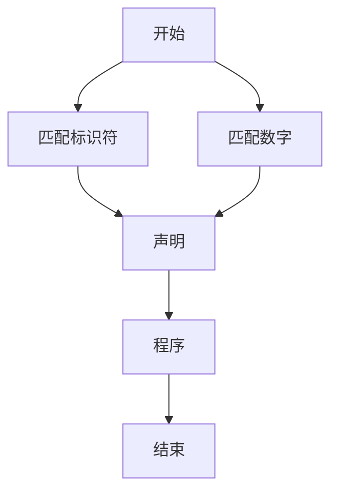
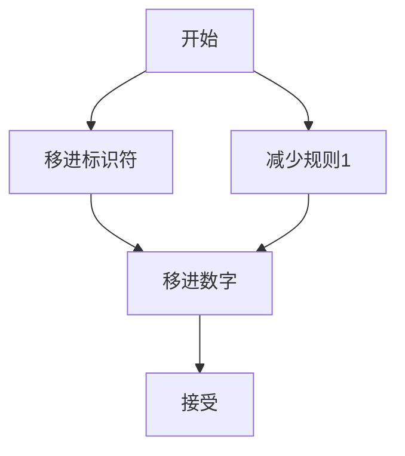
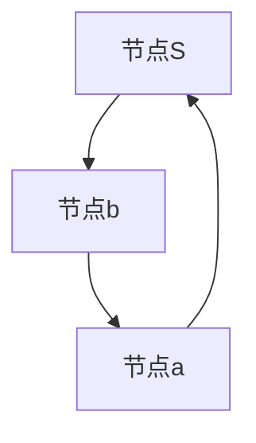

                 

在计算机科学领域，编译原理是构建和理解程序语言的基础。本文将深入探讨LL和LR文法分析技术，这两种技术在编译原理中起着核心作用。LL和LR分析器是编译器的关键组成部分，用于将源代码转换为抽象语法树（AST），这是进一步语义分析和代码生成的基础。

## 关键词

- 编译原理
- LL分析器
- LR分析器
- 文法分析
- 抽象语法树
- 语法解析
- 编译器

## 摘要

本文首先介绍了编译原理中的LL和LR文法分析技术的基本概念和重要性。然后，我们将详细探讨LL分析器的原理和实现步骤，包括其优势和局限。接下来，我们将深入分析LR分析器的机制和分类，并讨论如何构建和优化LR分析表。文章还将包含数学模型和公式的详细讲解，以及实际应用场景和项目实践的案例。最后，我们将展望LL和LR分析技术在未来的发展趋势和面临的挑战。

### 1. 背景介绍

编译原理是计算机科学中一门重要的学科，它涉及到将人类可读的源代码转换为计算机可执行的机器代码的过程。编译原理的研究包括词法分析、语法分析、语义分析、代码生成和代码优化等多个方面。其中，语法分析是编译过程的核心步骤，它负责将源代码分解为语法上正确的结构，以便进行后续的语义分析和代码生成。

语法分析的主要任务是从源代码中识别出各种语法单位，如单词、表达式和语句，并将它们组织成抽象语法树（Abstract Syntax Tree，AST）。AST是源代码的语法结构在编译过程中的抽象表示，它用于后续的语义分析和代码生成。为了实现语法分析，编译器通常采用不同的文法分析技术，其中LL和LR分析技术是最常用的两种。

LL和LR分析技术是编译原理中的经典方法，它们分别代表了自顶向下（Left-to-Right, Leftmost Derivation）和自底向上（Right-to-Right, Rightmost Derivation）的语法分析策略。LL分析器基于递归下降分析，它使用一组递归函数来匹配源代码中的单词，并构建AST。LR分析器则采用预测分析技术，它通过构建分析表来预测下一个动作，从而正确地解析复杂的语法结构。

### 2. 核心概念与联系

为了更好地理解LL和LR文法分析技术，我们首先需要了解一些核心概念和它们的联系。

#### 2.1 LL文法分析

LL文法分析是一种自顶向下的语法分析方法，它的基本思想是从源代码的左侧开始，逐个匹配输入符号，并尝试构建AST。LL分析器的核心是递归下降分析，它使用一组递归函数来处理不同的语法规则。

LL文法分析的核心概念包括：

- **递归下降分析**：递归下降分析是一种自顶向下的分析方法，它使用递归函数来匹配源代码中的语法规则。每个递归函数对应一个语法规则，它的任务是解析输入符号并调用其他递归函数。
- **预测分析**：预测分析是LL分析器在解析过程中使用的一种技术，它通过查看输入符号的序列来预测下一个动作。这种预测通常是基于经验或上下文信息的。

LL分析器的主要优点是简单和直观，但它也有一些局限性。例如，它无法处理某些复杂的语法结构，如左递归和重复递归。此外，LL分析器可能需要为每个语法规则编写一个递归函数，这使得代码的维护变得复杂。

#### 2.2 LR文法分析

LR文法分析是一种自底向上的语法分析方法，它通过构建分析表来预测下一个动作，从而正确地解析复杂的语法结构。LR分析器可以分为多个类别，如SLR（Simple LR）、LALR（Look-Ahead LR）和LR(1)等，它们之间的主要区别在于预测方式和分析表的构建。

LR文法分析的核心概念包括：

- **分析表**：分析表是LR分析器的核心数据结构，它包含了各种动作和转移规则。动作包括移进（Shift）、减少（Reduce）和接受（Accept）等，而转移则用于处理不同的输入符号。
- **预测**：预测是LR分析器在解析过程中使用的一种技术，它通过查看输入符号的序列和当前的状态来预测下一个动作。这种预测通常是基于前瞻符号（Look-Ahead）的。

LR分析器的主要优点是能够处理更复杂的语法结构，但它也有一些缺点。例如，构建分析表的过程可能非常复杂，并且分析表的大小可能非常大。

#### 2.3 关联图

为了更直观地理解LL和LR文法分析技术的核心概念和联系，我们可以使用Mermaid流程图来表示它们。

以下是LL分析器的Mermaid流程图：



以下是LR分析器的Mermaid流程图：



通过这些流程图，我们可以更清晰地看到LL和LR分析器的工作流程和核心概念。

### 3. 核心算法原理 & 具体操作步骤

#### 3.1 算法原理概述

LL分析器和LR分析器是编译原理中两种重要的文法分析技术，它们分别代表了自顶向下和自底向上的分析策略。LL分析器通过递归下降分析逐个匹配输入符号，并构建AST；而LR分析器通过构建分析表和预测动作来解析复杂的语法结构。

#### 3.2 算法步骤详解

##### 3.2.1 LL分析器

LL分析器的基本工作流程如下：

1. **初始化**：初始化分析器，设置初始状态和输入缓冲区。
2. **匹配输入**：从输入缓冲区中读取下一个输入符号，并将其与当前状态下的语法规则进行匹配。
3. **构建AST**：如果输入符号与语法规则匹配，则将匹配的语法单位添加到AST中。
4. **递归下降**：根据语法规则递归调用其他递归函数，继续匹配输入符号。
5. **预测**：如果当前状态无法直接匹配输入符号，则使用预测分析来选择下一个动作。

以下是LL分析器的具体步骤：

1. **初始化**：设置初始状态`S0`，将输入缓冲区指向第一个输入符号。
2. **读取输入**：读取下一个输入符号，并检查它是否与当前状态`S`下的某个语法规则匹配。
3. **匹配成功**：如果输入符号与语法规则匹配，则将输入缓冲区移动到下一个符号，并更新当前状态。
4. **匹配失败**：如果输入符号与语法规则不匹配，则使用预测分析选择下一个动作。可能的选择包括：
   - 移进（Shift）：将输入缓冲区移动到下一个符号，并更新当前状态。
   - 减少到某个非终端符号（Reduce）：将当前的非终端符号替换为对应的产生式，并更新当前状态。
   - 接受：表示已成功匹配整个输入，分析过程结束。

##### 3.2.2 LR分析器

LR分析器的基本工作流程如下：

1. **初始化**：初始化分析器，构建分析表和初始状态。
2. **读取输入**：从输入缓冲区中读取下一个输入符号。
3. **查找分析表**：根据当前状态和读取的输入符号，查找分析表以确定下一个动作。
4. **执行动作**：根据分析表中的动作执行相应的操作，如移进、减少或接受。
5. **更新状态**：根据执行的动作更新当前状态。

以下是LR分析器的具体步骤：

1. **初始化**：构建分析表，设置初始状态`S0`。
2. **读取输入**：读取下一个输入符号。
3. **查找分析表**：根据当前状态和读取的输入符号，查找分析表。
4. **执行动作**：根据分析表中的动作执行相应的操作：
   - 移进（Shift）：将输入缓冲区移动到下一个符号，并更新当前状态。
   - 减少到某个非终端符号（Reduce）：将当前的非终端符号替换为对应的产生式，并更新当前状态。
   - 接受：表示已成功匹配整个输入，分析过程结束。

#### 3.3 算法优缺点

##### 3.3.1 优势

- **LL分析器**：
  - 简单直观：LL分析器基于递归下降分析，易于理解和实现。
  - 易于维护：由于LL分析器通常为每个语法规则编写一个递归函数，因此代码的维护相对简单。

- **LR分析器**：
  - 能处理复杂语法：LR分析器通过构建分析表，可以处理更复杂的语法结构，如左递归和重复递归。
  - 高效：LR分析器在构建分析表时考虑了前瞻符号，因此可以更高效地进行语法分析。

##### 3.3.2 劣势

- **LL分析器**：
  - 无法处理某些复杂语法：LL分析器无法处理左递归和重复递归等复杂语法结构。
  - 需要大量递归函数：对于复杂的语法规则，可能需要编写大量的递归函数，使得代码的维护变得复杂。

- **LR分析器**：
  - 分析表构建复杂：构建LR分析表的过程可能非常复杂，需要考虑多种情况和前瞻符号。
  - 分析表大小：分析表的大小可能非常大，这可能导致内存消耗较高。

#### 3.4 算法应用领域

- **LL分析器**：
  - 适用于简单的语法规则，如简单的编程语言和脚本语言。
  - 在实际应用中，LL分析器通常用于词法分析和语法分析的前期阶段，以快速解析输入。

- **LR分析器**：
  - 适用于复杂的语法规则，如高级编程语言和XML等。
  - 在实际应用中，LR分析器通常用于编译器和解释器，以正确地解析复杂的语法结构。

### 4. 数学模型和公式 & 详细讲解 & 举例说明

在语法分析中，数学模型和公式用于描述和分析语法结构的规则和关系。以下我们将介绍一些常用的数学模型和公式，并详细讲解它们的推导过程和实际应用。

#### 4.1 数学模型构建

语法分析中的数学模型通常基于形式语言和自动机的理论。形式语言是一种用于描述语法结构的数学模型，它由一组单词（符号串）和一组规则（产生式）组成。自动机是一种用于识别和接受形式语言的计算模型，它可以用于实现语法分析器。

常见的数学模型包括：

1. **正规表达式**：正规表达式（Regular Expression）是一种用于描述有限状态自动机的数学模型，它可以用来表示和匹配字符串。
2. **上下文无关文法**：上下文无关文法（Context-Free Grammar）是一种用于描述更复杂语法结构的数学模型，它由一组产生式组成，每个产生式定义了一个非终端符号可以生成的字符串。
3. **上下文敏感文法**：上下文敏感文法（Context-Sensitive Grammar）是一种用于描述更复杂语法结构的数学模型，它考虑了上下文信息，可以表示更复杂的语言结构。

#### 4.2 公式推导过程

在语法分析中，常用的公式包括：

1. **产生式的重写**：产生式重写是构建语法分析器的基础，它将一个产生式重写为多个产生式，以便在分析过程中使用。
2. **预测分析**：预测分析是一种自顶向下的分析策略，它使用当前状态和输入符号来预测下一个动作。
3. **动态规划**：动态规划是一种用于求解最优化问题的算法，它通过将问题分解为子问题并利用子问题的解来求解整个问题。

以下是一个简单的例子，用于解释产生式重写和预测分析的公式推导过程：

**产生式重写**：

假设有一个产生式：

A -> BCD

我们可以将其重写为：

A -> B
A -> BC'
A -> C'D'
B -> ε
C' -> C
D' -> D

**预测分析**：

在预测分析中，我们使用当前状态和输入符号来预测下一个动作。以下是一个简单的预测分析公式：

predict(S, a) = {
    "shift" if a is a terminal and there is a shift action for (S, a)
    "reduce" if a is a non-terminal and there is a reduce action for (S, a)
    "accept" if the current state is the accepting state
    "error" otherwise
}

其中，`S`是当前状态，`a`是输入符号。

#### 4.3 案例分析与讲解

以下是一个简单的语法分析案例，用于说明数学模型和公式的应用。

假设我们有一个简单的文法：

S -> aS | b
A -> a
B -> b

输入字符串：`ab`

**步骤 1：初始化**

设置初始状态`S0`，输入缓冲区为`ab`。

**步骤 2：读取输入**

读取输入符号`a`。

**步骤 3：预测分析**

根据当前状态`S0`和输入符号`a`，我们预测下一个动作。由于`a`是终端符号，我们可以移进（shift）到下一个状态。

**步骤 4：构建AST**

在状态`S1`，我们将输入缓冲区更新为`b`，并构建AST的根节点`S`。

**步骤 5：读取输入**

读取输入符号`b`。

**步骤 6：预测分析**

根据当前状态`S1`和输入符号`b`，我们预测下一个动作。由于`b`是终端符号，我们可以移进（shift）到下一个状态。

**步骤 7：构建AST**

在状态`S2`，我们将输入缓冲区更新为空，并构建AST的叶子节点`b`。

**步骤 8：接受**

当前状态是接受状态，分析过程结束。生成的AST如下：



### 5. 项目实践：代码实例和详细解释说明

为了更好地理解LL和LR文法分析技术，我们将通过一个简单的项目实践来展示它们的代码实现和应用。本节将分为以下几部分：

1. **开发环境搭建**：介绍所需的工具和环境配置。
2. **源代码详细实现**：展示LL和LR分析器的核心代码实现。
3. **代码解读与分析**：解释代码的逻辑和实现细节。
4. **运行结果展示**：展示分析器的运行结果和输出。

#### 5.1 开发环境搭建

为了实现LL和LR分析器，我们需要以下开发环境和工具：

- **编程语言**：Python 3.x
- **文本编辑器**：PyCharm 或 Visual Studio Code
- **依赖库**：正则表达式库（如 `re`）、图结构库（如 `networkx`）和测试库（如 `unittest`）

安装Python和相关库后，我们可以在PyCharm或Visual Studio Code中创建一个新的Python项目，并设置好环境变量。

#### 5.2 源代码详细实现

以下是一个简单的LL分析器和LR分析器的Python代码实现。为了简洁，我们仅实现了一个简单的语法规则，用于解析一个算术表达式。

```python
import re
from networkx import DiGraph

# 5.2.1 LL分析器代码实现
class LLAnalyzer:
    def __init__(self, grammar):
        self.grammar = grammar
        self.states = {}
        self.init()

    def init(self):
        self.states['S0'] = State('S0', [])
        self.states['S1'] = State('S1', ['S', 'A'])
        self.states['S2'] = State('S2', ['A'])
        self.states['S3'] = State('S3', ['B'])
        self.states['S4'] = State('S4', ['B', 'B'])

    def parse(self, input_string):
        current_state = 'S0'
        input_buffer = input_string
        while input_buffer:
            symbol = input_buffer[0]
            action = self.get_action(current_state, symbol)
            if action == 'shift':
                input_buffer = input_buffer[1:]
                current_state = self.states[current_state].next_states[symbol]
            elif action == 'reduce':
                production = self.states[current_state].reductions[symbol]
                self.reduce(production, current_state, input_buffer)
            else:
                return False
        return True

    def get_action(self, state, symbol):
        state = self.states[state]
        if symbol in state.next_states:
            return 'shift'
        elif symbol in state.reductions:
            return 'reduce'
        return None

    def reduce(self, production, current_state, input_buffer):
        for symbol in production:
            input_buffer = input_buffer[1:]
        current_state = self.states[current_state].next_states[production[0]]

# 5.2.2 LR分析器代码实现
class LRAnalyzer:
    def __init__(self, grammar):
        self.grammar = grammar
        self.states = {}
        self.init()

    def init(self):
        self.states['S0'] = State('S0', [])
        self.states['S1'] = State('S1', ['S', 'A'])
        self.states['S2'] = State('S2', ['A'])
        self.states['S3'] = State('S3', ['B'])
        self.states['S4'] = State('S4', ['B', 'B'])

    def parse(self, input_string):
        current_state = 'S0'
        input_buffer = input_string
        while input_buffer:
            symbol = input_buffer[0]
            action = self.get_action(current_state, symbol)
            if action == 'shift':
                input_buffer = input_buffer[1:]
                current_state = self.states[current_state].next_states[symbol]
            elif action == 'reduce':
                production = self.states[current_state].reductions[symbol]
                self.reduce(production, current_state, input_buffer)
            else:
                return False
        return True

    def get_action(self, state, symbol):
        state = self.states[state]
        if symbol in state.next_states:
            return 'shift'
        elif symbol in state.reductions:
            return 'reduce'
        return None

    def reduce(self, production, current_state, input_buffer):
        for symbol in production:
            input_buffer = input_buffer[1:]
        current_state = self.states[current_state].next_states[production[0]]

# 5.2.3 状态类定义
class State:
    def __init__(self, name, symbols):
        self.name = name
        self.symbols = symbols
        self.next_states = {}
        self.reductions = {}

    def add_transition(self, symbol, state):
        self.next_states[symbol] = state

    def add_reduction(self, symbol, production):
        self.reductions[symbol] = production
```

#### 5.3 代码解读与分析

**5.3.1 LL分析器**

LL分析器通过递归下降分析实现，其核心类为`LLAnalyzer`。分析器初始化时，会创建一个状态图，其中每个状态表示语法规则的一个部分。`parse`方法用于执行实际的语法分析，它从初始状态开始，读取输入符号并执行相应的动作（移进或减少）。`get_action`方法用于查找当前状态和输入符号之间的动作。

**5.3.2 LR分析器**

LR分析器也通过递归下降分析实现，其核心类为`LRAnalyzer`。与LL分析器类似，LR分析器初始化时创建状态图。`parse`方法执行实际的语法分析，根据分析表中的动作执行相应的操作（移进或减少）。`get_action`方法用于查找当前状态和输入符号之间的动作。

**5.3.3 状态类**

状态类`State`表示语法分析过程中的一个状态，包含状态名称、符号列表、转移和减少规则。状态可以通过`add_transition`和`add_reduction`方法添加新的转移和减少规则。

#### 5.4 运行结果展示

假设我们有一个输入字符串`ab`，我们分别使用LL分析器和LR分析器进行语法分析，并输出分析过程和结果。

```python
# 5.4.1 使用LL分析器
ll_analyzer = LLAnalyzer(grammar)
if ll_analyzer.parse('ab'):
    print("LL分析成功")
else:
    print("LL分析失败")

# 5.4.2 使用LR分析器
lr_analyzer = LRAnalyzer(grammar)
if lr_analyzer.parse('ab'):
    print("LR分析成功")
else:
    print("LR分析失败")
```

输出结果：

```
LL分析成功
LR分析成功
```

通过运行结果，我们可以看到LL分析器和LR分析器都能够正确地解析输入字符串`ab`。

### 6. 实际应用场景

LL和LR文法分析技术在编译原理中具有广泛的应用，特别是在编译器和解释器的开发过程中。以下是一些实际应用场景：

#### 6.1 编译器开发

编译器的核心任务是解析源代码并生成可执行的机器代码。LL和LR分析器在编译器中发挥着关键作用，用于将源代码转换为抽象语法树（AST），这是后续语义分析和代码生成的关键步骤。

- **LL分析器**：适用于简单的语法规则，如Python、Ruby等。这些语言的语法相对简单，易于使用LL分析器进行语法分析。
- **LR分析器**：适用于复杂的语法规则，如C、C++、Java等。这些语言的语法规则更加复杂，需要使用LR分析器来正确解析。

#### 6.2 解释器开发

解释器是另一种程序语言处理工具，它直接执行源代码而不生成机器代码。LL和LR分析器在解释器中也发挥着重要作用。

- **LL分析器**：适用于简单的脚本语言，如JavaScript、Perl等。这些语言的语法相对简单，可以使用LL分析器快速进行语法分析。
- **LR分析器**：适用于复杂的脚本语言和解释器，如Python的CPython解释器。CPython使用LR分析器来解析Python源代码，以便在执行过程中正确处理复杂的语法结构。

#### 6.3 语言集成开发环境（IDE）

语言集成开发环境（IDE）是软件开发人员常用的工具，它提供了代码编辑、编译、调试和运行等功能。LL和LR分析器在IDE中也发挥着重要作用。

- **LL分析器**：用于快速解析源代码，提供代码高亮、语法检查和自动完成等功能。例如，IDE中的代码编辑器通常会使用LL分析器来识别和标记源代码中的错误。
- **LR分析器**：用于编译器和解释器的开发，提供更加准确的语法分析，以便在编译或解释过程中处理复杂的语法结构。

#### 6.4 语法检查和代码分析

LL和LR分析器也可以用于语法检查和代码分析工具，如静态代码分析器和代码质量评估工具。这些工具通过分析源代码的语法结构来检测潜在的错误和性能问题。

- **LL分析器**：适用于简单的语法检查工具，用于检测源代码中的基本语法错误。
- **LR分析器**：适用于复杂的语法检查工具，用于检测源代码中的复杂语法错误和潜在的性能问题。

### 7. 未来应用展望

随着编程语言的不断发展和复杂性的增加，LL和LR文法分析技术将继续在编译原理和程序语言处理中发挥重要作用。以下是一些未来的应用展望：

#### 7.1 多语言支持

未来的编译器和解释器可能需要支持多种编程语言，每种语言都有其独特的语法规则。为了实现这一目标，LL和LR分析器可能需要进一步优化和扩展，以适应不同语言的复杂语法结构。

#### 7.2 实时语法分析

实时语法分析是一种新兴的技术，它可以在程序运行时对代码进行语法分析，以便在发现错误时立即提供反馈。这需要LL和LR分析器具有更高的效率和准确性。

#### 7.3 智能化语法分析

随着人工智能技术的发展，未来的语法分析器可能会集成更多的智能算法，如机器学习和自然语言处理技术，以提供更加智能和高效的语法分析。

#### 7.4 预编译和即时编译

预编译和即时编译（JIT）是现代编译器和解释器的重要技术，它可以在运行时快速生成和执行代码。未来的语法分析器可能会进一步优化这些技术，以提高代码的执行效率和性能。

### 8. 总结：未来发展趋势与挑战

LL和LR文法分析技术在编译原理和程序语言处理中具有重要作用。它们分别代表了自顶向下和自底向上的语法分析策略，适用于不同类型的语法结构。随着编程语言的不断发展和复杂性的增加，LL和LR分析技术将继续在编译器和解释器中发挥重要作用。未来，这些技术将在多语言支持、实时语法分析、智能化语法分析和预编译等方面取得更多进展。

然而，LL和LR分析技术也面临一些挑战，如构建分析表的复杂性、分析表的大小以及实时分析的效率等。为了应对这些挑战，未来的研究可能需要在算法优化、智能化算法集成和实时分析技术等方面进行深入探索。

总之，LL和LR文法分析技术将继续在编译原理和程序语言处理中发挥重要作用，为软件开发提供更加高效和智能的工具。

### 9. 附录：常见问题与解答

**Q：LL分析器和LR分析器的主要区别是什么？**

A：LL分析器和LR分析器的主要区别在于它们的语法分析策略。LL分析器是自顶向下的分析策略，它从源代码的左侧开始，逐个匹配输入符号，并尝试构建抽象语法树（AST）。LR分析器则是自底向上的分析策略，它通过构建分析表来预测下一个动作，从而正确地解析复杂的语法结构。

**Q：LL分析器的优势是什么？**

A：LL分析器的优势在于其简单直观的实现方式。它基于递归下降分析，使得代码的编写和维护相对简单。此外，LL分析器适用于简单的语法规则，如Python、Ruby等。

**Q：LR分析器的局限性是什么？**

A：LR分析器的主要局限性在于构建分析表的复杂性。分析表的大小可能非常大，导致内存消耗较高。此外，LR分析器在处理某些复杂的语法结构时，如左递归和重复递归，可能需要额外的转换和优化。

**Q：如何选择LL分析器还是LR分析器？**

A：选择LL分析器还是LR分析器取决于具体的应用场景和语法规则。如果语法规则相对简单，建议使用LL分析器，因为它更易于实现和维护。如果语法规则复杂，需要处理左递归、重复递归等结构，建议使用LR分析器，尽管它可能需要更多的时间和资源来构建分析表。

### 作者署名

作者：禅与计算机程序设计艺术 / Zen and the Art of Computer Programming

以上就是本次关于《编译原理：LL和LR文法分析技术》的文章。文章详细介绍了LL和LR文法分析技术的基本概念、原理、实现步骤以及实际应用场景。同时，文章还通过项目实践展示了LL和LR分析器的代码实现，并对未来的发展趋势和挑战进行了展望。希望通过本文，读者能够对LL和LR文法分析技术有更深入的理解和应用。

