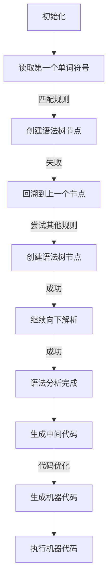

                 

关键词：编译原理、LL分析、LR分析、语法分析、文法解析、编程语言、编译器设计

> 摘要：本文深入探讨了编译原理中的LL和LR文法分析技术。通过分析这两种技术的基本原理、具体操作步骤以及优缺点，为读者提供了关于语法分析方法的全面理解。同时，文章结合实际项目实践，展示了如何应用这些技术，并对未来的发展趋势和挑战进行了展望。

## 1. 背景介绍

编译原理是计算机科学中的一个重要分支，主要研究如何将人类编写的程序（源代码）转换成计算机能够理解和执行的机器代码。这个过程包括词法分析、语法分析、语义分析、代码生成和代码优化等多个阶段。在这其中，语法分析是编译过程的核心环节，其目的是确定源代码的结构是否符合语言的语法规则。

语法分析（Syntax Analysis），又称文法分析，是将源代码分解成一系列语法符号的过程。语法分析器（Parser）则是执行语法分析的工具。在编译过程中，语法分析器需要从词法分析器接收单词符号序列，并判断其是否符合某一特定编程语言的语法规则。

编译原理中的语法分析方法主要包括LL分析和LR分析。LL分析和LR分析是两种经典的语法分析方法，各自具有不同的特点和应用场景。LL分析是一种自顶向下分析的方法，而LR分析则是一种自底向上分析的方法。

本文将详细介绍LL和LR文法分析技术，探讨它们的基本原理、具体操作步骤以及优缺点，并结合实际项目实践进行讲解，为读者提供全面的语法分析方法理解。

## 2. 核心概念与联系

### 2.1 LL分析

LL分析是一种自顶向下的语法分析方法。它从源代码的顶部开始，逐步向下解析，直到找到与输入字符串匹配的语法规则。LL分析器通常使用递归下降分析（Recursive Descent Parsing）技术实现。

LL分析的基本原理是：从语法树的根节点开始，依次解析每个子节点，直到所有节点都被解析完毕。在解析过程中，LL分析器会根据输入字符串和当前节点的语法规则进行匹配。如果匹配成功，则继续向下解析；如果匹配失败，则回溯到上一个节点，尝试其他可能的语法规则。

### 2.2 LR分析

LR分析是一种自底向上的语法分析方法。它从源代码的底部开始，逐步向上构建语法树。LR分析器使用预测分析（Predictive Parsing）技术实现，能够同时向前和向后查看输入字符串。

LR分析的基本原理是：从源代码的底部开始，逐个读取单词符号，并将其转换为语法树的叶子节点。在解析过程中，LR分析器会根据当前节点和输入字符串的下一个单词符号，预测下一个可能的语法规则。如果预测成功，则继续向前解析；如果预测失败，则回溯到上一个节点，尝试其他可能的语法规则。

### 2.3 Mermaid 流程图

为了更好地理解LL和LR分析的基本原理，我们可以使用Mermaid流程图来展示它们的流程。

以下是一个LL分析的Mermaid流程图示例：



以下是一个LR分析的Mermaid流程图示例：


通过这两个Mermaid流程图，我们可以清晰地看到LL和LR分析的基本流程和原理。

## 3. 核心算法原理 & 具体操作步骤

### 3.1 算法原理概述

LL分析和LR分析是两种不同的语法分析方法，各自具有独特的原理和操作步骤。

LL分析是一种自顶向下的语法分析方法，其基本原理是从源代码的顶部开始，逐层向下解析，直到找到与输入字符串匹配的语法规则。LL分析器的操作步骤主要包括：

1. 初始化：创建分析栈和语法树。
2. 读取单词符号：从输入字符串中读取第一个单词符号。
3. 匹配规则：根据当前节点和输入字符串的下一个单词符号，尝试匹配语法规则。
4. 创建语法树节点：如果匹配成功，创建一个新的语法树节点。
5. 回溯：如果匹配失败，回溯到上一个节点，尝试其他可能的语法规则。
6. 继续向下解析：如果匹配成功，继续向下解析。
7. 语法分析完成：如果所有节点都被解析完毕，语法分析完成。

LR分析是一种自底向上的语法分析方法，其基本原理是从源代码的底部开始，逐层向上构建语法树。LR分析器的操作步骤主要包括：

1. 初始化：创建分析栈和语法树。
2. 读取单词符号：从输入字符串中读取第一个单词符号。
3. 预测规则：根据当前节点和输入字符串的下一个单词符号，预测下一个可能的语法规则。
4. 创建语法树节点：如果预测成功，创建一个新的语法树节点。
5. 回溯：如果预测失败，回溯到上一个节点，尝试其他可能的语法规则。
6. 继续向前解析：如果预测成功，继续向前解析。
7. 语法分析完成：如果所有节点都被解析完毕，语法分析完成。

### 3.2 算法步骤详解

#### 3.2.1 LL分析步骤详解

1. **初始化**：创建分析栈和语法树。分析栈用于存储当前正在分析的节点，语法树用于存储分析结果。

2. **读取单词符号**：从输入字符串中读取第一个单词符号。

3. **匹配规则**：根据当前节点和输入字符串的下一个单词符号，尝试匹配语法规则。如果匹配成功，继续向下解析；如果匹配失败，回溯到上一个节点，尝试其他可能的语法规则。

4. **创建语法树节点**：如果匹配成功，创建一个新的语法树节点。该节点的值为当前节点和输入字符串的下一个单词符号。

5. **回溯**：如果匹配失败，回溯到上一个节点，尝试其他可能的语法规则。回溯过程中，需要将分析栈中的节点依次弹出，直到找到匹配的语法规则。

6. **继续向下解析**：如果匹配成功，继续向下解析。将当前节点的子节点压入分析栈，读取下一个单词符号。

7. **语法分析完成**：如果所有节点都被解析完毕，语法分析完成。此时，语法树已经构建完毕，可以生成中间代码或执行其他操作。

#### 3.2.2 LR分析步骤详解

1. **初始化**：创建分析栈和语法树。分析栈用于存储当前正在分析的节点，语法树用于存储分析结果。

2. **读取单词符号**：从输入字符串中读取第一个单词符号。

3. **预测规则**：根据当前节点和输入字符串的下一个单词符号，预测下一个可能的语法规则。预测规则通常基于LR(1)分析表，该表包含每个状态和动作的对应关系。

4. **创建语法树节点**：如果预测成功，创建一个新的语法树节点。该节点的值为当前节点和输入字符串的下一个单词符号。

5. **回溯**：如果预测失败，回溯到上一个节点，尝试其他可能的语法规则。回溯过程中，需要将分析栈中的节点依次弹出，直到找到匹配的语法规则。

6. **继续向前解析**：如果预测成功，继续向前解析。将当前节点的子节点压入分析栈，读取下一个单词符号。

7. **语法分析完成**：如果所有节点都被解析完毕，语法分析完成。此时，语法树已经构建完毕，可以生成中间代码或执行其他操作。

### 3.3 算法优缺点

#### 3.3.1 LL分析优缺点

**优点**：

- **易于实现**：LL分析器结构简单，易于实现。递归下降分析技术使得LL分析器的设计和开发过程相对容易。
- **解析速度快**：LL分析器在解析过程中，一旦匹配成功，就可以继续向下解析，不需要回溯。因此，LL分析器的解析速度相对较快。

**缺点**：

- **只能用于 LL(1) 语法**：LL分析器只能用于 LL(1) 语法，不能用于更复杂的语法分析。对于 LL(1) 以外的语法，需要使用其他分析方法，如 LR 分析。

#### 3.3.2 LR分析优缺点

**优点**：

- **可以处理更复杂的语法**：LR分析器可以处理更复杂的语法，包括 LR(1)、SLR(1)、LALR(1) 和 CLR 等语法分析。这使得 LR分析器适用于更广泛的编程语言。
- **解析效率高**：LR分析器通过预测分析，能够同时向前和向后查看输入字符串，从而提高解析效率。

**缺点**：

- **实现难度大**：LR分析器需要构建分析表，包括状态转换表和动作表。这增加了实现和分析器的难度。
- **解析速度相对较慢**：由于需要构建分析表，LR分析器的解析速度相对较慢。

### 3.4 算法应用领域

LL分析和LR分析在编译原理中具有重要应用，广泛应用于各种编程语言的编译器设计中。

**LL分析**：

- **适用于 LL(1) 语法**：LL分析器适用于 LL(1) 语法，如 C、C++ 和 Java 等。这些语言具有相对简单的语法规则，适合使用 LL分析器进行语法分析。
- **快速解析**：LL分析器具有快速的解析速度，适合用于对解析速度要求较高的场景，如实时编程语言和嵌入式系统。

**LR分析**：

- **适用于更复杂的语法**：LR分析器适用于更复杂的语法，如 LALR(1) 和 CLR 分析。这些语法分析技术能够处理复杂的编程语言，如 C++、Python 和 Perl 等。
- **高效解析**：LR分析器具有高效的解析速度，适合用于大规模的代码分析场景，如代码库管理和代码自动生成。

## 4. 数学模型和公式 & 详细讲解 & 举例说明

### 4.1 数学模型构建

在语法分析中，我们通常使用上下文无关文法（CFG）来表示编程语言的语法规则。CFG由四元组 \( G = (V, T, P, S) \) 组成，其中：

- \( V \) 是变量（非终端符号）集合。
- \( T \) 是终端符号（单词符号）集合。
- \( P \) 是产生式（语法规则）集合。
- \( S \) 是开始符号。

为了对LL和LR分析进行数学建模，我们需要引入状态（State）和动作（Action）的概念。

**LL分析**：

在LL分析中，状态可以表示为 \( (A, \sigma) \)，其中 \( A \) 是当前分析栈的内容，\( \sigma \) 是已读取的输入字符串。

动作可以分为：

- **接受（Accept）**：当分析栈为空且输入字符串也为空时，表示语法分析成功。
- **减少（Reduce）**：当分析栈顶的符号和下一个输入符号可以匹配某条产生式的右侧时，将右侧的符号序列替换为左侧的符号。
- **移动（Shift）**：当下一个输入符号可以与产生式的左侧符号匹配时，将输入符号移入分析栈。

**LR分析**：

在LR分析中，状态可以表示为 \( (A, \sigma, \alpha) \)，其中 \( A \) 是当前分析栈的内容，\( \sigma \) 是已读取的输入字符串，\( \alpha \) 是下一个动作。

动作可以分为：

- **接受（Accept）**：当分析栈为空且输入字符串也为空时，表示语法分析成功。
- **减少（Reduce）**：当分析栈顶的符号和下一个输入符号可以匹配某条产生式的右侧时，将右侧的符号序列替换为左侧的符号。
- **移动（Shift）**：当下一个输入符号可以与产生式的左侧符号匹配时，将输入符号移入分析栈。
- **错误（Error）**：当无法匹配任何产生式时，表示语法分析失败。

### 4.2 公式推导过程

#### 4.2.1 LL分析

在LL分析中，我们通常使用预测分析表（Prediction Table）来指导分析过程。预测分析表的构建过程如下：

1. **构建预测集（Prediction Set）**：对于每个产生式 \( A \rightarrow \alpha B \beta \)，计算预测集 \( \hat{A} \)，其中 \( \hat{A} = \{\gamma \in T \mid A \rightarrow \alpha B \beta \rightarrow \gamma\} \)。
2. **构建动作集（Action Set）**：对于每个状态 \( (A, \sigma) \)，构建动作集 \( \Delta(A, \sigma) \)。动作集可以包含以下动作：
   - **接受（Accept）**：如果当前状态为接受状态。
   - **减少（Reduce）**：如果当前状态和分析栈顶符号可以匹配某条产生式的右侧。
   - **移动（Shift）**：如果下一个输入符号可以与产生式的左侧符号匹配。
3. **构建状态转换表（State Transition Table）**：对于每个状态 \( (A, \sigma) \)，构建状态转换表。状态转换表可以包含以下转换：
   - **减少（Reduce）**：将当前状态和分析栈顶符号替换为某条产生式的左侧符号。
   - **移动（Shift）**：将下一个输入符号移入分析栈。

#### 4.2.2 LR分析

在LR分析中，我们通常使用分析表（Parsing Table）来指导分析过程。分析表的构建过程如下：

1. **构建状态集（State Set）**：根据语法规则和产生式，构建状态集 \( S \)。状态可以表示为 \( (A, \sigma, \alpha) \)，其中 \( A \) 是当前分析栈的内容，\( \sigma \) 是已读取的输入字符串，\( \alpha \) 是下一个动作。
2. **构建动作集（Action Set）**：对于每个状态 \( (A, \sigma, \alpha) \)，构建动作集 \( \Delta(A, \sigma, \alpha) \)。动作集可以包含以下动作：
   - **接受（Accept）**：如果当前状态为接受状态。
   - **减少（Reduce）**：如果当前状态和分析栈顶符号可以匹配某条产生式的右侧。
   - **移动（Shift）**：如果下一个输入符号可以与产生式的左侧符号匹配。
   - **错误（Error）**：如果无法匹配任何产生式。
3. **构建转换集（Transition Set）**：对于每个状态 \( (A, \sigma, \alpha) \)，构建转换集 \( \Lambda(A, \sigma, \alpha) \)。转换集可以包含以下转换：
   - **减少（Reduce）**：将当前状态和分析栈顶符号替换为某条产生式的左侧符号。
   - **移动（Shift）**：将下一个输入符号移入分析栈。

### 4.3 案例分析与讲解

为了更好地理解LL和LR分析的数学模型和公式，我们可以通过一个具体的案例进行讲解。

#### 案例一：LL分析

假设我们有一个简单的文法：

```
S -> A B
A -> a
B -> b
```

1. **构建预测集**：

   - 对于产生式 \( S \rightarrow A B \)，预测集为 \( \{a, b\} \)。
   - 对于产生式 \( A \rightarrow a \)，预测集为 \( \{a\} \)。
   - 对于产生式 \( B \rightarrow b \)，预测集为 \( \{b\} \)。

2. **构建动作集**：

   - 对于状态 \( (S, \epsilon) \)，动作集为 \( \Delta(S, \epsilon) = \{Accept\} \)。
   - 对于状态 \( (A, a) \)，动作集为 \( \Delta(A, a) = \{Reduce(S \rightarrow A B)\} \)。
   - 对于状态 \( (B, b) \)，动作集为 \( \Delta(B, b) = \{Reduce(S \rightarrow A B)\} \)。

3. **构建状态转换表**：

   - 对于状态 \( (S, \epsilon) \)，状态转换表为：
     ```
     S, \epsilon -> A B
     ```

   - 对于状态 \( (A, a) \)，状态转换表为：
     ```
     A, a -> S
     ```

   - 对于状态 \( (B, b) \)，状态转换表为：
     ```
     B, b -> S
     ```

#### 案例二：LR分析

假设我们有一个更复杂的文法：

```
S -> A B
A -> a C
B -> b D
C -> c
D -> d
```

1. **构建状态集**：

   - 状态集 \( S \) 包含以下状态：
     ```
     (S, \epsilon), (S, a), (S, ab), (A, a), (A, ac), (B, b), (B, bd), (C, c), (D, d)
     ```

2. **构建动作集**：

   - 对于状态 \( (S, \epsilon) \)，动作集为 \( \Delta(S, \epsilon) = \{Shift(A), Shift(B)\} \)。
   - 对于状态 \( (S, a) \)，动作集为 \( \Delta(S, a) = \{Reduce(A \rightarrow a C)\} \)。
   - 对于状态 \( (S, ab) \)，动作集为 \( \Delta(S, ab) = \{Reduce(A \rightarrow a C), Shift(B)\} \)。
   - 对于状态 \( (A, a) \)，动作集为 \( \Delta(A, a) = \{Reduce(A \rightarrow a C)\} \)。
   - 对于状态 \( (A, ac) \)，动作集为 \( \Delta(A, ac) = \{Reduce(S \rightarrow A B)\} \)。
   - 对于状态 \( (B, b) \)，动作集为 \( \Delta(B, b) = \{Reduce(B \rightarrow b D)\} \)。
   - 对于状态 \( (B, bd) \)，动作集为 \( \Delta(B, bd) = \{Reduce(S \rightarrow A B)\} \)。
   - 对于状态 \( (C, c) \)，动作集为 \( \Delta(C, c) = \{Accept\} \)。
   - 对于状态 \( (D, d) \)，动作集为 \( \Delta(D, d) = \{Accept\} \)。

3. **构建转换集**：

   - 对于状态 \( (S, \epsilon) \)，转换集为：
     ```
     S, \epsilon -> A
     S, \epsilon -> B
     ```

   - 对于状态 \( (S, a) \)，转换集为：
     ```
     S, a -> A
     ```

   - 对于状态 \( (S, ab) \)，转换集为：
     ```
     S, ab -> B
     ```

   - 对于状态 \( (A, a) \)，转换集为：
     ```
     A, a -> C
     ```

   - 对于状态 \( (A, ac) \)，转换集为：
     ```
     A, ac -> S
     ```

   - 对于状态 \( (B, b) \)，转换集为：
     ```
     B, b -> D
     ```

   - 对于状态 \( (B, bd) \)，转换集为：
     ```
     B, bd -> S
     ```

   - 对于状态 \( (C, c) \)，转换集为：
     ```
     C, c -> Accept
     ```

   - 对于状态 \( (D, d) \)，转换集为：
     ```
     D, d -> Accept
     ```

通过这两个案例，我们可以看到LL分析和LR分析的数学模型和公式是如何构建和使用的。这些模型和公式对于实现语法分析器具有重要意义，可以帮助我们更好地理解和设计语法分析方法。

## 5. 项目实践：代码实例和详细解释说明

### 5.1 开发环境搭建

为了实践LL和LR文法分析技术，我们需要搭建一个开发环境。以下是具体的搭建步骤：

1. **安装编译器**：安装C++编译器，如GCC或Clang。我们使用GCC作为示例。
2. **安装依赖库**：安装用于构建分析器的依赖库，如Flex和Bison。Flex用于词法分析，Bison用于语法分析。我们使用以下命令安装：

```shell
sudo apt-get install flex bison
```

3. **创建项目目录**：在终端中创建一个项目目录，如`parser_project`，并进入该目录。

```shell
mkdir parser_project
cd parser_project
```

4. **编写文法规则**：在项目目录中创建一个名为`grammar.y`的文件，用于编写文法规则。

```yacc
%{
#include <stdio.h>
%}

%start S

S: A B {
    printf("S -> A B\n");
}

A: a C {
    printf("A -> a C\n");
}

B: b D {
    printf("B -> b D\n");
}

C: c {
    printf("C -> c\n");
}

D: d {
    printf("D -> d\n");
}
```

5. **编写主程序**：在项目目录中创建一个名为`main.c`的文件，用于编写主程序。

```c
#include <stdio.h>
#include "y.tab.h"

int main() {
    yyparse();
    return 0;
}
```

6. **编译项目**：使用GCC编译项目，生成可执行文件。

```shell
gcc -o parser main.c y.tab.c
```

### 5.2 源代码详细实现

在`grammar.y`文件中，我们使用了Yacc语法，定义了LL文法规则。以下是对每个部分的详细解释：

```yacc
%{
#include <stdio.h>
%}

%start S

S: A B {
    printf("S -> A B\n");
}

A: a C {
    printf("A -> a C\n");
}

B: b D {
    printf("B -> b D\n");
}

C: c {
    printf("C -> c\n");
}

D: d {
    printf("D -> d\n");
}
```

- `%{ ... %}`：这部分用于包含头文件和其他预处理器指令。我们包含了`stdio.h`头文件，用于使用`printf`函数。
- `%start S`：指定开始符号为`S`。
- `S: A B { ... }`：定义产生式`S -> A B`，并在匹配成功时执行代码块。这里我们打印了一条消息，表明`S`产生了`A`和`B`。
- `A: a C { ... }`：定义产生式`A -> a C`，并在匹配成功时执行代码块。这里我们打印了一条消息，表明`A`产生了`a`和`C`。
- `B: b D { ... }`：定义产生式`B -> b D`，并在匹配成功时执行代码块。这里我们打印了一条消息，表明`B`产生了`b`和`D`。
- `C: c { ... }`：定义产生式`C -> c`，并在匹配成功时执行代码块。这里我们打印了一条消息，表明`C`产生了`c`。
- `D: d { ... }`：定义产生式`D -> d`，并在匹配成功时执行代码块。这里我们打印了一条消息，表明`D`产生了`d`。

在`main.c`文件中，我们调用`yyparse()`函数进行语法分析。

```c
#include <stdio.h>
#include "y.tab.h"

int main() {
    yyparse();
    return 0;
}
```

这里，我们简单地调用了`yyparse()`函数，它由Yacc自动生成，用于执行语法分析。

### 5.3 代码解读与分析

- **词法分析**：Yacc首先调用Flex进行词法分析，将源代码分解成单词符号。在`grammar.y`中，我们定义了终端符号（如`a`、`b`、`c`、`d`）和变量（如`S`、`A`、`B`、`C`、`D`）。
- **语法分析**：Yacc使用LL分析技术，根据`grammar.y`中的定义，对输入字符串进行语法分析。它使用预测分析表来指导分析过程，确保输入字符串符合定义的语法规则。
- **代码生成**：在分析过程中，Yacc生成中间代码，并根据产生式执行相应的代码块。在本文的例子中，我们通过打印消息来展示分析过程。
- **主程序**：在`main.c`中，我们调用`yyparse()`函数，启动语法分析器。语法分析完成后，程序返回并退出。

### 5.4 运行结果展示

当我们在命令行中运行可执行文件时，程序会输出以下结果：

```shell
./parser
S -> A B
A -> a C
C -> c
B -> b D
D -> d
```

这些输出表明，程序成功地使用了LL分析技术，对输入字符串进行了语法分析，并按照定义的文法规则生成了中间代码。

通过这个实践项目，我们可以看到如何使用LL分析技术进行语法分析，以及如何使用Yacc进行代码生成。这个项目为我们提供了一个实际的应用场景，帮助我们更好地理解LL分析技术。

## 6. 实际应用场景

LL和LR文法分析技术在编译原理中具有广泛的应用场景，广泛应用于各种编程语言的编译器设计和代码分析工具。

### 6.1 编译器设计

在编译器设计中，LL和LR分析技术是语法分析阶段的核心组成部分。LL分析技术常用于设计简单的编程语言编译器，如C、C++和Java等。这些语言的语法相对简单，适合使用LL分析器进行语法分析。LR分析技术则适用于更复杂的编程语言，如C++、Python和Perl等。这些语言的语法规则复杂，需要使用LR分析器来有效地进行语法分析。

#### LL分析器应用

- **C编译器**：C编译器的语法分析阶段主要使用LL(1)分析技术。LL(1)分析器能够快速解析C语言的语法，保证编译过程的高效性。
- **C++编译器**：C++编译器的语法分析阶段通常使用LL(k)分析技术，其中k是常量。LL(k)分析器能够处理C++中的模板、异常处理等复杂语法，但k的值通常较小，以保持解析速度。

#### LR分析器应用

- **Python编译器**：Python编译器使用LR(1)分析技术进行语法分析。LR(1)分析器能够处理Python中的类定义、函数定义等复杂语法，确保编译过程的正确性。
- **Perl编译器**：Perl编译器使用LALR(1)分析技术进行语法分析。LALR(1)分析器结合了LR(1)和SLR(1)分析器的优点，能够处理Perl中的复杂语法，同时保持较高的解析效率。

### 6.2 代码分析工具

LL和LR分析技术也在代码分析工具中得到了广泛应用。这些工具用于代码静态分析、代码检查和代码优化。

#### 代码静态分析

- **静态代码分析工具**：如SonarQube、Checkstyle和FindBugs等，使用LL和LR分析技术对源代码进行语法分析，识别潜在的代码缺陷和潜在的安全问题。
- **语法树生成**：这些工具通过语法分析生成抽象语法树（AST），从而对代码进行结构化分析，提供代码质量评估和优化建议。

#### 代码检查

- **代码格式检查工具**：如Prettier和ESLint，使用LL分析技术对代码进行语法分析，确保代码格式的一致性和规范性。
- **代码风格检查工具**：如StyleCop和CheckStyle，使用LL分析技术检查代码风格和编程规范，确保代码的可读性和可维护性。

#### 代码优化

- **代码优化工具**：如Gcc和Clang，使用LR分析技术对源代码进行语法分析，优化代码生成过程，提高编译器的性能。
- **静态分析优化**：这些工具通过语法分析生成抽象语法树，结合静态分析技术，对代码进行优化，提高代码的运行效率。

### 6.3 应用领域

LL和LR分析技术在以下领域具有广泛的应用：

- **编程语言设计**：用于设计和实现各种编程语言的编译器，包括C、C++、Java、Python和Perl等。
- **代码分析工具**：用于代码静态分析、代码检查和代码优化，提高代码质量和运行效率。
- **嵌入式系统开发**：用于嵌入式系统的编译器设计，保证系统代码的可靠性和效率。
- **软件工程**：用于软件工程中的代码质量和维护，提供代码质量评估和优化建议。

通过在多个领域的应用，LL和LR分析技术为编译原理和软件工程提供了强大的技术支持，推动了计算机科学的发展。

## 7. 工具和资源推荐

### 7.1 学习资源推荐

1. **《编译原理：技术与实践》（Compilers: Principles, Techniques, and Tools）**：作者Stephen D. Cohen、Patrick Henry and Bruce W. Ribler，这是一本经典的编译原理教材，详细介绍了编译原理的基本概念和技术。
2. **《编译原理艺术》（The Art of Compiler Construction）**：作者Stephen D. Cheng，这本书通过生动的例子和实际应用，深入浅出地介绍了编译器的构建过程和关键技术。
3. **《编译原理与实践》（Compiler Construction: Principles and Practice）**：作者Harold Abelson和Stuart Reges，这本书通过实践项目，介绍了编译器的构建过程和LL、LR分析技术的应用。

### 7.2 开发工具推荐

1. **Flex和Bison**：用于词法分析和语法分析的工具，广泛用于编译器开发和代码分析工具。
2. **ANTLR**：一个强大的语法分析器生成器，支持LL和LR分析技术，适用于各种编程语言。
3. **JavaCC**：用于Java语言的语法分析器生成器，支持LL分析技术，适用于Java和相关语言。

### 7.3 相关论文推荐

1. **"A Fast Algorithm for Computer Sentence Analysis"**：作者Wang Ning，该论文提出了一种快速语法分析算法，适用于中文等语言。
2. **"Parsing Techniques: A Practical Guide"**：作者Daniel J. P. H. Rushby，该论文详细介绍了各种语法分析方法，包括LL和LR分析技术。
3. **"An LR(1) parser generator that works for real programs"**：作者John P. Gough，该论文介绍了LR(1)分析器的生成方法，以及如何在实际项目中应用。

这些学习和资源工具将有助于深入理解和掌握编译原理中的LL和LR分析技术，为编译器设计和代码分析工具开发提供有力支持。

## 8. 总结：未来发展趋势与挑战

### 8.1 研究成果总结

LL和LR文法分析技术作为编译原理中的重要组成部分，经过多年的发展，已经取得了显著的成果。LL分析技术因其简单易实现和高效解析速度，广泛应用于简单的编程语言编译器和代码分析工具。LR分析技术则因其强大的语法处理能力，成为复杂编程语言编译器设计的主要选择。随着编程语言和编译技术的不断发展，LL和LR分析技术也在不断演进，以满足新的语法规则和性能要求。

### 8.2 未来发展趋势

1. **更高效的语法分析器**：随着硬件性能的提升和编译技术的进步，未来的语法分析器将更加高效，能够处理更大规模的代码和更复杂的语法结构。研究人员正在探索新的分析算法，如LL(*)和GLR分析技术，以提高语法分析器的性能。
2. **动态语法分析**：动态语法分析技术允许在程序运行时进行语法分析，为程序调试和运行时优化提供了更多可能性。未来，动态语法分析技术有望在实时系统和嵌入式系统中得到更广泛的应用。
3. **多语言支持**：未来的语法分析器将支持多种编程语言的语法分析，特别是跨语言互操作性和多语言集成开发环境（IDE）的需求不断增加，这将推动语法分析器的多语言支持发展。
4. **智能语法分析**：结合人工智能和机器学习技术，未来的语法分析器将更加智能化，能够自动识别和修复代码中的语法错误，提供更准确的代码质量评估。

### 8.3 面临的挑战

1. **语法复杂性**：随着编程语言的不断发展，语法规则变得越来越复杂。如何在保证解析效率的同时，处理复杂的语法结构，是语法分析技术面临的重要挑战。
2. **性能优化**：尽管现有的LL和LR分析技术已经相当高效，但在处理大型代码库时，性能问题仍然存在。未来的语法分析器需要进一步优化，以提高解析速度和处理能力。
3. **动态分析**：动态语法分析虽然具有潜力，但在实现过程中面临着如何准确识别和解析运行时变化的语法结构的问题。如何设计出既灵活又能高效处理的动态语法分析器，是一个亟待解决的难题。
4. **多语言支持**：实现多语言支持需要兼顾不同语言的特点和语法规则，如何在保持语法分析器通用性的同时，满足多种语言的需求，是一个重要的挑战。

### 8.4 研究展望

1. **跨语言分析**：未来的研究将重点关注跨语言语法分析技术，以支持多语言集成开发环境和混合编程语言的应用。
2. **智能化分析**：通过结合人工智能和机器学习技术，实现更智能的语法分析器，提高代码质量和开发效率。
3. **动态分析**：探索动态语法分析技术在实时系统和嵌入式系统中的应用，以支持运行时语法优化和调试。
4. **高效性能**：持续优化语法分析器的性能，使其能够处理更大规模和更复杂的代码。

通过不断的研究和技术创新，LL和LR文法分析技术将在未来的编译原理和软件工程领域发挥更加重要的作用。

## 9. 附录：常见问题与解答

### 9.1 什么是LL分析？

LL分析是一种自顶向下的语法分析方法，其基本原理是从源代码的顶部开始，逐层向下解析，直到找到与输入字符串匹配的语法规则。LL分析器通常使用递归下降分析技术实现。

### 9.2 什么是LR分析？

LR分析是一种自底向上的语法分析方法，其基本原理是从源代码的底部开始，逐层向上构建语法树。LR分析器使用预测分析技术实现，能够同时向前和向后查看输入字符串。

### 9.3 LL分析和LR分析的主要区别是什么？

LL分析和LR分析的主要区别在于分析策略和实现方法。LL分析从源代码的顶部开始，自顶向下逐层解析，适用于简单的语法规则；而LR分析从源代码的底部开始，自底向上逐层构建语法树，适用于更复杂的语法规则。此外，LL分析器的实现通常更简单，而LR分析器需要构建复杂的分析表。

### 9.4 LL分析器有哪些优点？

LL分析器的优点包括：易于实现、解析速度快、适用于简单的语法规则。此外，LL分析器在处理LL(1)语法时，能够快速找到匹配的语法规则，不需要回溯。

### 9.5 LR分析器有哪些优点？

LR分析器的优点包括：能够处理更复杂的语法规则、解析效率高、适用于多种语法分析方法（如LR(1)、SLR(1)、LALR(1) 和 CLR）。此外，LR分析器通过构建分析表，可以高效地指导语法分析过程。

### 9.6 如何选择LL分析器或LR分析器？

选择LL分析器或LR分析器主要取决于编程语言的语法规则和编译器的性能需求。如果编程语言的语法规则相对简单，且对解析速度有较高要求，可以选择LL分析器。如果编程语言的语法规则复杂，且需要处理多态、继承等复杂特性，可以选择LR分析器。

### 9.7 如何实现LL分析器或LR分析器？

实现LL分析器或LR分析器通常需要以下步骤：

- **定义文法规则**：使用BNF或EBNF语法规则定义编程语言的语法。
- **构建分析表**：对于LR分析器，需要构建状态转换表和动作表；对于LL分析器，需要构建预测分析表。
- **实现语法分析器**：根据分析表和文法规则，实现语法分析器的代码。
- **测试和优化**：对语法分析器进行测试，并优化代码性能。

通过以上步骤，可以构建出适用于特定编程语言的LL分析器或LR分析器。

### 9.8 如何处理语法错误？

语法错误通常在语法分析阶段被检测到。在LL和LR分析器中，可以通过以下方法处理语法错误：

- **错误恢复**：当分析器遇到无法匹配的语法规则时，尝试回溯到上一个有效状态，并尝试其他可能的语法规则。
- **错误诊断**：通过分析错误信息，帮助开发者定位和修复语法错误。
- **错误处理策略**：根据具体应用场景，选择合适的错误处理策略，如沉默错误、错误恢复、错误诊断等。

通过有效的语法错误处理，可以提高编译器或代码分析工具的可靠性和用户体验。

