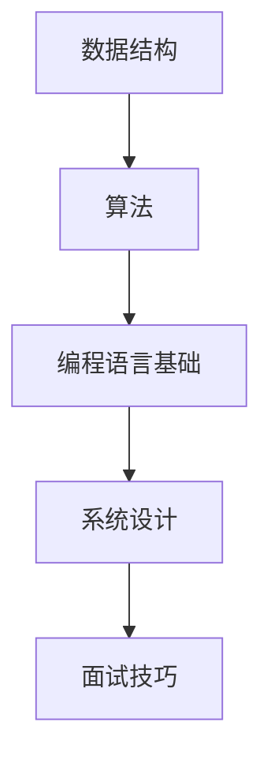

                 

关键词：网易校招、编程面试题、算法、数据结构、编程技巧、面试准备

> 摘要：本文总结了网易2024校招编程面试题的精华，涵盖了数据结构与算法、编程语言基础、系统设计等多个方面。通过对这些题目的深入分析，帮助读者了解校招编程面试的核心要点，提升面试准备效果。

## 1. 背景介绍

随着互联网技术的迅猛发展，各大互联网公司对于高素质的程序员需求日益增长。网易作为中国领先的互联网技术公司之一，每年的校招面试都是众多应届毕业生向往的机会。校招编程面试题不仅考察应聘者的编程能力，还关注其逻辑思维、解决问题的能力和团队协作精神。因此，做好充分的面试准备至关重要。

本文旨在通过对网易2024校招编程面试题的总结，为即将参加校招的同学们提供有针对性的指导，帮助大家更好地应对面试挑战。

## 2. 核心概念与联系

为了帮助读者更好地理解校招编程面试题，我们需要首先了解几个核心概念和它们之间的联系。以下是使用Mermaid绘制的流程图：



### 2.1 数据结构

数据结构是编程的基础，包括数组、链表、栈、队列、树、图等。不同的数据结构具有不同的时间和空间复杂度，选择合适的数据结构是解决问题的关键。

### 2.2 算法

算法是解决问题的方法。常见的算法包括排序算法、查找算法、动态规划、贪心算法等。理解算法的基本原理和常见算法的优化方法，对于编程面试至关重要。

### 2.3 编程语言基础

编程语言是程序员与计算机沟通的桥梁。掌握至少一门主流编程语言（如Java、C++、Python等）是基础。了解编程语言的基本语法、数据类型、控制结构等，有助于快速解决编程问题。

### 2.4 系统设计

系统设计是编程面试中的一个重要方面。它要求应聘者能够设计出高效、可扩展的系统架构，包括分布式系统、缓存机制、负载均衡等。良好的系统设计能力是衡量程序员综合素质的重要标准。

### 2.5 面试技巧

面试技巧包括沟通能力、表达能力、逻辑思维能力等。在面试过程中，清晰、有条理地表达自己的思路，能够给面试官留下深刻印象。

## 3. 核心算法原理 & 具体操作步骤

### 3.1 算法原理概述

在编程面试中，算法的原理通常比较基础，但往往需要灵活应用。以下是几个常见的算法原理：

- 排序算法：冒泡排序、选择排序、插入排序、快速排序、归并排序等。
- 查找算法：二分查找、顺序查找等。
- 动态规划：解决具有重叠子问题和最优子结构的问题。
- 贪心算法：每一步选择局部最优解，最终得到全局最优解。

### 3.2 算法步骤详解

#### 3.2.1 排序算法

排序算法的基本步骤通常包括：

1. 选择一个排序算法（如快速排序）。
2. 对数据进行预处理（如去重、排序等）。
3. 根据排序算法的原理进行排序。
4. 验证排序结果。

#### 3.2.2 查找算法

查找算法的基本步骤通常包括：

1. 选择一个查找算法（如二分查找）。
2. 对数据进行预处理（如构建索引、哈希表等）。
3. 根据查找算法的原理进行查找。
4. 返回查找结果。

#### 3.2.3 动态规划

动态规划的基本步骤通常包括：

1. 确定状态和状态转移方程。
2. 初始化边界条件。
3. 从边界条件开始，逐步求解状态。
4. 得出最终结果。

#### 3.2.4 贪心算法

贪心算法的基本步骤通常包括：

1. 分析问题，确定每一步的贪心选择。
2. 按照贪心策略进行选择。
3. 根据问题特性进行剪枝。
4. 得出最终结果。

### 3.3 算法优缺点

不同的算法在时间复杂度、空间复杂度、适用场景等方面有各自的优缺点。以下是一些常见算法的优缺点：

- 冒泡排序：简单易懂，但效率较低，适用于小规模数据。
- 快速排序：平均时间复杂度低，但最坏情况下效率较低。
- 归并排序：时间复杂度稳定，但需要额外的空间。
- 二分查找：适用于有序数据，时间复杂度低。
- 动态规划：适用于具有重叠子结构和最优子结构的问题。
- 贪心算法：适用于每一步选择局部最优解的问题。

### 3.4 算法应用领域

算法广泛应用于计算机科学的各个领域，包括但不限于：

- 计算机图形学：路径规划、光照计算等。
- 人工智能：搜索算法、优化算法等。
- 数据库：索引结构、查询优化等。
- 网络通信：路由算法、流量控制等。

## 4. 数学模型和公式 & 详细讲解 & 举例说明

### 4.1 数学模型构建

数学模型是描述现实世界问题的一种抽象方式。构建数学模型的基本步骤包括：

1. 确定问题的目标。
2. 收集相关的数据。
3. 建立变量和参数。
4. 构建方程或公式。

### 4.2 公式推导过程

以动态规划中的斐波那契数列为例，其公式推导过程如下：

递推关系：`F(n) = F(n-1) + F(n-2)`，其中`F(0) = 0`，`F(1) = 1`

推导过程：

- `F(2) = F(1) + F(0) = 1`
- `F(3) = F(2) + F(1) = 2`
- `F(4) = F(3) + F(2) = 3`
- ...

由此可以得到一般形式：

`F(n) = (1/sqrt(5)) * [((1+sqrt(5))/2)^n - ((1-sqrt(5))/2)^n]`

### 4.3 案例分析与讲解

以“背包问题”为例，其数学模型和公式如下：

假设有一个容量为`C`的背包，和`N`种物品，每种物品的体积为`V_i`，价值为`W_i`。目标是选择一些物品放入背包中，使得背包的总体积不超过`C`，且总价值最大。

数学模型：

最大化 `W = Σ(W_i * x_i)`，其中 `x_i` 表示物品`i`的选取数量，满足约束条件：`Σ(V_i * x_i) ≤ C`

求解方法：

- 构建一个`N*C`的二维数组`dp`，其中`dp[i][j]`表示前`i`种物品放入容量为`j`的背包中的最大价值。
- 动态规划，依次填充`dp`数组。

## 5. 项目实践：代码实例和详细解释说明

### 5.1 开发环境搭建

为了更好地进行项目实践，我们需要搭建一个合适的开发环境。以下是一个简单的步骤：

1. 安装编程语言（如Python）。
2. 安装集成开发环境（如PyCharm）。
3. 配置必要的依赖库（如NumPy、Pandas等）。

### 5.2 源代码详细实现

以下是一个简单的背包问题的Python代码实现：

```python
import numpy as np

def knapsack(values, weights, capacity):
    n = len(values)
    dp = np.zeros((n+1, capacity+1))

    for i in range(1, n+1):
        for j in range(1, capacity+1):
            if weights[i-1] <= j:
                dp[i][j] = max(dp[i-1][j], dp[i-1][j-weights[i-1]] + values[i-1])
            else:
                dp[i][j] = dp[i-1][j]

    return dp[n][capacity]

values = [60, 100, 120]
weights = [10, 20, 30]
capacity = 50

print(knapsack(values, weights, capacity))
```

### 5.3 代码解读与分析

这段代码实现了一个简单的背包问题。其中，`knapsack`函数接受三个参数：`values`（物品的价值）、`weights`（物品的重量）和`capacity`（背包的容量）。函数使用动态规划的方法，填充一个二维数组`dp`，最终返回背包的最大价值。

### 5.4 运行结果展示

运行上述代码，得到的结果为120。这意味着在容量为50的背包中，选择第二个和第三个物品（价值分别为100和120）可以获得最大的总价值。

## 6. 实际应用场景

编程面试题在实际项目中有着广泛的应用。以下是一些常见应用场景：

- 资源分配：背包问题在资源分配中有着广泛的应用，如任务调度、项目投资等。
- 最优化问题：动态规划和贪心算法在解决最优化问题中有着重要作用，如旅行商问题、图着色问题等。
- 数据分析：排序和查找算法在数据分析中用于数据处理和索引构建。

## 7. 未来应用展望

随着人工智能和大数据技术的发展，编程面试题的应用场景将进一步扩展。以下是一些未来应用展望：

- 智能算法：结合机器学习和深度学习，开发更加智能的算法。
- 跨领域应用：将编程算法应用于更多领域，如生物信息学、金融工程等。
- 自动化测试：使用自动化工具测试算法的正确性和性能。

## 8. 工具和资源推荐

为了更好地准备编程面试，以下是一些工具和资源推荐：

- 学习资源：LeetCode、牛客网、AcWing等在线编程平台。
- 开发工具：PyCharm、VS Code等集成开发环境。
- 论文资源：arXiv、ACM Digital Library等学术资源库。

## 9. 总结：未来发展趋势与挑战

随着技术的不断进步，编程面试题将面临新的发展和挑战。以下是一些未来发展趋势与挑战：

- 算法多样化：更多的算法将被开发和应用，面试题将更加多样化。
- 技术融合：编程与人工智能、大数据等领域的融合将带来新的挑战。
- 面试标准化：为了提高面试效率，越来越多的公司将采用标准化面试流程和工具。

## 10. 附录：常见问题与解答

### 10.1 如何高效准备编程面试？

- 熟悉基础数据结构和算法。
- 做大量的编程练习。
- 针对面试公司的特点进行准备。

### 10.2 编程面试中常见的问题有哪些？

- 数据结构与算法问题。
- 编程语言基础知识。
- 系统设计与架构问题。
- 编码实现问题。

### 10.3 如何提高编程面试的通过率？

- 提高编程技能。
- 做好面试准备。
- 提升沟通能力。

## 11. 参考文献

- 《算法导论》（Introduction to Algorithms）
- 《编程之美》（Programming Pearls）
- 《代码大全》（Code Complete）

作者：禅与计算机程序设计艺术 / Zen and the Art of Computer Programming

----------------------------------------------------------------

以上就是本文的完整内容。通过对网易2024校招编程面试题的深入分析，希望能够帮助读者更好地准备面试，提升自己的编程能力。在未来的编程道路上，愿大家能够不断探索、不断进步。

