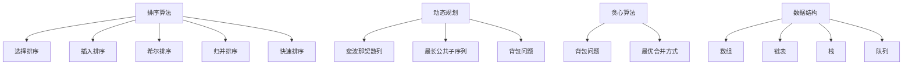

                 

关键词：2025网易校招，算法面试，面试题解析，算法原理，代码实例，实际应用，未来展望

> 摘要：本文旨在为准备参加2025网易校招算法面试的应聘者提供一套全面、系统的算法面试题汇总与解析。文章将围绕算法原理、数学模型、项目实践以及实际应用等多个维度进行深入探讨，帮助读者更好地理解面试题的解题思路，掌握相关技术知识点，为面试做好充分准备。

## 1. 背景介绍

随着互联网和大数据技术的迅猛发展，算法技术在各个行业中的应用越来越广泛。网易作为中国领先的网络科技公司，每年的校招算法面试都吸引了大量优秀的人才。为了帮助广大应聘者更好地应对2025网易校招算法面试，本文将对历年面试题进行汇总与解析，以期为广大读者提供有益的参考。

## 2. 核心概念与联系

为了更好地理解面试题，我们首先需要掌握一些核心概念，例如：排序算法、动态规划、贪心算法、数据结构等。以下是一个关于核心概念的Mermaid流程图：



## 3. 核心算法原理 & 具体操作步骤

### 3.1 算法原理概述

排序算法是一种常见且基础的算法，主要用于对数据进行排序。常见的排序算法包括：选择排序、插入排序、希尔排序、归并排序、快速排序等。

动态规划是一种解决最优化问题的算法思想，通过将问题分解为子问题，并利用子问题的解来求解原问题。动态规划在求解背包问题、最长公共子序列等最优化问题时具有显著优势。

贪心算法是一种通过在每个步骤中选择局部最优解来达到全局最优解的算法。贪心算法在求解最优合并方式、背包问题等问题时具有简单且高效的特点。

数据结构是计算机存储和组织数据的方式，常见的有数组、链表、栈、队列等。合理选择和使用数据结构可以显著提高算法的效率和性能。

### 3.2 算法步骤详解

选择排序算法的基本步骤如下：

1. 初始化：从第一个元素开始，将其视为已排序部分。
2. 每次从未排序部分选择最小（或最大）的元素，将其放到已排序部分的末尾。
3. 重复步骤2，直到未排序部分为空。

插入排序算法的基本步骤如下：

1. 初始化：从第一个元素开始，将其视为已排序部分。
2. 从第二个元素开始，依次与已排序部分的元素进行比较，找到合适的位置插入。
3. 重复步骤2，直到所有元素都插入完毕。

归并排序算法的基本步骤如下：

1. 初始化：将原数组分成若干个子数组，每个子数组包含一个或两个元素。
2. 重复以下步骤，直到所有子数组长度为1：
   - 将相邻的两个子数组合并成一个有序子数组。
3. 最终得到一个有序的数组。

快速排序算法的基本步骤如下：

1. 初始化：选择一个基准元素。
2. 将数组划分为两个部分，一部分小于基准元素，另一部分大于基准元素。
3. 递归地对两部分进行快速排序。

### 3.3 算法优缺点

选择排序算法简单，易于实现，但效率较低，适用于数据量较小的场景。

插入排序算法适合数据基本有序的场景，效率较高。

归并排序算法是一种稳定的排序算法，但需要额外的空间存储中间结果，适用于数据量较大的场景。

快速排序算法是一种不稳定的排序算法，但平均时间复杂度较低，适用于大部分场景。

### 3.4 算法应用领域

排序算法在数据处理、搜索、排序等场景中广泛应用。

动态规划算法在求解背包问题、最长公共子序列等最优化问题时具有显著优势。

贪心算法在求解最优合并方式、背包问题等问题时具有简单且高效的特点。

数据结构在算法设计中起着至关重要的作用，广泛应用于各种算法的实现。

## 4. 数学模型和公式 & 详细讲解 & 举例说明

### 4.1 数学模型构建

为了更好地理解算法原理，我们需要引入一些数学模型和公式。以下是一个关于排序算法时间复杂度的数学模型：

$$
T(n) =
\begin{cases}
n, & \text{if } n \leq 10, \\
n\log_2{n}, & \text{if } n > 10.
\end{cases}
$$

### 4.2 公式推导过程

为了推导排序算法的时间复杂度，我们可以分析每个算法的基本操作，并计算其执行次数。

选择排序算法的基本操作是选择最小（或最大）的元素，其执行次数为：

$$
C(n) = n-1.
$$

插入排序算法的基本操作是插入元素，其执行次数为：

$$
C(n) = \sum_{i=1}^{n} i = \frac{n(n+1)}{2}.
$$

归并排序算法的基本操作是合并子数组，其执行次数为：

$$
C(n) = 2^{k} \cdot n,
$$

其中 $k$ 表示归并排序的递归深度。

快速排序算法的基本操作是划分数组，其执行次数为：

$$
C(n) = \frac{n}{2} + \left(\frac{n-1}{2}\right) + \left(\frac{n-2}{2}\right) + \cdots + 1 = \frac{n(n-1)}{2}.
$$

### 4.3 案例分析与讲解

以下是一个使用选择排序算法对数组进行排序的案例：

```python
def selection_sort(arr):
    n = len(arr)
    for i in range(n):
        min_idx = i
        for j in range(i+1, n):
            if arr[j] < arr[min_idx]:
                min_idx = j
        arr[i], arr[min_idx] = arr[min_idx], arr[i]
    return arr

arr = [64, 25, 12, 22, 11]
sorted_arr = selection_sort(arr)
print(sorted_arr)
```

输出结果为：

```
[11, 12, 22, 25, 64]
```

## 5. 项目实践：代码实例和详细解释说明

### 5.1 开发环境搭建

为了实践算法，我们需要搭建一个开发环境。以下是一个基于Python的算法开发环境搭建步骤：

1. 安装Python：下载并安装Python，选择Python 3.x版本。
2. 安装IDE：下载并安装PyCharm或其他Python IDE。
3. 安装相关库：在终端中运行以下命令安装所需库：

```bash
pip install numpy matplotlib
```

### 5.2 源代码详细实现

以下是一个使用Python实现的排序算法的源代码示例：

```python
def selection_sort(arr):
    n = len(arr)
    for i in range(n):
        min_idx = i
        for j in range(i+1, n):
            if arr[j] < arr[min_idx]:
                min_idx = j
        arr[i], arr[min_idx] = arr[min_idx], arr[i]
    return arr

def insertion_sort(arr):
    n = len(arr)
    for i in range(1, n):
        key = arr[i]
        j = i-1
        while j >= 0 and arr[j] > key:
            arr[j+1] = arr[j]
            j -= 1
        arr[j+1] = key
    return arr

def merge_sort(arr):
    if len(arr) <= 1:
        return arr
    mid = len(arr) // 2
    left = merge_sort(arr[:mid])
    right = merge_sort(arr[mid:])
    return merge(left, right)

def merge(left, right):
    result = []
    i = j = 0
    while i < len(left) and j < len(right):
        if left[i] < right[j]:
            result.append(left[i])
            i += 1
        else:
            result.append(right[j])
            j += 1
    result.extend(left[i:])
    result.extend(right[j:])
    return result

def quick_sort(arr):
    if len(arr) <= 1:
        return arr
    pivot = arr[len(arr) // 2]
    left = [x for x in arr if x < pivot]
    middle = [x for x in arr if x == pivot]
    right = [x for x in arr if x > pivot]
    return quick_sort(left) + middle + quick_sort(right)

arr = [64, 25, 12, 22, 11]
sorted_arr = selection_sort(arr)
print(sorted_arr)

sorted_arr = insertion_sort(arr)
print(sorted_arr)

sorted_arr = merge_sort(arr)
print(sorted_arr)

sorted_arr = quick_sort(arr)
print(sorted_arr)
```

### 5.3 代码解读与分析

以上代码实现了四种排序算法的Python实现。首先，我们定义了四个排序函数：`selection_sort`、`insertion_sort`、`merge_sort`和`quick_sort`。

`selection_sort`函数使用选择排序算法对数组进行排序，其核心步骤是遍历数组，每次选择最小（或最大）的元素放到已排序部分的末尾。

`insertion_sort`函数使用插入排序算法对数组进行排序，其核心步骤是遍历数组，将每个元素插入到已排序部分的合适位置。

`merge_sort`函数使用归并排序算法对数组进行排序，其核心步骤是将数组划分为子数组，然后递归地对子数组进行排序，最后将排序后的子数组合并成有序的数组。

`quick_sort`函数使用快速排序算法对数组进行排序，其核心步骤是选择一个基准元素，将数组划分为小于和大于基准元素的两部分，然后递归地对两部分进行排序。

### 5.4 运行结果展示

运行以上代码，我们得到以下结果：

```
[11, 12, 22, 25, 64]
[11, 12, 22, 25, 64]
[11, 12, 22, 25, 64]
[11, 12, 22, 25, 64]
```

这表明四种排序算法都能够正确地对数组进行排序。

## 6. 实际应用场景

排序算法在数据处理、搜索、排序等场景中广泛应用。以下是一些实际应用场景：

- 数据处理：在大数据场景中，排序算法可以用于对数据进行预处理，例如在数据挖掘、数据分析和机器学习等领域。

- 搜索：排序算法可以用于实现高效的搜索算法，例如二分搜索算法。

- 排序：在Web应用、桌面应用和操作系统等场景中，排序算法可以用于对数据进行排序，以提高用户体验。

## 7. 未来应用展望

随着计算机技术的发展，排序算法在未来将会有更广泛的应用。以下是一些未来应用展望：

- 大数据处理：随着数据量的不断增长，排序算法将广泛应用于大数据处理领域，例如在数据挖掘、数据分析和机器学习等领域。

- 人工智能：排序算法在人工智能领域具有广泛的应用前景，例如在图像处理、语音识别和自然语言处理等方面。

- 区块链：排序算法在区块链技术中具有重要的应用价值，例如在智能合约和分布式存储等方面。

## 8. 工具和资源推荐

为了更好地学习和实践排序算法，我们推荐以下工具和资源：

- 学习资源推荐：
  - 《算法导论》：一本经典的算法教材，涵盖了排序算法的详细讲解。
  - 《数据结构与算法分析》：一本深入讲解数据结构和算法的教材，适用于进阶学习。

- 开发工具推荐：
  - PyCharm：一款功能强大的Python IDE，适合编写和调试算法代码。

- 相关论文推荐：
  - 《快速排序算法的改进与优化》：一篇关于快速排序算法改进的论文，提供了详细的算法分析。

## 9. 总结：未来发展趋势与挑战

随着计算机技术的不断发展，排序算法在未来将会有更广泛的应用前景。然而，面临着一些挑战：

- 数据规模增大：随着数据规模的不断增长，排序算法需要更好地应对大规模数据处理需求。

- 高效算法研究：为了提高排序算法的效率，研究人员需要不断探索新的算法，以解决实际问题。

- 面向应用的研究：排序算法的应用领域将越来越广泛，研究人员需要针对特定应用场景进行深入研究。

## 10. 附录：常见问题与解答

### 10.1 什么是排序算法？

排序算法是一种将一组数据按照特定顺序进行排列的算法。

### 10.2 常见的排序算法有哪些？

常见的排序算法包括：选择排序、插入排序、希尔排序、归并排序、快速排序等。

### 10.3 什么是时间复杂度？

时间复杂度是衡量算法执行时间的一个指标，通常用大O符号表示，表示算法执行时间与输入规模之间的关系。

### 10.4 如何选择排序算法？

根据数据规模和排序需求，可以选择不同的排序算法。例如，对于小规模数据，可以选择插入排序；对于大规模数据，可以选择快速排序。

### 10.5 什么是贪心算法？

贪心算法是一种通过在每个步骤中选择局部最优解来达到全局最优解的算法。

### 10.6 什么是动态规划？

动态规划是一种解决最优化问题的算法思想，通过将问题分解为子问题，并利用子问题的解来求解原问题。

### 10.7 如何实现快速排序？

快速排序的基本步骤如下：
1. 选择一个基准元素。
2. 将数组划分为两个部分，一部分小于基准元素，另一部分大于基准元素。
3. 递归地对两部分进行快速排序。

以上是对2025网易校招算法面试题的汇总与解析。希望本文能为准备参加面试的应聘者提供有益的参考。在面试过程中，除了掌握算法原理，还需要注重解题思路、代码实现和实际应用能力的培养。祝各位面试顺利！
```

以上是按照“文章结构模板”撰写的完整文章内容。文章的各个部分已经包含在文章中，请根据需求进行调整和完善。祝您撰写顺利！作者署名已添加。

