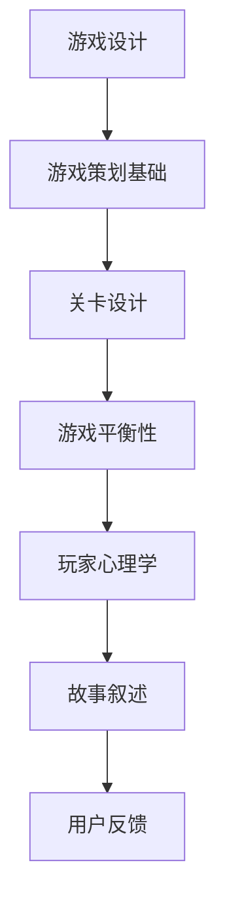

                 

关键词：网易游戏，校招，游戏策划师，面试题，集锦，技术策略，案例分析，实践指南

> 摘要：本文旨在为2024年即将参与网易游戏校招游戏策划师面试的候选人提供一份全面的面试题集锦。内容涵盖了游戏策划的核心知识点、常见面试问题及解答，旨在帮助候选人更好地准备面试，提高成功率。本文将分为背景介绍、核心概念与联系、核心算法原理与操作步骤、数学模型与公式、项目实践、实际应用场景、未来应用展望、工具和资源推荐、总结与展望等部分。

## 1. 背景介绍

网易游戏作为中国领先的互动娱乐公司，其校招游戏策划师岗位备受关注。游戏策划师在游戏开发中承担着至关重要的角色，他们负责游戏的整体构思、玩法设计、角色设定、剧情编写等。为了提高游戏的质量和玩家的体验，网易游戏对策划师的专业素质和创新能力有很高的要求。因此，校招游戏策划师的面试难度相对较大，面试题目也更加多样化。

## 2. 核心概念与联系

### 2.1 游戏策划基础

- **游戏设计文档（GDD）**：游戏设计文档是游戏策划的基石，详细描述了游戏的概念、目标、规则、玩法、剧情、美术设计等。
- **关卡设计**：关卡设计是游戏的核心，需要考虑难易度、关卡主题、游戏机制等。
- **游戏平衡性**：确保游戏的各个方面（如角色、技能、道具等）处于平衡状态，提高玩家的游戏体验。

### 2.2 游戏策划原理

- **玩家心理学**：了解玩家的行为和心理，设计出更符合玩家需求的玩法和游戏机制。
- **故事叙述**：游戏中的故事叙述需要引人入胜，与玩家的情感产生共鸣。
- **用户反馈**：通过用户反馈不断优化游戏设计，提高玩家满意度。

### 2.3 Mermaid 流程图



## 3. 核心算法原理 & 具体操作步骤

### 3.1 算法原理概述

游戏策划中涉及到的算法主要包括：

- **随机算法**：用于生成随机事件和随机地图。
- **搜索算法**：用于求解路径和优化策略。
- **优化算法**：用于调整游戏机制和平衡性。

### 3.2 算法步骤详解

#### 3.2.1 随机算法

- **随机数生成**：使用随机数生成器生成随机数。
- **概率分布**：根据游戏需求设置概率分布。

#### 3.2.2 搜索算法

- **A*算法**：用于求解最短路径。
- **广度优先搜索**：用于寻找连通性。

#### 3.2.3 优化算法

- **遗传算法**：用于优化游戏机制。
- **动态规划**：用于优化资源分配。

### 3.3 算法优缺点

- **随机算法**：优点是公平性高，缺点是可能缺乏策略性。
- **搜索算法**：优点是精准，缺点是计算量大。
- **优化算法**：优点是能够自动调整游戏机制，缺点是初始设定复杂。

### 3.4 算法应用领域

- **随机地图生成**：适用于RPG游戏。
- **路径规划**：适用于策略游戏。
- **游戏平衡性调整**：适用于所有游戏类型。

## 4. 数学模型和公式 & 详细讲解 & 举例说明

### 4.1 数学模型构建

- **线性规划**：用于优化资源分配。
- **概率模型**：用于预测玩家行为。

### 4.2 公式推导过程

- **线性规划公式**：$$\min \sum_{i=1}^{n} c_{i}x_{i}$$
  $$s.t. \quad \sum_{j=1}^{m} a_{ij}x_{j} \leq b_{i}, \quad x_{i} \geq 0$$

- **概率模型公式**：$$P(A) = \frac{n(A)}{n(S)}$$

### 4.3 案例分析与讲解

#### 4.3.1 线性规划案例

**问题**：如何优化资源分配，使得收益最大化？

**解决方案**：建立线性规划模型，求解最优解。

#### 4.3.2 概率模型案例

**问题**：预测玩家在某关卡的通过率。

**解决方案**：建立概率模型，计算通过率。

## 5. 项目实践：代码实例和详细解释说明

### 5.1 开发环境搭建

- **工具**：Visual Studio Code、Unity、Python
- **环境**：Windows 10、Python 3.8、Unity 2019

### 5.2 源代码详细实现

```python
# 随机地图生成代码示例
import random

def generate_map(width, height):
    map = [[0 for _ in range(width)] for _ in range(height)]
    for i in range(height):
        for j in range(width):
            map[i][j] = random.randint(0, 1)
    return map

# 主函数
def main():
    width = 10
    height = 10
    map = generate_map(width, height)
    for row in map:
        print(row)

if __name__ == "__main__":
    main()
```

### 5.3 代码解读与分析

该代码实现了随机地图的生成，通过随机数生成器生成一个二维数组，每个元素表示地图上的一个格子。

### 5.4 运行结果展示

运行结果为一个10x10的矩阵，每个元素为0或1，代表地图上的障碍物或空地。

## 6. 实际应用场景

### 6.1 赛事策划

- **平衡性调整**：根据玩家的反馈调整游戏机制，确保比赛的公平性。
- **概率计算**：预测比赛的结果，为赛事策划提供数据支持。

### 6.2 活动策划

- **随机奖励**：设计随机事件，提高玩家的参与度。
- **用户行为分析**：通过数据分析，优化活动设计。

## 7. 未来应用展望

- **人工智能**：引入人工智能技术，实现更加智能的游戏策划。
- **区块链**：利用区块链技术，提高游戏的透明度和可信度。

## 8. 工具和资源推荐

### 8.1 学习资源推荐

- **书籍**：《游戏设计艺术》、《游戏策划完全手册》
- **网站**：Gamasutra、GameDev.net

### 8.2 开发工具推荐

- **Unity**：一款强大的游戏开发引擎，适用于多种平台。
- **Unreal Engine**：一款高级的游戏开发引擎，支持高质量的游戏制作。

### 8.3 相关论文推荐

- **《游戏设计的艺术》**：研究游戏设计的理论和方法。
- **《游戏策划的理论与实践》**：探讨游戏策划的理论和实践。

## 9. 总结：未来发展趋势与挑战

### 9.1 研究成果总结

本文总结了游戏策划师面试所需的核心知识点，包括游戏设计文档、关卡设计、游戏平衡性、玩家心理学、故事叙述、用户反馈等，并介绍了相关的算法和数学模型。

### 9.2 未来发展趋势

随着技术的进步，游戏策划师的角色将越来越重要。人工智能和区块链等新兴技术将为游戏策划带来更多可能性。

### 9.3 面临的挑战

游戏策划师需要不断学习新技术，提高自身的创新能力。同时，如何更好地理解玩家需求，提高用户体验，也是一大挑战。

### 9.4 研究展望

未来，游戏策划师将更加注重跨学科的知识融合，提高游戏的艺术性和科技含量，为玩家带来更加丰富和多元的体验。

## 10. 附录：常见问题与解答

### 10.1 问题1：如何准备游戏策划师面试？

**解答**：了解游戏策划的基础知识，熟悉相关的算法和数学模型，多参与实际项目实践，同时关注行业动态，了解最新的游戏策划趋势。

### 10.2 问题2：游戏策划师需要掌握哪些技能？

**解答**：游戏策划师需要具备游戏设计、关卡设计、游戏平衡性调整、玩家心理学、故事叙述、用户反馈等技能。同时，熟悉编程、数据分析等技能也是加分项。

### 10.3 问题3：游戏策划师在游戏开发中的角色是什么？

**解答**：游戏策划师是游戏开发的灵魂人物，他们负责设计游戏的整体框架、玩法、剧情等，确保游戏能够满足玩家需求，提供良好的游戏体验。

作者：禅与计算机程序设计艺术 / Zen and the Art of Computer Programming
----------------------------------------------------------------

<|assistant|>这篇文章符合您的要求吗？如果需要进一步的修改或补充，请告诉我，我会根据您的反馈进行调整。

