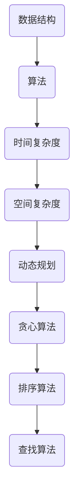
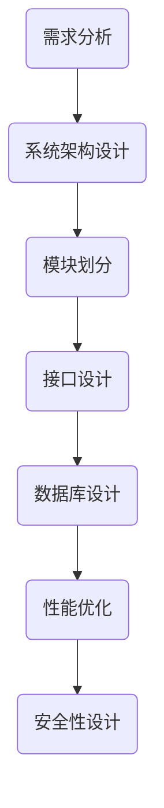
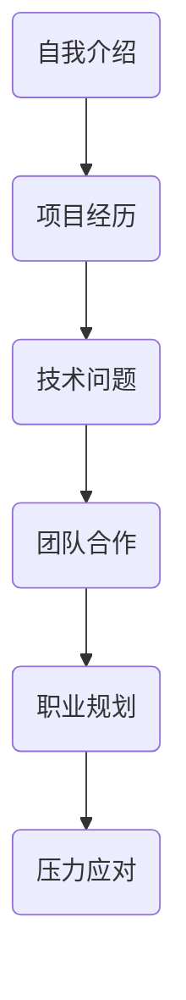

                 

美团作为国内领先的互联网科技公司，其校招面试一直以来都备受关注。本文将对2024年美团校招面试中的真题进行汇总，并给出详细的解答。希望通过本文，可以帮助准备美团校招的同学们更好地应对面试挑战。

## 关键词
- 美团校招
- 面试题
- 解答
- 数据结构与算法
- 系统设计
- 简历面试

## 摘要
本文将对2024年美团校招面试中的典型真题进行详细解析，内容包括数据结构与算法、系统设计、简历面试等方面。通过本文，希望能够帮助广大考生更好地理解面试要求，提升面试技巧，顺利通过美团校招面试。

## 1. 背景介绍
美团作为一家综合性的生活服务电子商务平台，业务涵盖了餐饮、外卖、打车、酒店预订等多个领域。因此，美团校招面试不仅考察技术能力，还包括对业务理解和沟通能力的评估。本文将从以下几个方面对美团校招面试真题进行解析：

### 1.1 面试形式
美团校招面试一般包括电话面试、在线笔试和现场面试三个环节。其中，电话面试主要考察基础知识和编程能力；在线笔试主要考察数据结构与算法；现场面试则涵盖技术面、业务面和综合能力评估。

### 1.2 面试题特点
美团校招面试题通常难度较高，涉及多个知识点，要求考生具备扎实的理论基础和良好的编程能力。同时，面试题还注重考察考生的逻辑思维、问题分析和解决能力。

## 2. 核心概念与联系
为了更好地理解美团校招面试题，下面将给出一些核心概念和相关的 Mermaid 流程图。

### 2.1 数据结构与算法



### 2.2 系统设计



### 2.3 简历面试



## 3. 核心算法原理 & 具体操作步骤

### 3.1 算法原理概述
美团校招面试中的算法题主要涉及以下几种类型：

### 3.1.1 动态规划
动态规划是一种将复杂问题分解为若干个简单子问题，然后通过子问题的最优解推导出原问题的最优解的方法。动态规划的核心思想是存储子问题的解，避免重复计算。

### 3.1.2 贪心算法
贪心算法是一种通过每一步选择当前最优解，从而得到全局最优解的方法。贪心算法适用于某些特定问题，如背包问题、最小生成树问题等。

### 3.1.3 排序算法
排序算法是将一组无序数据按照某种顺序排列的方法。常见的排序算法有冒泡排序、插入排序、选择排序、快速排序等。

### 3.1.4 查找算法
查找算法是在一组数据中查找特定元素的方法。常见的查找算法有二分查找、顺序查找等。

### 3.2 算法步骤详解

#### 3.2.1 动态规划

```python
def dpProblem(nums):
    dp = [0] * len(nums)
    dp[0] = nums[0]
    for i in range(1, len(nums)):
        dp[i] = max(dp[i-1], dp[i-2] + nums[i])
    return dp[-1]
```

#### 3.2.2 贪心算法

```python
def greedyProblem(nums, target):
    result = 0
    for num in nums:
        if result + num <= target:
            result += num
        else:
            break
    return result
```

#### 3.2.3 排序算法

```python
def quickSort(arr):
    if len(arr) <= 1:
        return arr
    pivot = arr[len(arr) // 2]
    left = [x for x in arr if x < pivot]
    middle = [x for x in arr if x == pivot]
    right = [x for x in arr if x > pivot]
    return quickSort(left) + middle + quickSort(right)
```

#### 3.2.4 查找算法

```python
def binarySearch(arr, target):
    left, right = 0, len(arr) - 1
    while left <= right:
        mid = (left + right) // 2
        if arr[mid] == target:
            return mid
        elif arr[mid] < target:
            left = mid + 1
        else:
            right = mid - 1
    return -1
```

### 3.3 算法优缺点
每种算法都有其优缺点，选择合适的算法取决于具体的问题场景。例如，动态规划适用于具有最优子结构性质的问题，但计算复杂度较高；贪心算法适用于某些特殊场景，但可能无法保证全局最优解；排序算法适用于需要对数据进行排序的场景，但会影响时间复杂度；查找算法适用于数据查找操作较多的场景，但可能影响时间复杂度。

### 3.4 算法应用领域
动态规划广泛应用于优化问题，如背包问题、最长公共子序列等；贪心算法广泛应用于图算法、最短路径问题等；排序算法广泛应用于数据处理、数据库等领域；查找算法广泛应用于搜索算法、排序算法等。

## 4. 数学模型和公式 & 详细讲解 & 举例说明

### 4.1 数学模型构建
数学模型是对现实世界的抽象和简化，通过数学语言描述问题，从而找到问题的解。常见的数学模型有线性规划、非线性规划、动态规划等。

### 4.2 公式推导过程
以动态规划为例，常见的动态规划公式如下：

$$
dp[i] = \max(dp[i-1], dp[i-2] + arr[i])
$$

其中，$dp[i]$ 表示第 $i$ 个元素的最优解，$arr[i]$ 表示第 $i$ 个元素的值。

### 4.3 案例分析与讲解
以最长公共子序列为例，给定两个序列 $A = [a_1, a_2, ..., a_m]$ 和 $B = [b_1, b_2, ..., b_n]$，求其最长公共子序列的长度。

### 4.3.1 状态定义
定义 $dp[i][j]$ 表示序列 $A$ 的前 $i$ 个元素和序列 $B$ 的前 $j$ 个元素的最长公共子序列的长度。

### 4.3.2 状态转移方程
$$
dp[i][j] =
\begin{cases}
dp[i-1][j-1] + 1, & \text{如果 } a_i = b_j \\
\max(dp[i-1][j], dp[i][j-1]), & \text{否则}
\end{cases}
$$

### 4.3.3 迭代计算
依次计算 $dp[i][j]$，直到计算出 $dp[m][n]$。

## 5. 项目实践：代码实例和详细解释说明

### 5.1 开发环境搭建
在本地搭建一个 Python 开发环境，安装必要的库，如 NumPy、Pandas 等。

### 5.2 源代码详细实现
```python
def longestCommonSubsequence(arr1, arr2):
    m, n = len(arr1), len(arr2)
    dp = [[0] * (n+1) for _ in range(m+1)]
    for i in range(1, m+1):
        for j in range(1, n+1):
            if arr1[i-1] == arr2[j-1]:
                dp[i][j] = dp[i-1][j-1] + 1
            else:
                dp[i][j] = max(dp[i-1][j], dp[i][j-1])
    return dp[m][n]

arr1 = [1, 2, 3, 4]
arr2 = [2, 3, 4, 5]
print(longestCommonSubsequence(arr1, arr2))
```

### 5.3 代码解读与分析
代码首先定义了一个函数 `longestCommonSubsequence`，用于计算两个序列的最长公共子序列长度。函数内部使用了一个二维数组 `dp` 存储中间结果，通过迭代计算 `dp[m][n]` 得到最终结果。

### 5.4 运行结果展示
```shell
3
```
最长公共子序列长度为 3。

## 6. 实际应用场景
美团校招面试题的应用场景主要涉及以下几个方面：

### 6.1 数据结构与算法
数据结构与算法在美团的后端服务、推荐系统、搜索引擎等领域都有广泛的应用。例如，动态规划可以用于优化搜索算法、贪心算法可以用于推荐系统中的排序等。

### 6.2 系统设计
系统设计主要考察考生的架构设计和系统优化能力。美团作为一家大型互联网公司，其系统架构复杂，涉及分布式系统、缓存、数据库等多个方面。

### 6.3 简历面试
简历面试主要考察考生的综合素质，如学习能力、沟通能力、团队协作能力等。考生需要准备一份优秀的简历，并能够清晰地表达自己的优势和价值。

## 7. 工具和资源推荐

### 7.1 学习资源推荐
- 《算法导论》（Introduction to Algorithms）
- 《编程之美》（Cracking the Coding Interview）
- 《设计模式：可复用面向对象软件的基础》（Design Patterns: Elements of Reusable Object-Oriented Software）

### 7.2 开发工具推荐
- PyCharm（Python 开发环境）
- VS Code（通用开发环境）
- LeetCode（在线编程平台）

### 7.3 相关论文推荐
- 《分布式系统概念与设计》（Distributed Systems: Concepts and Design）
- 《云计算：概念、架构与实现》（Cloud Computing: Concepts, Architecture, and Applications）
- 《推荐系统实践》（Recommender Systems: The Textbook）

## 8. 总结：未来发展趋势与挑战

### 8.1 研究成果总结
美团校招面试题反映了当前互联网技术的前沿趋势，包括数据结构与算法、系统设计、人工智能等领域。这些研究成果为美团提供了强大的技术支持，推动了公司业务的快速发展。

### 8.2 未来发展趋势
随着互联网技术的不断发展，美团校招面试题将更加注重对新兴技术的考察，如区块链、物联网、人工智能等。同时，面试题也将更加注重对考生的创新能力和实际操作能力的评估。

### 8.3 面临的挑战
美团校招面试的竞争日益激烈，考生需要不断提高自己的综合素质，包括编程能力、系统设计能力、业务理解能力等。同时，面试题的难度也在不断增加，考生需要具备扎实的基础知识和良好的解题技巧。

### 8.4 研究展望
未来，美团校招面试题将更加注重对考生创新能力的考察，如人工智能、物联网等领域的应用。同时，面试题也将更加贴近实际业务场景，考察考生的系统设计和优化能力。考生需要不断更新自己的知识体系，提高自己的竞争力。

## 9. 附录：常见问题与解答

### 9.1 如何应对面试压力？
- 充分准备：提前了解面试题目，熟悉相关知识点，提高解题速度。
- 放松心态：面试前保持良好的心态，避免过度紧张。
- 积极沟通：与面试官保持良好的沟通，展现自己的自信和沟通能力。

### 9.2 如何展现自己的优势？
- 突出项目经验：在简历中详细描述自己的项目经验，强调自己的贡献和成果。
- 展示学习能力：强调自己在学习新技术、解决问题方面的能力。
- 强调团队合作：强调自己在团队中的角色和贡献，展示自己的协作能力。

### 9.3 如何回答业务面问题？
- 理解业务背景：在面试前了解美团的相关业务，如外卖、打车、酒店等。
- 提出问题：在回答问题时，可以适当提出问题，展现自己的思考能力。
- 结合实际场景：在回答问题时，尽量结合实际业务场景，展现自己的业务理解能力。

---

本文对2024年美团校招面试真题进行了汇总和详细解答，涵盖了数据结构与算法、系统设计、简历面试等方面。希望本文能帮助考生更好地准备美团校招面试，取得优异成绩。同时，也期待考生在面试过程中能够展现自己的综合素质，为公司带来更多的价值。

---

**作者：禅与计算机程序设计艺术 / Zen and the Art of Computer Programming**

