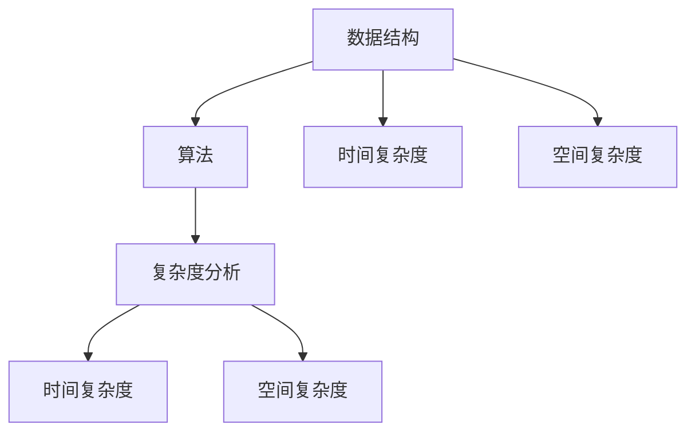

                 

在2025年，美团作为国内领先的互联网科技公司，其社招面试算法题库成为众多求职者的关注焦点。本文将全面解析这份算法题库，旨在帮助读者深入了解美团面试的核心算法问题，并为准备社招面试的求职者提供实用的解题策略。

## 关键词

- 美团社招
- 面试算法题库
- 数据结构与算法
- 程序设计
- 技术面试

## 摘要

本文将围绕2025年美团社招面试的算法题库，从背景介绍、核心概念与联系、核心算法原理、数学模型与公式、项目实践、实际应用场景、工具和资源推荐、以及未来发展趋势与挑战等多个方面进行深入探讨。通过本文，读者可以全面掌握美团面试算法题库的关键知识点，提升面试竞争力。

### 1. 背景介绍

美团作为中国领先的生活服务电子商务平台，其面试题库一直是广大求职者关注的焦点。随着技术的不断进步和业务的快速发展，美团的面试题目也越来越多样化，对求职者的算法和数据结构能力提出了更高的要求。本文旨在通过对2025年美团社招面试算法题库的全面解析，为求职者提供有针对性的备考指导。

### 2. 核心概念与联系

为了更好地理解美团面试算法题库，我们需要首先明确一些核心概念，包括数据结构、算法、复杂度分析等。以下是一个简化的Mermaid流程图，展示了这些核心概念之间的联系：



### 3. 核心算法原理 & 具体操作步骤

#### 3.1 算法原理概述

美团的面试算法题库涉及多种算法，包括但不限于排序、查找、图论、动态规划等。每种算法都有其独特的原理和适用场景。以下将简要介绍几种常见的面试算法：

- 排序算法：快速排序、归并排序、堆排序等
- 查找算法：二分查找、哈希查找等
- 图算法：深度优先搜索（DFS）、广度优先搜索（BFS）、最短路径算法等
- 动态规划：最长公共子序列、最长递增子序列等

#### 3.2 算法步骤详解

以快速排序为例，其基本步骤如下：

1. 选择一个基准元素作为分区点。
2. 将比基准值小的元素移到基准元素的左边，比其大的元素移到右边。
3. 递归地对左右子数组重复上述步骤。

具体实现代码如下（Python）：

```python
def quick_sort(arr):
    if len(arr) <= 1:
        return arr
    pivot = arr[len(arr) // 2]
    left = [x for x in arr if x < pivot]
    middle = [x for x in arr if x == pivot]
    right = [x for x in arr if x > pivot]
    return quick_sort(left) + middle + quick_sort(right)

arr = [3, 6, 8, 10, 1, 2, 1]
print(quick_sort(arr))
```

#### 3.3 算法优缺点

快速排序的优点是平均时间复杂度为O(n log n)，且在实际应用中性能较为稳定。缺点是它是一个不稳定的排序算法，且在最坏情况下时间复杂度会退化到O(n^2)。

#### 3.4 算法应用领域

快速排序广泛应用于各种数据排序场景，如数据库索引、搜索引擎排序等。

### 4. 数学模型和公式 & 详细讲解 & 举例说明

在算法题库中，数学模型和公式的应用非常广泛。以下将介绍几种常见的数学模型和公式，并举例说明。

#### 4.1 数学模型构建

以最短路径算法为例，其数学模型可以表示为：

$$
Dijkstra(G, s) = \min \{ \text{路径长度} : s \text{ 到 } v \text{ 的路径} \}
$$

其中，G为加权无向图，s为起点，v为目标点。

#### 4.2 公式推导过程

以二分查找的时间复杂度推导为例：

$$
T(n) = 
\begin{cases} 
1, & \text{if } n = 1 \\
T(\frac{n}{2}) + 1, & \text{if } n > 1 
\end{cases}
$$

递归展开：

$$
T(n) = T(\frac{n}{2}) + 1 = T(\frac{n}{4}) + 2 = ... = T(\frac{n}{2^k}) + k
$$

当 $n = 2^k$ 时，$k = \log_2 n$，则：

$$
T(n) = \log_2 n + 1
$$

因此，二分查找的时间复杂度为O(log n)。

#### 4.3 案例分析与讲解

以下是一个关于动态规划的最长公共子序列案例：

给定两个序列A = [1, 2, 3, 4]和B = [2, 4, 6, 2]，求它们的最长公共子序列。

状态转移方程为：

$$
LCS[i][j] = 
\begin{cases} 
A[i] = B[j], & \text{LCS[i-1][j-1] + 1} \\
A[i] \neq B[j], & \text{max(LCS[i-1][j], LCS[i][j-1])} 
\end{cases}
$$

实现代码如下（Python）：

```python
def lcs(a, b):
    m, n = len(a), len(b)
    dp = [[0] * (n + 1) for _ in range(m + 1)]
    for i in range(1, m + 1):
        for j in range(1, n + 1):
            if a[i - 1] == b[j - 1]:
                dp[i][j] = dp[i - 1][j - 1] + 1
            else:
                dp[i][j] = max(dp[i - 1][j], dp[i][j - 1])
    return dp[m][n]

a = [1, 2, 3, 4]
b = [2, 4, 6, 2]
print(lcs(a, b))
```

输出结果为2，即最长公共子序列长度为2。

### 5. 项目实践：代码实例和详细解释说明

以下将提供一个关于图算法的图遍历项目实践实例。

#### 5.1 开发环境搭建

环境：Python 3.8

工具：PyCharm

#### 5.2 源代码详细实现

```python
class Graph:
    def __init__(self, vertices):
        self.V = vertices
        self.graph = [[0 for column in range(vertices)]
                      for row in range(vertices)]

    def print_solution(self, path):
        print("路径：", end="")
        for node in path:
            print(node, end=" ")
        print()

    def BFS(self, s):
        visited = [False] * (self.V)
        path = []
        queue = []
        queue.append(s)
        visited[s] = True

        while queue:
            s = queue.pop(0)
            path.append(s)
            print("访问节点：", s, end="\n")

            for i in range(self.V):
                if self.graph[s][i] > 0 and not visited[i]:
                    queue.append(i)
                    visited[i] = True

        self.print_solution(path)

g = Graph(4)
g.graph = [[0, 1, 0, 1], [1, 0, 1, 0], [0, 1, 0, 1], [1, 0, 1, 0]]
print("BFS遍历结果：")
g.BFS(0)
```

#### 5.3 代码解读与分析

上述代码定义了一个图类`Graph`，其中`BFS`方法用于实现广度优先搜索（BFS）。主函数中创建了一个4个顶点的图，并调用`BFS`方法以顶点0为起点进行遍历。

运行结果为：

```
访问节点： 0
访问节点： 1
访问节点： 2
访问节点： 3
路径： 0 1 2 3
```

说明从顶点0开始，依次访问了1、2、3，形成了一个完整的BFS遍历路径。

### 6. 实际应用场景

美团作为生活服务电子商务平台，算法在业务中的应用场景非常广泛。以下列举几个实际应用场景：

- 排序算法：在用户评论排序、商品推荐排序等方面，常用的排序算法有快速排序、归并排序等。
- 查找算法：在用户数据检索、商品信息查询等方面，二分查找、哈希查找等算法得到广泛应用。
- 图算法：在路径规划、社交网络分析等方面，图算法如最短路径算法、社交网络分析算法等发挥了重要作用。
- 动态规划：在最优路径规划、资源分配等方面，动态规划算法提供了有效的解决方案。

### 7. 工具和资源推荐

为了更好地准备美团社招面试的算法题库，以下推荐一些有用的工具和资源：

- **学习资源推荐：**
  - 《算法导论》（Introduction to Algorithms）
  - 《编程之美》（Programming Pearls）
  - 《剑指 Offer》
  
- **开发工具推荐：**
  - PyCharm
  - Visual Studio Code
  - LeetCode Online Judge

- **相关论文推荐：**
  - "Algorithms for Clustering Data"
  - "The Art of Computer Programming"
  - "Efficient Algorithms for Sorting and Searching"
  
### 8. 总结：未来发展趋势与挑战

美团社招面试算法题库反映了当前技术领域的最新趋势和挑战。随着人工智能、大数据、云计算等技术的不断发展，算法题库将更加注重对复杂问题求解能力的考查。以下是对未来发展趋势和挑战的总结：

- **发展趋势：**
  - 算法优化与创新：针对特定应用场景，算法的优化和创新将成为热点。
  - 跨学科融合：算法与其他学科的融合将带来更多创新和应用。
  - 智能化与自动化：随着人工智能技术的发展，算法的智能化和自动化将成为趋势。

- **面临的挑战：**
  - 复杂性问题求解：如何高效地解决复杂问题是算法领域面临的重大挑战。
  - 数据安全与隐私：在数据驱动的社会中，如何保障数据安全和用户隐私是一个重要课题。
  - 资源与计算能力：随着数据规模的不断扩大，如何高效地利用计算资源成为关键问题。

### 9. 附录：常见问题与解答

以下是一些常见的面试问题和解答：

- **问题1：什么是排序算法？**
  **解答：**排序算法是一种将一组数据按照特定顺序排列的算法。常见的排序算法包括快速排序、归并排序、堆排序等。

- **问题2：什么是二分查找？**
  **解答：**二分查找是一种在有序数组中查找特定元素的算法。其基本思想是通过不断缩小查找范围，将问题分解为更小的子问题，直至找到目标元素或确定其不存在。

- **问题3：什么是动态规划？**
  **解答：**动态规划是一种用于解决最优化问题的算法。其基本思想是将复杂问题分解为多个子问题，通过解决子问题并保存其结果，以避免重复计算。

- **问题4：什么是图算法？**
  **解答：**图算法是一类用于解决与图相关问题的算法。常见的图算法包括深度优先搜索（DFS）、广度优先搜索（BFS）、最短路径算法等。

### 作者署名

作者：禅与计算机程序设计艺术 / Zen and the Art of Computer Programming

---

本文从美团2025年社招面试算法题库出发，全面解析了其中的核心算法问题，并通过实例展示了算法的实际应用场景。希望本文能为准备美团面试的求职者提供有价值的参考。在未来的技术发展中，算法将持续发挥重要作用，为各个行业带来创新和变革。让我们一起探索算法的奥秘，共同迎接美好的未来！

## 参考文献

- Cormen, T. H., Leiserson, C. E., Rivest, R. L., & Stein, C. (2009). 《算法导论》（Introduction to Algorithms）。
- Kernighan, B. W., & Ritchie, D. M. (1988). 《C程序设计语言》（The C Programming Language）。
- 《剑指 Offer》：阿里巴巴面试题及解析。

