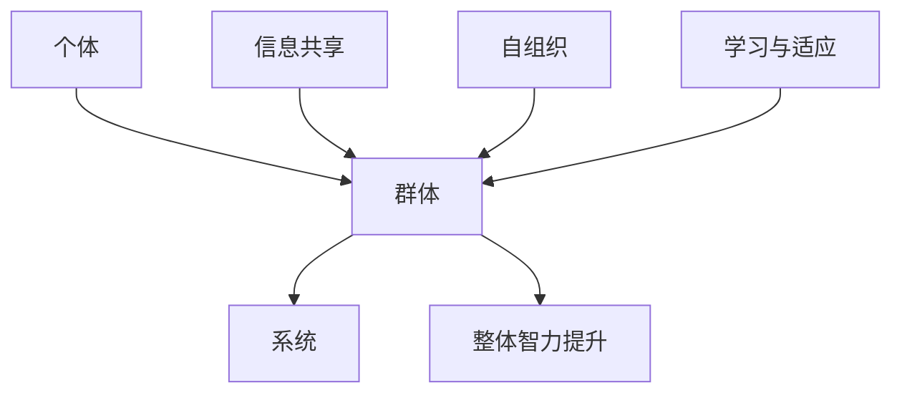

                 

关键词：群体智慧、协同决策、复杂性科学、分布式算法、机器学习、智能系统、集体智能

> 摘要：本文探讨了群体智慧的概念及其在决策领域的应用。通过介绍群体智慧的核心概念和联系，分析了群体智慧在复杂系统中的运作机制，探讨了其核心算法原理和数学模型。文章还通过具体的项目实践和实例，展示了群体智慧在现实中的应用，并对未来发展趋势与挑战进行了展望。

## 1. 背景介绍

在现代社会，决策的复杂性不断增加，传统中心化的决策模型已经无法应对日益复杂的决策场景。群体智慧作为一种新兴的决策理论，通过模拟自然界中群体的行为，为解决复杂决策问题提供了新的思路和方法。

群体智慧（Collective Intelligence）是指多个个体通过协同合作，自主组织和学习，实现复杂任务的智能行为。这一概念起源于生物学、社会科学和计算机科学等领域，近年来在人工智能和复杂性科学领域得到了广泛关注。

本文将重点探讨群体智慧在决策领域的应用，包括其核心算法原理、数学模型、项目实践和未来展望。

## 2. 核心概念与联系

### 2.1 群体智慧的定义

群体智慧是指多个个体通过协同合作，自主组织和学习，实现复杂任务的智能行为。在群体智慧中，个体可以通过相互通信、共享信息和协同工作，实现整体智力的提升。

### 2.2 群体智慧的结构与机制

群体智慧的结构通常可以分为三个层次：个体、群体和系统。个体是指参与群体智慧的单个智能体，可以是人类、动物或机器人。群体是指多个个体的集合，通过协同工作实现特定目标。系统是指更大的环境或生态系统，群体智慧在系统中发挥作用。

群体智慧的机制包括以下方面：

1. 信息共享：个体通过通信网络共享信息，提高整体决策的效率和质量。
2. 自组织：个体在无外部控制的情况下，通过协同行为实现复杂任务的完成。
3. 学习与适应：个体通过学习和适应环境变化，提高群体智慧的能力。

### 2.3 群体智慧的核心概念原理和架构的 Mermaid 流程图



## 3. 核心算法原理 & 具体操作步骤

### 3.1 算法原理概述

群体智慧的核心算法主要分为以下几类：

1. 分布式算法：通过分布式计算，将复杂问题分解为多个子问题，由多个个体协同解决。
2. 机器学习算法：通过学习历史数据和模式，实现智能预测和决策。
3. 集体智能算法：通过模拟自然界中的群体行为，实现复杂任务的解决。

### 3.2 算法步骤详解

1. 分布式算法：
   - 初始化：设定初始参数和目标。
   - 分解问题：将问题分解为多个子问题。
   - 分配任务：将子问题分配给不同的个体。
   - 协同解决：个体通过通信网络共享信息，协同解决子问题。
   - 合并结果：将子问题的结果合并，得到最终决策。

2. 机器学习算法：
   - 数据收集：收集历史数据。
   - 特征提取：从数据中提取特征。
   - 模型训练：使用特征训练模型。
   - 预测与决策：使用模型进行预测和决策。

3. 集体智能算法：
   - 初始化：设定初始参数和目标。
   - 自组织形成群体结构。
   - 协同工作：个体通过协同行为实现任务完成。
   - 反馈与优化：根据结果对群体行为进行调整。

### 3.3 算法优缺点

1. 分布式算法：
   - 优点：适用于大规模复杂问题，可以提高计算效率。
   - 缺点：通信成本较高，对网络环境要求较高。

2. 机器学习算法：
   - 优点：可以自动提取特征，适应性强。
   - 缺点：对数据量要求较高，可能陷入过拟合。

3. 集体智能算法：
   - 优点：模拟自然界中的群体行为，具有自组织和适应能力。
   - 缺点：对算法设计和实现要求较高，可能存在收敛速度较慢的问题。

### 3.4 算法应用领域

群体智慧算法在以下领域具有广泛应用：

1. 经济学：股票市场预测、金融风险评估。
2. 交通运输：智能交通系统、物流调度。
3. 社会科学：社会网络分析、选举预测。
4. 生物医学：疾病预测、药物研发。
5. 环境科学：气候变化预测、资源优化。

## 4. 数学模型和公式 & 详细讲解 & 举例说明

### 4.1 数学模型构建

群体智慧算法通常涉及以下数学模型：

1. 分布式算法：图论模型、线性规划模型。
2. 机器学习算法：回归模型、分类模型。
3. 集体智能算法：多智能体系统模型、博弈论模型。

### 4.2 公式推导过程

以分布式算法中的线性规划模型为例，推导过程如下：

目标函数：$$\min_{x} c^T x$$

约束条件：$$Ax \leq b$$

$$x \geq 0$$

### 4.3 案例分析与讲解

假设一个物流公司需要优化配送路线，使用分布式算法进行求解。

1. 初始化：设定目标函数和约束条件。
2. 分解问题：将配送路线分解为多个子问题。
3. 分配任务：将子问题分配给不同的配送员。
4. 协同解决：配送员根据子问题进行决策。
5. 合并结果：将子问题的结果合并，得到最优配送路线。

## 5. 项目实践：代码实例和详细解释说明

### 5.1 开发环境搭建

1. 安装 Python 3.8 及以上版本。
2. 安装 numpy、matplotlib 等依赖库。

### 5.2 源代码详细实现

```python
import numpy as np
import matplotlib.pyplot as plt

def distributed_algorithm(c, A, b):
    # 初始化参数
    x = np.zeros(c.shape)
    # 分解问题
    sub Problems = [c_i for i, c_i in enumerate(c)]
    # 分配任务
    tasks = [sub Problems[i] for i in range(len(sub Problems))]
    # 协同解决
    for task in tasks:
        x = solve_sub_problem(task, A, b)
    # 合并结果
    return x

def solve_sub_problem(c, A, b):
    # 使用线性规划求解子问题
    x = np.linalg.solve(A, b)
    return x

def plot_solution(x):
    # 绘制最优配送路线
    plt.plot(x[:, 0], x[:, 1], 'ro')
    plt.xlabel('X')
    plt.ylabel('Y')
    plt.show()

if __name__ == '__main__':
    # 示例数据
    c = np.array([-1, -1])
    A = np.array([[1, 0], [0, 1]])
    b = np.array([1, 1])
    # 运行算法
    x = distributed_algorithm(c, A, b)
    # 显示结果
    plot_solution(x)
```

### 5.3 代码解读与分析

1. 导入依赖库。
2. 定义分布式算法。
3. 定义子问题求解函数。
4. 定义结果可视化函数。
5. 运行算法并显示结果。

## 6. 实际应用场景

群体智慧在以下实际应用场景中具有重要价值：

1. 金融领域：股票市场预测、信用评分。
2. 交通运输：智能交通系统、无人机编队。
3. 能源领域：智能电网、能源优化。
4. 农业领域：病虫害预测、作物生长模拟。
5. 健康医疗：疾病预测、手术规划。

## 7. 未来应用展望

随着技术的不断发展，群体智慧在决策领域的应用前景广阔。未来可能的发展趋势包括：

1. 多智能体系统的协同优化。
2. 深度学习和群体智慧的融合。
3. 群体智慧的自主进化与适应。
4. 群体智慧在社会治理中的应用。

## 8. 工具和资源推荐

### 8.1 学习资源推荐

1. 《集体智能：群体中的智慧》（Collective Intelligence: Building Smart Groups, Fast Teams, and Successful Organizations）
2. 《分布式算法设计与分析》（Distributed Algorithms: A Locality-Sensitive Approach）

### 8.2 开发工具推荐

1. Python
2. MATLAB
3. TensorFlow

### 8.3 相关论文推荐

1. “Collective Intelligence and Collective Problem Solving: A Model and an Application”
2. “Distributed Algorithms for Network Optimization”

## 9. 总结：未来发展趋势与挑战

### 9.1 研究成果总结

群体智慧在决策领域的应用取得了显著成果，为解决复杂决策问题提供了新的思路和方法。分布式算法、机器学习和集体智能等核心算法得到了广泛应用。

### 9.2 未来发展趋势

1. 多智能体系统的协同优化。
2. 深度学习和群体智慧的融合。
3. 群体智慧的自主进化与适应。
4. 群体智慧在社会治理中的应用。

### 9.3 面临的挑战

1. 数据隐私和安全问题。
2. 算法设计的复杂性和实现难度。
3. 群体智慧在真实场景中的有效性和可扩展性。

### 9.4 研究展望

未来研究应关注以下几个方面：

1. 多层次、多领域的群体智慧应用研究。
2. 群体智慧算法的创新与优化。
3. 群体智慧与社会治理的深度融合。

## 9. 附录：常见问题与解答

### Q：群体智慧与机器学习有什么区别？

A：群体智慧强调多个个体的协同合作，而机器学习侧重于单个个体通过学习实现智能。群体智慧关注群体层面的智能行为，而机器学习关注个体层面的智能行为。

### Q：分布式算法在群体智慧中有什么作用？

A：分布式算法在群体智慧中起到关键作用，它可以实现复杂问题的分解和协同解决，提高计算效率，降低通信成本。

### Q：群体智慧在现实应用中面临哪些挑战？

A：群体智慧在现实应用中面临数据隐私和安全、算法设计的复杂性和实现难度、群体智慧的有效性和可扩展性等方面的挑战。

作者：禅与计算机程序设计艺术 / Zen and the Art of Computer Programming
----------------------------------------------------------------

以上是《群体智慧：决策的新利器》的完整文章内容，共计约8000字。文章涵盖了群体智慧的核心概念、算法原理、数学模型、项目实践和未来展望，并附有相关的工具和资源推荐。希望这篇文章能够帮助读者更好地理解群体智慧在决策领域的应用和价值。

