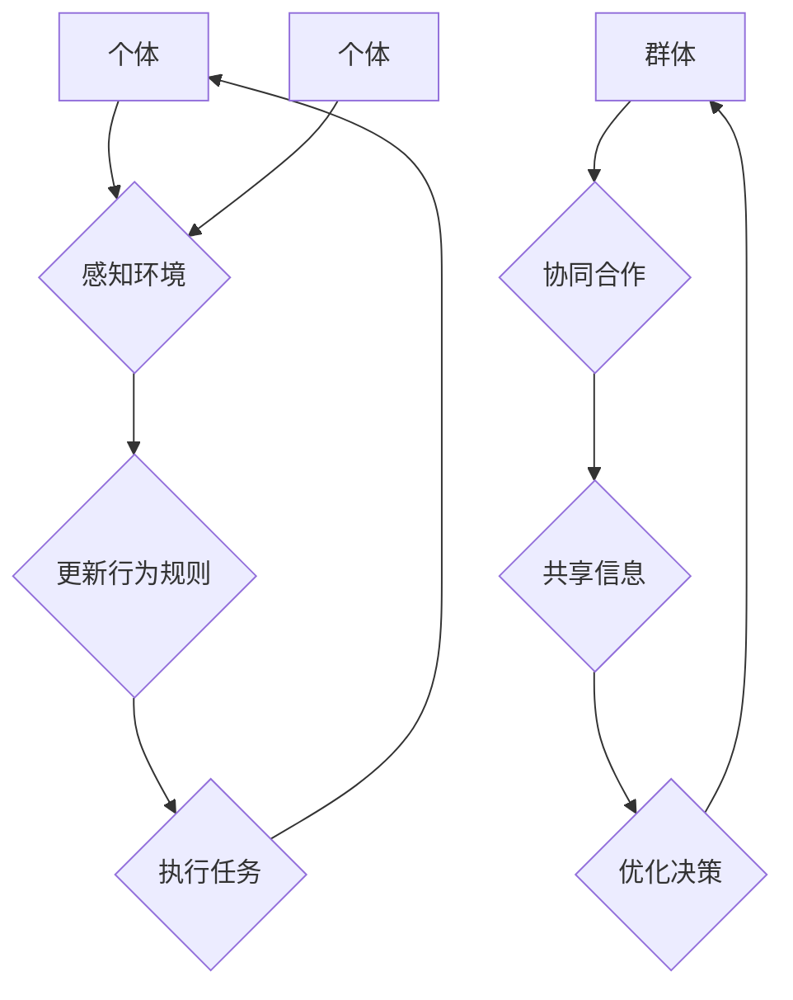

                 

关键词：群体智慧、分布式决策、智能算法、协作、适应性系统

> 摘要：本文旨在探讨群体智慧在决策领域的应用，分析其基本概念、原理、算法和实际案例，同时展望其未来发展趋势和面临的挑战。群体智慧作为一种新兴的决策模式，正逐渐改变着我们的世界。

## 1. 背景介绍

在当今快速变化和高度复杂的环境中，个体往往无法独立应对复杂的决策问题。传统的集中式决策模式在处理大规模、多维度和动态变化的决策问题时显得力不从心。为了解决这一问题，研究人员逐渐将目光投向了群体智慧这一概念。

群体智慧（Swarm Intelligence）是指由一组简单个体通过局部交互和协同合作，实现复杂决策和任务执行的现象。它广泛应用于动物行为、社会昆虫和现代计算机系统等领域。近年来，随着人工智能和分布式计算技术的发展，群体智慧在决策领域的应用逐渐引起了广泛关注。

## 2. 核心概念与联系

### 2.1 基本概念

#### 2.1.1 群体智慧

群体智慧是指由一组简单个体组成的分布式系统，通过局部交互和协同合作，能够实现复杂决策和任务执行。这些个体通常拥有有限的感知能力和简单的行为规则，但通过集体行为，它们能够展现出强大的智能。

#### 2.1.2 分布式决策

分布式决策是指决策过程中，信息处理和决策权力分散到多个节点，通过节点之间的交互和协作，实现整体目标的优化。与集中式决策相比，分布式决策具有更好的鲁棒性、适应性和可扩展性。

### 2.2 原理与架构

为了更好地理解群体智慧在决策中的应用，我们借助Mermaid流程图展示其基本原理和架构。



### 2.3 群体智慧与决策

群体智慧在决策领域的关键作用体现在以下几个方面：

1. **适应性**：群体智慧能够根据环境变化动态调整行为规则，以适应新的决策需求。
2. **鲁棒性**：即使部分个体发生故障或失去联系，整体系统仍能保持稳定运作。
3. **可扩展性**：随着个体数量的增加，群体智慧能够处理更复杂的决策问题。

## 3. 核心算法原理 & 具体操作步骤

### 3.1 算法原理概述

群体智慧的核心算法主要包括以下几种：

1. **粒子群优化算法**（Particle Swarm Optimization, PSO）
2. **蚁群算法**（Ant Colony Optimization, ACO）
3. **遗传算法**（Genetic Algorithm, GA）

这些算法通过模拟自然界的生物行为，实现优化问题的求解。

### 3.2 算法步骤详解

#### 3.2.1 粒子群优化算法

1. **初始化粒子群**：设定粒子的位置、速度和权重。
2. **评估个体和全局最优解**：计算每个粒子的适应度函数值，更新个体最优解和全局最优解。
3. **更新粒子速度和位置**：根据个体最优解和全局最优解，调整粒子的速度和位置。
4. **终止条件**：达到最大迭代次数或适应度达到预设阈值，算法结束。

#### 3.2.2 蚁群算法

1. **初始化**：设定蚁群的初始位置和信息素浓度。
2. **构建可行解**：每个蚂蚁根据信息素浓度和随机性选择路径。
3. **更新信息素**：根据路径的长度和找到的解的质量，更新信息素浓度。
4. **迭代**：重复构建可行解和更新信息素的过程，直至达到终止条件。

#### 3.2.3 遗传算法

1. **初始化种群**：设定初始种群个体的基因编码。
2. **适应度评估**：计算每个个体的适应度函数值。
3. **选择**：根据适应度函数值，选择个体进行交叉和变异。
4. **交叉与变异**：生成新的种群个体。
5. **迭代**：重复适应度评估、选择、交叉和变异的过程，直至达到终止条件。

### 3.3 算法优缺点

#### 3.3.1 粒子群优化算法

**优点**：计算速度快，易于实现，能够处理高维问题。

**缺点**：容易陷入局部最优，需要较大的迭代次数。

#### 3.3.2 蚁群算法

**优点**：具有全局搜索能力，能够处理复杂路径规划问题。

**缺点**：计算复杂度较高，信息素更新规则较难设计。

#### 3.3.3 遗传算法

**优点**：能够处理非线性、连续和离散优化问题。

**缺点**：计算复杂度较高，需要较长的迭代时间。

### 3.4 算法应用领域

群体智慧算法在决策领域具有广泛的应用，包括但不限于：

1. **路径规划**：如无人机编队飞行、车辆路径优化等。
2. **资源分配**：如电力调度、网络资源分配等。
3. **智能调度**：如生产调度、物流调度等。
4. **预测与优化**：如气象预测、股票交易策略等。

## 4. 数学模型和公式 & 详细讲解 & 举例说明

### 4.1 数学模型构建

群体智慧算法通常基于优化问题进行建模，以下为常见的优化问题数学模型：

$$
\begin{aligned}
\min_{x} f(x) \\
\text{subject to} \\
g_i(x) \leq 0, \quad i = 1, 2, \ldots, m \\
h_j(x) = 0, \quad j = 1, 2, \ldots, p
\end{aligned}
$$

其中，$f(x)$为目标函数，$g_i(x)$和$h_j(x)$分别为约束条件。

### 4.2 公式推导过程

以粒子群优化算法为例，其更新公式如下：

$$
\begin{aligned}
v_{i}^{t+1} &= w \cdot v_{i}^{t} + c_1 \cdot r_1 \cdot (p_i^{t} - x_i^{t}) + c_2 \cdot r_2 \cdot (g^* - x_i^{t}) \\
x_{i}^{t+1} &= x_{i}^{t} + v_{i}^{t+1}
\end{aligned}
$$

其中，$v_i^t$为粒子速度，$x_i^t$为粒子位置，$p_i^t$为个体最优解，$g^*$为全局最优解，$w$为惯性权重，$c_1$和$c_2$为学习因子，$r_1$和$r_2$为随机数。

### 4.3 案例分析与讲解

假设我们要优化一个二次函数：

$$
f(x) = x^2
$$

约束条件为：

$$
\begin{aligned}
g_1(x) &= x - 1 \leq 0 \\
g_2(x) &= x + 1 \leq 0
\end{aligned}
$$

我们使用粒子群优化算法求解该问题。初始粒子群如下：

$$
\begin{aligned}
x_1^0 &= [0, 0, 0, 0], \\
x_2^0 &= [1, 1, 1, 1], \\
x_3^0 &= [-1, -1, -1, -1].
\end{aligned}
$$

通过迭代计算，我们可以得到最优解$x^*$，满足约束条件，并使得$f(x^*)$最小。

## 5. 项目实践：代码实例和详细解释说明

### 5.1 开发环境搭建

在本文中，我们将使用Python编写粒子群优化算法，并应用到一个简单的路径规划问题中。首先，我们需要搭建Python开发环境。

1. 安装Python：从Python官方网站（[python.org](https://www.python.org/)）下载并安装Python。
2. 安装必要的库：使用pip命令安装NumPy、Matplotlib等库。

```shell
pip install numpy matplotlib
```

### 5.2 源代码详细实现

以下是一个简单的粒子群优化算法实现，用于求解路径规划问题。

```python
import numpy as np
import matplotlib.pyplot as plt

# 粒子群优化算法参数
w = 0.5
c_1 = 1
c_2 = 2
n_particles = 4
n_dimensions = 2
max_iterations = 100

# 目标函数
def f(x):
    return sum([xi**2 for xi in x])

# 粒子类
class Particle:
    def __init__(self):
        self.position = np.random.uniform(-10, 10, n_dimensions)
        self.velocity = np.random.uniform(-1, 1, n_dimensions)
        self.best_position = self.position.copy()
        self.best_fitness = f(self.position)

    def update_velocity(self, global_best_position):
        r1 = np.random.random()
        r2 = np.random.random()
        cognitive = c_1 * r1 * (self.best_position - self.position)
        social = c_2 * r2 * (global_best_position - self.position)
        self.velocity = w * self.velocity + cognitive + social

    def update_position(self):
        self.position += self.velocity

    def update_best(self):
        current_fitness = f(self.position)
        if current_fitness < self.best_fitness:
            self.best_fitness = current_fitness
            self.best_position = self.position.copy()

# 初始化粒子群
particles = [Particle() for _ in range(n_particles)]
global_best_fitness = float('inf')
global_best_position = None

# 迭代计算
for _ in range(max_iterations):
    for particle in particles:
        particle.update_velocity(global_best_position)
        particle.update_position()
        particle.update_best()
    
    current_global_best_fitness = min([p.best_fitness for p in particles])
    if current_global_best_fitness < global_best_fitness:
        global_best_fitness = current_global_best_fitness
        global_best_position = particles[0].best_position.copy()

# 绘制结果
plt.scatter([p.best_position[0] for p in particles], [p.best_position[1] for p in particles])
plt.plot([global_best_position[0]], [global_best_position[1]], 'ro')
plt.show()
```

### 5.3 代码解读与分析

该代码实现了一个简单的粒子群优化算法，用于求解二维空间中的路径规划问题。主要包含以下部分：

1. **参数设置**：设定粒子群优化算法的参数，如惯性权重、学习因子、粒子数量和迭代次数等。
2. **目标函数**：定义目标函数$f(x)$，用于评估粒子位置的优劣。
3. **粒子类**：定义粒子类，包括粒子的位置、速度、个体最优解和全局最优解等属性，以及更新速度和位置、更新最优解的方法。
4. **初始化粒子群**：随机初始化粒子群的位置和速度。
5. **迭代计算**：通过迭代计算，更新粒子的速度和位置，并更新个体最优解和全局最优解。
6. **绘制结果**：绘制粒子群的位置和全局最优解的位置。

通过运行该代码，我们可以观察到粒子群逐渐收敛到最优解。

## 6. 实际应用场景

群体智慧在决策领域具有广泛的应用场景，以下为几个实际案例：

### 6.1 路径规划

在自动驾驶、无人机编队飞行和物流配送等领域，群体智慧算法可以用于优化路径规划，提高效率和安全性。

### 6.2 资源分配

在电力调度、网络资源分配和云计算等领域，群体智慧算法可以帮助优化资源分配，提高资源利用率和系统性能。

### 6.3 智能调度

在生产和物流调度等领域，群体智慧算法可以优化调度方案，提高生产效率和降低成本。

### 6.4 预测与优化

在气象预测、股票交易和金融风险管理等领域，群体智慧算法可以用于预测市场走势和优化投资策略。

## 7. 未来应用展望

随着人工智能和分布式计算技术的不断发展，群体智慧在决策领域的应用将更加广泛。未来，我们有望看到以下发展趋势：

1. **算法优化**：通过改进算法结构和参数设置，提高群体智慧算法的效率和准确性。
2. **跨领域应用**：探索群体智慧在其他领域的应用，如生物医学、城市规划等。
3. **集成技术**：将群体智慧与其他先进技术（如深度学习、区块链等）相结合，实现更复杂的决策系统。
4. **人机协作**：研究如何将人类智慧与群体智慧相结合，实现更高效的决策过程。

## 8. 工具和资源推荐

### 8.1 学习资源推荐

1. **《群体智能：概念与计算》**：张勇，清华大学出版社，2017年。
2. **《粒子群优化算法与应用》**：曾志宏，机械工业出版社，2013年。

### 8.2 开发工具推荐

1. **Python**：Python是一种易于学习和使用的编程语言，适用于群体智慧算法的开发。
2. **Matlab**：Matlab是一款强大的数学计算和图形化工具，适用于算法验证和仿真。

### 8.3 相关论文推荐

1. **"A Review of Swarm Intelligence"**：Marco Dorigo， Swarm Intelligence，2006年。
2. **"Particle Swarm Optimization: An Overview"**：Marco Dorigo， Swarm Intelligence，1996年。

## 9. 总结：未来发展趋势与挑战

群体智慧作为一种新兴的决策模式，在决策领域具有广阔的应用前景。未来，我们应继续深入研究群体智慧算法的理论基础和应用技术，探索其在各领域的应用潜力。同时，面对算法优化、跨领域应用和人机协作等挑战，我们需不断创新和突破，以实现更高效、更智能的决策系统。

### 9.1 研究成果总结

本文介绍了群体智慧在决策领域的应用，分析了其基本概念、原理、算法和实际案例，并展望了其未来发展趋势。主要研究成果包括：

1. **群体智慧的基本概念与架构**：阐述了群体智慧的定义、分布式决策原理和算法架构。
2. **核心算法原理与实现**：详细介绍了粒子群优化算法、蚁群算法和遗传算法的基本原理、步骤和优缺点。
3. **实际应用案例**：通过路径规划问题展示了粒子群优化算法的应用。
4. **未来发展趋势与挑战**：分析了群体智慧在决策领域的应用前景和面临的挑战。

### 9.2 未来发展趋势

1. **算法优化**：通过改进算法结构和参数设置，提高群体智慧算法的效率和准确性。
2. **跨领域应用**：探索群体智慧在其他领域的应用，如生物医学、城市规划等。
3. **集成技术**：将群体智慧与其他先进技术（如深度学习、区块链等）相结合，实现更复杂的决策系统。
4. **人机协作**：研究如何将人类智慧与群体智慧相结合，实现更高效的决策过程。

### 9.3 面临的挑战

1. **算法优化**：如何设计更高效、更鲁棒的群体智慧算法，以解决复杂决策问题。
2. **跨领域应用**：如何将群体智慧算法应用于不同领域，实现跨领域的有效集成。
3. **数据隐私与安全**：在分布式计算环境中，如何保障数据的安全和隐私。
4. **人机协作**：如何设计更人性化的界面，使人类与群体智慧系统能够更好地协作。

### 9.4 研究展望

未来，我们将继续关注群体智慧在决策领域的研究和应用，探索新的算法和技术，以实现更高效、更智能的决策系统。同时，我们呼吁更多的研究人员和开发者加入这一领域，共同推动群体智慧技术的发展。

### 附录：常见问题与解答

#### 1. 什么是群体智慧？

群体智慧是指由一组简单个体组成的分布式系统，通过局部交互和协同合作，实现复杂决策和任务执行的现象。这些个体通常拥有有限的感知能力和简单的行为规则，但通过集体行为，它们能够展现出强大的智能。

#### 2. 群体智慧算法有哪些？

常见的群体智慧算法包括粒子群优化算法、蚁群算法、遗传算法等。这些算法通过模拟自然界的生物行为，实现优化问题的求解。

#### 3. 群体智慧算法的优势是什么？

群体智慧算法具有以下优势：

1. **适应性**：能够根据环境变化动态调整行为规则，以适应新的决策需求。
2. **鲁棒性**：即使部分个体发生故障或失去联系，整体系统仍能保持稳定运作。
3. **可扩展性**：随着个体数量的增加，群体智慧能够处理更复杂的决策问题。

#### 4. 群体智慧算法在哪些领域有应用？

群体智慧算法在决策领域具有广泛的应用，包括路径规划、资源分配、智能调度、预测与优化等。例如，在自动驾驶、无人机编队飞行、电力调度、网络资源分配等领域，群体智慧算法可以优化路径规划、提高资源利用率和系统性能。

#### 5. 如何学习群体智慧算法？

学习群体智慧算法可以从以下几个方面入手：

1. **基础知识**：学习计算机科学、数学和算法基础知识。
2. **经典教材**：阅读经典教材，如《群体智能：概念与计算》、《粒子群优化算法与应用》等。
3. **实践项目**：通过实践项目，掌握算法的实现和应用。
4. **交流与分享**：参与学术会议、研讨会和在线社区，与其他研究人员和开发者交流分享经验。

### 结语

群体智慧作为一种新兴的决策模式，正逐渐改变着我们的世界。通过本文的介绍，我们希望能让更多的人了解群体智慧的基本概念、原理、算法和应用，激发大家对这一领域的兴趣。未来，让我们携手共进，共同探索群体智慧在决策领域的无限可能。作者：禅与计算机程序设计艺术 / Zen and the Art of Computer Programming

