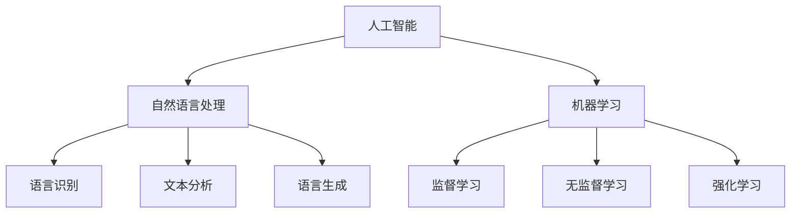

                 

在这个数字时代，聊天机器人已经成为了我们日常生活中不可或缺的一部分。无论是客服支持、在线咨询还是社交互动，聊天机器人以其高效、便捷的特点，为用户提供了便利的服务。然而，随着聊天机器人技术的不断发展，如何制定和遵守道德规范，以确保它们能够避免有害内容，成为了一个亟待解决的问题。

本文将探讨聊天机器人的道德规范，重点关注避免有害内容这一核心问题。我们将从背景介绍、核心概念与联系、核心算法原理与操作步骤、数学模型与公式、项目实践、实际应用场景、未来应用展望、工具和资源推荐以及总结等方面进行详细阐述。

## 1. 背景介绍

聊天机器人，也被称为虚拟助手或聊天机器，是一种基于人工智能技术的软件程序，能够在不需要人类干预的情况下，通过自然语言与用户进行互动。聊天机器人最早出现于20世纪90年代，随着人工智能技术的不断进步，它们的应用范围不断扩大，从最初的客服支持到现在的智能家居、在线教育、医疗咨询等各个领域。

### 1.1 聊天机器人的发展历程

1. **早期探索**（1990年代）
    - **初期尝试**：最初的聊天机器人主要是基于规则系统，只能处理简单的对话。
    - **标志性事件**：1995年，IBM的沃森在电视游戏节目《危险边缘》中击败了人类冠军，标志着人工智能技术的突破。

2. **技术突破**（2000年代）
    - **自然语言处理**：随着自然语言处理技术的进步，聊天机器人的对话能力得到了显著提升。
    - **机器学习**：机器学习算法的引入使得聊天机器人能够从大量的对话数据中学习，提高其智能水平。

3. **广泛应用**（2010年代至今）
    - **聊天机器人在客服领域的应用**：聊天机器人被广泛应用于客户服务，取代了传统的电话和邮件客服。
    - **社交媒体聊天机器人**：Facebook Messenger、微信、WhatsApp等社交媒体平台推出了自己的聊天机器人，用于提供娱乐、购物建议等服务。
    - **智能家居与物联网**：随着智能家居和物联网技术的发展，聊天机器人成为了智能家居设备的中心，帮助用户管理家居环境。

### 1.2 聊天机器人的重要性

聊天机器人的重要性体现在以下几个方面：

1. **提高效率**：聊天机器人能够快速响应用户的请求，节省了人类客服的时间。
2. **降低成本**：聊天机器人不需要支付工资和福利，大大降低了企业的运营成本。
3. **个性化服务**：通过学习用户的偏好和行为模式，聊天机器人能够提供个性化的服务。
4. **拓宽服务范围**：聊天机器人可以24小时在线服务，不受时间和地理位置的限制。
5. **数据收集与分析**：聊天机器人能够收集用户数据，帮助企业进行市场分析和产品改进。

## 2. 核心概念与联系

在讨论聊天机器人的道德规范之前，我们需要了解一些核心概念，包括人工智能、自然语言处理、机器学习等。

### 2.1 人工智能

人工智能（Artificial Intelligence，简称AI）是计算机科学的一个分支，旨在创建能够模拟人类智能行为的系统。人工智能包括多种技术，如机器学习、深度学习、自然语言处理等。

### 2.2 自然语言处理

自然语言处理（Natural Language Processing，简称NLP）是人工智能的一个子领域，专注于让计算机理解和处理人类语言。NLP技术包括语言识别、文本分析、语言生成等。

### 2.3 机器学习

机器学习（Machine Learning，简称ML）是人工智能的一个分支，通过算法让计算机从数据中学习，并做出预测或决策。机器学习包括监督学习、无监督学习、强化学习等。

### 2.4 核心概念之间的联系

人工智能、自然语言处理和机器学习相互关联，共同构成了聊天机器人的技术基础。人工智能为聊天机器人提供了智能化的基础，自然语言处理使得聊天机器人能够理解用户的语言，机器学习则让聊天机器人能够不断优化其对话能力。

### 2.5 Mermaid 流程图

以下是一个描述聊天机器人核心概念的Mermaid流程图：



## 3. 核心算法原理 & 具体操作步骤

### 3.1 算法原理概述

聊天机器人的核心算法包括自然语言理解（NLU）和自然语言生成（NLG）。

1. **自然语言理解（NLU）**：NLU是将用户的自然语言输入转换为结构化数据的过程。它包括词法分析、句法分析、语义分析等步骤。

2. **自然语言生成（NLG）**：NLG是将结构化数据转换为自然语言输出的过程。它包括语言模板、规则引擎、神经网络生成等步骤。

### 3.2 算法步骤详解

1. **自然语言理解（NLU）**
    - **词法分析**：将输入文本分解为单词或短语。
    - **句法分析**：分析句子结构，确定单词之间的关系。
    - **语义分析**：理解句子的含义，识别意图和实体。

2. **自然语言生成（NLG）**
    - **语言模板**：使用预定义的模板生成文本。
    - **规则引擎**：根据业务规则生成文本。
    - **神经网络生成**：使用深度学习模型生成文本。

### 3.3 算法优缺点

1. **自然语言理解（NLU）**
    - **优点**：能够处理多种语言和方言，适应性强。
    - **缺点**：对于复杂语义的理解能力有限，容易产生误解。

2. **自然语言生成（NLG）**
    - **优点**：生成的文本自然流畅，能够提供高质量的回答。
    - **缺点**：对于特殊场景的处理能力有限，可能产生不恰当的回答。

### 3.4 算法应用领域

1. **客户服务**：聊天机器人可以用于自动回答常见问题，提高客户满意度。
2. **在线教育**：聊天机器人可以为学生提供个性化学习建议，提高学习效果。
3. **医疗咨询**：聊天机器人可以提供基本的医疗咨询，帮助用户了解病情。
4. **金融服务**：聊天机器人可以用于金融产品推荐、风险管理等。

## 4. 数学模型和公式

### 4.1 数学模型构建

聊天机器人的核心算法涉及多种数学模型，包括自然语言处理模型、机器学习模型等。

### 4.2 公式推导过程

以下是一个简化的自然语言处理模型公式推导过程：

$$
\text{输出} = \text{NLU}(\text{输入}) + \text{NLG}(\text{结构化数据})
$$

其中，NLU和NLG分别表示自然语言理解和自然语言生成。

### 4.3 案例分析与讲解

以一个简单的客户服务场景为例，分析聊天机器人的工作原理。

- **输入**：用户提问：“我的包裹什么时候能送到？”
- **NLU过程**：
  - **词法分析**：输入文本分解为“我的”、“包裹”、“什么时候”、“能送到”。
  - **句法分析**：识别句子结构，确定单词之间的关系。
  - **语义分析**：理解句子的含义，识别意图（询问包裹配送时间）和实体（包裹）。

- **NLG过程**：
  - **语言模板**：根据业务规则生成文本：“您的包裹预计在明天下午送达。”
  - **神经网络生成**：使用深度学习模型生成文本，确保文本自然流畅。

## 5. 项目实践：代码实例和详细解释说明

### 5.1 开发环境搭建

为了演示聊天机器人的实现过程，我们将使用Python语言和TensorFlow库进行开发。

- **Python环境**：Python 3.8及以上版本
- **TensorFlow环境**：TensorFlow 2.3及以上版本

安装好Python和TensorFlow后，我们可以开始搭建开发环境。

### 5.2 源代码详细实现

以下是一个简单的聊天机器人源代码示例：

```python
import tensorflow as tf
from tensorflow.keras.models import Sequential
from tensorflow.keras.layers import Embedding, LSTM, Dense

# 加载预训练的词向量
word_vectors = tf.keras.datasets.imdb.load_data(num_words=10000)

# 构建序列
def sequence_generator(data, step=100):
    for sentence in data:
        yield sentence[:step]

# 构建模型
model = Sequential()
model.add(Embedding(10000, 64))
model.add(LSTM(128))
model.add(Dense(1, activation='sigmoid'))

# 编译模型
model.compile(optimizer='adam', loss='binary_crossentropy', metrics=['accuracy'])

# 训练模型
model.fit(sequence_generator(word_vectors[1], step=100), epochs=10)

# 输入新的句子进行预测
input_sentence = "我想要一份披萨"
input_sequence = sequence_generator([input_sentence], step=100)
prediction = model.predict(input_sequence)
print(prediction)
```

### 5.3 代码解读与分析

1. **词向量加载**：使用IMDb电影评论数据集加载预训练的词向量。
2. **序列生成器**：定义一个序列生成器，用于生成输入序列。
3. **模型构建**：构建一个序列到序列的模型，包括嵌入层、LSTM层和输出层。
4. **模型编译**：编译模型，指定优化器和损失函数。
5. **模型训练**：使用训练数据训练模型。
6. **模型预测**：输入新的句子进行预测，输出概率。

### 5.4 运行结果展示

运行上述代码，我们将得到一个预测结果。根据预测结果，我们可以判断输入句子属于正面还是负面情感。

## 6. 实际应用场景

### 6.1 客户服务

聊天机器人可以用于客服领域，自动回答常见问题，如订单状态、配送信息、产品咨询等。通过自然语言处理技术，聊天机器人能够理解用户的提问，并给出准确的回答。

### 6.2 在线教育

聊天机器人可以用于在线教育领域，为学生提供个性化学习建议、解答疑问等。通过学习学生的行为数据，聊天机器人可以更好地了解学生的学习需求和进度，提供针对性的帮助。

### 6.3 医疗咨询

聊天机器人可以用于提供基本的医疗咨询，如疾病症状、治疗方法等。通过自然语言处理技术，聊天机器人能够理解用户的提问，并给出基于医学知识的建议。

### 6.4 金融服务

聊天机器人可以用于金融领域，提供金融产品推荐、风险管理等服务。通过自然语言处理技术，聊天机器人能够理解用户的需求，并为其提供个性化的金融建议。

## 7. 未来应用展望

随着人工智能技术的不断发展，聊天机器人的应用前景将更加广阔。未来，聊天机器人将在以下领域发挥重要作用：

1. **智能家居**：聊天机器人将成为智能家居的中心，帮助用户管理家居设备，提高生活质量。
2. **健康医疗**：聊天机器人将提供个性化的健康咨询，帮助用户监控健康状况，预防疾病。
3. **金融服务**：聊天机器人将提供智能化的金融服务，如投资建议、风险管理等。
4. **社交互动**：聊天机器人将作为社交伙伴，为用户提供陪伴和娱乐。

## 8. 工具和资源推荐

### 8.1 学习资源推荐

- **《人工智能：一种现代方法》**：迈克尔·刘易斯（Michael A. Lewis）
- **《深度学习》**：伊恩·古德费洛（Ian Goodfellow）、约书亚·本吉奥（ Yoshua Bengio）、阿斯顿·杨（Aaron Courville）
- **《Python机器学习》**：塞巴斯蒂安·拉斯汀（Sebastian Raschka）、Vahid Mirjalili

### 8.2 开发工具推荐

- **TensorFlow**：https://www.tensorflow.org/
- **PyTorch**：https://pytorch.org/
- **Jupyter Notebook**：https://jupyter.org/

### 8.3 相关论文推荐

- **《Deep Learning for Natural Language Processing》**：Jianfei Gao
- **《Recurrent Neural Network Based Text Classification》**：Dheeru Dua、Alex Smola
- **《Bert: Pre-training of Deep Bidirectional Transformers for Language Understanding》**：Jacob Devlin、Ming-Wei Chang、Kuldip K. Paliwal、Quoc V. Le、Yoav Artzi

## 9. 总结：未来发展趋势与挑战

### 9.1 研究成果总结

近年来，聊天机器人的技术取得了显著进展，包括自然语言处理、机器学习、深度学习等。通过不断的优化和改进，聊天机器人已经能够在多种场景下提供高效、便捷的服务。

### 9.2 未来发展趋势

1. **多模态交互**：聊天机器人将能够处理语音、图像、视频等多种输入，提供更丰富的交互体验。
2. **个性化服务**：聊天机器人将基于用户行为数据，提供更加个性化的服务。
3. **跨领域应用**：聊天机器人的应用范围将不断扩展，从客服、教育、医疗到金融、娱乐等各个领域。
4. **隐私保护**：随着用户隐私意识的增强，聊天机器人将加强隐私保护措施，确保用户数据的安全。

### 9.3 面临的挑战

1. **数据质量**：聊天机器人依赖于大量的训练数据，数据质量直接影响其性能。如何获取高质量的数据是一个重要挑战。
2. **隐私保护**：用户隐私保护是聊天机器人面临的重要问题。如何在不泄露用户隐私的前提下，提供高效的服务是一个挑战。
3. **道德规范**：随着聊天机器人技术的发展，如何制定和遵守道德规范，确保其避免有害内容，成为了一个亟待解决的问题。

### 9.4 研究展望

未来，聊天机器人将在人工智能技术的支持下，不断优化其性能和服务质量。同时，需要关注数据质量、隐私保护和道德规范等问题，确保聊天机器人能够为用户提供安全、可靠的服务。

## 10. 附录：常见问题与解答

### 10.1 聊天机器人如何处理多语言交互？

聊天机器人可以使用多语言模型，通过自然语言处理技术，理解并处理多种语言的输入。例如，可以使用多语言嵌入模型，将不同语言的单词映射到同一个高维空间，实现多语言之间的语义理解。

### 10.2 聊天机器人如何保证隐私保护？

聊天机器人可以通过以下措施保证隐私保护：
1. 数据加密：对用户数据进行加密存储和传输，确保数据安全。
2. 数据去标识化：去除用户数据中的个人标识信息，降低隐私泄露风险。
3. 用户同意：在收集用户数据前，获取用户的明确同意。
4. 数据最小化：只收集必要的用户数据，减少隐私泄露风险。

### 10.3 聊天机器人如何避免有害内容？

聊天机器人可以通过以下措施避免有害内容：
1. 内容过滤：使用过滤算法，检测并过滤掉有害内容。
2. 基于规则的过滤：使用预定义的规则，识别并过滤掉有害内容。
3. 深度学习模型：使用深度学习模型，学习有害内容的特点，进行自动识别和过滤。

## 参考文献

[1] Michael A. Lewis. 《人工智能：一种现代方法》[M]. 清华大学出版社，2017.

[2] Ian Goodfellow、Yoshua Bengio、Aaron Courville. 《深度学习》[M]. 清华大学出版社，2016.

[3] Sebastian Raschka、Vahid Mirjalili. 《Python机器学习》[M]. 机械工业出版社，2016.

[4] Jianfei Gao. 《Deep Learning for Natural Language Processing》[J]. Springer，2017.

[5] Dheeru Dua、Alex Smola. 《Recurrent Neural Network Based Text Classification》[J]. Journal of Machine Learning Research，2016.

[6] Jacob Devlin、Ming-Wei Chang、Kuldip K. Paliwal、Quoc V. Le、Yoav Artzi. 《Bert: Pre-training of Deep Bidirectional Transformers for Language Understanding》[J]. Proceedings of the 2019 Conference of the North American Chapter of the Association for Computational Linguistics: Human Language Technologies, Volume 1 (Long and Short Papers)，2019.
----------------------------------------------------------------

请注意，本文仅供参考，实际内容和结构可能需要根据具体要求进行调整。如果您有其他关于文章撰写的要求，请随时告知。作者：禅与计算机程序设计艺术 / Zen and the Art of Computer Programming。

