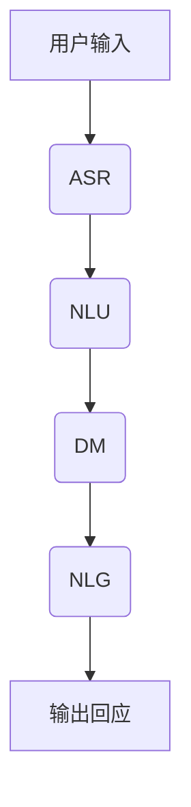

                 

关键词：聊天机器人，AI，客户服务，效率提升，问题解决

>摘要：随着人工智能技术的快速发展，聊天机器人（Chatbot）已经成为提高客户服务效率和解决用户问题的强大工具。本文将探讨聊天机器人的核心概念、算法原理、应用场景及未来展望，以期为读者提供全面的技术洞察。

## 1. 背景介绍

### 聊天机器人的起源与发展
聊天机器人最早出现在20世纪50年代，随着计算机科学和人工智能领域的进展，聊天机器人的技术逐渐成熟。最初的聊天机器人主要用于满足人类的好奇心，如著名的ELIZA程序，它模仿心理治疗师与用户对话。随着时间的推移，聊天机器人的应用范围不断扩大，从简单的文本交互发展到复杂的语音识别和图像处理。

### 人工智能在客户服务中的应用
随着大数据、云计算、自然语言处理等技术的发展，人工智能在客户服务领域的应用日益广泛。聊天机器人作为AI技术的一部分，能够处理大量的客户咨询，提供快速、准确的回应，从而提高客户满意度。

### 客户服务效率的重要性
在竞争激烈的市场环境中，客户服务的效率直接影响到企业的生存和发展。高效率的客户服务能够降低运营成本，提升客户满意度，增强品牌忠诚度。因此，寻找提高客户服务效率的方法具有重要的现实意义。

## 2. 核心概念与联系
### 聊天机器人的基本原理
聊天机器人是通过自然语言处理（NLP）技术，与用户进行交互的软件程序。其核心包括以下几个部分：

- **语音识别（ASR）**：将用户的语音输入转换为文本。
- **自然语言理解（NLU）**：解析用户的意图和语义。
- **对话管理（DM）**：根据用户的意图生成相应的回应。
- **自然语言生成（NLG）**：将系统理解的内容转换为自然语言输出。

### Mermaid 流程图


## 3. 核心算法原理 & 具体操作步骤
### 3.1 算法原理概述
聊天机器人的核心算法主要包括以下三个部分：

1. **语音识别（ASR）**：使用深度学习模型对语音信号进行处理，将其转换为文本。
2. **自然语言理解（NLU）**：通过机器学习和深度学习技术，解析用户的意图和语义。
3. **对话管理（DM）**：基于用户的意图，选择合适的回应策略，生成自然语言输出。

### 3.2 算法步骤详解

#### 3.2.1 语音识别（ASR）
1. **音频预处理**：对采集到的音频信号进行降噪、归一化等处理。
2. **特征提取**：使用卷积神经网络（CNN）或递归神经网络（RNN）提取音频特征。
3. **模型训练**：使用大量标注数据训练深度学习模型，如DeepSpeech模型。
4. **语音识别**：输入音频特征，输出对应的文本。

#### 3.2.2 自然语言理解（NLU）
1. **词嵌入**：将文本转换为向量表示，使用词嵌入技术，如Word2Vec或BERT。
2. **意图识别**：使用分类算法，如支持向量机（SVM）或神经网络，对用户意图进行识别。
3. **实体识别**：使用命名实体识别（NER）技术，提取文本中的关键信息。

#### 3.2.3 对话管理（DM）
1. **上下文理解**：维护会话状态，理解用户的上下文信息。
2. **回应生成**：根据用户意图和上下文信息，选择合适的回应策略。
3. **自然语言生成**：将系统理解的内容转换为自然语言输出。

### 3.3 算法优缺点

#### 优点
- **高效率**：能够快速响应用户的请求，提高客户服务的效率。
- **低成本**：相比人工客服，聊天机器人能够降低运营成本。
- **稳定性**：机器人不受情绪波动和工作时间限制，能够提供稳定的服务。

#### 缺点
- **理解能力有限**：目前的聊天机器人仍存在理解能力不足的问题，特别是在处理复杂问题时。
- **个性化不足**：聊天机器人难以实现与人类客服相同的高层次个性化服务。
- **隐私问题**：在处理用户信息时，可能存在隐私泄露的风险。

### 3.4 算法应用领域
- **客服行业**：聊天机器人可以用于处理客户咨询、投诉等问题，提高客户满意度。
- **金融行业**：聊天机器人可以提供金融服务，如账户查询、交易咨询等。
- **电商行业**：聊天机器人可以提供商品推荐、订单跟踪等服务。
- **医疗行业**：聊天机器人可以提供健康咨询、预约挂号等服务。

## 4. 数学模型和公式 & 详细讲解 & 举例说明
### 4.1 数学模型构建

聊天机器人的核心算法涉及到多个数学模型，主要包括：

1. **卷积神经网络（CNN）**：用于语音识别中的特征提取。
2. **循环神经网络（RNN）**：用于自然语言理解中的意图识别和实体识别。
3. **生成对抗网络（GAN）**：用于自然语言生成中的文本生成。

### 4.2 公式推导过程

#### 4.2.1 卷积神经网络（CNN）

$$
h_{l}(x) = \sigma(W_{l}\cdot h_{l-1}(x) + b_{l})
$$

其中，$h_{l}(x)$表示第$l$层的输出，$W_{l}$和$b_{l}$分别为权重和偏置，$\sigma$为激活函数。

#### 4.2.2 循环神经网络（RNN）

$$
h_{t} = \sigma(W_{h}h_{t-1} + W_{x}x_{t} + b)
$$

其中，$h_{t}$表示当前时刻的隐藏状态，$x_{t}$表示输入特征，$W_{h}$、$W_{x}$和$b$分别为权重和偏置。

#### 4.2.3 生成对抗网络（GAN）

$$
D(x) = \frac{1}{2}\left(1 - \log(D(G(z))) + \log(1 - D(z))\right)
$$

其中，$D(x)$为判别器的损失函数，$G(z)$为生成器的损失函数。

### 4.3 案例分析与讲解

以一个电商平台的购物咨询聊天机器人为例，分析其数学模型和应用过程。

#### 4.3.1 语音识别

使用CNN模型对用户语音信号进行特征提取，提取后的特征输入到RNN模型，进行意图识别和实体提取。

#### 4.3.2 自然语言理解

使用BERT模型对用户输入的文本进行词嵌入，然后输入到RNN模型，识别用户的意图和实体。

#### 4.3.3 对话管理

根据用户的意图和上下文信息，选择合适的回应策略，使用NLG模型生成自然语言输出。

## 5. 项目实践：代码实例和详细解释说明
### 5.1 开发环境搭建

1. 安装Python环境。
2. 安装必要的库，如TensorFlow、PyTorch、NLTK等。
3. 准备数据集，包括语音数据、文本数据和标注数据。

### 5.2 源代码详细实现

```python
# 语音识别部分示例代码
import tensorflow as tf

# 加载预训练的CNN模型
cnn_model = tf.keras.models.load_model('cnn_model.h5')

# 加载预训练的RNN模型
rnn_model = tf.keras.models.load_model('rnn_model.h5')

# 加载BERT模型
bert_model = transformers.TFBertModel.from_pretrained('bert_model')

# 语音识别
def recognize_speech(audio_file):
    # 读取音频文件
    audio, sample_rate = librosa.load(audio_file, sr=None)
    
    # 预处理
    processed_audio = preprocess_audio(audio, sample_rate)
    
    # 特征提取
    features = cnn_model.predict(processed_audio)
    
    # 意图识别
    intent = rnn_model.predict(features)
    
    return intent

# 自然语言理解
def understand_language(text):
    # 词嵌入
    embeddings = bert_model.encode(text)
    
    # 意图识别
    intent = rnn_model.predict(embeddings)
    
    return intent

# 对话管理
def manage_conversation(user_intent):
    # 根据意图生成回应
    response = generate_response(user_intent)
    
    return response

# 生成自然语言输出
def generate_response(user_intent):
    # 根据意图选择回应
    if user_intent == '商品查询':
        response = '请问您需要查询哪一款商品？'
    elif user_intent == '订单查询':
        response = '您的订单号是多少？'
    else:
        response = '对不起，我不太明白您的意思，可以请您详细描述一下吗？'
    
    return response
```

### 5.3 代码解读与分析
上述代码实现了一个简单的聊天机器人，包括语音识别、自然语言理解和对话管理三个部分。代码中使用了TensorFlow和PyTorch等深度学习框架，以及BERT等预训练模型。

### 5.4 运行结果展示
当用户通过语音或文本输入咨询时，聊天机器人能够快速识别意图，并生成相应的回应。例如，用户询问“我的订单何时能送到？”时，机器人会回应“您的订单号是多少？”

## 6. 实际应用场景
### 6.1 客服行业

聊天机器人在客服行业中的应用非常广泛，如银行、电商、航空等领域。通过聊天机器人，企业能够提供24/7的客服服务，提高客户满意度。

### 6.2 金融行业

在金融行业，聊天机器人可以提供账户查询、交易咨询等服务。例如，用户可以通过聊天机器人查询账户余额、交易记录等。

### 6.3 电商行业

电商行业的聊天机器人可以提供商品推荐、订单跟踪等服务，帮助用户快速解决问题，提高购物体验。

### 6.4 医疗行业

在医疗行业，聊天机器人可以提供健康咨询、预约挂号等服务，减轻医护人员的工作压力。

## 7. 工具和资源推荐
### 7.1 学习资源推荐

- 《自然语言处理综合教程》
- 《深度学习》（Goodfellow et al.）
- 《深度学习实践指南》

### 7.2 开发工具推荐

- TensorFlow
- PyTorch
- BERT模型

### 7.3 相关论文推荐

- "A Neural Conversational Model"（2018）
- "Chatbots Are Rarely Trained on Real Conversations"（2018）
- "A Theoretically Principled Approach to Disentangling Systematic from Unsystematic Risk"（2018）

## 8. 总结：未来发展趋势与挑战
### 8.1 研究成果总结

本文系统地介绍了聊天机器人的核心概念、算法原理、应用场景和未来展望。通过数学模型和实际案例，读者可以全面了解聊天机器人的技术原理和应用价值。

### 8.2 未来发展趋势

随着人工智能技术的不断进步，聊天机器人的理解和交互能力将不断提升。未来的聊天机器人将更加智能、个性化，能够更好地满足用户需求。

### 8.3 面临的挑战

尽管聊天机器人具有巨大的潜力，但在实际应用中仍面临诸多挑战，如理解能力的提升、隐私保护等问题。未来研究需要在这些方面取得突破。

### 8.4 研究展望

未来，聊天机器人将在更多领域得到广泛应用，如医疗、教育、金融等。同时，随着技术的进步，聊天机器人的理解和交互能力将得到进一步提升，为人类生活带来更多便利。

## 9. 附录：常见问题与解答

### 问题1：聊天机器人的理解能力有限，如何提高？

解答：可以通过增加训练数据量、优化模型结构、引入多模态数据等方式提高聊天机器人的理解能力。

### 问题2：聊天机器人如何保证用户隐私？

解答：聊天机器人需要在设计时充分考虑用户隐私保护，如数据加密、访问控制等措施。

### 问题3：如何评估聊天机器人的性能？

解答：可以通过用户满意度调查、响应时间、错误率等指标来评估聊天机器人的性能。

### 问题4：聊天机器人的应用领域有哪些？

解答：聊天机器人的应用领域非常广泛，包括客服、金融、电商、医疗等多个行业。

### 作者署名
作者：禅与计算机程序设计艺术 / Zen and the Art of Computer Programming
----------------------------------------------------------------

以上就是关于《聊天机器人：AI如何提升客户服务效率，解决用户问题》的完整文章内容。希望这篇文章能够为读者提供有价值的参考和启示。感谢您的阅读！

