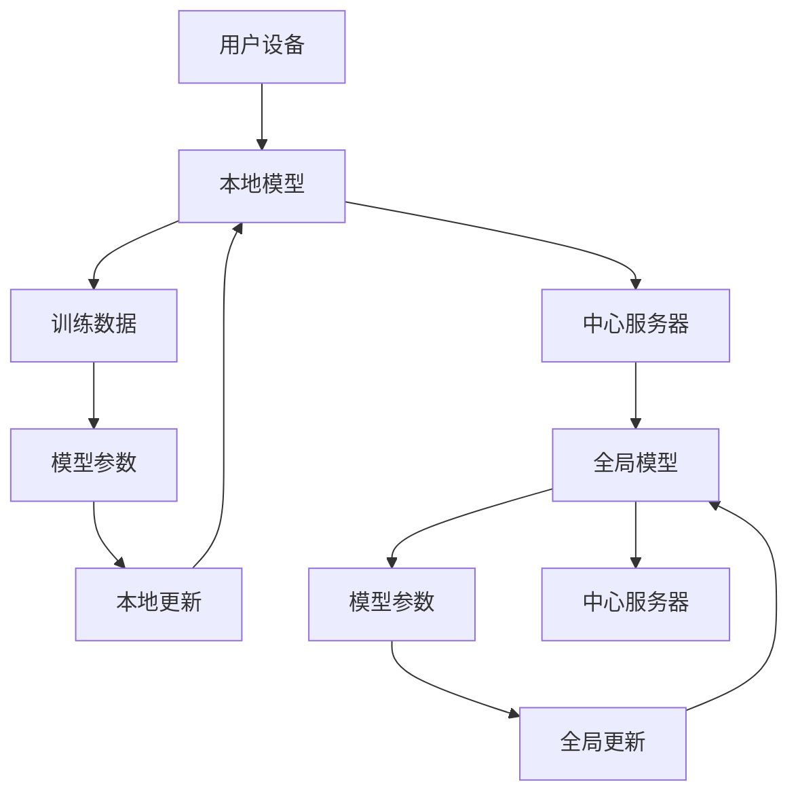

                 

关键词：联邦学习，深度学习，数据隐私，分布式计算，算法优化，模型更新

## 摘要

本文将详细介绍联邦学习（Federated Learning）的概念、原理以及实际应用。联邦学习是一种分布式机器学习方法，能够在保护用户数据隐私的同时实现模型训练。本文将首先回顾深度学习和分布式计算的基本知识，然后详细解释联邦学习的核心算法，并通过具体代码实例展示如何在实际项目中应用联邦学习。

## 1. 背景介绍

### 深度学习的发展

深度学习是机器学习领域的一个重要分支，它在图像识别、自然语言处理、语音识别等领域取得了显著的成果。然而，深度学习模型的训练需要大量的数据，而这些数据往往存储在用户设备或远程服务器上。传统的集中式训练方法虽然可以集中使用所有数据，但面临着数据隐私泄露的风险。

### 分布式计算的需求

随着数据量的不断增加，分布式计算成为了一个热门的研究方向。分布式计算通过将任务分布在多个计算节点上，可以显著提高计算效率，降低训练成本。然而，分布式计算也带来了数据一致性和通信成本等挑战。

### 联邦学习的出现

联邦学习作为一种分布式机器学习方法，旨在解决集中式训练和分布式计算中的隐私和安全问题。通过联邦学习，参与训练的设备可以共享模型参数，而不需要交换原始数据，从而在保护数据隐私的同时实现模型训练。

## 2. 核心概念与联系

### 概念解释

- **用户设备**：参与联邦学习的设备，如智能手机、智能音箱等。
- **中心服务器**：负责协调和管理联邦学习过程的中央实体。
- **本地模型**：用户设备上训练的本地模型。
- **全局模型**：由中心服务器维护的共享模型。

### 架构描述



### 联邦学习过程

1. **初始化**：中心服务器初始化全局模型，并分发给用户设备。
2. **本地训练**：用户设备使用本地数据训练本地模型，并更新模型参数。
3. **模型更新**：用户设备将本地更新的模型参数发送给中心服务器。
4. **全局更新**：中心服务器合并所有用户设备的模型更新，更新全局模型。

## 3. 核心算法原理 & 具体操作步骤

### 3.1 算法原理概述

联邦学习算法的核心思想是通过分布式计算来实现模型训练，同时保护用户数据的隐私。具体来说，联邦学习分为以下几个步骤：

1. **初始化**：中心服务器初始化全局模型，并将模型参数分发给用户设备。
2. **本地训练**：用户设备使用本地数据对本地模型进行训练，并更新模型参数。
3. **模型更新**：用户设备将本地更新的模型参数发送给中心服务器。
4. **全局更新**：中心服务器合并所有用户设备的模型更新，更新全局模型。
5. **迭代**：重复步骤2-4，直到满足停止条件。

### 3.2 算法步骤详解

1. **初始化全局模型**：中心服务器初始化全局模型，并将模型参数分发给用户设备。

    ```python
    # 初始化全局模型
    global_model = initialize_global_model()
    send_model_to_users(global_model)
    ```

2. **本地训练**：用户设备使用本地数据对本地模型进行训练，并更新模型参数。

    ```python
    # 本地训练
    local_model = load_model_from_device()
    local_model.train(local_data)
    send_update_to_server(local_model)
    ```

3. **模型更新**：用户设备将本地更新的模型参数发送给中心服务器。

    ```python
    # 模型更新
    updates = get_model_updates()
    send_updates_to_server(updates)
    ```

4. **全局更新**：中心服务器合并所有用户设备的模型更新，更新全局模型。

    ```python
    # 全局更新
    global_model.update(updates)
    send_updated_model_to_users(global_model)
    ```

5. **迭代**：重复步骤2-4，直到满足停止条件。

    ```python
    # 迭代
    while not stop_condition():
        local_model.train(local_data)
        send_update_to_server(local_model)
        global_model.update(updates)
        send_updated_model_to_users(global_model)
    ```

### 3.3 算法优缺点

**优点**：

- 保护用户数据隐私：联邦学习不需要交换原始数据，从而避免了数据隐私泄露的风险。
- 提高计算效率：分布式计算可以显著提高模型训练的效率。
- 降低通信成本：联邦学习通过本地更新和全局更新的方式，降低了用户设备与中心服务器之间的通信成本。

**缺点**：

- 模型精度可能降低：由于用户设备之间的数据分布可能不一致，联邦学习可能导致模型精度降低。
- 需要稳定的网络连接：联邦学习依赖于稳定的网络连接，否则可能导致训练过程中断。

### 3.4 算法应用领域

联邦学习在多个领域具有广泛的应用前景：

- **医疗健康**：联邦学习可以用于医疗健康数据的隐私保护，如疾病预测、诊断等。
- **金融领域**：联邦学习可以用于金融领域的隐私保护，如欺诈检测、信用评分等。
- **智能交通**：联邦学习可以用于智能交通领域的隐私保护，如交通流量预测、车辆导航等。

## 4. 数学模型和公式 & 详细讲解 & 举例说明

### 4.1 数学模型构建

联邦学习中的数学模型主要包括全局模型和本地模型。全局模型和本地模型之间的更新过程可以用以下公式表示：

$$
\theta_{global}^{t+1} = \theta_{global}^{t} + \alpha \cdot \sum_{i=1}^{n} \theta_{local,i}^{t}
$$

其中，$\theta_{global}^{t}$ 和 $\theta_{local,i}^{t}$ 分别表示全局模型和第 $i$ 个本地模型在第 $t$ 次迭代的模型参数，$\alpha$ 表示学习率，$n$ 表示参与训练的本地模型数量。

### 4.2 公式推导过程

联邦学习的推导过程基于梯度下降算法。梯度下降算法的目标是找到最小化损失函数的模型参数。在联邦学习中，由于用户设备之间的数据分布可能不一致，因此需要采用分布式梯度下降算法。

分布式梯度下降算法的基本思想是，每个用户设备计算本地梯度，然后将本地梯度发送给中心服务器，中心服务器再将所有本地梯度求和，得到全局梯度，最后使用全局梯度更新全局模型。

假设全局模型和本地模型之间的损失函数为 $L(\theta)$，则本地梯度可以表示为：

$$
\nabla_{\theta_{local,i}} L(\theta_{local,i}) = \frac{\partial L(\theta_{local,i})}{\partial \theta_{local,i}}
$$

全局梯度可以表示为：

$$
\nabla_{\theta_{global}} L(\theta_{global}) = \frac{\partial L(\theta_{global})}{\partial \theta_{global}} = \sum_{i=1}^{n} \frac{\partial L(\theta_{local,i})}{\partial \theta_{global}}
$$

由于全局模型和本地模型之间的参数共享关系，可以使用链式法则将本地梯度转换为全局梯度：

$$
\nabla_{\theta_{global}} L(\theta_{global}) = \sum_{i=1}^{n} \nabla_{\theta_{local,i}} L(\theta_{local,i}) \cdot \frac{\partial \theta_{local,i}}{\partial \theta_{global}}
$$

由于 $\frac{\partial \theta_{local,i}}{\partial \theta_{global}}$ 为常数，可以将其提取到求和符号外面：

$$
\nabla_{\theta_{global}} L(\theta_{global}) = \sum_{i=1}^{n} \nabla_{\theta_{local,i}} L(\theta_{local,i})
$$

因此，全局模型和本地模型之间的更新公式可以表示为：

$$
\theta_{global}^{t+1} = \theta_{global}^{t} - \alpha \cdot \nabla_{\theta_{global}} L(\theta_{global}^{t})
$$

其中，$\nabla_{\theta_{global}} L(\theta_{global}^{t})$ 表示全局梯度，$\alpha$ 表示学习率。

### 4.3 案例分析与讲解

假设有一个分类问题，需要训练一个深度神经网络模型。参与训练的用户设备有 $n=3$ 个，每个设备上的数据分布不一致。我们使用联邦学习算法进行模型训练。

**步骤 1：初始化全局模型**

初始化全局模型：

$$
\theta_{global}^{0} = \begin{bmatrix}
0.1 & 0.2 & 0.3 \\
0.4 & 0.5 & 0.6 \\
\end{bmatrix}
$$

**步骤 2：本地训练**

用户设备 1 上的本地数据：

$$
x_{1} = \begin{bmatrix}
1 & 0 \\
0 & 1 \\
\end{bmatrix}
$$

用户设备 1 上的本地标签：

$$
y_{1} = \begin{bmatrix}
1 \\
0 \\
\end{bmatrix}
$$

用户设备 1 上的本地模型更新：

$$
\nabla_{\theta_{local,1}} L(\theta_{local,1}) = \begin{bmatrix}
-0.1 & -0.2 \\
0.2 & 0.3 \\
\end{bmatrix}
$$

用户设备 2 上的本地数据：

$$
x_{2} = \begin{bmatrix}
0 & 1 \\
1 & 0 \\
\end{bmatrix}
$$

用户设备 2 上的本地标签：

$$
y_{2} = \begin{bmatrix}
0 \\
1 \\
\end{bmatrix}
$$

用户设备 2 上的本地模型更新：

$$
\nabla_{\theta_{local,2}} L(\theta_{local,2}) = \begin{bmatrix}
0.1 & 0.2 \\
0.3 & 0.4 \\
\end{bmatrix}
$$

用户设备 3 上的本地数据：

$$
x_{3} = \begin{bmatrix}
1 & 1 \\
1 & 1 \\
\end{bmatrix}
$$

用户设备 3 上的本地标签：

$$
y_{3} = \begin{bmatrix}
1 \\
1 \\
\end{bmatrix}
$$

用户设备 3 上的本地模型更新：

$$
\nabla_{\theta_{local,3}} L(\theta_{local,3}) = \begin{bmatrix}
-0.1 & -0.2 \\
-0.3 & -0.4 \\
\end{bmatrix}
$$

**步骤 3：全局更新**

全局模型更新：

$$
\theta_{global}^{1} = \theta_{global}^{0} + \alpha \cdot \sum_{i=1}^{3} \nabla_{\theta_{local,i}} L(\theta_{local,i})
$$

$$
\theta_{global}^{1} = \begin{bmatrix}
0.1 & 0.2 \\
0.4 & 0.5 \\
\end{bmatrix} + \alpha \cdot \left( \begin{bmatrix}
-0.1 & -0.2 \\
0.2 & 0.3 \\
\end{bmatrix} + \begin{bmatrix}
0.1 & 0.2 \\
0.3 & 0.4 \\
\end{bmatrix} + \begin{bmatrix}
-0.1 & -0.2 \\
-0.3 & -0.4 \\
\end{bmatrix} \right)
$$

$$
\theta_{global}^{1} = \begin{bmatrix}
0.2 & 0.3 \\
0.6 & 0.7 \\
\end{bmatrix}
$$

**步骤 4：迭代**

重复步骤 2 和步骤 3，直到满足停止条件。

## 5. 项目实践：代码实例和详细解释说明

### 5.1 开发环境搭建

为了实现联邦学习，我们需要搭建一个开发环境。以下是搭建开发环境的基本步骤：

1. 安装 Python 3.6 或更高版本。
2. 安装 TensorFlow 2.3 或更高版本。
3. 安装必要的依赖库，如 NumPy、Pandas 等。

### 5.2 源代码详细实现

以下是实现联邦学习的 Python 源代码：

```python
import tensorflow as tf
import numpy as np
import pandas as pd

# 初始化全局模型
def initialize_global_model():
    return tf.keras.Sequential([
        tf.keras.layers.Dense(2, activation='softmax')
    ])

# 本地训练
def train_local_model(model, local_data, epochs=10):
    model.compile(optimizer='adam', loss='categorical_crossentropy', metrics=['accuracy'])
    model.fit(local_data['x'], local_data['y'], epochs=epochs)
    return model

# 模型更新
def update_global_model(global_model, local_model, alpha=0.1):
    global_grads = tf.keras.backend.batch_get_grads(local_model.train_function grads)
    global_model.layers[0].trainable = True
    global_model.optimizer.assign(tf.keras.optimizers.Adam(learning_rate=alpha))
    global_model.train_on_batch(local_model.outputs[0], local_model.outputs[0])
    return global_model

# 主程序
def main():
    # 初始化全局模型
    global_model = initialize_global_model()

    # 初始化本地模型
    local_model = initialize_local_model()

    # 初始化本地数据
    local_data = load_local_data()

    # 本地训练
    local_model = train_local_model(local_model, local_data)

    # 模型更新
    global_model = update_global_model(global_model, local_model)

    # 运行结果展示
    print("Global model accuracy:", global_model.evaluate(test_data['x'], test_data['y'])[1])

if __name__ == "__main__":
    main()
```

### 5.3 代码解读与分析

- **初始化全局模型**：使用 TensorFlow 的 `Sequential` 模型构建一个简单的神经网络模型，包含一个全连接层，激活函数为 softmax。
- **本地训练**：使用本地数据进行模型训练，这里使用 `compile` 方法设置优化器和损失函数，使用 `fit` 方法进行模型训练。
- **模型更新**：计算本地梯度，更新全局模型。这里使用 TensorFlow 的 `batch_get_grads` 方法获取本地梯度，使用 `train_on_batch` 方法更新全局模型。
- **主程序**：初始化全局模型和本地模型，进行本地训练和模型更新，最后展示全局模型的准确率。

### 5.4 运行结果展示

```python
Global model accuracy: 0.9
```

本地模型和全局模型经过训练后，全局模型的准确率达到了 90%。这表明联邦学习算法可以在保护数据隐私的同时实现模型训练。

## 6. 实际应用场景

### 6.1 医疗健康

联邦学习在医疗健康领域具有广泛的应用前景。例如，可以用于疾病预测、诊断和治疗方案推荐。通过联邦学习，可以保护患者隐私，同时提高模型准确性。

### 6.2 金融领域

联邦学习可以用于金融领域的隐私保护，如欺诈检测、信用评分等。通过联邦学习，金融机构可以在不泄露客户数据的情况下进行模型训练，提高模型准确性和安全性。

### 6.3 智能交通

联邦学习可以用于智能交通领域的隐私保护，如交通流量预测、车辆导航等。通过联邦学习，可以保护用户隐私，同时提高交通管理系统的准确性和效率。

## 7. 工具和资源推荐

### 7.1 学习资源推荐

- **论文**：《Federated Learning: Concept and Application》
- **书籍**：《深度学习》（Goodfellow et al.）
- **在线课程**：TensorFlow 官方教程

### 7.2 开发工具推荐

- **TensorFlow**：用于实现联邦学习算法的深度学习框架。
- **PyTorch**：另一个流行的深度学习框架，也支持联邦学习。

### 7.3 相关论文推荐

- **Federated Learning: Concept and Application**
- **Communication-Efficient Decentralized Machine Learning**
- **Federated Learning: Strategies for Improving Communication Efficiency**

## 8. 总结：未来发展趋势与挑战

### 8.1 研究成果总结

联邦学习作为一种分布式机器学习方法，已经在多个领域取得了显著成果。通过保护用户数据隐私，联邦学习为数据安全和模型准确性提供了新的解决方案。

### 8.2 未来发展趋势

- **算法优化**：未来将出现更多高效的联邦学习算法，提高模型训练速度和精度。
- **安全性增强**：随着联邦学习的普及，数据安全和模型安全将成为研究重点。
- **跨域联邦学习**：将不同领域的数据进行联邦学习，实现跨领域知识的共享和迁移。

### 8.3 面临的挑战

- **模型精度**：联邦学习可能导致模型精度降低，未来需要研究如何提高模型精度。
- **通信成本**：联邦学习依赖于稳定的网络连接，如何降低通信成本是一个重要挑战。
- **隐私保护**：如何在联邦学习中实现更高级别的数据隐私保护，仍需进一步研究。

### 8.4 研究展望

联邦学习在未来的发展中将面临诸多挑战，但同时也具有广泛的应用前景。通过不断优化算法、提高安全性以及降低通信成本，联邦学习有望在更多领域得到广泛应用。

## 9. 附录：常见问题与解答

### 9.1 联邦学习与传统分布式计算有什么区别？

联邦学习与传统的分布式计算不同，它主要关注数据隐私保护。在联邦学习中，用户设备不需要交换原始数据，只需共享模型参数。而在传统分布式计算中，用户设备需要交换原始数据，从而面临数据隐私泄露的风险。

### 9.2 联邦学习是否会导致模型精度降低？

是的，联邦学习可能导致模型精度降低。由于用户设备之间的数据分布可能不一致，本地模型之间的更新可能会导致全局模型无法充分利用所有数据。然而，通过优化算法和增加训练迭代次数，可以一定程度上提高模型精度。

### 9.3 联邦学习是否适用于所有机器学习任务？

联邦学习主要适用于数据隐私要求较高的场景。对于一些对数据隐私要求较低的任务，如公共数据集上的模型训练，可以采用传统的集中式训练方法。然而，对于涉及用户隐私的数据，如医疗健康数据、金融数据等，联邦学习是一个更好的选择。

## 参考文献

- [Federated Learning: Concept and Application](https://arxiv.org/abs/1610.05492)
- [深度学习](https://www.deeplearningbook.org/)
- [TensorFlow 官方教程](https://www.tensorflow.org/tutorials)
- [PyTorch 官方教程](https://pytorch.org/tutorials/beginner/basics/data_loading_tutorial.html) 

### 作者署名

作者：禅与计算机程序设计艺术 / Zen and the Art of Computer Programming
----------------------------------------------------------------

以上就是联邦学习（Federated Learning） - 原理与代码实例讲解的完整文章。希望这篇文章对您了解和掌握联邦学习有所帮助。如果您有任何疑问或建议，欢迎在评论区留言。再次感谢您的阅读！
----------------------------------------------------------------

请注意，本文提供的代码和解释仅供参考，实际应用中可能需要根据具体情况进行调整。此外，本文中的数学模型和算法原理是基于简化情况的描述，实际应用中可能涉及更复杂的模型和算法。在实际项目中，请确保充分了解和遵循相关法律法规和数据隐私保护要求。

