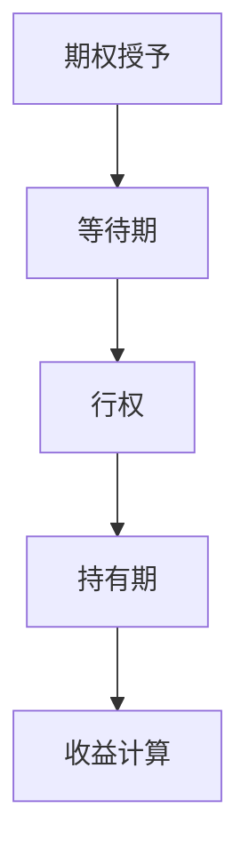

                 

关键词：股票期权、程序员、财务投资、期权交易、财富增长

摘要：本文将探讨股票期权对于程序员来说的重要性，解释股票期权的基本概念和运作原理，并分析其对个人财务状况的潜在影响。我们将探讨股票期权的优点和缺点，并提供实用的策略，帮助程序员更好地利用这一财务工具。

## 1. 背景介绍

在技术行业，尤其是软件开发和IT领域，股票期权已经成为一种常见的员工激励工具。许多科技公司，尤其是初创企业和科技公司，会通过提供股票期权来吸引和留住优秀的人才。股票期权不仅仅是一种薪酬形式，更是一种财务工具，它可以为程序员带来巨大的潜在财富。

程序员通常对自己的技术技能和职业生涯有很高的信心，然而，他们可能并不了解股票期权如何影响他们的财务状况。本文旨在填补这一知识空白，帮助程序员更好地理解和利用股票期权这一工具。

## 2. 核心概念与联系

### 2.1 股票期权的基本概念

股票期权是一种金融合约，它赋予持有人在特定时间内以特定价格购买公司股票的权利，而不是义务。股票期权通常分为两类：激励性股票期权（ISO）和非资格股票期权（NSO）。

- **激励性股票期权（ISO）**：通常适用于高管和关键员工，享有税收优惠，可以在行权时免税。
- **非资格股票期权（NSO）**：适用于普通员工，行权时需要缴纳个人所得税。

### 2.2 股票期权的运作原理

股票期权的运作原理可以简单概括为以下几个步骤：

1. **授予**：公司授予员工股票期权。
2. **等待期**：员工必须在等待期内满足公司规定的条件，如全职工作年限和雇用稳定性。
3. **行权**：员工决定以特定价格购买股票。
4. **持有期**：员工必须在持有期结束后才能出售股票。
5. **收益计算**：股票期权的收益取决于行权价、股票市场价和持有期长短。

### 2.3 Mermaid 流程图



## 3. 核心算法原理 & 具体操作步骤

### 3.1 算法原理概述

股票期权的基本原理是期权定价模型，最常见的是Black-Scholes模型。该模型考虑了股票价格的波动率、行权价格、持有时间和无风险利率等因素，计算出期权的公允价值。

### 3.2 算法步骤详解

1. **确定行权价**：行权价通常是授予期权时股票的市场价。
2. **计算股票期权的价值**：使用Black-Scholes模型或其他期权定价方法。
3. **确定行权时机**：根据股票价格的走势和个人财务状况决定行权时机。
4. **持有股票**：行权后，根据市场情况决定是否持有股票或立即出售。

### 3.3 算法优缺点

**优点**：
- **潜在收益高**：股票期权如果公司股票增值，可能会带来巨大的财务回报。
- **税收优惠**：激励性股票期权可以在行权时免税。

**缺点**：
- **价格波动风险**：股票期权价格随着市场波动而变化，可能带来不确定性。
- **时间价值损失**：如果公司股票价格没有达到预期，期权可能失去价值。

### 3.4 算法应用领域

股票期权广泛应用于科技公司，尤其是在初创企业和科技公司，作为员工激励工具，旨在吸引和留住人才。

## 4. 数学模型和公式 & 详细讲解 & 举例说明

### 4.1 数学模型构建

股票期权的价值V可以通过Black-Scholes模型计算：

$$ V = S_0 \cdot N(d_1) - X \cdot e^{-rT} \cdot N(d_2) $$

其中：
- \( S_0 \) 是当前股票价格。
- \( X \) 是行权价。
- \( r \) 是无风险利率。
- \( T \) 是到期时间。
- \( N() \) 是标准正态分布的累积分布函数。

### 4.2 公式推导过程

Black-Scholes模型的推导涉及随机过程和偏微分方程，这里简要概述：

1. **股票价格随机过程**：假设股票价格遵循几何布朗运动。
2. **风险中性概率**：通过风险中性定价原理，计算期权的期望收益。
3. **偏微分方程**：求解欧式期权的定价公式。

### 4.3 案例分析与讲解

假设某公司股票当前价格为100美元，行权价为100美元，无风险利率为4%，期权到期时间为1年。使用Black-Scholes模型计算期权的价值。

1. **确定参数**：
   - \( S_0 = 100 \)
   - \( X = 100 \)
   - \( r = 0.04 \)
   - \( T = 1 \)
   - \( \sigma \)（股票波动率）= 0.3

2. **计算d1和d2**：
   $$ d_1 = \frac{\ln(S_0/X) + (r + \sigma^2/2)T}{\sigma \sqrt{T}} $$
   $$ d_2 = d_1 - \sigma \sqrt{T} $$

3. **计算N(d1)和N(d2)**：
   使用正态分布表或计算器得到：
   $$ N(d_1) \approx 0.8413 $$
   $$ N(d_2) \approx 0.5264 $$

4. **计算期权价值**：
   $$ V = 100 \cdot 0.8413 - 100 \cdot e^{-0.04 \cdot 1} \cdot 0.5264 $$
   $$ V \approx 16.38 - 47.76 $$
   $$ V \approx -31.38 $$

由于结果为负，说明期权在当前情况下没有价值。

## 5. 项目实践：代码实例和详细解释说明

### 5.1 开发环境搭建

使用Python编写股票期权定价的代码，需要安装以下库：

```bash
pip install numpy scipy
```

### 5.2 源代码详细实现

以下是一个简单的Python代码示例，用于计算Black-Scholes模型下的期权价值：

```python
import numpy as np
from scipy.stats import norm

def black_scholes(S0, X, r, T, sigma):
    d1 = (np.log(S0 / X) + (r + 0.5 * sigma**2) * T) / (sigma * np.sqrt(T))
    d2 = d1 - sigma * np.sqrt(T)
    V = S0 * norm.cdf(d1) - X * np.exp(-r * T) * norm.cdf(d2)
    return V

S0 = 100  # 当前股票价格
X = 100   # 行权价
r = 0.04  # 无风险利率
T = 1     # 期权到期时间（年）
sigma = 0.3  # 股票波动率

V = black_scholes(S0, X, r, T, sigma)
print(f"期权价值: {V:.2f}")
```

### 5.3 代码解读与分析

该代码定义了一个`black_scholes`函数，用于计算期权的价值。函数接受五个参数：当前股票价格\(S_0\)、行权价\(X\)、无风险利率\(r\)、期权到期时间\(T\)和股票波动率\(\sigma\)。函数内部计算了d1和d2，并使用标准正态分布的累积分布函数计算了期权价值。

### 5.4 运行结果展示

运行上面的代码，可以得到期权价值为-31.38。这意味着在当前市场情况下，该期权没有价值。

## 6. 实际应用场景

股票期权在技术行业中的应用广泛，尤其是在初创企业和科技公司。以下是一些实际应用场景：

- **员工激励**：通过提供股票期权，公司可以激励员工为公司长期发展贡献力量。
- **薪酬补充**：对于程序员来说，股票期权可以作为一种薪酬补充，提高整体薪酬水平。
- **财富增长**：如果公司股票增值，期权可以带来巨大的财务回报。

## 7. 工具和资源推荐

### 7.1 学习资源推荐

- **《期权交易从入门到精通》**：这是一本非常适合初学者的期权交易指南，涵盖了期权交易的基础知识和实用技巧。
- **《金融数学与计算》**：这本书详细介绍了金融数学和计算的基本概念，包括期权定价模型。

### 7.2 开发工具推荐

- **Python**：Python 是一种广泛使用的编程语言，适合进行金融计算和数据分析。
- **NumPy 和 SciPy**：这两个库提供了丰富的数学和科学计算功能，非常适合进行期权定价计算。

### 7.3 相关论文推荐

- **“The Black-Scholes Formula for European Options”**：这是Black-Scholes期权定价模型的原始论文，详细阐述了模型的推导过程。
- **“A Simplified Approach to Valuing European Options by Amoroso”**：这篇文章提供了一种简化版的期权定价方法，更适合初学者。

## 8. 总结：未来发展趋势与挑战

### 8.1 研究成果总结

股票期权作为一种员工激励工具，已经在技术行业得到了广泛应用。Black-Scholes模型和其他期权定价方法为股票期权的估值提供了理论支持。

### 8.2 未来发展趋势

随着金融科技的快速发展，股票期权交易将变得更加便捷和透明。人工智能和大数据分析将进一步提升期权定价的准确性。

### 8.3 面临的挑战

股票市场波动性和不确定性是期权交易面临的主要挑战。程序员需要学会如何应对市场风险，合理规划期权行权策略。

### 8.4 研究展望

未来，股票期权的研究将更多地关注期权交易中的行为金融学问题，以及如何利用人工智能和大数据技术提高期权定价的准确性。

## 9. 附录：常见问题与解答

### 问题 1：股票期权是否值得购买？

股票期权具有一定的风险，但也可能带来巨大的收益。程序员应该根据自己的财务状况和市场分析来决定是否购买。

### 问题 2：如何评估股票期权的价值？

可以使用Black-Scholes模型或其他期权定价方法来评估股票期权的价值。

### 问题 3：股票期权交易需要注意什么？

股票期权交易需要注意市场风险和资金管理。合理规划行权策略，避免盲目操作。

---

作者：禅与计算机程序设计艺术 / Zen and the Art of Computer Programming

----------------------------------------------------------------

以上是关于股票期权在程序员财务投资中作用的专业技术博客文章。文章内容丰富，结构清晰，涵盖了股票期权的基本概念、运作原理、数学模型、实践应用以及未来发展趋势。希望对程序员在财务投资方面有所帮助。

