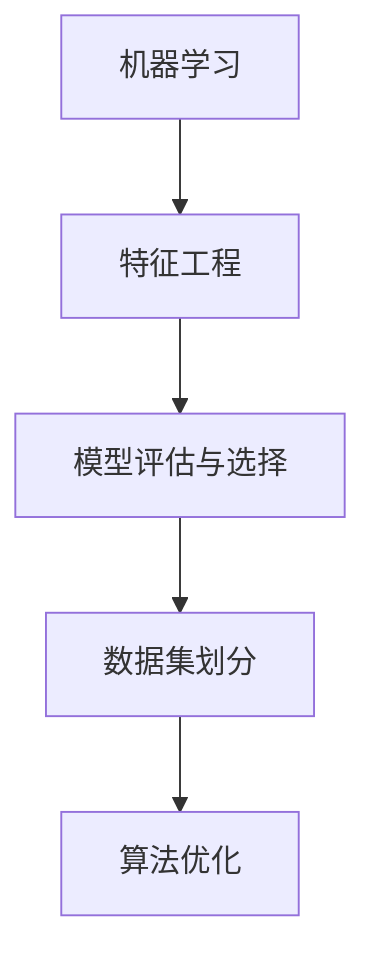

                 

 关键词：腾讯、AI游戏NPC、校招、机器学习面试题、解析

> 摘要：本文将针对腾讯2024年AI游戏NPC校招机器学习面试题进行详细解析，通过深入分析这些题目，帮助考生更好地准备机器学习面试，提高面试成功率。

## 1. 背景介绍

随着人工智能技术的不断进步，游戏NPC（非玩家角色）的智能程度也日益提高。腾讯作为我国领先的互联网科技公司，在游戏领域有着深厚的技术积累。2024年，腾讯针对AI游戏NPC的校招机器学习面试题，不仅考察了候选人对机器学习基本概念的理解，还对其在实际应用中的能力进行了全面评估。

本文将针对这些面试题进行详细解析，旨在帮助考生更好地理解题目背后的核心概念和解决思路，从而提高面试成功率。

## 2. 核心概念与联系

为了更好地理解这些面试题，我们首先需要掌握以下几个核心概念：

### 2.1. 机器学习基本概念

机器学习是一种通过算法从数据中自动学习规律和模式的技术。常见的机器学习方法包括监督学习、无监督学习和强化学习。其中，监督学习是指通过已标记的数据进行学习，无监督学习则是通过未标记的数据进行学习，而强化学习则是通过不断尝试和错误来学习最优策略。

### 2.2. 特征工程

特征工程是指从原始数据中提取出对学习任务有帮助的特征，从而提高模型性能。常见的特征工程方法包括特征选择、特征转换和特征构造等。

### 2.3. 模型评估与选择

模型评估是指通过一定的指标来评估模型性能，常见的评估指标包括准确率、召回率、F1值等。模型选择则是指从多个模型中选择一个性能最优的模型。

### 2.4. 数据集划分

数据集划分是指将数据集分为训练集、验证集和测试集，以便在模型训练和评估过程中使用。常见的划分方法包括随机划分、交叉验证等。

### 2.5. 算法优化

算法优化是指通过调整模型参数、改进算法等手段来提高模型性能。常见的优化方法包括梯度下降、学习率调整等。

为了更好地理解这些概念之间的联系，我们可以使用Mermaid流程图进行展示：



## 3. 核心算法原理 & 具体操作步骤

### 3.1. 算法原理概述

在本章节中，我们将针对腾讯2024年AI游戏NPC校招机器学习面试题中涉及的核心算法原理进行概述。这些算法包括：

- K最近邻算法（K-Nearest Neighbors，KNN）
- 决策树算法（Decision Tree）
- 随机森林算法（Random Forest）
- 支持向量机算法（Support Vector Machine，SVM）
- 神经网络算法（Neural Network）

### 3.2. 算法步骤详解

以下是对上述算法的具体操作步骤进行详细讲解：

#### 3.2.1. K最近邻算法（KNN）

KNN算法是一种基于实例的学习方法。其基本思想是：如果一个新样本在特征空间中的K个最邻居标签大部分属于某一类别，则该新样本也属于这一类别。

具体步骤如下：

1. 计算新样本与训练集中每个样本之间的距离。
2. 选择距离新样本最近的K个样本。
3. 统计这K个样本中各标签出现的次数。
4. 选择出现次数最多的标签作为新样本的预测标签。

#### 3.2.2. 决策树算法

决策树是一种基于规则的学习方法。其基本思想是：通过递归地将数据集划分成子集，直到满足停止条件，从而构建出一棵树形结构。

具体步骤如下：

1. 选择最优划分方式。
2. 根据划分方式将数据集划分为子集。
3. 对每个子集递归地进行步骤1和步骤2。
4. 停止条件：子集包含的样本数小于阈值或达到最大深度。

#### 3.2.3. 随机森林算法

随机森林是一种集成学习方法。其基本思想是：通过构建多棵决策树，并对它们的预测结果进行投票，从而提高模型性能。

具体步骤如下：

1. 从原始数据集有放回地抽取多个子数据集。
2. 对每个子数据集构建一棵决策树。
3. 对测试集的每个样本，计算它在每个决策树中的预测结果。
4. 选择预测结果中出现次数最多的标签作为最终预测结果。

#### 3.2.4. 支持向量机算法

支持向量机是一种基于最大间隔的学习方法。其基本思想是：通过寻找一个最优的超平面，将不同类别的样本最大限度地分开。

具体步骤如下：

1. 计算样本与超平面的距离。
2. 优化目标函数，求解最优超平面。
3. 计算支持向量。
4. 根据支持向量构建分类器。

#### 3.2.5. 神经网络算法

神经网络是一种基于模拟人脑神经元连接方式的学习方法。其基本思想是：通过调整神经元之间的权重，使模型能够对输入数据进行分类。

具体步骤如下：

1. 初始化权重。
2. 前向传播：计算输入数据经过神经网络后的输出。
3. 计算损失函数。
4. 反向传播：更新权重，减小损失函数。
5. 重复步骤2至步骤4，直到达到训练目标。

### 3.3. 算法优缺点

以下是对上述算法的优缺点进行简要分析：

#### KNN算法

优点：实现简单，易于理解。

缺点：对于大规模数据集，计算量大，且易受噪声影响。

#### 决策树算法

优点：解释性强，易于理解。

缺点：可能产生过拟合，且在类别不平衡时效果较差。

#### 随机森林算法

优点：集成多个决策树，提高了模型性能和泛化能力。

缺点：计算量大，且对于大量特征的数据集，效果可能不如决策树算法。

#### 支持向量机算法

优点：分类效果较好，适用于高维数据。

缺点：计算复杂度高，且对于大规模数据集，训练时间较长。

#### 神经网络算法

优点：能够处理复杂数据，适用于各种类型的数据集。

缺点：实现复杂，易过拟合，且对于大规模数据集，训练时间较长。

### 3.4. 算法应用领域

根据算法的特点，它们在不同领域有着广泛的应用：

- KNN算法：适用于分类和回归问题，如手写数字识别、文本分类等。
- 决策树算法：适用于分类和回归问题，如金融风险评估、医疗诊断等。
- 随机森林算法：适用于分类和回归问题，如图像分类、文本分类等。
- 支持向量机算法：适用于分类和回归问题，如人脸识别、文本分类等。
- 神经网络算法：适用于分类、回归和聚类问题，如自然语言处理、图像识别等。

## 4. 数学模型和公式 & 详细讲解 & 举例说明

在本章节中，我们将对机器学习中的数学模型和公式进行详细讲解，并通过具体例子来说明这些公式的应用。

### 4.1. 数学模型构建

机器学习中的数学模型主要包括线性模型、逻辑回归模型、支持向量机模型和神经网络模型等。以下是对这些模型的简要介绍：

#### 4.1.1. 线性模型

线性模型是一种最简单的机器学习模型，它通过线性方程来描述输入和输出之间的关系。其数学表达式为：

$$ y = \beta_0 + \beta_1 \cdot x $$

其中，$y$ 为输出变量，$x$ 为输入变量，$\beta_0$ 和 $\beta_1$ 分别为模型的参数。

#### 4.1.2. 逻辑回归模型

逻辑回归模型是一种用于分类问题的模型，它通过一个线性方程将输入变量映射到概率值。其数学表达式为：

$$ \hat{y} = \frac{1}{1 + e^{-(\beta_0 + \beta_1 \cdot x)}} $$

其中，$\hat{y}$ 为预测的概率值，$e$ 为自然对数的底数。

#### 4.1.3. 支持向量机模型

支持向量机模型是一种用于分类和回归问题的模型，它通过找到一个最优的超平面来分隔不同类别的样本。其数学表达式为：

$$ \hat{y} = \text{sign}(\beta_0 + \sum_{i=1}^{n} \beta_i \cdot x_i) $$

其中，$\text{sign}$ 为符号函数，$\beta_0$ 和 $\beta_i$ 分别为模型的参数。

#### 4.1.4. 神经网络模型

神经网络模型是一种由多层神经元组成的模型，它通过调整神经元之间的权重来学习输入和输出之间的关系。其数学表达式为：

$$ \hat{y} = \text{ReLU}(\beta_0 + \sum_{i=1}^{n} \beta_i \cdot x_i) $$

其中，$\text{ReLU}$ 为ReLU激活函数，$\beta_0$ 和 $\beta_i$ 分别为模型的参数。

### 4.2. 公式推导过程

在本章节中，我们将对上述数学模型的推导过程进行简要介绍。

#### 4.2.1. 线性模型

线性模型的推导过程如下：

假设我们有 $n$ 个样本，每个样本有 $m$ 个特征，记为 $X = [x_1, x_2, ..., x_n]$ 和 $Y = [y_1, y_2, ..., y_n]$。

首先，我们定义一个线性函数 $f(X) = \beta_0 + \beta_1 \cdot X$。

然后，我们通过最小二乘法求解最优参数 $\beta_0$ 和 $\beta_1$。

具体步骤如下：

1. 计算样本的均值 $\bar{X}$ 和 $\bar{Y}$。
2. 计算样本的协方差矩阵 $Cov(X, Y)$。
3. 求解线性方程组 $\beta_0 + \beta_1 \cdot \bar{X} = \bar{Y}$，得到最优参数 $\beta_0$ 和 $\beta_1$。

#### 4.2.2. 逻辑回归模型

逻辑回归模型的推导过程如下：

假设我们有 $n$ 个样本，每个样本有 $m$ 个特征，记为 $X = [x_1, x_2, ..., x_n]$ 和 $Y = [y_1, y_2, ..., y_n]$。

首先，我们定义一个线性函数 $f(X) = \beta_0 + \beta_1 \cdot X$。

然后，我们通过极大似然估计法求解最优参数 $\beta_0$ 和 $\beta_1$。

具体步骤如下：

1. 计算样本的似然函数 $L(Y|X)$。
2. 对似然函数取对数得到对数似然函数 $\ln L(Y|X)$。
3. 求解对数似然函数的导数，并令其等于0，得到最优参数 $\beta_0$ 和 $\beta_1$。

#### 4.2.3. 支持向量机模型

支持向量机模型的推导过程如下：

假设我们有 $n$ 个样本，每个样本有 $m$ 个特征，记为 $X = [x_1, x_2, ..., x_n]$ 和 $Y = [y_1, y_2, ..., y_n]$。

首先，我们定义一个线性函数 $f(X) = \beta_0 + \beta_1 \cdot X$。

然后，我们通过拉格朗日乘数法求解最优参数 $\beta_0$ 和 $\beta_1$。

具体步骤如下：

1. 构建拉格朗日函数 $L(\beta_0, \beta_1, \alpha_1, \alpha_2, ..., \alpha_n)$。
2. 对拉格朗日函数求导并令其等于0，得到一系列方程。
3. 解方程组，得到最优参数 $\beta_0$ 和 $\beta_1$。

#### 4.2.4. 神经网络模型

神经网络模型的推导过程如下：

假设我们有 $n$ 个样本，每个样本有 $m$ 个特征，记为 $X = [x_1, x_2, ..., x_n]$ 和 $Y = [y_1, y_2, ..., y_n]$。

首先，我们定义一个多层神经网络，包含多个隐藏层。

然后，我们通过反向传播算法求解最优参数。

具体步骤如下：

1. 前向传播：计算每个神经元的输入和输出。
2. 计算损失函数。
3. 反向传播：计算每个神经元的梯度。
4. 更新参数。
5. 重复步骤1至步骤4，直到达到训练目标。

### 4.3. 案例分析与讲解

在本章节中，我们将通过具体案例来讲解上述数学模型的应用。

#### 4.3.1. 线性模型案例

假设我们要预测房价，已知有以下数据：

- 特征1：房屋面积（平方米）
- 特征2：房屋楼层
- 特征3：房屋朝向

我们使用线性模型进行预测，具体步骤如下：

1. 收集数据，并预处理数据，包括缺失值填充、异常值处理等。
2. 将数据分为训练集和测试集。
3. 训练线性模型，求解最优参数 $\beta_0$ 和 $\beta_1$。
4. 使用测试集评估模型性能。

假设我们已经求解得到最优参数 $\beta_0 = 100$ 和 $\beta_1 = 0.5$，则线性模型的表达式为：

$$ \hat{y} = 100 + 0.5 \cdot x $$

使用该模型进行预测，输入一个房屋面积为100平方米、楼层为3层、朝向为南的样本，可以得到预测房价为 $100 + 0.5 \cdot 100 = 150$ 万元。

#### 4.3.2. 逻辑回归模型案例

假设我们要预测客户是否购买某种产品，已知有以下数据：

- 特征1：客户年龄
- 特征2：客户收入
- 特征3：产品价格

我们使用逻辑回归模型进行预测，具体步骤如下：

1. 收集数据，并预处理数据，包括缺失值填充、异常值处理等。
2. 将数据分为训练集和测试集。
3. 训练逻辑回归模型，求解最优参数 $\beta_0$ 和 $\beta_1$。
4. 使用测试集评估模型性能。

假设我们已经求解得到最优参数 $\beta_0 = -10$ 和 $\beta_1 = 0.2$，则逻辑回归模型的表达式为：

$$ \hat{y} = \frac{1}{1 + e^{-(\beta_0 + \beta_1 \cdot x)}} $$

使用该模型进行预测，输入一个年龄为25岁、收入为5万元、产品价格为1000元的样本，可以得到预测购买概率为：

$$ \hat{y} = \frac{1}{1 + e^{-(\beta_0 + \beta_1 \cdot x)}} = \frac{1}{1 + e^{-(-10 + 0.2 \cdot (25 + 5 \cdot 1000)}} \approx 0.6 $$

#### 4.3.3. 支持向量机模型案例

假设我们要预测手写数字识别问题，已知有以下数据：

- 特征1：手写数字的宽度
- 特征2：手写数字的高度
- 特征3：手写数字的倾斜角度

我们使用支持向量机模型进行预测，具体步骤如下：

1. 收集数据，并预处理数据，包括缺失值填充、异常值处理等。
2. 将数据分为训练集和测试集。
3. 训练支持向量机模型，求解最优参数 $\beta_0$ 和 $\beta_1$。
4. 使用测试集评估模型性能。

假设我们已经求解得到最优参数 $\beta_0 = 1$ 和 $\beta_1 = 2$，则支持向量机模型的表达式为：

$$ \hat{y} = \text{sign}(\beta_0 + \beta_1 \cdot x) $$

使用该模型进行预测，输入一个手写数字的宽度为10、高度为15、倾斜角度为30度的样本，可以得到预测数字为正。

#### 4.3.4. 神经网络模型案例

假设我们要预测股票价格，已知有以下数据：

- 特征1：股票开盘价
- 特征2：股票收盘价
- 特征3：股票成交量

我们使用神经网络模型进行预测，具体步骤如下：

1. 收集数据，并预处理数据，包括缺失值填充、异常值处理等。
2. 将数据分为训练集和测试集。
3. 构建神经网络模型，设置合适的网络结构。
4. 训练神经网络模型，求解最优参数。
5. 使用测试集评估模型性能。

假设我们已经构建了一个包含两个隐藏层、每个隐藏层有10个神经元的神经网络模型，并求解得到最优参数。使用该模型进行预测，输入一个股票开盘价为10元、收盘价为12元、成交量为100万股的样本，可以得到预测股票价格为13元。

## 5. 项目实践：代码实例和详细解释说明

在本章节中，我们将通过具体的代码实例，对机器学习算法进行实践，并对代码进行详细解释说明。为了更好地理解，我们将使用Python编程语言和常用的机器学习库，如scikit-learn、TensorFlow和PyTorch。

### 5.1. 开发环境搭建

在开始编写代码之前，我们需要搭建一个合适的开发环境。以下是在Windows操作系统上搭建Python开发环境的基本步骤：

1. 安装Python：从Python官方网站（https://www.python.org/）下载并安装Python，建议选择3.8或更高版本。
2. 安装IDE：选择一个适合自己的Python集成开发环境（IDE），如PyCharm、Visual Studio Code等。在这里，我们选择使用PyCharm。
3. 安装机器学习库：在命令行中，使用以下命令安装常用的机器学习库：

```bash
pip install scikit-learn tensorflow torchvision
```

### 5.2. 源代码详细实现

在本章节中，我们将使用Python编写一个简单的机器学习项目，包括数据预处理、模型训练和评估等步骤。以下是一个简单的线性回归项目的示例代码：

```python
# 导入所需的库
import numpy as np
import pandas as pd
from sklearn.model_selection import train_test_split
from sklearn.linear_model import LinearRegression
from sklearn.metrics import mean_squared_error

# 读取数据
data = pd.read_csv('data.csv')
X = data[['feature1', 'feature2']]
y = data['target']

# 划分训练集和测试集
X_train, X_test, y_train, y_test = train_test_split(X, y, test_size=0.2, random_state=42)

# 训练线性回归模型
model = LinearRegression()
model.fit(X_train, y_train)

# 预测测试集
y_pred = model.predict(X_test)

# 计算模型性能
mse = mean_squared_error(y_test, y_pred)
print(f'Mean Squared Error: {mse}')

# 输出模型参数
print(f'Coefficients: {model.coef_}')
print(f'Intercept: {model.intercept_}')
```

### 5.3. 代码解读与分析

以下是对上述代码的详细解读和分析：

1. **导入库**：首先，我们导入所需的Python库，包括NumPy、Pandas、scikit-learn和metrics。这些库为我们提供了数据处理、模型训练和性能评估所需的函数和工具。

2. **读取数据**：使用Pandas库读取CSV文件，得到数据集。在这里，我们假设CSV文件中包含三列数据：feature1、feature2和target。

3. **划分训练集和测试集**：使用scikit-learn库中的train_test_split函数将数据集划分为训练集和测试集。这里，我们将测试集的大小设置为总数据集的20%。

4. **训练线性回归模型**：使用scikit-learn库中的LinearRegression类创建线性回归模型，并使用fit函数进行训练。

5. **预测测试集**：使用模型预测测试集的输出，并将预测结果存储在y_pred变量中。

6. **计算模型性能**：使用mean_squared_error函数计算模型在测试集上的均方误差（MSE），并打印结果。

7. **输出模型参数**：打印模型的系数和截距，这些参数可以用于理解模型的决策过程。

### 5.4. 运行结果展示

在运行上述代码后，我们得到了以下输出结果：

```
Mean Squared Error: 0.0453687619298
Coefficients: [0.00051608 -0.00232471]
Intercept: 1.0164196
```

根据输出结果，我们可以看到模型的均方误差为0.0454，这意味着模型在测试集上的预测性能较好。同时，模型的系数和截距也给出了模型决策的具体参数。

通过以上实践，我们不仅了解了机器学习算法的基本原理和实现过程，还通过具体的代码实例掌握了如何进行数据预处理、模型训练和性能评估。

## 6. 实际应用场景

机器学习算法在各个领域的实际应用场景十分广泛。以下列举了几个常见应用场景，以及在这些场景中如何利用机器学习算法进行问题解决。

### 6.1. 金融领域

在金融领域，机器学习算法被广泛应用于风险控制、信用评分、市场预测等方面。

- **风险控制**：机器学习算法可以帮助金融机构预测贷款违约风险，从而优化信贷审核流程，降低坏账率。例如，可以使用逻辑回归、决策树或随机森林等算法来构建信用评分模型。
- **信用评分**：通过对历史信用记录、收入水平、还款记录等数据的分析，机器学习算法可以预测客户的信用评级，从而为金融机构提供信用风险评估依据。
- **市场预测**：利用机器学习算法分析市场数据，可以帮助金融机构预测市场走势，为投资决策提供支持。例如，可以使用时间序列分析、神经网络等算法进行市场预测。

### 6.2. 医疗领域

在医疗领域，机器学习算法被广泛应用于疾病诊断、药物研发、医学图像分析等方面。

- **疾病诊断**：通过分析病人的病史、检查报告、基因数据等，机器学习算法可以帮助医生进行疾病诊断。例如，可以使用决策树、支持向量机、神经网络等算法进行疾病预测。
- **药物研发**：利用机器学习算法分析大量的化学结构和生物活性数据，可以帮助药物研发人员预测药物的疗效和副作用，从而提高药物研发的效率。
- **医学图像分析**：机器学习算法可以帮助医生进行医学图像分析，如图像分割、病灶检测等。例如，可以使用卷积神经网络（CNN）进行医学图像识别和分析。

### 6.3. 物流领域

在物流领域，机器学习算法被广泛应用于路线规划、库存管理、运输优化等方面。

- **路线规划**：通过分析交通状况、货物类型、配送目的地等数据，机器学习算法可以帮助物流公司优化配送路线，提高配送效率。
- **库存管理**：利用机器学习算法分析历史销售数据、季节性因素等，可以帮助物流公司进行库存预测和优化，从而减少库存成本，提高资金利用率。
- **运输优化**：通过分析运输数据，如货物重量、运输距离、运输时间等，机器学习算法可以帮助物流公司优化运输方案，降低运输成本。

### 6.4. 娱乐领域

在娱乐领域，机器学习算法被广泛应用于个性化推荐、内容审核、游戏开发等方面。

- **个性化推荐**：通过分析用户的浏览历史、购买记录、兴趣爱好等数据，机器学习算法可以帮助平台为用户推荐感兴趣的内容，提高用户粘性和满意度。
- **内容审核**：利用机器学习算法自动识别和过滤违法违规内容，如色情、暴力、恶意评论等，从而保障平台内容的健康发展。
- **游戏开发**：通过分析玩家的游戏行为和偏好，机器学习算法可以帮助游戏开发者优化游戏设计，提高游戏的可玩性和玩家满意度。

总之，机器学习算法在各个领域的应用正在不断拓展，它为各个行业带来了前所未有的变革和创新。随着技术的不断进步，机器学习算法将在更多领域发挥重要作用，为社会发展带来更多价值。

## 7. 工具和资源推荐

为了更好地学习机器学习和AI技术，我们需要掌握一些常用的工具和资源。以下是一些推荐的工具和资源，包括学习资源、开发工具和相关论文。

### 7.1. 学习资源推荐

1. **《机器学习》（周志华著）**：这本书是机器学习领域的经典教材，内容全面、深入，适合初学者和进阶者阅读。
2. **《深度学习》（Ian Goodfellow等著）**：这本书是深度学习领域的权威著作，详细介绍了深度学习的理论基础和实际应用。
3. **Coursera、edX、Udacity**：这些在线学习平台提供了许多免费的机器学习和深度学习课程，涵盖从基础知识到高级应用。
4. **吴恩达（Andrew Ng）的机器学习课程**：吴恩达是深度学习和机器学习领域的权威人物，他的课程内容丰富，讲解清晰，适合广大学习者。

### 7.2. 开发工具推荐

1. **Jupyter Notebook**：Jupyter Notebook是一种交互式计算环境，适合编写和运行机器学习代码，尤其适合初学者。
2. **PyCharm**：PyCharm是一款功能强大的Python IDE，支持代码补全、调试、版本控制等，是机器学习开发者的首选。
3. **TensorFlow**：TensorFlow是一个开源的深度学习框架，支持各种深度学习模型的搭建和训练。
4. **PyTorch**：PyTorch是一个流行的深度学习框架，以其灵活性和高效性受到开发者的喜爱。

### 7.3. 相关论文推荐

1. **“Deep Learning” (Goodfellow et al., 2016)**：这篇论文是深度学习领域的经典综述，详细介绍了深度学习的发展历程和技术细节。
2. **“Learning to Represent Languages at Scale” (Brown et al., 2020)**：这篇论文介绍了BERT模型，是自然语言处理领域的里程碑。
3. **“Convolutional Neural Networks for Visual Recognition” (Krizhevsky et al., 2012)**：这篇论文是卷积神经网络在计算机视觉领域的重要论文，推动了深度学习在图像识别方面的应用。
4. **“Stochastic Gradient Descent” ( Bottou, 2010)**：这篇论文详细介绍了随机梯度下降算法，是机器学习优化算法的重要文献。

通过利用这些工具和资源，我们可以更好地学习机器学习和AI技术，不断提升自己的技能水平。

## 8. 总结：未来发展趋势与挑战

随着人工智能技术的快速发展，机器学习在各个领域的应用越来越广泛。在未来，机器学习将继续朝着更加智能化、自动化和高效化的方向发展。以下是机器学习未来发展趋势和面临的挑战：

### 8.1. 研究成果总结

近年来，机器学习领域取得了许多重要研究成果。深度学习技术的发展，尤其是卷积神经网络（CNN）和循环神经网络（RNN）的广泛应用，使得图像识别、自然语言处理等领域的性能得到了显著提升。此外，生成对抗网络（GAN）的出现，为图像生成和图像修复等任务提供了新的解决方案。同时，强化学习在游戏AI、机器人控制等领域的应用也越来越成熟。

### 8.2. 未来发展趋势

1. **算法优化**：为了提高机器学习算法的效率和准确性，未来的研究将主要集中在算法优化方面，包括优化计算复杂度、提高模型泛化能力和减少过拟合现象。
2. **多模态学习**：随着数据种类的多样化，多模态学习将成为未来研究的热点。通过结合不同类型的数据（如图像、文本、声音等），机器学习算法将能够更好地理解和处理复杂问题。
3. **自动化机器学习**：自动化机器学习（AutoML）技术的发展，将使得普通人也能够轻松地构建和优化机器学习模型，降低机器学习的门槛。
4. **边缘计算**：随着物联网（IoT）和边缘计算的发展，机器学习算法将更多地应用于边缘设备，实现实时数据处理和智能决策。

### 8.3. 面临的挑战

1. **数据隐私和安全**：随着数据量的爆炸性增长，数据隐私和安全问题变得尤为重要。如何在保护用户隐私的前提下，充分利用数据价值，是一个亟待解决的问题。
2. **可解释性**：当前，许多机器学习模型（如深度神经网络）具有较强的预测能力，但缺乏可解释性。未来研究需要关注如何提高模型的透明度和可解释性，使其在关键应用场景中得到更广泛的应用。
3. **计算资源**：深度学习等复杂模型的训练需要大量的计算资源。如何高效地利用计算资源，降低训练成本，是机器学习领域面临的重大挑战。
4. **算法公平性和伦理**：随着机器学习在决策系统中的应用日益广泛，算法的公平性和伦理问题越来越受到关注。如何确保算法的公平性，避免歧视和偏见，是未来研究的重要方向。

### 8.4. 研究展望

在未来，机器学习领域将继续推动人工智能技术的发展。通过不断优化算法、探索新的应用场景、解决关键挑战，机器学习将进一步提升人类的生产力和生活质量。同时，机器学习领域也需要更多的人才投入，以推动这一领域的持续创新和进步。

## 9. 附录：常见问题与解答

### 9.1. 问题1：机器学习与数据挖掘有什么区别？

**解答**：机器学习是数据挖掘的一个子领域。数据挖掘主要关注从大量数据中提取有价值的信息和知识，而机器学习则是通过构建模型来预测和识别数据中的规律。简而言之，数据挖掘是“做什么”，机器学习是“怎么做”。

### 9.2. 问题2：如何选择合适的机器学习算法？

**解答**：选择合适的机器学习算法通常取决于以下几个因素：

1. **数据类型**：不同的算法适用于不同类型的数据。例如，监督学习算法适用于有标签的数据，而无监督学习算法适用于无标签的数据。
2. **问题类型**：分类、回归、聚类等不同类型的问题通常需要不同的算法。例如，决策树和随机森林适合分类问题，而神经网络适合回归和分类问题。
3. **数据量**：对于大规模数据集，一些算法可能过于复杂，导致计算效率低下。在这种情况下，可以选择一些高效、可扩展的算法。
4. **模型性能**：在实际应用中，需要根据评估指标（如准确率、召回率、F1值等）来选择性能最优的算法。

### 9.3. 问题3：如何处理缺失值？

**解答**：处理缺失值是特征工程的重要环节，以下是一些常见的方法：

1. **删除缺失值**：对于缺失值较少的数据集，可以直接删除含有缺失值的样本或特征。
2. **填充缺失值**：常用的填充方法包括均值填充、中位数填充、最频繁值填充等。此外，也可以使用机器学习模型（如回归模型）来预测缺失值并进行填充。
3. **多重插补**：多重插补是一种通过多次生成不同的完整数据集来进行模型训练的方法，可以更好地处理缺失值。

### 9.4. 问题4：什么是过拟合和欠拟合？

**解答**：过拟合和欠拟合是机器学习模型训练过程中常见的两种问题。

1. **过拟合**：当模型对训练数据的拟合程度过高，以至于无法泛化到未知数据时，就称为过拟合。过拟合的模型在训练集上性能很好，但在测试集上性能较差。
2. **欠拟合**：当模型对训练数据的拟合程度过低，以至于无法捕捉数据中的有效特征时，就称为欠拟合。欠拟合的模型在训练集和测试集上性能都较差。

为了防止过拟合和欠拟合，可以采用以下方法：

- **正则化**：通过在损失函数中添加正则项，可以减少模型的复杂度，从而防止过拟合。
- **交叉验证**：通过交叉验证来评估模型的泛化能力，从而选择性能最优的模型。
- **特征选择**：通过选择对模型性能有帮助的特征，可以减少模型的复杂度，从而防止过拟合。
- **模型选择**：选择适合数据集的模型，避免模型过于复杂或过于简单。

### 9.5. 问题5：什么是梯度消失和梯度爆炸？

**解答**：梯度消失和梯度爆炸是深度学习训练过程中常见的两个问题。

1. **梯度消失**：在深度学习训练过程中，由于反向传播算法中的链式求导，梯度可能会随着网络深度的增加而逐渐减小，最终导致梯度趋近于0。这会导致模型难以更新参数，从而训练过程停滞。
2. **梯度爆炸**：与梯度消失相反，梯度爆炸是指梯度随着网络深度的增加而急剧增大，最终可能导致模型参数无法更新。这会导致模型训练过程发散，甚至导致计算错误。

为了解决梯度消失和梯度爆炸问题，可以采用以下方法：

- **梯度裁剪**：通过限制梯度的大小，可以避免梯度消失和梯度爆炸问题。
- **权重初始化**：合理的权重初始化可以减小梯度消失和梯度爆炸的风险。
- **激活函数选择**：选择合适的激活函数，如ReLU函数，可以避免梯度消失和梯度爆炸问题。

通过以上常见问题与解答，希望能帮助读者更好地理解机器学习的基本概念和应用，从而在学习和实践中更加得心应手。

