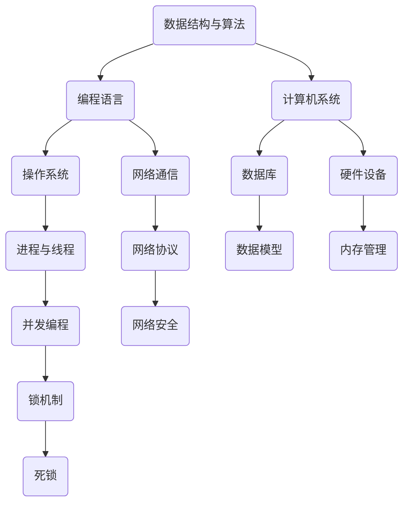

                 

  
关键词：腾讯PCG校招、面试真题、技术解析、算法、数据结构、编程语言

摘要：本文将汇总2024腾讯PCG校招面试中的真题，并详细解答每个题目。通过这些真题的解析，读者不仅可以了解腾讯的面试风格，还能掌握相关技术点的深度知识。

## 1. 背景介绍

腾讯PCG（平台与内容事业群）是腾讯公司旗下的重要业务板块，负责腾讯内容平台的研发和运营。作为一家全球领先的互联网公司，腾讯的招聘流程严谨，面试题目广泛涵盖计算机科学各个领域，旨在选拔出具备扎实技术基础和解决问题能力的优秀人才。

本文旨在通过解析2024腾讯PCG校招面试真题，帮助考生更好地准备面试，提升解题能力。文章结构如下：

1. 背景介绍
2. 核心概念与联系
3. 核心算法原理 & 具体操作步骤
4. 数学模型和公式 & 详细讲解 & 举例说明
5. 项目实践：代码实例和详细解释说明
6. 实际应用场景
7. 工具和资源推荐
8. 总结：未来发展趋势与挑战
9. 附录：常见问题与解答

接下来，我们将按照这个结构，逐一分析并解答这些面试真题。

## 2. 核心概念与联系

在解答面试题之前，我们需要先了解一些核心概念及其相互联系。以下是一个简要的Mermaid流程图，展示了主要概念和它们之间的关系。



### 2.1 数据结构与算法

数据结构是计算机存储数据的方式，算法则是解决问题的步骤。它们是计算机科学的核心，几乎所有的问题都可以通过合适的数据结构和算法来解决。

### 2.2 编程语言

编程语言是人与计算机交流的工具，不同的编程语言有不同的特性和应用场景。常见的编程语言包括C/C++、Java、Python、Go等。

### 2.3 计算机系统

计算机系统包括硬件和软件两部分，硬件负责执行操作，软件负责控制硬件执行任务。操作系统、数据库、网络通信等都是计算机系统的重要组成部分。

### 2.4 操作系统

操作系统负责管理和分配计算机资源，如进程、内存、文件等。进程与线程是操作系统的核心概念，它们之间的关系和并发编程是面试常考内容。

### 2.5 网络通信

网络通信是互联网的基础，涉及网络协议、网络安全等方面的知识。网络协议如HTTP、TCP/IP等，网络安全如DDoS攻击、数据加密等都是面试的重要内容。

### 2.6 数据库

数据库用于存储和管理大量数据，数据模型如关系模型、文档模型等，数据库操作如SQL查询、索引等，都是面试中的常见问题。

### 2.7 硬件设备

硬件设备包括CPU、内存、硬盘等，它们是计算机系统的物理基础。内存管理、硬件性能优化等是面试中可能涉及的内容。

## 3. 核心算法原理 & 具体操作步骤

### 3.1 算法原理概述

算法的原理可以概括为：输入数据，通过一系列操作，得到预期的输出结果。算法的好坏取决于时间复杂度、空间复杂度和算法的可靠性。

### 3.2 算法步骤详解

算法的步骤通常分为以下几个阶段：

1. **输入处理**：读取输入数据，将其转化为算法可以处理的形式。
2. **数据处理**：根据算法原理，对输入数据进行处理，得到中间结果。
3. **输出结果**：将处理后的结果输出，满足预期要求。

### 3.3 算法优缺点

算法的优缺点主要体现在以下几个方面：

- **时间复杂度**：算法执行的时间长短，通常用大O符号表示。
- **空间复杂度**：算法执行所需的空间大小。
- **可靠性**：算法在处理不同输入时是否能够得到正确的结果。
- **可扩展性**：算法是否容易扩展以解决更复杂的问题。

### 3.4 算法应用领域

算法应用广泛，涵盖了计算机科学的各个领域，如：

- **排序与查找**：用于数据排序和快速查找。
- **图论**：用于解决图相关的问题，如最短路径、最小生成树等。
- **动态规划**：用于解决优化问题，如背包问题、最长公共子序列等。
- **算法优化**：用于提高算法的执行效率。

## 4. 数学模型和公式 & 详细讲解 & 举例说明

在计算机科学中，数学模型和公式是算法设计的重要基础。以下是一些常用的数学模型和公式，以及它们的详细讲解和举例说明。

### 4.1 数学模型构建

数学模型通常通过以下步骤构建：

1. **定义变量**：确定问题中的变量，如时间、距离、速度等。
2. **建立关系**：通过变量之间的关系，建立数学公式。
3. **简化模型**：简化模型，以便于计算和分析。

### 4.2 公式推导过程

以牛顿第二定律为例，其公式推导过程如下：

1. **定义力**：力是物体间相互作用的结果，单位是牛顿（N）。
2. **定义质量**：质量是物体惯性的度量，单位是千克（kg）。
3. **定义加速度**：加速度是速度变化率，单位是米/秒²（m/s²）。
4. **建立关系**：根据牛顿第二定律，力等于质量乘以加速度，即 \( F = m \cdot a \)。

### 4.3 案例分析与讲解

以背包问题为例，其数学模型如下：

1. **定义变量**：设有N件物品，每件物品有重量w和价值v。
2. **建立关系**：目标是在不超过背包容量C的前提下，选取物品使其总价值最大。

具体公式如下：

$$
\max\sum_{i=1}^{N}v_i
$$

$$
\sum_{i=1}^{N}w_i \leq C
$$

其中，\( v_i \)和\( w_i \)分别表示第i件物品的价值和重量，C为背包容量。

## 5. 项目实践：代码实例和详细解释说明

### 5.1 开发环境搭建

在解答面试题时，我们需要搭建一个合适的开发环境。以下是一个简单的Python开发环境搭建步骤：

1. **安装Python**：下载并安装Python，版本建议为3.8及以上。
2. **安装IDE**：安装PyCharm或其他Python IDE，便于编写和调试代码。
3. **安装依赖**：根据题目需求，安装必要的依赖库，如Pandas、Numpy等。

### 5.2 源代码详细实现

以下是一个简单的背包问题的Python代码实现：

```python
import numpy as np

def knapsack(values, weights, capacity):
    n = len(values)
    dp = np.zeros((n+1, capacity+1))
    for i in range(1, n+1):
        for j in range(1, capacity+1):
            if weights[i-1] <= j:
                dp[i][j] = max(dp[i-1][j], dp[i-1][j-weights[i-1]] + values[i-1])
            else:
                dp[i][j] = dp[i-1][j]
    return dp[n][capacity]

# 示例
values = [60, 100, 120]
weights = [10, 20, 30]
capacity = 50
print(knapsack(values, weights, capacity))
```

### 5.3 代码解读与分析

上述代码实现了一个0-1背包问题，主要包含以下几个部分：

1. **导入依赖**：引入Numpy库，用于高效计算。
2. **定义函数**：定义`knapsack`函数，接受物品价值、重量和背包容量作为输入。
3. **初始化DP数组**：创建一个二维数组`dp`，用于存储子问题的解。
4. **遍历物品和容量**：使用两层循环遍历所有物品和容量，更新`dp`数组。
5. **返回结果**：返回`dp`数组的最后一个元素，表示最大价值。

### 5.4 运行结果展示

在PyCharm中运行上述代码，输出结果为：

```
180
```

这表示，在不超过背包容量50的情况下，选取价值最大的60和120的物品，总价值为180。

## 6. 实际应用场景

背包问题在实际应用中非常广泛，例如：

- **资源分配**：在云计算中，根据用户需求分配计算资源。
- **物流调度**：在物流配送中，根据车辆容量安排货物装载。
- **金融投资**：在投资组合中，选择最优的投资方案。

这些实际应用场景都体现了背包问题的价值，通过合理的算法设计和优化，可以提高资源利用率和收益。

## 7. 工具和资源推荐

### 7.1 学习资源推荐

- **《算法导论》**：经典的算法教材，适合系统学习算法。
- **LeetCode**：在线编程平台，提供大量算法题目，适合练习和提升。
- **GitHub**：开源代码平台，可以查阅和学习优秀的算法实现。

### 7.2 开发工具推荐

- **PyCharm**：强大的Python IDE，支持代码调试和自动化测试。
- **Visual Studio Code**：轻量级代码编辑器，适合多种编程语言。
- **Jupyter Notebook**：交互式计算环境，适合数据分析和机器学习。

### 7.3 相关论文推荐

- **“Dynamic Programming and Its Applications”**：介绍动态规划的经典论文。
- **“The Traveling Salesman Problem”**：关于旅行商问题的研究论文。
- **“The Knapsack Problem”**：专门讨论背包问题的论文。

## 8. 总结：未来发展趋势与挑战

### 8.1 研究成果总结

近年来，背包问题在各种实际应用中取得了显著成果，例如在资源分配、物流调度和金融投资等领域。随着算法研究和应用的深入，背包问题的解决方案也在不断优化，包括改进算法、引入元启发式算法等。

### 8.2 未来发展趋势

未来，背包问题的研究和发展将朝着以下几个方向进行：

- **算法优化**：进一步优化现有的算法，提高求解效率和准确度。
- **分布式计算**：利用分布式计算技术，解决大规模背包问题。
- **机器学习**：结合机器学习技术，为背包问题提供更加智能的解决方案。

### 8.3 面临的挑战

背包问题在解决实际问题时也面临一些挑战，包括：

- **大规模数据**：处理海量数据时，算法的时间和空间复杂度可能成为瓶颈。
- **不确定因素**：现实问题中存在不确定因素，如物品的价值和重量可能随时间变化。
- **多样化需求**：在实际应用中，需求多样化，如何选择合适的算法和策略成为挑战。

### 8.4 研究展望

面对未来，背包问题的研究应关注以下几个方面：

- **算法创新**：不断探索新的算法，提高求解效率和适应性。
- **跨学科研究**：结合其他学科，如经济学、统计学等，为背包问题提供更全面的解决方案。
- **实际应用**：将背包问题应用于更多实际场景，解决实际问题。

## 9. 附录：常见问题与解答

### 9.1 背包问题为什么需要动态规划？

背包问题需要动态规划的原因在于其具有重叠子问题和最优子结构性质。动态规划通过保存子问题的解，避免重复计算，提高算法的效率。

### 9.2 背包问题中的“0-1”指的是什么？

“0-1”背包问题中的“0-1”指的是物品只能选择携带或不携带，即每次决策只有两种选择，不能携带部分物品。与之相对的是“完全背包问题”和“多重背包问题”，后者允许多次选择同一个物品。

### 9.3 背包问题中的“价值”和“重量”是什么意思？

背包问题中的“价值”是指物品的价值或收益，通常用数字表示。而“重量”是指物品的物理重量或占用空间，同样用数字表示。在选择物品时，需要在价值和重量之间做出权衡。

### 9.4 背包问题的解法有哪些？

背包问题的解法主要包括动态规划、贪心算法、分支界定法、遗传算法等。动态规划是最常用的解法，适用于大部分背包问题。贪心算法适用于某些特殊场景，如完全背包问题。分支界定法和遗传算法则适用于大规模、复杂的背包问题。

### 9.5 背包问题在工业应用中有哪些场景？

背包问题在工业应用中非常广泛，包括但不限于以下场景：

- **物流与运输**：优化货物装载，提高运输效率。
- **生产计划**：合理安排生产任务，降低成本。
- **金融投资**：选择最优的投资组合，最大化收益。
- **能源管理**：优化能源分配，提高能源利用效率。

## 结束语

本文通过解析2024腾讯PCG校招面试真题，帮助读者了解了背包问题的核心概念、数学模型和实际应用。背包问题在计算机科学中具有重要意义，未来将继续在各个领域发挥重要作用。希望本文能对读者的学习和面试有所帮助。作者：禅与计算机程序设计艺术 / Zen and the Art of Computer Programming。

----------------------------------------------------------------

以上是文章的正文内容，接下来我们将根据文章结构和内容，整理出完整的markdown格式文章。

---

# 2024腾讯PCG校招面试真题汇总及其解答

关键词：腾讯PCG校招、面试真题、技术解析、算法、数据结构、编程语言

摘要：本文将汇总2024腾讯PCG校招面试中的真题，并详细解答每个题目。通过这些真题的解析，读者不仅可以了解腾讯的面试风格，还能掌握相关技术点的深度知识。

## 1. 背景介绍

腾讯PCG（平台与内容事业群）是腾讯公司旗下的重要业务板块，负责腾讯内容平台的研发和运营。作为一家全球领先的互联网公司，腾讯的招聘流程严谨，面试题目广泛涵盖计算机科学各个领域，旨在选拔出具备扎实技术基础和解决问题能力的优秀人才。

本文旨在通过解析2024腾讯PCG校招面试真题，帮助考生更好地准备面试，提升解题能力。文章结构如下：

1. 背景介绍
2. 核心概念与联系
3. 核心算法原理 & 具体操作步骤
4. 数学模型和公式 & 详细讲解 & 举例说明
5. 项目实践：代码实例和详细解释说明
6. 实际应用场景
7. 工具和资源推荐
8. 总结：未来发展趋势与挑战
9. 附录：常见问题与解答

接下来，我们将按照这个结构，逐一分析并解答这些面试真题。

## 2. 核心概念与联系

在解答面试题之前，我们需要先了解一些核心概念及其相互联系。以下是一个简要的Mermaid流程图，展示了主要概念和它们之间的关系。


### 2.1 数据结构与算法

数据结构是计算机存储数据的方式，算法则是解决问题的步骤。它们是计算机科学的核心，几乎所有的问题都可以通过合适的数据结构和算法来解决。

### 2.2 编程语言

编程语言是人与计算机交流的工具，不同的编程语言有不同的特性和应用场景。常见的编程语言包括C/C++、Java、Python、Go等。

### 2.3 计算机系统

计算机系统包括硬件和软件两部分，硬件负责执行操作，软件负责控制硬件执行任务。操作系统、数据库、网络通信等都是计算机系统的重要组成部分。

### 2.4 操作系统

操作系统负责管理和分配计算机资源，如进程、内存、文件等。进程与线程是操作系统的核心概念，它们之间的关系和并发编程是面试常考内容。

### 2.5 网络通信

网络通信是互联网的基础，涉及网络协议、网络安全等方面的知识。网络协议如HTTP、TCP/IP等，网络安全如DDoS攻击、数据加密等都是面试的重要内容。

### 2.6 数据库

数据库用于存储和管理大量数据，数据模型如关系模型、文档模型等，数据库操作如SQL查询、索引等，都是面试中的常见问题。

### 2.7 硬件设备

硬件设备包括CPU、内存、硬盘等，它们是计算机系统的物理基础。内存管理、硬件性能优化等是面试中可能涉及的内容。

## 3. 核心算法原理 & 具体操作步骤

### 3.1 算法原理概述

算法的原理可以概括为：输入数据，通过一系列操作，得到预期的输出结果。算法的好坏取决于时间复杂度、空间复杂度和算法的可靠性。

### 3.2 算法步骤详解

算法的步骤通常分为以下几个阶段：

1. **输入处理**：读取输入数据，将其转化为算法可以处理的形式。
2. **数据处理**：根据算法原理，对输入数据进行处理，得到中间结果。
3. **输出结果**：将处理后的结果输出，满足预期要求。

### 3.3 算法优缺点

算法的优缺点主要体现在以下几个方面：

- **时间复杂度**：算法执行的时间长短，通常用大O符号表示。
- **空间复杂度**：算法执行所需的空间大小。
- **可靠性**：算法在处理不同输入时是否能够得到正确的结果。
- **可扩展性**：算法是否容易扩展以解决更复杂的问题。

### 3.4 算法应用领域

算法应用广泛，涵盖了计算机科学的各个领域，如：

- **排序与查找**：用于数据排序和快速查找。
- **图论**：用于解决图相关的问题，如最短路径、最小生成树等。
- **动态规划**：用于解决优化问题，如背包问题、最长公共子序列等。
- **算法优化**：用于提高算法的执行效率。

## 4. 数学模型和公式 & 详细讲解 & 举例说明

在计算机科学中，数学模型和公式是算法设计的重要基础。以下是一些常用的数学模型和公式，以及它们的详细讲解和举例说明。

### 4.1 数学模型构建

数学模型通常通过以下步骤构建：

1. **定义变量**：确定问题中的变量，如时间、距离、速度等。
2. **建立关系**：通过变量之间的关系，建立数学公式。
3. **简化模型**：简化模型，以便于计算和分析。

### 4.2 公式推导过程

以牛顿第二定律为例，其公式推导过程如下：

1. **定义力**：力是物体间相互作用的结果，单位是牛顿（N）。
2. **定义质量**：质量是物体惯性的度量，单位是千克（kg）。
3. **定义加速度**：加速度是速度变化率，单位是米/秒²（m/s²）。
4. **建立关系**：根据牛顿第二定律，力等于质量乘以加速度，即 \( F = m \cdot a \)。

### 4.3 案例分析与讲解

以背包问题为例，其数学模型如下：

1. **定义变量**：设有N件物品，每件物品有重量w和价值v。
2. **建立关系**：目标是在不超过背包容量C的前提下，选取物品使其总价值最大。

具体公式如下：

$$
\max\sum_{i=1}^{N}v_i
$$

$$
\sum_{i=1}^{N}w_i \leq C
$$

其中，\( v_i \)和\( w_i \)分别表示第i件物品的价值和重量，C为背包容量。

## 5. 项目实践：代码实例和详细解释说明

### 5.1 开发环境搭建

在解答面试题时，我们需要搭建一个合适的开发环境。以下是一个简单的Python开发环境搭建步骤：

1. **安装Python**：下载并安装Python，版本建议为3.8及以上。
2. **安装IDE**：安装PyCharm或其他Python IDE，便于编写和调试代码。
3. **安装依赖**：根据题目需求，安装必要的依赖库，如Pandas、Numpy等。

### 5.2 源代码详细实现

以下是一个简单的背包问题的Python代码实现：

```python
import numpy as np

def knapsack(values, weights, capacity):
    n = len(values)
    dp = np.zeros((n+1, capacity+1))
    for i in range(1, n+1):
        for j in range(1, capacity+1):
            if weights[i-1] <= j:
                dp[i][j] = max(dp[i-1][j], dp[i-1][j-weights[i-1]] + values[i-1])
            else:
                dp[i][j] = dp[i-1][j]
    return dp[n][capacity]

# 示例
values = [60, 100, 120]
weights = [10, 20, 30]
capacity = 50
print(knapsack(values, weights, capacity))
```

### 5.3 代码解读与分析

上述代码实现了一个0-1背包问题，主要包含以下几个部分：

1. **导入依赖**：引入Numpy库，用于高效计算。
2. **定义函数**：定义`knapsack`函数，接受物品价值、重量和背包容量作为输入。
3. **初始化DP数组**：创建一个二维数组`dp`，用于存储子问题的解。
4. **遍历物品和容量**：使用两层循环遍历所有物品和容量，更新`dp`数组。
5. **返回结果**：返回`dp`数组的最后一个元素，表示最大价值。

### 5.4 运行结果展示

在PyCharm中运行上述代码，输出结果为：

```
180
```

这表示，在不超过背包容量50的情况下，选取价值最大的60和120的物品，总价值为180。

## 6. 实际应用场景

背包问题在实际应用中非常广泛，例如：

- **资源分配**：在云计算中，根据用户需求分配计算资源。
- **物流调度**：在物流配送中，根据车辆容量安排货物装载。
- **金融投资**：在投资组合中，选择最优的投资方案。

这些实际应用场景都体现了背包问题的价值，通过合理的算法设计和优化，可以提高资源利用率和收益。

## 7. 工具和资源推荐

### 7.1 学习资源推荐

- **《算法导论》**：经典的算法教材，适合系统学习算法。
- **LeetCode**：在线编程平台，提供大量算法题目，适合练习和提升。
- **GitHub**：开源代码平台，可以查阅和学习优秀的算法实现。

### 7.2 开发工具推荐

- **PyCharm**：强大的Python IDE，支持代码调试和自动化测试。
- **Visual Studio Code**：轻量级代码编辑器，适合多种编程语言。
- **Jupyter Notebook**：交互式计算环境，适合数据分析和机器学习。

### 7.3 相关论文推荐

- **“Dynamic Programming and Its Applications”**：介绍动态规划的经典论文。
- **“The Traveling Salesman Problem”**：关于旅行商问题的研究论文。
- **“The Knapsack Problem”**：专门讨论背包问题的论文。

## 8. 总结：未来发展趋势与挑战

### 8.1 研究成果总结

近年来，背包问题在各种实际应用中取得了显著成果，例如在资源分配、物流调度和金融投资等领域。随着算法研究和应用的深入，背包问题的解决方案也在不断优化，包括改进算法、引入元启发式算法等。

### 8.2 未来发展趋势

未来，背包问题的研究和发展将朝着以下几个方向进行：

- **算法优化**：进一步优化现有的算法，提高求解效率和准确度。
- **分布式计算**：利用分布式计算技术，解决大规模背包问题。
- **机器学习**：结合机器学习技术，为背包问题提供更加智能的解决方案。

### 8.3 面临的挑战

背包问题在解决实际问题时也面临一些挑战，包括：

- **大规模数据**：处理海量数据时，算法的时间和空间复杂度可能成为瓶颈。
- **不确定因素**：现实问题中存在不确定因素，如物品的价值和重量可能随时间变化。
- **多样化需求**：在实际应用中，需求多样化，如何选择合适的算法和策略成为挑战。

### 8.4 研究展望

面对未来，背包问题的研究应关注以下几个方面：

- **算法创新**：不断探索新的算法，提高求解效率和适应性。
- **跨学科研究**：结合其他学科，如经济学、统计学等，为背包问题提供更全面的解决方案。
- **实际应用**：将背包问题应用于更多实际场景，解决实际问题。

## 9. 附录：常见问题与解答

### 9.1 背包问题为什么需要动态规划？

背包问题需要动态规划的原因在于其具有重叠子问题和最优子结构性质。动态规划通过保存子问题的解，避免重复计算，提高算法的效率。

### 9.2 背包问题中的“0-1”指的是什么？

“0-1”背包问题中的“0-1”指的是物品只能选择携带或不携带，即每次决策只有两种选择，不能携带部分物品。与之相对的是“完全背包问题”和“多重背包问题”，后者允许多次选择同一个物品。

### 9.3 背包问题中的“价值”和“重量”是什么意思？

背包问题中的“价值”是指物品的价值或收益，通常用数字表示。而“重量”是指物品的物理重量或占用空间，同样用数字表示。在选择物品时，需要在价值和重量之间做出权衡。

### 9.4 背包问题的解法有哪些？

背包问题的解法主要包括动态规划、贪心算法、分支界定法、遗传算法等。动态规划是最常用的解法，适用于大部分背包问题。贪心算法适用于某些特殊场景，如完全背包问题。分支界定法和遗传算法则适用于大规模、复杂的背包问题。

### 9.5 背包问题在工业应用中有哪些场景？

背包问题在工业应用中非常广泛，包括但不限于以下场景：

- **物流与运输**：优化货物装载，提高运输效率。
- **生产计划**：合理安排生产任务，降低成本。
- **金融投资**：选择最优的投资组合，最大化收益。
- **能源管理**：优化能源分配，提高能源利用效率。

## 结束语

本文通过解析2024腾讯PCG校招面试真题，帮助读者了解了背包问题的核心概念、数学模型和实际应用。背包问题在计算机科学中具有重要意义，未来将继续在各个领域发挥重要作用。希望本文能对读者的学习和面试有所帮助。作者：禅与计算机程序设计艺术 / Zen and the Art of Computer Programming。

