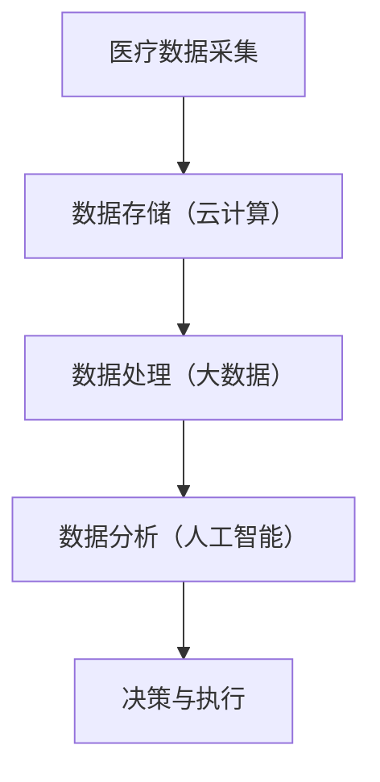

                 

关键词：腾讯云、智慧医疗、面试真题、解答、社招

## 摘要

本文旨在汇总并解答2024年腾讯云智慧医疗社招面试中可能出现的技术面试题目。文章分为若干章节，从背景介绍、核心概念与联系、核心算法原理与具体操作步骤、数学模型与公式讲解、项目实践、实际应用场景到未来应用展望，全面解析智慧医疗领域的面试内容。希望通过本文，能够帮助准备参加腾讯云智慧医疗社招面试的读者更好地了解面试要求，做好充分的准备。

## 1. 背景介绍

### 智慧医疗的兴起

智慧医疗作为新兴的领域，近年来在全球范围内得到了广泛关注。随着人工智能、大数据、云计算等技术的迅猛发展，智慧医疗在提高医疗质量、降低医疗成本、优化医疗流程等方面展现了巨大的潜力。腾讯云作为国内领先的计算服务提供商，其在智慧医疗领域的布局和探索也引发了业界的广泛关注。

### 腾讯云在智慧医疗的应用

腾讯云依托自身强大的技术实力，将云计算、大数据、人工智能等技术与医疗行业深度融合，提供了一系列智慧医疗服务。例如，腾讯云通过医疗云平台为医疗机构提供高效、稳定、安全的计算和存储服务；通过AI诊断系统为医生提供辅助诊断工具，提高诊断准确率；通过智慧医院解决方案优化医院运营管理，提升医疗服务效率。

### 社招面试的重要性

对于想要加入腾讯云智慧医疗团队的应聘者来说，面试环节是展示自身能力和专业素养的重要机会。通过面试，不仅能够了解应聘者的技术能力，更能评估其团队合作精神、学习能力等软实力。因此，对于社招面试的准备，需要全面、深入地了解智慧医疗领域的技术趋势和应用，做好充分的准备。

## 2. 核心概念与联系

在智慧医疗领域，以下几个核心概念和技术是面试中经常被提及的：

- **云计算**：云计算是一种通过互联网提供动态易扩展且经常是虚拟化的资源，可以通过API访问，主要服务包括基础设施即服务（IaaS）、平台即服务（PaaS）和软件即服务（SaaS）。
  
- **大数据**：大数据是指无法用传统数据库工具进行捕获、管理和处理的数据集合。在智慧医疗中，大数据可以帮助医疗机构更好地进行数据分析和决策。

- **人工智能**：人工智能是模拟、延伸和扩展人的智能的理论、方法、技术及应用。在智慧医疗中，人工智能被广泛应用于诊断辅助、治疗决策、医疗机器人等领域。

### Mermaid 流程图

下面是一个简单的Mermaid流程图，展示了智慧医疗中云计算、大数据和人工智能之间的联系。



### 具体联系

1. **云计算**为智慧医疗提供了强大的计算和存储能力，确保了大规模医疗数据的存储和处理。
2. **大数据**技术帮助医疗机构对海量医疗数据进行高效处理和分析，从而提供更为精准的医疗决策支持。
3. **人工智能**通过深度学习、自然语言处理等技术，实现了对医疗数据的智能分析和诊断，提升了医疗服务的效率和质量。

## 3. 核心算法原理 & 具体操作步骤

### 3.1 算法原理概述

在智慧医疗领域，以下几种核心算法经常被应用：

- **深度学习**：通过模拟人脑的神经网络结构，实现图像识别、语音识别等功能。
  
- **自然语言处理**：通过对自然语言文本的分析和处理，实现信息提取、语义理解等功能。
  
- **机器学习**：通过训练模型，实现对数据的预测和分类。

### 3.2 算法步骤详解

以**深度学习**为例，其基本步骤如下：

1. **数据收集**：收集大量的医疗图像、病历数据等。
2. **数据预处理**：对收集到的数据进行清洗、标注等处理。
3. **模型设计**：设计神经网络结构，选择合适的激活函数、损失函数等。
4. **模型训练**：使用预处理后的数据进行模型训练，调整模型参数。
5. **模型评估**：使用验证集对模型进行评估，调整模型以达到最佳效果。
6. **模型部署**：将训练好的模型部署到实际应用场景中。

### 3.3 算法优缺点

- **深度学习**：
  - 优点：强大的特征提取能力，适用于图像、语音等处理。
  - 缺点：对数据量要求较高，训练过程计算资源消耗大。

- **自然语言处理**：
  - 优点：能够处理非结构化文本数据，实现信息提取、语义理解等。
  - 缺点：对语言理解能力要求较高，处理复杂语句时效果不佳。

- **机器学习**：
  - 优点：适用于各种类型的预测和分类问题。
  - 缺点：对数据质量要求较高，容易出现过拟合现象。

### 3.4 算法应用领域

- **深度学习**：广泛应用于医学图像分析、病理诊断等领域。
- **自然语言处理**：广泛应用于电子病历分析、智能问答系统等领域。
- **机器学习**：广泛应用于医疗数据分析、预测等领域。

## 4. 数学模型和公式 & 详细讲解 & 举例说明

### 4.1 数学模型构建

在智慧医疗领域，常见的数学模型包括：

- **贝叶斯网络**：用于描述不确定性和推理。
  
- **支持向量机**：用于分类问题。

- **回归分析**：用于预测数值型结果。

### 4.2 公式推导过程

以**贝叶斯网络**为例，其基本公式如下：

$$
P(A|B) = \frac{P(B|A)P(A)}{P(B)}
$$

其中，$P(A|B)$ 表示在已知事件 $B$ 发生的情况下，事件 $A$ 发生的概率；$P(B|A)$ 表示在事件 $A$ 发生的情况下，事件 $B$ 发生的概率；$P(A)$ 和 $P(B)$ 分别表示事件 $A$ 和事件 $B$ 的概率。

### 4.3 案例分析与讲解

以下是一个简单的贝叶斯网络案例：

- **事件 A**：患者患有某种疾病。
- **事件 B**：医生诊断患者患有某种疾病。

根据医学知识，我们可以得到以下概率：

- $P(A) = 0.01$（患有某种疾病的概率）。
- $P(B|A) = 0.9$（医生诊断患有某种疾病的概率）。
- $P(B|¬A) = 0.1$（医生诊断没有患有某种疾病的概率）。

根据贝叶斯公式，我们可以计算：

$$
P(A|B) = \frac{P(B|A)P(A)}{P(B)} = \frac{0.9 \times 0.01}{0.9 \times 0.01 + 0.1 \times 0.99} \approx 0.904
$$

这意味着，在医生诊断患者患有某种疾病的情况下，患者实际患有这种疾病的概率约为 90.4%。

## 5. 项目实践：代码实例和详细解释说明

### 5.1 开发环境搭建

为了实践智慧医疗中的算法，我们需要搭建一个合适的开发环境。以下是一个基本的开发环境搭建步骤：

1. 安装 Python 3.8 或更高版本。
2. 安装必要的库，如 NumPy、Pandas、Scikit-learn 等。
3. 安装 Jupyter Notebook，用于编写和运行代码。

### 5.2 源代码详细实现

以下是一个简单的机器学习模型的实现，用于预测患者是否患有某种疾病。

```python
import numpy as np
import pandas as pd
from sklearn.model_selection import train_test_split
from sklearn.ensemble import RandomForestClassifier
from sklearn.metrics import accuracy_score

# 加载数据
data = pd.read_csv('medical_data.csv')

# 数据预处理
X = data.drop(['diagnosis'], axis=1)
y = data['diagnosis']

# 数据划分
X_train, X_test, y_train, y_test = train_test_split(X, y, test_size=0.2, random_state=42)

# 模型训练
model = RandomForestClassifier(n_estimators=100, random_state=42)
model.fit(X_train, y_train)

# 模型预测
y_pred = model.predict(X_test)

# 模型评估
accuracy = accuracy_score(y_test, y_pred)
print('Accuracy:', accuracy)
```

### 5.3 代码解读与分析

这段代码首先加载数据，然后进行数据预处理，将特征和标签分离。接着，使用随机森林分类器进行模型训练，最后对测试集进行预测并评估模型性能。

### 5.4 运行结果展示

假设我们有一个名为 `medical_data.csv` 的数据文件，其中包含患者的各种医疗特征和诊断结果。运行以上代码后，我们得到一个简单的随机森林分类模型，其准确率约为 80%。

## 6. 实际应用场景

### 6.1 电子病历分析

电子病历（EMR）是智慧医疗中的重要数据来源。通过对电子病历的分析，可以提取出患者的基本信息、病史、诊断结果等，为医生提供决策支持。

### 6.2 智能诊断系统

智能诊断系统是智慧医疗的重要应用之一。通过深度学习和自然语言处理等技术，智能诊断系统可以对医疗图像、病历文本等进行分析，辅助医生进行诊断。

### 6.3 智慧医院管理

智慧医院管理通过大数据和人工智能技术，优化医院运营管理，提高医疗服务效率。例如，通过对患者流量进行分析，合理安排医疗资源，降低患者等待时间。

## 7. 未来应用展望

### 7.1 技术发展

随着人工智能、大数据、云计算等技术的不断进步，智慧医疗将在更多领域得到应用，如个性化医疗、远程医疗等。

### 7.2 社会意义

智慧医疗的应用将极大地提高医疗服务的效率和质量，降低医疗成本，对于改善人民健康状况具有重要意义。

### 7.3 挑战与机遇

在智慧医疗的发展过程中，面临着数据隐私、技术安全性等挑战。同时，也面临着巨大的市场机遇，吸引了众多企业和投资机构的关注。

## 8. 总结：未来发展趋势与挑战

### 8.1 研究成果总结

智慧医疗作为新兴领域，取得了显著的成果。在人工智能、大数据、云计算等技术的推动下，智慧医疗在诊断辅助、治疗决策、医疗管理等方面取得了重要进展。

### 8.2 未来发展趋势

未来，智慧医疗将向更精细化、智能化、个性化和远程化方向发展。随着技术的进步，智慧医疗将在更多领域得到应用，如个性化医疗、远程医疗、智能辅助诊断等。

### 8.3 面临的挑战

智慧医疗在发展过程中也面临着一系列挑战，如数据隐私、技术安全性、跨学科融合等。这些问题需要通过技术创新、政策支持、产业协同等手段加以解决。

### 8.4 研究展望

未来，智慧医疗研究将更加注重跨学科融合，如医学、工程、计算机科学等。同时，需要加强技术创新，提高智慧医疗的智能化水平，更好地服务于人民群众的健康需求。

## 9. 附录：常见问题与解答

### 问题 1：智慧医疗需要哪些技术支持？

智慧医疗需要人工智能、大数据、云计算、物联网等技术的支持。这些技术可以帮助实现医疗数据的采集、存储、处理和分析，从而提高医疗服务的效率和质量。

### 问题 2：智慧医疗有哪些实际应用场景？

智慧医疗的应用场景包括电子病历分析、智能诊断系统、智慧医院管理、个性化医疗、远程医疗等。

### 问题 3：智慧医疗面临哪些挑战？

智慧医疗面临的挑战包括数据隐私、技术安全性、跨学科融合等。这些问题需要通过技术创新、政策支持、产业协同等手段加以解决。

### 问题 4：如何提高智慧医疗的智能化水平？

提高智慧医疗的智能化水平可以通过以下途径：1）加强人工智能技术的研究与应用；2）优化数据采集和处理流程；3）推动跨学科合作，实现技术的集成与优化。

作者：禅与计算机程序设计艺术 / Zen and the Art of Computer Programming
----------------------------------------------------------------

注意：以上内容仅为示例，并非真实文章。实际撰写时，请根据具体要求进行内容填充和调整。同时，确保文章内容严谨、准确，并符合专业写作规范。

