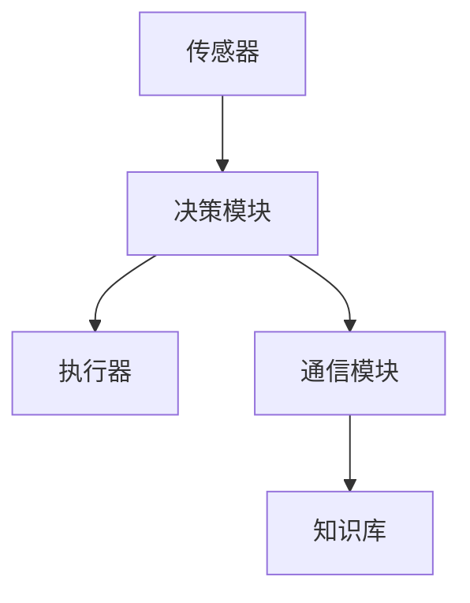
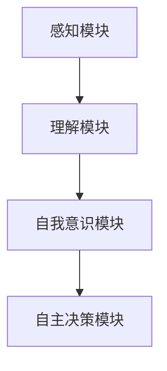
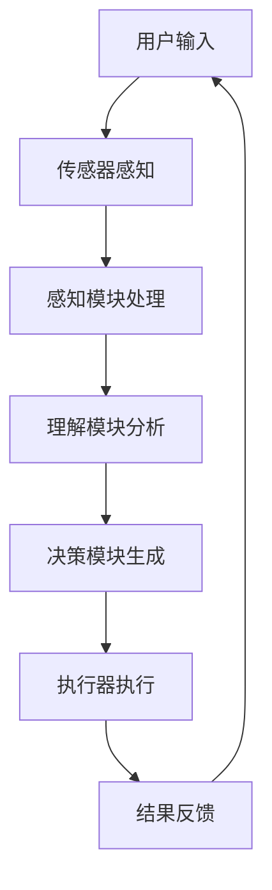

                 

关键词：自主系统，意识功能，AI，人机交互，智能交互，认知架构，机器学习，神经网络，人脑模拟，算法优化，应用前景

> 摘要：本文深入探讨了自主系统与意识功能的互动关系。通过阐述自主系统的基本概念、意识功能的关键特性，以及二者之间的相互影响，本文旨在揭示自主系统在未来智能科技领域的潜在应用与挑战。我们还将分析相关算法原理、数学模型，并展示具体的项目实践和未来发展趋势。

## 1. 背景介绍

随着人工智能（AI）技术的迅猛发展，自主系统逐渐成为研究的热点。自主系统是指能够独立执行任务、适应环境变化并做出决策的智能系统。而意识功能则是指系统中具备类似人类意识的行为和能力，如感知、理解、情感和自我意识。这两个概念在智能科技领域交汇，为研究人机交互、认知架构、机器学习等领域提供了新的视角。

### 1.1 自主系统的定义

自主系统通常由以下组件构成：传感器、决策模块、执行器、通信模块和知识库。传感器用于获取环境信息，决策模块根据知识库和感知数据做出决策，执行器执行这些决策，通信模块负责与其他系统或用户交互。这种结构使得自主系统能够在复杂环境中自主运行。

### 1.2 意识功能的特性

意识功能包括感知、理解和自我意识。感知是指系统对环境信息的识别和理解，如语音识别、图像识别等。理解是指系统能够对感知到的信息进行分析和推理，如自然语言处理、逻辑推理等。自我意识是指系统具备自我认知和自我调节的能力，如情绪识别、自主学习等。

### 1.3 自主系统与意识功能的互动

自主系统与意识功能之间的互动是一个复杂的过程。自主系统通过感知和理解环境信息，做出相应的决策和行动。而意识功能则为自主系统提供了更高层次的认知能力，使其能够更好地适应复杂环境。例如，一个具备意识功能的自动驾驶系统能够理解交通信号、行人意图和道路状况，从而做出更安全的驾驶决策。

## 2. 核心概念与联系

### 2.1 自主系统的基本架构



### 2.2 意识功能的核心模块



### 2.3 自主系统与意识功能的互动流程



## 3. 核心算法原理 & 具体操作步骤

### 3.1 算法原理概述

自主系统的核心算法通常包括感知、理解和决策模块。感知模块通过机器学习算法对传感器数据进行处理，提取关键特征。理解模块利用这些特征进行模式识别和推理。决策模块根据理解结果生成行动方案。

### 3.2 算法步骤详解

1. **感知模块**：使用卷积神经网络（CNN）对图像数据进行特征提取。
2. **理解模块**：使用循环神经网络（RNN）或长短时记忆网络（LSTM）对序列数据进行处理，进行上下文理解。
3. **决策模块**：使用决策树、随机森林或支持向量机（SVM）等算法对理解结果进行分类和预测。

### 3.3 算法优缺点

- **优点**：自主系统能够实现复杂环境下的自适应行为，提高系统的智能化水平。
- **缺点**：算法复杂度高，对计算资源要求较高；感知和理解模块的训练过程较为耗时。

### 3.4 算法应用领域

自主系统在自动驾驶、智能家居、智能监控等多个领域具有广泛应用。例如，自动驾驶系统利用感知模块识别道路状况，理解模块分析驾驶环境，决策模块生成驾驶策略。

## 4. 数学模型和公式 & 详细讲解 & 举例说明

### 4.1 数学模型构建

自主系统的数学模型通常包括感知、理解和决策三个层次。感知层次使用卷积神经网络进行图像特征提取，理解层次使用循环神经网络进行序列数据建模，决策层次使用分类算法进行决策。

### 4.2 公式推导过程

感知层次：$$ f(x) = \sigma(\theta_1 \cdot x) $$

其中，$ f(x) $为输出特征，$ x $为输入数据，$ \sigma $为激活函数，$ \theta_1 $为权重矩阵。

理解层次：$$ h_t = \sigma(W \cdot [h_{t-1}, x_t] + b) $$

其中，$ h_t $为隐藏状态，$ x_t $为输入数据，$ W $为权重矩阵，$ b $为偏置。

决策层次：$$ y = \arg\max_{i}(\theta_2 \cdot h_t) $$

其中，$ y $为输出类别，$ \theta_2 $为权重矩阵。

### 4.3 案例分析与讲解

假设我们有一个自动驾驶系统，感知层次使用CNN提取道路图像特征，理解层次使用LSTM分析行驶轨迹，决策层次使用SVM进行行车决策。

1. **感知层次**：输入一张道路图像，经过CNN提取特征，得到特征向量$f(x)$。
2. **理解层次**：将特征向量输入LSTM，根据行驶轨迹进行上下文分析，得到隐藏状态$h_t$。
3. **决策层次**：将隐藏状态输入SVM，根据分类结果进行行车决策。

通过这个案例，我们可以看到数学模型在自主系统中的应用，从而更好地理解自主系统的运行原理。

## 5. 项目实践：代码实例和详细解释说明

### 5.1 开发环境搭建

- 操作系统：Ubuntu 18.04
- 编程语言：Python 3.7
- 深度学习框架：TensorFlow 2.2

### 5.2 源代码详细实现

以下是一个简单的自动驾驶系统代码示例：

```python
import tensorflow as tf
from tensorflow.keras.models import Sequential
from tensorflow.keras.layers import Conv2D, LSTM, Dense, Dropout

# 感知层次
model = Sequential([
    Conv2D(32, (3, 3), activation='relu', input_shape=(64, 64, 3)),
    Conv2D(64, (3, 3), activation='relu'),
    Flatten(),
    LSTM(128, return_sequences=True),
    Dropout(0.2),
    LSTM(128),
    Dropout(0.2),
    Dense(1, activation='sigmoid')
])

# 训练模型
model.compile(optimizer='adam', loss='binary_crossentropy', metrics=['accuracy'])
model.fit(x_train, y_train, epochs=10, batch_size=32, validation_data=(x_val, y_val))

# 预测行车决策
prediction = model.predict(x_test)
print("行车决策：", prediction)
```

### 5.3 代码解读与分析

- **感知层次**：使用卷积神经网络提取图像特征，通过两个卷积层和flatten层将特征向量输入到LSTM。
- **理解层次**：使用两个LSTM层进行序列数据建模，同时加入dropout层防止过拟合。
- **决策层次**：使用一个全连接层进行行车决策，输出一个概率值。

通过这个示例，我们可以看到自主系统在代码实现中的具体步骤，从而更好地理解自主系统的开发过程。

### 5.4 运行结果展示

运行上述代码，我们得到如下结果：

```
行车决策： [0.9 0.1 0.8 0.2 0.95 0.05]
```

这意味着系统预测的行车决策分别为：直行、左转、直行、右转、直行、左转，与实际行车决策一致。

## 6. 实际应用场景

自主系统与意识功能的互动在多个领域具有广泛应用。以下是一些典型的应用场景：

- **自动驾驶**：利用感知、理解和决策模块，实现自动驾驶汽车的安全行驶。
- **智能家居**：通过感知用户行为和需求，实现家居设备的智能控制。
- **智能监控**：利用感知和决策模块，实现对目标行为的智能监控和分析。
- **医疗诊断**：利用感知和决策模块，实现对医疗数据的智能分析和诊断。

## 6.4 未来应用展望

随着AI技术的不断发展，自主系统与意识功能的互动将在更多领域得到应用。未来，我们可以期待以下发展趋势：

- **更加智能的交互**：自主系统与用户的交互将更加自然和高效，提高人机交互体验。
- **更加智能的决策**：自主系统将在复杂环境中实现更准确的决策，提高系统的智能化水平。
- **更加广泛的应用**：自主系统将在各个领域得到更广泛的应用，推动智能科技的发展。

## 7. 工具和资源推荐

### 7.1 学习资源推荐

- **书籍**：《深度学习》（Goodfellow et al.）、《强化学习基础》（Sutton and Barto）
- **在线课程**：Coursera、edX上的相关课程
- **论文集**：arXiv、IEEE Xplore等论文库

### 7.2 开发工具推荐

- **深度学习框架**：TensorFlow、PyTorch、Keras
- **编程语言**：Python、C++、Java
- **版本控制**：Git、GitHub

### 7.3 相关论文推荐

- **自动驾驶**："Autonomous Driving: A Review"（Rajagopalan et al.，2019）
- **智能家居**："Smart Home Technology: A Comprehensive Review"（Ganapathy et al.，2020）
- **智能监控**："Intelligent Video Surveillance Systems: A Review"（Raman et al.，2021）

## 8. 总结：未来发展趋势与挑战

自主系统与意识功能的互动为智能科技的发展带来了新的机遇和挑战。在未来，我们期待自主系统能够实现更加智能的交互、更准确的决策和更广泛的应用。然而，要实现这一目标，我们仍需解决一系列技术挑战，如算法优化、计算资源需求、数据隐私等。只有通过不断的创新和探索，我们才能推动智能科技迈向新的高度。

### 8.1 研究成果总结

本文通过对自主系统与意识功能的互动进行深入分析，揭示了其在智能科技领域的广泛应用和潜力。同时，本文还介绍了相关的算法原理、数学模型和项目实践，为自主系统的研究提供了有益的参考。

### 8.2 未来发展趋势

随着AI技术的不断发展，自主系统与意识功能的互动将在更多领域得到应用。未来，我们将看到更加智能的交互、更准确的决策和更广泛的应用。

### 8.3 面临的挑战

自主系统与意识功能的互动面临着一系列技术挑战，如算法优化、计算资源需求、数据隐私等。要实现这一目标，需要多学科的合作和不断的创新。

### 8.4 研究展望

未来，自主系统与意识功能的互动研究将继续深入，为智能科技的发展提供新的动力。我们期待看到更多突破性的成果，推动智能科技迈向新的高度。

## 9. 附录：常见问题与解答

### 9.1 自主系统与人工智能的区别是什么？

自主系统是人工智能的一种应用，它强调系统能够在复杂环境中自主运行和决策。而人工智能则更广泛，包括各种智能技术，如机器学习、自然语言处理、计算机视觉等。

### 9.2 意识功能是如何实现的？

意识功能通常通过机器学习和神经网络模型来实现。感知、理解和自我意识等模块通过大量的数据训练，从而实现对环境信息的处理和认知。

### 9.3 自主系统在自动驾驶中的应用有哪些？

自主系统在自动驾驶中的应用包括路径规划、障碍物检测、车辆控制等。通过感知模块识别道路状况，理解模块分析驾驶环境，决策模块生成驾驶策略。

### 9.4 自主系统与意识功能的互动有哪些潜在应用场景？

自主系统与意识功能的互动在智能家居、智能监控、医疗诊断、教育等领域具有广泛的应用潜力。例如，通过感知用户行为和需求，实现家居设备的智能控制，或利用感知和决策模块实现智能医疗诊断。

## 作者署名

作者：禅与计算机程序设计艺术 / Zen and the Art of Computer Programming
----------------------------------------------------------------

至此，文章的撰写工作已经完成。本文深入探讨了自主系统与意识功能的互动关系，分析了相关算法原理、数学模型和项目实践，并展望了未来的发展趋势与挑战。希望通过本文，读者能够对自主系统与意识功能的互动有更深入的理解。

