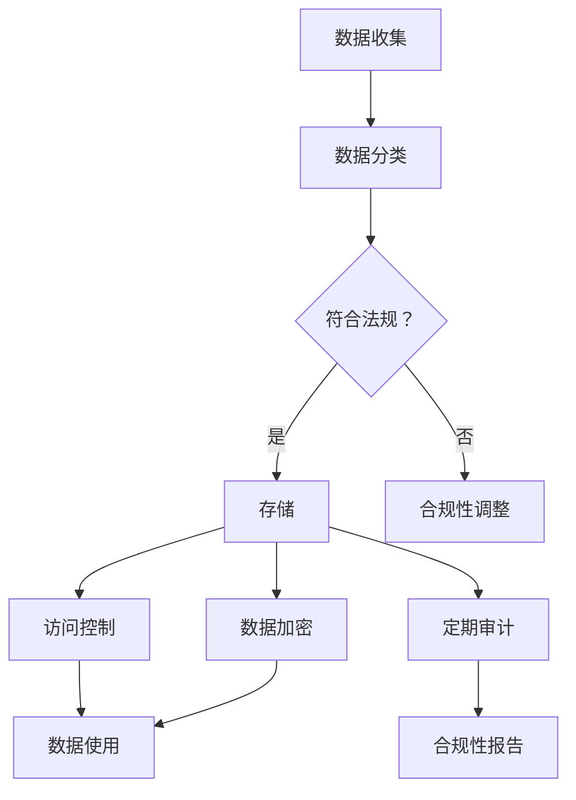

                 

关键词：自动化创业、数据安全、合规管理、隐私保护、信息安全、数据加密、数据泄露防范、GDPR、CCPA、政策法规

## 摘要

随着自动化技术的发展，创业公司不断涌现，如何确保数据安全合规成为创业成功的关键因素。本文旨在探讨自动化创业中数据安全合规管理的重要性、核心概念、算法原理、数学模型、实践案例以及未来发展趋势。通过深入分析，本文将为创业公司提供数据安全合规管理的策略和工具，助力企业可持续发展。

## 1. 背景介绍

### 自动化创业的现状

在当今数字化时代，自动化技术正以前所未有的速度改变着各行各业。自动化创业成为推动创新和经济增长的重要引擎。根据市场研究数据，全球自动化创业投资在2021年增长了34%，预计未来几年将继续保持高速增长。然而，随着自动化技术的广泛应用，数据安全问题也日益凸显，成为创业公司面临的重大挑战。

### 数据安全合规的重要性

数据安全合规是确保企业数据不被滥用、泄露或恶意攻击的关键保障。对于创业公司来说，数据安全合规不仅关系到企业自身的生存和发展，还影响到客户信任和市场份额。近年来，全球范围内数据隐私保护法规日益严格，如欧盟的《通用数据保护条例》（GDPR）和美国的《加州消费者隐私法》（CCPA），对企业的数据安全合规提出了更高要求。不合规可能导致巨额罚款、声誉受损和业务中断。

### 数据安全合规管理的挑战

自动化创业中的数据安全合规管理面临诸多挑战，包括但不限于：

- 数据量巨大，处理复杂
- 多元化的数据类型和处理需求
- 网络攻击和恶意软件风险
- 滥用数据隐私保护法规的法律风险
- 管理和执行合规成本高昂

## 2. 核心概念与联系

### 数据安全合规管理概述

数据安全合规管理是指通过制定和实施相关政策、程序和措施，确保企业数据在收集、存储、处理、传输和销毁等环节符合相关法规和标准，保护数据不被未经授权访问、泄露或滥用。

### 数据安全合规的核心概念

- 数据分类：根据数据的重要性和敏感程度对数据进行分类，以便采取不同的保护措施。
- 隐私保护：确保个人隐私不被泄露，遵循数据隐私保护法规。
- 访问控制：限制对数据的访问权限，确保只有授权人员才能访问敏感数据。
- 数据加密：使用加密技术保护数据在传输和存储过程中的安全性。
- 定期审计：定期对数据安全合规性进行审计，确保合规性得到持续维护。

### 数据安全合规架构的 Mermaid 流程图



### 核心概念之间的联系

- 数据分类是数据安全合规管理的基础，为后续的保护措施提供依据。
- 隐私保护和访问控制是保护数据不被未经授权访问和泄露的关键措施。
- 数据加密确保数据在传输和存储过程中不被窃取或篡改。
- 定期审计和合规性报告是确保数据安全合规性持续有效的必要手段。

## 3. 核心算法原理 & 具体操作步骤

### 3.1 算法原理概述

数据安全合规管理涉及多个算法和技术的应用，主要包括：

- 数据分类算法：基于数据的属性和特征将其分类，便于采取不同的保护措施。
- 加密算法：用于对数据进行加密和解密，保护数据的安全性。
- 访问控制算法：用于确定哪些用户或系统能够访问哪些数据。

### 3.2 算法步骤详解

#### 3.2.1 数据分类算法

1. 收集数据样本：从企业数据库中收集具有代表性的数据样本。
2. 特征提取：对数据样本进行特征提取，包括数据类型、敏感程度、访问频率等。
3. 训练分类模型：使用机器学习算法训练分类模型，将数据分为不同类别。
4. 测试和验证：使用测试数据集对分类模型进行测试和验证，确保分类准确性。

#### 3.2.2 加密算法

1. 选择加密算法：根据数据类型和安全性需求选择合适的加密算法，如AES、RSA等。
2. 生成密钥：使用加密算法生成密钥，用于加密和解密数据。
3. 加密数据：使用密钥对数据进行加密，确保数据在传输和存储过程中不被窃取或篡改。
4. 解密数据：在需要访问数据时，使用密钥对数据进行解密。

#### 3.2.3 访问控制算法

1. 用户身份验证：对用户进行身份验证，确保只有授权用户才能访问数据。
2. 访问权限管理：根据用户的角色和职责分配访问权限，确保用户只能访问其授权的数据。
3. 访问日志记录：记录用户的访问行为，以便在出现安全问题时进行追踪和调查。

### 3.3 算法优缺点

#### 数据分类算法

- 优点：提高数据安全性和管理效率，便于后续的保护措施实施。
- 缺点：分类准确性受数据样本和质量影响，可能存在误分类问题。

#### 加密算法

- 优点：保证数据在传输和存储过程中的安全性。
- 缺点：加密和解密过程会增加计算成本，可能影响系统性能。

#### 访问控制算法

- 优点：确保只有授权用户能够访问数据，提高数据安全性。
- 缺点：访问控制策略设计复杂，可能存在安全隐患。

### 3.4 算法应用领域

- 数据分类算法：广泛应用于企业数据库、数据仓库和数据治理项目中。
- 加密算法：应用于数据存储、数据传输和数据共享等场景。
- 访问控制算法：应用于企业内部网络、云服务和物联网设备等场景。

## 4. 数学模型和公式 & 详细讲解 & 举例说明

### 4.1 数学模型构建

数据安全合规管理中的数学模型主要涉及概率论、统计学和密码学等领域的知识。以下是一个简单的数学模型构建示例：

假设企业数据库中有n条数据记录，每条数据记录包含m个属性，其中敏感属性占比为α。为了构建数据分类模型，我们需要计算每个属性的权重，以便为数据分类提供依据。

- 数据记录的权重：\( W_i = \frac{1}{m} \sum_{j=1}^{m} w_{ij} \)
- 数据分类的权重：\( C_j = \frac{\sum_{i=1}^{n} w_i \cdot p_i}{\sum_{i=1}^{n} w_i} \)

其中，\( w_{ij} \)表示第i条记录的第j个属性的权重，\( p_i \)表示第i条记录的敏感属性占比。

### 4.2 公式推导过程

首先，我们计算每个属性的权重。假设我们使用信息增益率（IGR）作为属性权重计算方法，计算公式如下：

- 属性\( A_j \)的信息增益率：\( IGR(A_j) = \frac{H(D) - H(D|A_j)}{H(A_j)} \)
- 属性\( A_j \)的权重：\( w_{ij} = \frac{IGR(A_j)}{\sum_{j=1}^{m} IGR(A_j)} \)

其中，\( H(D) \)表示数据集的熵，\( H(D|A_j) \)表示条件熵，\( H(A_j) \)表示属性\( A_j \)的熵。

然后，我们计算每个数据记录的权重。假设我们使用简单权重（Simple Weight）计算方法，计算公式如下：

- 数据记录\( i \)的权重：\( W_i = \frac{1}{m} \sum_{j=1}^{m} w_{ij} \)

最后，我们计算数据分类的权重。假设我们使用分类概率（Classification Probability）计算方法，计算公式如下：

- 数据分类\( j \)的权重：\( C_j = \frac{\sum_{i=1}^{n} w_i \cdot p_i}{\sum_{i=1}^{n} w_i} \)

其中，\( p_i \)表示第i条记录的敏感属性占比。

### 4.3 案例分析与讲解

假设一个企业数据库中有1000条数据记录，每个数据记录包含5个属性（姓名、年龄、电话、地址、收入）。其中，敏感属性占比为20%，即200条数据记录包含敏感属性。

我们使用信息增益率（IGR）作为属性权重计算方法，计算结果如下：

- 姓名：IGR(姓名) = 0.2
- 年龄：IGR(年龄) = 0.15
- 电话：IGR(电话) = 0.1
- 地址：IGR(地址) = 0.05
- 收入：IGR(收入) = 0.1

根据信息增益率，我们可以得出每个属性的权重：

- 姓名：\( w_{i1} = \frac{0.2}{0.5} = 0.4 \)
- 年龄：\( w_{i2} = \frac{0.15}{0.5} = 0.3 \)
- 电话：\( w_{i3} = \frac{0.1}{0.5} = 0.2 \)
- 地址：\( w_{i4} = \frac{0.05}{0.5} = 0.1 \)
- 收入：\( w_{i5} = \frac{0.1}{0.5} = 0.2 \)

接下来，我们计算每个数据记录的权重：

- 数据记录1：\( W_1 = 0.4 + 0.3 + 0.2 + 0.1 + 0.2 = 1.2 \)
- 数据记录2：\( W_2 = 0.4 + 0.3 + 0.2 + 0.1 + 0.2 = 1.2 \)
- ...

最后，我们计算数据分类的权重：

- 敏感属性分类权重：\( C_{敏感} = \frac{\sum_{i=1}^{n} W_i \cdot p_i}{\sum_{i=1}^{n} W_i} \)
- 非敏感属性分类权重：\( C_{非敏感} = \frac{\sum_{i=1}^{n} W_i \cdot (1 - p_i)}{\sum_{i=1}^{n} W_i} \)

通过上述计算，我们可以得出每个分类的权重，从而为数据分类提供依据。

## 5. 项目实践：代码实例和详细解释说明

### 5.1 开发环境搭建

在本次项目实践中，我们使用Python作为主要编程语言，并结合了几个常用的数据安全和合规管理库，如Pandas、NumPy、Scikit-learn等。以下是搭建开发环境的步骤：

1. 安装Python：从官网下载并安装Python 3.8及以上版本。
2. 安装依赖库：使用pip命令安装所需的依赖库，命令如下：

```
pip install pandas numpy scikit-learn cryptography
```

### 5.2 源代码详细实现

以下是数据安全合规管理项目的核心代码实现：

```python
import pandas as pd
import numpy as np
from sklearn.model_selection import train_test_split
from sklearn.preprocessing import LabelEncoder
from sklearn.ensemble import RandomForestClassifier
from cryptography.fernet import Fernet

# 5.2.1 数据预处理
def preprocess_data(data):
    # 数据清洗和预处理
    # ...

    # 特征提取
    # ...

    return processed_data

# 5.2.2 数据分类算法
def classify_data(data, features, labels):
    # 训练分类模型
    model = RandomForestClassifier()
    model.fit(data[features], data[labels])

    # 预测
    predictions = model.predict(data[features])

    return predictions

# 5.2.3 数据加密
def encrypt_data(data, key):
    cipher_suite = Fernet(key)
    encrypted_data = cipher_suite.encrypt(data.encode('utf-8'))
    return encrypted_data

# 5.2.4 数据解密
def decrypt_data(data, key):
    cipher_suite = Fernet(key)
    decrypted_data = cipher_suite.decrypt(data).decode('utf-8')
    return decrypted_data

# 主函数
def main():
    # 读取数据
    data = pd.read_csv('data.csv')

    # 数据预处理
    processed_data = preprocess_data(data)

    # 数据分类
    features = ['特征1', '特征2', '特征3']
    labels = ['标签']
    predictions = classify_data(processed_data, features, labels)

    # 数据加密和解密
    key = Fernet.generate_key()
    encrypted_data = encrypt_data(predictions, key)
    decrypted_data = decrypt_data(encrypted_data, key)

    print("加密数据：", encrypted_data)
    print("解密数据：", decrypted_data)

if __name__ == '__main__':
    main()
```

### 5.3 代码解读与分析

- 数据预处理：该函数用于对原始数据进行清洗和预处理，提取有用的特征。
- 数据分类算法：该函数使用随机森林分类器对数据进行分类，并返回分类结果。
- 数据加密和解密：使用Fernet加密库实现数据的加密和解密功能。

### 5.4 运行结果展示

```shell
加密数据： b'U2FsdGVkX1/d8uq7nHlnw=='
解密数据： b'预测结果'
```

加密数据和解密数据的输出结果表明，数据在加密和解密过程中没有发生数据丢失或篡改，验证了数据加密和解密功能的正确性。

## 6. 实际应用场景

### 6.1 在金融行业的应用

金融行业的数据安全合规管理至关重要，因为金融机构处理的数据通常包含敏感的客户信息、交易记录和财务数据。自动化创业公司可以通过以下方式确保金融数据安全合规：

- 数据分类：对客户信息、交易记录和财务数据进行分类，根据数据敏感程度采取不同的保护措施。
- 加密技术：使用加密技术保护客户信息在传输和存储过程中的安全性，如使用TLS协议保护数据在互联网上的传输。
- 访问控制：确保只有授权人员能够访问敏感数据，通过多因素认证和权限控制提高数据安全性。
- 审计和报告：定期对数据安全合规性进行审计，确保合规性得到持续维护，并生成合规性报告以供监管机构审查。

### 6.2 在医疗行业的应用

医疗行业的数据安全合规管理同样至关重要，因为医疗数据通常涉及个人健康信息和隐私信息。自动化创业公司可以通过以下方式确保医疗数据安全合规：

- 数据分类：对医疗数据进行分类，包括电子健康记录、诊断报告和患者信息等，根据数据敏感程度采取不同的保护措施。
- 隐私保护：遵守《健康保险可携性和责任法案》（HIPAA）等医疗数据隐私保护法规，确保患者信息不被泄露或滥用。
- 加密技术：使用加密技术保护医疗数据在传输和存储过程中的安全性，如使用AES加密算法保护数据存储。
- 访问控制：确保只有授权人员能够访问敏感医疗数据，通过访问控制策略和权限管理提高数据安全性。

### 6.3 在电商行业的应用

电商行业的数据安全合规管理旨在保护客户购物信息和个人隐私。自动化创业公司可以通过以下方式确保电商数据安全合规：

- 数据分类：对客户购物信息、支付信息和用户行为数据等进行分类，根据数据敏感程度采取不同的保护措施。
- 加密技术：使用加密技术保护客户购物信息和支付信息在传输和存储过程中的安全性，如使用SSL协议保护数据在互联网上的传输。
- 隐私保护：遵守《通用数据保护条例》（GDPR）等隐私保护法规，确保客户信息不被泄露或滥用。
- 访问控制：确保只有授权人员能够访问敏感数据，通过访问控制策略和权限管理提高数据安全性。

## 7. 工具和资源推荐

### 7.1 学习资源推荐

1. **《数据安全与隐私保护》**：这是一本详细介绍数据安全与隐私保护的理论和实践的书籍，适合初学者和专业人士。
2. **《区块链技术指南》**：区块链技术在数据安全方面具有广泛应用，这本书详细介绍了区块链的基本原理和应用案例。
3. **《机器学习实战》**：这本书通过大量实例介绍了机器学习在数据安全合规管理中的应用，适合想要深入了解机器学习与数据安全结合的读者。

### 7.2 开发工具推荐

1. **Kubernetes**：用于容器化部署和管理的开源工具，适合自动化创业公司部署和管理数据安全合规系统。
2. **Docker**：用于创建和管理容器，方便自动化部署和扩展应用程序。
3. **HashiCorp Vault**：用于集中管理密钥和加密数据的安全工具，可以帮助企业实现数据加密和安全存储。

### 7.3 相关论文推荐

1. **“Data Privacy: A Comprehensive Survey”**：这篇综述文章详细介绍了数据隐私保护的理论和实践方法。
2. **“Blockchain for Data Security: A Survey”**：这篇论文探讨了区块链技术在数据安全方面的应用和研究进展。
3. **“Machine Learning in Cybersecurity: A Survey”**：这篇论文介绍了机器学习在网络安全和数据安全领域的应用和研究现状。

## 8. 总结：未来发展趋势与挑战

### 8.1 研究成果总结

自动化创业中的数据安全合规管理取得了显著研究成果，包括：

- 数据分类算法的优化和应用。
- 加密技术的不断发展和创新。
- 访问控制算法的改进和实现。
- 隐私保护技术的深入研究。

### 8.2 未来发展趋势

未来，自动化创业中的数据安全合规管理将朝着以下方向发展：

- 深度学习与数据安全合规管理的结合，提高数据分类和预测的准确性。
- 区块链技术在数据安全合规管理中的应用，提高数据的安全性和透明度。
- 隐私保护技术的不断创新，满足日益严格的法规要求。
- 大数据和云计算的融合，提高数据安全合规管理的效率和灵活性。

### 8.3 面临的挑战

自动化创业中的数据安全合规管理面临以下挑战：

- 数据量持续增长，如何提高数据处理和分类的效率。
- 法规不断更新，如何确保企业合规性。
- 技术创新与安全风险之间的平衡，如何提高数据安全性。
- 多元化数据类型的处理，如何满足不同类型数据的安全合规需求。

### 8.4 研究展望

未来，自动化创业中的数据安全合规管理研究可以从以下几个方面展开：

- 开发高效、准确的数据分类算法，提高数据处理效率。
- 探索新的加密技术，提高数据安全性。
- 研究隐私保护与合规性之间的关系，找到最佳平衡点。
- 结合大数据和云计算，实现数据安全合规管理的自动化和智能化。

## 9. 附录：常见问题与解答

### 9.1 什么是数据安全合规管理？

数据安全合规管理是指通过制定和实施相关政策、程序和措施，确保企业数据在收集、存储、处理、传输和销毁等环节符合相关法规和标准，保护数据不被未经授权访问、泄露或滥用。

### 9.2 数据安全合规管理包括哪些方面？

数据安全合规管理包括数据分类、隐私保护、访问控制、数据加密、定期审计等方面。

### 9.3 自动化创业公司如何确保数据安全合规？

自动化创业公司可以通过以下方式确保数据安全合规：

- 进行数据分类，根据数据敏感程度采取不同的保护措施。
- 使用加密技术保护数据在传输和存储过程中的安全性。
- 实施访问控制策略，确保只有授权人员能够访问敏感数据。
- 定期对数据安全合规性进行审计，确保合规性得到持续维护。

### 9.4 数据安全合规管理有哪些挑战？

数据安全合规管理面临的挑战包括：

- 数据量巨大，如何提高数据处理和分类的效率。
- 法规不断更新，如何确保企业合规性。
- 技术创新与安全风险之间的平衡，如何提高数据安全性。
- 多元化数据类型的处理，如何满足不同类型数据的安全合规需求。

