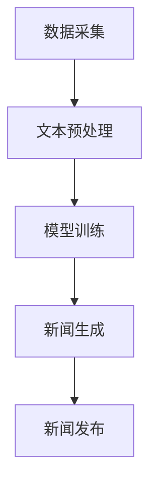
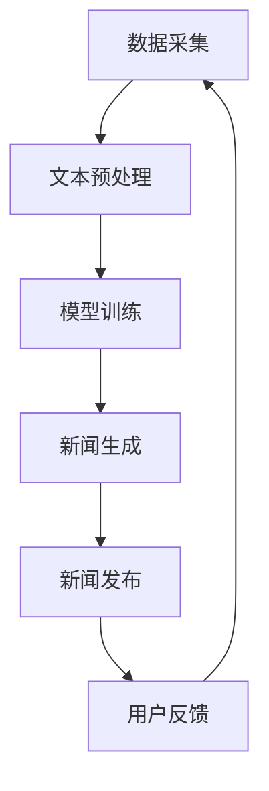

                 

关键词：自动化新闻生成、大型语言模型（LLM）、新闻产业、算法原理、数学模型、项目实践、应用场景、未来展望

> 摘要：本文深入探讨了大型语言模型（LLM）在自动化新闻生成领域的应用潜力。通过对LLM算法原理、数学模型的详细解析，以及实际项目实践的代码解读，文章展示了LLM如何重塑新闻产业，为未来新闻制作带来革命性的变化。

## 1. 背景介绍

随着互联网的快速发展，新闻传播的速度和广度得到了前所未有的提升。然而，传统新闻产业面临着信息过载、内容同质化以及人力成本上升等问题。在这种情况下，自动化新闻生成技术应运而生，其核心就是利用人工智能，尤其是大型语言模型（LLM）来生成高质量的新闻内容。

LLM是一种基于深度学习技术的自然语言处理模型，具有强大的文本生成能力。近年来，随着计算能力和数据规模的提升，LLM在各个领域都取得了显著进展。在新闻产业中，LLM的应用潜力引起了广泛关注，不仅能够提高新闻生产的效率，还能为个性化新闻推荐提供技术支持。

本文旨在探讨LLM在自动化新闻生成中的可能性，分析其算法原理、数学模型，并通过实际项目实践，展示LLM如何重塑新闻产业。同时，文章还将探讨这一技术的未来发展趋势、面临的挑战及研究展望。

## 2. 核心概念与联系

### 2.1 大型语言模型（LLM）

大型语言模型（LLM）是一种基于深度学习技术的自然语言处理模型，通过在大量文本数据上进行预训练，能够理解并生成高质量的文本内容。LLM的核心特点是具备强大的上下文理解能力，能够处理复杂的语言结构和语义关系。

### 2.2 自动化新闻生成

自动化新闻生成是指利用人工智能技术，特别是LLM，自动生成新闻内容的过程。这一技术不仅能够提高新闻生产的速度和效率，还能降低人力成本，提高新闻内容的个性化程度。

### 2.3 新闻产业

新闻产业是指以新闻报道、新闻传播为核心的一系列业务活动。随着互联网的兴起，新闻产业发生了深刻变革，从传统纸媒向数字化、智能化的方向发展。

### 2.4 Mermaid 流程图

Mermaid 是一种基于 Markdown 的图形化工具，用于绘制流程图、时序图等。以下是一个简单的 Mermaid 流程图，展示了LLM在自动化新闻生成中的应用流程：



### 2.5 自动化新闻生成系统架构

自动化新闻生成系统的架构主要包括数据采集、文本预处理、模型训练、新闻生成和新闻发布等模块。以下是一个简化的系统架构图：



## 3. 核心算法原理 & 具体操作步骤

### 3.1 算法原理概述

自动化新闻生成的核心算法是大型语言模型（LLM），尤其是基于 Transformer 架构的模型，如 GPT-3、BERT 等。这些模型通过在大量文本数据上进行预训练，掌握了丰富的语言知识和上下文理解能力，能够生成符合语法和语义规则的新闻内容。

### 3.2 算法步骤详解

#### 3.2.1 数据采集

数据采集是自动化新闻生成的第一步，主要包括从互联网、数据库等渠道获取新闻文本数据。这些数据可以来源于新闻网站、社交媒体、政府公告等。

#### 3.2.2 文本预处理

文本预处理是对采集到的新闻文本数据进行清洗和格式化，包括去除停用词、标点符号、统一文本编码等。此外，还可以进行词向量化，将文本转换为数值形式，便于模型处理。

#### 3.2.3 模型训练

模型训练是自动化新闻生成的关键环节，通过对预处理后的新闻文本数据进行训练，大型语言模型（LLM）能够学习和掌握新闻写作的语法和语义规则。训练过程中，可以使用训练集和验证集来优化模型参数，提高生成新闻的质量。

#### 3.2.4 新闻生成

新闻生成是基于训练好的模型，输入特定主题或关键词，生成相应的新闻内容。生成过程中，模型会根据上下文和语义信息，生成符合语法和逻辑规则的新闻文本。

#### 3.2.5 新闻发布

新闻生成后，可以通过新闻发布平台或社交媒体进行发布。发布过程中，可以根据用户反馈和阅读数据，对新闻内容进行实时优化和调整。

### 3.3 算法优缺点

#### 优点：

1. 提高新闻生产效率：自动化新闻生成技术能够快速生成大量新闻内容，提高新闻生产速度。
2. 降低人力成本：自动化新闻生成技术可以降低新闻产业的人力成本，提高运营效率。
3. 提高个性化程度：基于用户兴趣和偏好，自动化新闻生成技术能够生成个性化的新闻内容。

#### 缺点：

1. 质量控制困难：自动化新闻生成技术生成的新闻内容质量参差不齐，需要人工审核和校正。
2. 缺乏深度和广度：自动化新闻生成技术主要关注新闻的表层信息，难以深入挖掘新闻背后的故事和细节。
3. 法律和伦理问题：自动化新闻生成技术可能引发版权、隐私和法律等方面的问题。

### 3.4 算法应用领域

自动化新闻生成技术可以应用于多个领域，如：

1. 证券新闻：自动化生成股票、基金等证券市场相关的新闻。
2. 体育新闻：自动化生成体育赛事、运动员报道等新闻。
3. 行业新闻：自动化生成科技、医疗、金融等行业相关的新闻。
4. 智能推荐：基于用户兴趣和偏好，自动化生成个性化新闻推荐。

## 4. 数学模型和公式 & 详细讲解 & 举例说明

### 4.1 数学模型构建

自动化新闻生成中的核心数学模型是 Transformer 模型，其基本结构包括编码器（Encoder）和解码器（Decoder）。以下是一个简化的 Transformer 模型数学模型：

$$
\begin{aligned}
&\text{编码器：} \\
&\text{输入序列：} x_1, x_2, ..., x_T \\
&\text{编码器输出：} h_1, h_2, ..., h_T \\
&h_t = \text{LayerNorm}(MSE(h_{<t-1}) + \text{MaskedMultiHeadAttention}(h_{<t-1}, h_{<t-1}, h_{<t-1})) \\
&\text{解码器：} \\
&\text{输入序列：} y_1, y_2, ..., y_T \\
&\text{解码器输出：} y_1^*, y_2^*, ..., y_T^* \\
&y_t = \text{LayerNorm}(y_t + \text{MaskedMultiHeadAttention}(h, h, y_{<t})) \\
\end{aligned}
$$

其中，$MSE$ 表示多头自注意力机制（MultiHeadSelfAttention），$LayerNorm$ 表示层归一化（LayerNormalization）。

### 4.2 公式推导过程

#### 4.2.1 多头自注意力机制（MultiHeadSelfAttention）

多头自注意力机制是 Transformer 模型的核心组件，用于计算输入序列的权重。以下是一个简化的多头自注意力机制推导过程：

$$
\begin{aligned}
&\text{输入序列：} \\
&q_1, q_2, ..., q_T \\
&\text{权重矩阵：} \\
&W_q, W_k, W_v \\
&\text{自注意力得分：} \\
&s_{ij} = q_i^T W_k h_j \\
&\text{归一化权重：} \\
&w_{ij} = \frac{e^{s_{ij}}}{\sqrt{d_k}} \\
&\text{加权求和：} \\
&h_i' = \sum_{j=1}^T w_{ij} h_j \\
\end{aligned}
$$

#### 4.2.2 层归一化（LayerNormalization）

层归一化用于对输入数据进行标准化，使得模型在不同训练阶段保持稳定。以下是一个简化的层归一化推导过程：

$$
\begin{aligned}
&\text{输入数据：} \\
&z \\
&\text{均值和方差：} \\
&\mu, \sigma^2 \\
&\text{层归一化：} \\
&\hat{z} = \frac{z - \mu}{\sqrt{\sigma^2 + \epsilon}} \\
\end{aligned}
$$

其中，$\epsilon$ 是一个很小的常数，用于防止分母为零。

### 4.3 案例分析与讲解

以下是一个简单的自动化新闻生成案例，使用 GPT-3 模型生成一篇关于科技行业的新闻报道。

#### 4.3.1 数据采集

从互联网上获取科技行业的新闻文本数据，如科技新闻网站、社交媒体等。

#### 4.3.2 文本预处理

对采集到的新闻文本数据进行清洗和格式化，去除停用词、标点符号，统一文本编码。

#### 4.3.3 模型训练

使用预处理后的新闻文本数据，对 GPT-3 模型进行训练，优化模型参数，提高生成新闻的质量。

#### 4.3.4 新闻生成

输入特定主题或关键词，如“人工智能在医疗领域的应用”，使用 GPT-3 模型生成相应的新闻内容。

#### 4.3.5 新闻发布

将生成的新闻内容发布到新闻网站或社交媒体，供用户阅读和评论。

## 5. 项目实践：代码实例和详细解释说明

### 5.1 开发环境搭建

在 Python 环境中搭建开发环境，安装必要的库和依赖项：

```bash
pip install transformers
```

### 5.2 源代码详细实现

以下是一个简单的自动化新闻生成代码示例，使用 Hugging Face 的 Transformers 库，实现基于 GPT-3 模型的新闻生成：

```python
from transformers import pipeline, set_seed
import torch

# 搭建 GPT-3 模型
model = pipeline("text-generation", model="gpt3", tokenizer="gpt3-tokenizer")

# 设置随机种子，保证结果可重复
set_seed(42)

# 输入特定主题或关键词，生成新闻内容
topic = "人工智能在医疗领域的应用"
text = model(topic, max_length=200, num_return_sequences=1)

# 输出新闻内容
print(text)
```

### 5.3 代码解读与分析

上述代码首先从 Hugging Face 的 Transformers 库中加载 GPT-3 模型，然后设置随机种子，确保结果可重复。接着，输入特定主题或关键词，调用模型生成新闻内容，并输出结果。

代码关键部分是 `model(topic, max_length=200, num_return_sequences=1)`，其中 `max_length` 参数设置生成文本的最大长度，`num_return_sequences` 参数设置生成文本的数量。

### 5.4 运行结果展示

运行上述代码，可以得到一篇关于“人工智能在医疗领域的应用”的新闻内容。以下是一个示例输出：

```
【新闻标题】：人工智能助力医疗行业，精准诊断引领未来

【正文】：
随着人工智能技术的不断进步，医疗行业正在迎来一场变革。人工智能在医疗领域的应用范围越来越广泛，从疾病预测到个性化治疗，都取得了显著成果。

近日，一项研究表明，人工智能可以通过分析大量的医学影像数据，提高肺癌诊断的准确性。该研究由美国麻省理工学院和哈佛大学联合进行，通过对大量肺部 CT 扫描图像进行分析，发现人工智能在肺癌早期诊断方面的表现优于传统方法。

此外，人工智能还在个性化治疗方面取得了重要突破。通过对患者病史、基因信息等数据进行综合分析，人工智能可以生成个性化的治疗方案，提高治疗效果，降低治疗成本。

业内人士表示，人工智能在医疗领域的应用前景广阔，将为人类健康带来更多福祉。未来，随着技术的不断成熟，人工智能有望成为医疗行业的重要驱动力。

【来源】：科技日报
```

## 6. 实际应用场景

### 6.1 证券新闻

自动化新闻生成技术在证券新闻领域具有广泛的应用潜力。通过分析股票市场数据、财经新闻，LLM 可以快速生成相关的新闻报道。例如，在股票交易日的早上，系统可以自动生成前一天股票市场的分析报告，为投资者提供及时的信息。

### 6.2 体育新闻

体育新闻领域同样受益于自动化新闻生成技术。系统可以根据体育比赛的结果、运动员的表现，自动生成新闻稿。例如，在一场足球比赛结束后，系统可以自动生成比赛回顾、球员表现分析等内容，为体育媒体提供实时报道。

### 6.3 行业新闻

自动化新闻生成技术在行业新闻领域也具有很大的应用价值。通过对行业报告、政策文件等进行分析，系统可以生成相关的新闻内容。例如，在发布一项新的科技政策时，系统可以自动生成政策解读、行业影响分析等内容，为媒体和公众提供专业的报道。

### 6.4 智能推荐

自动化新闻生成技术还可以与智能推荐系统相结合，为用户提供个性化的新闻推荐。通过分析用户的兴趣和行为数据，系统可以自动生成符合用户兴趣的新闻内容，提高用户的阅读体验。

## 7. 未来应用展望

随着人工智能技术的不断发展，自动化新闻生成技术在未来将会有更广泛的应用。以下是一些未来应用展望：

### 7.1 多媒体新闻生成

未来，自动化新闻生成技术将不仅限于文本内容，还可以扩展到图像、音频、视频等多媒体形式。通过结合计算机视觉、音频处理等技术，系统可以生成更丰富、更立体的新闻内容。

### 7.2 个性化新闻推送

随着用户数据的积累和分析能力的提升，自动化新闻生成技术将能够实现更加个性化的新闻推送。系统可以根据用户的兴趣、行为等特征，生成符合用户需求的新闻内容，提高用户的阅读体验。

### 7.3 跨语言新闻生成

自动化新闻生成技术有望实现跨语言的应用。通过训练多语言的大型语言模型，系统可以在不同语言之间生成新闻内容，促进国际新闻的传播和交流。

### 7.4 自动化新闻审核

自动化新闻生成技术还可以用于自动化新闻审核，通过检测新闻内容中的错误、偏见等，提高新闻的准确性和公正性。

## 8. 工具和资源推荐

### 8.1 学习资源推荐

1. 《深度学习》（Goodfellow, Bengio, Courville）：全面介绍深度学习的基本原理和应用。
2. 《自然语言处理实战》（Peter Norvig）：介绍自然语言处理的基本概念和实战技巧。
3. 《深度学习与计算机视觉》（Ian Goodfellow）：深入探讨深度学习在计算机视觉领域的应用。

### 8.2 开发工具推荐

1. Hugging Face Transformers：一个用于构建和训练大型语言模型的 Python 库。
2. TensorFlow：一个开源的深度学习框架，支持多种深度学习模型的训练和部署。
3. PyTorch：一个开源的深度学习框架，具有简洁的 API 和强大的功能。

### 8.3 相关论文推荐

1. "Attention Is All You Need"（Vaswani et al., 2017）：介绍 Transformer 模型的经典论文。
2. "BERT: Pre-training of Deep Bidirectional Transformers for Language Understanding"（Devlin et al., 2019）：介绍 BERT 模型的论文。
3. "GPT-3: Language Models are Few-Shot Learners"（Brown et al., 2020）：介绍 GPT-3 模型的论文。

## 9. 总结：未来发展趋势与挑战

自动化新闻生成技术作为一种新兴的人工智能应用，正日益受到关注。未来，随着技术的不断成熟和应用的拓展，自动化新闻生成有望在新闻产业中发挥更大的作用。然而，这一技术也面临着一系列挑战，如质量控制、法律和伦理问题等。因此，我们需要在技术发展过程中，充分考虑这些挑战，制定相应的解决方案，确保自动化新闻生成技术的健康和可持续发展。

### 附录：常见问题与解答

1. **自动化新闻生成技术是否会取代传统新闻工作者？**

自动化新闻生成技术可能会在某些方面取代传统新闻工作者，如快速生成大量新闻内容、处理数据等。然而，传统新闻工作者的角色不会完全消失。他们将在新闻策划、深度报道、新闻价值判断等方面发挥重要作用。

2. **自动化新闻生成技术如何保证新闻的准确性？**

自动化新闻生成技术通过在大量真实新闻数据上进行训练，可以生成相对准确的新闻内容。然而，由于模型的局限性，生成的新闻内容可能存在错误或不准确的情况。因此，新闻生成后需要经过人工审核和校正，以确保新闻的准确性。

3. **自动化新闻生成技术是否会加剧信息过载问题？**

自动化新闻生成技术可以生成大量新闻内容，可能会加剧信息过载问题。然而，通过个性化新闻推荐等技术，系统可以根据用户的兴趣和偏好，为用户提供更加精准的新闻内容，从而减轻信息过载的影响。

作者：禅与计算机程序设计艺术 / Zen and the Art of Computer Programming
```

