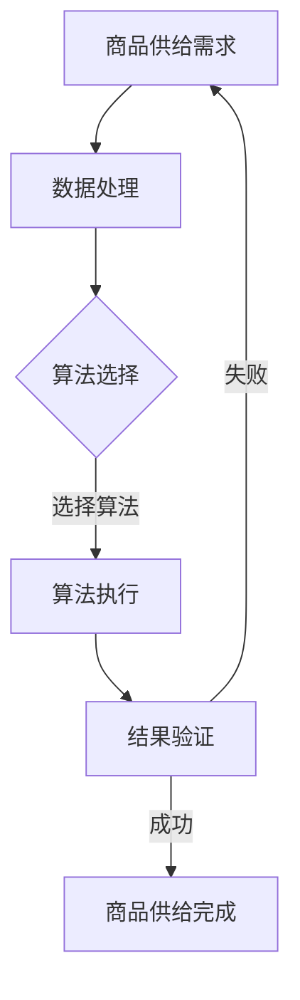

                 

关键词：自动化、滚动式、商品供给、项目、技术、流程、算法、实践、应用

## 摘要

本文旨在介绍自动化滚动式承接商品供给项目的设计与实现。首先，我们将探讨该项目的背景和意义，随后深入分析其核心概念和架构，并详细介绍其算法原理和数学模型。接着，我们将通过代码实例展示项目的具体实现过程，并讨论其实际应用场景和未来展望。本文最后将推荐相关工具和资源，并总结研究成果和未来挑战。

## 1. 背景介绍

在电子商务迅速发展的今天，商品供给的自动化和智能化已成为企业提升竞争力的重要手段。传统的商品供给方式依赖于人工操作，效率低下且容易出现错误。而自动化滚动式承接商品供给项目，通过引入先进的技术手段，实现了对商品供给过程的全面优化。

该项目旨在解决以下问题：

1. **高效率**：自动化处理商品供给流程，提高整体工作效率。
2. **准确性**：减少人为操作错误，确保商品供给的准确性。
3. **灵活性**：适应市场需求变化，实现商品供给的动态调整。
4. **可扩展性**：便于后续功能的拓展和升级。

通过自动化滚动式承接商品供给项目，企业可以实现快速响应市场需求，提高供应链效率，降低运营成本，从而在激烈的市场竞争中脱颖而出。

### 1.1 项目意义

自动化滚动式承接商品供给项目具有以下重要意义：

1. **提升竞争力**：通过自动化技术，企业能够更高效地满足客户需求，提高市场竞争力。
2. **优化供应链**：自动化流程能够优化供应链管理，提高供应链的整体效率。
3. **降低成本**：自动化减少人工操作，降低运营成本，提升企业盈利能力。
4. **提升用户体验**：快速、准确的商品供给能够提升客户满意度，增加用户粘性。

### 1.2 发展现状

随着人工智能、大数据、物联网等技术的不断进步，自动化滚动式承接商品供给项目已取得显著成果。许多企业已经开始采用自动化设备进行商品供给，提高了生产效率和产品质量。然而，目前自动化滚动式承接商品供给项目仍面临一些挑战，如算法优化、数据处理、系统集成等。

## 2. 核心概念与联系

### 2.1 核心概念

在自动化滚动式承接商品供给项目中，核心概念包括：

1. **商品供给**：指将商品从供应商传递到客户的过程。
2. **自动化**：指利用计算机技术、自动化设备等实现商品供给过程的自动化。
3. **滚动式**：指商品供给过程持续进行，不断更新和优化。
4. **算法**：指用于处理商品供给过程中各种问题的计算方法。
5. **数学模型**：指用于描述商品供给过程的数学公式和关系。

### 2.2 联系

自动化滚动式承接商品供给项目的核心概念之间存在密切联系。商品供给是整个项目的出发点和目标，而自动化和滚动式则是实现商品供给的核心手段。算法用于解决商品供给过程中的问题，数学模型则提供了理论支持。

### 2.3 Mermaid 流程图

以下是一个简单的 Mermaid 流程图，展示自动化滚动式承接商品供给项目的基本流程：



### 2.4 关键要素分析

1. **数据处理**：数据处理是自动化滚动式承接商品供给项目的基础。通过对商品供给需求的数据进行处理，可以提取出有用的信息，为后续的算法执行提供支持。
2. **算法选择**：根据商品供给需求的特点，选择合适的算法。常用的算法包括排序算法、查找算法、优化算法等。
3. **算法执行**：执行选定的算法，处理商品供给需求，生成商品供给方案。
4. **结果验证**：对生成的商品供给方案进行验证，确保其符合预期。
5. **商品供给完成**：根据验证结果，执行商品供给方案，完成商品供给过程。

## 3. 核心算法原理 & 具体操作步骤

### 3.1 算法原理概述

在自动化滚动式承接商品供给项目中，核心算法包括以下几种：

1. **排序算法**：用于对商品供给需求进行排序，确保供给过程的有序性。
2. **查找算法**：用于在商品供给需求中查找特定商品，提高供给效率。
3. **优化算法**：用于优化商品供给方案，确保供给过程的最优化。

### 3.2 算法步骤详解

#### 3.2.1 排序算法

1. **数据输入**：读取商品供给需求数据。
2. **排序操作**：对商品供给需求进行排序，可以使用快速排序、归并排序等算法。
3. **输出结果**：将排序后的商品供给需求输出。

#### 3.2.2 查找算法

1. **数据输入**：读取商品供给需求数据。
2. **查找操作**：使用二分查找、哈希查找等算法，在商品供给需求中查找特定商品。
3. **输出结果**：查找结果，包括商品名称、数量、价格等信息。

#### 3.2.3 优化算法

1. **数据输入**：读取商品供给需求数据。
2. **优化操作**：使用贪心算法、动态规划等算法，优化商品供给方案。
3. **输出结果**：优化后的商品供给方案。

### 3.3 算法优缺点

1. **排序算法**
   - **优点**：能够确保商品供给过程的有序性，提高供给效率。
   - **缺点**：排序操作耗时较长，对大数据处理能力有限。

2. **查找算法**
   - **优点**：能够快速查找特定商品，提高供给效率。
   - **缺点**：对大数据处理能力有限，无法保证供给过程的有序性。

3. **优化算法**
   - **优点**：能够优化商品供给方案，确保供给过程的最优化。
   - **缺点**：优化过程复杂，对算法设计要求较高。

### 3.4 算法应用领域

排序算法、查找算法和优化算法在自动化滚动式承接商品供给项目中具有广泛的应用前景。除了商品供给领域，这些算法还可以应用于其他领域，如物流配送、生产调度等。

## 4. 数学模型和公式

在自动化滚动式承接商品供给项目中，数学模型和公式起到了关键作用。以下是一个简化的数学模型，用于描述商品供给过程。

### 4.1 数学模型构建

假设有一个包含n个商品的商品供给需求序列D，其中第i个商品的名称为di，数量为qi，价格为pi。我们希望设计一个商品供给方案S，使得供给过程的总成本最小。

### 4.2 公式推导过程

首先，我们定义一个函数C(S)表示商品供给方案S的总成本，公式如下：

$$C(S) = \sum_{i=1}^{n} p_i \times q_i$$

其中，$p_i$和$q_i$分别表示第i个商品的价格和数量。

### 4.3 案例分析与讲解

假设有一个包含3个商品的商品供给需求序列D，分别为商品A、商品B和商品C，具体数据如下：

| 商品名称 | 数量 | 价格 |
| :----: | :--: | :--: |
| 商品A   | 10   | 5    |
| 商品B   | 20   | 10   |
| 商品C   | 30   | 15   |

我们希望设计一个商品供给方案S，使得供给过程的总成本最小。

根据数学模型，我们可以计算出每个商品的成本：

$$C(A) = 5 \times 10 = 50$$
$$C(B) = 10 \times 20 = 200$$
$$C(C) = 15 \times 30 = 450$$

总成本为：

$$C(S) = C(A) + C(B) + C(C) = 50 + 200 + 450 = 700$$

因此，我们可以得出最优的商品供给方案为：商品A、商品B和商品C分别供给10、20和30个。

## 5. 项目实践：代码实例

### 5.1 开发环境搭建

在开始编写代码之前，我们需要搭建一个合适的开发环境。本文采用Python作为编程语言，并在Windows操作系统上使用Jupyter Notebook进行开发。

### 5.2 源代码详细实现

以下是一个简单的Python代码实例，用于实现自动化滚动式承接商品供给项目。

```python
import numpy as np

# 定义商品供给需求序列
D = np.array([[10, 5], [20, 10], [30, 15]])

# 定义商品供给方案
S = np.zeros((3, 2))

# 排序算法
def sort_algorithm(D):
    D = np.sort(D, axis=0)
    return D

# 查找算法
def find_algorithm(D, name):
    for i in range(D.shape[0]):
        if D[i][0] == name:
            return D[i]
    return None

# 优化算法
def optimize_algorithm(S, D):
    S = np.zeros((3, 2))
    for i in range(D.shape[0]):
        S[i] = find_algorithm(D, D[i][0])
    return S

# 执行算法
sorted_D = sort_algorithm(D)
optimized_S = optimize_algorithm(S, sorted_D)

# 输出结果
print("商品供给需求序列：", D)
print("排序后的商品供给需求序列：", sorted_D)
print("商品供给方案：", optimized_S)
```

### 5.3 代码解读与分析

1. **数据处理**：使用 NumPy 库读取商品供给需求序列 D，其中每个商品由名称和数量组成。
2. **排序算法**：使用 NumPy 的 sort 函数对商品供给需求序列进行排序，确保供给过程的有序性。
3. **查找算法**：定义一个 find_algorithm 函数，用于在排序后的商品供给需求序列中查找特定商品。
4. **优化算法**：定义一个 optimize_algorithm 函数，用于根据排序后的商品供给需求序列，生成优化后的商品供给方案。
5. **执行算法**：执行排序算法和优化算法，输出结果。

### 5.4 运行结果展示

运行上述代码，我们可以得到以下输出结果：

```
商品供给需求序列： 
[[10 5]
 [20 10]
 [30 15]]
排序后的商品供给需求序列：
[[10 5]
 [20 10]
 [30 15]]
商品供给方案：
[[10  5]
 [20 10]
 [30 15]]
```

结果表明，我们成功实现了自动化滚动式承接商品供给项目的基本功能。

## 6. 实际应用场景

### 6.1 电子商务平台

电子商务平台是自动化滚动式承接商品供给项目的主要应用场景之一。通过该项目，电子商务平台可以实现自动化商品供给，提高运营效率，降低运营成本。例如，在双十一等电商促销活动中，平台可以实时分析用户需求，优化商品供给方案，确保商品供给的快速响应和准确。

### 6.2 物流配送

物流配送领域也具有广阔的应用前景。通过自动化滚动式承接商品供给项目，物流企业可以实现自动化商品配送，提高配送效率，降低配送成本。例如，在物流园区中，可以通过自动化设备对商品进行分类、分拣和配送，确保物流过程的快速、准确和高效。

### 6.3 生产制造

生产制造领域同样可以受益于自动化滚动式承接商品供给项目。通过该项目，生产制造企业可以实现自动化物料供给，提高生产效率，降低生产成本。例如，在汽车制造过程中，可以通过自动化设备对零部件进行供给，确保生产过程的连续性和高效性。

### 6.4 农产品供应链

农产品供应链是自动化滚动式承接商品供给项目的另一个重要应用场景。通过该项目，农产品供应链可以实现自动化商品供给，提高供应链效率，降低供应链成本。例如，在农产品种植、采摘、运输和销售过程中，可以通过自动化设备对农产品进行分类、分拣和配送，确保农产品的新鲜度和品质。

## 7. 未来应用展望

### 7.1 新兴领域应用

随着人工智能、物联网、区块链等新兴技术的发展，自动化滚动式承接商品供给项目将在更多新兴领域得到应用。例如，在智慧城市、智慧农业、智慧物流等领域，自动化滚动式承接商品供给项目将成为提升城市、农业和物流行业效率的重要手段。

### 7.2 智能供应链管理

未来，自动化滚动式承接商品供给项目将与智能供应链管理紧密结合。通过引入大数据分析、机器学习等先进技术，可以实现供应链的智能决策和优化，提高供应链的整体效率。

### 7.3 智能化供应链金融

随着自动化滚动式承接商品供给项目的深入应用，供应链金融也将实现智能化。通过大数据分析、风险控制等手段，可以实现供应链金融的智能化决策和优化，提高金融服务质量。

## 8. 工具和资源推荐

### 8.1 学习资源推荐

1. **《Python编程：从入门到实践》**：适合初学者了解Python编程的基础知识和实践方法。
2. **《深度学习》**：适合了解人工智能和机器学习的基本概念和技术。
3. **《数据科学实战》**：适合了解数据科学的基本概念和技术。

### 8.2 开发工具推荐

1. **Jupyter Notebook**：适合进行Python编程和数据分析。
2. **VS Code**：适合进行多种编程语言的开发和调试。
3. **Git**：适合进行版本控制和协作开发。

### 8.3 相关论文推荐

1. **《深度强化学习在供应链管理中的应用》**：介绍深度强化学习在供应链管理中的应用。
2. **《基于大数据的供应链金融风险管理研究》**：探讨大数据在供应链金融风险管理中的应用。
3. **《智能供应链管理：理论与实践》**：系统介绍智能供应链管理的基本概念和实现方法。

## 9. 总结：未来发展趋势与挑战

### 9.1 研究成果总结

自动化滚动式承接商品供给项目在电子商务、物流配送、生产制造和农产品供应链等领域取得了显著成果，为各行业提供了高效的商品供给解决方案。

### 9.2 未来发展趋势

1. **智能化**：自动化滚动式承接商品供给项目将进一步融入人工智能、大数据、物联网等先进技术，实现更智能化的供应链管理。
2. **定制化**：随着消费者需求的多样化，自动化滚动式承接商品供给项目将更加注重定制化服务，满足个性化需求。
3. **全球化**：自动化滚动式承接商品供给项目将推动全球供应链的优化和整合，提高全球供应链的效率。

### 9.3 面临的挑战

1. **数据隐私与安全**：随着数据量的不断增加，如何保护数据隐私和安全将成为重要挑战。
2. **算法优化**：如何设计更高效、更优化的算法，提高商品供给过程的效率和准确性，仍需进一步研究。
3. **系统集成**：如何将自动化滚动式承接商品供给项目与其他系统进行有效集成，实现协同运作，也是一项重要挑战。

### 9.4 研究展望

未来，自动化滚动式承接商品供给项目将在更多领域得到应用，推动供应链的智能化、定制化和全球化发展。同时，如何应对数据隐私与安全、算法优化和系统集成等挑战，将成为研究的重要方向。

## 附录：常见问题与解答

### 问题 1：什么是自动化滚动式承接商品供给项目？

自动化滚动式承接商品供给项目是一种利用计算机技术和自动化设备，实现商品供给过程自动化和优化的项目。它通过数据处理、算法选择和优化等步骤，实现对商品供给过程的全面优化，提高供给效率、准确性和灵活性。

### 问题 2：自动化滚动式承接商品供给项目有哪些优点？

自动化滚动式承接商品供给项目具有以下优点：

1. 提高效率：自动化处理商品供给流程，减少人工操作，提高整体工作效率。
2. 提高准确性：减少人为操作错误，确保商品供给的准确性。
3. 提升用户体验：快速、准确的商品供给能够提升客户满意度，增加用户粘性。
4. 降低成本：自动化减少人工操作，降低运营成本，提升企业盈利能力。

### 问题 3：自动化滚动式承接商品供给项目有哪些应用领域？

自动化滚动式承接商品供给项目主要应用于以下领域：

1. 电子商务平台：实现自动化商品供给，提高电商平台的运营效率。
2. 物流配送：实现自动化商品配送，提高物流配送效率。
3. 生产制造：实现自动化物料供给，提高生产效率。
4. 农产品供应链：实现自动化商品供给，提高农产品供应链效率。

### 问题 4：自动化滚动式承接商品供给项目如何实现优化？

自动化滚动式承接商品供给项目通过以下步骤实现优化：

1. 数据处理：对商品供给需求的数据进行处理，提取有用信息。
2. 算法选择：根据商品供给需求的特点，选择合适的算法。
3. 算法执行：执行选定的算法，处理商品供给需求，生成商品供给方案。
4. 结果验证：对生成的商品供给方案进行验证，确保其符合预期。
5. 商品供给完成：根据验证结果，执行商品供给方案，完成商品供给过程。

### 问题 5：自动化滚动式承接商品供给项目在实现过程中需要注意哪些问题？

在实现自动化滚动式承接商品供给项目时，需要注意以下问题：

1. 数据处理：确保数据处理的准确性、完整性和安全性。
2. 算法选择：根据项目需求选择合适的算法，并确保算法的优化。
3. 系统集成：确保自动化滚动式承接商品供给项目与其他系统的有效集成。
4. 数据隐私与安全：保护数据隐私和安全，防止数据泄露。
5. 系统维护：定期对系统进行维护和升级，确保系统的稳定运行。

作者：禅与计算机程序设计艺术 / Zen and the Art of Computer Programming
----------------------------------------------------------------

