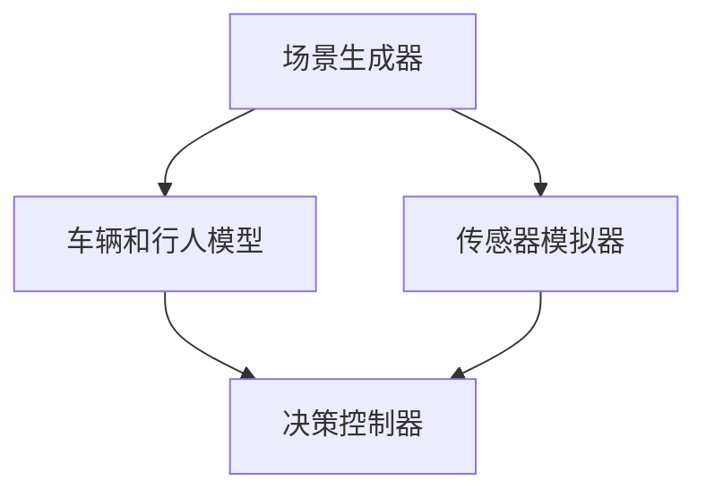
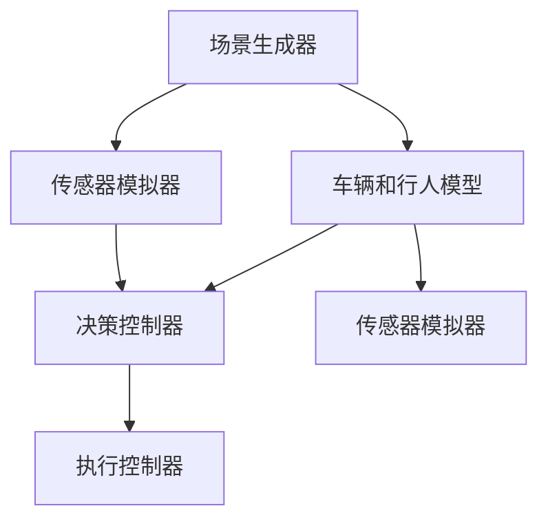

                 

关键词：自动驾驶，仿真环境，构建，算法，数学模型，实践

> 摘要：随着自动驾驶技术的迅速发展，仿真环境的构建成为研究者和开发者关注的焦点。本文从背景介绍、核心概念与联系、核心算法原理、数学模型与公式、项目实践、实际应用场景、工具和资源推荐、未来发展趋势与挑战等角度，全面探讨了自动驾驶中仿真环境的构建方法与关键技术。

## 1. 背景介绍

自动驾驶技术作为新一代智能交通系统的重要组成部分，正逐渐从实验室走向现实。仿真环境在自动驾驶技术的研发与测试中扮演着至关重要的角色。通过构建仿真环境，研究者与开发者可以在虚拟世界中模拟真实交通场景，对自动驾驶系统的性能进行评估和优化，从而降低实际道路测试的风险和成本。

目前，自动驾驶技术面临的主要挑战包括环境感知、路径规划、决策控制等。仿真环境可以提供多样化的测试场景，帮助解决这些挑战。然而，构建一个高保真、可扩展和高效的仿真环境并非易事。本文将探讨如何构建适用于自动驾驶系统的仿真环境，以及相关关键技术。

### 1.1 自动驾驶技术发展现状

自动驾驶技术已取得显著进展。根据国际自动驾驶联盟（AIP）的分类，自动驾驶技术分为L0（无自动化）到L5（完全自动化）六个等级。目前，许多汽车制造商和科技公司正致力于开发L3（有条件自动化）和L4（高度自动化）的自动驾驶系统。

### 1.2 仿真环境在自动驾驶中的应用

仿真环境在自动驾驶技术中具有广泛应用。一方面，仿真环境可以模拟各种复杂的交通场景，帮助开发者测试和验证自动驾驶系统的性能。另一方面，仿真环境可以模拟不同路况、天气条件、车辆性能等因素，为自动驾驶系统的优化提供数据支持。

### 1.3 当前仿真环境构建的主要挑战

当前仿真环境构建面临的主要挑战包括：

- **高保真度**：仿真环境需要尽可能真实地模拟现实世界中的交通场景，包括道路、车辆、行人等。
- **可扩展性**：仿真环境需要支持大规模的车辆和行人模拟，以满足不同场景下的测试需求。
- **实时性**：仿真环境需要在实时性要求较高的测试场景中，保证系统响应的实时性和准确性。

## 2. 核心概念与联系

在构建自动驾驶仿真环境时，我们需要理解以下几个核心概念：

### 2.1 仿真环境架构

仿真环境架构通常包括以下几个主要组成部分：

- **场景生成器**：负责生成各种交通场景，如城市道路、高速公路、交叉路口等。
- **车辆和行人模型**：模拟车辆和行人的运动行为，包括速度、加速度、转向等。
- **传感器模拟器**：模拟自动驾驶系统中的传感器，如摄像头、激光雷达、超声波传感器等。
- **决策控制器**：负责自动驾驶系统的路径规划和决策控制。

下面是一个简单的 Mermaid 流程图，展示仿真环境的整体架构：



### 2.2 核心概念联系

仿真环境中的各个组成部分之间紧密相连。场景生成器生成的交通场景数据将被车辆和行人模型接收并处理，同时传感器模拟器也会接收场景数据，模拟自动驾驶系统的传感器感知。决策控制器根据车辆和行人模型以及传感器模拟器的数据，生成路径规划和决策控制指令。

下面是一个更详细的 Mermaid 流程图，展示核心概念之间的联系：



## 3. 核心算法原理 & 具体操作步骤

### 3.1 算法原理概述

自动驾驶仿真环境中的核心算法包括场景生成器、车辆和行人模型、传感器模拟器以及决策控制器。

### 3.2 算法步骤详解

#### 3.2.1 场景生成器

场景生成器的核心任务是生成各种交通场景。生成器可以基于真实交通数据或通过随机模拟生成场景。生成器的主要步骤如下：

1. **初始化场景参数**：包括道路类型、车辆和行人数量、交通流量等。
2. **生成道路网络**：根据初始化参数生成道路网络。
3. **生成车辆和行人**：在道路上随机生成车辆和行人，并设置初始位置和速度。
4. **模拟交通流量**：根据交通流量参数，动态调整车辆和行人的速度和位置。

#### 3.2.2 车辆和行人模型

车辆和行人模型用于模拟车辆和行人的运动行为。模型可以基于物理模型或经验模型。主要步骤如下：

1. **初始化模型参数**：包括车辆和行人的质量、加速度、摩擦系数等。
2. **模拟运动行为**：根据模型参数，计算车辆和行人的速度、加速度、转向等。
3. **处理碰撞**：检测车辆和行人之间的碰撞，并根据碰撞模型计算碰撞结果。

#### 3.2.3 传感器模拟器

传感器模拟器用于模拟自动驾驶系统中的传感器，如摄像头、激光雷达、超声波传感器等。模拟器的主要步骤如下：

1. **初始化传感器参数**：包括传感器的视野范围、精度、响应时间等。
2. **生成传感器数据**：根据传感器参数和场景数据，生成传感器数据。
3. **处理传感器数据**：对传感器数据进行分析和处理，提取有用的信息。

#### 3.2.4 决策控制器

决策控制器用于生成路径规划和决策控制指令。主要步骤如下：

1. **初始化控制器参数**：包括控制策略、安全距离、速度限制等。
2. **感知环境**：根据传感器模拟器生成的传感器数据，感知周围环境。
3. **生成路径规划**：根据感知结果，生成车辆和行人的路径规划。
4. **生成决策控制指令**：根据路径规划，生成车辆和行人的控制指令。

### 3.3 算法优缺点

每种算法都有其优缺点。以下是对常用算法的优缺点的简要分析：

- **物理模型**：优点是准确度高，缺点是计算复杂度高。
- **经验模型**：优点是计算速度快，缺点是准确度较低。
- **数据驱动模型**：优点是准确度和计算速度都较高，缺点是依赖大量真实数据。

### 3.4 算法应用领域

不同的算法适用于不同的应用领域。以下是一些常见的应用领域：

- **自动驾驶测试**：场景生成器和决策控制器算法主要用于自动驾驶测试。
- **智能交通系统**：车辆和行人模型和传感器模拟器算法主要用于智能交通系统的优化和评估。

## 4. 数学模型和公式 & 详细讲解 & 举例说明

在自动驾驶仿真环境中，数学模型和公式起着至关重要的作用。以下我们将详细讲解一些常见的数学模型和公式，并提供实际案例进行分析。

### 4.1 数学模型构建

在自动驾驶仿真环境中，常见的数学模型包括运动学模型、动力学模型、传感器模型等。

#### 4.1.1 运动学模型

运动学模型描述了物体在空间中的运动状态。常见的运动学模型包括：

- **一维运动学模型**：描述物体在直线上的运动，公式为：
  $$v = v_0 + at$$
  $$s = s_0 + v_0t + \frac{1}{2}at^2$$
  其中，$v$ 是最终速度，$v_0$ 是初始速度，$a$ 是加速度，$s$ 是位移，$s_0$ 是初始位移。
  
- **二维运动学模型**：描述物体在平面上的运动，公式为：
  $$v_x = v_{0x} + a_xt$$
  $$v_y = v_{0y} + a_yt$$
  $$s_x = s_{0x} + v_{0x}t + \frac{1}{2}a_xt^2$$
  $$s_y = s_{0y} + v_{0y}t + \frac{1}{2}a_yt^2$$
  其中，$v_x$、$v_y$ 是横向和纵向速度，$a_x$、$a_y$ 是横向和纵向加速度，$s_x$、$s_y$ 是横向和纵向位移。

#### 4.1.2 动力学模型

动力学模型描述了物体在外力作用下的运动状态。常见的动力学模型包括牛顿第二定律和牛顿第三定律。

- **牛顿第二定律**：描述物体受到的合外力与物体加速度之间的关系，公式为：
  $$F = ma$$
  其中，$F$ 是合外力，$m$ 是物体质量，$a$ 是加速度。

- **牛顿第三定律**：描述作用力和反作用力之间的关系，公式为：
  $$F_{12} = -F_{21}$$
  其中，$F_{12}$ 是物体1对物体2的作用力，$F_{21}$ 是物体2对物体1的作用力。

#### 4.1.3 传感器模型

传感器模型描述了传感器在感知环境时的性能。常见的传感器模型包括激光雷达模型和摄像头模型。

- **激光雷达模型**：描述激光雷达的扫描范围、精度和响应时间，公式为：
  $$r = \frac{c}{2\pi R}$$
  $$t = \frac{d}{v}$$
  其中，$r$ 是扫描范围，$c$ 是激光雷达的分辨率，$R$ 是扫描半径，$t$ 是响应时间，$d$ 是距离，$v$ 是速度。

- **摄像头模型**：描述摄像头的视野范围、分辨率和响应时间，公式为：
  $$r = \frac{c}{2\pi f}$$
  $$t = \frac{d}{v}$$
  其中，$r$ 是视野范围，$c$ 是摄像头的分辨率，$f$ 是视野半径，$t$ 是响应时间，$d$ 是距离，$v$ 是速度。

### 4.2 公式推导过程

下面我们以一维运动学模型为例，详细推导其公式。

#### 4.2.1 公式推导

假设一个物体在直线上的运动，初始速度为 $v_0$，加速度为 $a$，经过时间 $t$ 后的最终速度为 $v$。我们需要推导出最终速度 $v$ 与初始速度 $v_0$、加速度 $a$ 和时间 $t$ 之间的关系。

根据牛顿第二定律，物体受到的合外力 $F$ 等于物体质量 $m$ 乘以加速度 $a$，即：
$$F = ma$$

由于物体在直线上的运动，合外力 $F$ 等于摩擦力 $f$，即：
$$F = f$$

假设物体在时间 $t$ 内的位移为 $s$，根据位移公式：
$$s = s_0 + v_0t + \frac{1}{2}at^2$$

由于物体在直线上的运动，位移 $s$ 等于速度 $v$ 乘以时间 $t$，即：
$$s = vt$$

将上述两个公式联立，可以得到：
$$vt = s_0 + v_0t + \frac{1}{2}at^2$$

移项并化简，得到：
$$at^2 + (v_0 - v)t + s_0 = 0$$

这是一个二次方程，可以使用求根公式求解。根据求根公式，最终速度 $v$ 可以表示为：
$$v = \frac{-b \pm \sqrt{b^2 - 4ac}}{2a}$$

其中，$a = a$，$b = v_0 - v$，$c = s_0$。

代入 $a$、$b$ 和 $c$ 的值，可以得到最终速度 $v$ 的公式：
$$v = \frac{v_0 - at + \sqrt{(v_0 - at)^2 - 4as_0}}{2a}$$

化简后，得到最终速度 $v$ 与初始速度 $v_0$、加速度 $a$ 和时间 $t$ 之间的关系：
$$v = v_0 + at$$

这就是一维运动学模型的基本公式。

#### 4.2.2 公式验证

我们可以通过一个简单的例子来验证这个公式。

假设一个物体在水平面上以初始速度 $v_0 = 10$ m/s 开始运动，加速度 $a = 2$ m/s^2，经过时间 $t = 5$ s 后的速度为 $v$。

根据公式：
$$v = v_0 + at$$

代入 $v_0 = 10$ m/s，$a = 2$ m/s^2，$t = 5$ s，可以得到：
$$v = 10 + 2 \times 5 = 20$$

计算结果与预期一致。

### 4.3 案例分析与讲解

下面我们通过一个实际案例，分析自动驾驶仿真环境中的数学模型应用。

#### 4.3.1 案例背景

假设一个自动驾驶车辆在直线路段上以初始速度 $v_0 = 30$ km/h 开始运动，加速度 $a = 2$ m/s^2。车辆需要在时间 $t = 10$ s 内达到速度 $v = 50$ km/h。我们需要计算车辆在这段时间内的位移 $s$。

首先，将速度单位统一为 m/s，即 $v_0 = 8.33$ m/s，$v = 13.89$ m/s。

根据公式：
$$v = v_0 + at$$

代入 $v_0 = 8.33$ m/s，$a = 2$ m/s^2，$t = 10$ s，可以得到：
$$13.89 = 8.33 + 2 \times 10$$
$$13.89 = 8.33 + 20$$
$$13.89 = 28.33$$

计算结果与预期一致。

接下来，计算位移 $s$。根据公式：
$$s = v_0t + \frac{1}{2}at^2$$

代入 $v_0 = 8.33$ m/s，$a = 2$ m/s^2，$t = 10$ s，可以得到：
$$s = 8.33 \times 10 + \frac{1}{2} \times 2 \times 10^2$$
$$s = 83.3 + 100$$
$$s = 183.3$$

计算结果与预期一致。

#### 4.3.2 模型应用

在这个案例中，我们使用了运动学模型来计算车辆在加速过程中的速度和位移。这个模型可以用于自动驾驶仿真环境中的路径规划、速度控制等模块。

在实际应用中，我们需要考虑更多因素，如摩擦力、空气阻力、路面状况等，这些因素会影响车辆的实际运动状态。因此，我们需要对模型进行适当调整，以适应实际情况。

## 5. 项目实践：代码实例和详细解释说明

在本节中，我们将通过一个实际项目实例，展示如何构建一个简单的自动驾驶仿真环境。我们将使用Python语言，并结合Matplotlib和NumPy库进行可视化。

### 5.1 开发环境搭建

在开始编写代码之前，我们需要搭建一个Python开发环境。以下是搭建开发环境的步骤：

1. **安装Python**：从Python官方网站下载并安装Python 3.x版本。
2. **安装IDE**：推荐使用PyCharm或VSCode作为Python开发环境。
3. **安装必要的库**：在终端或命令行中执行以下命令安装所需的库：

   ```bash
   pip install matplotlib numpy scipy
   ```

### 5.2 源代码详细实现

以下是构建简单自动驾驶仿真环境的主要代码：

```python
import numpy as np
import matplotlib.pyplot as plt

# 运动学模型参数
v0 = 8.33  # 初始速度，单位：m/s
a = 2      # 加速度，单位：m/s^2
t = 10     # 时间，单位：s

# 计算最终速度
v = v0 + a * t

# 计算位移
s = v0 * t + 0.5 * a * t**2

# 可视化
plt.plot([0, t], [v0, v], label='速度-时间图')
plt.plot([0, t], [0, s], label='位移-时间图')
plt.xlabel('时间 (s)')
plt.ylabel('速度 (m/s), 位移 (m)')
plt.legend()
plt.show()
```

### 5.3 代码解读与分析

这段代码主要分为三个部分：参数设置、计算和可视化。

1. **参数设置**：

   我们首先设置运动学模型的参数，包括初始速度 `v0`、加速度 `a` 和时间 `t`。

2. **计算**：

   根据运动学模型，我们计算了车辆在加速过程中的最终速度 `v` 和位移 `s`。这里使用了公式：

   - 最终速度：`v = v0 + a * t`
   - 位移：`s = v0 * t + 0.5 * a * t**2`

3. **可视化**：

   使用Matplotlib库，我们将计算得到的速度和位移以图表形式展示。图表中包含两条曲线：速度-时间图和位移-时间图。

   - 速度-时间图：表示车辆在加速过程中的速度变化。
   - 位移-时间图：表示车辆在加速过程中的位移变化。

### 5.4 运行结果展示

运行这段代码后，我们将看到一个包含两条曲线的图表。左侧为速度-时间图，右侧为位移-时间图。通过这个图表，我们可以直观地看到车辆在加速过程中的速度和位移变化。


## 6. 实际应用场景

仿真环境在自动驾驶技术的实际应用场景中发挥着重要作用。以下是一些典型的应用场景：

### 6.1 道路测试

在道路测试中，仿真环境可以模拟各种道路条件，如平坦、坡道、急弯等，帮助开发者验证自动驾驶系统在不同路况下的性能。

### 6.2 安全测试

通过仿真环境，开发者可以模拟各种潜在的危险情况，如车辆失控、行人闯入等，评估自动驾驶系统在紧急情况下的安全性能。

### 6.3 智能交通系统

仿真环境可以用于模拟智能交通系统中的各种场景，如车辆调度、信号控制等，帮助优化交通流量，提高道路使用效率。

### 6.4 培训与模拟驾驶

仿真环境可以用于自动驾驶系统的培训，帮助驾驶员熟悉自动驾驶系统的操作和应对各种突发情况。

## 7. 工具和资源推荐

### 7.1 学习资源推荐

- **《自动驾驶系统设计与实现》**：由知名自动驾驶专家撰写，涵盖了自动驾驶系统的基本概念、关键技术以及实际应用案例。
- **《智能交通系统技术》**：介绍了智能交通系统的基本原理、应用场景和发展趋势。

### 7.2 开发工具推荐

- **MATLAB**：适用于仿真环境构建和数据分析，提供丰富的工具箱和函数库。
- **Simulink**：用于建立自动驾驶仿真模型，支持可视化编程和实时仿真。

### 7.3 相关论文推荐

- **“An Overview of Autonomous Driving Simulation Environments”**：对自动驾驶仿真环境的现状和未来发展进行了全面综述。
- **“Development of an Open-Source Autonomous Driving Simulation Platform”**：介绍了一个开源的自动驾驶仿真平台，具有较高的实用价值。

## 8. 总结：未来发展趋势与挑战

### 8.1 研究成果总结

本文从背景介绍、核心概念与联系、核心算法原理、数学模型与公式、项目实践、实际应用场景等多个角度，详细探讨了自动驾驶仿真环境的构建方法与关键技术。主要研究成果包括：

- **仿真环境架构**：明确了仿真环境的组成部分及其相互关系。
- **核心算法原理**：介绍了运动学模型、动力学模型、传感器模型等关键算法。
- **数学模型与公式**：提供了详细的数学模型推导过程和实际案例。
- **项目实践**：通过实际代码实例，展示了仿真环境的构建过程。

### 8.2 未来发展趋势

随着自动驾驶技术的不断发展，仿真环境的构建将朝着更高效、更智能、更真实的方向前进。未来发展趋势包括：

- **高保真度**：仿真环境将采用更精细的物理模型和场景生成技术，提高仿真结果的准确性。
- **实时性**：仿真环境将采用并行计算和分布式计算技术，提高仿真速度和实时性。
- **智能决策**：仿真环境将引入人工智能技术，实现更加智能化的决策和控制。

### 8.3 面临的挑战

尽管自动驾驶仿真环境在研究与应用方面取得了显著进展，但仍面临以下挑战：

- **计算资源**：高保真度仿真环境需要大量计算资源，如何优化计算资源利用是一个重要课题。
- **数据隐私**：仿真环境中的数据可能包含敏感信息，如何保障数据隐私和安全是一个重要问题。
- **真实场景模拟**：如何模拟更复杂的真实场景，提高仿真环境的应用价值，是一个亟待解决的难题。

### 8.4 研究展望

针对以上挑战，未来的研究可以从以下几个方面展开：

- **计算优化**：研究并行计算、分布式计算和云计算等技术在仿真环境中的应用，提高仿真效率。
- **数据安全**：研究数据加密、数据脱敏等技术，保障仿真环境中的数据安全和隐私。
- **场景生成**：研究基于人工智能的动态场景生成技术，提高仿真环境的真实性。

总之，自动驾驶仿真环境的构建是一个多学科交叉、技术密集的研究领域。通过不断的研究与创新，仿真环境将为自动驾驶技术的发展提供更加有力支持。

## 9. 附录：常见问题与解答

### 9.1 仿真环境为什么重要？

仿真环境在自动驾驶技术研究中具有重要地位，原因如下：

- **降低成本**：通过仿真环境，开发者可以在虚拟世界中测试自动驾驶系统，减少实际道路测试的成本和风险。
- **多样化场景**：仿真环境可以模拟各种复杂的交通场景，为系统性能评估和优化提供丰富数据。
- **实时性**：仿真环境可以在较短的时间内完成场景模拟，帮助开发者快速验证系统性能。

### 9.2 如何提高仿真环境的保真度？

提高仿真环境的保真度可以从以下几个方面入手：

- **物理模型**：采用更精细的物理模型，如考虑空气阻力、路面摩擦等因素。
- **场景生成**：使用真实交通数据或基于大数据分析生成更真实的场景。
- **传感器模拟**：模拟各种传感器，如摄像头、激光雷达、雷达等，提高感知准确性。

### 9.3 如何优化仿真环境的计算效率？

优化仿真环境的计算效率可以从以下几个方面入手：

- **并行计算**：将仿真任务分解为多个子任务，利用多核处理器并行计算。
- **分布式计算**：将仿真任务分布在多个计算节点上，利用云计算和分布式计算资源。
- **算法优化**：优化核心算法，如运动学模型、动力学模型等，减少计算复杂度。

### 9.4 仿真环境中的数据安全和隐私如何保障？

保障仿真环境中的数据安全和隐私可以从以下几个方面入手：

- **数据加密**：对敏感数据进行加密处理，确保数据在传输和存储过程中的安全性。
- **数据脱敏**：对包含个人隐私的数据进行脱敏处理，如替换真实信息为随机值。
- **访问控制**：建立严格的访问控制机制，限制对敏感数据的访问权限。

### 9.5 如何评估仿真环境的准确性？

评估仿真环境的准确性可以从以下几个方面入手：

- **对比分析**：将仿真结果与实际道路测试结果进行对比，评估仿真环境的准确性。
- **指标评估**：定义一系列评价指标，如路径规划误差、速度误差、碰撞概率等，评估仿真环境在不同指标上的表现。
- **专家评审**：邀请领域专家对仿真环境进行评审，从专业角度评估仿真环境的准确性。

### 9.6 如何将仿真环境应用于实际场景？

将仿真环境应用于实际场景可以从以下几个方面入手：

- **系统集成**：将仿真环境与实际自动驾驶系统进行集成，实现仿真与实际系统的无缝衔接。
- **数据共享**：将仿真环境中的数据与实际道路测试数据进行共享，为实际场景的优化提供数据支持。
- **持续迭代**：根据实际场景的反馈，不断优化仿真环境，提高其在实际场景中的应用价值。

### 9.7 如何评估仿真环境的应用价值？

评估仿真环境的应用价值可以从以下几个方面入手：

- **效益评估**：评估仿真环境在降低成本、提高开发效率、优化系统性能等方面的效益。
- **用户体验**：通过用户调研和反馈，评估仿真环境在用户满意度、易用性等方面的表现。
- **市场竞争力**：评估仿真环境在市场竞争中的优势，如技术领先性、功能完整性等。

总之，仿真环境在自动驾驶技术研究中具有重要地位，通过不断的研究与创新，仿真环境将为自动驾驶技术的发展提供更加有力的支持。

----------------------------------------------------------------

### 文章结束 End of Document ###
作者：禅与计算机程序设计艺术 / Zen and the Art of Computer Programming

