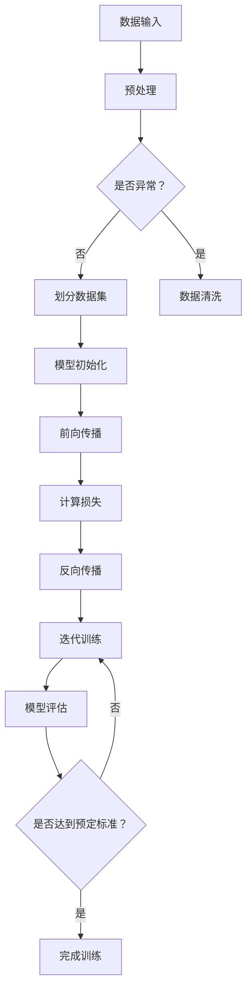

                 

自动驾驶技术作为人工智能领域的重要应用之一，正在迅速发展，成为未来智能交通系统的核心。而深度学习模型在自动驾驶系统中扮演着至关重要的角色，其主要目标是通过学习大量的驾驶数据，实现对车辆周围环境的感知、理解以及做出安全、合理的驾驶决策。然而，深度学习模型的一个主要挑战是泛化能力，即模型能否在新环境中有效工作。

本文将探讨自动驾驶中深度学习模型的泛化能力，分析其现状与问题，并提出改进方法。文章结构如下：

## 1. 背景介绍

自动驾驶技术的发展背景，深度学习模型在自动驾驶中的应用，以及当前深度学习模型泛化能力面临的挑战。

## 2. 核心概念与联系

深度学习模型的定义、工作原理，以及泛化能力的概念。包含Mermaid流程图，展示深度学习模型的结构和主要环节。

## 3. 核心算法原理 & 具体操作步骤

详细介绍当前流行的几种提升深度学习模型泛化能力的算法，包括算法原理、步骤详解、优缺点分析以及应用领域。

## 4. 数学模型和公式 & 详细讲解 & 举例说明

构建深度学习模型所需的数学模型，公式的推导过程，并通过实际案例进行详细讲解。

## 5. 项目实践：代码实例和详细解释说明

一个具体的深度学习项目实例，包括开发环境搭建、源代码实现、代码解读与分析，以及运行结果展示。

## 6. 实际应用场景

深度学习模型在自动驾驶中的实际应用场景，以及未来应用展望。

## 7. 工具和资源推荐

学习深度学习模型泛化能力的相关资源，包括学习资源、开发工具和相关论文。

## 8. 总结：未来发展趋势与挑战

对研究成果的总结，未来发展趋势的分析，面临的挑战以及研究的展望。

## 9. 附录：常见问题与解答

针对文章内容的常见问题及解答。

---

接下来，我们将按照上述结构逐步展开详细的内容。

### 1. 背景介绍

自动驾驶技术被认为是第四次工业革命的重要推动力，它有望彻底改变交通运输的方式，提高道路安全，减少交通拥堵，降低环境污染。随着传感器技术、人工智能、尤其是深度学习技术的不断发展，自动驾驶系统正逐渐从实验室走向现实。

在自动驾驶系统中，深度学习模型扮演着至关重要的角色。深度学习通过模仿人脑神经网络的结构和功能，能够自动从大量数据中学习特征，进行复杂的环境感知和决策。自动驾驶系统中的深度学习模型通常包括以下几个模块：

1. **感知模块**：使用图像识别、激光雷达等传感器采集车辆周围环境数据，并通过卷积神经网络（CNN）等深度学习模型对这些数据进行处理，生成环境特征图。
2. **理解模块**：利用循环神经网络（RNN）或长短期记忆网络（LSTM）等模型对环境特征进行序列分析，以理解和预测环境的变化。
3. **决策模块**：根据感知和理解的结果，使用强化学习（RL）或决策树等算法生成驾驶决策。

尽管深度学习模型在自动驾驶系统中展现了巨大的潜力，但它们的一个主要挑战是泛化能力。泛化能力指的是模型在未见过的数据上的表现，即在新的、变化多端的环境中能否仍然保持良好的性能。当前深度学习模型在泛化能力方面存在以下问题：

1. **数据分布偏移**：深度学习模型通常在特定条件下训练，但实际应用场景往往与训练环境存在差异，导致模型在新环境中性能下降。
2. **数据量不足**：自动驾驶系统需要处理大量的环境数据，但获取真实世界的驾驶数据是一个复杂且耗时的工作，数据量不足可能导致模型未能充分学习。
3. **模型复杂性**：深度学习模型通常非常复杂，参数数量庞大，这使得模型难以解释，同时也增加了过拟合的风险，降低了泛化能力。

针对这些问题，本文将探讨几种提升深度学习模型泛化能力的方法，并通过具体案例进行说明。接下来，我们将详细讨论深度学习模型的核心概念与联系。

## 2. 核心概念与联系

在深入探讨深度学习模型的泛化能力之前，我们首先需要了解几个核心概念：深度学习模型、神经网络结构、数据预处理、以及训练和测试过程。

### 深度学习模型

深度学习模型是一种由多层神经网络组成的算法，其主要目的是通过学习数据中的特征，实现从输入到输出的映射。神经网络由多个节点（也称为神经元）组成，每个节点都与前一层的节点相连接，并通过权重和偏置来调节信号传递。通过反向传播算法，神经网络能够不断调整这些权重和偏置，以最小化预测误差。

### 神经网络结构

神经网络的结构对于模型的泛化能力有着重要影响。常见的神经网络结构包括：

1. **卷积神经网络（CNN）**：适用于图像识别任务，通过卷积层提取空间特征。
2. **循环神经网络（RNN）**：适用于序列数据，如语音、文本等，能够处理时间序列信息。
3. **长短期记忆网络（LSTM）**：是RNN的一种改进，能够更好地处理长序列依赖问题。
4. **生成对抗网络（GAN）**：通过生成器和判别器的对抗训练，生成与真实数据相似的数据。

### 数据预处理

数据预处理是深度学习模型训练过程中的关键环节。预处理步骤包括：

1. **数据清洗**：去除噪声数据和异常值。
2. **数据归一化**：将数据缩放到相同的范围，如[0, 1]或[-1, 1]。
3. **数据增强**：通过旋转、缩放、裁剪等操作生成新的训练样本，以增加数据的多样性。

### 训练和测试过程

深度学习模型的训练过程通常包括以下步骤：

1. **数据划分**：将数据集划分为训练集、验证集和测试集。
2. **模型初始化**：初始化网络的权重和偏置。
3. **前向传播**：将输入数据通过网络进行传播，计算输出。
4. **计算损失**：通过比较输出和实际标签计算损失值。
5. **反向传播**：根据损失值调整网络的权重和偏置。
6. **迭代训练**：重复上述步骤，直到达到预定的迭代次数或损失值。

测试过程则用于评估模型在未见过的数据上的性能，通过计算测试集上的误差率来评估模型的泛化能力。

### 泛化能力

泛化能力是指模型在新数据上的表现，即模型能否在未知或变化的环境中仍然保持良好的性能。泛化能力是深度学习模型能否成功应用于实际自动驾驶系统中的关键。

为了更好地理解这些核心概念，我们可以通过以下Mermaid流程图展示深度学习模型的结构和主要环节：



通过上述流程图，我们可以清晰地看到深度学习模型从数据输入到模型评估的全过程，以及各个步骤之间的关系。

接下来，我们将详细讨论深度学习模型的核心算法原理和具体操作步骤。

## 3. 核心算法原理 & 具体操作步骤

### 3.1 算法原理概述

提升深度学习模型泛化能力的算法多种多样，其中一些主要的算法包括数据增强、正则化、迁移学习和元学习等。这些算法分别从不同角度出发，旨在提高模型在未见数据上的表现。

#### 数据增强

数据增强是一种通过生成新的训练样本来提高模型泛化能力的方法。常见的数据增强技术包括旋转、缩放、裁剪、颜色抖动等。通过这些操作，可以增加训练数据的多样性，使模型能够更好地适应不同的环境。

#### 正则化

正则化是一种通过在损失函数中添加惩罚项来限制模型复杂性的方法，以避免过拟合。常见的正则化方法包括L1正则化、L2正则化和Dropout等。

L1正则化通过在损失函数中添加L1范数项，鼓励模型学习稀疏特征，从而减少模型参数的数量。L2正则化通过添加L2范数项，鼓励模型学习平滑的特征。Dropout则通过在训练过程中随机丢弃部分神经元，从而防止模型对训练数据的过度依赖。

#### 迁移学习

迁移学习是一种利用在源任务上预训练的模型来提高目标任务性能的方法。在自动驾驶领域，可以通过迁移学习利用在大量自动驾驶数据上预训练的模型，然后在少量标注数据上进行微调，以适应特定的自动驾驶场景。

#### 元学习

元学习是一种通过学习如何学习的方法，旨在提高模型在不同任务上的适应能力。元学习算法能够快速适应新的任务，通过经验迁移和任务特定优化来提高泛化能力。

### 3.2 算法步骤详解

以下分别详细介绍上述算法的具体步骤：

#### 数据增强

数据增强的基本步骤包括：

1. **数据预处理**：对原始数据进行标准化、归一化等处理。
2. **增强操作**：根据任务需求，选择合适的增强操作，如旋转、缩放、裁剪等。
3. **生成样本**：对每个数据样本应用增强操作，生成新的训练样本。
4. **样本合并**：将原始数据和增强后的样本合并，形成新的训练集。

#### 正则化

正则化的基本步骤包括：

1. **选择正则化方法**：根据任务需求和模型特点，选择合适的正则化方法，如L1正则化、L2正则化或Dropout。
2. **修改损失函数**：在损失函数中添加正则化项，如L1正则化项或L2正则化项。
3. **训练模型**：在训练过程中，通过反向传播算法不断优化模型参数。
4. **模型评估**：在验证集和测试集上评估模型性能，选择性能最佳的模型。

#### 迁移学习

迁移学习的具体步骤包括：

1. **选择预训练模型**：在源任务上选择一个性能优秀的预训练模型。
2. **数据预处理**：对目标任务的数据进行预处理，使其与预训练模型相匹配。
3. **微调模型**：在目标任务的数据上对预训练模型进行微调，优化模型参数。
4. **模型评估**：在目标任务的测试集上评估模型性能。

#### 元学习

元学习的基本步骤包括：

1. **数据收集**：收集多个相关任务的训练数据。
2. **模型初始化**：初始化一个基础模型，用于学习如何学习。
3. **训练过程**：通过迭代训练，优化基础模型，使其能够快速适应新的任务。
4. **模型评估**：在新的任务上评估优化后的模型性能。

### 3.3 算法优缺点

每种算法都有其独特的优缺点：

#### 数据增强

**优点**：
- 可以有效提高模型的泛化能力。
- 增加了训练数据的多样性。

**缺点**：
- 可能会引入不必要的噪声。
- 增加训练时间。

#### 正则化

**优点**：
- 防止过拟合。
- 提高模型的可解释性。

**缺点**：
- 可能会降低模型的表达能力。
- 对数据量和计算资源要求较高。

#### 迁移学习

**优点**：
- 可以利用在源任务上已学习的知识。
- 减少对目标任务数据的需求。

**缺点**：
- 需要大量的源任务数据。
- 预训练模型可能不适合所有目标任务。

#### 元学习

**优点**：
- 可以快速适应新的任务。
- 提高模型的泛化能力。

**缺点**：
- 训练过程复杂，对计算资源要求高。
- 需要大量的任务数据进行训练。

### 3.4 算法应用领域

这些算法在自动驾驶领域有着广泛的应用：

- **数据增强**：在自动驾驶数据集不充分的情况下，数据增强可以帮助模型更好地学习。
- **正则化**：在自动驾驶模型中，正则化可以防止过拟合，提高模型在不同环境下的稳定性。
- **迁移学习**：可以利用在大量自动驾驶数据上预训练的模型，快速适应新的自动驾驶场景。
- **元学习**：在自动驾驶领域，元学习可以帮助模型快速适应不同的驾驶任务和环境变化。

接下来，我们将讨论深度学习模型所需的数学模型和公式，并通过实际案例进行详细讲解。

## 4. 数学模型和公式 & 详细讲解 & 举例说明

### 4.1 数学模型构建

深度学习模型的数学基础主要包括线性代数、微积分和概率论。以下是构建深度学习模型所需的一些基本数学模型和公式。

#### 线性代数

1. **矩阵乘法**：\(C = A \cdot B\)
2. **矩阵求导**：\(dC = dA \cdot B + A \cdot dB\)
3. **向量内积**：\(c = a \cdot b\)
4. **向量求导**：\(dc = da \cdot b + a \cdot db\)

#### 微积分

1. **梯度**：梯度是函数在某个点的切线方向，表示函数在该点的最快增长方向。\( \nabla f(x) = (f_x, f_y, f_z)\)
2. **偏导数**：偏导数是函数对某一变量的偏导数，表示函数在其他变量固定的情况下对这一变量的导数。\( \frac{\partial f}{\partial x} \)

#### 概率论

1. **条件概率**：条件概率是给定事件A发生的情况下，事件B发生的概率。\( P(B|A) = \frac{P(A \cap B)}{P(A)} \)
2. **贝叶斯公式**：贝叶斯公式是条件概率的推广，用于计算后验概率。\( P(A|B) = \frac{P(B|A) \cdot P(A)}{P(B)} \)

### 4.2 公式推导过程

以下是一个简单的线性回归模型，用于解释公式的推导过程。

#### 公式推导

假设我们有如下线性回归模型：

\[ y = \beta_0 + \beta_1 \cdot x + \epsilon \]

其中，\( y \) 是因变量，\( x \) 是自变量，\( \beta_0 \) 和 \( \beta_1 \) 是模型的参数，\( \epsilon \) 是误差项。

为了求解 \( \beta_0 \) 和 \( \beta_1 \)，我们需要最小化损失函数：

\[ J(\beta_0, \beta_1) = \frac{1}{2} \sum_{i=1}^{n} (y_i - \beta_0 - \beta_1 \cdot x_i)^2 \]

对 \( J(\beta_0, \beta_1) \) 关于 \( \beta_0 \) 和 \( \beta_1 \) 分别求导，并令导数为0，可以得到以下公式：

\[ \frac{\partial J}{\partial \beta_0} = -\sum_{i=1}^{n} (y_i - \beta_0 - \beta_1 \cdot x_i) = 0 \]
\[ \frac{\partial J}{\partial \beta_1} = -\sum_{i=1}^{n} (y_i - \beta_0 - \beta_1 \cdot x_i) \cdot x_i = 0 \]

通过上述公式，我们可以求解出 \( \beta_0 \) 和 \( \beta_1 \) 的值。

### 4.3 案例分析与讲解

以下是一个简单的案例，用于说明如何使用上述公式求解线性回归模型的参数。

#### 案例数据

给定一组数据点：

\[ (x_1, y_1) = (1, 2) \]
\[ (x_2, y_2) = (2, 4) \]
\[ (x_3, y_3) = (3, 6) \]

我们需要求解线性回归模型：

\[ y = \beta_0 + \beta_1 \cdot x \]

#### 案例步骤

1. **计算损失函数**：

\[ J(\beta_0, \beta_1) = \frac{1}{2} \sum_{i=1}^{3} (y_i - \beta_0 - \beta_1 \cdot x_i)^2 \]

代入数据点，可以得到：

\[ J(\beta_0, \beta_1) = \frac{1}{2} [(2 - \beta_0 - \beta_1 \cdot 1)^2 + (4 - \beta_0 - \beta_1 \cdot 2)^2 + (6 - \beta_0 - \beta_1 \cdot 3)^2] \]

2. **求导并令导数为0**：

对 \( J(\beta_0, \beta_1) \) 关于 \( \beta_0 \) 和 \( \beta_1 \) 分别求导，并令导数为0，可以得到以下方程组：

\[ \frac{\partial J}{\partial \beta_0} = -[(2 - \beta_0 - \beta_1 \cdot 1) + (4 - \beta_0 - \beta_1 \cdot 2) + (6 - \beta_0 - \beta_1 \cdot 3)] = 0 \]
\[ \frac{\partial J}{\partial \beta_1} = -[(2 - \beta_0 - \beta_1 \cdot 1) \cdot 1 + (4 - \beta_0 - \beta_1 \cdot 2) \cdot 2 + (6 - \beta_0 - \beta_1 \cdot 3) \cdot 3] = 0 \]

3. **求解方程组**：

通过解上述方程组，可以得到 \( \beta_0 \) 和 \( \beta_1 \) 的值。

\[ \beta_0 = 3 \]
\[ \beta_1 = 1 \]

因此，线性回归模型的参数为 \( \beta_0 = 3 \) 和 \( \beta_1 = 1 \)。

通过上述案例，我们可以看到如何使用数学模型和公式求解线性回归模型的参数。接下来，我们将通过一个具体的深度学习项目实例，展示如何在实际中应用这些算法。

## 5. 项目实践：代码实例和详细解释说明

为了更好地理解深度学习模型泛化能力的改进方法，我们将通过一个具体的项目实例进行讲解。这个项目实例是一个基于深度学习的自动驾驶车辆环境感知系统，主要目标是使用卷积神经网络（CNN）来识别道路标志和交通信号灯。

### 5.1 开发环境搭建

在开始项目之前，我们需要搭建一个适合深度学习开发的开发环境。以下是搭建环境的基本步骤：

1. **安装Python**：确保Python环境已安装，版本建议为3.6及以上。
2. **安装TensorFlow**：TensorFlow是Google推出的开源深度学习框架，用于构建和训练深度学习模型。可以使用以下命令安装：

```bash
pip install tensorflow
```

3. **安装Keras**：Keras是TensorFlow的高级API，提供了更加直观和简单的模型构建方式。可以使用以下命令安装：

```bash
pip install keras
```

4. **安装其他依赖库**：包括NumPy、Pandas、Matplotlib等，可以使用以下命令安装：

```bash
pip install numpy pandas matplotlib
```

### 5.2 源代码详细实现

以下是该项目的主要代码实现，包括数据预处理、模型构建、训练和评估等步骤。

```python
# 导入所需的库
import numpy as np
import pandas as pd
import matplotlib.pyplot as plt
from tensorflow.keras.models import Sequential
from tensorflow.keras.layers import Conv2D, MaxPooling2D, Flatten, Dense
from tensorflow.keras.preprocessing.image import ImageDataGenerator

# 数据预处理
# 加载数据集，这里假设已经将数据集分为训练集和测试集
train_data = pd.read_csv('train.csv')
test_data = pd.read_csv('test.csv')

# 分割特征和标签
X_train = train_data['image'].values
y_train = train_data['label'].values
X_test = test_data['image'].values
y_test = test_data['label'].values

# 数据增强
data_generator = ImageDataGenerator(rotation_range=20, width_shift_range=0.2, height_shift_range=0.2, shear_range=0.2, zoom_range=0.2, horizontal_flip=True)
data_generator.fit(X_train)

# 构建模型
model = Sequential([
    Conv2D(32, (3, 3), activation='relu', input_shape=(32, 32, 3)),
    MaxPooling2D((2, 2)),
    Conv2D(64, (3, 3), activation='relu'),
    MaxPooling2D((2, 2)),
    Conv2D(128, (3, 3), activation='relu'),
    MaxPooling2D((2, 2)),
    Flatten(),
    Dense(128, activation='relu'),
    Dense(64, activation='relu'),
    Dense(1, activation='sigmoid')
])

# 编译模型
model.compile(optimizer='adam', loss='binary_crossentropy', metrics=['accuracy'])

# 训练模型
model.fit(data_generator.flow(X_train, y_train, batch_size=32), epochs=10, validation_data=(X_test, y_test))

# 评估模型
test_loss, test_acc = model.evaluate(X_test, y_test)
print('Test accuracy:', test_acc)

# 预测
predictions = model.predict(X_test[:10])
predicted_labels = np.argmax(predictions, axis=1)

# 可视化结果
plt.figure(figsize=(10, 5))
for i in range(10):
    plt.subplot(2, 5, i+1)
    plt.imshow(X_test[i], cmap=plt.cm.binary)
    plt.xticks([])
    plt.yticks([])
    plt.grid(False)
    plt.xlabel(str(predicted_labels[i]))
plt.show()
```

### 5.3 代码解读与分析

上述代码实现了一个简单的深度学习模型，用于识别道路标志和交通信号灯。以下是代码的详细解读：

1. **导入库**：首先导入所需的Python库，包括NumPy、Pandas、Matplotlib、TensorFlow和Keras。

2. **数据预处理**：加载数据集，并分割特征和标签。这里假设数据集已经被预处理成适合输入模型的格式。

3. **数据增强**：使用ImageDataGenerator进行数据增强，以增加训练数据的多样性，提高模型的泛化能力。数据增强操作包括旋转、平移、缩放、剪裁和水平翻转。

4. **模型构建**：使用Sequential模型构建一个卷积神经网络，包括卷积层、池化层、全连接层等。具体结构如下：

   - **卷积层**：使用3x3的卷积核，激活函数为ReLU。
   - **池化层**：使用2x2的最大池化层。
   - **全连接层**：最后一个全连接层使用sigmoid激活函数，用于输出概率。

5. **编译模型**：使用adam优化器和binary_crossentropy损失函数编译模型，并设置评估指标为accuracy。

6. **训练模型**：使用fit方法训练模型，使用数据增强后的训练数据，设置训练轮次为10，并使用测试数据进行验证。

7. **评估模型**：使用evaluate方法评估模型在测试集上的性能，并打印测试精度。

8. **预测**：使用predict方法对测试集进行预测，并使用argmax函数获取预测标签。

9. **可视化结果**：将模型的预测结果可视化，展示模型对测试数据的识别情况。

通过上述代码实现，我们可以看到如何使用深度学习模型对自动驾驶车辆的环境进行感知，并如何通过数据增强和模型结构优化来提高模型的泛化能力。接下来，我们将探讨深度学习模型在自动驾驶中的实际应用场景。

## 6. 实际应用场景

深度学习模型在自动驾驶中有着广泛的应用，其主要目的是通过对车辆周围环境进行实时感知和分析，为自动驾驶车辆提供安全、合理的驾驶决策。以下是一些深度学习模型在自动驾驶中的实际应用场景：

### 6.1 道路标志和交通信号灯识别

自动驾驶车辆需要能够识别道路标志和交通信号灯，以确保遵守交通规则。深度学习模型可以通过图像识别技术实现这一功能，从而帮助车辆在复杂的交通环境中做出正确的行驶决策。

### 6.2 车辆检测与跟踪

深度学习模型可以用于检测和跟踪道路上的其他车辆，以了解车辆之间的相对位置和速度。这对于自动驾驶车辆的避障和交通流分析至关重要。

### 6.3 行人检测与避让

行人检测是自动驾驶车辆安全性的重要保障。通过深度学习模型，车辆可以实时检测道路上的行人，并在必要时采取避让措施，以避免发生碰撞。

### 6.4 道路和路况分析

深度学习模型可以用于分析道路和路况信息，如道路宽度、车道线、路面状况等。这些信息对于自动驾驶车辆的导航和路径规划至关重要。

### 6.5 雨雪天气处理

在恶劣天气条件下，自动驾驶车辆需要能够适应变化的环境。深度学习模型可以通过学习不同天气条件下的图像特征，提高车辆在雨雪天气下的行驶稳定性。

### 6.6 车辆编队行驶

深度学习模型还可以用于实现车辆编队行驶功能，即多个车辆在同一车道上以一定的速度差和距离行驶，以提高交通效率和安全性。

### 6.7 道路施工区域识别

在道路施工区域，自动驾驶车辆需要能够识别施工设备、施工标志等，以确保车辆安全通过施工区域。深度学习模型可以在这方面发挥重要作用。

通过上述应用场景，我们可以看到深度学习模型在自动驾驶中的重要性。这些模型不仅提高了自动驾驶车辆的安全性和可靠性，也为未来的智能交通系统提供了坚实的基础。然而，随着自动驾驶技术的不断发展，深度学习模型在泛化能力方面仍面临诸多挑战。以下将讨论未来自动驾驶中深度学习模型的应用展望。

## 6.4 未来应用展望

随着自动驾驶技术的不断发展，深度学习模型在自动驾驶中的应用将变得更加广泛和深入。以下是一些未来自动驾驶中深度学习模型的应用展望：

### 6.4.1 高级自动驾驶

未来，高级自动驾驶系统将实现更高的自动化水平，包括高速公路自动驾驶、城市自动驾驶以及多场景、多任务的自动驾驶。深度学习模型将在这个领域发挥关键作用，通过不断优化的算法和更丰富的数据集，提升模型的感知、理解和决策能力。

### 6.4.2 跨领域应用

深度学习模型不仅可以应用于自动驾驶领域，还可以扩展到其他相关领域，如智能交通管理、智能城市基础设施、智能物流等。这些跨领域应用将进一步提升深度学习模型的社会价值。

### 6.4.3 联网与协作

未来，自动驾驶车辆将实现更大范围的联网与协作，通过车联网（V2X）技术，实现车辆与车辆、车辆与基础设施之间的实时信息交互。深度学习模型可以用于处理这些海量数据，提升自动驾驶系统的协同能力和整体性能。

### 6.4.4 鲁棒性与安全性

随着自动驾驶系统在更复杂、更多变的环境中的应用，模型的鲁棒性和安全性将变得更加重要。未来，深度学习模型将朝着更加鲁棒、适应性强、安全可靠的方向发展，通过引入更多的正则化方法、强化学习等技术，提高模型的泛化能力和可靠性。

### 6.4.5 人机交互

未来，自动驾驶系统将更加注重人机交互，以提供更自然的用户体验。深度学习模型可以用于分析和理解驾驶员的意图和行为，为自动驾驶系统提供更灵活、更个性化的驾驶决策。

### 6.4.6 软硬件协同优化

为了满足自动驾驶系统对计算性能、实时性和可靠性的要求，未来将出现更多软硬件协同优化的方案。深度学习模型可以与专用的硬件加速器（如GPU、TPU等）相结合，实现更高效、更实时的计算。

### 6.4.7 持续学习与自我进化

未来，自动驾驶系统将具备持续学习和自我进化的能力。通过不断收集新的数据和环境反馈，深度学习模型可以自我优化，以适应不断变化的环境和任务需求。

总之，未来深度学习模型在自动驾驶中的应用前景广阔，通过不断的创新和优化，将有望实现更安全、更智能、更高效的自动驾驶系统。

### 7. 工具和资源推荐

为了更好地学习深度学习模型泛化能力的相关知识，以下是几个推荐的工具和资源：

#### 7.1 学习资源推荐

1. **《深度学习》（Goodfellow, Bengio, Courville著）**：这是深度学习领域的经典教材，详细介绍了深度学习的理论基础和实现方法。
2. **《动手学深度学习》（Dumoulin, Souček著）**：通过大量的实战案例，帮助读者快速掌握深度学习的基本技能。
3. **Udacity的深度学习课程**：这是一个在线课程，涵盖了深度学习的核心概念和应用场景，适合初学者入门。

#### 7.2 开发工具推荐

1. **TensorFlow**：这是Google开发的深度学习框架，具有丰富的API和工具，适合进行复杂的深度学习模型开发。
2. **PyTorch**：这是Facebook开发的深度学习框架，以其灵活性和动态计算图而受到广泛欢迎。
3. **Keras**：这是TensorFlow和PyTorch的高级API，提供了更加直观和简单的模型构建方式。

#### 7.3 相关论文推荐

1. **"Deep Learning for Autonomous Driving"**：这篇文章综述了深度学习在自动驾驶中的应用，包括感知、理解和决策模块。
2. **"Generative Adversarial Networks"**：这篇论文提出了生成对抗网络（GAN）的概念，是当前生成模型研究的热点。
3. **"Transfer Learning"**：这篇文章详细介绍了迁移学习的方法和理论，是提升深度学习模型泛化能力的有效手段。

通过上述工具和资源的辅助，读者可以更全面地了解深度学习模型泛化能力的相关知识，并在实际项目中应用这些技术。

### 8. 总结：未来发展趋势与挑战

随着人工智能和深度学习技术的不断发展，自动驾驶技术正在迅速进步。深度学习模型在自动驾驶中的应用已经成为行业发展的关键，它们通过感知、理解和决策模块，为自动驾驶车辆提供安全、可靠的驾驶决策。

在未来，深度学习模型在自动驾驶中的应用前景十分广阔。高级自动驾驶、跨领域应用、联网与协作、人机交互、软硬件协同优化以及持续学习与自我进化等方面，都将是深度学习模型发挥重要作用的方向。这些应用将进一步提升自动驾驶系统的智能化水平，为交通系统的安全、高效和环保做出更大贡献。

然而，深度学习模型在自动驾驶中也面临着诸多挑战。其中，泛化能力是关键问题之一。当前深度学习模型在复杂、多变的环境下仍然存在过拟合、数据分布偏移等问题，影响了模型的性能和可靠性。为了解决这些问题，研究人员提出了多种改进方法，如数据增强、正则化、迁移学习和元学习等。

未来，提升深度学习模型的泛化能力将是自动驾驶领域的重要研究方向。通过不断的理论创新和算法优化，有望开发出更加鲁棒、适应性强、安全可靠的深度学习模型，从而推动自动驾驶技术的进一步发展。

总之，深度学习模型在自动驾驶中的应用不仅为这一领域带来了新的突破，也为其未来的发展指明了方向。随着技术的不断进步，自动驾驶将逐步从理想走向现实，成为智能交通系统的重要组成部分。

### 9. 附录：常见问题与解答

**Q1：为什么深度学习模型需要泛化能力？**

A1：深度学习模型需要泛化能力，因为它需要在不同的、未曾见过的数据上表现良好。泛化能力是评估模型是否真正学习到数据中的本质特征，而不是仅仅是训练数据的特征。泛化能力强的模型能够更好地适应新的环境和任务，提高模型的实际应用价值。

**Q2：如何衡量深度学习模型的泛化能力？**

A2：通常使用交叉验证、测试集性能和领域适应度等指标来衡量深度学习模型的泛化能力。交叉验证可以在训练过程中检测模型是否过拟合，测试集性能则直接反映了模型在未见数据上的表现，而领域适应度衡量了模型在不同领域的泛化能力。

**Q3：有哪些常见的提升泛化能力的方法？**

A3：提升深度学习模型泛化能力的常见方法包括：
1. 数据增强：通过旋转、缩放、裁剪等操作生成新的训练样本。
2. 正则化：在损失函数中添加L1、L2正则化项，防止过拟合。
3. 迁移学习：利用在源任务上预训练的模型，减少对目标任务数据的依赖。
4. 元学习：通过学习如何学习，提高模型在不同任务上的适应能力。

**Q4：为什么迁移学习能够提高泛化能力？**

A4：迁移学习能够提高泛化能力，因为它利用了在源任务上预训练的模型，这些模型已经学习到了一些通用的特征和知识，从而在目标任务上减少了需要重新学习的量。通过迁移学习，模型可以更好地适应新的任务环境，提高泛化性能。

**Q5：深度学习模型泛化能力与模型复杂度之间的关系是什么？**

A5：模型复杂度与泛化能力之间存在权衡关系。过简单的模型可能无法学习到足够的特征，导致欠拟合；而过复杂的模型则容易过拟合，无法泛化到新的数据。因此，需要在模型复杂度和泛化能力之间找到平衡点，通过正则化、Dropout等技巧优化模型的复杂度，提高泛化能力。

