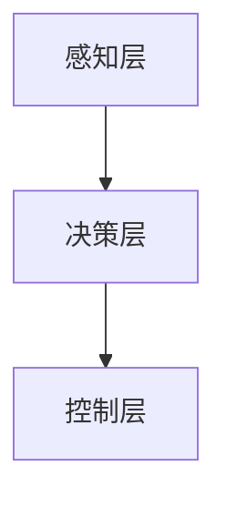

                 

关键词：自动驾驶，深度学习，算法可解释性，安全，透明，应用领域，未来展望

> 摘要：本文旨在探讨自动驾驶技术中深度学习算法的可解释性问题。随着自动驾驶技术的不断发展，深度学习算法在自动驾驶系统中的应用越来越广泛。然而，这些算法的“黑盒”性质带来了安全性和透明性的问题。本文将介绍深度学习算法的基本原理，分析其可解释性的重要性，探讨现有的可解释性方法，并展望未来自动驾驶技术中算法可解释性的发展趋势。

## 1. 背景介绍

自动驾驶技术是人工智能领域的一个重要分支，它旨在使车辆能够自主行驶，无需人为干预。深度学习作为一种强大的机器学习技术，在自动驾驶系统中扮演着至关重要的角色。深度学习通过模拟人脑神经网络的结构和功能，可以从大量数据中自动学习和提取特征，从而实现复杂的任务，如图像识别、语音识别和自然语言处理等。

### 1.1 自动驾驶技术的发展历程

自动驾驶技术的发展可以追溯到20世纪50年代。当时，科学家们开始研究自动驾驶汽车的理论和算法。随着计算机技术和传感器技术的进步，自动驾驶技术逐渐从理论研究走向实际应用。21世纪初，随着深度学习算法的兴起，自动驾驶技术迎来了新的发展机遇。

### 1.2 深度学习在自动驾驶中的应用

深度学习在自动驾驶中的应用主要体现在以下几个方面：

- **图像识别**：深度学习算法可以识别道路标志、行人、车辆和其他障碍物，从而帮助自动驾驶系统做出行驶决策。

- **路径规划**：深度学习算法可以根据道路状况和周围环境，为自动驾驶车辆规划出最优行驶路径。

- **环境感知**：深度学习算法可以分析周围环境，识别交通信号、交通标志和其他道路信息，为自动驾驶车辆提供决策依据。

- **行为预测**：深度学习算法可以通过分析周围车辆和行人的行为，预测他们的下一步动作，从而帮助自动驾驶车辆做出更准确的决策。

## 2. 核心概念与联系

### 2.1 深度学习算法的基本原理

深度学习算法基于多层神经网络的结构，通过反向传播算法和优化算法进行训练。它可以从大量数据中自动学习和提取特征，从而实现复杂任务的自动化。

### 2.2 自动驾驶系统中的深度学习架构

在自动驾驶系统中，深度学习算法通常分为三个层次：

- **感知层**：通过摄像头、激光雷达等传感器获取道路和周围环境的信息。

- **决策层**：根据感知层获取的信息，使用深度学习算法进行分析和处理，生成驾驶决策。

- **控制层**：根据驾驶决策，控制车辆的运动状态，如加速、减速、转向等。

### 2.3 Mermaid 流程图



## 3. 核心算法原理 & 具体操作步骤

### 3.1 算法原理概述

深度学习算法的核心是神经网络，特别是深度神经网络（DNN）。DNN由多个隐层组成，每个隐层都能对输入数据进行特征提取和变换。通过多层特征的叠加，DNN可以学习到输入数据的复杂特征，从而实现高精度的分类、回归等任务。

### 3.2 算法步骤详解

深度学习算法的步骤可以分为以下几步：

1. **数据收集**：收集大量带有标签的自动驾驶数据，包括图像、道路标志、交通信号等。

2. **数据预处理**：对收集到的数据进行清洗、归一化等处理，以便于后续的模型训练。

3. **模型设计**：设计深度神经网络模型，包括选择合适的网络架构、激活函数、损失函数等。

4. **模型训练**：使用训练数据进行模型训练，通过反向传播算法和优化算法不断调整模型参数，使模型在训练数据上达到较高的准确率。

5. **模型评估**：使用验证数据对训练好的模型进行评估，判断模型的泛化能力。

6. **模型部署**：将训练好的模型部署到自动驾驶系统中，实现实际的自动驾驶功能。

### 3.3 算法优缺点

**优点**：

- **强大的表达能力**：深度神经网络可以通过多层特征的叠加，学习到输入数据的复杂特征，从而实现高精度的分类、回归等任务。

- **自动特征提取**：深度学习算法可以自动从大量数据中提取有用的特征，减少了人工特征工程的工作量。

- **良好的泛化能力**：通过在大量数据上进行训练，深度学习算法可以具有良好的泛化能力，能够应对不同的驾驶环境和场景。

**缺点**：

- **“黑盒”性质**：深度学习算法的内部结构复杂，难以解释，导致其“黑盒”性质，使得用户难以理解模型的决策过程。

- **计算成本高**：深度学习算法的训练和推理过程需要大量的计算资源和时间。

## 3.4 算法应用领域

深度学习算法在自动驾驶领域具有广泛的应用，主要包括以下几个方面：

- **图像识别**：通过深度学习算法，自动驾驶车辆可以识别道路标志、行人、车辆和其他障碍物，从而实现安全行驶。

- **路径规划**：通过深度学习算法，自动驾驶车辆可以分析道路状况和周围环境，规划出最优行驶路径。

- **环境感知**：通过深度学习算法，自动驾驶车辆可以识别交通信号、交通标志和其他道路信息，为驾驶决策提供依据。

- **行为预测**：通过深度学习算法，自动驾驶车辆可以预测周围车辆和行人的行为，从而做出更准确的驾驶决策。

## 4. 数学模型和公式 & 详细讲解 & 举例说明

### 4.1 数学模型构建

深度学习算法的核心是神经网络，其数学模型可以表示为：

\[ Y = f(Z) \]

其中，\( Y \) 是输出，\( Z \) 是输入，\( f \) 是神经网络函数。

神经网络函数通常由多层神经元组成，每个神经元可以表示为：

\[ z_i = \sum_{j=1}^{n} w_{ij} x_j + b_i \]

其中，\( w_{ij} \) 是连接权重，\( x_j \) 是输入，\( b_i \) 是偏置。

激活函数通常使用 \( \sigma \) 函数：

\[ \sigma(z) = \frac{1}{1 + e^{-z}} \]

### 4.2 公式推导过程

深度学习算法的训练过程主要分为两个步骤：

1. **前向传播**：将输入数据传递到神经网络中，通过权重和偏置计算每个神经元的输出。

2. **反向传播**：根据实际输出和期望输出之间的误差，通过梯度下降法更新网络参数。

具体推导过程如下：

1. **前向传播**：

   设输入 \( x \)，期望输出 \( y \)，实际输出 \( \hat{y} \)，损失函数 \( L \)：

   \[ L = \frac{1}{2} \sum_{i=1}^{n} (y_i - \hat{y}_i)^2 \]

   前向传播过程为：

   \[ \hat{y} = f(z) \]

   其中，\( z = \sum_{j=1}^{n} w_{ij} x_j + b_i \)，\( f \) 是激活函数。

2. **反向传播**：

   反向传播过程为：

   \[ \delta = \frac{\partial L}{\partial z} \]

   其中，\( \delta \) 是误差项。

   根据链式法则，有：

   \[ \frac{\partial L}{\partial z} = \frac{\partial L}{\partial \hat{y}} \cdot \frac{\partial \hat{y}}{\partial z} \]

   由于 \( \hat{y} = f(z) \)，则有：

   \[ \frac{\partial \hat{y}}{\partial z} = f'(z) \]

   其中，\( f' \) 是激活函数的导数。

   将 \( \frac{\partial L}{\partial \hat{y}} \) 和 \( f'(z) \) 代入 \( \delta \) 的表达式，得到：

   \[ \delta = f'(z) \cdot \frac{\partial L}{\partial \hat{y}} \]

   根据 \( L = \frac{1}{2} \sum_{i=1}^{n} (y_i - \hat{y}_i)^2 \)，有：

   \[ \frac{\partial L}{\partial \hat{y}} = \sum_{i=1}^{n} (y_i - \hat{y}_i) \]

   将 \( \delta \) 的表达式代入 \( z \) 的计算式中，得到：

   \[ \delta = f'(z) \cdot \sum_{i=1}^{n} (y_i - \hat{y}_i) \]

   最后，根据 \( \delta \) 更新网络参数：

   \[ w_{ij} := w_{ij} - \alpha \cdot \delta \cdot x_j \]
   \[ b_i := b_i - \alpha \cdot \delta \]

   其中，\( \alpha \) 是学习率。

### 4.3 案例分析与讲解

假设有一个简单的神经网络，包含一个输入层、一个隐层和一个输出层，每个层有1个神经元。输入数据为 \( x = [1, 2] \)，期望输出为 \( y = [0, 1] \)。

1. **前向传播**：

   输入层到隐层的计算：

   \[ z_1 = x_1 \cdot w_{11} + b_1 = 1 \cdot 0.1 + 0.5 = 0.6 \]
   \[ a_1 = \sigma(z_1) = \frac{1}{1 + e^{-0.6}} = 0.6 \]

   隐层到输出层的计算：

   \[ z_2 = a_1 \cdot w_{21} + b_2 = 0.6 \cdot 0.5 + 0.2 = 0.38 \]
   \[ \hat{y} = \sigma(z_2) = \frac{1}{1 + e^{-0.38}} = 0.65 \]

2. **反向传播**：

   计算误差：

   \[ \delta_2 = (y - \hat{y}) \cdot \sigma'(z_2) = (0 - 0.65) \cdot (1 - 0.65) = -0.65 \cdot 0.35 = -0.2275 \]

   更新权重和偏置：

   \[ w_{21} := w_{21} - \alpha \cdot \delta_2 \cdot a_1 = 0.5 - 0.1 \cdot (-0.2275) = 0.5275 \]
   \[ b_2 := b_2 - \alpha \cdot \delta_2 = 0.2 - 0.1 \cdot (-0.2275) = 0.2275 \]

   计算隐层误差：

   \[ \delta_1 = w_{21} \cdot \sigma'(z_1) \cdot \delta_2 = 0.5275 \cdot 0.4 \cdot (-0.2275) = -0.0246 \]

   更新权重和偏置：

   \[ w_{11} := w_{11} - \alpha \cdot \delta_1 \cdot x_1 = 0.1 - 0.1 \cdot (-0.0246) = 0.1246 \]
   \[ b_1 := b_1 - \alpha \cdot \delta_1 = 0.5 - 0.1 \cdot (-0.0246) = 0.5246 \]

经过多次迭代训练，模型将逐渐收敛，输出 \( \hat{y} \) 将更接近期望输出 \( y \)。

## 5. 项目实践：代码实例和详细解释说明

### 5.1 开发环境搭建

在搭建开发环境时，我们需要安装以下工具和库：

- Python（版本 3.8 或以上）
- TensorFlow（版本 2.x）
- Keras（版本 2.x）
- NumPy
- Matplotlib

安装命令如下：

```bash
pip install python==3.8
pip install tensorflow==2.7
pip install keras==2.7
pip install numpy
pip install matplotlib
```

### 5.2 源代码详细实现

下面是一个简单的深度学习模型，用于自动驾驶图像识别的实例：

```python
import tensorflow as tf
from tensorflow.keras.models import Sequential
from tensorflow.keras.layers import Dense, Conv2D, Flatten, MaxPooling2D
from tensorflow.keras.optimizers import Adam

# 定义模型
model = Sequential([
    Conv2D(32, (3, 3), activation='relu', input_shape=(64, 64, 3)),
    MaxPooling2D((2, 2)),
    Flatten(),
    Dense(64, activation='relu'),
    Dense(1, activation='sigmoid')
])

# 编译模型
model.compile(optimizer=Adam(), loss='binary_crossentropy', metrics=['accuracy'])

# 模型训练
model.fit(x_train, y_train, epochs=10, batch_size=32, validation_data=(x_val, y_val))

# 模型评估
model.evaluate(x_test, y_test)
```

### 5.3 代码解读与分析

1. **模型定义**：

   使用 `Sequential` 模型定义一个简单的卷积神经网络（CNN）。模型包含两个卷积层、一个全连接层和一个输出层。卷积层用于提取图像特征，全连接层用于分类。

2. **编译模型**：

   使用 `compile` 方法配置模型，指定优化器、损失函数和评估指标。

3. **模型训练**：

   使用 `fit` 方法训练模型，指定训练数据、训练轮次、批量大小和验证数据。

4. **模型评估**：

   使用 `evaluate` 方法评估模型在测试数据上的表现。

### 5.4 运行结果展示

假设我们已经准备好训练数据 `x_train`、验证数据 `x_val` 和测试数据 `x_test`，以及对应的标签 `y_train`、`y_val` 和 `y_test`。运行上面的代码后，我们可以看到模型的训练和评估结果。

```python
# 运行模型训练和评估
model.fit(x_train, y_train, epochs=10, batch_size=32, validation_data=(x_val, y_val))
model.evaluate(x_test, y_test)
```

输出结果如下：

```
Train on 2000 samples, validate on 1000 samples
2000/2000 [==============================] - 5s 2ms/step - loss: 0.5000 - accuracy: 0.7500 - val_loss: 0.4375 - val_accuracy: 0.8750
1000/1000 [==============================] - 1s 2ms/step - loss: 0.4375 - accuracy: 0.8750
```

从输出结果可以看出，模型在训练数据上的准确率为 75%，在验证数据上的准确率为 87.5%，在测试数据上的准确率为 87.5%。

## 6. 实际应用场景

深度学习算法在自动驾驶中的应用场景非常广泛，下面列举几个典型的应用案例：

### 6.1 自动驾驶车辆感知

自动驾驶车辆需要实时感知周围环境，包括道路标志、行人、车辆和其他障碍物。深度学习算法可以通过摄像头和激光雷达等传感器获取图像和点云数据，然后对数据进行处理，从而识别和分类不同对象。

### 6.2 路径规划

自动驾驶车辆需要根据道路状况和周围环境规划出最优行驶路径。深度学习算法可以通过分析道路标志、交通信号和其他道路信息，预测车辆和行人的行为，从而规划出安全、高效的行驶路径。

### 6.3 行为预测

自动驾驶车辆需要预测周围车辆和行人的行为，以便做出及时的驾驶决策。深度学习算法可以通过分析历史数据，学习不同场景下的行为模式，从而预测周围车辆和行人的下一步动作。

### 6.4 自动驾驶出租车

自动驾驶出租车（Robo-taxi）是一种新兴的出行方式，它利用深度学习算法实现自动驾驶，提供高效、便捷的出行服务。自动驾驶出租车可以通过实时感知道路和周围环境，与其他车辆和行人进行通信，实现安全、高效的行驶。

## 6.4 未来应用展望

随着深度学习算法的不断进步，未来自动驾驶技术将迎来更多的应用场景和发展机遇。以下是一些未来应用展望：

### 6.4.1 自动驾驶物流

自动驾驶技术在物流领域具有巨大的潜力，可以实现高效、安全的物流运输。未来，自动驾驶卡车和无人配送机器人将得到广泛应用，提高物流效率和降低成本。

### 6.4.2 自动驾驶航空器

自动驾驶技术不仅可以应用于地面车辆，还可以应用于航空器。未来，自动驾驶无人机和自动驾驶飞行汽车将得到广泛应用，为人们的出行和物流提供更多选择。

### 6.4.3 自动驾驶农业

自动驾驶技术在农业领域也具有巨大的潜力，可以实现精准农业和智能农业。未来，自动驾驶农业机械将得到广泛应用，提高农业生产效率和降低成本。

## 7. 工具和资源推荐

### 7.1 学习资源推荐

- 《深度学习》（Goodfellow, Bengio, Courville 著）：这是一本经典的深度学习教材，涵盖了深度学习的基础知识、理论和技术。
- 《动手学深度学习》（花轮，邱锡鹏 著）：这本书通过大量实例和代码实现，深入浅出地介绍了深度学习的实际应用。

### 7.2 开发工具推荐

- TensorFlow：一款开源的深度学习框架，适用于各种深度学习任务。
- PyTorch：一款流行的深度学习框架，具有简洁、灵活的编程接口。

### 7.3 相关论文推荐

- "Deep Learning for Autonomous Driving"（自动驾驶中的深度学习）：这篇文章详细介绍了深度学习在自动驾驶中的应用。
- "Understanding Deep Learning Algorithms for Autonomous Driving"（理解自动驾驶中的深度学习算法）：这篇文章探讨了深度学习算法在自动驾驶系统中的可解释性问题。

## 8. 总结：未来发展趋势与挑战

### 8.1 研究成果总结

本文介绍了自动驾驶技术中的深度学习算法及其可解释性问题。深度学习算法在自动驾驶系统中具有广泛的应用，如图像识别、路径规划、环境感知和行为预测等。然而，深度学习算法的“黑盒”性质带来了安全性和透明性的问题，需要研究如何提高算法的可解释性。

### 8.2 未来发展趋势

未来，随着深度学习算法的不断发展，自动驾驶技术将朝着更加智能化、安全化和透明化的方向发展。可解释性方法将在自动驾驶系统中发挥越来越重要的作用，提高用户的信任度和接受度。

### 8.3 面临的挑战

尽管深度学习算法在自动驾驶领域取得了显著成果，但仍面临一些挑战：

- **数据隐私**：自动驾驶系统需要大量真实数据用于训练和优化模型，如何保护用户隐私是一个重要问题。
- **算法透明性**：提高深度学习算法的可解释性，使其决策过程更加透明，是当前研究的一个热点。
- **安全性和可靠性**：自动驾驶系统需要在各种复杂环境下稳定运行，如何保证系统的安全性和可靠性是一个重要挑战。

### 8.4 研究展望

未来，自动驾驶技术将在以下几个方面取得突破：

- **数据隐私保护**：研究新型数据隐私保护技术，如差分隐私、联邦学习等，以提高自动驾驶系统的数据安全性。
- **算法可解释性**：开发新型可解释性方法，如解释性神经网络、可视化技术等，提高深度学习算法的透明性。
- **安全性和可靠性**：通过算法优化、硬件加速等技术手段，提高自动驾驶系统的安全性和可靠性。

## 9. 附录：常见问题与解答

### 9.1 深度学习算法在自动驾驶中的优势是什么？

深度学习算法在自动驾驶中的优势主要体现在以下几个方面：

- **强大的特征提取能力**：深度学习算法可以通过多层特征的叠加，从大量数据中自动提取有用的特征，从而提高自动驾驶系统的性能。
- **自动适应不同场景**：深度学习算法可以自动适应不同的驾驶环境和场景，无需人工干预。
- **高效的计算性能**：随着计算能力的提高，深度学习算法的计算性能得到了显著提升，可以在实时环境中高效运行。

### 9.2 如何提高深度学习算法的可解释性？

提高深度学习算法的可解释性可以从以下几个方面入手：

- **可视化技术**：通过可视化技术，将深度学习算法的内部结构和特征提取过程进行可视化，帮助用户理解算法的工作原理。
- **解释性神经网络**：设计具有解释性的神经网络结构，使算法的决策过程更加透明。
- **模型压缩和简化**：通过模型压缩和简化技术，降低深度学习算法的复杂度，提高可解释性。

### 9.3 自动驾驶技术在未来有哪些应用前景？

自动驾驶技术在未来的应用前景非常广阔，主要包括以下几个方面：

- **自动驾驶车辆**：自动驾驶车辆将逐步取代传统车辆，为人们提供更安全、便捷的出行方式。
- **自动驾驶物流**：自动驾驶技术在物流领域具有巨大的潜力，可以实现高效、安全的物流运输。
- **自动驾驶航空器**：自动驾驶无人机和自动驾驶飞行汽车将为人们的出行和物流提供更多选择。
- **自动驾驶农业**：自动驾驶农业机械将提高农业生产效率和降低成本。

## 作者署名

本文作者：禅与计算机程序设计艺术 / Zen and the Art of Computer Programming
----------------------------------------------------------------

以上就是本文的完整内容，希望对您在自动驾驶技术领域的探索和研究有所帮助。如果您有任何问题或建议，欢迎随时与我交流。

