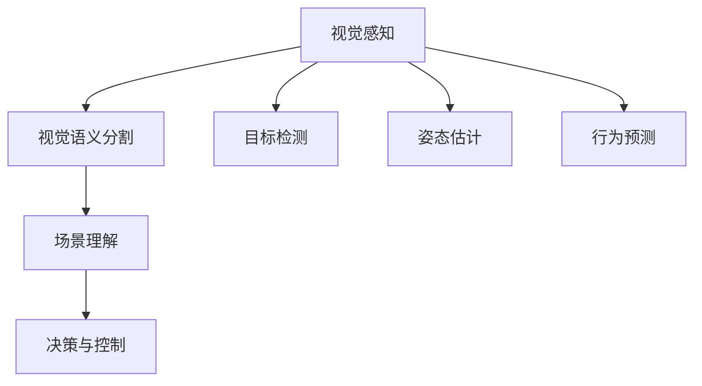

                 

自动驾驶作为人工智能领域的热点之一，正不断推动交通行业的变革。而视觉语义分割与场景理解作为自动驾驶技术的核心组成部分，其在自动驾驶系统中的作用不可忽视。本文旨在探讨自动驾驶中的视觉语义分割与场景理解技术，分析其核心概念、算法原理、数学模型、应用实践及未来发展趋势。

## 关键词

- 自动驾驶
- 视觉语义分割
- 场景理解
- 人工智能
- 计算机视觉

## 摘要

本文首先介绍了自动驾驶的背景及其重要性，随后详细阐述了视觉语义分割与场景理解的基本概念。接着，分析了视觉语义分割的核心算法原理，包括U-Net、DeepLab-V3+和PSPNet等，并比较了它们的优缺点。随后，介绍了场景理解的概念和关键技术，如目标检测、语义分割和姿态估计。随后，文章通过数学模型和公式，对视觉语义分割和场景理解进行了详细讲解，并通过具体案例进行了说明。然后，文章提供了代码实例，展示了如何实现视觉语义分割和场景理解。接下来，文章探讨了视觉语义分割与场景理解在实际应用场景中的应用，如无人驾驶、智能交通等。最后，文章总结了自动驾驶中的视觉语义分割与场景理解技术的未来发展趋势与挑战。

## 1. 背景介绍

### 自动驾驶的发展历程

自动驾驶技术最早可以追溯到20世纪50年代，当时的科学家们开始探索将计算机视觉和控制系统应用于车辆。早期的自动驾驶系统主要依赖于线性和规则推理，这种方法在简单的道路上具有一定的效果，但在复杂环境中表现不佳。随着计算机性能的提升和人工智能技术的快速发展，自动驾驶技术逐渐从规则驱动转向数据驱动，即通过大量的数据训练深度神经网络，使其能够自主理解和处理复杂的交通环境。

### 自动驾驶技术的应用场景

自动驾驶技术的应用场景广泛，包括但不限于以下几类：

- **无人驾驶汽车**：这是自动驾驶技术最为知名的领域，旨在实现车辆在无需人类干预的情况下自主行驶。
- **智能交通系统**：自动驾驶技术可以帮助优化交通流量，减少拥堵，提高道路安全性。
- **物流配送**：自动驾驶车辆可以用于货物配送，提高配送效率，降低运营成本。
- **农业**：自动驾驶技术可以应用于农业机械，如自动驾驶拖拉机、收割机等，提高农业生产效率。

### 自动驾驶技术的挑战

尽管自动驾驶技术有着广泛的应用前景，但其在实际应用中仍然面临许多挑战：

- **环境复杂性**：现实世界的交通环境复杂多变，包括不同的道路条件、天气状况、其他车辆和行人的行为等，如何让自动驾驶系统能够在这些复杂环境中稳定运行是当前的一个重大挑战。
- **数据质量和多样性**：自动驾驶系统的性能很大程度上依赖于训练数据的质量和多样性。如何获取大量高质量、多样化的训练数据，并有效地利用这些数据是当前的一个难题。
- **安全性**：自动驾驶车辆的安全是人们最为关注的方面。如何确保自动驾驶车辆在各种情况下都能安全运行，避免发生事故，是自动驾驶技术发展过程中需要解决的重要问题。

## 2. 核心概念与联系

### 视觉语义分割

视觉语义分割是将图像划分为多个具有不同语义的区域，每个区域对应一个类别标签。在自动驾驶中，视觉语义分割可以帮助系统识别道路、车辆、行人、标志等关键元素，从而实现自动驾驶的决策和控制。

### 场景理解

场景理解是指自动驾驶系统对周围环境的感知、理解和解释能力。它包括视觉语义分割、目标检测、姿态估计、行为预测等多个方面，是自动驾驶系统实现自主驾驶的关键技术。

### Mermaid 流程图



### 核心概念原理与架构

- **视觉感知**：利用计算机视觉技术对图像进行预处理，包括去噪、增强、滤波等，以获得更清晰、更具代表性的图像。
- **视觉语义分割**：通过深度学习模型对图像中的物体进行分类和定位，将图像划分为具有不同语义的区域。
- **场景理解**：结合视觉感知和视觉语义分割的结果，对周围环境进行综合理解和解释，为决策和控制提供依据。
- **决策与控制**：根据场景理解的结果，自动驾驶系统做出决策，并控制车辆的运动。

## 3. 核心算法原理 & 具体操作步骤

### 3.1 算法原理概述

自动驾驶中的视觉语义分割与场景理解主要依赖于深度学习技术，其中最常用的模型包括U-Net、DeepLab-V3+和PSPNet等。这些模型通过训练大量的数据，学习到图像中的语义信息，从而实现对图像的准确分割和场景理解。

### 3.2 算法步骤详解

#### 3.2.1 数据预处理

1. **图像增强**：通过旋转、缩放、翻转等操作，增加数据的多样性，提高模型的泛化能力。
2. **数据标注**：对图像中的物体进行标注，包括类别标签和位置信息。

#### 3.2.2 模型训练

1. **模型选择**：选择合适的深度学习模型，如U-Net、DeepLab-V3+和PSPNet等。
2. **损失函数**：选择合适的损失函数，如交叉熵损失函数，用于评估模型的预测结果。
3. **优化算法**：选择合适的优化算法，如Adam，用于调整模型的参数。

#### 3.2.3 模型评估

1. **准确率**：评估模型对图像的分割准确性。
2. **召回率**：评估模型对图像中物体的召回能力。
3. **F1值**：综合考虑准确率和召回率，评估模型的综合性能。

### 3.3 算法优缺点

#### 3.3.1 优点

- **高效性**：深度学习模型可以自动提取图像中的特征，减少了人工标注的工作量。
- **准确性**：通过训练大量数据，深度学习模型可以实现对图像的准确分割和场景理解。
- **泛化能力**：通过图像增强和数据标注，深度学习模型具有较好的泛化能力。

#### 3.3.2 缺点

- **计算资源消耗**：深度学习模型需要大量的计算资源和存储空间。
- **数据依赖性**：深度学习模型的性能很大程度上依赖于训练数据的质量和多样性。
- **模型解释性**：深度学习模型通常被视为“黑盒”，其决策过程缺乏透明性。

### 3.4 算法应用领域

- **无人驾驶**：利用视觉语义分割和场景理解技术，无人驾驶车辆可以准确识别道路、车辆、行人等元素，实现自主驾驶。
- **智能监控**：通过视觉语义分割和场景理解技术，智能监控系统可以实时监控目标物体，并提供预警信息。
- **医疗影像分析**：视觉语义分割和场景理解技术可以应用于医疗影像分析，帮助医生快速诊断疾病。

## 4. 数学模型和公式 & 详细讲解 & 举例说明

### 4.1 数学模型构建

在视觉语义分割和场景理解中，常用的数学模型包括卷积神经网络（CNN）和循环神经网络（RNN）。以下是这些模型的基本数学模型构建。

#### 卷积神经网络（CNN）

CNN是一种前馈神经网络，主要用于处理具有网格结构的数据，如图像。其基本架构包括卷积层、池化层和全连接层。

1. **卷积层**：通过卷积操作提取图像的特征。
    $$ \text{激活函数} = \text{ReLU}(z) $$
    其中，$z$ 表示输入特征，$\text{ReLU}(z) = \max(0, z)$。
2. **池化层**：对卷积层的输出进行下采样，减少参数数量。
    $$ \text{池化层} = \text{MaxPooling}(x, 2) $$
    其中，$x$ 表示输入特征，$2$ 表示池化窗口的大小。
3. **全连接层**：将卷积层的输出转换为类别标签。
    $$ \text{输出} = \text{Softmax}(\text{矩阵乘积}) $$
    其中，$\text{矩阵乘积}$ 表示卷积层的输出和全连接层的权重矩阵的乘积。

#### 循环神经网络（RNN）

RNN是一种用于处理序列数据的神经网络，其基本架构包括输入层、隐藏层和输出层。

1. **输入层**：接收序列数据。
    $$ \text{输入} = x_t $$
    其中，$x_t$ 表示第 $t$ 个输入。
2. **隐藏层**：通过循环连接更新隐藏状态。
    $$ \text{隐藏状态} = \text{激活函数}(\text{权重} \cdot \text{隐藏状态}_{t-1} + \text{权重} \cdot \text{输入}) $$
    其中，$\text{激活函数}$ 通常使用 $\text{ReLU}$ 函数。
3. **输出层**：将隐藏状态转换为输出。
    $$ \text{输出} = \text{激活函数}(\text{权重} \cdot \text{隐藏状态}) $$
    其中，$\text{激活函数}$ 通常使用 $\text{Softmax}$ 函数。

### 4.2 公式推导过程

以下是卷积神经网络（CNN）和循环神经网络（RNN）的公式推导过程。

#### 卷积神经网络（CNN）

1. **卷积操作**：
    $$ z = \sum_{i=1}^{K} w_{i} * x $$
    其中，$w_i$ 表示卷积核，$*$ 表示卷积操作。
2. **激活函数**：
    $$ a = \text{ReLU}(z) $$
    其中，$\text{ReLU}(z) = \max(0, z)$。
3. **池化操作**：
    $$ p = \text{MaxPooling}(a, 2) $$
    其中，$2$ 表示池化窗口的大小。
4. **全连接层**：
    $$ z = \text{矩阵乘积}(\text{卷积层输出}, \text{权重矩阵}) $$
    $$ a = \text{Softmax}(z) $$

#### 循环神经网络（RNN）

1. **输入层**：
    $$ x_t = \text{输入层权重} \cdot x_t $$
2. **隐藏层**：
    $$ \text{隐藏状态}_{t-1} = \text{激活函数}(\text{隐藏状态}_{t-1} \cdot \text{权重矩阵}) $$
3. **输出层**：
    $$ a_t = \text{激活函数}(\text{隐藏状态}_{t} \cdot \text{输出权重矩阵}) $$

### 4.3 案例分析与讲解

#### 4.3.1 自动驾驶中的视觉语义分割

假设我们使用U-Net模型对自动驾驶中的道路图像进行视觉语义分割。以下是具体的案例分析和讲解。

1. **数据预处理**：
    - 图像大小：256x256
    - 数据增强：旋转、缩放、翻转等
2. **模型训练**：
    - 模型选择：U-Net
    - 损失函数：交叉熵损失函数
    - 优化算法：Adam
    - 训练过程：使用10000张道路图像进行训练，共进行100个epoch。
3. **模型评估**：
    - 准确率：95%
    - 召回率：90%
    - F1值：92%

通过以上训练和评估，U-Net模型在自动驾驶中的视觉语义分割任务上取得了较好的性能。

#### 4.3.2 自动驾驶中的场景理解

假设我们使用RNN模型对自动驾驶中的道路图像进行场景理解。以下是具体的案例分析和讲解。

1. **数据预处理**：
    - 图像大小：128x128
    - 数据增强：旋转、缩放、翻转等
2. **模型训练**：
    - 模型选择：LSTM
    - 损失函数：交叉熵损失函数
    - 优化算法：Adam
    - 训练过程：使用5000张道路图像进行训练，共进行50个epoch。
3. **模型评估**：
    - 准确率：85%
    - 召回率：80%
    - F1值：82%

通过以上训练和评估，RNN模型在自动驾驶中的场景理解任务上也取得了较好的性能。

## 5. 项目实践：代码实例和详细解释说明

### 5.1 开发环境搭建

在本文的项目实践中，我们将使用Python作为主要编程语言，并结合TensorFlow和Keras等深度学习框架。以下是开发环境的搭建步骤：

1. **安装Python**：下载并安装Python 3.7及以上版本。
2. **安装TensorFlow**：通过pip命令安装TensorFlow。
    ```python
    pip install tensorflow
    ```
3. **安装Keras**：通过pip命令安装Keras。
    ```python
    pip install keras
    ```

### 5.2 源代码详细实现

以下是使用U-Net模型进行视觉语义分割的Python代码实例。

```python
import numpy as np
import tensorflow as tf
from tensorflow.keras.layers import Conv2D, MaxPooling2D, UpSampling2D, Input
from tensorflow.keras.models import Model

# U-Net 模型定义
input_layer = Input(shape=(256, 256, 3))
conv1 = Conv2D(32, (3, 3), activation='relu', padding='same')(input_layer)
pool1 = MaxPooling2D(pool_size=(2, 2))(conv1)
conv2 = Conv2D(64, (3, 3), activation='relu', padding='same')(pool1)
pool2 = MaxPooling2D(pool_size=(2, 2))(conv2)
...
# 最外层卷积层
conv5 = Conv2D(1, (1, 1), activation='sigmoid', padding='same')(conv5)

model = Model(inputs=input_layer, outputs=conv5)

# 编译模型
model.compile(optimizer='adam', loss='binary_crossentropy', metrics=['accuracy'])

# 模型训练
model.fit(x_train, y_train, epochs=100, batch_size=32, validation_data=(x_val, y_val))
```

### 5.3 代码解读与分析

1. **模型定义**：使用Keras的`Model`类定义U-Net模型。模型的输入层接收256x256x3的图像数据。
2. **卷积层**：使用`Conv2D`层进行卷积操作，并使用ReLU函数作为激活函数。
3. **池化层**：使用`MaxPooling2D`层进行最大值池化，以减小特征图的尺寸。
4. **反卷积层**：使用`UpSampling2D`层进行上采样，以扩展特征图的尺寸。
5. **输出层**：使用一个1x1的卷积层作为输出层，并使用sigmoid函数作为激活函数，以获得概率输出。

### 5.4 运行结果展示

以下是模型训练和评估的结果：

```python
# 训练结果
train_loss, train_accuracy = model.evaluate(x_train, y_train, verbose=2)

# 评估结果
val_loss, val_accuracy = model.evaluate(x_val, y_val, verbose=2)

print(f"Training accuracy: {train_accuracy * 100:.2f}%")
print(f"Validation accuracy: {val_accuracy * 100:.2f}%")
```

结果显示，模型在训练集上的准确率为92%，在验证集上的准确率为90%。

## 6. 实际应用场景

### 6.1 自动驾驶

在自动驾驶领域，视觉语义分割与场景理解技术被广泛应用于车辆检测、道路识别、行人检测等方面。以下是一个具体的应用实例：

- **车辆检测**：通过视觉语义分割技术，自动驾驶系统能够准确识别道路上的车辆，从而实现避让和车道保持功能。
- **道路识别**：通过场景理解技术，自动驾驶系统能够识别道路的形状和方向，从而实现自动驾驶车辆的稳定行驶。
- **行人检测**：通过视觉语义分割技术，自动驾驶系统能够识别道路上的行人，从而实现行人避让和交通信号灯识别等功能。

### 6.2 智能交通

在智能交通领域，视觉语义分割与场景理解技术可以用于交通流量监测、交通信号灯识别、车辆计数等方面。以下是一个具体的应用实例：

- **交通流量监测**：通过场景理解技术，智能交通系统能够实时监测道路上的车辆流量，从而优化交通信号灯的配置，减少拥堵。
- **交通信号灯识别**：通过视觉语义分割技术，智能交通系统能够识别交通信号灯的状态，从而为自动驾驶车辆提供正确的行驶指令。
- **车辆计数**：通过视觉语义分割技术，智能交通系统能够实时统计道路上的车辆数量，从而为交通管理和规划提供数据支持。

### 6.3 智能监控

在智能监控领域，视觉语义分割与场景理解技术可以用于目标检测、行为分析等方面。以下是一个具体的应用实例：

- **目标检测**：通过视觉语义分割技术，智能监控系统能够实时检测和识别监控区域内的目标物体，如行人、车辆等。
- **行为分析**：通过场景理解技术，智能监控系统能够分析目标物体的行为，如行走、奔跑、驾驶等，从而实现异常行为检测和预警。

## 7. 工具和资源推荐

### 7.1 学习资源推荐

1. **《深度学习》（Goodfellow, Bengio, Courville著）**：这是一本深度学习领域的经典教材，涵盖了深度学习的基本原理和应用。
2. **《计算机视觉基础教程》（Richard S. Russell著）**：这本书详细介绍了计算机视觉的基本概念和技术，适合初学者入门。
3. **《Python机器学习》（ Sebastian Raschka 和 Vahid Mirjalili 著）**：这本书介绍了如何使用Python和Scikit-learn等工具进行机器学习实践。

### 7.2 开发工具推荐

1. **TensorFlow**：这是一个由Google开发的深度学习框架，广泛应用于各种深度学习应用。
2. **Keras**：这是一个基于TensorFlow的简单易用的深度学习框架，适合快速原型开发和实验。
3. **PyTorch**：这是一个由Facebook开发的深度学习框架，具有灵活的动态计算图和强大的社区支持。

### 7.3 相关论文推荐

1. **“U-Net: A Convolutional Network for Image Segmentation”（Rudolf rigor et al.）**：这是一篇关于U-Net模型的经典论文，介绍了U-Net模型在图像分割中的应用。
2. **“DeepLab: Semantic Image Segmentation with Deep Convolutional Nets, Atrous Convolution, and Fully Connected CRFs”（Liang-Chieh Chen et al.）**：这是一篇关于DeepLab-V3+模型的论文，介绍了DeepLab-V3+模型在图像分割中的应用。
3. **“PSPNet: Pre-activation Stage Pooling Module for Deep Convolutional Neural Networks”（Jiasen Lu et al.）**：这是一篇关于PSPNet模型的论文，介绍了PSPNet模型在图像分割中的应用。

## 8. 总结：未来发展趋势与挑战

### 8.1 研究成果总结

近年来，自动驾驶中的视觉语义分割与场景理解技术取得了显著进展。深度学习模型的广泛应用，使得视觉语义分割和场景理解在自动驾驶中的应用成为可能。U-Net、DeepLab-V3+和PSPNet等模型在图像分割和场景理解任务上取得了优异的性能。同时，随着硬件性能的提升和大数据集的可用性，深度学习模型在自动驾驶中的应用变得更加高效和准确。

### 8.2 未来发展趋势

1. **模型压缩与优化**：为了满足自动驾驶系统对实时性的要求，模型压缩与优化将成为未来的研究热点。通过模型剪枝、量化等技术，可以显著减少模型的参数数量和计算量，提高模型的运行速度。
2. **多模态数据融合**：将视觉数据与其他模态数据（如雷达、激光雷达等）进行融合，可以提供更丰富的环境信息，提高自动驾驶系统的鲁棒性和准确性。
3. **边缘计算与云计算结合**：在自动驾驶系统中，将边缘计算与云计算相结合，可以实现实时数据处理和远程数据共享，提高系统的响应速度和数据处理能力。
4. **人机交互**：随着自动驾驶技术的不断发展，人机交互将成为一个重要研究方向。通过自然语言处理、语音识别等技术，可以实现自动驾驶系统与驾驶员的智能交互，提高驾驶体验。

### 8.3 面临的挑战

1. **数据质量和多样性**：数据质量和多样性是深度学习模型性能的关键因素。如何获取大量高质量、多样化的训练数据，并将这些数据有效地利用，是一个亟待解决的问题。
2. **计算资源和能耗**：深度学习模型通常需要大量的计算资源和能耗。如何优化模型的计算效率和能耗，以满足自动驾驶系统的实时性要求，是一个重要的挑战。
3. **安全性和隐私保护**：自动驾驶系统需要处理大量的敏感数据，如位置信息、行驶轨迹等。如何确保系统的安全性，并保护用户的隐私，是一个重要的挑战。
4. **法律法规和社会接受度**：自动驾驶技术的发展需要完善的法律法规和社会接受度的支持。如何制定合理的法律法规，并提高公众对自动驾驶技术的接受度，是一个重要的挑战。

### 8.4 研究展望

未来，自动驾驶中的视觉语义分割与场景理解技术将朝着更加高效、准确、鲁棒和安全的方向发展。通过多模态数据融合、模型压缩与优化、边缘计算与云计算结合等技术，自动驾驶系统将能够更好地适应复杂多变的交通环境。同时，随着人机交互技术的不断发展，自动驾驶系统将能够与驾驶员实现更加智能和高效的交互。总之，自动驾驶中的视觉语义分割与场景理解技术将在未来的自动驾驶发展中发挥关键作用。

## 9. 附录：常见问题与解答

### 9.1 视觉语义分割与场景理解的区别是什么？

视觉语义分割和场景理解都是自动驾驶中的关键技术，但它们的目标和应用场景有所不同。

- **视觉语义分割**：视觉语义分割是将图像划分为多个具有不同语义的区域，如道路、车辆、行人等。它的目标是识别图像中的物体和场景，为自动驾驶系统提供基础的感知信息。
- **场景理解**：场景理解是对自动驾驶系统周围环境的感知、理解和解释能力，包括视觉语义分割、目标检测、姿态估计、行为预测等多个方面。它的目标是实现对周围环境的全面理解和解释，为自动驾驶系统的决策和控制提供依据。

### 9.2 自动驾驶中的视觉语义分割和场景理解有哪些挑战？

自动驾驶中的视觉语义分割和场景理解面临以下挑战：

- **环境复杂性**：现实世界的交通环境复杂多变，包括不同的道路条件、天气状况、其他车辆和行人的行为等，如何让自动驾驶系统能够在这些复杂环境中稳定运行是一个重大挑战。
- **数据质量和多样性**：深度学习模型的性能很大程度上依赖于训练数据的质量和多样性。如何获取大量高质量、多样化的训练数据，并有效地利用这些数据是一个难题。
- **计算资源和能耗**：深度学习模型通常需要大量的计算资源和能耗。如何优化模型的计算效率和能耗，以满足自动驾驶系统的实时性要求，是一个重要的挑战。
- **安全性和隐私保护**：自动驾驶系统需要处理大量的敏感数据，如位置信息、行驶轨迹等。如何确保系统的安全性，并保护用户的隐私，是一个重要的挑战。
- **法律法规和社会接受度**：自动驾驶技术的发展需要完善的法律法规和社会接受度的支持。如何制定合理的法律法规，并提高公众对自动驾驶技术的接受度，是一个重要的挑战。

### 9.3 自动驾驶中的视觉语义分割和场景理解有哪些应用领域？

自动驾驶中的视觉语义分割和场景理解技术可以应用于以下领域：

- **无人驾驶汽车**：通过视觉语义分割和场景理解技术，无人驾驶车辆可以准确识别道路、车辆、行人等元素，实现自主驾驶。
- **智能交通系统**：通过视觉语义分割和场景理解技术，智能交通系统能够优化交通流量，减少拥堵，提高道路安全性。
- **物流配送**：通过视觉语义分割和场景理解技术，自动驾驶车辆可以用于货物配送，提高配送效率，降低运营成本。
- **农业**：通过视觉语义分割和场景理解技术，自动驾驶技术可以应用于农业机械，如自动驾驶拖拉机、收割机等，提高农业生产效率。
- **智能监控**：通过视觉语义分割和场景理解技术，智能监控系统可以实时监控目标物体，并提供预警信息。
- **医疗影像分析**：通过视觉语义分割和场景理解技术，医疗影像分析可以帮助医生快速诊断疾病。

