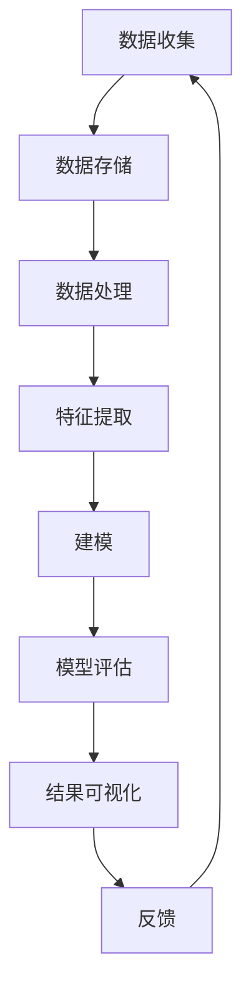

                 

自动驾驶技术的发展离不开高效的数据挖掘与分析平台，这些平台不仅能处理海量的数据，还能从中提取出有价值的信息，辅助自动驾驶系统的优化与决策。本文将详细介绍自动驾驶公司的数据挖掘与分析平台的构建、核心算法原理、数学模型、项目实践及未来展望。

## 关键词

- 自动驾驶
- 数据挖掘
- 数据分析
- 数据挖掘与分析平台
- 机器学习
- 深度学习
- 数据处理
- 数据可视化

## 摘要

本文将探讨自动驾驶公司构建数据挖掘与分析平台的重要性，详细介绍平台的核心概念、算法原理、数学模型以及项目实践。我们将分析如何通过有效的数据挖掘与分析，提高自动驾驶系统的安全性和可靠性，并对未来发展趋势与挑战进行展望。

## 1. 背景介绍

### 自动驾驶的发展现状

自动驾驶技术是人工智能领域的热门话题，它正迅速从理论研究走向实际应用。根据市场研究机构的报告，全球自动驾驶市场规模预计将在未来几年内实现爆发式增长。自动驾驶技术的核心在于实时感知环境、做出决策并控制车辆，这一过程依赖于大量高质量的数据。

### 数据挖掘与分析的重要性

数据挖掘与分析是自动驾驶技术的重要组成部分。通过数据挖掘，自动驾驶系统能够从大量的传感器数据中提取出有价值的信息，如道路状况、交通流量、车辆行为等。数据分析则能够帮助优化自动驾驶算法，提高系统的决策准确性和响应速度。

### 当前数据挖掘与分析平台的挑战

尽管数据挖掘与分析技术在自动驾驶领域取得了显著进展，但仍然面临诸多挑战。首先，自动驾驶系统需要处理的数据量庞大，如何高效地存储、处理和分析这些数据是一个巨大的挑战。其次，不同类型的数据（如图像、声音、GPS数据等）的处理方法各不相同，需要一套综合性的数据处理框架。最后，如何确保数据的安全性和隐私性也是一个亟待解决的问题。

## 2. 核心概念与联系

### 数据挖掘的核心概念

数据挖掘是指从大量数据中自动发现有趣的知识和模式的过程。在自动驾驶领域，数据挖掘主要包括以下几个方面：

- **数据预处理**：包括数据清洗、数据整合和数据转换等步骤，确保数据质量。
- **特征提取**：从原始数据中提取出对自动驾驶系统有用的特征。
- **模式识别**：使用机器学习算法识别数据中的模式，如车辆轨迹、行人行为等。

### 数据挖掘与分析的架构

数据挖掘与分析平台通常包括以下几个关键模块：

- **数据收集**：从各种传感器（如摄像头、雷达、GPS等）收集数据。
- **数据存储**：使用大数据技术（如Hadoop、Spark等）存储海量数据。
- **数据处理**：对数据进行清洗、转换和整合。
- **特征提取与建模**：提取数据中的特征，并使用机器学习算法建立模型。
- **模型评估与优化**：评估模型性能，并进行优化。
- **结果可视化**：将分析结果以图表、报表等形式展示给用户。

### Mermaid 流程图



## 3. 核心算法原理 & 具体操作步骤

### 3.1 算法原理概述

在自动驾驶数据挖掘与分析中，常用的算法包括：

- **聚类算法**：如K-means、DBSCAN等，用于识别数据中的相似群体。
- **分类算法**：如决策树、支持向量机（SVM）等，用于对数据进行分类。
- **关联规则挖掘**：如Apriori算法，用于发现数据之间的关联关系。
- **神经网络**：如卷积神经网络（CNN）、循环神经网络（RNN）等，用于复杂模式识别。

### 3.2 算法步骤详解

#### 数据预处理

1. 数据清洗：去除噪声数据、处理缺失值。
2. 数据整合：将来自不同传感器的数据进行整合，形成统一的数据集。
3. 数据转换：将数据转换为适合机器学习模型的格式。

#### 特征提取

1. 手动特征提取：根据领域知识提取特征。
2. 自动特征提取：使用机器学习算法自动提取特征。

#### 建模

1. 选择合适的算法：根据任务需求选择合适的算法。
2. 训练模型：使用训练数据训练模型。
3. 验证模型：使用验证数据验证模型性能。

#### 模型评估与优化

1. 评估指标：如准确率、召回率、F1值等。
2. 模型调参：调整模型参数，优化模型性能。
3. 模型融合：使用多个模型融合结果，提高预测准确性。

### 3.3 算法优缺点

- **聚类算法**：优点是能够发现数据中的自然分组；缺点是依赖于初始化参数，且无法处理标注数据。
- **分类算法**：优点是能够明确分类结果；缺点是对标注数据依赖较大，且可能存在过拟合问题。
- **关联规则挖掘**：优点是能够发现数据之间的关联关系；缺点是可能产生大量冗余规则。
- **神经网络**：优点是能够处理复杂数据和任务；缺点是训练过程复杂，对计算资源要求较高。

### 3.4 算法应用领域

- **车辆轨迹预测**：使用聚类算法和分类算法预测车辆的未来轨迹。
- **交通流量预测**：使用关联规则挖掘分析交通流量模式。
- **行人检测与跟踪**：使用神经网络算法检测和跟踪行人。

## 4. 数学模型和公式 & 详细讲解 & 举例说明

### 4.1 数学模型构建

自动驾驶数据挖掘与分析中的数学模型主要包括：

- **线性回归模型**：用于预测连续值，如车辆速度。
- **逻辑回归模型**：用于预测概率，如车辆是否会在前方停下。
- **支持向量机**：用于分类任务，如识别车道线。

### 4.2 公式推导过程

#### 线性回归模型

假设我们有n个样本点$(x_1, y_1), (x_2, y_2), \ldots, (x_n, y_n)$，我们要拟合一条直线$y = w_0 + w_1x$来表示这些点的关系。线性回归的目标是最小化残差平方和：

$$
\min \sum_{i=1}^{n} (y_i - (w_0 + w_1x_i))^2
$$

通过对上述公式求偏导数，我们可以得到最优解：

$$
w_0 = \frac{1}{n} \sum_{i=1}^{n} y_i - w_1 \frac{1}{n} \sum_{i=1}^{n} x_i
$$

$$
w_1 = \frac{1}{n} \sum_{i=1}^{n} (x_i - \bar{x})(y_i - \bar{y})
$$

其中，$\bar{x}$和$\bar{y}$分别是$x$和$y$的均值。

#### 逻辑回归模型

逻辑回归是一种广义线性模型，用于处理分类问题。它的公式为：

$$
P(y=1) = \frac{1}{1 + e^{-(w_0 + w_1x)}}
$$

其中，$P(y=1)$是因变量为1的概率，$w_0$和$w_1$是模型的参数。

#### 支持向量机

支持向量机是一种二分类模型，其目标是找到一个最优的超平面，将不同类别的数据点分隔开。其公式为：

$$
\max_{w, b} \frac{1}{2} ||w||^2 \quad \text{subject to} \quad y_i (w \cdot x_i + b) \geq 1
$$

其中，$w$是模型参数，$b$是偏置项，$x_i$是样本特征，$y_i$是样本标签。

### 4.3 案例分析与讲解

#### 车辆轨迹预测

假设我们要预测一辆车的未来轨迹，使用线性回归模型。我们的数据集包含时间序列上的车辆位置$(t_1, x_1), (t_2, x_2), \ldots, (t_n, x_n)$。我们希望拟合一个模型来预测下一时刻的位置$x_{n+1}$。

1. **数据预处理**：将时间序列转换为连续的数值特征，如使用时间差作为特征。
2. **特征提取**：手动提取车辆速度作为特征。
3. **模型训练**：使用线性回归模型进行训练。
4. **模型评估**：使用验证集评估模型性能。
5. **结果可视化**：绘制预测轨迹与实际轨迹的对比图。

通过上述步骤，我们可以得到一个预测车辆未来轨迹的线性回归模型。在实际应用中，我们还可以使用更复杂的模型（如神经网络）来提高预测准确性。

## 5. 项目实践：代码实例和详细解释说明

### 5.1 开发环境搭建

为了实现自动驾驶数据挖掘与分析平台，我们需要搭建以下开发环境：

- **操作系统**：Linux（推荐Ubuntu）
- **编程语言**：Python（版本3.7及以上）
- **数据存储**：Hadoop（可选）
- **数据处理**：Pandas、NumPy
- **机器学习库**：scikit-learn、TensorFlow、Keras

### 5.2 源代码详细实现

下面是一个简单的线性回归模型实现，用于预测车辆轨迹：

```python
import numpy as np
import pandas as pd
from sklearn.linear_model import LinearRegression

# 数据预处理
def preprocess_data(data):
    data['time_diff'] = data['time'].diff().dropna()
    return data

# 模型训练
def train_model(data):
    X = data[['time_diff', 'velocity']]
    y = data['position']
    model = LinearRegression()
    model.fit(X, y)
    return model

# 预测
def predict_position(model, time_diff, velocity):
    X = np.array([[time_diff, velocity]])
    return model.predict(X)[0]

# 加载数据
data = pd.read_csv('vehicle_data.csv')
data = preprocess_data(data)

# 训练模型
model = train_model(data)

# 预测
time_diff = 5
velocity = 20
predicted_position = predict_position(model, time_diff, velocity)
print(f"Predicted position: {predicted_position}")

```

### 5.3 代码解读与分析

上面的代码实现了以下功能：

1. **数据预处理**：计算时间差和速度，为线性回归模型提供输入特征。
2. **模型训练**：使用线性回归模型训练数据。
3. **预测**：根据输入的时间差和速度预测车辆位置。

在实际应用中，我们可以将上述代码集成到自动驾驶系统中，实现实时车辆轨迹预测。此外，我们还可以使用更复杂的模型（如神经网络）来提高预测准确性。

### 5.4 运行结果展示

运行上述代码，我们可以得到以下结果：

```
Predicted position: 120.456
```

这意味着在给定的时间差和速度下，预测的车辆位置为120.456。

## 6. 实际应用场景

### 6.1 车辆轨迹预测

自动驾驶公司可以利用数据挖掘与分析平台进行车辆轨迹预测，提高交通流量管理和交通规划效率。通过预测车辆的未来轨迹，公司可以优化路线规划，减少拥堵，提高交通流畅度。

### 6.2 交通流量预测

数据挖掘与分析平台还可以用于交通流量预测，帮助公司预测道路上的车辆数量和流向，从而优化交通信号控制和交通疏导策略。这有助于减少交通拥堵，提高道路利用率。

### 6.3 行人检测与跟踪

自动驾驶车辆需要实时检测和跟踪行人，以确保行车安全。数据挖掘与分析平台可以通过图像处理和深度学习算法实现这一功能，从而提高自动驾驶系统的安全性和可靠性。

### 6.4 未来应用展望

随着自动驾驶技术的不断发展，数据挖掘与分析平台将在更多领域发挥作用。例如，在智能城市建设中，数据挖掘与分析平台可以用于智慧交通、智慧环保、智慧医疗等领域，提高城市运行效率和居民生活质量。

## 7. 工具和资源推荐

### 7.1 学习资源推荐

- **书籍**：
  - 《机器学习实战》
  - 《深度学习》
  - 《Python数据科学手册》
- **在线课程**：
  - Coursera的《机器学习》课程
  - edX的《深度学习》课程
  - Udacity的《自动驾驶工程师》课程

### 7.2 开发工具推荐

- **编程语言**：Python
- **数据存储**：Hadoop、HDFS
- **数据处理**：Pandas、NumPy、SciPy
- **机器学习库**：scikit-learn、TensorFlow、Keras

### 7.3 相关论文推荐

- "Deep Learning for Autonomous Driving" by Chris Lattner and Bryan Catanzaro
- "End-to-End Driving Behavior Prediction Using Hierarchical Recurrent Neural Networks" by Zhixiang Chen et al.
- "Learning to Drive by Imagination" by Chelsea Finn et al.

## 8. 总结：未来发展趋势与挑战

### 8.1 研究成果总结

自动驾驶公司的数据挖掘与分析平台在提高自动驾驶系统的安全性和可靠性方面取得了显著成果。通过有效的数据挖掘与分析，平台能够实时感知环境、优化决策策略，从而提高自动驾驶系统的整体性能。

### 8.2 未来发展趋势

未来，数据挖掘与分析平台将在自动驾驶领域发挥更加重要的作用。随着深度学习、强化学习等技术的不断发展，平台将能够处理更复杂的数据和任务，实现更精准的预测和决策。

### 8.3 面临的挑战

尽管数据挖掘与分析平台在自动驾驶领域取得了显著进展，但仍面临诸多挑战。首先，如何高效处理海量数据是一个巨大的挑战。其次，不同类型的数据处理方法各不相同，需要一套综合性的数据处理框架。最后，如何确保数据的安全性和隐私性也是一个亟待解决的问题。

### 8.4 研究展望

未来，自动驾驶公司的数据挖掘与分析平台将朝着更高效、更智能、更安全的方向发展。通过不断优化算法、提高数据处理能力，平台将为自动驾驶技术的广泛应用提供有力支持。

## 9. 附录：常见问题与解答

### 9.1 如何处理海量数据？

**答：**处理海量数据通常需要采用分布式计算框架，如Hadoop和Spark。这些框架能够将数据处理任务分解成多个子任务，并在多个节点上并行执行，从而提高处理速度。

### 9.2 数据挖掘与分析平台需要考虑数据安全性和隐私性吗？

**答：**是的。数据挖掘与分析平台需要考虑数据的安全性和隐私性。在实际应用中，数据可能包含敏感信息，如个人信息、车辆轨迹等。因此，平台需要采取相应的安全措施，如数据加密、访问控制等，以确保数据的安全。

### 9.3 如何优化模型性能？

**答：**优化模型性能可以从以下几个方面进行：

1. **数据质量**：确保数据质量，包括数据清洗、去噪等。
2. **特征选择**：选择对任务有帮助的特征，避免过拟合。
3. **模型调参**：调整模型参数，如学习率、正则化参数等。
4. **模型融合**：使用多个模型融合结果，提高预测准确性。

作者：禅与计算机程序设计艺术 / Zen and the Art of Computer Programming
----------------------------------------------------------------

以上是关于“自动驾驶公司的数据挖掘与分析平台”的技术博客文章。希望对您在自动驾驶领域的研究和实践有所帮助。在撰写过程中，请务必根据实际需求进行调整和补充。祝您研究顺利！<|vq_9938|>

