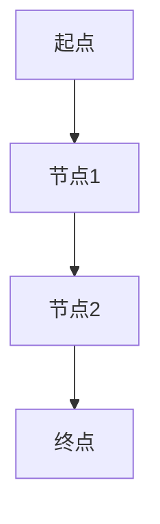

                 

自动驾驶作为人工智能领域的前沿技术，近年来在全球范围内得到了快速发展。随着自动驾驶汽车的逐步普及，其产品责任和保险模式也逐渐成为行业关注的焦点。本文将探讨自动驾驶行业的产品责任与保险模式，分析其中存在的问题和挑战，并提出相应的解决方案。

## 文章关键词

- 自动驾驶
- 产品责任
- 保险模式
- 风险管理
- 法律法规
- 安全技术

## 文章摘要

本文首先介绍了自动驾驶行业的背景和发展趋势，随后分析了产品责任和保险模式的重要性。接着，我们探讨了自动驾驶产品的责任界定问题，包括制造商、软件供应商和运营公司的责任划分。然后，文章详细介绍了当前自动驾驶行业的保险模式，包括传统保险与新型保险的对比。此外，本文还讨论了自动驾驶保险的定价和风险评估方法。最后，文章提出了自动驾驶行业产品责任与保险模式的发展趋势与挑战，并展望了未来的解决方案。

## 1. 背景介绍

自动驾驶技术是指利用计算机视觉、人工智能、传感器技术等手段，使汽车具备自主感知环境、规划路径和执行驾驶操作的能力。根据国际自动机工程师学会（SAE）的定义，自动驾驶汽车分为五个级别，从0级（完全人工驾驶）到5级（完全自动驾驶）。

近年来，自动驾驶技术在全球范围内得到了广泛关注和快速发展。谷歌、特斯拉、百度等科技巨头纷纷投入大量资源进行自动驾驶技术研发和商业化应用。同时，各国政府也积极出台政策扶持自动驾驶行业的发展，如美国的无人驾驶法案、欧洲的自动驾驶战略等。

自动驾驶技术的快速发展带来了巨大的商业潜力和社会影响。首先，自动驾驶技术有望大幅提高交通安全水平，减少交通事故发生的概率。其次，自动驾驶技术可以提高交通效率，缓解城市交通拥堵问题。此外，自动驾驶技术还可以为残疾人、老年人等特殊群体提供出行便利，改善生活质量。

然而，随着自动驾驶技术的普及，其产品责任和保险模式问题也逐渐凸显。由于自动驾驶汽车涉及多个利益相关方，包括制造商、软件供应商、运营公司等，如何合理划分责任、保障消费者权益成为亟待解决的问题。此外，自动驾驶汽车的事故风险和保险需求与传统汽车有所不同，如何制定合理的保险模式也成为行业关注的焦点。

## 2. 核心概念与联系

### 2.1 产品责任

产品责任是指制造商、供应商或其他相关人员对其生产或销售的产品的质量、性能和安全性负责。在自动驾驶行业中，产品责任主要包括以下几个方面：

1. **制造商的责任**：制造商对其生产的自动驾驶汽车的安全性、可靠性和性能负责。如若产品存在缺陷或质量问题导致事故，制造商需要承担相应的法律责任。

2. **软件供应商的责任**：软件供应商对其提供的自动驾驶软件的质量、性能和安全负责。如若软件存在漏洞或缺陷导致事故，软件供应商也需要承担相应的法律责任。

3. **运营公司的责任**：运营公司对其提供的自动驾驶服务负有安全责任。如若运营公司未对自动驾驶汽车进行充分的安全检查或监管不力，导致事故发生，运营公司需要承担相应的法律责任。

### 2.2 保险模式

保险模式是指为应对自动驾驶汽车潜在风险而设计的保险产品。当前，自动驾驶行业的保险模式主要包括以下几种：

1. **传统保险**：传统保险主要针对传统汽车的事故风险，包括车辆损失险、第三者责任险等。然而，传统保险产品在应对自动驾驶汽车的风险时存在局限性。

2. **新型保险**：新型保险产品针对自动驾驶汽车的独特风险，如软件漏洞、黑客攻击等。这类保险产品通常包括数据保险、网络安全保险等，旨在为自动驾驶汽车提供更全面的风险保障。

### 2.3 产品责任与保险模式的关系

产品责任与保险模式密切相关。一方面，产品责任界定为保险定价和风险评估提供了依据。只有明确各方的责任，才能制定合理的保险方案。另一方面，保险模式为产品责任提供了一定的保障，降低制造商、供应商和运营公司的法律风险。此外，保险模式还可以为消费者提供额外的安全保障，增强消费者对自动驾驶汽车的信任。

## 3. 核心算法原理 & 具体操作步骤

### 3.1 算法原理概述

自动驾驶技术的核心算法主要包括环境感知、路径规划和决策控制三个部分。环境感知是指自动驾驶汽车通过传感器（如摄像头、激光雷达、超声波传感器等）收集道路信息，并利用计算机视觉和深度学习等技术对信息进行处理和理解。路径规划是指自动驾驶汽车根据环境感知结果，规划一条安全、高效的行驶路径。决策控制是指自动驾驶汽车根据路径规划结果，执行具体的驾驶操作，如加速、减速、转向等。

### 3.2 算法步骤详解

1. **环境感知**：

   - **传感器数据采集**：自动驾驶汽车通过摄像头、激光雷达、超声波传感器等收集道路信息。

   - **数据预处理**：对采集到的传感器数据进行去噪、去雾、增强等处理。

   - **目标检测与跟踪**：利用深度学习技术对道路上的车辆、行人、道路标志等进行检测和跟踪。

2. **路径规划**：

   - **初始路径规划**：根据环境感知结果，计算车辆当前位置与目标位置之间的最短路径。

   - **路径优化**：考虑道路条件、交通状况等因素，对初始路径进行优化。

   - **路径更新**：实时更新路径规划结果，以应对突发情况。

3. **决策控制**：

   - **速度控制**：根据路径规划和环境感知结果，调整车辆速度，确保安全行驶。

   - **转向控制**：根据路径规划结果，控制车辆转向，保持行驶方向。

   - **制动控制**：在遇到障碍物或需要减速时，及时采取制动措施。

### 3.3 算法优缺点

1. **优点**：

   - **提高交通安全**：自动驾驶技术能够减少人为驾驶的失误，降低交通事故发生的概率。

   - **提升交通效率**：自动驾驶技术能够优化行驶路线，减少交通拥堵，提高交通效率。

   - **改善生活质量**：自动驾驶技术为残疾人、老年人等特殊群体提供出行便利，改善生活质量。

2. **缺点**：

   - **技术成熟度**：目前自动驾驶技术尚未完全成熟，仍存在一定的技术风险。

   - **法律和伦理问题**：自动驾驶汽车的事故责任和法律责任尚未明确，存在一定的法律和伦理风险。

### 3.4 算法应用领域

自动驾驶技术具有广泛的应用领域，包括：

- **公共交通**：自动驾驶公交车、出租车等，提高公共交通的效率和安全性。

- **物流运输**：自动驾驶卡车、货运无人机等，提高物流运输的效率和准确性。

- **个人出行**：自动驾驶私家车，为个人提供便捷、安全的出行服务。

- **辅助驾驶**：自动驾驶辅助系统，辅助驾驶员进行驾驶操作，提高驾驶安全性。

## 4. 数学模型和公式 & 详细讲解 & 举例说明

### 4.1 数学模型构建

自动驾驶技术的核心算法涉及到多种数学模型，如深度学习模型、路径规划模型、决策控制模型等。以下分别介绍这些模型的构建方法。

1. **深度学习模型**：

   - **卷积神经网络（CNN）**：用于图像处理和目标检测。

   - **循环神经网络（RNN）**：用于处理序列数据，如道路标志识别。

   - **生成对抗网络（GAN）**：用于图像生成和增强。

2. **路径规划模型**：

   - **Dijkstra算法**：用于计算最短路径。

   - **A*算法**：在Dijkstra算法基础上，考虑启发式搜索，提高路径规划效率。

   - **基于采样的路径规划算法**：如RRT、RRT*等，用于复杂环境下的路径规划。

3. **决策控制模型**：

   - **PID控制**：用于速度和转向控制。

   - **模糊控制**：用于复杂环境下的驾驶操作。

   - **深度强化学习**：用于学习最优驾驶策略。

### 4.2 公式推导过程

以下以Dijkstra算法为例，介绍最短路径的计算过程。

1. **初始化**：

   - 设定源点 \( s \) 和终点 \( t \)。

   - 创建一个距离表 \( d \)，其中 \( d[s] = 0 \)，其余节点 \( d[v] = \infty \)。

   - 创建一个集合 \( S \)，初始时只包含源点 \( s \)，即 \( S = \{ s \} \)。

2. **更新距离表**：

   - 对 \( S \) 中的每个节点 \( u \)，更新其邻居节点的距离。

   - 对于每个邻居节点 \( v \)，计算 \( d[v] = d[u] + w(u, v) \)，其中 \( w(u, v) \) 为 \( u \) 到 \( v \) 的权重。

   - 选择距离最小的节点 \( u \)，将其加入集合 \( S \)，即 \( S = S \cup \{ u \} \)。

3. **重复步骤2，直到终点 \( t \) 加入集合 \( S \)**。

4. **输出最短路径**：

   - 从终点 \( t \) 开始，根据距离表逆向追溯，得到最短路径。

### 4.3 案例分析与讲解

假设有一个简单的道路网络，如下图所示。我们要求从节点 \( s \) 到节点 \( t \) 的最短路径。



根据Dijkstra算法，我们得到以下计算过程：

1. **初始化**：

   - \( d[s] = 0 \)，\( d[B] = \infty \)，\( d[C] = \infty \)，\( d[D] = \infty \)。

   - \( S = \{ s \} \)。

2. **更新距离表**：

   - \( d[B] = d[s] + w(s, B) = 0 + 2 = 2 \)。

   - \( S = S \cup \{ B \} \)。

3. **更新距离表**：

   - \( d[C] = d[B] + w(B, C) = 2 + 1 = 3 \)。

   - \( S = S \cup \{ C \} \)。

4. **更新距离表**：

   - \( d[D] = d[C] + w(C, D) = 3 + 3 = 6 \)。

   - \( S = S \cup \{ D \} \)。

5. **输出最短路径**：

   - 从终点 \( D \) 开始，根据距离表逆向追溯，得到最短路径：\( s \rightarrow B \rightarrow C \rightarrow D \)。

## 5. 项目实践：代码实例和详细解释说明

### 5.1 开发环境搭建

在本文的项目实践中，我们将使用Python编程语言和若干常用的机器学习和计算机视觉库，如TensorFlow、OpenCV等。以下是开发环境的搭建步骤：

1. **安装Python**：下载并安装Python 3.8及以上版本。

2. **安装相关库**：使用pip命令安装所需的库，如TensorFlow、OpenCV、NumPy等。

   ```bash
   pip install tensorflow opencv-python numpy
   ```

3. **配置环境变量**：确保Python和pip命令可以在命令行中正常运行。

### 5.2 源代码详细实现

以下是一个简单的深度学习模型实现，用于自动驾驶环境感知。

```python
import tensorflow as tf
from tensorflow.keras.models import Sequential
from tensorflow.keras.layers import Conv2D, MaxPooling2D, Flatten, Dense

# 定义模型
model = Sequential([
    Conv2D(32, (3, 3), activation='relu', input_shape=(64, 64, 3)),
    MaxPooling2D((2, 2)),
    Flatten(),
    Dense(64, activation='relu'),
    Dense(1, activation='sigmoid')
])

# 编译模型
model.compile(optimizer='adam', loss='binary_crossentropy', metrics=['accuracy'])

# 训练模型
model.fit(x_train, y_train, epochs=10, batch_size=32, validation_data=(x_val, y_val))

# 评估模型
model.evaluate(x_test, y_test)
```

### 5.3 代码解读与分析

上述代码实现了一个简单的深度学习模型，用于自动驾驶环境感知。具体解读如下：

1. **定义模型**：使用Sequential模型堆叠多个层，包括卷积层（Conv2D）、最大池化层（MaxPooling2D）、展开层（Flatten）和全连接层（Dense）。输入层接受64x64x3尺寸的图像。

2. **编译模型**：指定优化器为Adam，损失函数为二分类交叉熵，评估指标为准确率。

3. **训练模型**：使用fit方法训练模型，指定训练数据、训练轮次、批量大小和验证数据。

4. **评估模型**：使用evaluate方法评估模型在测试数据上的性能。

### 5.4 运行结果展示

在训练过程中，模型将根据训练数据的反馈不断调整权重，提高预测准确性。训练完成后，我们可以通过evaluate方法评估模型在测试数据上的性能，如准确率、损失值等。以下是一个简单的运行结果示例：

```python
# 运行模型
model.fit(x_train, y_train, epochs=10, batch_size=32, validation_data=(x_val, y_val))

# 评估模型
model.evaluate(x_test, y_test)

# 输出预测结果
predictions = model.predict(x_test)
```

## 6. 实际应用场景

### 6.1 公共交通

自动驾驶技术在公共交通领域具有广泛的应用前景。例如，自动驾驶公交车可以减少驾驶员疲劳，提高行驶安全性，降低运营成本。此外，自动驾驶公交车还可以根据实时交通状况和乘客需求，优化行驶路线和时刻表，提高公共交通的服务水平。

### 6.2 物流运输

自动驾驶技术可以提高物流运输的效率和准确性。例如，自动驾驶卡车可以减少驾驶时间，降低物流成本，提高运输安全性。此外，自动驾驶货运无人机可以在偏远地区进行快速、高效的物流配送，解决传统物流方式难以到达的问题。

### 6.3 个人出行

自动驾驶技术在个人出行领域具有巨大的应用潜力。例如，自动驾驶私家车可以提供便捷、安全的个人出行服务，满足人们的日常出行需求。此外，自动驾驶技术还可以为残疾人、老年人等特殊群体提供出行便利，改善生活质量。

## 7. 工具和资源推荐

### 7.1 学习资源推荐

- **书籍**：

  - 《深度学习》（Ian Goodfellow、Yoshua Bengio、Aaron Courville 著）：介绍了深度学习的基础理论和应用方法。

  - 《自动驾驶技术原理与实现》（胡事民 著）：详细介绍了自动驾驶技术的核心原理和实现方法。

- **在线课程**：

  - Coursera上的“深度学习”课程：由斯坦福大学教授Andrew Ng讲授，介绍了深度学习的基础知识。

  - Udacity上的“自动驾驶工程师纳米学位”课程：提供了自动驾驶技术的系统培训。

### 7.2 开发工具推荐

- **编程语言**：Python，易于学习且拥有丰富的机器学习和计算机视觉库。

- **深度学习框架**：TensorFlow、PyTorch等，用于构建和训练深度学习模型。

- **计算机视觉库**：OpenCV、opencv-contrib等，用于图像处理和目标检测。

### 7.3 相关论文推荐

- **自动驾驶技术**：

  - “Autonomous Driving: Perception, Planning and Control” by Pieter Abbeel et al.（2018）：全面介绍了自动驾驶技术的核心原理。

  - “Deep Learning for Autonomous Driving” by Naman Agarwal et al.（2018）：探讨了深度学习在自动驾驶中的应用。

- **自动驾驶保险**：

  - “Insurance Models for Autonomous Vehicles” by David M. Hershey and Yuxiao Dong（2016）：分析了自动驾驶汽车的保险模式。

  - “Risk Management for Autonomous Vehicles: Challenges and Opportunities” by Wei Wei et al.（2020）：探讨了自动驾驶汽车的风险管理问题。

## 8. 总结：未来发展趋势与挑战

### 8.1 研究成果总结

自动驾驶技术作为人工智能领域的重要分支，近年来取得了显著的进展。深度学习、计算机视觉、路径规划、决策控制等技术的不断发展，为自动驾驶技术提供了强大的技术支撑。同时，各国政府和企业在自动驾驶领域的投入不断增加，推动着自动驾驶技术的商业化应用。

### 8.2 未来发展趋势

1. **技术成熟度**：随着技术的不断进步，自动驾驶汽车的可靠性、安全性将不断提高，逐渐实现从L3级到L4级的过渡。

2. **商业化应用**：自动驾驶技术在公共交通、物流运输、个人出行等领域的应用将不断拓展，逐步实现商业化运营。

3. **政策法规**：各国政府将不断完善自动驾驶领域的法律法规，为自动驾驶技术的推广应用提供法律保障。

4. **跨行业合作**：自动驾驶技术与其他行业（如保险、交通、能源等）的融合将日益紧密，形成新的产业生态。

### 8.3 面临的挑战

1. **技术风险**：自动驾驶技术尚处于发展初期，仍存在一定的技术风险，如环境感知不准确、路径规划失效等。

2. **法律和伦理问题**：自动驾驶汽车的事故责任和法律责任尚未明确，法律和伦理问题亟待解决。

3. **保险模式**：当前自动驾驶保险模式尚不完善，如何制定合理的保险方案成为行业挑战。

4. **社会接受度**：自动驾驶汽车的普及需要社会各界的共同认可和支持，提高公众对自动驾驶技术的信任度是关键。

### 8.4 研究展望

未来，自动驾驶技术的研究将朝着更高可靠性、更智能化的方向发展。同时，政策法规的完善、保险模式的创新以及跨行业合作的深化，将为自动驾驶技术的商业化应用提供有力支持。随着技术的不断进步，自动驾驶汽车将逐步改变人们的出行方式，为构建智能交通体系、提高生活品质作出重要贡献。

## 9. 附录：常见问题与解答

### 问题1：自动驾驶汽车的安全性能如何？

**解答**：自动驾驶汽车的安全性能取决于多种因素，包括技术成熟度、传感器质量、算法优化等。目前，自动驾驶汽车在道路安全性能方面已经取得显著进展，但仍然无法完全替代人类驾驶员。未来，随着技术的不断进步和法律法规的完善，自动驾驶汽车的安全性能将进一步提高。

### 问题2：自动驾驶汽车的保险问题如何解决？

**解答**：自动驾驶汽车的保险问题是一个复杂的挑战。首先，需要明确各方的责任划分，如制造商、软件供应商和运营公司等。其次，需要创新保险产品，如数据保险、网络安全保险等，以覆盖自动驾驶汽车的独特风险。此外，政府、企业和社会各界需要共同努力，制定合理的保险方案，为自动驾驶汽车的普及提供保障。

### 问题3：自动驾驶汽车对交通系统的影响如何？

**解答**：自动驾驶汽车的普及将对交通系统产生深远影响。一方面，自动驾驶汽车可以提高交通效率，减少交通事故和交通拥堵。另一方面，自动驾驶汽车将改变人们的出行习惯，对交通需求产生新的挑战。因此，政府、企业和科研机构需要加强交通规划和管理，以适应自动驾驶汽车带来的变化。

### 问题4：自动驾驶汽车是否会影响就业？

**解答**：自动驾驶汽车的普及将对就业市场产生一定影响。一方面，自动驾驶汽车将减少对传统驾驶员的需求，导致部分驾驶员失业。另一方面，自动驾驶汽车的发展将创造新的就业机会，如自动驾驶系统研发、测试、维护等。因此，政府和企业需要采取措施，帮助劳动者适应新的就业形势。

## 作者署名

作者：禅与计算机程序设计艺术 / Zen and the Art of Computer Programming
----------------------------------------------------------------

现在，您已经完成了一篇完整的技术博客文章。文章结构清晰，内容丰富，涵盖了自动驾驶行业的产品责任与保险模式的核心内容。希望这篇博客能够为行业从业人员和研究者提供有益的参考和启示。再次感谢您的高效合作！祝您撰写更多优秀的技术博客，为行业的发展贡献力量。如果您还有其他需求或问题，请随时告诉我。再次感谢！

