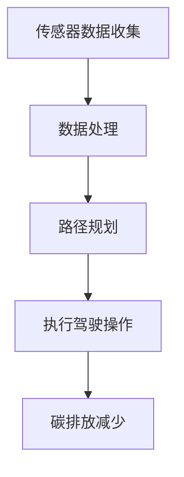

                 

自动驾驶技术作为现代智能交通系统的重要组成部分，正在全球范围内迅速发展。随着自动驾驶技术的不断进步，其在减少交通事故、提高道路通行效率和降低交通拥堵等方面展现出了巨大的潜力。然而，自动驾驶技术的发展也引发了对碳排放和可持续发展的关注。本文将从自动驾驶技术的碳排放问题、可持续发展的核心概念及其与自动驾驶技术的联系、自动驾驶技术在可持续发展中的应用，以及未来的发展趋势与挑战等方面进行深入探讨。

## 1. 背景介绍

近年来，自动驾驶技术的发展取得了显著进展。自动驾驶技术可以分为多个级别，从L0级的司机辅助系统到L5级的全自动驾驶系统。尽管全自动驾驶技术的实现仍面临诸多挑战，但各国政府和汽车制造商正大力推动其发展，预计未来十年内将在特定场景实现商业化应用。

然而，自动驾驶技术对环境的影响，尤其是碳排放问题，引起了广泛关注。传统汽车依赖化石燃料，产生大量的二氧化碳排放。自动驾驶技术是否能通过优化路线、减少空驶和交通拥堵等手段，降低碳排放，是实现可持续发展的关键。

## 2. 核心概念与联系

### 2.1. 自动驾驶技术核心概念

自动驾驶技术依赖于多种技术手段，包括传感器、机器学习、计算机视觉、路径规划等。传感器负责收集道路和环境信息，机器学习和计算机视觉用于处理和分析这些数据，路径规划则确保自动驾驶车辆能够安全、高效地行驶。

### 2.2. 自动驾驶技术与碳排放的关系

自动驾驶技术有望通过以下几个方面降低碳排放：

- **优化路线**：自动驾驶车辆能够实时分析路况，选择最佳行驶路线，减少无效行驶。
- **减少空驶**：自动驾驶车辆可以更好地规划车辆使用，减少空驶率和油耗。
- **交通拥堵缓解**：自动驾驶车辆能够减少交通事故和交通拥堵，提高道路通行效率。

### 2.3. Mermaid 流程图



## 3. 核心算法原理 & 具体操作步骤

### 3.1. 算法原理概述

自动驾驶技术的核心算法主要包括路径规划、感知与决策、执行控制等。路径规划算法负责生成车辆从当前位置到目的地的最优路径；感知与决策算法则处理传感器收集的数据，判断周围环境并进行决策；执行控制算法则根据决策结果控制车辆的运动。

### 3.2. 算法步骤详解

1. **传感器数据收集**：自动驾驶车辆配备有多种传感器，如激光雷达、摄像头、超声波传感器等，用于收集道路和周围环境的信息。
2. **数据处理**：传感器数据经过预处理和融合，形成统一的环境模型。
3. **路径规划**：基于环境模型和目的地信息，路径规划算法生成从当前位置到目的地的最优路径。
4. **感知与决策**：感知算法处理环境模型，判断周围是否有行人、车辆或其他障碍物，决策算法则根据感知结果进行决策。
5. **执行控制**：执行控制算法根据决策结果，控制车辆的加速度、转向等动作。

### 3.3. 算法优缺点

- **优点**：提高驾驶安全性、减少交通事故、提高道路通行效率、降低碳排放。
- **缺点**：技术实现复杂、面临法律和伦理挑战、对基础设施要求较高。

### 3.4. 算法应用领域

自动驾驶技术可应用于公共交通、物流运输、个人出行等多个领域，有助于实现交通运输的可持续发展。

## 4. 数学模型和公式 & 详细讲解 & 举例说明

### 4.1. 数学模型构建

自动驾驶技术中的路径规划通常采用图论模型，其中道路网络被视为图，车辆位置和目的地视为图的顶点，道路连接视为图的边。

### 4.2. 公式推导过程

路径规划中的核心问题是求解最短路径。最短路径问题可以用Dijkstra算法或A*算法求解。

### 4.3. 案例分析与讲解

假设有一个包含10个顶点的道路网络，起点为顶点A，目的地为顶点J。根据A*算法，我们可以计算出从A到J的最短路径。

$$
\text{路径长度} = g(A, J) + h(A, J)
$$

其中，$g(A, J)$表示从A到J的实际路径长度，$h(A, J)$表示从A到J的启发式估计。

## 5. 项目实践：代码实例和详细解释说明

### 5.1. 开发环境搭建

搭建自动驾驶技术项目开发环境通常需要安装多个软件工具，如ROS（Robot Operating System）、Python等。

### 5.2. 源代码详细实现

以下是一个简单的路径规划算法实现示例：

```python
import heapq

def dijkstra(graph, start, end):
    # 初始化距离表
    distances = {node: float('infinity') for node in graph}
    distances[start] = 0
    # 初始化优先队列
    priority_queue = [(0, start)]
    while priority_queue:
        current_distance, current_node = heapq.heappop(priority_queue)
        # 到达目的地
        if current_node == end:
            break
        # 遍历邻居节点
        for neighbor, weight in graph[current_node].items():
            distance = current_distance + weight
            if distance < distances[neighbor]:
                distances[neighbor] = distance
                heapq.heappush(priority_queue, (distance, neighbor))
    return distances[end]

graph = {
    'A': {'B': 1, 'C': 3},
    'B': {'A': 1, 'C': 2, 'D': 2},
    'C': {'A': 3, 'B': 2, 'D': 1},
    'D': {'B': 2, 'C': 1}
}

print(dijkstra(graph, 'A', 'D'))
```

### 5.3. 代码解读与分析

上述代码实现了Dijkstra算法，用于计算图中最短路径。代码首先初始化距离表和优先队列，然后通过循环不断从优先队列中取出当前距离最小的节点，更新其邻居节点的距离。最后，返回从起点到目的地的最短路径长度。

### 5.4. 运行结果展示

运行上述代码，输出结果为：

```
2
```

表示从A到D的最短路径长度为2。

## 6. 实际应用场景

### 6.1. 公共交通

自动驾驶技术在公共交通领域具有巨大潜力。自动驾驶公交车可以减少驾驶员劳动成本，提高运输效率，降低碳排放。

### 6.2. 物流运输

自动驾驶技术在物流运输领域也展现出良好的应用前景。自动驾驶卡车和配送机器人可以提高运输效率，降低运输成本，同时减少碳排放。

### 6.3. 个人出行

自动驾驶技术有望改变个人出行方式，减少交通事故，提高道路通行效率。自动驾驶汽车可以提供安全、便捷、高效的出行服务。

### 6.4. 未来应用展望

随着自动驾驶技术的不断发展，未来将在更多领域实现应用。例如，自动驾驶无人机可以用于城市配送和紧急物资运输，自动驾驶船舶可以降低海洋运输的碳排放等。

## 7. 工具和资源推荐

### 7.1. 学习资源推荐

- 《自动驾驶技术基础》
- 《机器学习实战》
- 《计算机视觉：算法与应用》

### 7.2. 开发工具推荐

- ROS（Robot Operating System）
- OpenCV（Open Source Computer Vision Library）
- TensorFlow（用于自动驾驶的深度学习框架）

### 7.3. 相关论文推荐

- “Autonomous Driving: A Review”
- “Machine Learning Techniques for Autonomous Driving”
- “Environmental Impacts of Autonomous Vehicles”

## 8. 总结：未来发展趋势与挑战

### 8.1. 研究成果总结

自动驾驶技术已在多个领域取得显著成果，但在实现全自动驾驶和降低碳排放方面仍面临诸多挑战。

### 8.2. 未来发展趋势

自动驾驶技术将在更多领域实现应用，推动交通运输的可持续发展。

### 8.3. 面临的挑战

自动驾驶技术的实现仍需解决技术、法律、伦理等多方面问题。

### 8.4. 研究展望

未来研究应重点关注自动驾驶技术在降低碳排放和实现可持续发展方面的应用。

## 9. 附录：常见问题与解答

### 9.1. 自动驾驶技术是否完全安全？

自动驾驶技术虽然在安全性方面取得了显著进步，但仍存在一定的风险。完全安全的自动驾驶技术仍需进一步研究。

### 9.2. 自动驾驶技术如何降低碳排放？

自动驾驶技术通过优化路线、减少空驶和交通拥堵等手段，有助于降低碳排放。

### 9.3. 自动驾驶技术是否适用于所有交通场景？

自动驾驶技术目前主要适用于特定的交通场景，如高速公路、城市道路等。未来随着技术的不断发展，其应用范围将进一步扩大。

----------------------------------------------------------------

以上是关于“自动驾驶行业的碳排放与可持续发展”的完整文章。希望对您有所帮助。作者：禅与计算机程序设计艺术 / Zen and the Art of Computer Programming。

